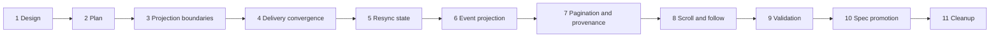

# Chat Timeline Reliability Hardening Implementation Plan

## Feature Summary

Implement the decisions in [Chat Timeline Reliability Hardening Design](./chat-timeline-reliability-hardening.md) as an 11-PR stack. The stack restores the existing canonical history/live, subscription barrier, detached history, requested intent, and follow-state contracts without introducing compatibility fallbacks.

## Stack

| PR | Branch | Base | Scope |
| --- | --- | --- | --- |
| 1/11 | `design/chat-timeline-reliability` | `main` | Final design and autonomous decisions |
| 2/11 | `plan/chat-timeline-reliability` | PR 1 | Multi-phase implementation and validation plan |
| 3/11 | `fix/chat-timeline-projection-boundaries` | PR 2 | Worker projection fault isolation and REST commit/wake ordering |
| 4/11 | `fix/chat-timeline-delivery-convergence` | PR 3 | Canonical WS delivery, subscription confirmation, run-correlated live cleanup, promotion order |
| 5/11 | `fix/chat-timeline-resync-state` | PR 4 | Finite client resync transaction and detached observation isolation |
| 6/11 | `fix/chat-timeline-event-projection` | PR 5 | Raw event window, output identity, provider results, live agent messages |
| 7/11 | `fix/chat-timeline-pagination-provenance` | PR 6 | Raw cursors, bidirectional flags, durable action history, requested input intent |
| 8/11 | `fix/chat-timeline-scroll-follow` | PR 7 | Follow boundary, user-intent override, viewport fill, chip accessibility |
| 9/11 | `test/chat-timeline-reliability` | PR 8 | Cross-layer deterministic validation and E2E evidence |
| 10/11 | `docs/chat-timeline-reliability-spec` | PR 9 | Living Spec promotion and design implementation marker |
| 11/11 | `chore/chat-timeline-reliability-cleanup` | PR 10 | Remove this temporary implementation plan and stale references |

Every PR is based on its immediate predecessor. Descendants are rebased with `scripts/rebase-stacked-prs.sh` when an earlier phase changes.

## Phase Dependencies

## PR 3: Projection Boundaries

### Behavior

- Catch live-store and WebSocket publication failures at Worker projection boundaries while preserving `CancelledError`.
- Ensure Agent Run start, retry state, phase transitions, provider invocation, terminal persistence, and cleanup do not fail because UI projection is unavailable.
- Decouple committed REST writes and deletes from best-effort WebSocket publication.
- Preserve broker wake-up as an essential operation and make its ordering explicit.
- Stop user-stop finalization from clearing stop/activity recovery state when terminal persistence fails.

### Data and API

No schema change.

### Tests

- Failure injection for `publish_live_run_updated`, partial flush, active tool publication, and `publish_live_run_cleared`.
- REST input, goal resume, and buffer delete after broadcast failure.
- User-stop terminal persistence partial failure and retry convergence.

## PR 4: Delivery Convergence

### Behavior

- Remove raw durable Event frames from the public Chat WebSocket path.
- Consume Redis subscribe confirmation before `subscribed`.
- Tie health-check ack to the confirmed send-loop subscription generation.
- Reconcile live cleanup by exact durable Run authority instead of process-local fallback.
- Publish deterministic active-tool removal across Worker restart/takeover.
- Flush pending partials before the durable handoff boundary and remove all exact assistant/reasoning counterparts.

### Data and API

Transport wire narrows to the already documented canonical action contract. No generated API client change is expected.

### Tests

- Exact public frame count and ordering.
- Real/fake Redis subscribe-confirmation barrier.
- Health check while listener is stale or replaced.
- Delayed Run A terminal after Run B takeover.
- Active tool removal after projector recreation.
- Multiple assistant content indices and reasoning promotion.

## PR 5: Resync State

### Behavior

- Replace independent initial/resume/latest reload paths with one finite resync transaction.
- Perform one health check per transaction.
- Associate explicit fresh REST results with epoch/generation; never accept retained query cache as a new baseline.
- Replay buffered observations and leave buffering on every REST failure.
- Reject malformed and wrong-session frames without aborting later replay.
- Keep detached visible history immutable and mark only confirmed newer gaps.

### Tests

- Initial, periodic, resume, and latest-reset success/failure.
- Concurrent lifecycle signals and resync supersession.
- Malformed frame followed by valid frames.
- Detached durable/live observations and latest reset.

## PR 6: Event Projection

### Behavior

- Store raw durable history events and raw live projections separately from `ChatMessage` view models.
- Build selector identity from durable event/native output/turn keys instead of session-global event-kind keys.
- Merge tool call/result across raw page boundaries.
- Render provider tool result status/output/attachments.
- Render live `agent_message` using the durable internal-agent row.
- Make assistant live-to-durable promotion a history-priority selector transition without duplicate frames.

### Tests

- Multiple reasoning turns.
- Cross-page tool pair projection.
- Provider text, attachment-only, and failed result.
- Live-to-durable assistant/reasoning/internal-agent promotion.

## PR 7: Pagination and Provenance

### Behavior

- Track `next_cursor` and `previous_cursor` from raw API pages.
- Compute directionally accurate `has_more` and `has_newer` in the repository.
- Advance through control-only pages.
- Preserve durable terminal `action_execution_result` cards in detached history while hiding nonterminal live progress.
- Add immutable requested inference intent to human input event transport.
- Render absent historical requested intent as unavailable without applied/default fallback.
- Regenerate OpenAPI and generated clients.

### Tests

- Default, before, and after pagination in both directions.
- Empty/render-hidden page cursor advance.
- Durable action result in detached history.
- Requested target/nullable effort round-trip and historical absence.

## PR 8: Scroll and Follow

### Behavior

- Use one documented bottom/bounce boundary for follow state.
- Let explicit wheel, touch, keyboard, and scrollbar intent override programmatic-scroll protection.
- Restore saved non-follow positions independently from follow-entry hysteresis.
- Fetch older raw pages until the viewport is scrollable or history is exhausted.
- Replace the clickable Badge with a keyboard-accessible button.
- Remove or integrate the unused pull-to-refresh hook; because no product contract references pull-to-refresh, remove the dead hook.

### Tests

- 48px boundary and iOS bounce.
- Repeated streaming resize while user scrolls upward.
- Saved 60px/100px detached positions.
- Underfilled/control-only initial pages.
- Keyboard activation and accessible name for latest reset.

## PR 9: Validation

### Scope

- Add or consolidate cross-layer E2E cases that require the complete stack.
- Run backend Ruff, Pyright, focused/full Pytest as practical.
- Run TypeScript format, lint, typecheck, and build.
- Run deterministic Azents E2E matrix.
- Record environment, commands, results, evidence, and implementation/spec comparison in a QA report under `docs/azents/design/`.
- Fix validation-only integration defects in this PR. If a phase-owning defect is substantial, apply it to the earliest owner and rebase descendants.

## PR 10: Spec Promotion

### Spec candidates

- `docs/azents/spec/domain/conversation.md`
- `docs/azents/spec/flow/agent-execution-loop.md`
- `docs/azents/spec/flow/chat-session-resync.md`

### Changes

- Record non-fatal projection boundaries.
- Align public WS taxonomy and confirmed subscription barriers.
- Define finite resync failure behavior and detached observation isolation.
- Define raw pagination cursor and selector identity rules.
- Add provider result, live agent message, durable action result, and requested intent contracts.
- Align durable event taxonomies across specs.
- Mark the design implemented only after validation passes.

No existing ADR is modified. The implementation restores accepted ADR behavior, so a new ADR is not planned unless validation exposes a genuinely new persistent decision.

## PR 11: Cleanup

- Delete this implementation plan.
- Remove stale temporary QA references that are no longer useful.
- Regenerate docs index.
- Do not change runtime behavior.

## E2E Primary Validation Matrix

| ID | User-visible behavior | Primary validation | Required fixture |
| --- | --- | --- | --- |
| E2E-1 | Chat remains usable after failed initial/latest REST sync | Browser route failure + deterministic WS observations | Existing session fixture |
| E2E-2 | Detached history remains stable while new events arrive | Browser scroll/pagination + deterministic model continuation | Existing chat model fixture |
| E2E-3 | Reasoning from consecutive turns remains visible | Two-turn deterministic reasoning stream | Aimock reasoning fixture |
| E2E-4 | Provider result and generated image/file appear | Seeded/provider-result deterministic event fixture | New deterministic provider result seed |
| E2E-5 | Tool call/result survives page boundary | Seeded transcript around configured limit | New transcript seed helper |
| E2E-6 | Live internal-agent message promotes without disappearance | Parent/child session and collaboration message | Existing subagent fixture extension |
| E2E-7 | Terminal worktree action remains visible in detached history | Seeded completed action result | Existing worktree fixture or direct seed |
| E2E-8 | User can leave follow during rapid streaming | Browser wheel/touch during batched deltas | Existing streaming fixture |
| E2E-9 | Requested model/effort intent remains historical | Send with target/effort, change Composer, reload | Existing selectable model fixture |

## Fixture and Prerequisite Requirements

- All mandatory scenarios use deterministic local services and seeded database state.
- No external model, OAuth, Redis Cloud, or provider credential is required.
- Aimock gains deterministic multi-turn reasoning and provider-result output only if current primitives cannot express them.
- Transcript seed support may place call/result and control events around a page limit.
- Redis fault injection uses test doubles or the local integration Redis service.
- Browser route interception is preferred for REST failure. No production-only fault switch is added.

## Validation by Phase

| Phase | Required checks |
| --- | --- |
| Docs | docs index generation/check and pre-commit hooks |
| Backend | targeted Ruff, Pyright, Pytest; relevant repository/API/worker integration tests |
| API schema | dump OpenAPI, regenerate Python/TypeScript public clients, generated diff check |
| Frontend | Prettier, ESLint, `@azents/web` typecheck/build, component stories for changed pure UI |
| Testenv | Pyright and focused deterministic E2E |
| Full stack | current-head CI for all 11 PRs after the entire stack is opened |

## Failure and Skip Policy

- Deterministic unit, integration, and E2E cases are mandatory and must not skip.
- Live-provider smoke tests are optional and may skip only for unavailable credentials.
- Docker/runtime-dependent local tests may be deferred to CI only when the local runtime is unavailable; the exact reason is recorded in PR 9.
- A flaky deterministic test is treated as a failure and diagnosed rather than retried into green without evidence.

## Evidence Format

PR 9 records:

- command;
- environment and prerequisite state;
- pass/fail/skip counts;
- artifact or screenshot references for browser cases;
- failure root cause and owning phase;
- final implementation-to-spec matrix.

## Blockers

None known. Redis subscription confirmation semantics must be validated against the pinned redis-py version in PR 4, but this is an implementation task rather than an external prerequisite.

## Rollout and Cleanup

No feature flag or database backfill is planned. The stack restores documented behavior and narrows the public WebSocket wire to its accepted canonical contract. The temporary plan is removed in PR 11 after spec promotion.
