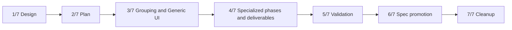

# Chat Tool Activity Grouping Implementation Plan

## Feature Summary

Implement the approved [Chat Tool Activity Grouping](chat-tool-activity-grouping.md) design and [ADR-0173](../adr/0173-group-chat-tool-activity-in-the-frontend.md) as a frontend-only chat presentation change.

The shipped behavior will collapse continuous tool-only work into one fixed-title `Activity` group, preserve grouping across model turns, expose ordered phase summaries before individual details, use specialized renderers only for validated known payloads, retain Generic Tool Call as the compatibility fallback, and close groups at explicit user-visible delivery boundaries.

Backend event, API, storage, and live-state contracts remain unchanged.

## Delivery Shape

The feature uses a seven-PR stack because the work contains separately reviewable architecture, projection/UI, specialization, validation, spec-promotion, and cleanup boundaries.

| PR | Branch purpose | Scope |
| --- | --- | --- |
| 1/7 | Design | Approved design and ADR. |
| 2/7 | Implementation plan | Delivery phases, dependencies, validation matrix, and prerequisites. |
| 3/7 | Phase 1 — Grouping and Generic UI | Ordered presentation projection, multi-turn grouping, fixed collapsed group UI, phase disclosure shell, Generic Tool Call details, and focused unit/Storybook tests. |
| 4/7 | Phase 2 — Specialized phases and deliverables | Validated adapter registry, known phase summaries, promoted user-facing deliverables, approval integration, and attachment-boundary tests. |
| 5/7 | Validation | Deterministic browser/Storybook validation, regression fixes, accessibility, responsive dark/light evidence, and implementation-versus-spec comparison. |
| 6/7 | Spec promotion | Conversation living-spec update and design implementation date after validation succeeds. |
| 7/7 | Cleanup | Remove this temporary implementation plan and obsolete visual-review-only source. |

All PRs use the title prefix `Chat tool activity [N/7]` and are stacked in the order above.

## Dependencies

- Phase 1 depends on the accepted frontend ownership and grouping rules.
- Phase 2 depends on stable presentation atoms, group identity, and Generic fallback from Phase 1.
- Validation depends on complete user-visible behavior from both implementation phases.
- Spec promotion is blocked until deterministic validation passes and drift is resolved.
- Cleanup is blocked until implementation and living specs are complete.

## PR 3/7: Phase 1 — Grouping and Generic UI

### Scope

- Introduce pure frontend presentation atoms for visible assistant content, tool calls, delivery/control boundaries, and non-boundary metadata.
- Project the already ordered chat timeline into presentation items without changing history/live reducers or backend contracts.
- Group adjacent client/provider tool calls across model turns according to the approved continuation and termination rules.
- Render one fixed-title `Activity` row collapsed by default.
- Add Level 1 ordered phase disclosure using a Generic `Other tool activity` phase until specialized adapters arrive.
- Add Level 2 Generic Tool Call details preserving raw arguments, output, status, and attachments.
- Preserve `call_id` live-to-durable replacement and stable disclosure state.
- Keep failure counts and approval presence available to the group summary where current projections expose them.
- Remove individual top-level tool-card rendering from message-local composition once grouped rendering is active.

### Runtime and data changes

- Frontend-only internal presentation types and pure projection functions.
- No public TypeScript client, OpenAPI, REST, WebSocket, event, or database changes.
- Existing `ActiveToolCall` and `ProviderToolCall` remain source view models.

### Tests

- Node unit tests for grouping start, continuation, termination, order, and stable identity.
- Unit tests for mixed client/provider calls and live-to-durable replacement.
- Component stories for collapsed, expanded Generic phase, running, failed, and unknown payload states.
- TypeScript format, lint, typecheck, unit tests, and Storybook build.

### Review boundary

This PR establishes the generic end-to-end interaction without claiming semantic knowledge of specific tool payloads. Every call remains inspectable through Generic Tool Call.

## PR 4/7: Phase 2 — Specialized Phases and Deliverables

### Scope

- Introduce the explicit frontend tool-presentation registry.
- Add schema validation and exception isolation at the per-call adapter boundary.
- Implement initial specialized adapters only for existing stable payloads demonstrated by repository fixtures.
- Produce deterministic ordered phase summaries from validated adapter output.
- Promote validated user-facing images/files outside the activity group.
- Close the group before assistant text, assistant-level attachments/artifacts, or promoted deliverables.
- Keep operational and unknown attachments inside tool details.
- Prevent promoted deliverables from rendering twice.
- Integrate pending approval as a compact `Review` action without splitting the group.
- Preserve Generic fallback for unknown tools, invalid variants, malformed payloads, unsupported running states, and adapter exceptions.

### Initial adapter candidates

The implementation phase must confirm actual fixture shapes before registration. Likely candidates are:

- repository file read/search operations;
- command or test execution with deterministic exit/result fields;
- file edit/diff operations with deterministic changed-file metadata;
- provider/client image generation with canonical projected attachments.

An adapter is omitted rather than partially implemented when the current UI projection does not retain a stable validated shape.

### Runtime and data changes

- Frontend-only registry and adapter result models.
- No backend semantic kind, normalized artifact, or presentation summary fields.
- Existing shared attachment gallery/tile/viewer primitives render promoted deliverables.

### Tests

- Adapter tests for valid completed, valid running, malformed, unknown, and exception cases.
- Phase aggregation tests preserving adjacency and order.
- Delivery-boundary tests for assistant text, assistant attachments, specialized deliverables, and later resumed tool activity.
- Attachment tests for promotion, Generic retention, and no duplicate rendering.
- Approval interaction and accessibility stories.
- TypeScript quality checks and Storybook build.

### Review boundary

This PR adds semantic presentation without weakening Generic compatibility or changing canonical data ownership.

## PR 5/7: Validation

### Scope

- Exercise the complete implementation under deterministic browser conditions.
- Add missing deterministic fixtures or harness support required for the primary scenarios.
- Fix behavior, accessibility, responsive, theme, or projection regressions discovered by validation.
- Record validation evidence and a strict implementation-versus-current-spec comparison.

### E2E primary validation matrix

| Scenario | Expected result |
| --- | --- |
| Multiple tool-only model turns | One collapsed `Activity` group. |
| Visible assistant text between tool sequences | Two groups separated by text. |
| Assistant attachment/artifact delivery | Group closes before the delivery. |
| Validated generated image/file | Deliverable renders outside the group; later tools start a new group. |
| Reasoning, turn marker, retry, or compaction | Existing group continues. |
| Permission pause/resume | Existing group continues and exposes `Review`. |
| Terminal Run followed by a new Run | New group starts. |
| Explicit task/subagent transition | Group splits. |
| Known valid payload | Specialized phase/detail renders. |
| Known invalid or malformed payload | Generic fallback renders without timeline failure. |
| Unknown attachment | Remains inside Generic detail. |
| Failed call while collapsed | Failure remains visible. |
| Live-to-durable replacement | No duplicate, disappearance, or disclosure reset. |
| Light/dark desktop | Low-stimulation hierarchy and readable contrast. |
| Narrow/mobile viewport | No horizontal page overflow; critical state remains visible. |

### E2E plan

- Prefer deterministic Storybook/browser fixtures that use real chat components, providers, theme, fonts, and projected timeline data.
- Use the authenticated full-stack E2E surface only where history/live/action ordering cannot be represented faithfully in a frontend fixture.
- Pause live fixture progression to inspect grouped streaming state, then release durable replacement and delivery boundaries.
- Assert semantic roles, accessible names, order, expansion state, and attachment ownership in addition to screenshots.

### Fixture and prerequisite support

Required deterministic fixtures include:

- multi-turn client and provider tool sequences;
- known/unknown/malformed payload variants;
- stable `call_id` live/durable pairs;
- reasoning, compaction, retry, authorization, terminal Run, and task/subagent markers;
- user-visible and operational attachments;
- assistant text and attachment delivery boundaries.

No external provider, model, GitHub, or integration credential is required. Testenv changes are allowed only when the frontend fixture cannot represent an existing server-owned ordering contract.

### Evidence

Record:

- commit SHA and commands;
- Node unit, format, lint, typecheck, and Storybook build results;
- browser viewport, DPR, locale, theme, and computed font;
- native-scale desktop/mobile light/dark screenshots;
- horizontal overflow measurements;
- accessibility results;
- Playwright trace or equivalent deterministic browser diagnostics on failure;
- implementation/spec comparison table.

### CI and skip policy

All deterministic tests are required and fail CI on missing fixtures, incorrect grouping, duplicate calls, hidden critical state, incorrect delivery boundaries, adapter crashes, or overflow. Required tests never skip for absent live-provider credentials. Optional live-provider exploration may skip only when its explicitly declared credential is unavailable.

## PR 6/7: Spec Promotion

### Scope

- Run `/spec-review` against the complete validated stack.
- Update `docs/azents/spec/domain/conversation.md` with current frontend activity grouping behavior.
- Update any attachment-related living spec selected by spec review.
- Increment `spec_version` and update `last_verified_at` for affected specs.
- Mark `chat-tool-activity-grouping.md` implemented with the verified implementation date.
- Keep ADR-0173 immutable.

### Required spec content

- frontend presentation-atom projection;
- multi-turn continuation rules;
- explicit delivery and Run/task boundaries;
- fixed `Activity` title and three disclosure levels;
- specialized adapter validation and Generic fallback;
- collapsed failure/approval visibility;
- promoted user-facing deliverables and retained operational attachments.

## PR 7/7: Cleanup

### Scope

- Remove this implementation-plan document after specs become authoritative.
- Remove obsolete visual-review-only components or stories not used by the shipped product.
- Remove stale references to temporary proposal variants.
- Do not include behavior changes or refactors.

The approved design, adopted ADR, living specs, and implementation remain after cleanup.

## Blockers and External Actions

No known external blocker exists.

Potential implementation discoveries and their handling:

| Discovery | Handling | Blocking phase |
| --- | --- | --- |
| Existing UI projection omits a field required by a proposed specialized adapter | Omit that adapter and retain Generic fallback; do not change backend shape in this feature. | Phase 2 adapter only |
| Browser fixture cannot reproduce server-owned ordering | Add deterministic testenv fixture support in Validation. | Validation |
| Shared attachment presentation cannot accept promoted provenance without duplication | Adapt frontend composition while preserving existing attachment contract; do not add backend fields. | Phase 2 |
| Current action/authorization placement cannot be represented as presentation atoms | Extend frontend projection input using existing action data. | Phase 1 or 2 |
| Spec review identifies another affected living spec | Update it in Spec promotion. | PR 6 |

## Rollout and Compatibility

- The frontend changes atomically from individual top-level tool cards to grouped activity.
- No legacy presentation toggle is retained.
- Generic Tool Call guarantees forward compatibility for unregistered or changed tool shapes.
- No data migration, API version, generated client update, or backend deployment ordering is required.
- A frontend rollback reads the same existing tool payloads and restores the previous presentation without data loss.

## Spec Impact Candidates

Primary:

- `docs/azents/spec/domain/conversation.md`

Possible, subject to `/spec-review`:

- attachment/file-exchange presentation sections that currently describe generated output inside an individual tool card;
- chat flow specs if they own frontend timeline grouping behavior.

## Completion Criteria

The stack is complete when:

- all seven PRs exist in order;
- required CI passes on every open PR;
- deterministic validation evidence covers the primary matrix;
- current living specs describe shipped behavior;
- the design has an implementation date;
- the temporary implementation plan and proposal-only artifacts are removed; and
- no PR is merged without explicit user approval.
