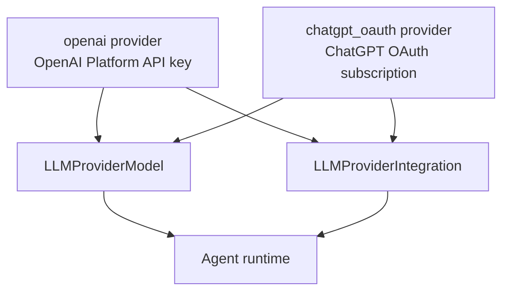
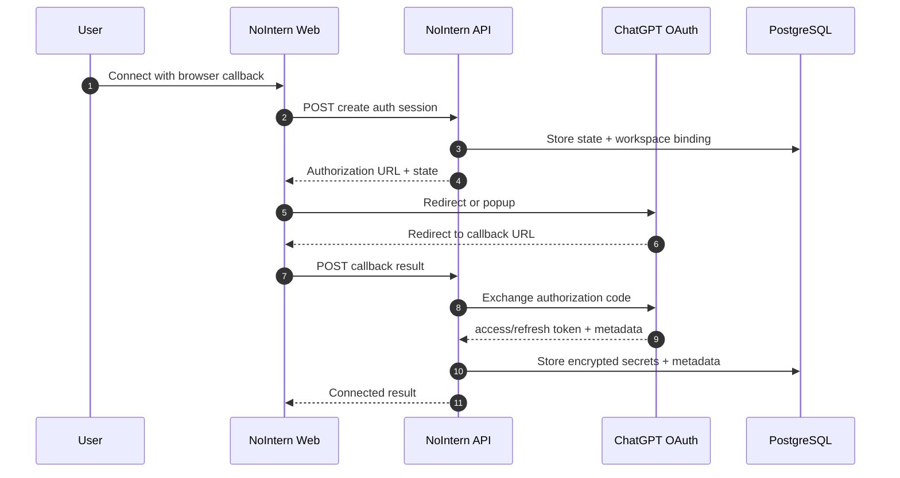
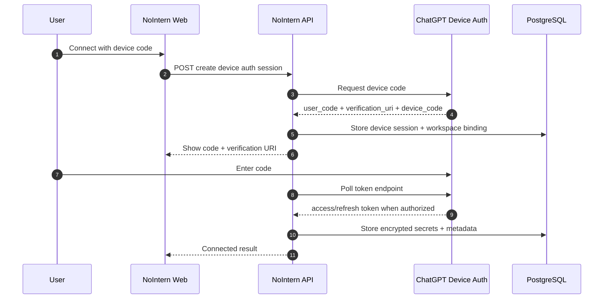
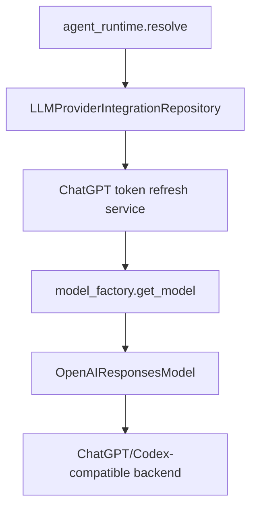

# ChatGPT OAuth Provider Design

## Background

NoIntern currently stores OpenAI API key, Anthropic API key, Google Gemini API key, AWS Bedrock, and Google Vertex AI credential through workspace-level LLM provider integration and passes them to agent runtime. Issue #3194 covers feature that lets ChatGPT subscription users use GPT-family models with ChatGPT OAuth credential.

Discussion #3196 decided following direction.

- Do not add `auth_mode=chatgpt_oauth` to existing `openai` provider; separate ChatGPT OAuth based provider as independent provider.
- Callback URL forwarding and device code connection method are not alternatives where one is chosen; both are supported as primary connection methods.
- Separate OAuth app approval process is not core risk for ChatGPT OAuth. Core risks are token/header/base URL compatibility, server-side refresh token storage, and agent runtime delegated call policy.

## Feasibility Result and Implementation Criteria

There is no blocker preventing design document PR from proceeding. However, implementation stack after Phase 2 is not considered complete before actual OAuth exchange, refresh, and runtime execution are verified.

Evidence:

1. Backend credential model already separates `encrypted_credentials` and `config`. Adding ChatGPT OAuth secrets to `ProviderSecrets` discriminated union and extending `LLMProvider` enum is acceptable by storage model.
2. Runtime already uses `OpenAIResponsesModel(AsyncOpenAI(...))` native path. ChatGPT OAuth provider can also configure access token, base URL, and default headers to connect to same Responses runtime family.
3. nointern-web already has LLM settings screen and provider-specific form branching structure. Need to add account connection provider UI instead of API key input form.
4. MCP OAuth flow provides internal patterns for callback URL, state, PKCE, token exchange, encrypted token storage. ChatGPT OAuth provider is workspace-level integration and does not reuse it as-is, but implementation structure can reference it.
5. OpenCode docs distinguish `ChatGPT Plus/Pro` browser auth and `Manually enter API Key` in OpenAI provider. Device code UX is also already common in coding-agent provider connections, as seen in GitHub Copilot provider.

Implementation after Phase 2 uses actual ChatGPT OAuth end-to-end behavior as acceptance criteria. After deployment, workspace owner must be able to connect with ChatGPT subscription account and immediately run NoIntern agent with connected credential.

- Browser callback is implemented as PKCE authorization code flow.
- Device code is implemented based on `auth.openai.com/api/accounts/deviceauth/*` endpoint used by Codex.
- Credentials from both connection methods converge to same encrypted secrets and runtime credential path.
- Refresh token is stored in encrypted secrets, and proactive refresh before agent runtime plus 401 retry refresh are implemented.

## Implemented State

Phase 3~7 implemented provider schema, callback/device API, runtime refresh/execution, frontend connection UX, and testenv QA scenarios. Current system behavior was promoted to Living Spec; detailed current spec is owned by following documents.

- `docs/nointern/spec/domain/agent.md` — provider enum, secrets/config, runtime preflight, API surface
- `docs/nointern/spec/flow/chatgpt-oauth.md` — callback/device/runtime refresh flow

This design document was moved to `design/` after implementation completed.

ADR candidate: “Separate ChatGPT subscription provider from OpenAI API key provider.” Create separate ADR after user approval.

## Goals

1. Workspace owner connects ChatGPT OAuth provider.
2. Provide both callback forwarding and device code as primary connection methods.
3. Store connected token in encrypted secrets and separate account/display metadata into config or metadata.
4. Proactively refresh access token before Agent execution.
5. If refresh token expires or is revoked, transition integration status to `refresh_required` and provide reconnection UX.
6. Separate model catalog, cost display, and operational status between OpenAI API key provider and ChatGPT OAuth provider.

## Non-goals

- Do not change existing behavior of OpenAI Platform API key provider.
- Do not dynamically synchronize remote model catalog in initial implementation of ChatGPT OAuth provider. Initially use separate seed/capability.
- Do not expose ChatGPT OAuth token in UI, debug screen, logs, or PR description.
- Do not replace actual OAuth exchange/refresh/runtime call with skeleton or NotConfigured adapter in implementation PR.

## Provider Boundary

Add ChatGPT OAuth provider as `chatgpt_oauth` value to `LLMProvider`.



Reasons for separation:

- Credential schema differs.
- Token refresh lifecycle differs.
- Base URL and required headers differ.
- ChatGPT subscription usage and OpenAI Platform API billing differ.
- Reduces risk of missing auth-mode branches in existing code that operates by provider enum.

## Credential Model

### Secrets

Store in encrypted secrets.

```json
{
  "type": "chatgpt_oauth",
  "access_token": "...",
  "refresh_token": "...",
  "id_token": "...",
  "expires_at": "2026-05-02T08:00:00Z"
}
```

`id_token` may be omitted if provider does not provide it or it is unnecessary.

### Config / metadata

Keep display/routing information that may be stored in plaintext.

```json
{
  "type": "chatgpt_oauth",
  "account_id": "...",
  "email": "user@example.com",
  "plan_type": "plus",
  "fedramp": false,
  "connection_method": "callback",
  "status": "connected",
  "last_refreshed_at": "2026-05-02T08:00:00Z",
  "last_failed_at": null,
  "last_failure_reason": null
}
```

Because `account_id` may be required for auth headers, API response exposure range is controlled in separate DTO. Separate provider detail seen by owner/manager from model selector response seen by member.

## Integration status

Existing `enabled` boolean remains control where user toggles provider on/off. Connection health status of ChatGPT OAuth provider is expressed in config/metadata or separate column.

| Status | Meaning | User action |
|---|---|---|
| `connected` | access token refresh possible, runtime usable | Manage |
| `refresh_required` | relogin required due to refresh token expiry/revocation, etc. | Reconnect |
| `temporarily_unavailable` | temporary ChatGPT/Auth API outage | Retry / View details |
| `disabled` | disabled by user | Enable |

Permanent refresh failure is surfaced as `refresh_required`, not silently converted to success.

## Connection Methods

Both connection methods are primary flows.

### Callback URL forwarding



Requirements:

- `state` includes workspace handle, requester user, nonce, expiry.
- callback handler validates state to block cross-workspace token injection.
- callback success/failure returns to provider settings and is displayed.
- On failure, provide retry with callback method and device code method in same screen.

### Device code



Requirements:

- Provide verification URI, user code, copy button, open button, waiting status.
- Polling interval and timeout follow provider response.
- On timeout, provide CTA to issue new code.
- If user cancels, discard device session.
- After device code completes, token shape must converge to same runtime input as callback method.

## Frontend UX

### Provider settings

Expose two primary actions at same level when disconnected.

- `Connect with browser callback`
- `Connect with device code`

Also provide both methods when connected or reconnection required.

- `Reconnect with browser callback`
- `Reconnect with device code`

Provider detail displays following.

- connection status
- connected account email or display label
- plan type, or `Unknown plan` if unknown
- connection method (`browser callback` or `device code`)
- connected by / connected at
- last refreshed at
- last failed at / reason category

Do not display secret.

### Model selector

Agent model selector shows provider/source separately.

- `OpenAI API key`
- `ChatGPT subscription`

Show source together even if model display name is same.

- `GPT-5.1 — OpenAI API key`
- `GPT-5.1 — ChatGPT subscription`

ChatGPT OAuth provider model does not estimate `cost_usd`. If needed, display as `Subscription` badge.

### Error recovery

Preflight validation blocks as much as possible before run starts.

| State | Message | CTA |
|---|---|---|
| provider disabled | `This provider is disabled.` | Enable |
| refresh required | `Reconnect ChatGPT to continue.` | provide both reconnect methods |
| model unavailable | `This model is not available for the connected ChatGPT account.` | Open provider settings |
| temporary issue | `ChatGPT is temporarily unavailable. Try again later.` | Retry |

Members see `Ask a workspace admin to reconnect ChatGPT` instead of admin action.

## Backend API Design

New public API is under workspace-level LLM integration area.

| Method | Path | Description |
|---|---|---|
| POST | `/llm-provider-integration/v1/workspaces/{handle}/chatgpt-oauth/callback/start` | create callback connection session |
| POST | `/llm-provider-integration/v1/workspaces/{handle}/chatgpt-oauth/callback/exchange` | exchange callback code |
| POST | `/llm-provider-integration/v1/workspaces/{handle}/chatgpt-oauth/device/start` | create device code session |
| GET | `/llm-provider-integration/v1/workspaces/{handle}/chatgpt-oauth/device/{session_id}` | query device code polling status |
| DELETE | `/llm-provider-integration/v1/workspaces/{handle}/chatgpt-oauth/device/{session_id}` | cancel device code session |

Permissions:

- connect / reconnect / disconnect / disable require `llm_integrations:write` permission.
- list / detail / model availability require `llm_integrations:read` permission.

## Runtime Design

ChatGPT OAuth provider prioritizes OpenAI SDK native path.



`AsyncOpenAI` configuration uses same backend base URL as Codex ChatGPT auth path.

```python
AsyncOpenAI(
    api_key=access_token,
    base_url="https://chatgpt.com/backend-api/codex",
)
```

If FedRAMP flag is needed, add `X-OpenAI-Fedramp` header.

## Token refresh

Proactive refresh immediately before call is default.

1. Decrypt Integration secrets.
2. If `expires_at` is within refresh threshold, refresh with refresh token.
3. Store new access token and rotated refresh token in encrypted secrets.
4. Pass latest credential to runtime.
5. If 401 occurs during call, refresh/retry once.
6. On permanent refresh failure, transition integration status to `refresh_required`.

Concurrent run race is handled by row lock or optimistic update. By design, token refresh lives in service/repository layer rather than provider runtime.

## Data Changes

Expected changes:

- Add `chatgpt_oauth` family value to `LLMProvider` enum.
- PostgreSQL enum `llm_provider` migration.
- Add `ChatGPTOAuthSecrets` to `ProviderSecrets`.
- Add `ChatGPTOAuthConfig` to `ProviderConfig` or separate metadata schema.
- Add ChatGPT OAuth provider models to `LLMProviderModel` seed.
- Add Integration status expression.

## Test Strategy

### ChatGPT OAuth E2E

1. Browser callback start stores PKCE `code_challenge` and state and returns `https://auth.openai.com/oauth/authorize` URL.
2. Callback exchange sends authorization code, redirect URI, client id, `code_verifier` to `https://auth.openai.com/oauth/token` and stores token.
3. Device start receives user code from `https://auth.openai.com/api/accounts/deviceauth/usercode`, and device poll receives `authorization_code`, `code_challenge`, `code_verifier`, exchanges them at token endpoint with `https://auth.openai.com/deviceauth/callback` redirect URI, and stores token.
4. Refresh renews token with `grant_type=refresh_token` and stores rotated refresh token.
5. Agent runtime calls `https://chatgpt.com/backend-api/codex` Responses endpoint with stored ChatGPT access token.

### Implementation tests

- Backend unit tests
  - secrets/config validation
  - callback state validation
  - device session lifecycle
  - refresh success/failure status transition
  - model factory credential mapping
- Frontend tests or E2E
  - display two primary connection actions in provider settings
  - callback success/failure result
  - device code waiting/timeout/cancel
  - model selector grouping
  - reconnect required CTA

## Implementation Phases

### PR 2: Implementation plan

- Document actual OAuth implementation acceptance criteria and phase/testenv plan.
- Fix Codex OAuth endpoint/client id/base URL as implementation criteria.

### PR 3: Backend provider schema

- Add Provider enum/migration/secrets/config/status.
- Add unit tests.

### PR 4: OAuth connection API

- Connect PKCE callback start/exchange to actual token endpoint.
- Connect device code start/poll/cancel to actual device endpoint.
- Implement token storage and status transition.

### PR 5: Runtime credential path

- Add Token refresh service.
- Extend Runtime model factory.
- Run agent with ChatGPT subscription credential.

### PR 6: Frontend UX

- Add ChatGPT OAuth provider card in Provider settings.
- Implement two primary connect/reconnect actions.
- Implement Callback result page and device code modal/page.
- Implement Model selector grouping and status/recovery CTA.

### PR 7: QA / spec sync

- Mock OAuth callback/device code E2E and actual ChatGPT account based device flow smoke.
- Refresh required status transition E2E.
- Update docs/spec.

### PR 8: Cleanup

- Finalize `implemented` in implementation plan and delete stale research/plan documents.

## Security Considerations

- Never expose token values in logs, API response, UI, PR description.
- Callback state and device session have workspace/user binding and expiry.
- Device code polling respects provider interval and supports cancellation.
- Refresh token is stored only in encrypted secrets and is not exposed in API response, logs, or UI.
- Integration disconnect deletes encrypted secrets and preserves model/run history.

## Open Questions

1. Provider enum name is `chatgpt_oauth`.
2. OAuth client id uses Codex client id `app_EMoamEEZ73f0CkXaXp7hrann` as default.
3. Issuer defaults to `https://auth.openai.com`, runtime base URL defaults to `https://chatgpt.com/backend-api/codex`.
4. Device code flow uses Codex device auth endpoint.
5. Browser callback redirect URI can be overridden with environment variable, and deployment environment QA verifies actual redirect success.
6. `account_id` is account display metadata, so keep it in `ChatGPTOAuthConfig`.
7. Initial implementation keeps Integration status in `ChatGPTOAuthConfig.status`.
8. Initial model seed prioritizes Codex default model alias, and remote catalog sync is follow-up.

## Related Code Paths

- `python/apps/nointern/src/nointern/core/enums.py`
- `python/apps/nointern/src/nointern/core/credentials.py`
- `python/apps/nointern/src/nointern/engine/sdk/model_factory.py`
- `python/apps/nointern/src/nointern/services/llm_provider_integration/`
- `python/apps/nointern/src/nointern/api/public/llm_provider_integration/v1/`
- `typescript/apps/nointern-web/src/features/llm-settings/`
- `typescript/apps/nointern-web/src/trpc/routers/llm-provider-integration.ts`
- `docs/nointern/design/llm-260221-llm-integration.md`
- `docs/nointern/spec/flow/mcp-oauth.md`
