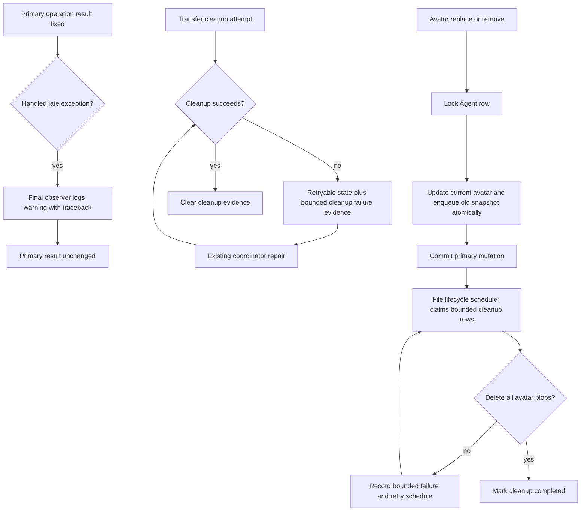

# cleanup-260818/DESIGN: Suppressed Failure Observation and Recovery

## Inputs

- Requirements:
  [cleanup-260818/REQ](../requirements/cleanup-260818-suppressed-failure-recovery.md)
- Decisions:
  [cleanup-260818/ADR](../adr/cleanup-260818-suppressed-failure-recovery.md)
- Current Agent behavior:
  [Agent Domain](../spec/domain/agent.md)
- Current Runtime behavior:
  [Agent Runtime Control](../spec/flow/agent-runtime-control.md)
- Current scheduler behavior:
  [Periodic Execution](../spec/flow/periodic-execution.md)
- Current execution behavior:
  [Agent Execution Loop](../spec/flow/agent-execution-loop.md)

## Current Behavior and Requirement Gaps

`ModelStream` consumes late stream operations and owned support tasks after the
primary timeout or caller cancellation is fixed. Two helper paths currently
discard unexpected task exceptions. `LocalJobRuntime` similarly consumes a job
handler that settles with an exception inside cancellation grace while returning
the authoritative timeout outcome. Runtime-to-Server transfer cleanup can also
exhaust abandonment, terminal-status recovery, and cancellation confirmation
after the transfer result is fixed, leaving its final handled exception without
another observer.

Runtime Transfer preserves multipart and completed-object cleanup handles with
`RETRYABLE_FAILURE`. Immediate Runner cleanup and stale-stream repair can update
that retry state without retaining what cleanup operation failed. The Memory and
Redis stores share the domain record, and Redis uses a strict versioned JSON
codec.

Agent avatar replacement publishes the new image, updates `agents.avatar`, then
best-effort deletes the stale pre-publication snapshot. Removal clears the
database field before the same best-effort delete. A deletion failure loses the
only cleanup pointer. Because the service reads the prior avatar before
publication and the repository does not lock or compare the row, overlapping
mutations can also leave an intermediate avatar untracked.

## Architecture and Ownership

The primary-operation owner determines the user-visible result. The final
suppressing helper owns detached exception logging. Runtime Transfer state owns
its volatile cleanup diagnostic. PostgreSQL owns durable avatar cleanup work, and
the file lifecycle scheduler owns each external deletion attempt.

## Detached Task Observation

Add warning-level stack-trace logging to:

- model-stream late operation cleanup;
- model-stream owned support-task consumption; and
- Local Job Runtime cancellation-grace handler consumption; and
- Runtime-to-Server transfer cleanup after bounded abandonment, status recovery,
  and cancellation confirmation fail to establish a terminal result.

Each path handles `asyncio.CancelledError` separately and silently. Unexpected
exceptions use a static English message, a sanitized `exc_info` tuple that
preserves origin traceback frames while replacing untrusted exception type and
message text, and bounded identifiers already available at that boundary. No
exception text is interpolated into the message. The helpers continue without
re-raising. Runtime-to-Server cleanup returns silently when either abandonment or
the recovery status lookup establishes an authoritative terminal result.

Existing model-stream adopted-cleanup logging and Local Job Runtime detached
handler logging remain unchanged because they own different task lifecycles.

## Runtime Transfer Cleanup Evidence

Add a frozen internal cleanup-failure record with:

- stable cleanup artifact classification;
- latest observed time; and
- positive bounded attempt count.

The artifact classification distinguishes multipart abort, completed-object
delete, and preparation cleanup when the existing store operation can identify
it. It does not contain object identity or provider output.

`RuntimeTransferRecord` carries an optional latest cleanup failure. Its invariants
require evidence only while cleanup is retryable. Store cleanup methods accept
the latest failed artifact classification when writing
`RETRYABLE_FAILURE`; writing `COMPLETE` clears the evidence. Repeated failed
attempts increment the bounded count and replace the observation time.

The Memory store performs the update under its existing lock. The Redis store
adds the field to its exact record codec and advances the schema version. Decoder
tests retain strict rejection of other schema versions. The existing maximum
serialized record size remains unchanged.

Immediate Runner cleanup records one classification for each artifact that
remains. When both multipart and completed-object cleanup fail, the record uses a
stable combined classification rather than raw exception details. The
coordinator's repair attempt updates or clears the same evidence. It logs one
stack trace at the boundary that handles a failed external cleanup attempt.

The coordinator status protobuf and public APIs remain unchanged. Operational
inspection uses internal state and structured logs; transfer consumers do not
need this evidence to authorize or settle bytes.

The existing orphan repair result counters are added to the Runtime Control
repair-completion structured log. Per-artifact identities remain excluded.

## Durable Avatar Cleanup Model

Add an internal `agent_avatar_cleanup_jobs` table. Each row contains:

- cleanup job ID;
- optional Agent ID used only for diagnostics, with deletion preserving the job;
- immutable `StoredImage` JSON snapshot;
- attempt count;
- next-attempt timestamp;
- unique per-cleanup-pass lease token and lease expiration;
- latest bounded failure kind;
- created and updated timestamps.

The table has an explicit index covering due and lease selection. The avatar JSON
is internal and is never returned through Agent APIs. There is no cleanup-history
retention contract, so successful exact-token-fenced cleanup deletes the row
rather than retaining obsolete object keys.

## Avatar Mutation Transaction

Replace `AgentRepository.update_avatar` with an operation that:

1. selects the Agent row for update;
2. returns not found if absent;
3. snapshots the row's current avatar;
4. writes the requested current avatar value;
5. inserts a cleanup job when the previous avatar is non-null and differs from
   the requested avatar; and
6. commits through the existing session manager boundary.

Replacement still publishes the new avatar before entering this transaction.
Removal enters it directly with a null requested value. The row lock orders
overlapping replacement/removal commits so each mutation enqueues the value it
actually supersedes. The API response remains the newly committed Agent.

`AgentService` no longer performs post-commit best-effort old-avatar deletion.
This removes the exception-discarding paths and leaves one durable cleanup owner.

## Avatar Cleanup Execution

Extend `FileLifecycleCleanupService.cleanup_once` with a bounded avatar cleanup
stage. Each cleanup pass derives a fresh opaque token from the scheduler identity
and a random claim suffix. The repository claims due rows using that exact token
and lease expiration so multiple replicas, later attempts in the same process,
or a prior crashed attempt cannot concurrently settle one row.

For each claimed row:

1. call `AvatarUploadHandler.delete_files`, which deduplicates the default,
   small, medium, large, and optional legacy original keys;
2. on expected cancellation, re-raise without state mutation;
3. on cleanup failure, record a bounded failure kind, increment the attempt
   count, schedule bounded backoff, clear the lease, and emit one stack-trace log
   with job and optional Agent IDs;
4. on success, delete the cleanup row using the same exact claim-token fence.

One failed row does not stop later rows in the bounded page. Summary fields add
avatar cleanup attempted, completed, and failed counts. The scheduler task key,
interval, timeout, and primary retry policy remain unchanged.

Agent decommission keeps its existing current-avatar cleanup before final Agent
deletion. Superseded-avatar cleanup jobs remain independent and survive Agent
deletion.

## Migration, Rollout, and Rollback

Generate one Alembic revision for the avatar cleanup table and advance
`db-schemas/rdb/revision`. The migration is additive and does not rewrite
existing Agent rows.

Deploy application and migration together. The new application can operate when
there are no cleanup rows. Runtime Transfer's Redis record schema advances in the
same application cutover; existing incompatible volatile records fail closed and
new transfers resume under the established Redis-optional recovery contract.

Rollback before new avatar cleanup rows exist may use the previous application
and schema revision. After rows exist, database rollback would discard durable
cleanup responsibility and is therefore not an operational recovery mechanism;
roll forward with a correction instead. No live infrastructure action is part of
this pull request.

## Failure and Recovery

- Logging failure does not affect the handled primary exception path.
- Transfer cleanup failure retains both cleanup handles and bounded latest
  diagnostic state until a later repair succeeds.
- Empty Memory or Redis state loses prior volatile diagnostics as designed and
  does not block new transfers; state-independent orphan repair remains.
- Avatar S3 failure leaves a durable due row and does not reverse replacement or
  removal.
- A cleanup worker crash leaves a lease that becomes claimable after expiration.
- Agent deletion nulls only the diagnostic relationship and preserves the
  immutable cleanup snapshot.
- Pre-adoption avatar publication failures remain outside this snapshot.

## Security and Privacy

- New transfer diagnostic evidence and logs exclude storage keys, raw provider
  upload IDs, hashes, endpoints, credentials, bytes, and raw provider messages.
  Existing opaque cleanup handles remain internal retry authority.
- Avatar cleanup rows necessarily retain the exact internal keys already present
  in `StoredImage` so deletion can occur; they are database-internal and are not
  exposed through APIs or logs.
- Avatar failure logs use cleanup job and optional Agent IDs, a stable failure
  kind, and attempt count. They do not log avatar URLs or object keys.

## Observability

- Detached-task warnings include the owning subsystem and bounded execution
  identifiers with sanitized traceback evidence and a static exception message.
- Transfer state retains stable cleanup classification, latest observation time,
  and attempt count; repair logs include safe aggregate counters.
- Avatar cleanup attempts emit stack traces only on failed attempts and expose
  aggregate attempted/completed/failed counters in the existing scheduler
  summary.

## Test Strategy

### Product and integration verification

The user-visible APIs intentionally do not change. Fault injection is required to
prove the corrected behavior, so deterministic service, repository, and
state-store integration tests are the primary verification rather than a public
browser E2E scenario.

| Scenario | Expected evidence |
| --- | --- |
| Model stream times out and late operation raises | Timeout remains primary; one warning has traceback |
| Local job times out and handler raises during grace | Timed-out outcome remains; one warning has traceback |
| Runtime-to-Server cleanup exhausts terminal confirmation | Transfer result remains primary; one sanitized warning records the last handled cleanup failure |
| Transfer multipart/object cleanup fails | Retryable state retains bounded classification and count |
| Transfer repair later succeeds | Handles and cleanup diagnostic are cleared |
| Redis codec round trip | New evidence round-trips under the new strict schema |
| Avatar replacement cleanup fails | Replacement succeeds; durable cleanup job remains due |
| Avatar removal cleanup fails | Removal succeeds; durable cleanup job remains due |
| Overlapping avatar mutations | Each actually superseded image is enqueued; final current image is not |
| Avatar retry succeeds | Scheduler completes the row and reports counters |
| Agent is deleted before retry | Cleanup row and immutable image snapshot remain |

No new testenv fixture or live credential is required. Existing fake S3
collaborators provide deterministic failures and deletion assertions. Optional
live object-store testing may confirm idempotent not-found behavior but is not a
CI prerequisite.

### Unit and contract coverage

- `model_stream_test.py` covers late operation and support-task exception
  observation.
- `job_runtime/local_test.py` covers cancellation-grace exception observation.
- `runtime_to_server_test.py` covers terminal recovery, bounded cancellation
  confirmation, exact final-observer logging, and sensitive-message redaction.
- `utils/logging_test.py` covers traceback-frame preservation with replacement
  of untrusted exception type and message text.
- Memory and Redis transfer store contract tests cover evidence invariants,
  attempts, clearing, codec schema, and parity.
- Runner transfer and coordinator tests cover failure classification and later
  repair.
- Runtime Control composition tests cover orphan aggregate log fields.
- Avatar repository tests use real PostgreSQL transaction behavior for row locks,
  atomic enqueue, Agent deletion, and concurrent mutation ordering.
- Agent service tests prove unchanged success/not-found/authorization results.
- File lifecycle cleanup tests prove claim, failure retry, lease expiry, success,
  logging, and summary counters.

Core deterministic tests must pass in CI. Tests requiring optional live services
must skip only when their existing prerequisite marker permits it and cannot
replace the deterministic coverage.

## Traceability

| Requirement | ADR decisions | Design mechanism | Verification |
| --- | --- | --- | --- |
| `cleanup-260818/REQ-1` | D1 | Final-observer warning with sanitized traceback | Model-stream, Local Job Runtime, Runtime-to-Server, and logging-helper tests |
| `cleanup-260818/REQ-2` | D2 | Bounded transfer cleanup evidence in Memory/Redis state | Store, codec, Runner, coordinator tests |
| `cleanup-260818/REQ-3` | D3, D4 | Atomic avatar supersession outbox and scheduler retry | Repository concurrency and lifecycle tests |
| `cleanup-260818/REQ-4` | D1-D4 | Internal additive state; unchanged APIs and retry authorities | API diff, generated-surface absence, spec review |

## Feasibility Validation

| Mechanism | Result | Repository evidence |
| --- | --- | --- |
| Final-observer logging | Feasible | Each identified helper is the sole observer after the primary result is fixed. |
| Transfer diagnostic state | Feasible | Memory and Redis already update one versioned `RuntimeTransferRecord` through fenced cleanup methods. |
| Avatar relational cleanup | Feasible | Existing lifecycle jobs and file cleanup repositories use leases, bounded pages, retries, and fenced post-delete state settlement. |
| Atomic avatar supersession | Feasible | Agent and cleanup job writes can share the existing SQLAlchemy session transaction. |
| Existing scheduler reuse | Feasible | `file_lifecycle_cleanup` already runs bounded external blob deletion every five minutes. |

No confirmed requirement is blocked.

## Design Authority

- Design revision: `2`

| ID | Material design mechanism | Authority | Classification |
| --- | --- | --- | --- |
| M1 | Final suppressing observer records one traceback and preserves primary outcome | `cleanup-260818/REQ-1`, `cleanup-260818/ADR-D1` | `decided` |
| M2 | Transfer retry state retains bounded internal cleanup failure evidence | `cleanup-260818/REQ-2`, `cleanup-260818/ADR-D2` | `decided` |
| M3 | Avatar mutation atomically creates durable cleanup responsibility | `cleanup-260818/REQ-3`, `cleanup-260818/ADR-D3` | `decided` |
| M4 | Existing file lifecycle scheduler performs bounded avatar cleanup retries with a unique per-pass exact claim token | `cleanup-260818/REQ-3`, `cleanup-260818/ADR-D3`, current Periodic Execution Spec | `derived` |
| M5 | Pre-adoption avatar publication compensation remains outside this snapshot | `cleanup-260818/REQ` non-goals, `cleanup-260818/ADR-D4` | `decided` |

## Removal and Replacement

| Existing unit or behavior | Removal authority | Replacement or remaining authority | Removal boundary | Absence verification |
| --- | --- | --- | --- | --- |
| Silent detached or terminal-cleanup exception discard in identified helpers | `cleanup-260818/REQ-1`, D1 | Final-observer sanitized structured traceback | Replace only the broad discard bodies | Tests assert one log and unchanged primary result |
| Transfer retry state without failure classification | `cleanup-260818/REQ-2`, D2 | Bounded cleanup failure evidence | Extend record/store codec and writers | Memory/Redis contract parity and schema tests |
| Post-commit best-effort avatar deletion in `AgentService` | `cleanup-260818/REQ-3`, D3 | Durable relational cleanup job and scheduler | Remove both service cleanup catch blocks | Service tests and code search show no discard path |
| Unserialized avatar update that snapshots stale old state | `cleanup-260818/REQ-3`, D3 | Row-locked atomic supersession operation | Replace avatar-only update repository method | Concurrent transaction test |
| Public/API contract | None | Existing Agent avatar routes and schemas remain | No generated API changes | OpenAPI/generated diff remains empty |

## Design Approval

- Mode: `Collaborative`
- Decision owner: `requester`
- Approved on: `2026-08-18`
- Approved Design revision: `2`
- Approved authority IDs: `M1, M2, M3, M4, M5`
- Approved scope: One-PR correction for exactly-once suppressed failure
  observation, bounded Runtime Transfer cleanup evidence, and durable retry of
  avatars superseded by committed replacement or removal, including exact
  per-pass claim-token fencing for cleanup settlement.
