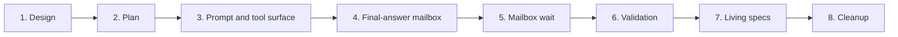

# Codex Multi-Agent V2 Parity Implementation Plan

## Summary

This temporary plan delivers the design in [Codex Multi-Agent V2 Model Contract Parity](codex-multi-agent-v2-parity.md) as an eight-PR stack. The frozen behavioral source is OpenAI Codex commit `1f0566d3f59298d1bb88820a0d35294f1eeb07ea`.

The implementation changes three model-facing boundaries in dependency order:

1. prompt roles, delegation policy, and collaboration tool surfaces;
2. durable direct-parent final-answer delivery;
3. mailbox-oriented wait synchronization.

The plan preserves existing SessionAgent ownership, worker scheduling, shared workspaces, context forking, human child-write restrictions, and public REST schemas. It introduces no compatibility aliases or feature flags.

## Stack

| PR | Branch | Base | Scope |
|---:|---|---|---|
| 1/8 | `design/codex-subagent-parity` | `main` | Frozen design and ADR-0102 |
| 2/8 | `plan/codex-subagent-parity` | PR 1 | This implementation plan |
| 3/8 | `feat/codex-subagent-prompt-surface` | PR 2 | Prompt roles, explicit mode, closed tool schemas, exact non-future-facing tool behavior |
| 4/8 | `feat/codex-subagent-final-answer-mailbox` | PR 3 | Idempotent direct-parent final answers, assistant-role lowering, unread cursor |
| 5/8 | `feat/codex-subagent-mailbox-wait` | PR 4 | Timeout-only mailbox/steered-user wait semantics |
| 6/8 | `test/codex-subagent-parity-validation` | PR 5 | Deterministic E2E and validation report |
| 7/8 | `docs/codex-subagent-parity-spec` | PR 6 | Living-spec promotion and implemented design marker |
| 8/8 | `chore/codex-subagent-parity-cleanup` | PR 7 | Remove temporary plan/report and obsolete prompt note |

All branches are stacked and must merge front to back. CI monitoring starts only after all planned PRs are open.

## Phase Dependencies

- Phase 3 creates the request-role and schema foundation but must not claim final-answer or mailbox-wait behavior that is not yet implemented.
- Phase 4 activates the exact child and `spawn_agent` final-answer wording only after queue-only direct-parent delivery works.
- Phase 5 activates the exact V2 `wait_agent` wording only when the target/result-fetch implementation has been replaced.
- Phase 6 is blocked until phases 3–5 have passed their component tests.
- Phase 7 is blocked until every mandatory E2E scenario passes.
- Phase 8 is blocked until the implementation and spec PRs are review-ready; it does not depend on their merge.

## Phase 3 — Prompt and Tool Surface

### Runtime Changes

- Add role-specific root and child usage-hint constants and the separate explicit-request-only mode constant.
- Emit the usage hint and mode as two standalone `developer` inputs after base instructions and before transcript input.
- Keep the generated prompt inputs out of the persisted event transcript and rebuild them deterministically for each request.
- Preserve exact role/text/order for OpenAI-compatible requests and verify provider transport compatibility for xAI, Anthropic, and Gemini paths without collapsing developer inputs into the base system prompt.
- Introduce closed input schemas for the six collaboration tools. Reject unknown fields.
- Rename model-facing inputs to Codex V2 names: `task_name`, `message`, `target`, `fork_turns`, `path_prefix`, and later `timeout_ms`.
- Remove model-facing `agent_type`; retain the internal default SessionAgent kind.
- Return exact runtime output shapes for spawn, message/follow-up, list, and interrupt.
- Add canonical segment-boundary filtering to `list_agents.path_prefix`.
- Map SessionAgent/run state into the frozen Codex V2 status union, including `shutdown` for a permanently cancelled resident child.

### Temporary Atomicity Boundary

The phase-3 child hint omits the immediate final-delivery sentence, the phase-3 `spawn_agent` description omits the final-answer sentence, and the old `wait_agent` description remains accurate to its still-current behavior. Exact final text is enabled only in the behavior-owning later phases.

### Tests

- Full root/child developer-input equality and exclusion tests.
- Exact developer-input role and order in fully lowered native requests.
- Provider-specific request lowering tests.
- Exact closed input-schema, description, output-shape, validation-message, and unknown-field tests.
- Relative/canonical target resolution and cross-tree rejection tests.
- `path_prefix` exact, descendant, and sibling-prefix tests.
- Status-union matrix tests.

## Phase 4 — Direct-Parent Final-Answer Mailbox

### Runtime and Data Changes

- Add `final_answer` to the durable agent-message kind.
- Extract agent-message enqueue behavior into a reusable mailbox service used by collaboration tools and terminal delivery.
- Resolve the direct parent from the source SessionAgent edge and verify that source and target share one root tree.
- Enqueue one `InputBufferKind.AGENT_MESSAGE` to the direct parent with deterministic key `subagent-final-answer:{run_id}`.
- Record source run id/index and terminal event metadata on the buffer.
- Perform terminal run update and final-answer enqueue in one database transaction for completed and failed runs, including failed-run recovery finalization.
- Never mark an idle parent running and never send a broker wake for final-answer delivery.
- Render completed-empty and errored payloads exactly as frozen. Ordinary interrupted/stopped/cancelled runs emit no completion. A shutdown payload is used only if a distinct permanent resident-child shutdown exists; ordinary cancellation must not be reclassified.
- Lower `final_answer` as role `assistant`; keep `NEW_TASK` and `MESSAGE` on their existing sourced-input role.
- Promote the final answer through the existing input-buffer boundary on the active parent's next model call.
- Advance `parent_observed_run_index` monotonically in the same transaction as parent event append/dedup and buffer deletion.
- Publish tree invalidation for each source child whose cursor advances.
- Activate the exact child and `spawn_agent` final-answer wording.

No schema migration is expected. Existing input-buffer idempotency storage and SessionAgent observation columns are reused.

### Failure Recovery

- A crash before the terminal transaction commits leaves both terminal state and delivery absent, so retry repeats both.
- A retry after commit observes the terminal row and idempotent buffer key and cannot create a duplicate.
- Parent event dedup recovery still advances the cursor before deleting a retried buffer.
- Delivery failure is propagated; it is not recorded as a successful child completion notification.

### Tests

- Root skip, child-to-parent, and grandchild-to-direct-parent routing.
- Completed content/empty and failed exact/truncated payloads.
- Interrupted/stopped/cancelled no-delivery cases.
- Atomic terminal update/enqueue and failed-run finalizer coverage.
- Retry idempotency and event-dedup recovery.
- Idle parent no-wake and active parent next-boundary promotion.
- Exact `FINAL_ANSWER` envelope and assistant role.
- Monotonic unread cursor and tree invalidation.

## Phase 5 — Mailbox Wait

### Runtime Changes

- Replace descendant terminal-result polling with durable pending-input activity polling.
- Classify only pending `agent_message` as mailbox activity.
- Classify only `USER_MESSAGE` and `EDITED_USER_MESSAGE` submitted into the current active turn as steered input.
- Do not classify action messages, goal continuations, background completions, or internal/control buffers as steering activity.
- Use FIFO order when mailbox and steered-user activity are both pending.
- Accept only optional `timeout_ms`, with default `30000`, minimum `10000`, and maximum `3600000`.
- Return only the exact summary object for mailbox, steered-user, or timeout outcomes.
- Leave content pending for normal next-boundary promotion; the tool never claims, deletes, or returns message content.
- Remove target parameters, observation cursor writes, terminal result content, and the `not_found`/no-descendant/no-unread result branches.
- Remove the forked-history reminder that says `wait_agent` only observes descendants; retain only the Azents history-boundary identity reminder.
- Propagate cancellation so user stop terminates a long wait.
- Activate the exact V2 `wait_agent` schema and description.

### Tests

- Existing and newly arriving mailbox activity.
- Existing and newly arriving user/edited-user steering.
- Action, goal, background, and internal buffers do not complete the wait.
- Mixed FIFO precedence.
- Default/min/max validation and exact result strings.
- Timeout and cancellation.
- Pending content remains untouched and the cursor is unchanged.
- Legacy fields are rejected.
- Next model boundary receives content separately from the wait result.

## Phase 6 — Validation

### E2E Primary Matrix

| Scenario | Fixture action | Required evidence |
|---|---|---|
| Root contract | Capture root request | Base instructions, root developer hint, mode developer input, transcript order, exact tools |
| Child contract | Spawn scripted child and capture request | Child hint, mode input, no root wording |
| Explicit delegation surface | Script `spawn_agent` | Codex input names and canonical `task_name` result |
| Final-answer delivery | Complete child while parent is active | One assistant-role direct-parent `FINAL_ANSWER` at next boundary |
| Nested delivery | Complete grandchild | Direct parent receives it; root does not receive it directly |
| Idle queue-only delivery | Complete child after parent becomes idle | Pending buffer exists; no parent run/broker wake |
| Wait mailbox | Queue/send final answer during wait | `Wait completed.`; content remains separate |
| Wait steer | Submit active-turn user input | `Wait interrupted by new input.` |
| Wait non-steering input | Queue action/goal/background/internal input | Wait remains pending or times out |
| Wait timeout | Provide no classified activity | `Wait timed out.` and `timed_out=true` |
| Recovery | Retry terminal finalization | One buffer/event and monotonic cursor |
| List filtering | Query exact and sibling prefixes | Canonical segment-boundary result set |
| UI unread lifecycle | Observe before/after parent promotion | Unread before; cleared after promotion only |

### Fixture and Prerequisite Support

Extend the existing deterministic subagent E2E fixture and scripted model transport. Add request capture and deterministic interleaving hooks for child completion, parent waiting, active-turn steering, and idle-parent observation.

No external credentials, live provider, seed migration, or credential snapshot is required. Mandatory deterministic tests must not skip in CI. Missing local container/testenv prerequisites block local validation but do not weaken CI acceptance.

### Evidence

Create `docs/azents/design/codex-multi-agent-v2-parity-validation-2026-07-10.md` containing:

- exact commands and environment;
- component and E2E results;
- captured request/event assertions;
- failures discovered and fixes applied;
- a strict implementation-versus-current-spec comparison.

## Phase 7 — Spec Promotion

Run `/spec-review` against the complete implementation and update current behavior in:

- `docs/azents/spec/domain/toolkit.md`;
- `docs/azents/spec/domain/conversation.md`;
- `docs/azents/spec/flow/agent-execution-loop.md`;
- any additional spec identified by code-path coverage.

Increment each changed spec version, update `last_verified_at`, and add changelog entries. Mark the design implemented only after phase-6 validation succeeds. ADR-0102 remains immutable once adopted.

## Phase 8 — Cleanup

- Delete this implementation plan.
- Delete the temporary validation report after its durable conclusions are promoted to specs.
- Remove the superseded prompt-hardening note only after confirming it has no unique unresolved decision or backlog item.
- Regenerate documentation indexes.
- Make no runtime, API, or behavior changes.

## Quality Gates

Every code phase runs targeted Ruff format/check, Pyright, and Pytest. Phase 6 additionally runs all focused backend suites, deterministic subagent E2E, documentation index validation, and `git diff --check`.

Before the stack is declared complete:

- an independent subagent reviews the integrated code diff;
- the root agent directly verifies every concrete finding and fix;
- all eight PRs are open;
- CI is green on every PR;
- no PR is merged without explicit user approval.

## Known Risks and Blockers

- LiteLLM provider translation of standalone `developer` roles must be verified for xAI, Anthropic, and Gemini paths. The implementation must not hide a transport incompatibility by silently merging the text into the system prompt.
- Final-answer delivery is unsafe if performed after the terminal transaction commits. The terminal callback/service integration is a hard phase-4 requirement.
- Current observation-cursor updates are not monotonic. Phase 4 must harden the repository update before moving the cursor from promotion.
- Existing `wait_agent` E2E expects terminal content in the tool result and must be rewritten in phase 6.
- Token truncation must use a deterministic tokenizer and exact boundary tests; character truncation is not acceptable.
- A distinct Azents permanent child-shutdown transition may not exist. Until one is proven, ordinary cancellation emits no `FINAL_ANSWER` and does not claim Codex shutdown parity.

There are no product decisions left open for implementation. Any newly discovered model-facing deviation must be added to the design delta ledger before code relies on it.
