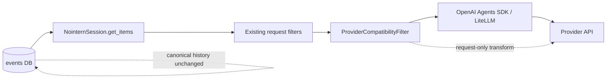
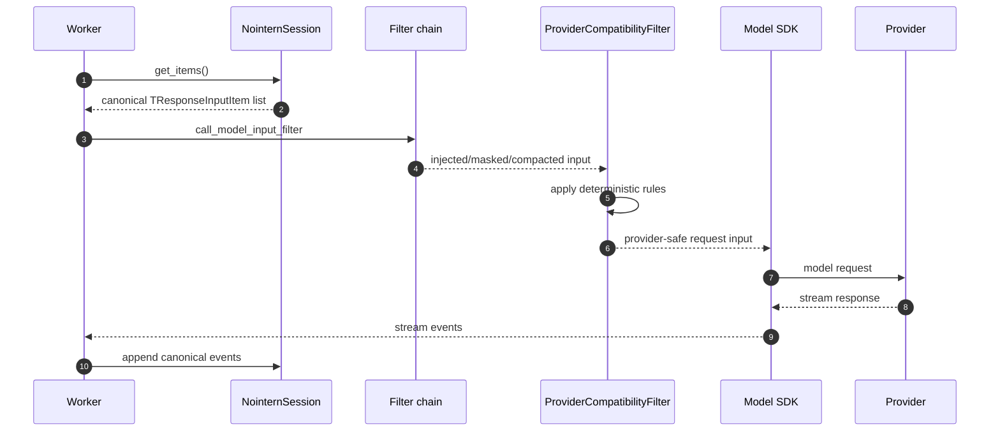

# Provider Compatibility Layer Design

## Overview

NoIntern runtime reuses same conversation history across multiple providers/models. However, each provider has different constraints for request payload, tool call id, reasoning item, media part, schema, and reasoning option. OpenAI Agents SDK provides Responses request shape and tool conversion, but handles little history compatibility across providers/models.

This design introduces OpenCode-level provider/model compatibility handling into NoIntern runtime. Core principles are twofold.

1. Canonical event history in DB is not contaminated with provider-specific workarounds.
2. provider/model constraints are applied deterministically only to request payload immediately before LLM call.

## User Scenarios

1. Even if a session that was using Claude switches to ChatGPT OAuth GPT model, it continues without `input[*].id` format error.
2. When long tool call id generated by Gemini is passed to OpenAI-family model history, it is converted to provider length limit.
3. Even when continuing history containing image/pdf with text-only model, run itself is not blocked and model explains unsupported media to user.
4. Even when switching to providers with different message shape constraints such as Anthropic/Mistral/DeepSeek, it is normalized to compatible payload immediately before request.
5. compatibility transform result is separated from original event history stored in DB, preserving canonical data for replay/debug.

## Discussion Points and Decisions

Reflects D1~D6 decisions discussed in GitHub Discussion #3314.

### D1. Source of truth of Compatibility transform

**Decision: Request-only transform**

- DB/events item remains canonical history.
- provider/model compatibility is applied only right before provider request.
- provider-specific workaround is not stored in events schema or canonical history.

Rationale:

- Like ChatGPT OAuth `input[*].id` removal in PR #3311, workaround needed only for provider request should not remain in DB.
- OpenCode also handles provider compatibility at request boundary.
- Existing NoIntern pre-Agents SDK implementation also applied deterministic transform when reconstructing history into request.

### D2. `filters.py` module split method

**Decision: split by responsibility and change every caller to defining module import**

- Do not grow existing `engine/sdk/filters.py` as package/re-export center.
- Split injection, image lifecycle, observation masking, compaction, compatibility, and combined chain into responsibility-specific modules.
- Following repo convention, callers import directly from defining module.

### D3. Provider metadata preservation policy

**Decision: preserve only when same provider + same model**

- To reduce provider switch errors, metadata from other provider/model is not reused in new request.
- Same direction as OpenCode `differentModel` judgment.
- Can extend later if compatible model family policy is confirmed, but default is conservative.

### D4. Tool id scrub/mapping ownership

**Decision: declarative deterministic compatibility rules**

- mapping table is excluded from default design.
- DB/events keep original canonical id.
- Apply deterministic rule only immediately before provider request.
- Apply same normalizer to `function_call` and `function_call_output` to preserve matching.
- Even on worker restart/resume, same provider-safe id is recomputed from DB history.
- Stateful mapping is reconsidered only later if provider constraint impossible to solve with deterministic transform is confirmed.

Existing NoIntern implementation evidence:

- `fbacdb32b fix(nointern): normalize long call_ids for cross-provider compatibility`
  - deterministic conversion of long `call_id` to `sha256(call_id)[:64]`
  - same normalizer applied to both `function_call` and `function_call_output`
- `7393dab5c fix(nointern): skip incompatible reasoning items on provider switch`
  - judged compatibility by reasoning item id prefix and target model

### D5. Unsupported media handling policy

**Decision: replace with Prompt-level error text**

- Same as OpenCode.
- image/pdf/audio/video part unsupported by model capability is replaced with text error part immediately before request.
- Original media item is preserved in DB/events.
- Run is not blocked.
- Error text includes instruction for model to explain unsupported modality to user.

### D6. Phase split of OpenCode compatibility items

**Decision: split phases by layer**

- Phase 1: filter module split + compatibility layer skeleton
- Phase 2: id/metadata/Responses-family policies
- Phase 3: message shape + tool id normalization
- Phase 4: schema/media/options normalization
- Items more optimization-oriented than correctness, such as prompt cache, are separated as sub-items within Phase 4 or follow-up issue candidates.

## Architecture

### Request-only compatibility boundary



Compatibility layer is located at last request boundary of filter chain. Existing filters continue to handle message injection, image lifecycle, observation masking, and compaction. compatibility filter normalizes result request-only to provider/model constraints.

### Module Structure

In Phase 1, split `engine/sdk/filters.py` into following structure.

```text
engine/sdk/filters/
  injection.py
  image_lifecycle.py
  observation_masking.py
  compaction.py
  compatibility.py
  combined.py
```

Callers import directly from defining module, not re-export.

Example:

```python
from nointern.runtime.sdk.filters.combined import CombinedFilter
from nointern.runtime.sdk.filters.compatibility import ProviderCompatibilityFilter
from nointern.runtime.sdk.filters.compaction import CompactionFilter
```

### Compatibility rule model

Compatibility transform is expressed as declarative rule list.

```python
@dataclass(frozen=True)
class CompatibilityRule:
    """Deterministic transformation rule immediately before provider request."""

    provider: LLMProvider | None
    model_pattern: str | None
    selector: ItemSelector
    transform: ItemTransform
```

Rule must have following properties.

- deterministic: same input always produces same output.
- request-only: does not mutate original event/raw item.
- pair-safe: applies same transform to paired items such as call/output.
- scoped: provider/model condition must be explicit.

## Runtime Flow



Compatibility transform is applied only to provider request input. Response event follows existing parser/converter path. deterministic id transform re-applies same rule to both call/output when reconstructing history, so separate mapping table is unnecessary.

## Provider/model compatibility rules

### Responses API family

Targets:

- `openai`
- `chatgpt_oauth`
- future Azure/OpenAI-compatible Responses path

Rules:

- remove top-level `input[*].id` in `store=False` request
- preserve provider item id/reasoning metadata only for same provider + same model
- remove provider metadata from other provider/model

### Tool call id normalization

Rules:

- Express provider/model-specific `call_id` limits as declarative normalizer.
- Apply same normalizer to `function_call.call_id` and `function_call_output.call_id`.
- Handle length limit with hash-based deterministic transform.

Example:

```python
HashCallId(max_len=64)  # OpenAI family
HashCallId(max_len=9)   # Mistral family, actual limit needs reverification
```

Notes:

- Short max length has collision risk, so Phase 3 verifies actual provider limit and collision risk.
- If provider constraint impossible to solve with deterministic transform is confirmed, reconsider stateful mapping as separate ADR candidate.

### Message shape normalization

Candidates identified from OpenCode are implemented in Phase 3 against NoIntern item shape.

- Anthropic/Bedrock: remove empty text/reasoning part and empty message.
- Anthropic: split invalid assistant message shape where text follows `tool_use`.
- Claude: scrub allowed characters in tool call id.
- Mistral: correct sequence where user message comes immediately after tool message.
- DeepSeek: add empty reasoning when assistant message has no reasoning part.

### Unsupported media fallback

Target modality:

- image
- pdf
- audio
- video

Policy:

- If target model capability does not support modality, replace that content part with text error.
- Text error instructs model to explain unsupported modality to user.
- Remaining supported parts are preserved as-is.

Example text:

```text
ERROR: Cannot read image (this model does not support image input). Inform the user.
```

### Tool schema sanitization

Add provider-specific schema sanitizer in Phase 4.

Gemini candidates:

- convert integer/number enum to string enum
- remove fields in `required` that are absent from properties
- supplement array `items`
- remove `properties` / `required` from non-object type

Moonshot/Kimi candidates:

- remove `$ref` sibling keyword
- correct tuple-style `items`

### Reasoning/thinking/options normalization

Convert option namespace by provider in Phase 4.

- GPT-5/OpenAI/Copilot/Azure: `reasoningEffort`, `reasoningSummary`, encrypted reasoning include
- Claude/Anthropic: `thinking`, `budgetTokens`, adaptive thinking
- Bedrock: `reasoningConfig`
- Gemini: `thinkingConfig`, `thinkingLevel`, `thinkingBudget`
- Alibaba/DashScope: `enable_thinking`

Prompt cache option is more optimization than correctness, so separate as Phase 4 sub-item or follow-up issue candidate.

## Data Model

DB schema change is not included in default design.

| Item | Policy |
|---|---|
| `events.external_id` | keep as canonical dedup key |
| SDK origin raw item | preserve original provider output |
| Compatibility transform result | do not store in DB |
| Tool id mapping table | excluded from default design |
| Provider metadata | remove from request when not same provider + same model |

If provider constraint requiring stateful mapping is later confirmed, decide with separate ADR.

## API / Frontend / Infra

### API

No change. This is runtime-internal request payload compatibility layer, so public API shape does not change.

### Frontend

No change. Provider/model capability metadata continues to use existing management UI and model metadata.

### Infra

No change. Compatibility transform is pure logic inside worker runtime.

## Feasibility Verification

| Item | Verification result |
|---|---|
| Agents SDK built-in handling scope | mostly Responses request builder level, little provider/model compatibility |
| OpenCode implementation method | request boundary transform, metadata removal, provider-specific message/schema/options normalization confirmed |
| Existing NoIntern implementation | deterministic transform precedent confirmed in `fbacdb32b`, `7393dab5c` |
| DB schema change need | unnecessary in default design |
| worker restart handling | can handle by recomputing deterministic transform |
| `filters.py` split risk | import churn exists. Keep Phase 1 split-only to separate from behavior change |

## OpenCode parity matrix

| OpenCode compatibility item | NoIntern application location | Phase |
|---|---|---|
| remove Responses `input[*].id` when `store !== true` | Responses rule in `ProviderCompatibilityFilter` | Phase 1/2 |
| remove provider metadata from other model/provider | provider/model scoped metadata rule | Phase 2 |
| provider-specific tool call id scrub/length limit | deterministic call id normalizer | Phase 3 |
| Anthropic/Bedrock/Mistral/DeepSeek message shape correction | message shape normalization rules | Phase 3 |
| replace unsupported media with text error | capability-based media fallback rule | Phase 4 |
| Gemini/Moonshot/Kimi schema sanitizer | tool schema sanitizer | Phase 4 |
| reasoning/thinking option namespace conversion | model option compatibility rules | Phase 4 |
| prompt cache option adjustment | optimization follow-up candidate | after Phase 4 |

## testenv QA scenarios

Finalize following scenarios in implementation plan PR and cover all added/changed functionality.

| Scenario | Verification content |
|---|---|
| `TC-COMPAT-RESPONSES-001` | Claude/other provider history switches to ChatGPT OAuth and runs without `input[*].id` error |
| `TC-COMPAT-RESPONSES-002` | DB events/external_id remain and top-level id removed only from provider request |
| `TC-COMPAT-METADATA-001` | previous provider metadata is not reused in new provider request on provider/model switch |
| `TC-COMPAT-CALLID-001` | long call id converted by deterministic hash and call/output matching preserved |
| `TC-COMPAT-ANTHROPIC-001` | empty content/tool_use shape normalized to Anthropic-compatible payload |
| `TC-COMPAT-MISTRAL-001` | tool output matching preserved after Mistral tool id/sequence normalization |
| `TC-COMPAT-DEEPSEEK-001` | DeepSeek assistant reasoning requirement satisfied |
| `TC-COMPAT-SCHEMA-001` | Gemini/Moonshot/Kimi schema sanitizer converts invalid schema to provider-acceptable schema |
| `TC-COMPAT-MEDIA-001` | image/pdf/audio/video part replaced with prompt-level error text on modality-unsupported model |

## testenv Impact

- New seed block is not needed by default. Combine existing workspace/session/agent/model seeds.
- Separate cases requiring actual provider API call from pure transform verification cases.
- Most cases are verified with fake model/fake provider request recorder to reduce external provider cost/instability.
- ChatGPT OAuth smoke stays in existing opt-in real provider scenario and is not included in default CI.
- handler must be able to capture provider request payload and compare DB canonical item with request transformed item.

## Implementation Plan

### Phase 1 — filter module split and compatibility layer skeleton

- Split `engine/sdk/filters.py` into responsibility-specific modules.
- Clean up callers to defining module imports.
- Add `ProviderCompatibilityFilter` / `CompatibilityRule` / selector / transform interface.
- Absorb PR #3311 `input[*].id` removal rule into new structure.
- Minimize behavior change and move existing filter tests by module.

### Phase 2 — Responses id/metadata policy

- Generalize Responses API family `store=False` id stripping.
- Limit provider metadata preservation to same provider + same model.
- Add incompatible reasoning/provider metadata removal rule.
- Add ChatGPT OAuth/OpenAI regression test.

### Phase 3 — message shape and tool id normalization

- Add deterministic tool call id normalization rules.
- Remove Anthropic/Bedrock empty content.
- Normalize Anthropic tool_use/text shape.
- Normalize Mistral id/sequence.
- Supplement DeepSeek reasoning part.
- Restore call/output pair regression test at level of legacy commit `fbacdb32b`.

### Phase 4 — schema/media/options normalization

- unsupported media prompt-level fallback
- Gemini schema sanitizer
- Moonshot/Kimi schema sanitizer
- reasoning/thinking option namespace transform
- separate prompt cache option as optimization sub-item or follow-up issue

### testenv QA

- Run all compatibility scenarios listed in implementation plan.
- Analyze FAIL/BLOCKED items, fix in corresponding phase branch, and rebase downstream branches.
- Run entire compatibility scenario suite once at end.

### spec promotion

- Update `docs/nointern/spec/flow/agent-execution-loop.md` and related domain specs.
- Finalize `implemented` date in design document at completion time.
- Propose ADR candidate.

### cleanup

- Remove stale phase design documents.
- Clean up temporary compatibility investigation documents if created.

## Alternatives Considered

### Add provider-specific id namespace to Events schema

Rejected reason:

- provider workaround gets mixed into canonical event history.
- migration/compat cost is high.
- excessive compared with problem solvable by deterministic request transform.

### Store provider-specific materialized session history

Rejected reason:

- multiple canonical histories make replay/dedup/debug difficult.
- provider switch makes truth ambiguous.

### Stateful tool id mapping table

Rejected reason:

- Existing NoIntern implementation has precedent preserving call/output matching with deterministic hash transform.
- worker restart/resume can also recompute same transform from DB history.
- stateful mapping is reconsidered only when provider constraint impossible to solve with deterministic transform is confirmed.

### Block unsupported media with validation error before run start

Rejected reason:

- unnecessarily blocks conversation progress during provider switch/history replay.
- supported text in multipart input also becomes unusable.
- Replacing with prompt-level error text like OpenCode is more natural for agentic flow.

### Split phases by provider

Rejected reason:

- cross-cutting layers such as schema/media/options are duplicated.
- compatibility layer itself is request transform layer rather than provider-specific feature, so layer-based phase is more suitable.

## Risks and Mitigations

| Risk | Mitigation |
|---|---|
| deterministic id hash collision | reverify provider length limits, collision test, separate review for providers with short max length |
| debugging mismatch between request payload and DB history is difficult | provide redacted request transform debug log or test-only recorder |
| import churn causes regression | limit Phase 1 to behavior-preserving split and run targeted/full quality check |
| schema sanitizer mismatches tool runtime validation | include original schema and transformed schema fixtures in sanitizer test |
| excessive provider option default injection | separate correctness items from optimization items; prompt cache is follow-up candidate |

## ADR Candidates

Following decisions are cross-cutting and affect 3+ modules, so propose as ADR candidates.

- Provider compatibility is handled as request-only deterministic transform.
- Tool id compatibility is handled by deterministic rule, not stateful mapping.

ADR creation proceeds after user approval during spec promotion stage.

## Implemented State

- Completed date: 2026-05-03
- Related PRs: #3317, #3319, #3320, #3322, #3323, #3324, #3325
- Changes from design:
  - Mistral/DeepSeek message shape rule was separated as follow-up candidate after checking actual provider SDK payload.
  - provider SDK option wiring first fixed helper and left follow-up extension candidate.
  - cleanup PR was included in spec promotion PR instead of separate PR.
