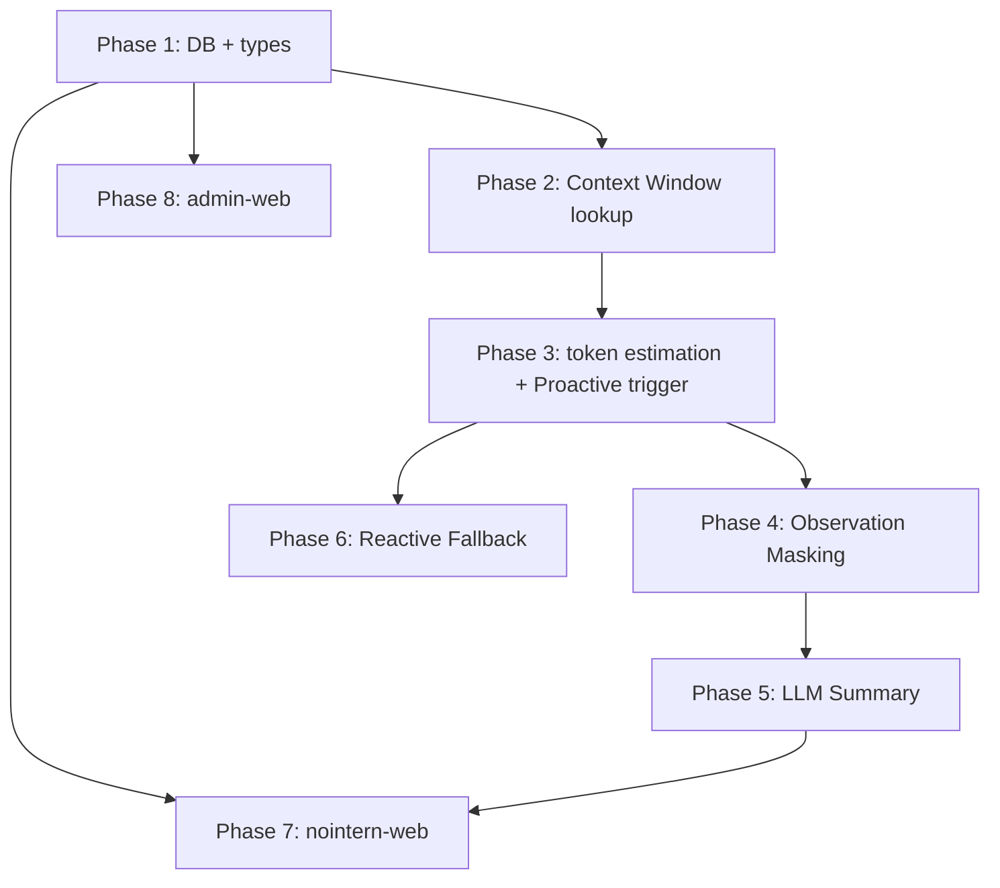

# Agent Context Compaction Design

## Background

ReAct engine loads entire history with `store.list(sid)` and sends it to LLM on every turn. If history exceeds context window, API error occurs. Manage history by compressing it with compaction.

## Decisions

### 1. Token counting method: Post-response based

Because tokenizer differs per model, use **LLM response `usage`** instead of direct pre-request counting.

- Store `TokenUsage` in `TurnCompleteEvent` every turn (implemented).
- `prompt_tokens` is accurate measurement of "history size so far".
- Roughly estimate only new events: `len(str(e)) // 4`.

### 2. Compaction trigger

**Dual strategy: Proactive + Reactive**

| Path | Strategy | Reason |
|------|------|------|
| every loop iteration | proactive (estimate-based) | prevention |
| LLM API error | reactive (catch fallback) | safety net against estimation error |

User message is also processed inside ReAct loop, so integrated without separate branch.

### 3. Threshold & Context Window Lookup

**threshold = `effective_max_input_tokens * 0.9`** (hardcoded, configurable later)

`effective_max_input_tokens` is calculated as `min(main_model_max_input, summary_model_max_input)`. If summary model has smaller context window than main model, threshold must be based on summary model so summary model can read history while generating compaction summary.

`max_input_tokens` 3-step fallback:

```python
# 1. admin override (llm_provider_models.metadata_ JSONB)
max_input = provider_model.metadata.get("max_input_tokens") if provider_model.metadata else None

# 2. litellm default
if max_input is None:
    try:
        info = litellm.get_model_info(litellm_model_string)
        max_input = info["max_input_tokens"]
    except Exception:
        pass

# 3. final fallback
if max_input is None:
    max_input = 128_000

threshold = int(max_input * 0.9)
```

- Use existing `metadata_` JSONB column → no schema change needed.
- litellm fetches `model_prices_and_context_window.json` from GitHub at runtime (uses bundled backup on failure).
- 128K fallback is minimum among currently supported models (GPT-4o).

### 4. Token estimation logic

```python
last_tc = next(
    (e for e in reversed(history) if isinstance(e, TurnCompleteEvent)),
    None,
)

if last_tc and last_tc.usage:
    new_events = history[history.index(last_tc) + 1:]
    new_tokens_estimate = sum(len(str(e)) for e in new_events) // 4

    estimated = (
        last_tc.usage.prompt_tokens
        + last_tc.usage.completion_tokens
        + new_tokens_estimate
    )
```

- `prompt_tokens + completion_tokens`: full context at last turn point (completion is also included in next-turn history).
- First turn has `last_tc` None → skip compaction (history short).

### 5. Engine loop change (planned)

```python
while True:
    history = store.list(sid)

    # proactive compaction
    last_usage = find_last_turn_complete(history)
    if last_usage and estimated_tokens(last_usage, history) > threshold:
        compact(sid)
        history = store.list(sid)

    try:
        stream = llm.stream(history)
    except ContextWindowExceeded:
        # fallback safety net
        compact(sid)
        history = store.list(sid)
        stream = llm.stream(history)  # retry once
```

### 6. Compaction strategy: 2-step Hybrid

**Step 1: Observation Masking** — replace tool output with placeholder without LLM call
- Keep tool call signature (function name + arguments), replace only output with `[Output hidden]`.
- JetBrains study (NeurIPS 2025): performance equivalent to LLM summary, 50% cost reduction.
- **Protection zone: `max_input_tokens * 0.3`** — keep original tool output within recent 30% tokens.

**Step 2: LLM Summary** — if still exceeds after observation masking
- Full re-summarization: summarize entire history outside protection zone with a single LLM request.
- On repeated compaction, previous summary is also included and re-summarized (summary-of-summary).
- Summary model: agent `model_parameters.summary_model_id` (looked up as model_identifier of same provider) → fallback to main model.
- Compaction threshold based on context window of `min(main_model, summary_model)`.
- **Protection zone boundary is cut by `TurnCompleteEvent` unit** — turn intersecting token-based 30% boundary is included in summary side.
- Events subject to summary are deleted from DB and replaced with summary event (original not preserved).

**Memory supplement: use session file storage**
- Agent directly stores important information in sandbox file system (e.g. `notes.md`).
- Files remain in sandbox after compaction → can be re-read when needed.
- No separate memory system needed; use existing file read/write tool.
- Include instruction in compaction prompt: "store important information in files".

### 7. Preservation priority for summary

| Preserve (High Priority) | Can discard (Low Priority) |
|---|---|
| current task state, next steps | old tool output (can re-query) |
| error/failure history | exploration/search results |
| architecture decisions | intermediate reasoning process |
| file paths, line numbers (exactly) | success confirmation messages |
| user constraints | duplicate information |

### 8. Summary prompt: OpenCode-style handoff

Generate structured summary with single LLM request.

**System prompt:**

```
You are a helpful AI assistant tasked with summarizing conversations.

When asked to summarize, provide a detailed but concise summary of the conversation.
Focus on information that would be helpful for continuing the conversation, including:
- What was done
- What is currently being worked on
- Which files are being modified
- What needs to be done next
- Key user requests, constraints, or preferences that should persist
- Important technical decisions and why they were made

Your summary should be comprehensive enough to provide context but concise enough to be quickly understood.

Do not respond to any questions in the conversation, only output the summary.
```

**User message (with history to summarize):**

```
Provide a detailed summary for continuing this conversation.
The summary will be used so that another agent can read it and continue the work.

Stick to this template:
---
## Goal
[What goal(s) is the user trying to accomplish?]

## Instructions
[What important instructions did the user give that are relevant?]
[If there is a plan or spec, include information about it so next agent can continue using it.]

## Discoveries
[What notable things were learned during this conversation that would be useful for the next agent?]

## Accomplished
[What work has been completed, what is still in progress, and what is left?]

## Relevant files / directories
[Structured list of relevant files that have been read, edited, or created.]
---
```

**Continuation message (injected into history after summary):**

```
This session is being continued from a previous conversation that ran out of context.
The summary below covers the earlier portion of the conversation.

{summary}

Continue the work from where it left off.
```

## Open Items

- [x] Distinguish `ContextWindowExceeded` error — use `litellm.exceptions.ContextWindowExceededError`.
- [x] Compaction strategy — 2-step hybrid (observation masking → LLM summary).
- [x] Model-specific context window lookup — admin metadata override → litellm → 128K fallback.
- [x] Storage structure — delete original + replace with summary event. Do not preserve original.
- [x] Summary prompt design — OpenCode-style 5-section handoff.
- [x] Summary result shape — stored in DB as `role='compaction'`, mapped to `user` message when sent to LLM.

## Implementation Plan

### Phase 1: DB schema + type extension

#### 1-1. Extend `message_role` ENUM

**File**: new Alembic migration

```sql
ALTER TYPE message_role ADD VALUE IF NOT EXISTS 'compaction';
ALTER TYPE message_role ADD VALUE IF NOT EXISTS 'compaction_started';
```

#### 1-2. Extend `SessionEvent` type

**File**: `engine/types.py`

```python
@dataclasses.dataclass(frozen=True)
class CompactionEvent:
    """Compaction summary event. Replaces previous history."""
    content: str  # summary text

@dataclasses.dataclass(frozen=True)
class CompactionStartedEvent:
    """Marker while compaction is in progress. Deleted on completion."""
    pass
```

- Add `CompactionEvent`, `CompactionStartedEvent` to `SessionEvent` union.

#### 1-3. Add `summary_model_id` to `ModelParameters`

**File**: `core/agent.py`

```python
class ModelParameters(BaseModel):
    # ... existing fields ...
    summary_model_id: str | None = Field(default=None)
```

- Summary model user directly configures in agent settings (uses current session model if unspecified).

#### 1-4. EventStore serialization/deserialization

**File**: `runtime/event_store.py`

- `_event_to_rdb_kwargs()`:
  - `CompactionEvent` → `role=COMPACTION, content=summary_text`
  - `CompactionStartedEvent` → `role=COMPACTION_STARTED, content=""`
- `_to_session_event()`:
  - `role=COMPACTION` → `CompactionEvent(content=...)`
  - `role=COMPACTION_STARTED` → `CompactionStartedEvent()`

#### 1-5. LLM input conversion

**File**: `runtime/llm.py`

- `_build_input_items()`:
  - `CompactionEvent` → convert to `user` role message, wrap in continuation message: `"This session is being continued...{content}...Continue the work."`
  - `CompactionStartedEvent` → skip (not included in LLM input)

---

### Phase 2: Context Window Lookup

#### 2-1. `max_input_tokens` lookup function

**File**: new file `engine/context.py`

```python
def get_max_input_tokens(
    provider_model_metadata: dict[str, object] | None,
    litellm_model: str,
) -> int:
    """max_input_tokens 3-step fallback."""
    # 1. admin override
    if provider_model_metadata:
        override = provider_model_metadata.get("max_input_tokens")
        if isinstance(override, int):
            return override
    # 2. litellm
    try:
        info = litellm.get_model_info(litellm_model)
        return info["max_input_tokens"]
    except Exception:
        pass
    # 3. fallback
    return 128_000
```

#### 2-2. Threshold calculation

In same file:

```python
COMPACTION_THRESHOLD_RATIO = 0.9
PROTECTION_RATIO = 0.3

def get_compaction_threshold(max_input: int) -> int:
    return int(max_input * COMPACTION_THRESHOLD_RATIO)

def get_protection_tokens(max_input: int) -> int:
    return int(max_input * PROTECTION_RATIO)
```

#### 2-3. Pass context window information to `RunRequest`

**Files**: `engine/types.py`, `engine/run/resolve.py`

- Add `max_input_tokens: int` field to `RunRequest`.
- Call `get_max_input_tokens()` in `resolve_invoke_input()` and set value.

---

### Phase 3: Token estimation + Proactive trigger

#### 3-1. Token estimation function

**File**: `engine/context.py`

```python
def estimate_tokens(history: list[SessionEvent]) -> int | None:
    """Token estimate based on usage of last TurnCompleteEvent. None if absent."""
    last_tc = next(
        (e for e in reversed(history) if isinstance(e, TurnCompleteEvent)),
        None,
    )
    if last_tc is None or last_tc.usage is None:
        return None

    tc_index = len(history) - 1 - list(reversed(history)).index(last_tc)
    new_events = history[tc_index + 1:]
    new_tokens = sum(len(str(e)) for e in new_events) // 4

    return (
        last_tc.usage.prompt_tokens
        + last_tc.usage.completion_tokens
        + new_tokens
    )
```

#### 3-2. Insert proactive check into engine loop

**File**: `engine/engine.py` — `run()` method

Immediately after history load (`_inject_cached_images`) and before LLM call:

```python
estimated = estimate_tokens(history)
if estimated is not None and estimated > get_compaction_threshold(request.max_input_tokens):
    await self._compact(sid, history, request)
    history = _inject_cached_images(
        await self._store.list(sid), image_cache, sid
    )
```

---

### Phase 4: Observation Masking

#### 4-1. Masking function

**File**: `engine/context.py`

```python
def mask_observations(
    history: list[SessionEvent],
    protection_tokens: int,
) -> list[SessionEvent]:
    """Replace ToolResultEvent.content outside protection zone with placeholder."""
```

Logic:
1. Iterate `TurnCompleteEvent` in reverse and accumulate `prompt_tokens + completion_tokens`.
2. Mask `ToolResultEvent` before point where accumulation exceeds `protection_tokens`.
3. Protection zone boundary is cut by `TurnCompleteEvent` unit.
4. Masked event: `content="[Output hidden]"`, `attachments=[]`, `images=[]`.

#### 4-2. Apply masking in engine

**File**: `engine/engine.py`

When threshold exceeded in proactive check:
1. First apply `mask_observations()`.
2. Re-estimate with masked history.
3. If still exceeds → proceed to Phase 5 LLM summary.

---

### Phase 5: LLM Summary Compaction

#### 5-1. Summary boundary calculation

**File**: `engine/context.py`

```python
def find_compaction_boundary(
    history: list[SessionEvent],
    protection_tokens: int,
) -> int | None:
    """Return event index of protection zone boundary. TurnCompleteEvent unit."""
```

Accumulate usage of `TurnCompleteEvent` in reverse, and return index of `TurnCompleteEvent` at point where `protection_tokens` is exceeded. Turn intersecting boundary is included in summary side.

#### 5-2. Summary LLM call

**File**: `engine/context.py` or new file `engine/compaction.py`

```python
async def generate_summary(
    llm: LLMClient,
    events_to_summarize: list[SessionEvent],
    model: str,
    credential_kwargs: dict[str, object],
) -> str:
    """Generate structured summary with single LLM call."""
```

- system prompt + user message (serialize target history into text) + template instruction
- non-streaming call (only summary result needed)
- summary model: `model_parameters.summary_model_id` → fallback to current model

#### 5-3. DB replacement — delete original + insert summary

**File**: `runtime/event_store.py` or `repos/message/store.py`

Add new method to `EventStore`:

```python
async def compact(
    self,
    session_id: str,
    boundary_event_id: str,  # delete through this event
    summary: CompactionEvent,
    model: str,
) -> None:
    """Delete events before/through boundary + insert CompactionEvent."""
```

Transaction:
1. DELETE every event up to and including `boundary_event_id`.
2. INSERT `CompactionEvent` as new event (position = 0 or first).

#### 5-4. Orchestrate compact in engine

**File**: `engine/engine.py`

```python
async def _compact(
    self,
    sid: str,
    history: list[SessionEvent],
    request: RunRequest,
) -> None:
    """Run 2-step compaction."""
    protection = get_protection_tokens(request.max_input_tokens)

    # Insert CompactionStartedEvent marker (for frontend status display)
    await self._store.append(sid, CompactionStartedEvent())

    try:
        # Step 1: observation masking
        masked = mask_observations(history, protection)
        if estimate_tokens(masked) <= get_compaction_threshold(request.max_input_tokens):
            await self._store.mask_tool_results(sid, protection)
            return

        # Step 2: LLM summary
        boundary_idx = find_compaction_boundary(history, protection)
        events_to_summarize = history[:boundary_idx + 1]
        summary_text = await generate_summary(
            self._llm, events_to_summarize, request.model, request.credential_kwargs,
        )
        await self._store.compact(
            sid,
            boundary_event_id=history[boundary_idx].id,
            summary=CompactionEvent(content=summary_text),
            model=request.model,
        )
    finally:
        # Delete CompactionStartedEvent marker (may already have been deleted by compact transaction)
        await self._store.delete_compaction_started(sid)
```

**Frontend status tracking flow:**

1. Enter `_compact()` → save `CompactionStartedEvent` to DB → deliver through WebSocket.
2. Frontend: show "Compacting context..." UI.
3. On refresh: history load → `CompactionStartedEvent` exists → show same UI.
4. Compaction complete → marker deleted + `CompactionEvent` inserted → frontend updates.

---

### Phase 6: Reactive Fallback (ContextWindowExceededError)

#### 6-1. Error catch branch

**File**: `engine/engine.py`

Before existing `except OpenAIAPIError`:

```python
except ContextWindowExceededError:
    logger.warning("Context window exceeded, triggering compaction", ...)
    await self._compact(sid, history, request)
    history = _inject_cached_images(
        await self._store.list(sid), image_cache, sid
    )
    # retry once — if it fails again, pass to existing error handling
    async for stream_event in self._llm.stream(...):
        ...
```

#### 6-2. Add import

```python
from litellm.exceptions import ContextWindowExceededError
```

---

### Phase 7: Frontend — nointern-web

#### 7-1. Extend ChatEvent type

**File**: `features/chat/types.ts`

Add compaction events to `ChatEvent` union:

```typescript
| CompactionEvent         // type: "compaction", content (summary text)
| CompactionStartedEvent  // type: "compaction_started"
```

Add `"compaction"`, `"compaction_started"` to `ChatMessage` role union.

#### 7-2. WebSocket event handling

**File**: `features/chat/containers/useChatWebSocket.ts`

- On `compaction_started` receive → set `isCompacting: true` state.
- On `compaction` (complete) receive → set `isCompacting: false`, add compaction summary to message list.
- On history batch load: if `compaction_started` role exists, set `isCompacting: true`.

#### 7-3. Compaction in-progress UI

**File**: new component `features/chat/components/CompactionIndicator.tsx`

- `isCompacting` state → show loading indicator at bottom of chat.
- Text "Compacting context..." + spinner.
- Dotted-line style similar to `TurnDivider`, centered indicator.

#### 7-4. CompactionEvent rendering

**File**: `features/chat/components/ChatView.tsx`

- `compaction` role → divider style like `TurnDivider`.
- Collapsed state: text "Previous conversation was summarized".
- Expand: show summary content (markdown rendering).

#### 7-5. Agent settings — Compaction model selection

**Files**: `features/agents/components/AgentForm.tsx`, `features/agents/schemas.ts`

- Add `summary_model_id` field to form (optional).
- Dropdown similar to current model selector (model list from same provider).
- If unspecified, use current session model (explain with placeholder).

#### 7-6. i18n

**Files**: `messages/{en-US,ko-KR,ja-JP,fr-FR}.json`

| key | en-US | ko-KR |
|-----|-------|-------|
| `chat.compaction.inProgress` | Compacting context... | Compacting context... |
| `chat.compaction.summary` | Previous conversation was summarized | Previous conversation was summarized |
| `chat.compaction.expand` | Show summary | Show summary |
| `chat.compaction.collapse` | Hide summary | Hide summary |
| `agent.summaryModel` | Summary model | Summary model |
| `agent.summaryModelDescription` | Model used for context summarization (optional) | Model used for context summarization (optional) |

Add same key structure for ja-JP and fr-FR.

---

### Phase 8: Admin UI — nointern-admin-web

#### 8-1. Provider Model management page

**File**: `typescript/apps/nointern-admin-web/src/features/provider-models/`

Use existing admin API (`PATCH /llm-provider-models/{provider}/{model_identifier}`).

- Provider model full list query page (`/provider-models`)
- `max_input_tokens` override field: numeric input inside metadata (if set, used instead of litellm default)
- Edit modal: edit available, image_generation, thinking, max_input_tokens
- Add inline `max_input_tokens` editing to Provider Model list on existing LLM Models detail page

#### 8-2. Backend + tRPC router

- Add `GET /llm-provider-model/v1/llm-provider-models` — full list query endpoint.
- Add `llmProviderModel.listAll` tRPC procedure.
- Regenerate OpenAPI spec + nointern-admin-client.

---

### Implementation Order and Dependencies



- Phase 1~3: base infrastructure (sequential)
- Phase 4~5: compaction core (sequential)
- Phase 6: can be implemented independently after Phase 3
- Phase 7 (nointern-web): type work possible after Phase 1, compaction UI after Phase 5
- Phase 8 (nointern-admin-web): independently possible after Phase 1 (`max_input_tokens` override UI)

### Completion Status

- [x] Phase 1: DB schema + type extension
- [x] Phase 2: Context Window lookup
- [x] Phase 3: token estimation + Proactive trigger
- [x] Phase 4: Observation Masking
- [x] Phase 5: LLM Summary Compaction
- [x] Phase 6: Reactive Fallback
- [x] Phase 7: Frontend — nointern-web
- [x] Phase 8: Admin UI — nointern-admin-web

### Verification Plan

#### Unit tests

- `estimate_tokens()`: various history combinations (first turn, middle turn, usage absent)
- `mask_observations()`: protection zone boundary, empty history, no tool result
- `find_compaction_boundary()`: boundary calculation by TurnCompleteEvent
- `get_max_input_tokens()`: each path of 3-step fallback
- `CompactionStartedEvent` serialization/deserialization
- `CompactionEvent` → LLM input conversion (user role + continuation wrapping)

#### Integration tests

- Proactive compaction: auto compaction when threshold exceeded → normal LLM call
- Reactive fallback: `ContextWindowExceededError` → compaction → retry succeeds
- 2-step transition: observation masking insufficient → proceed to LLM summary
- DB consistency: event count after compaction, summary event existence
- Repeated compaction: previous summary included in re-summary on second compaction
- CompactionStartedEvent lifecycle: insert → deleted after compaction complete
- Cleanup CompactionStartedEvent on failure during compaction (finally block)

#### Frontend tests

- CompactionEvent rendering: collapse/expand, summary markdown display
- CompactionStartedEvent: show "compacting" indicator
- Detect CompactionStartedEvent after refresh → keep indicator
- Agent settings: select/unselect summary_model_id

#### E2E tests

- Long conversation: simulate conversation that actually exceeds context window
- Admin: set provider model max_input_tokens override → confirm compaction threshold changes
