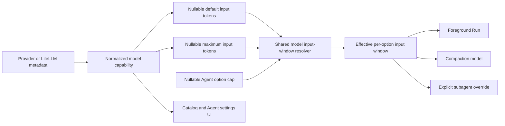

# Model Context Ranges Design

- Snapshot: `context-260827`
- Document reference: `context-260827/DESIGN`
- Requirements:
  [`context-260827/REQ`](../requirements/context-260827-model-context-ranges.md)
- Decisions: [`context-260827/ADR`](../adr/context-260827-model-context-ranges.md)

## Current Behavior and Requirement Gaps

`ModelContextWindow` exposes one input value, `max_input_tokens`. Provider listing
adapters assign each provider's available context value to that field. ChatGPT
metadata can contain both `context_window` and `max_context_window`, but the current
normalizer returns the first positive value and therefore stores only the default.

Runtime helpers resolve one input value from normalized capability, LiteLLM, or the
128,000-token fallback. Agent output, Run preparation, lightweight compaction, and
subagent override paths call that helper separately and then apply user caps at
different call sites.

The model picker displays `max_input_tokens` as one context badge. The Agent option
settings modal describes the same value only as a capability limit, so it cannot
explain a smaller provider default and larger configurable maximum.

| Requirement | Current gap |
| --- | --- |
| `context-260827/REQ-1` | The capability cannot retain distinct default and maximum values. |
| `context-260827/REQ-2` | Default fallback exists only accidentally because one field owns both meanings. |
| `context-260827/REQ-3` | User-cap application is duplicated and starts from the single capability value. |
| `context-260827/REQ-4` | UI can display only one context value. |
| `context-260827/REQ-5` | Generated contracts and fixtures have no additive default field. |

## Requirement and Decision Traceability

| Requirement | ADR authority | Primary mechanisms |
| --- | --- | --- |
| `context-260827/REQ-1` | `context-260827/ADR-D1` | M1, M2 |
| `context-260827/REQ-2` | `context-260827/ADR-D1`, `ADR-D2` | M1, M3 |
| `context-260827/REQ-3` | `context-260827/ADR-D2` | M3, M4 |
| `context-260827/REQ-4` | Confirmed requirement | M5 |
| `context-260827/REQ-5` | `context-260827/ADR-D1`, `ADR-D2` | M1, M6 |

## Architecture and Ownership



- Provider listing and system projection own extraction of provider/source values.
- `ModelContextWindow` owns the normalized contract.
- The shared engine context-window resolver owns fallback, invariant enforcement,
  user-cap clamping, and the effective per-option value.
- Agent service, Run resolver, and subagent resolver consume the shared result.
- The web client presents generated capability data and performs no independent
  runtime-limit inference beyond the same null fallback for display.

## Capability and API Contract

`ModelContextWindow` becomes:

```json
{
  "default_input_tokens": 272000,
  "max_input_tokens": 872000,
  "max_output_tokens": null
}
```

`default_input_tokens` is nullable and additive. `max_input_tokens` retains its
existing name and becomes unambiguously the hard input ceiling.

Provider projection rules:

- ChatGPT: `context_window` maps to the default; `max_context_window` maps to the
  maximum; when the maximum is absent, the default also supplies the maximum.
- Providers with one context value: the value maps to the maximum and the default
  remains null.
- LiteLLM system/enrichment projection: `max_input_tokens` maps to the maximum;
  future explicit default metadata may map to the default without contract change.
- Legacy metadata conversion accepts both normalized keys and preserves the
  maximum-only fallback.

OpenAPI is regenerated from the backend schema, followed by Python and TypeScript
public/admin client regeneration through the existing generator.

## Runtime Resolution

Add a frozen structured resolution result containing:

- resolved default input tokens;
- resolved maximum input tokens;
- effective input tokens after nullable user intent.

The resolver performs:

1. Validate positive capability values through the existing Pydantic contract.
2. Load the LiteLLM `max_input_tokens` fallback best-effort.
3. Resolve maximum from explicit capability maximum, otherwise the larger of a
   known capability default and LiteLLM fallback, otherwise 128,000.
4. Resolve default from capability default or resolved maximum.
5. Clamp the resolved default to the resolved maximum.
6. Resolve effective input as the default when user intent is null, otherwise the
   smaller of user intent and resolved maximum.

The Run resolver computes effective values independently for the foreground and
lightweight options. Existing compaction calculation then selects the smaller
effective option value. Agent API display and subagent overrides use the same
resolver.

The existing `RunRequest.max_input_tokens` remains the already resolved foreground
value in this snapshot. Provider adapters, worker persistence, prepared inference
state, and event filters therefore require no new transport mode.

## Frontend Behavior

The catalog badge uses the resolved display default
`default_input_tokens ?? max_input_tokens`.

- When default and maximum are equal or only one effective value exists, show the
  existing concise context badge.
- When both exist and differ, show a badge that communicates the default and
  maximum values.

The Agent option settings modal derives:

- default: `default_input_tokens ?? max_input_tokens`;
- maximum: `max_input_tokens`.

An empty context-cap input is described as using the default. The capability
description identifies the maximum. Existing option values remain unchanged and
may exceed the displayed maximum because runtime owns clamping.

English, Korean, and Japanese locale files receive structurally identical message
keys with natural localized copy.

## Persistence, Migration, and Rollout

No relational migration is required. Catalog entries and Agent model snapshots
store normalized capabilities as JSON.

Historical JSON without `default_input_tokens` validates with null and resolves its
maximum as the default. A refreshed catalog can add the distinct default, while
existing Agent snapshots retain maximum-only fallback until the Agent option is
resolved from a newer catalog through its existing update lifecycle.

Deployment order is ordinary application deployment with regenerated clients.
Rollback to a previous binary remains safe because the new JSON field is ignored by
the previous Pydantic contract and does not alter relational schema.

## Failure and Recovery

- Invalid non-positive provider values remain absent through existing validation.
- An explicit default above an explicit maximum is clamped at resolution time and
  covered by deterministic tests.
- LiteLLM lookup failure retains the existing 128,000-token fallback, except that a
  known capability default remains authoritative.
- Catalog sync failure preserves the previous successful snapshot under existing
  catalog behavior.
- Runtime retries and recovery continue using the already prepared effective
  context snapshot.

## Test Strategy

### E2E primary verification matrix

| Scenario | Expected evidence |
| --- | --- |
| No Agent cap and default lower than maximum | Prepared Session effective context equals the default. |
| Agent cap between default and maximum | Prepared Session effective context equals the configured cap. |
| Agent cap above maximum | Prepared Session effective context equals the maximum. |
| Capability has maximum only | Prepared Session effective context equals the maximum. |

Extend the deterministic model-listing fixture with a model whose default is lower
than its maximum and cover the matrix in the required public inference-profile or
model-selection E2E surface. The test uses deterministic provider fixtures and
requires no live credential.

Backend unit tests cover capability serialization, provider projections, fallback
resolution, Agent output, Run preparation, compaction, and subagent override.
Frontend tests or Storybook interaction checks cover equal-value and split-value
catalog badges and settings descriptions. Generated OpenAPI and client diffs are
validated through their standard build/typecheck suites.

Required CI must fail on any deterministic E2E, backend test, frontend test,
typecheck, lint, generated-contract, or documentation validation failure. No live
or optional provider test is required.

## Observability and Operational Risk

No new metric or log event is required. Existing prepared inference state and Agent
effective context output remain the operational evidence of the selected effective
window.

The primary rollout risk is accidentally treating the maximum as the default. The
shared resolver and deterministic E2E matrix directly guard that distinction.

## Design Authority

- Design revision: `1`

| ID | Material design mechanism | Authority | Classification |
| --- | --- | --- | --- |
| M1 | Add nullable default input tokens beside maximum input tokens. | `context-260827/REQ-1`, `REQ-2`; `context-260827/ADR-D1` | `decided` |
| M2 | Project every provider through the shared two-value contract. | `context-260827/REQ-1`; `context-260827/ADR-D1` | `required` |
| M3 | Centralize default, maximum, fallback, and user-cap resolution. | `context-260827/REQ-2`, `REQ-3`; `context-260827/ADR-D2` | `decided` |
| M4 | Preserve existing smaller-main/lightweight compaction behavior using resolved option windows. | `context-260827/REQ-3`; current context-compaction Spec | `derived` |
| M5 | Present default and maximum distinctly when they differ. | `context-260827/REQ-4` | `required` |
| M6 | Use additive JSON/OpenAPI rollout with historical maximum-to-default fallback. | `context-260827/REQ-5`; `context-260827/ADR-D1`, `ADR-D2` | `derived` |

## Authority and Feasibility Validation

- Every requirement maps to at least one material mechanism.
- Every material mechanism is authorized by confirmed Requirements, accepted ADR
  decisions, or unchanged current Specs.
- The capability is JSON-backed, so additive rollout is feasible without a
  relational migration.
- All effective-window consumers are repository-visible and can use one shared
  resolver without changing provider transport protocols.
- Deterministic provider and E2E fixtures can express distinct default and maximum
  values without live credentials.

Result: `feasible`.

## Removal and Replacement

| Existing unit or behavior | Removal authority | Replacement or remaining authority | Removal boundary | Absence verification |
| --- | --- | --- | --- | --- |
| ChatGPT helper that selects the first of default or maximum | `context-260827/REQ-1`, `REQ-3` | Provider projection preserving both values | Provider listing normalization and tests | Search finds no first-value collapse helper. |
| Repeated capability/max/user-cap resolution in Agent, Run, and subagent paths | `context-260827/ADR-D2` | Shared structured resolver | All effective context-window call sites | Search finds no direct per-call-site max-only fallback. |
| UI assumption that one value is both default and maximum | `context-260827/REQ-4` | Split-aware badge and settings copy | Model picker, settings modal, stories/tests, locales | Split-value fixture renders both values. |
| Existing persisted JSON rows | None | Retained with maximum-to-default fallback | No migration or rewrite | Legacy maximum-only tests remain green. |

## Design Approval

- Mode: `Collaborative`
- Decision owner: requester
- Approved on: `2026-08-27`
- Approved Design revision: `1`
- Approved authority IDs: `M1`, `M2`, `M3`, `M4`, `M5`, `M6`
- Approved scope: provider-neutral default and maximum model context capability,
  maximum-to-default fallback, centralized runtime resolution, compatible generated
  contracts, and split-aware UI presentation requested for immediate implementation.
