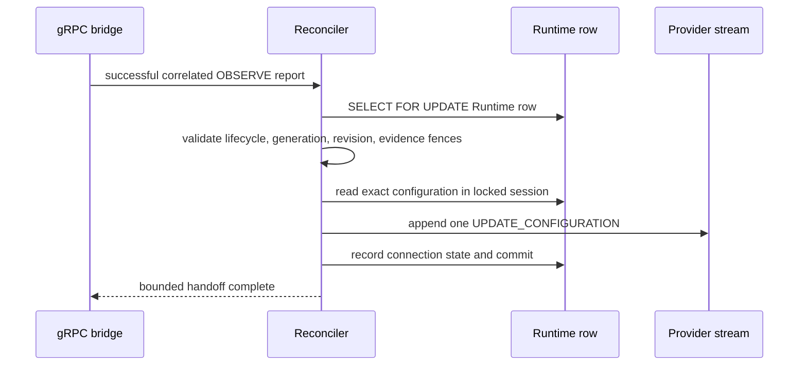

# Runtime Bounded Repair Fencing Design

- Snapshot: `control-260805`
- Document reference: `control-260805/DESIGN`
- Requirements: [Runtime Bounded Repair Fencing Requirements](../requirements/control-260805-bounded-repair-fencing.md)
- ADR: [Runtime Bounded Repair Fencing](../adr/control-260805-bounded-repair-fencing.md)

## Current Behavior and Gap

The bounded re-observation design correctly avoids a durable drift queue, but a
Runtime Profile resolver can replace the desired configuration revision without
advancing desired generation. A configuration assembled from an unlocked
snapshot could therefore be stale before it is appended to the Provider stream.
The current schema also must remove the former durable projection without
rewriting a potentially deployed migration revision.

## Requirement and ADR Traceability

| Requirement | ADR decisions | Design mechanisms |
| --- | --- | --- |
| `control-260805/REQ-1` | D1 | M1, M2 |
| `control-260805/REQ-2` | D2 | M3 |
| `control-260805/REQ-3` | D3 | M4 |

## Architecture and Ownership

### M1. Locked current-target decision

`reconcile_observe_completion` obtains the existing Runtime row lock before it
checks Provider identity/generation, observed/desired generation, running
lifecycle, lifecycle-dispatch marker, terminal-delete absence, and exact
desired/applied configuration revision. It validates configuration evidence in
the same session.

The lock is held through configuration envelope construction and the Provider
request append. A write that replaces the desired configuration pointer or
advances lifecycle state must wait; after the append, that write creates the
next current target. This is serialization, not a durable repair claim.

### M2. Existing bounded handoff remains authoritative

Only a successful completion correlated to a relayed `OBSERVE` reaches this
path. The request-ID correlation stays stream-local and is removed at
completion or stream closure. The dispatch is a single in-place
`UPDATE_CONFIGURATION`; failed/lost completion or dispatch has no local retry
and awaits a future periodic `OBSERVE`.

### M3. Forward schema removal

`d51acb332a07` has `142719f5305a` as its `down_revision`. Its upgrade drops the
reconciliation foreign key, candidate index, columns, and enum. Its downgrade
recreates the former schema to preserve graph reversibility. The repository,
domain model, and runtime paths contain no reconciliation persistence after
upgrade.

### M4. Structured transient observability

The Reconciler logs both an eligible repair handoff and successful dispatch with
Runtime ID, Provider ID, Provider generation, desired generation, configuration
revision, reconciliation kind, and reconciliation reason. These values are
bound to the active call and are not stored in `agent_runtimes`.

## Failure and Recovery

- A stale stream generation, lifecycle transition, terminal delete, desired/applied
  mismatch, or configuration evidence mismatch prevents queue append.
- A Provider connection loss or append failure releases the row lock without
  creating drift state; periodic `OBSERVE` is the sole retry trigger.
- A Control restart loses request-ID correlation and cannot repair until a new
  current periodic observation completes.
- The lock does not call Kubernetes and does not authorize Provider-local retry.

## Migration and Rollout

Deploy the linear successor migration with the application revision. Do not edit
or rerun historical migration files manually. No backfill is needed: obsolete
reconciliation data is intentionally discarded. No live migration execution,
restart, deployment, or infrastructure mutation is performed by this work.

## Observability

Structured logs provide correlation at the handoff and dispatch boundary. The
expected fields are `runtime_id`, `provider_id`, `provider_generation`,
`desired_generation`, `configuration_revision_id`, `reconciliation_kind`, and
`reconciliation_reason`.

## Verification

- Focused Reconciler tests prove a current drift observation dispatches once,
  stream-local duplicate completion does not re-dispatch, and stale generations,
  configuration revisions, lifecycle dispatch, and terminal deletion are fenced.
- Focused tests assert the structured handoff and dispatch log fields and that
  the repair path uses the locked Runtime-row fetch.
- Alembic verifies `d51acb332a07` as head and exercises upgrade/downgrade through
  the backend test suite.
- Full backend lint, format, type, test, generated-doc index, and pre-commit
  checks validate the integrated change.

## Design Authority

| ID | Material design mechanism | Authority | Classification |
| --- | --- | --- | --- |
| M1 | Runtime-row lock held through current bounded repair append | `control-260805/REQ-1`, `ADR-D1` | `decided` |
| M2 | Preserve stream-local OBSERVE-only one-shot repair semantics | `control-260805/REQ-1`, current `runtime-260805` behavior | `derived` |
| M3 | Successor reversible schema-removal migration | `control-260805/REQ-2`, `ADR-D2` | `decided` |
| M4 | Handoff and dispatch structured log fields | `control-260805/REQ-3`, `ADR-D3` | `decided` |

## Removal and Replacement

| Existing behavior | Removal authority | Replacement | Absence verification |
| --- | --- | --- | --- |
| Unlocked re-read before bounded repair append | `ADR-D1`, M1 | Locked Runtime-row serialization | Repair path uses `get_by_id_for_update` and same-session configuration lookup |
| Historical migration rewrite or deletion | `ADR-D2`, M3 | Forward removal migration | `142719f5305a` has no diff and Alembic head is `d51acb332a07` |
| Uncorrelated repair observability | `ADR-D3`, M4 | Structured transient handoff/dispatch logs | Focused log assertions cover all required fields |
