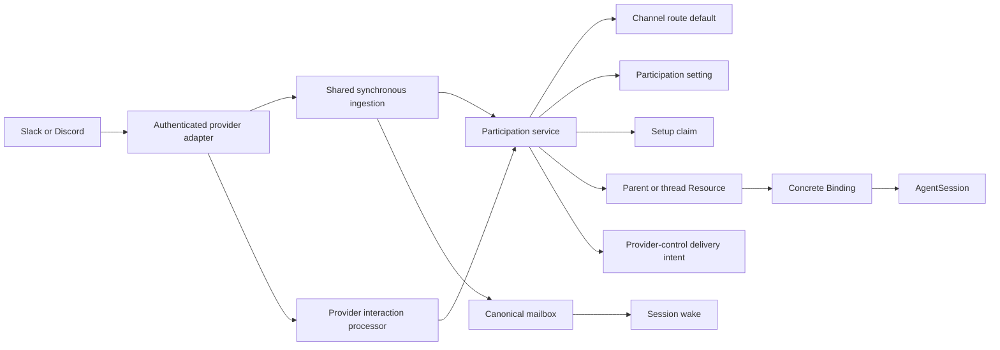
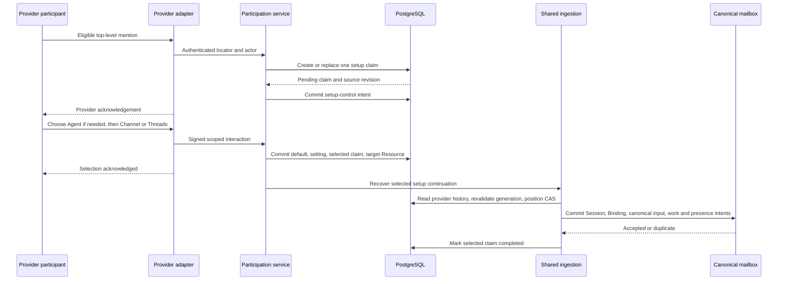

# conversation-260801/DESIGN: Provider Channel Participation Settings

- Snapshot: `conversation-260801`
- Document reference: `conversation-260801/DESIGN`
- Mode: Collaborative

## Inputs

- Requirements:
  [conversation-260801/REQ](../requirements/conversation-260801-provider-channel-participation.md)
- Architecture decisions:
  [conversation-260801/ADR](../adr/conversation-260801-provider-channel-participation.md)
- Preserved binding response-mode decisions:
  [channel-260801/ADR](../adr/channel-260801-binding-response-modes.md)
- Preserved synchronous ingestion decisions:
  [channel-260729/ADR](../adr/channel-260729-responsive-context-preserving-conversations.md)

## Summary

Add one explicit participation setting per provider connection and parent channel. A
Single App uses its sole Agent route. A Multi App uses one selected channel-default
route; an unconfigured Multi App channel may let an authorized provider participant
select that one route before choosing conversation location. The participation setting
remains separate from the route default and stores `channel` or `threads`, the parent
response-mode default, a mutation generation, provider-principal provenance, and
terminal invalidation state.

An eligible top-level mention in a channel with no participation setting creates one
dedicated setup claim instead of a Session, Binding, mailbox input, or AgentRun. While
the claim remains pending, each later eligible explicit mention replaces its
content-free continuation source. Setup controls can be re-surfaced by later mentions,
Slash Commands, and message-context actions. Any current participant who may invoke the
selected Agent can choose `Channel` or `Threads`. Selection snapshots the Agent's
current response-mode default, commits the setting and selected replay boundary, and
then releases the latest mention through the existing canonical mailbox and
conversation-position path exactly once.

`Channel` uses a first-class parent-channel Resource, one connected Binding, and one
root AgentSession. Top-level ordinary messages continue that Session only when the
Binding's concrete mode is `all_messages`; explicit invocations continue in either
mode. Provider thread messages always remain isolated thread Resources and Sessions.
`Threads` preserves the current root-message/thread behavior, with each new Binding
copying the participation setting's current response-mode default.

A Multi App parent channel never fans out across Agent routes. Replacing its selected
Agent disconnects only the old parent-channel Binding, invalidates the old setting and
pending setup, preserves Session history and every thread Binding, and leaves the new
Agent unconfigured until a later eligible mention completes setup.
Clearing the selected Agent applies the same old-Agent cleanup and leaves the channel
without an effective Agent or location until a later Agent selection.

Provider controls are projections, not execution authority. Slack and Discord adapters
authenticate, prove parent-versus-thread scope, and lower controls, while one
provider-neutral participation service owns route selection, actor authorization,
setting and setup-claim mutation, transition lifecycle, and replay release. Provider
control failure or ambiguity never rolls back a committed setting, canonical mailbox
input, Session wake, or AgentRun.

## Current Behavior and Gaps

The current system already provides these reusable authorities:

- one Multi App channel default per connection and provider channel;
- one persistent route per connection and Agent snapshot;
- parent-channel and thread conversation positions with PostgreSQL compare-and-set;
- isolated thread Resources and one connected Binding per Resource;
- concrete Binding response modes and Agent creation-time defaults;
- content-free selector and access replay boundaries;
- provider-principal block, open-access, and grant authorization;
- canonical mailbox input, pending wake recovery, and idempotent Session execution;
- terminal Binding disconnect with retained Session history; and
- one-attempt provider delivery evidence independent from accepted execution.

The gaps relative to `conversation-260801/REQ` are:

- no participation setting or selected-location lifecycle;
- no dedicated pre-Session setup claim;
- first authorized top-level invocation immediately creates a thread Resource,
  Binding, Session, mailbox input, and AgentRun path;
- `ExternalChannelResourceType` represents only `thread`;
- top-level replies are lowered to Slack reply threads or Discord provisioned threads;
- the Multi App channel default can be configured only through the current Azents-user
  management authority;
- Slack Slash Commands are outside current ingress scope;
- Slack and Discord have no participation-settings command, context action, or
  binding-scoped settings button;
- provider participants cannot mutate response modes through their invocation
  authorization boundary;
- route replacement and terminal lifecycle do not know participation settings or setup
  claims; and
- deterministic provider fakes have no setup/settings/stale-control evidence model.

The implementation replaces the narrow immediate first-invocation and thread-only
resource assumptions. It does not add flags or compatibility fallbacks around those
incorrect responsibilities.

## Traceability

| Requirement | ADR decisions | Design mechanism |
| --- | --- | --- |
| `conversation-260801/REQ-1` | `ADR-D4`, `ADR-D7`, `ADR-D10` | Empty setting table on rollout; route association alone creates no setting, Resource, Binding, or Session |
| `conversation-260801/REQ-2` | `ADR-D3`, `ADR-D4`, `ADR-D5`, `ADR-D9`, `ADR-D10` | Dedicated setup claim, latest-source replacement, setup-required outcome, provider controls, no canonical input before selection |
| `conversation-260801/REQ-3` | `ADR-D3`, `ADR-D4`, `ADR-D5`, `ADR-D9` | Provider-principal authorization service revalidates route, human actor, block, open access or grant, scope, and generation |
| `conversation-260801/REQ-4` | `ADR-D2`, `ADR-D4`, `ADR-D5`, `ADR-D9` | Selected setup claim becomes a durable replay-recovery boundary and releases the latest trigger through canonical ingestion |
| `conversation-260801/REQ-5` | `ADR-D10` | One active setting per connection and parent channel, matching the Single sole route or Multi channel default |
| `conversation-260801/REQ-6` | `ADR-D2`, `ADR-D6`, `ADR-D10` | First-class parent Resource, one connected Binding/Session, parent delivery target, concrete mode predicate |
| `conversation-260801/REQ-7` | `ADR-D2`, `ADR-D6`, `ADR-D7` | Existing thread Resource path retained; new thread Bindings copy the setting mode; no backfill or rewrite |
| `conversation-260801/REQ-8` | `ADR-D6` | Location selection snapshots the Agent default into the setting and first Binding |
| `conversation-260801/REQ-9` | `ADR-D6`, `ADR-D9`, `ADR-D10` | Provider-native parent settings show the selected Agent, location, and mode and call one canonical mutation service |
| `conversation-260801/REQ-10` | `ADR-D2`, `ADR-D6`, `ADR-D10` | Channel setting and connected parent Binding update atomically; ingestion evaluates the Binding mode |
| `conversation-260801/REQ-11` | `ADR-D6`, `ADR-D7` | Threads mode updates only the setting default; existing thread Bindings remain concrete and independently mutable |
| `conversation-260801/REQ-12` | `ADR-D4`, `ADR-D9` | Slash Command, joined-presence button, and message-context adapters prove scope and converge on the same service |
| `conversation-260801/REQ-13` | `ADR-D2`, `ADR-D6`, `ADR-D8`, `ADR-D10` | Terminal parent-Binding disconnect, lazy new Channel creation, no revival, selected-Agent replacement lifecycle |
| `conversation-260801/REQ-14` | `ADR-D5`, `ADR-D6`, `ADR-D9` | Current-setting views, generation-fenced controls, completion summaries, one-time `all_messages` guidance |
| `conversation-260801/REQ-15` | `ADR-D2`, `ADR-D7`, `ADR-D8`, `ADR-D10` | No existing Binding/resource rewrite; retained history; no setting backfill; thread Bindings survive selected-Agent replacement |

## Architecture and Ownership



### Provider adapters

Slack and Discord adapters own only:

- callback authentication and freshness;
- provider App, tenant, channel, thread, actor, and message projection;
- classification of explicit invocation versus ordinary message;
- provider-native interaction acknowledgement;
- proof of parent-channel or thread scope; and
- provider-specific control rendering and delivery.

They do not own route, participation, response-mode, block, grant, Session, mailbox,
or replay decisions.

### Participation service

Add a provider-neutral service under
`python/apps/azents/src/azents/services/external_channel/participation.py`. It owns:

- resolving or establishing the selected channel Agent;
- creating, replacing, selecting, expiring, and invalidating setup claims;
- reading and mutating the participation setting;
- provider-participant authorization for setup and settings;
- Channel-versus-Threads transitions;
- parent-setting versus thread-Binding response-mode mutation;
- selected-Agent replacement effects;
- setup replay recovery; and
- setup/settings confirmation intent creation.

Web management and provider-native controls call shared repository mutation units but
retain different admission authorities. Provider participants never enter the
AgentAdmin service as synthetic Azents users.

### Synchronous ingestion

`ExternalChannelMailboxIngestionStore` remains the accepted-input transaction owner.
It is refactored into explicit existing-binding, setup, Channel, and Threads branches.
The participation service does not enqueue Session input directly; it releases selected
setup replay through the shared ingestion service.

## Domain and Persistence Model

### Enums

Add:

- `ExternalChannelConversationLocation`: `channel`, `threads`;
- `ExternalChannelParticipationSettingStatus`: `active`, `invalidated`;
- `ExternalChannelSetupClaimStatus`: `pending_agent`, `pending_location`, `selected`,
  `completed`, `expired`, `invalidated`; and
- `parent_channel` to `ExternalChannelResourceType`.

`ExternalChannelConversationScopeKind` remains provider-history scope and is not reused
as user-visible location.

PostgreSQL enum types are created or extended only by the generated Alembic migration.
Model declarations use the project PostgreSQL enum convention with
`create_type=False`.

### Participation setting

Add `external_channel_participation_settings` with:

| Field | Contract |
| --- | --- |
| `id` | UUID7 hex primary key |
| `connection_id` | Restrictive connection FK |
| `provider_parent_channel_id` | Provider parent-channel identity |
| `route_id` | Restrictive selected route FK; must belong to `connection_id` |
| `location` | Required `channel` or `threads` |
| `response_mode` | Required `mention_only` or `all_messages` default for new Bindings |
| `settings_generation` | Required monotonic positive integer |
| `configured_by_user_id` | Nullable latest Azents User actor for Web/Admin mutation |
| `configured_by_principal_id` | Nullable latest provider principal actor for provider-native mutation |
| `status` | `active` or terminal `invalidated` |
| `invalidated_at` / `invalidation_reason` | Terminal lifecycle evidence |
| timestamps | Created and updated timestamps |

A partial unique index permits at most one active setting for
`(connection_id, provider_parent_channel_id)`. The active row's route must match the
Single App sole route or current active Multi App channel default. Invalidated rows
remain historical and are never reactivated.

An exactly-one-actor check requires either `configured_by_user_id` or
`configured_by_principal_id`. Provider-native mutation writes the principal and clears
the User field. Web AgentAdmin mutation writes the User and clears the principal
field. No path retains a stale actor or creates a synthetic provider principal/User.

### Multi App channel-default actor provenance

Provider-native initial Agent selection must use the existing channel-default route
authority without mapping the participant to an Azents User. Evolve
`external_channel_channel_defaults` so configuration provenance is exactly one of:

- `configured_by_user_id` for existing Web/Workspace management; or
- `configured_by_principal_id` for authenticated provider selection.

The migration makes the existing user field nullable, adds the provider-principal FK,
and adds a check constraint requiring exactly one actor. Existing rows retain their
user provenance. Provider selection may create a default only from a route the current
principal may invoke. Later Web replacement remains generation-fenced and calls the
same selected-Agent transition unit.

### Setup claim

Add `external_channel_setup_claims` with:

| Field | Contract |
| --- | --- |
| `id` | UUID7 hex primary key |
| `connection_id` / `provider_parent_channel_id` | Shared setup identity |
| `route_id` | Nullable only while a Multi App is awaiting Agent selection |
| `conversation_position_id` | Parent-channel position used by the latest trigger |
| `source_resource_id` | Route-neutral thread/root Resource for the latest provider source |
| `principal_id` | Latest eligible mention author |
| `source_projection` | Versioned, typed, content-free provider locator and replay boundary |
| `source_revision` | Monotonic revision incremented by each latest-mention replacement |
| `claim_generation` | Monotonic lifecycle generation for controls and selection |
| `status` | Setup lifecycle state |
| `selected_setting_id` / `selected_resource_id` | Set by location selection |
| `selected_source_revision` | Frozen revision released by replay |
| `expires_at`, `selected_at`, `completed_at` | Bounded lifecycle timestamps |
| timestamps | Created and updated timestamps |

The source projection contains only the existing bounded locator coordinates required
to reconstruct provider history and delivery scope: provider event type, source and
resource keys, trigger message key and ID, parent/thread keys, delivery-thread key,
exclusive range start, inclusive trigger position, and schema version. It contains no
message body, raw callback, credential, interaction token, trigger token, private URL,
or transient provider URL.

A partial unique index permits one nonterminal claim for
`(connection_id, provider_parent_channel_id)`. A new explicit eligible mention locks
that claim, creates or resolves the route-neutral thread/root source Resource, replaces
the source Resource, projection, and principal, increments `source_revision`, and
creates no Binding, Session, mailbox input, or AgentRun.

### Interaction linkage

Add an optional `setup_claim_id` restrictive FK to
`external_channel_interactions`. Selector, Slash Command, component, message-context,
modal, and stale-control interactions remain independently idempotent provider callback
claims. They reference the current setup claim or setting generation but never own the
continuation source.

Add the same optional setup-claim linkage to External Channel access requests. A
setup-linked request uses its source Resource for current provider-history and
authorization identity, while the setup claim remains continuation authority.
Existing selector/access rows without a setup claim retain their current resource-
bound replay behavior.

### Parent-channel Resource

Add `parent_channel` as a first-class Resource type. Its provider resource key is the
stable provider parent-channel identity, not a message or thread key. Existing
`(connection_id, resource_type, provider_resource_key)` uniqueness and connected
Binding uniqueness then provide exactly one parent Resource and one connected parent
Binding per selected channel Agent contract.

Parent labels explicitly include provider, tenant or Guild, parent channel, and
`conversation_scope=parent_channel`. Thread labels remain explicit thread or root
message targets. Delivery code never infers parent scope from a missing thread field.

### Delivery origin and control revisions

Add a setup-claim delivery origin or equivalent typed origin identity so each
`source_revision` may commit one re-surfaced setup control without colliding with an
older control. `CONTROL_MESSAGE` remains the provider operation. Existing immutable
delivery outcomes remain `pending`, `attempting`, `delivered`, `failed`, `unknown`, or
`not_attempted`.

Session presence control payloads gain an explicit schema version and a signed or
opaque conversation-settings action locator. New Bindings create the new presence
shape with both `View session` and `Conversation settings` controls.

## Route and Participation Resolution

### Single App

The sole routable route is the selected channel Agent. A top-level eligible mention:

1. reuses an exact existing thread Binding when one exists;
2. otherwise reads the active participation setting;
3. creates or replaces the setup claim when the setting is absent;
4. resolves the parent Resource and Binding when location is Channel; or
5. resolves the addressed thread Resource when location is Threads.

### Multi App with an active channel default

The active channel default is the selected parent-channel Agent. The same setting and
location resolution applies. Explicit thread selector continuations may still choose a
different route for one isolated thread, and an established thread Binding always wins
for that exact thread.

### Multi App without a channel default

The first eligible top-level mention creates or replaces one channel-scoped setup claim
in `pending_agent`. The provider-native selector lists only active routes the current
principal may invoke. Selecting a route:

1. locks and revalidates the connection, route, principal, block, open-access or grant,
   claim, and absence of a newer channel default;
2. creates the provider-principal-authored channel default;
3. moves the same claim to `pending_location` with the selected route; and
4. renders the location choice without creating a Binding, Session, mailbox item, or
   AgentRun.

A concurrent Web or provider default winner is returned as the current selected Agent.
The losing interaction reloads that Agent and continues or displays the current setup
state rather than replacing it silently.

The setup-linked Agent selector still materializes the current route-neutral source
Resource because the existing selector security boundary validates one provider
source. It also carries `setup_claim_id` and `source_revision`. On route selection, it
does not call the legacy resource-bound Binding replay. It reloads the claim's latest
source Resource and atomically transitions that same claim to `pending_location`.
Legacy selector interactions without a setup claim retain their current isolated-
thread replay behavior.

## Setup and Original-Mention Continuation



### Setup creation and latest-source replacement

The setup path runs only for an explicit human top-level invocation with no active
participation setting. It creates or resolves the current root-message/thread Resource
as a route-neutral source locator but creates no connected Binding or Session-owned
state. It applies route-specific block, open-access, and grant checks before allowing a
known selected route to enter location setup. When a Multi App has no selected route,
its selector exposes only routes the actor can currently invoke.

Ordinary messages never create or replace setup claims. Each later eligible explicit
mention while setup remains nonterminal replaces the latest source and actor under the
channel participation lock. It creates or resolves that mention's source Resource,
updates the claim to that Resource, increments `source_revision`, and commits a new
control projection. Older messages are not independently executed, although the
provider history read for the latest trigger may include them as bounded context.

### Restricted-access setup

When a selected Single or Multi route requires approval, the first invocation creates
or reuses the route-neutral source Resource, setup claim, and a setup-linked access
request. It does not expose the location choices yet.

Allow on a setup-linked access request atomically creates the grant and final access
decision but does not create a Binding, Session, mailbox input, or AgentRun. After
commit it reloads the setup claim, revalidates the now-authorized original principal,
moves the claim to `pending_location`, and commits the setup control. Deny expires the
request and setup claim. Block invalidates the setup claim under the new Agent block.

Only legacy or already configured isolated-thread access requests without a setup-
claim link retain the current Allow behavior that may create or reuse a Binding and
call `replay_access_allow`. `ExternalChannelAccessService.allow()` and
`ingestion_replay.py` use an explicit discriminator; setup-linked Allow can never
enter that legacy Binding-creation branch.

### Location selection transaction

The selection transaction locks in this order:

1. connection and current ingress/configuration authority;
2. Multi channel default and selected route when applicable;
3. active participation setting;
4. setup claim;
5. parent conversation position;
6. target Resource; and
7. any connected target Binding.

It revalidates the callback actor independently from the latest mention author. The
actor must currently be a human who may invoke the selected Agent. Blocks take
precedence; valid open access or grant authorizes.

The transaction:

- verifies no active setting already won;
- snapshots the Agent's current default response mode;
- creates the active setting with generation 1;
- creates or resolves the parent Resource for Channel or uses the claim's frozen latest
  source Resource for Threads;
- freezes the current `source_revision` and target Resource on the claim;
- moves the claim to `selected`;
- commits setup confirmation and control-cleanup intents; and
- performs no provider call.

### Replay recovery

Add `SETUP_CONTINUATION` to the closed ingestion operation union and a dedicated setup
replay boundary containing claim ID, selected source revision, setting ID and
generation, target Resource, principal, position, range start, and trigger position.

The interaction request attempts replay after selection commits. A bounded Worker
recovery loop also lists selected claims whose canonical mailbox acceptance is not yet
confirmed. Later ingress for that channel first attempts the selected claim recovery
before admitting newer top-level traffic. This prevents a later message from overtaking
the selected original trigger.

Replay uses the existing provider-history read outside transactions and final
conversation-position compare-and-set. If the position has already advanced, the
saved range start and exact trigger branch used by access replay recovers the selected
message without advancing backwards. Canonical mailbox identity prevents duplicate
input and Agent execution. Once acceptance is accepted or duplicate and any pending
wake is recoverable, the claim becomes `completed`.

Provider control delivery is not replay authority. A missing, failed, unknown, or stale
setup confirmation cannot block or roll back this recovery.

## Configured Ingestion

### Existing Binding precedence

An exact existing connected thread Binding continues to win before participation
setting lookup. This preserves all pre-feature thread conversations without backfill or
setup.

For top-level traffic, the selected route and setting determine the location:

- Channel resolves the parent Resource and connected parent Binding;
- Threads resolves the addressed root/thread Resource; and
- no setting returns to setup only for explicit eligible invocation.

A provider thread callback never resolves the parent Binding, regardless of the parent
setting.

### Response predicate

The existing provider-neutral predicate remains:

```text
explicit invocation
OR
(connected binding exists AND binding.response_mode == all_messages)
```

It is applied to the concrete resolved Binding. For Channel, an eligible ordinary
message may continue only the one selected Agent's connected parent Binding. A Multi
App event never enumerates or fans out to other routes. For Threads, an ordinary
message may continue only an already connected thread Binding.

### Preparation and final acceptance

Preparation resolves the exact existing Binding, selected route, active setting,
location, Resource, and concrete mode before principal creation, selector state,
provider-history I/O, or canonical side effects. Ignored ordinary messages do not
advance a position.

Final acceptance locks and revalidates the same setting generation, location, selected
route, Resource, Binding, response mode, access policy, and conversation position. A
location, selected-Agent, or mode change during provider-history I/O discards the
fetched range and restarts or returns the now-current ignored outcome. No lock is held
across provider I/O.

Binding creation accepts an explicit concrete response mode:

- Channel and configured Threads copy the participation setting value;
- existing legacy thread access-Allow creation without a setup claim continues to copy
  the Agent default;
- setup-linked access Allow never creates a Binding and returns to location setup; and
- reusing a connected Binding retains its concrete value.

## Provider-Native Settings

### Canonical settings service

Every entry point resolves one of two targets:

- parent channel: selected Agent, participation location, and parent response-mode
  default; or
- connected thread Binding: concrete response mode only.

The service revalidates provider actor, connection, selected route, Agent lifecycle,
conversation scope, setting or Binding generation, block, open access or grant, and
resource connectedness. A callback actor never becomes an execution User or replaces a
message author.

### Parent mutations

- Channel to Threads atomically bumps the setting generation, updates location,
  terminally disconnects only the parent Binding through the existing lifecycle unit,
  ends its Channel Work, and commits leave-presence and Tracker cleanup intents.
- Threads to Channel updates only the setting and generation. The next explicit
  eligible top-level mention creates the parent Binding and Session.
- Channel response-mode change atomically updates the setting and connected parent
  Binding.
- Threads response-mode change updates only the setting default.

Accepted mailbox input and AgentRun state are never cancelled or reclassified by a
later mutation.

### Thread mutation

A trustworthy thread-scoped command, presence button, or message-context action updates
only one connected thread Binding. When a Slash Command cannot prove thread scope, the
thread mutation is omitted or returns an unsupported result. It never falls back to
parent-channel mutation.

### Slack

Extend the fixed signed Slack endpoint and Socket Mode envelope path to admit bounded
Slash Command form payloads. Add `/azents settings` to copy-ready manifest guidance,
and add `commands` to the required bot OAuth scopes.

The generated Slack App Manifest explicitly contains:

- `features.slash_commands` with `/azents`;
- `features.shortcuts` with the existing invocation shortcut and the new
  `Conversation settings` message shortcut;
- `settings.interactivity.is_enabled=true`;
- the HTTP callback URL as the Slash Command and interactivity Request URL for HTTP
  Apps; and
- omitted Request URLs for Socket Mode where Slack routes the configured interactive
  envelopes through Socket Mode.

Manifest guidance and validation tests assert command, shortcut name, callback ID,
type, descriptions, interactivity, transport-specific URLs, and the `commands` scope.
Existing Slack installations cannot be mutated by Azents without customer App
configuration authority. Agent Settings therefore displays a bounded configuration-
update notice and the refreshed copy-ready manifest/instructions until the owner
confirms the App configuration update. Binding buttons remain the immediate settings
path for an otherwise interactive existing installation; Slash and message-context
entry points become available after its App configuration is updated.

Add a `Conversation settings` message shortcut beside the existing invocation
shortcut. Dispatch `message_action`, `block_actions`, options, and modal submissions by
explicit callback/action identifiers rather than selector-only assumptions. Signed
private metadata binds connection, parent or thread scope, route/default generation,
setting or Binding generation, setup claim, initiating actor, interaction, and page.
Trigger IDs remain immediate in-memory modal capabilities and are never persisted.

Slack session presence contains:

- the joined or left sentence;
- `View session` URL action; and
- `Conversation settings` action while the Binding is connected.

Parent-channel delivery uses `chat.postMessage` without `thread_ts`. Thread delivery
retains the existing root thread target. Setup controls near later mentions may be
created again for each claim source revision; ambiguous create outcomes are not blindly
replayed.

### Discord

Generalize Guild command reconciliation during activation to maintain:

- the existing `Ask an Azents Agent` Message Command;
- an `Azents settings` application command; and
- a `Conversation settings` Message Command.

Exact provider-visible names remain reversible copy details. Activation validates the
complete required command set under the existing configuration and Application-claim
fences. Failure retains the current `reconnect_required` behavior and sanitized health
codes.

Replace the singular `register_guild_message_command()` result with a typed required
command-set reconciler:

1. list the current Guild commands;
2. match Azents-owned commands by reserved command role, exact name, and type;
3. create or update each required command;
4. delete only recognized obsolete Azents-owned command variants;
5. preserve unrelated customer-defined commands; and
6. return a complete role-to-command-ID map.

Do not use bulk overwrite against a customer-owned App because that endpoint replaces
every command type in the Guild. Persist the validated command-set schema version and
IDs in connection capabilities instead of the current singular
`message_command_id`. Interaction admission validates command role, ID, name, and type
against that current capability snapshot.

The Discord fake lists retained commands, records bounded requested name/type/role,
returns distinct deterministic IDs, and supports update and delete evidence. Activation
E2E proves the three required commands exist, an obsolete recognized Azents command is
removed, an unrelated command remains, and the stored capability map matches the
provider result.

Signed Ed25519 interaction admission dispatches command, message-context, component,
options, and modal settings actions. Compact custom IDs or durable opaque interaction
IDs bind setup claim or Binding identity and generation. Guild, channel, thread parent,
actor, connection, route, and current scope are revalidated from durable state.
Interaction tokens, callback URLs, signatures, and raw bodies remain transient.

Parent-channel delivery posts directly to the parent channel and never calls Discord
thread provisioning. Thread Resources retain the current provision-or-reuse delivery
thread behavior.

### Stale controls

Every control reloads canonical state:

- pending setup opens its current latest choices;
- selected setup attempts or reports continuation recovery;
- completed setup shows the current setting;
- changed setting generation reloads current values;
- invalidated or expired setup returns a clear stale result;
- disconnected thread Binding returns a clear unavailable result; and
- unproven scope returns unsupported without mutation.

Old controls never retain a stale continuation source or create another setting,
Session input, or AgentRun.

## Authorization and Security

Provider participation authorization is a new service boundary but reuses existing
policy rows.

For each setup or settings operation:

1. require an authenticated human External Channel principal;
2. lock and verify active or otherwise permitted connection state for the operation;
3. resolve the Single sole route or Multi selected/candidate route;
4. require active Agent lifecycle and routable relationship;
5. reject an active Agent-principal block;
6. accept route open access, an Agent grant, or a relevant existing Session grant;
7. prove parent-channel or exact connected-thread scope;
8. validate setup, setting, route-default, or Binding generation; and
9. mutate only the resolved scope.

A Session-scoped grant qualifies only when the requested thread or parent operation can
prove the same connected Session. It does not authorize establishing an unrelated new
channel setting. Initial channel setup therefore requires open access or an Agent grant
for the selected Agent.

Provider principal IDs, tenant IDs, channel IDs, message IDs, and durable row IDs are
excluded from routine logs and metrics. Errors and provider-visible results are English
and bounded. Raw payloads, bodies, callback tokens, trigger IDs, credentials, private
URLs, and message content never enter setting, claim, delivery evidence, or logs.

## Selected-Agent Replacement and Lifecycle

Extend the existing Multi channel-default replacement transaction so route A to B:

1. locks the connection, existing default, old route, new route, active setting, pending
   setup claim, parent Resource, and connected parent Binding in canonical order;
2. terminally disconnects only the old parent Binding;
3. invalidates the old participation setting;
4. invalidates or expires the pending setup claim and linked interactions;
5. replaces the channel default with route B and its current actor provenance;
6. preserves every thread Resource, Binding, Session, and concrete mode; and
7. commits provider cleanup intents for the disconnected parent Binding.

The new route has no participation setting. A later eligible top-level mention begins
setup. Existing thread Bindings continue resolving before the parent default.

Extend the existing channel-default clear transaction as route A to no route. It uses
the same lock order, parent-Binding terminalization, setting invalidation, setup-claim
expiration, interaction expiration, and provider cleanup intents, but creates no new
default. The channel remains unconfigured until a later provider-native or Web Agent
selection establishes one route and location setup completes.

Route removal, Agent deletion/decommission, terminal connection disconnect, Session
archive, and restore extend their current lifecycle units:

- route, Agent, and terminal connection loss invalidate settings and claims;
- Session archive disconnects Bindings but does not invalidate a still-valid channel
  setting; a future eligible mention may create a new Binding according to that
  setting;
- restore never reactivates a disconnected Binding; and
- transient `degraded` or `reconnect_required` health preserves settings and claims,
  subject to current operation-specific ingress restrictions.

Connection and route re-enable never revive invalidated settings, claims, Bindings, or
Sessions.

## Management API, OpenAPI, and Web

Provider-native setup and location management do not require a new Azents Web primary
workflow. Existing administrator surfaces remain available and consistent.

### Binding projection

Extend `ManagedBinding` and generated clients for the new `parent_channel` resource
type and an explicit derived conversation location. Session Channels displays parent
channel versus thread, the concrete response mode, connectedness, Session navigation,
work, and delivery evidence.

The existing AgentAdmin binding-mode mutation calls the same repository mutation unit:

- a connected parent Binding updates the active participation setting and Binding in
  one transaction; and
- a thread Binding updates only itself.

Disconnecting a parent Binding does not clear or change the participation setting; it
is an explicit conversation disconnect, and the next eligible mention may create a new
Binding according to the setting. Changing location uses the provider-native parent
settings flow or a future explicit Web location control, not the generic disconnect
operation.

### Multi channel-default management

Extend channel-default replacement projections and impact previews with participation
setting invalidation and connected parent-Binding disconnect counts. Existing Web
Workspace Owner/Manager authority remains. Provider-native initial route selection uses
the same mutation unit with External Channel principal authorization and actor
provenance.

The existing channel-default clear operation calls the same old-route terminalization
unit and returns the same added impact counts. It cannot leave an active participation
setting, pending setup claim, or connected parent Binding after the selected route is
removed.

Workspace integrations may display the selected Agent plus optional read-only current
location and response-mode summary. Agent Settings retains its Agent-level default and
associated Multi App read-only context. No Web Session picker is added.

### Generated artifacts

Dump the public OpenAPI document and regenerate Python and TypeScript public clients
through `openapi-client-gen`. Never edit generated clients manually. Update azents-web
tRPC schemas, fixtures, and query invalidation for changed projections and impact
responses.

## Existing-Binding Presence Rollout

New Bindings create versioned joined-presence controls with Session navigation and
settings actions. Existing connected Bindings may have a delivered, failed, unknown, or
missing legacy presence attempt whose idempotency key would otherwise reuse the old
payload.

Do not perform provider calls from the database migration. Add a bounded Worker
reconciler that finds connected Bindings without a version-2 settings control and
creates one distinct idempotent `binding_settings_available` control origin. It posts a
concise settings-available control rather than repeating the joined sentence. That
control is required to contain both the canonical `View session` URL action and the
binding-scoped `Conversation settings` action. The reconciler and the next accepted
invocation/settings interaction may both ensure the same durable intent; uniqueness
converges them.

A delivered result satisfies rollout. Failed or unknown delivery remains evidence and
is not blindly retried. Slash Commands and message-context actions remain independent
access paths. Disconnected Bindings are excluded, and no historical provider message is
rewritten.

## Concurrency and Locking

Use the existing ephemeral conversation lock first. Add a participation lock keyed by
`(connection_id, provider_parent_channel_id)` for setup, parent settings, selected-Agent
replacement, and top-level configured admission. All paths acquire:

```text
conversation lock → participation lock → database transaction
```

Canonical database lock order is:

```text
connection
→ channel default and route
→ participation setting
→ setup claim
→ conversation position
→ Resource
→ connected Binding
→ Session/mailbox/work rows
```

Thread-only Binding mutation does not acquire unrelated parent rows but preserves
connection → route → Resource → Binding order.

Generation and source-revision checks provide stale-control and in-flight history
fencing. Locks are never held across provider I/O. When a settings transition commits
before final ingestion acceptance, stale fetched history is discarded and retried or
ignored under current state. When acceptance commits first, the later transition does
not cancel committed mailbox, wake, Work, or AgentRun state.

## Failure Handling and Observability

### Failure classification

- Duplicate setup mention, control, selection, replay, or setting mutation converges on
  current state.
- Provider-history, position, database, coordination, or pending wake failures remain
  retryable through existing ingestion classification.
- Invalid actor, route, block, scope, generation, or lifecycle is a terminal provider-
  native rejection.
- Setup-control delivery failure or ambiguity never changes claim or setting state.
- A selected claim remains recoverable until canonical mailbox acceptance is confirmed
  or lifecycle invalidates it.
- An unsupported thread scope never falls back to parent mutation.

### Structured evidence

Add content-free metrics or structured logs for:

- setup claim created, source replaced, Agent selected, location selected, completed,
  expired, or invalidated;
- setting created, changed, conflicted, or invalidated;
- selected-Agent replacement;
- parent versus thread Resource resolution;
- stale or unsupported provider controls; and
- setup replay accepted, duplicate, or pending recovery.

Use categorical provider, operation, state, and reason fields only. Do not log provider
or Azents identifiers, source text, exception text containing provider payloads, URLs,
or secrets. Runtime code relies on logging integration for Sentry delivery.

## Migration, Rollout, and Rollback

### Migration

Generate one or more linear Alembic revisions from the current schema head. Do not edit
executed migrations. Update `python/apps/azents/db-schemas/rdb/revision` after each
revision.

The expand migration:

1. adds the conversation-location, setting-status, and setup-status enum types;
2. adds `parent_channel` to the Resource enum;
3. creates participation setting and setup claim tables, indexes, and restrictive FKs;
4. adds setup-claim FKs to interactions and access requests;
5. adds provider-principal provenance to Multi channel defaults and relaxes the user FK
   under an exactly-one-actor check; and
6. adds exactly-one User-or-principal actor provenance to participation settings; and
7. adds any versioned presence-control marker or origin enum required by reconciliation.

No participation setting, setup claim, Resource, Binding, Session, conversation
position, or provider-control row is backfilled by the migration.

### Rollout

PostgreSQL enum expansion and new parent Resources are not safe for an old binary that
cannot deserialize the new enum. Use an expand-then-enable rollout:

1. apply additive schema;
2. deploy code that can read every new enum and table while participation creation is
   disabled;
3. reconcile provider command registrations and generated Web clients;
4. after every server, worker, and gateway process runs the new binary, enable provider
   setup and parent-channel writes; and
5. run the bounded existing-Binding settings-control reconciler.

The temporary rollout gate is removed only after the complete deployment is verified.
It is not a permanent compatibility fallback.

Existing Slack Apps also require the refreshed manifest or equivalent manual App
configuration for the new `commands` scope, Slash Command, message shortcut, and
interactivity registration. Rollout evidence distinguishes backend readiness from
customer App-configuration readiness; it does not claim Slash/context capability for
an installation that has not been updated.

### Rollback

Before feature enablement, the new code and additive schema can roll back independently.
After any `parent_channel` Resource or setting is written, disable new setup and prefer
a forward fix. Do not roll back to a binary that cannot read the new enum. Database
downgrade is not the operational rollback path after writes; retained rows and enum
values remain until an explicit destructive cleanup is separately approved.

## Test Strategy

### E2E primary verification matrix

| Scenario | Public/provider surface | Required evidence |
| --- | --- | --- |
| First unconfigured Slack mention | Signed callback and Slack fake | Setup control appears; no Session, Binding, canonical input, wake, or AgentRun exists |
| First unconfigured Discord mention | Gateway callback and Discord fake | Same setup gate and redacted control evidence |
| Latest mention replacement | Two explicit mentions plus an old or new setup control | One claim, latest source executes exactly once, earlier source is not independently executed |
| Multi App Agent selection | Provider selector with no channel default | Only invokable routes appear; one channel default is created; location setup follows |
| Setup concurrency | Concurrent authorized selections | First valid setting wins; losing callback shows current setting; one Session at most |
| Restricted setup Allow | Approval API plus provider setup control | Grant commits without Binding/Session; location setup resumes; selection later releases one canonical input |
| Channel behavior | Slack and Discord parent channels | Later top-level traffic reuses one Session; replies target parent; thread messages stay outside |
| Threads behavior | Multiple root mentions | Each addressed thread has an independent Binding and Session |
| Channel response modes | Provider callbacks and Session history | `mention_only` ignores ordinary traffic; `all_messages` admits ordinary top-level traffic |
| Threads response modes | Parent setting plus old/new thread Bindings | New Binding copies current default; existing Binding retains its concrete mode |
| Provider settings entry points | Slash, presence button, message context | Every safely scoped entry point shows and mutates the same canonical state |
| Slack manifest contract | Agent Settings manifest and validation | `commands` scope, `/azents`, invocation/settings message shortcuts, interactivity, and transport-correct URLs are present |
| Discord command reconciliation | Activation API and Discord fake | Three required roles are retained with distinct IDs; obsolete Azents command removed; unrelated command preserved |
| Unsupported thread scope | Provider action without trustworthy thread proof | Clear unsupported result and no parent mutation |
| Channel to Threads | Provider settings | Parent Binding disconnects; Session/history and thread Bindings remain |
| Threads to Channel | Provider settings then later mention | No empty Session; later mention creates a new parent Binding/Session |
| Selected Agent A to B | Multi channel-default replacement | A parent Binding disconnects and setting invalidates; thread Bindings/history remain; B requires setup |
| Clear selected Agent | Multi channel-default clear | A parent Binding disconnects and setting invalidates; thread Bindings/history remain; channel has no Agent or location |
| Stale and duplicate controls | Old buttons and duplicate callbacks | Current claim/setting shown; no duplicate replay or mutation |
| Delivery failure and ambiguity | Fake provider failure barriers | Claim/setting/mailbox remain canonical; safe re-surface path remains available |
| Existing Binding settings control | Reconciliation/public provider evidence | One versioned control is ensured without rewriting history or duplicate continuation |
| Existing Binding control actions | Slack and Discord fake evidence | Reconciled control contains both `View session` and `Conversation settings` |
| Lifecycle invalidation | Route removal, Agent decommission, terminal disconnect | Setting/claim invalidated, Binding terminal, no revival, history retained |
| Redaction | Fake evidence and captured logs | No secret, token, raw body, message content, private URL, or provider identifier leakage |

### Backend tests

Add focused tests for:

- setting active uniqueness, route/default matching, generations, invalidation, and
  exactly-one actor provenance;
- setup claim phase, source revision replacement, selection freeze, expiry, and
  selected replay recovery;
- exactly-one User-or-principal participation-setting provenance across provider and
  Web AgentAdmin mutations;
- setup-linked AccessRequest Allow/Deny/Block behavior and explicit absence of the
  legacy immediate Binding branch;
- setup-linked Multi selector transition using the claim's latest source Resource
  without legacy Binding replay;
- existing thread Binding precedence with no setting;
- parent Resource identity and one connected Binding;
- setup gate side-effect absence;
- selection before/after latest-source replacement race;
- replay before/after conversation-position advancement;
- final generation and location revalidation;
- Channel and Threads response-mode copy and mutation behavior;
- selected-Agent replacement and terminal lifecycle lock ordering;
- parent Slack delivery without `thread_ts`;
- parent Discord delivery without thread provisioning;
- thread behavior unchanged;
- Slash Command, message-context, component, modal, and stale-control scope validation;
- Slack manifest structure, `commands` scope, HTTP/Socket URL behavior, and existing-
  installation update guidance;
- Discord required command-set list/create/update/delete reconciliation, capability
  persistence, and unrelated-command preservation;
- legacy presence-control reconciliation; and
- no provider delivery result gating canonical execution.

### Frontend and generated-contract tests

- OpenAPI snapshot and generated-client drift;
- Multi channel-default impact projection changes;
- `ManagedBinding` parent/thread rendering;
- Session Channels parent response-mode mutation consistency;
- optional Workspace read-only setting summary;
- localized labels for Channel, Threads, response modes, stale, unsupported, and setup
  guidance; and
- narrow-screen controls and confirmation states where Web projections change.

### Fixtures and CI

Extend only deterministic Slack and Discord fakes. Tests enter through signed provider
callbacks, public APIs, generated clients, or rendered UI. They never write product DB
rows directly. Fake evidence records operation, control kind, generation, scope kind,
status, counts, and bounded outcome categories only.

Required CI includes backend Ruff, Pyright, focused and full feasible Pytest, migration
tests, OpenAPI/client drift checks, TypeScript format/lint/typecheck/build, deterministic
provider E2E, and applicable Web Surface E2E. No required scenario depends on live
provider credentials or may silently skip for a missing fake prerequisite.

## Removal and Replacement

| Existing unit or behavior | Why it becomes obsolete | Replacement or remaining authority | Removal boundary | Absence verification |
| --- | --- | --- | --- | --- |
| Immediate top-level invocation creating thread Resource, Binding, Session, and mailbox input | Unconfigured channels must stop before execution and ask for location | Setup-claim gate followed by selected replay through canonical ingestion | `mailbox_ingestion_store` preparation and acceptance | Tests prove no Session-owned state before selection; repository search finds no eager top-level binding path |
| `_resolve_resource` hard-coding every new Resource as `THREAD` | Channel location requires a first-class parent Resource | Explicit location-aware Resource resolver | Shared ingestion Resource resolution | Exhaustive enum matching and parent/thread tests; no default thread fallback |
| Top-level Slack replies always carrying a root `thread_ts` | Channel replies belong in the parent channel | Resource-type-aware Slack delivery target | `channel_action.py` and provider payload builders | Provider fake asserts absent `thread_ts` for parent and present root for thread |
| Discord root Resources always provisioning a delivery thread | Channel replies must remain in the parent channel | Parent direct delivery; thread provisioning only for thread Resources | Discord delivery and presentation | Fake asserts no ensure-thread call for parent Resources |
| Multi channel default requiring an Azents User actor | Provider-native initial Agent selection uses External Channel principal authority | Exactly-one User-or-principal provenance | Channel-default model, repository, management projections | Migration tests and authorization E2E cover both actor kinds without synthetic Users |
| Participation setting retaining only provider-principal provenance | Web AgentAdmin parent-mode mutation would have no legal latest actor | Exactly-one User-or-principal setting provenance | Setting model, provider service, Web management service | Tests prove each mutation clears the other actor field and records no synthetic identity |
| Access Allow always creating a Binding when no connected Binding exists | Restricted unconfigured channels must still choose location before Session creation | Setup-linked access branch commits authorization and resumes setup; legacy thread Allow remains | Access service, access-request schema, ingestion replay | Tests prove setup-linked Allow creates no Binding/Session and cannot enter `replay_access_allow` |
| Resource-bound selector always replaying toward a Binding | Multi pending-Agent setup uses the selector only to establish the channel Agent | Setup-linked selector keeps source Resource validation but transitions the claim to `pending_location` | Selector state, selector service, interaction linkage, ingestion replay | Tests prove setup selector creates no Binding and uses the claim's latest source revision |
| Slack manifest containing only bot/event configuration | Slash and message-context settings cannot be installed or granted | `commands` scope plus explicit Slash Command, both message shortcuts, and interactivity manifest entries | Manifest guidance, validation, Agent Settings update notice, and fakes | Manifest tests assert the complete contract for HTTP and Socket Apps |
| Selector-only Slack interaction dispatch | Slash and settings controls need distinct typed paths | Explicit command/action/context/modal discriminators | `slack_http.py`, `interaction.py`, HTTP and Socket admission | Parser tests and repository search prove settings do not enter selector-only fallthrough |
| Discord activation reconciling one Message Command and storing one ID | Required settings/context commands, stale cleanup, and current capability proof would be absent | Preserve unrelated commands while reconciling the complete Azents-owned command set and persisting a role-to-ID map | `discord_api.py`, `discord_activation.py`, repository capabilities, and fakes | Activation tests assert required roles, distinct IDs, obsolete Azents cleanup, unrelated preservation, and stored map |
| Session presence with only `View session` | Connected Bindings require a settings action | Versioned presence plus settings action; one-time legacy settings-available control | Presence renderers, delivery, Worker reconciliation | New-binding and existing-binding tests prove one settings action without provider-history rewrite |
| Provider participants routed through AgentAdmin-only binding mutation | Provider participants are not Azents Users and use invocation authority | Shared mutation unit behind distinct Web-admin and provider-principal admission services | Management and participation services | Authorization tests prove no synthetic user mapping or admin bypass |
| Route/default replacement ignoring participation state | Selected-Agent change would leave stale parent routing | Atomic default replacement, setting/claim invalidation, and parent Binding disconnect | Multi management repository/service | E2E proves A-to-B leaves no active A parent setting or Binding and preserves threads |
| Channel-default clear invalidating only the route default | A stale setting and parent Binding could remain when no Agent is selected | Clear uses the same old-route terminalization without installing a replacement route | Multi management clear repository/service | E2E proves clear leaves no selected Agent, setting, setup claim, or parent Binding and preserves threads/history |
| Assumption that route default and participation setting may vary independently for several parent Agents | Multi App channels have one selected Agent | Route default selects one route; setting references that route; no fan-out | Setting identity, ingress, management projection | Unique indexes and E2E prove one selected route/setting and one parent Binding |
| Legacy presence delivery idempotency reusing old payload | Old controls cannot gain a new action by reinserting the same attempt | Distinct versioned settings-available origin and reconciliation | Delivery origin/identity and Worker | Tests cover delivered, failed, unknown, missing, and disconnected legacy states |

The existing Multi route catalog, isolated thread selector/binding behavior, Agent-level
response-mode default, concrete Binding mode, access requests and grants, conversation
positions, canonical mailbox, wake recovery, Channel Work, Session lifecycle, and
one-attempt provider delivery ledger remain authoritative.

## Feasibility Validation

| Requirement or decision | Result | Repository evidence and implementation path |
| --- | --- | --- |
| `REQ-1` no implicit location | feasible | Route association currently creates no Session/Binding; additive empty setting table preserves this and setup replaces eager invocation |
| `REQ-2` setup gate | feasible | Current synchronous preparation already separates pre-history and final acceptance; add a setup-required branch before Resource/Binding creation |
| `REQ-3` participant authorization | feasible | Principal, human-only trigger, block, open access, grants, route, and Agent lifecycle checks exist; expose them through a shared provider mutation service |
| `REQ-4` latest original continuation | feasible | Existing selector/access boundaries, saved range start, exact trigger replay, position CAS, mailbox identity, and wake recovery support a selected setup boundary; add selected-claim recovery |
| `REQ-5` one selected Agent | feasible | `RDBExternalChannelChannelDefault` already enforces one active default per connection/channel; setting adds one active row with matching route |
| `REQ-6` Channel Session | feasible | Add one parent Resource enum value; existing connected-resource uniqueness, Binding, root Session, Work, and lifecycle provide the relationship |
| `REQ-7` Threads isolation | feasible | Current Resource/Binding behavior is already thread-isolated and remains the configured Threads path |
| `REQ-8` Agent default snapshot | feasible | Both current binding creation paths load the routed Agent; setup selection can snapshot the same required scalar |
| `REQ-9` parent settings | feasible | Signed Slack/Discord interactions and provider controls exist; add typed settings processors and one canonical service |
| `REQ-10` Channel modes | feasible | Existing response predicate and Binding mutation are reusable; parent setting and Binding update in one transaction |
| `REQ-11` Threads modes | feasible | Existing concrete thread modes are non-inherited; future creation can copy the setting while old Bindings remain unchanged |
| `REQ-12` adaptive entry points | feasible | Slack fixed endpoint and Discord signed endpoint already admit interaction families; Slash/command registration and settings discriminators are additive provider work |
| `REQ-13` transitions | feasible | Existing terminal disconnect preserves Session history and never reactivates; extend it to parent-only transition and selected-Agent replacement |
| `REQ-14` visibility | feasible | Provider renderers, modal/components, durable delivery evidence, and stale interaction revalidation are established patterns |
| `REQ-15` compatibility | feasible | No setting or Binding backfill; exact existing thread Binding resolution remains first; generated enum clients and management projections can include parent Resources |
| `ADR-D4/D5` claim and latest source | feasible | A channel-scoped row lock and source revision provide one mutable pending owner; selection freezes one revision before replay |
| `ADR-D9` re-surfaceable controls | feasible | Delivery attempt part identity and signed interactions can project multiple controls from one claim without becoming replay authority |
| `ADR-D10` selected-Agent replacement | feasible | Existing Multi default replacement, route removal, Binding terminalization, and impact preview transaction are direct extension points |
| `ADR-D10` selected-Agent clear | feasible | Existing clear-default route is a direct extension point; it applies the same old-route setting/claim/parent-Binding terminalization without a replacement route |
| Deterministic verification | feasible | Slack and Discord fakes already provide signed callbacks, history, delivery barriers, interaction evidence, Gateway messages, and command registration handlers |
| Documentation lifecycle | feasible | Requirements and ADR reflect the amended contract; same-basename Design and affected Living Specs have established validation paths |

### Conditional implementation risks

- Selected setup replay needs a bounded recovery consumer and later-ingress priority so
  a newer message cannot overtake the selected trigger. This is new orchestration but
  reuses canonical mailbox idempotency and is not a product blocker.
- Existing selector and access replay require a source Resource. The setup path retains
  that route-neutral source authority but adds explicit setup-linked branches so neither
  Agent selection nor Allow can create a Binding before location selection.
- Provider-native initial Multi channel selection requires exactly-one actor provenance
  on the existing channel-default row. The schema change is straightforward but every
  management projection and test fixture must handle User or principal origin.
- Parent Discord delivery must bypass the current root-thread provisioning branch, and
  parent Slack delivery must omit `thread_ts`. Exhaustive Resource-type matching is
  required to prevent accidental fallback.
- Existing-Binding settings-button rollout can produce one additional provider control
  per connected Binding. The bounded reconciler and distinct control copy avoid
  rewriting or ambiguously retrying legacy messages.
- PostgreSQL enum writes make rollback to an old binary unsafe. The expand-then-enable
  rollout is mandatory and the temporary gate must be removed after verification.
- Slack Slash Command and Discord command registration change customer App
  configuration. Existing copy-ready manifests and activation reconciliation are the
  update authorities; setup documentation and fake registration evidence must be
  updated together.
- Existing Slack customer Apps require a user-applied manifest/manual configuration
  update before Slash and message-context controls are available. Versioned guidance
  and an explicit readiness notice prevent the backend from claiming an unavailable
  provider capability.

No confirmed requirement or accepted ADR decision is blocked. The conditional risks
have concrete implementation and verification paths.

## Implementation Scope

This is a large cross-provider feature and should use a stacked implementation rather
than one focused PR.

1. **Schema and domain foundation** — enums, participation setting, setup claim,
   channel-default actor provenance, interaction linkage, parent Resource contracts,
   repositories, migration, and tests. Behavior remains disabled.
2. **Setup and ingress** — setup state machine, latest-source replacement, selected
   replay recovery, location-aware Resource resolution, parent Session behavior,
   response-mode copy, transitions, and concurrency tests.
3. **Slack controls** — Slash Command, message context, presence/settings controls,
   signed scope, manifest guidance, delivery lowering, fake-provider coverage.
4. **Discord controls** — command reconciliation, message context, components/modals,
   signed scope, direct parent delivery, fake-provider coverage.
5. **Lifecycle, management, and rollout** — selected-Agent replacement, route/Agent/
   connection invalidation, OpenAPI/generated clients, Web projections, existing-
   Binding control reconciliation, rollout gate, observability, deterministic E2E, and
   Living Spec synchronization.

Create the complete stacked PR series before monitoring CI. Run spec review once before
final QA. Do not enable provider participation writes until every runtime process can
read the new schema and enum values.

## Required Living Spec Updates

Implementation updates and re-verifies:

- `docs/azents/spec/domain/external-channel.md`;
- `docs/azents/spec/domain/conversation.md`;
- `docs/azents/spec/flow/external-channel-provider-ingress.md`;
- `docs/azents/spec/flow/external-channel-authorization.md`;
- `docs/azents/spec/flow/external-channel-lifecycle.md`;
- `docs/azents/spec/flow/external-channel-delivery.md`; and
- applicable External Channel management specs.

The living specs become the implemented behavior authority. This Requirements, ADR,
and Design trio remains the historical development snapshot after implementation.
