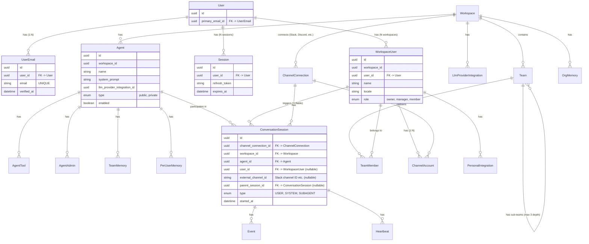
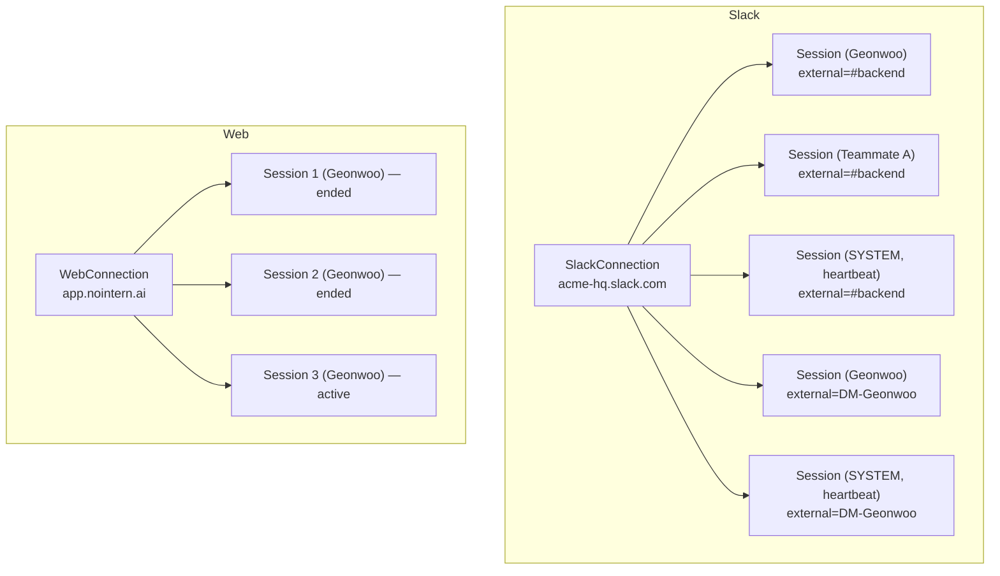
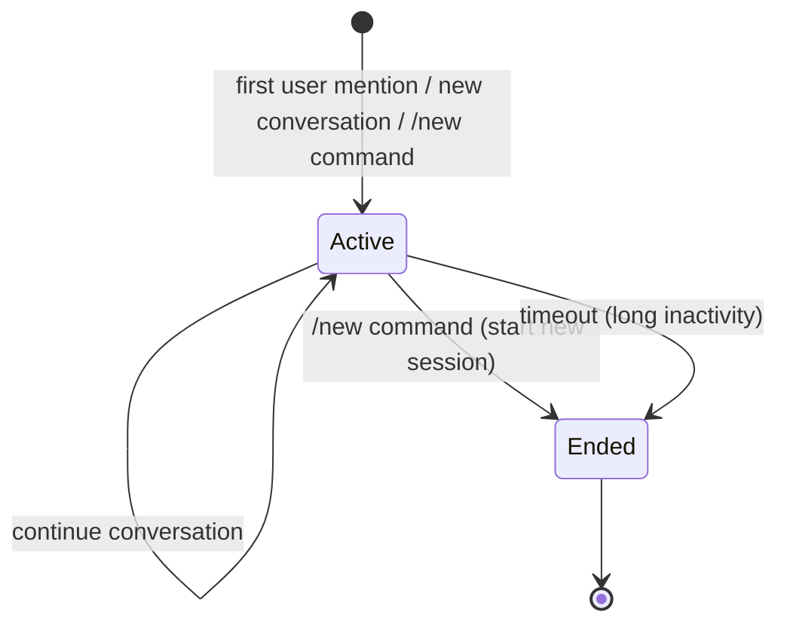
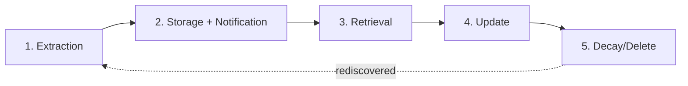
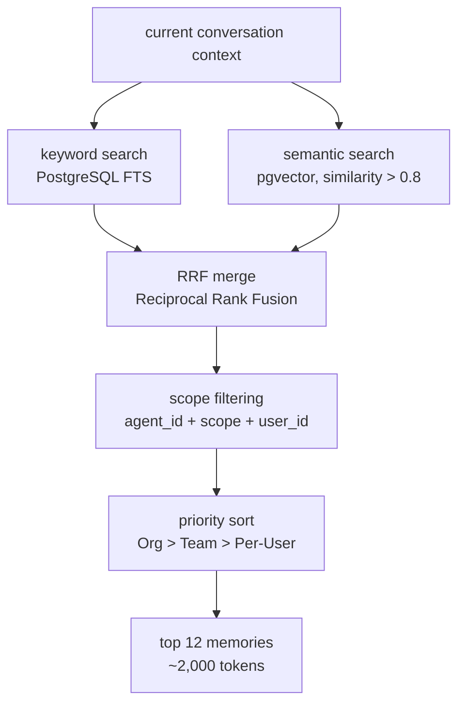
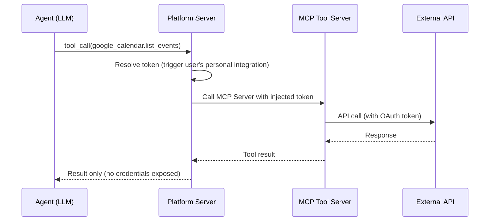
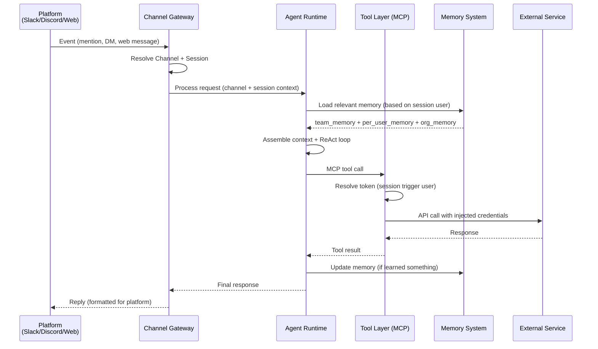
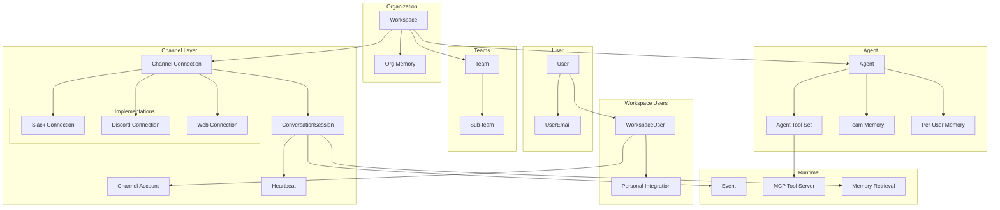

# nointern Core Concepts

This document defines nointern's core domain model and product architecture.

## Overview

nointern is an **Agent Builder SaaS** where users can **create AI agents only with a system prompt and tool set** and use them together as a team in messaging platforms such as Slack.

### What users do

- Define agent name and role (system prompt)
- Connect required tools (toggle in Web UI)
- Invite agent to channels
- Configure Heartbeat schedules

### What users do not do

- Draw flowcharts
- Choose design patterns (ReAct, Planning, etc.)
- Write code

Internally, the LLM autonomously runs a ReAct loop based on system prompt and tool list. Users do not need to understand this internal behavior.

### Core design principles

| Principle | Description |
|------|------|
| **Credential Isolation** | agent can never access credentials. Platform injects token server-side |
| **MCP-based tools** | each tool = MCP Server. Adding a tool = adding one MCP server |
| **Team-First** | team memory, per-user memory, and trigger-based permissions built in from the start |
| **Memory Transparency** | memory change notification + revert + history tracking |
| **Channel-Agnostic** | same agent usable in Slack, Discord, KakaoTalk, etc. |
| **BYOK** | customer provides their own LLM API Key |

### Market positioning

| Category | Examples | Difference |
|----------|------|------|
| Too Simple | Zapier, IFTTT | trigger-action automation only, not agents |
| Too Complex | LangGraph, CrewAI | requires code, developers only |
| Middle (but hard) | n8n, Make | requires flowcharts, high entry barrier |
| **Our Position** | **Agent Builder SaaS** | **system prompt + tools = agent** |

## Domain Model



> **Note**:
> - `User`: global user (email-based, single account across all workspaces)
> - `UserEmail`: user email (1:N, globally UNIQUE)
> - `WorkspaceUser`: membership profile scoped to a workspace (role: owner, manager, member)
> - `Agent`: AI agent defined by system prompt + tool set + memory
> - `ChannelConnection`: platform connection such as Slack Workspace or Discord Server
> - `ChannelAccount`: user account inside that platform (Slack User, Discord User, etc.)
> - `ConversationSession`: session where a specific user interacts with an agent. Owns conversation events, tool permissions, and personal memory scope. References external channel (Slack channel ID, etc.) through `external_channel_id`
> - `Session`: authentication session (refresh_token-based login persistence). Separate from ConversationSession

## Ownership Model

Every system element has a clear owner.

| Element | Owner | Description |
|------|--------|------|
| System Prompt | Agent | defines agent role and behavior |
| Tool Set | Agent | list of tools the agent can use |
| Team Memory | Agent | team knowledge accumulated by agent; shared across all sessions |
| Per-User Memory | Agent | personal preferences/info remembered by agent per user |
| Conversation events (history) | Session | event log within session; fully isolated across sessions |
| Tool permission / personal memory scope | Session | decides which tools and memory this session's user can access |
| Heartbeat Schedule | Session (SYSTEM) | independent per external channel; creates SYSTEM session per execution |
| Personal Integration | User | user's OAuth token (Google Calendar, GitHub, etc.) |
| Org Memory | Organization | company-wide policy; shared across all agents |

## 1. Workspace

Top-level container for **company/organization**.

### Properties

| Item | Description |
|------|------|
| Definition | one organization using nointern |
| Channel connections | 1:N (one Workspace can have multiple Slack/Discord connections) |
| Reverse constraint | one channel connection (Slack Workspace, Discord Server, etc.) can connect to only one nointern Workspace |

### Example

```
Acme Corp (nointern Workspace)
├── Slack
│   ├── acme-hq.slack.com (HQ)
│   ├── acme-japan.slack.com (Japan branch)
│   └── acme-eu.slack.com (EU branch)
├── Discord
│   └── Acme Community Server
├── KakaoTalk (future)
└── Web
    └── app.nointern.ai/acme
```

### Attributes

```python
class Workspace:
    id: UUID
    name: str
    handle: str  # URL-safe identifier (unique)
    created_at: datetime
    updated_at: datetime
```

> LLM settings are managed by [LLM Provider Integration](./llm-260221-llm-integration.md) 3-layer model. Workspace table has no LLM-related columns.

## 2. Team

**Team unit within Workspace**. It is independent from Slack channels.

### Properties

| Item | Description |
|------|------|
| Definition | logical group inside Workspace |
| Hierarchy | supports sub-team (max 3 levels) |
| Channel relation | none (independent from Slack/Discord channels) |

### Hierarchy

```
Workspace
├── Team A (depth 1)
│   ├── Sub-team A-1 (depth 2)
│   │   ├── Sub-sub-team A-1-1 (depth 3, max)
│   │   └── Sub-sub-team A-1-2 (depth 3, max)
│   └── Sub-team A-2 (depth 2)
└── Team B (depth 1)
```

### Attributes

```python
class Team:
    id: UUID
    workspace_id: UUID
    parent_team_id: UUID | None  # None for top-level team
    name: str
    slug: str
    depth: int  # 1, 2, 3 (max)
    created_at: datetime
```

### Depth constraint

```python
MAX_TEAM_DEPTH = 3

def can_create_sub_team(parent_team: Team) -> bool:
    return parent_team.depth < MAX_TEAM_DEPTH
```

## 3. User & WorkspaceUser

### User (global user)

**Global user account**. Automatically created through email verification and can participate in multiple workspaces.

| Item | Description |
|------|------|
| Definition | globally unique user in system |
| Identity | `id` (UUID7 hex) |
| Email | 1:N (can have multiple emails, one designated primary) |
| Workspace participation | N:M (participates in multiple workspaces as WorkspaceUser) |

```python
class User:
    id: UUID
    primary_email_id: UUID  # FK → UserEmail
    created_at: datetime
    updated_at: datetime


class UserEmail:
    id: UUID
    user_id: UUID  # FK → User
    email: str  # UNIQUE (global)
    verified_at: datetime | None
    created_at: datetime
    updated_at: datetime
```

### WorkspaceUser (workspace membership)

**User's profile inside a workspace**. One User can have multiple WorkspaceUsers.

| Item | Description |
|------|------|
| Definition | user profile inside one Workspace |
| Identity | `id` (UUID7 hex) |
| Unique constraint | (workspace_id, user_id) — same User participates only once in one workspace |
| Team membership | N:M (can belong to multiple Teams) |

```python
class WorkspaceUser:
    id: UUID
    workspace_id: UUID
    user_id: UUID  # FK → User
    name: str
    locale: str  # BCP 47 (ko-KR, en-US, ja-JP)
    role: WorkspaceRole  # OWNER, MANAGER, MEMBER
    created_at: datetime
    updated_at: datetime
```

### Authentication entities

```python
class Session:
    """Login session (1:N with User)"""
    id: UUID
    user_id: UUID  # FK → User
    refresh_token: str
    expires_at: datetime
    created_at: datetime


class EmailVerification:
    """Unified email verification (login/signup)"""
    id: UUID
    email: str
    code: str
    csrf_token: str
    expires_at: datetime
    verified_at: datetime | None
    created_at: datetime
```

### WorkspaceUser Tier (billing tier)

Tier of users who interact with Agent through channels.

| Tier | Condition | Features |
|------|------|------|
| **Guest** | only ChannelAccount exists, WorkspaceUser unlinked | basic functionality with Workspace resources, rate-limited |
| **Free** | WorkspaceUser linked, unpaid | TBD |
| **Paid** | WorkspaceUser linked + active subscription | all features |

**Guest user flow**:
```
Talks to bot in Slack
    ↓
SlackAccount auto-created (workspace_user_id = NULL)
    ↓
Respond as Guest + prompt signup
    ↓
On signup, create WorkspaceUser + link SlackAccount.workspace_user_id
```

## 4. Membership & Roles (RBAC)

### Role definitions

#### Workspace Role (WorkspaceUser.role)

| Role | Permissions |
|------|------|
| **Owner** | manage entire Workspace, all Teams, billing |
| **Manager** | manage Workspace Integrations/Agents, members |
| **Member** | basic user |

#### Team Role (TeamMember.role)

| Role | Permissions |
|------|------|
| **Owner** | manage Team Integrations, members |
| **Manager** | manage Team Integrations, members |
| **Member** | personal integrations only, use shared resources |

### Team Membership

```python
class TeamMember:
    id: UUID
    team_id: UUID
    workspace_user_id: UUID
    role: TeamRole  # OWNER, MANAGER, MEMBER
    joined_at: datetime
```

## 5. Agent

Core entity of a workspace. Follows the simple model: **system prompt + tool set = agent**.

### Attributes

```python
class Agent:
    id: UUID
    workspace_id: UUID
    name: str
    description: str | None
    llm_provider_integration_id: UUID  # FK → LLM Provider Integration
    llm_provider_model_provider: LLMProvider  # part of composite FK
    llm_provider_model_identifier: str  # part of composite FK
    model_parameters: ModelParameters | None  # temperature, max_tokens, top_p, top_k, stop_sequences
    system_prompt: str | None
    type: AgentType  # PUBLIC, PRIVATE
    enabled: bool
    created_at: datetime
    updated_at: datetime
```

### Things owned by Agent

```
Agent A (Backend Assistant)
├── System Prompt: "You are the backend team's assistant..."
├── Tool Set: [GitHub, Jira, Slack Search, Weather]
├── LLM: Claude Sonnet (via Anthropic Integration)
│
├── Team Memory (shared across all sessions)
│   └── "Deployment policy: Wed/Fri", "Code review criteria: ..."
│
├── Per-User Memory
│   ├── Geonwoo: "prefers PDF, dislikes morning meetings"
│   ├── Teammate A: "prefers markdown, concise answers"
│   └── Teammate B: (no conversation yet)
│
├── Sessions (independent per user, owns events + permissions + memory scope)
│   ├── (Slack #backend, Geonwoo) → Geonwoo events + tools + personal memory
│   ├── (Slack #backend, Teammate A) → Teammate A events + tools + personal memory
│   ├── (Web, Geonwoo) → Geonwoo events + tools + personal memory
│   └── (Slack #backend, SYSTEM) → system session (for heartbeat, team integrations only)
│
└── Heartbeat Schedules (independent per external channel)
    ├── Slack #backend: every day 09:00, 14:00 → "check pending PRs" (system session)
    └── Geonwoo DM: every day 08:00 → "commute weather" (system session, includes DM user's integrations)
```

### Agent Runtime (internal behavior)

Runs as LLM-based ReAct loop. Not exposed to users.

1. Pass system prompt + tool list to LLM
2. LLM autonomously reasons (Observe → Think → Act)
3. On tool call, platform injects token server-side → execute → return result
4. LLM decides next action or final response from result

### RBAC

| Role | `agents:read` | `agents:write` |
|------|:-:|:-:|
| Owner | O | O |
| Manager | O | O |
| Member | O (public agent only) | X |

### Agent Admin

Admins can be assigned per Agent. User who created the Agent becomes first Admin.

```python
class AgentAdmin:
    id: UUID
    agent_id: UUID
    workspace_user_id: UUID
    created_at: datetime
```

## 6. Session (ConversationSession)

Core concept that determines agent conversation context.

> **Code naming**: in code, use `ConversationSession` to distinguish from authentication session (`Session` — refresh_token). In docs, it may be called simply "session".

### Core principle

**Session owns everything**: conversation events (history), tool permission scope, and personal memory scope.

- Events are fully isolated between sessions (including other user sessions in same external channel)
- Information can move across sessions only through **memory** or **search tools**
- Conversation history from external channels (Slack, Discord, etc.) is **not stored in our DB** — it is fetched from external API and injected as context

### Channel is an external concept

"Channel" is not a DB entity. It references **conversation space in an external platform** such as Slack channel, Discord channel, Web chat.

- `ConversationSession.external_channel_id` references external channel identifier
- Recent messages from external channel are fetched from platform API (Slack API, etc.)
- In Web, session itself is a conversation without external_channel_id

### Data model

```python
class ConversationSession:
    id: UUID
    channel_connection_id: UUID   # FK → ChannelConnection (which platform connection)
    workspace_id: UUID            # FK → Workspace
    agent_id: UUID                # FK → Agent
    user_id: UUID | None          # FK → WorkspaceUser (NULL for system session)
    external_channel_id: str | None  # external channel identifier (Slack channel ID, etc.)
    parent_session_id: UUID | None   # FK → ConversationSession (for subagent)
    type: SessionType             # USER, SYSTEM, SUBAGENT
    created_at: datetime
    updated_at: datetime
```

### Mapping by interface



| Interface | Session creation | external_channel_id | Characteristics |
|-----------|-----------------|---------------------|------|
| **Slack (group)** | first mention or `/new` | Slack channel ID | multi-user, independent session per user |
| **Slack (DM)** | first DM or `/new` | Slack DM channel ID | 1:1, heartbeat can use user integration |
| **Web** | click "new conversation" | NULL | 1:1, session = one conversation |
| **Discord** | same pattern as Slack | Discord channel ID | multi-user, independent session per user |

### External channel history context injection

In multi-user channels such as Slack, **recent conversation from external channel** is injected into LLM context.

This history is not stored in our DB. Gateway fetches from external platform API and frames it as `user` role message:

```
The following is a recent conversation from this Slack channel.
Messages marked [Bot] are your previous responses.

[A]: When is deployment?
[Bot]: Deployment is scheduled for 3 PM today.
[B]: Thanks
[C]: @Bot which services are included in deployment?
```

**Why inject as `user` role**:

- Bot's previous statements were **not generated by this session's LLM** → if inserted as `assistant`, LLM may hallucinate that it called tools before
- Framing explicitly says messages marked Bot are previous statements → preserves persona continuity
- Only surface text is needed; no internal event (tool_call/tool_response pair) required → simpler implementation and avoids orphaned tool response errors

See [Multi-user Scenario](./multi-user-scenario.md) for detailed scenarios.

### Context Assembly per Turn

Context assembled for each agent turn:

```python
context = {
    "system_prompt": ...,              # owned by Agent
    "tools": ...,                      # decided by Session (based on trigger user's integrations)
    "channel_context": ...,            # external channel history (fetched from Slack API, etc., injected as user role)
    "session_events": ...,             # owned by Session (event history of this session)
    "team_memory": ...,                # owned by Agent (shared across all sessions)
    "per_user_memory": ...,            # decided by Session (trigger user's memory)
    "org_memory": ...,                 # owned by Organization
}
```

| Context element | Owner | Scope decision |
|-------------|--------|-----------|
| System Prompt | Agent | fixed |
| Tools (available tools) | Agent tool set | filtered by Session trigger user's integrations |
| Channel Context | external platform | Gateway queries recent N messages from platform API |
| Session Events | Session | full event history of this session |
| Team Memory | Agent | fixed (shared by all sessions) |
| Per-User Memory | Agent × User | based on Session trigger user |
| Org Memory | Organization | fixed (shared by all agents) |

### Session Lifecycle



- **At most 1 active session per (external_channel_id, User)** (Slack, etc.). `/new` or timeout ends existing session → starts new session
- In Web, user creates a new session with "new conversation"
- Long conversations are managed with compaction (summarize old events) to fit context window
- System session is created for each heartbeat execution → ends after execution

## 7. Memory System

Knowledge system that agent learns and accumulates through conversation.

### Memory Tiers

| Tier | Owner | Scope | Example |
|------|--------|------|------|
| **Per-User Memory** | Agent | applies across all channel conversations with that user | "Geonwoo prefers PDF" |
| **Team Memory** | Agent | shared across all channels where agent participates | "Deployment policy: Wed/Fri" |
| **Org Memory** | Organization | shared across all agents | "Spending over $5000 requires VP approval" |

**Priority**: conflicts are resolved in order **Org > Team > Per-User**. For example, Org Memory "reports are always PDF" overrides Per-User "prefers markdown".

### Memory Types

| Type | Definition | Example |
|------|------|------|
| **Semantic** | facts, preferences, settings | "Geonwoo prefers PDF", "deployment is Wed/Fri" |
| **Episodic** | records of past events | "last Friday deployment rollback occurred" |
| **Procedural** | repeated patterns, procedures | "create tickets after sprint planning every Monday" |

### Memory Lifecycle



| Step | Description |
|------|------|
| **Extraction** | identify information worth remembering from conversation |
| **Storage + Notification** | store in DB + notify related users |
| **Retrieval** | find memories relevant to current conversation and inject into context |
| **Update** | update existing memory with new information (versioning) |
| **Decay/Delete** | reduce confidence of old/unnecessary memories → delete |

### Memory Extraction Strategy

3-stage hybrid strategy for extracting memory from conversation:

| Stage | Method | Trigger | Cost |
|------|------|--------|------|
| **1. Rule-based** | keyword pattern matching | realtime (every message) | zero |
| **2. LLM (on conversation end)** | lightweight LLM (Haiku class) | conversation end or 30 minutes inactivity | low |
| **3. Batch analysis** | advanced LLM | daily batch (dawn) | medium |

**Rule-based keyword examples**:
- "from now on", "always", "every time" → Semantic (preference/setting)
- "last time", "yesterday", "then" → Episodic (past event)
- "every week", "every day", "routine" → Procedural (repeated pattern)

**LLM extraction prompt** (on conversation end):

```
Extract information the agent should remember from this conversation:
- facts/preferences (semantic)
- event records (episodic)
- repeated patterns (procedural)

Assign confidence (0-1) to each item.
Exclude items with confidence below 0.5.
```

### Memory Retrieval Pipeline

Pipeline that retrieves memories relevant to current conversation and injects them into context:



| Step | Technology | Description |
|------|------|------|
| keyword search | PostgreSQL Full-Text Search | match main keywords from conversation |
| semantic search | pgvector (VECTOR 1536) | embedding similarity search (threshold 0.8) |
| RRF merge | Reciprocal Rank Fusion | combined ranking of two result sets |
| scope filtering | SQL WHERE | filter by current agent, scope, trigger user |
| priority | ORDER BY | sort Org > Team > Per-User |
| Top-K | LIMIT 12 | fit context window budget (~2,000 tokens) |

### Memory Data Model

```python
class Memory:
    """Memory entity"""
    id: UUID
    agent_id: UUID             # owner agent
    scope: MemoryScope         # PER_USER, TEAM, ORG
    user_id: UUID | None       # only for PER_USER
    content: str               # memory body
    category: MemoryCategory   # SEMANTIC, EPISODIC, PROCEDURAL
    confidence: float          # 0.0 ~ 1.0
    embedding: Vector[1536]    # pgvector embedding
    version: int               # update count (git-like)
    status: MemoryStatus       # ACTIVE, REVERTED, DECAYED
    source_session_id: UUID | None  # source session
    source_message_id: str | None   # trigger message
    created_at: datetime
    updated_at: datetime


class MemoryEvent:
    """Memory change event (history + notification tracking)"""
    id: UUID
    memory_id: UUID
    event_type: MemoryEventType  # CREATED, UPDATED, REVERTED, DECAYED
    previous_content: str | None # previous version content
    triggered_by: UUID | None    # WorkspaceUser ID (who triggered)
    notification_status: NotificationStatus  # PENDING, SENT, SKIPPED
    created_at: datetime
```

### Transparency: Notification + Revert

Whenever memory changes, related users are notified and can immediately revert with a revert button.

#### Per-User Memory notification

```
[Personal memory added] Agent A remembered new information:
"Geonwoo prefers receiving reports as PDF files"
[Revert] [History]
```

#### Team Memory notification

```
[Team memory changed] Updated from @TeammateA's conversation:
Deployment schedule: Tue/Thu → Wed/Fri
[Revert] [History]
```

Team memory notifications must include **who triggered it**. This makes team memory a **lightweight knowledge base** with change history and revert capability.

### Notification Tiers

| Tier | Target | Method | Example |
|------|------|------|------|
| **Immediate** | Team/Org Memory changes | immediate channel message | "Deployment schedule changed: Tue/Thu → Wed/Fri (by @TeammateA)" |
| **Batched** | Per-User Memory additions/changes | daily digest | "Today Agent A remembered 3 new things" |
| **Silent** | low confidence memory | no notification, visible only in Web UI | extraction result with confidence < 0.7 |

**Immediate notification criterion**: changes affecting other teammates must be reported immediately. Team Memory and Org Memory changes are always Immediate.

**Batched digest example**:
```
📋 Today's memory updates (Agent: backend bot)
─────────────────────────────────
✨ Newly remembered information (3):
  • "Prefers reports as PDF" [Revert]
  • "Does not prefer meetings before 10 AM" [Revert]
  • "Checks performance issues first in code review" [Revert]

🔄 Updated information (1):
  • "Preferred IDE: VSCode → Cursor" [Revert] [History]
```

### Memory Conflict Resolution

In team environments, different users may provide conflicting information.

```
Geonwoo: "Deploy on Tue/Thu"  → Team Memory: "Deployment schedule: Tue, Thu"
Teammate A: "Deployment changed to Wed/Fri" → Team Memory: "Deployment schedule: Wed, Fri"

→ notify Geonwoo: "Team memory modified (by Teammate A): Tue/Thu → Wed/Fri [Revert]"
```

Revert restores previous state of that memory and does not retroactively apply to actions already performed. MemoryEvent records previous versions so it can revert to any point in time.

### Memory Storage

- **Vector storage**: pgvector (VECTOR 1536) — embeddings for semantic search
- **Text search**: PostgreSQL Full-Text Search — keyword matching
- **Hybrid search**: combine two result sets with RRF (Reciprocal Rank Fusion)
- **Versioning**: record change history in MemoryEvent table (git-like versioning)
- **Decay policy**: automatically reduce confidence of memories not retrieved for long periods → switch to DECAYED below threshold

## 8. Tool Layer (MCP-based)

Each tool is implemented as **MCP Server**. Users connect them with toggles in Web UI.

### Core design

- adding a tool = adding one MCP server
- OAuth auth is managed by platform (store per-user tokens, never expose to agent)
- existing servers in MCP ecosystem can be reused

### Tool integration flow



### Initial tools (MVP)

10-15 tools such as Slack, Google Calendar, Jira, GitHub, weather, email.

## 9. Integration: Dual System

Tool integrations are split into **team integrations** and **personal integrations**.

### Integration types

| Type | Owner | Scope | Permission level |
|------|--------|------|-----------|
| **Team Integration** | Agent (Admin setting) | usable by anyone in agent scope | mostly read-only, safe permissions |
| **Personal Integration** | User | only in turns triggered by that user | full OAuth scope of user |

### Team Integration Permission Scope

Team integrations receive relatively safe permissions. Admin selects OAuth scopes when connecting.

| Service | Allowed (Team) | Blocked (Team) |
|--------|------------|------------|
| Jira | read tickets, add comments | delete tickets, change sprint |
| GitHub | PR list, review comments | delete branch, merge |
| Slack | search channel messages | create/delete channels |
| Monitoring | view dashboards | change settings |

### Session-Based Token Resolution

Token resolution for tool calls is based on current **session**. Once session trigger user is known, that user's personal integrations + team integrations are used.

```
# Scenario: Geonwoo mentions in Slack #backend → Geonwoo's session active
Geonwoo: "@agent find empty calendar time and schedule code review"

Session: (Slack #backend, Geonwoo) → Token Resolution:
  Google Calendar query → Geonwoo personal integration (Geonwoo OAuth)
  Jira PR list          → team integration (read-only)
  Calendar event create → Geonwoo personal integration (Geonwoo OAuth)
  Teammate A calendar   → inaccessible (no A token)

# Heartbeat: Slack #backend heartbeat → system session
Session: (Slack #backend, SYSTEM) → Token Resolution:
  Jira PR list          → team integration (read-only)
  Google Calendar       → inaccessible (no personal integration)
```

Agent does not decide permissions; access is impossible because **session user has no token**. No separate permission logic is needed.

### Unlinked User Onboarding

If a user without personal integration asks for a tool that requires it, agent provides connection guidance.

```
Teammate B: "@agent check my calendar"
Agent: "Calendar integration is not connected yet. [Connect Google Calendar]"
→ Send OAuth link via Slack DM; usable immediately after completion
```

## 10. Channel Connection (platform abstraction)

Platform connections are managed through abstraction layer. They do not depend on Slack, and same agent can be used identically from any platform.

> **Term distinction**: `ChannelConnection` is connection to a **platform** (Slack Workspace, Discord Server, Web App), while `Channel` is the **conversation space** inside it (#dev, DM room). See [section 6](#6-session-conversationsession).

### Supported platforms

| Platform | Status | ChannelConnection | Channel examples |
|--------|------|-------------------|-------------|
| **Web** | MVP (first implementation) | Web App connection | web chat channel per user |
| **Slack** | MVP | Slack Workspace | #dev, #sales, DM |
| **Discord** | MVP | Discord Server | #general, DM |
| **KakaoTalk** | future | KakaoTalk channel | 1:1 chat, group chat |
| **Telegram** | future | Telegram Bot | 1:1, group |

### ChannelConnection (platform connection)

```python
class ChannelConnection:
    """Base class for platform connection"""
    id: UUID
    workspace_id: UUID
    platform: str  # "slack", "discord", "web", etc.
    connected_at: datetime


class SlackConnection(ChannelConnection):
    """Slack Workspace connection"""
    slack_team_id: str
    slack_team_name: str
    slack_team_domain: str
    bot_token_encrypted: str
    bot_user_id: str


class DiscordConnection(ChannelConnection):
    """Discord Server connection"""
    discord_guild_id: str
    discord_guild_name: str
    bot_token_encrypted: str


class WebConnection(ChannelConnection):
    """Web App connection (auto-created per workspace)"""
    # no additional settings — created automatically on workspace creation
```

### 2-layer structure

```
ChannelConnection (platform connection)
  └── ConversationSession (session) → event history, tool permission, personal memory scope
       ├── external_channel_id → external channel reference (Slack channel ID, etc.)
       └── Event (event log)
```

### Gateway Adapter pattern

Each platform implements common Gateway Adapter:

```python
class ChannelGateway(Protocol):
    """Platform gateway protocol"""

    async def resolve_session(self, event: Any) -> ConversationSession:
        """Find or create active session from trigger user + external channel in event"""
        ...

    async def resolve_workspace(self, event: Any) -> Workspace:
        """Find and return nointern Workspace from event"""
        ...

    async def fetch_channel_context(self, external_channel_id: str, limit: int) -> list[ChannelMessage]:
        """Fetch recent messages from external channel (Slack API, etc.)"""
        ...

    async def send_response(self, session: ConversationSession, response: AgentResponse) -> None:
        """Send Agent response in platform-specific format"""
        ...
```

### Message handling flow



## 11. Interaction Model

### Mention-Only Activation

Agent reacts **only on explicit mention (@agent)**. Heartbeat is the only path where agent speaks first.

- Does not react to messages without mention in channel
- Predictable for users: "if I don't call it, agent stays still"
- Future option: channel setting "react without mention" after PMF

### Heartbeat System

Heartbeat is configured **per external channel**. Each agent + external channel combination has independent schedule.

On heartbeat execution, **system session** (`type=SYSTEM`, `user_id=NULL`) is created. Since system session has no trigger user, it uses only team integrations.

```
Slack #backend heartbeat (every day 09:00, 14:00):
  → create system session (external_channel_id=#backend) → operate only within team integration scope
  → "3 pending PRs, oldest is 3 days old @TeammateA"

Slack #sales heartbeat (every day 08:30):
  → create system session (external_channel_id=#sales) → team integrations only
  → "5 meetings today, 2 deals without CRM update"

Geonwoo DM heartbeat (every day 08:00):
  → create system session (can additionally use personal integrations from DM user info)
  → "Rain forecast on commute, bring umbrella"
```

### Heartbeat Token Scope

| Heartbeat type | Session type | Available integrations | Description |
|---------------|----------|--------------|------|
| group channel heartbeat | SYSTEM (user=NULL) | team integrations only | no trigger user |
| DM heartbeat | SYSTEM (DM user reference) | team integrations + that user's personal integrations | DM is 1-person channel so user can be identified |

## 12. Security: Credential Isolation

This is the core security principle of the product.

### Architecture comparison

| Item | Existing approach (skill-only) | nointern (platform-mediated) |
|------|----------------------|--------------------------|
| Credential access | agent accesses directly | only platform accesses; agent cannot access |
| Prompt Injection risk | credentials can leak | no credentials in context to leak |
| Tool integration | agent directly integrates through code | MCP-based, mediated by platform |
| Enterprise Readiness | self-hosting, personal responsibility | structure explainable in SOC 2 audit |
| OAuth management | user manages directly | platform manages token lifecycle |

### How it works

```
User → Agent → MCP tool call → Platform injects token → execute
  → Agent never sees credentials
  → OAuth tokens handled only server-side by platform
  → Even if prompt injection occurs, there are no credentials to leak
```

API keys, OAuth tokens, and other sensitive credentials are never included in agent context window. On tool call, platform injects token server-side to call external API and returns **only result** to agent.

### Team-First Security

| Scenario | Impact | Security requirement level |
|---------|------|--------------|
| individual user | "my API key leaked → rotate key" | low |
| team/company | "company Jira token leaked → all project data exposed" | high (SOC 2 needed) |

First establish position in team/company market where security is a core buying factor.

## 13. LLM Provider Integration (3 layers)

BYOK settings structure for using LLM in workspace. See [LLM Provider Integration design](./llm-260221-llm-integration.md) for details.

### 3-layer structure

| Layer | Managed by | Description |
|------|-----------|------|
| **LLM Model** | Admin | platform-global model catalog (e.g. GPT-4o, Claude Sonnet) |
| **LLM Provider Model** | Admin | provider-specific model identifier mapping (e.g. openai/gpt-4o, bedrock/anthropic.claude-3-sonnet) |
| **LLM Provider Integration** | Workspace Owner | provider credentials per workspace (API Key, IAM credentials, etc.) |

### Credential structure

- **Secrets** (Fernet encrypted storage): API key, Secret Access Key, Service Account JSON
- **Config** (JSONB plaintext storage): Access Key ID, Region, Project ID

## 14. Full Relationship Diagram



## Summary

nointern's core model is intentionally simple at user-facing layer: **system prompt + tools = agent**. Internally, the system uses session-scoped context, platform-mediated credential isolation, channel gateway abstraction, memory tiers, and MCP-based tool execution to support team-safe agent usage without exposing credentials or requiring users to write workflows.
