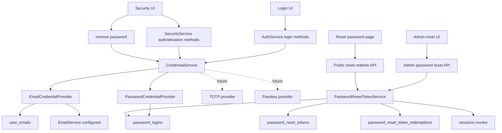

# Credential Provider-based Login and Admin Password Reset Design

## Overview

Signup token introduction separated new signup from SMTP. Next step is to avoid making SMTP a required dependency for login and account recovery.

Current password and email OTP are used for login and elevation respectively. However, the system always shows email as enabled authentication method, and when deleting password, it does not verify what valid credential remains after deletion. In self-host environments without SMTP, even verified email cannot send OTP, so it cannot be used as actual login credential.

This design generalizes authentication methods as credential providers. Password and verified email are credentials, and verified email is valid credential only when SMTP is configured. Every user must have at least one valid credential, and credential deletion must not break this invariant.

Also, to recover users who forgot password in SMTP-less environment, add manual recovery flow where admin issues 24-hour single-use password reset token.

## Requirements

### REQ-1. Introduce CredentialProvider based credential calculation

From initial implementation, model password/email as providers respectively, and CredentialService must combine provider results to calculate credential state.

- Related decisions: ADR-0066-D1
- Acceptance criteria:
  - `PasswordCredentialProvider` and `EmailCredentialProvider` exist.
  - `CredentialService` combines provider results to create user credential summary.
  - `AuthService` and `SecurityService` do not directly combine password/email detail repos to create auth methods.
  - Even if new credential provider is added, higher API structure of credential deletion invariant and authenticated credential listing can be kept.

### REQ-2. Credential summary separates internal model and API projection

CredentialProvider must create rich internal summary, and API must return purpose-specific projection.

- Related decisions: ADR-0066-D2
- Acceptance criteria:
  - Internal summary represents `configured`, `valid`, `can_login`, `can_elevate`, `can_remove`, `unavailable_reason`.
  - Public login methods API returns only minimal information to avoid user enumeration.
  - Authenticated security/elevation API can represent configured/valid/can_remove/reason of own account credential.

### REQ-3. Verified email credential is valid only when SMTP is configured

Verified email can be used as login/elevation credential only when outbound email is configured and OTP can be sent.

- Related decisions: ADR-0066-D3
- Acceptance criteria:
  - When SMTP configured, verified email credential is valid as login/elevation method.
  - When SMTP disabled, verified email credential is not valid even if configured.
  - Login/elevation UI does not expose invalid email credential as usable method.

### REQ-4. Credential deletion preserves at least one valid credential invariant

Credential deletion is allowed only when at least one valid credential remains after deletion.

- Related decisions: ADR-0066-D4
- Acceptance criteria:
  - SMTP disabled + password-only user is denied password deletion.
  - SMTP enabled + verified email + password user is allowed password deletion.
  - Future TOTP/passkey provider, if providing valid credential, is included in same invariant calculation.
  - Deletion denial is returned as observable error so UI can guide user.

### REQ-5. Represent recovery-required state caused by SMTP disabled

Allow SMTP disabled state, and a user with only verified email must be able to become recovery-required.

- Related decisions: ADR-0066-D5
- Acceptance criteria:
  - When SMTP disabled, email credential is marked configured but invalid.
  - User without password can be diagnosed as recovery-required state with 0 valid credential.
  - UI or diagnostics can guide password setup or admin reset requirement.

### REQ-6. Admin can issue user_id-bound password reset token for existing user

To recover users who forgot password in SMTP-less environment, admin must be able to manually deliver reset link.

- Related decisions: ADR-0066-D6
- Acceptance criteria:
  - Admin API creates password reset token for existing user.
  - reset token is bound to `user_id` and does not store email snapshot.
  - If target user does not exist, token is not created.
  - Plain reset token or URL is returned only once immediately after creation.
  - Plain token and token hash are not re-exposed in list/admin response/log.

### REQ-7. Password reset token redeem recovers password credential

User must be able to set new password within 24 hours through reset link.

- Related decisions: ADR-0066-D6, ADR-0066-D7
- Acceptance criteria:
  - Valid token redeem creates or updates password credential.
  - Token is single-use and cannot be reused.
  - expired/revoked/used token fails.
  - If password strength policy fails, token is not consumed.
  - reset success is audited with redemption row.

### REQ-8. Password reset does not auto-login and revokes existing sessions

Password reset token is credential recovery means, not login token.

- Related decisions: ADR-0066-D7
- Acceptance criteria:
  - reset success response does not issue access/refresh token.
  - After reset success, existing refresh sessions of same user are revoked.
  - User logs in through login endpoint with new password.

## Decision Table

| ADR decision | Requirements |
|---|---|
| ADR-0066-D1 | REQ-1 |
| ADR-0066-D2 | REQ-2 |
| ADR-0066-D3 | REQ-3 |
| ADR-0066-D4 | REQ-4 |
| ADR-0066-D5 | REQ-5 |
| ADR-0066-D6 | REQ-6, REQ-7 |
| ADR-0066-D7 | REQ-7, REQ-8 |

## Discussion Points and Decisions

### 1. Boundary of credential abstraction

Options:

- Handle only with existing service helper
- Start as CredentialService internal helper
- Introduce CredentialProvider boundary from beginning

Decision: introduce CredentialProvider boundary from beginning. This decision is recorded in ADR-0066-D1.

Goal of this feature is not simple password reset, but establishing credential foundation for TOTP/passkey expansion. Therefore provider boundary is introduced first so password/email decisions do not spread across `AuthService`, `SecurityService`, UI.

### 2. Credential summary API contract

Options:

- Preserve existing `enabled` shape as much as possible
- Every API returns same rich summary
- Internal summary is rich, and API-specific projection exists

Decision: make internal summary rich and use API-specific projection. This decision is recorded in ADR-0066-D2.

Public login API must reduce user enumeration risk, so it exposes minimal information. Authenticated security/elevation API is own account information, so it can provide details such as configured/valid/can_remove/unavailable_reason.

### 3. Password reset token binding

Options:

- email-bound
- user_id-bound
- user_id-bound + email snapshot

Decision: keep user_id-bound. Do not store email snapshot. This decision is recorded in ADR-0066-D6.

Password reset is existing user credential recovery, so source of truth is `user_id`. There is little benefit in freezing email snapshot at issuance time for 24-hour single-use token, and confusion may occur when snapshot differs from current email. If email hint is needed, query current user email.

### 4. Email-only user invalid state due to SMTP disabled

Options:

- Block SMTP disable itself
- Allow SMTP disabled state and guide password requirement
- Only provide after-the-fact recovery with admin reset token
- Provide both password requirement guidance and admin reset recovery

Decision: allow SMTP disabled state, represent recovery-required state, and recover with admin reset token. This decision is recorded in ADR-0066-D5.

Removing SMTP requirement is original goal, so do not block SMTP disabled itself. Verified email can be configured credential, but is not valid credential when SMTP disabled. User without password can become recovery-required state, and admin reset token is recovery path.

## Architecture

### Core components

| Component | Responsibility |
|---|---|
| `CredentialProvider` | calculate configured/valid/login/elevation/remove possibility by credential type |
| `PasswordCredentialProvider` | calculate password credential based on `password_logins` |
| `EmailCredentialProvider` | calculate email credential based on `user_emails.verified_at` and SMTP configured state |
| `CredentialService` | combine provider results, API projection, deletion invariant, recovery-required decision |
| `SecurityService` | expose CredentialService result as security/elevation API and orchestrate password set/remove |
| `PasswordResetTokenService` | create, preview, redeem, revoke, audit reset token |
| Admin password reset API | admin issues/lists/revokes reset link for existing user |
| Public password reset API | reset link preview/redeem |

## Credential Model

Source of truth for each Credential remains in type-specific table. CredentialProvider reads that source and converts to common summary.

Current providers:

| Credential type | Provider | Source | Config dependency | Valid condition |
|---|---|---|---|---|
| `email` | `EmailCredentialProvider` | `user_emails.verified_at` | SMTP configured | verified email exists + SMTP configured |
| `password` | `PasswordCredentialProvider` | `password_logins` | none | password login row exists |

Internal `CredentialSummary` fields:

| Field | Description |
|---|---|
| `type` | credential type |
| `configured` | whether user configured this credential |
| `valid` | whether usable in current environment |
| `can_login` | whether usable for login |
| `can_elevate` | whether usable for elevation |
| `can_remove` | whether removal request would not break invariant |
| `unavailable_reason` | `not_configured`, `smtp_not_configured`, `last_valid_credential`, `recovery_required`, etc. |

### API projection

| Projection | Target | Exposure principle |
|---|---|---|
| Public login methods | pre-login user | expose minimal information to avoid user enumeration |
| Authenticated security methods | logged-in self | can expose configured/valid/can_remove/reason |
| Elevation methods | logged-in self | can expose can_elevate and reason |
| Admin diagnostic | admin | can identify recovery-required user |

Public login methods must not directly expose existing user presence. User-specific information such as password configured state keeps existing policy or becomes more conservative. Instance-level information such as SMTP availability can be exposed.

## Data Model

### `password_reset_tokens`

| Field | Description |
|---|---|
| id | UUID7 hex primary key |
| token_hash | plaintext token hash, unique |
| user_id | reset target user |
| created_by_user_id | admin user who issued token. null allowed for system issuance |
| expires_at | expiration time. default 24 hours |
| used_at | usage time. single-use decision |
| revoked_at | revocation time |
| created_at, updated_at | timestamp |

Constraints:

- `token_hash` unique
- `user_id` index
- `created_by_user_id` index
- `expires_at` index
- `revoked_at` index

### `password_reset_token_redemptions`

| Field | Description |
|---|---|
| id | UUID7 hex primary key |
| password_reset_token_id | reset token used |
| user_id | reset target user |
| ip_address | request IP |
| user_agent | request user agent |
| redeemed_at | usage time |

`used_at` is sufficient for single-use itself, but redemption row is kept for audit and signup token pattern consistency.

## API

### Public — `/auth/v1`

| Method | Path | Description | Auth |
|---|---|---|---|
| POST | `/password-reset-tokens/preview` | query reset token state and masked email hint | not required |
| POST | `/password-reset-tokens/redeem` | create/update password credential with reset token | not required |

Preview response:

| Field | Description |
|---|---|
| valid | whether token is usable |
| email | masked hint based on current user email |
| expires_at | expiration time |

Redeem input:

| Field | Description |
|---|---|
| token | plaintext reset token |
| password | new password |

Redeem output is `{ success: true }` or 204. Do not return access/refresh token.

### Admin — `/admin/auth/v1`

| Method | Path | Description |
|---|---|---|
| POST | `/password-reset-tokens` | create reset token for existing user. plaintext URL returned only once |
| GET | `/password-reset-tokens` | list reset token metadata. plaintext token/hash excluded |
| DELETE | `/password-reset-tokens/{token_id}` | revoke |

Create input can initially accept email or user id. Service source of truth is user id, and email input is for resolving existing user. Do not store email snapshot in Token row.

## Frontend

### Admin password reset token creation screen

Initial location is account admin section. Since `/account/signup-tokens` already exists, manual token admin UX can be placed in same family.

UI states:

| State | Behavior |
|---|---|
| user/email input | resolve existing user and create reset token |
| immediately after token creation | show reset link once and provide copy button |
| list | show target user's current masked email, expires_at, used/revoked status. do not show plaintext token |
| revoke | revoke active token |

### Reset password page

Add `/reset-password?token=...` page.

States:

| State | Display |
|---|---|
| valid | masked email hint and new password form |
| expired | expiration guidance |
| revoked | revocation guidance |
| used | already used guidance |
| invalid | invalid link guidance |
| success | password changed complete, guide to login |

### Security page

Security page displays authenticated credential projection.

- If SMTP is not configured, email credential displays invalid reason.
- If password delete button is added and `can_remove=false`, disable and show reason.
- Password setup/change remains possible only in elevated state.

## Fit With Existing Code

| Item | Result | Basis |
|---|---|---|
| Password login source | usable | `PasswordLoginRepository`, `AuthService.login_with_password` exist |
| Password set/update | usable | `SecurityService.set_password` performs upsert |
| Session revoke | usable | `SessionRepository.revoke_all_by_user` exists |
| Email credential state | needs reinforcement | `UserEmail.verified_at` exists but not connected with SMTP validity |
| Auth methods | needs change | currently always returns email as enabled |
| Login methods | needs change | currently returns only `has_password` |
| Password removal | needs change | currently does not prevent deleting last valid credential |
| Reset token pattern | reusable | signup token hash-only, preview/redeem, admin create/list/revoke pattern can be used |

## Feasibility Verification

### Directly confirmed facts

- `AuthService.login_with_password` issues session with password credential alone.
- `AuthService.get_login_methods` returns only password presence.
- `SecurityService.get_auth_methods` always returns email as enabled.
- `SecurityService.remove_password` deletes password row without checking credential invariant.
- `SecurityService.set_password` supports both existing password update and missing password create.
- `SessionRepository.revoke_all_by_user` exists and can be used after reset success.
- Dedicated password reset table/API/UI does not currently exist.
- Signup token implementation provides hash-only, one-time plaintext, preview/redeem, redemption audit patterns.

### Risks and mitigation

| Risk | Impact | Mitigation |
|---|---|---|
| CredentialProvider interface overly fixed | rework needed when adding TOTP/passkey | keep initial interface small around summary calculation and capability |
| Information disclosure in public login projection | user enumeration risk | public projection returns minimal information and stays separate from authenticated projection |
| Existing email-only user becomes recovery-required due to SMTP disabled | users unable to login | provide Admin password reset token as recovery path and guide in UI/diagnostic |
| Manual reset token delivery stolen | account password change risk | 24-hour TTL, single-use, hash-only storage, revoke existing sessions on reset success, show plaintext once |
| User logged out by existing session revoke | UX inconvenience | password reset is recovery/security event, document as expected behavior |

## Test Strategy

Product behavior verification is E2E primary. Unit/integration/static checks are supporting verification.

### E2E primary verification matrix

| Scenario | Verification |
|---|---|
| SMTP disabled + password-only user password deletion attempt | deletion rejected, password login retained |
| SMTP enabled + verified email + password user password deletion | deletion succeeds, email credential remains |
| Login methods SMTP disabled | email method not exposed as valid login method |
| Login methods SMTP enabled | verified email method exposed as valid login method |
| Authenticated security methods | configured/valid/can_remove/reason reflect credential state |
| Admin reset token creation | reset URL returned once for existing user, plaintext not exposed in list |
| Reset token redeem | new password set success, existing sessions revoked, new password login succeeds |
| Reset token failure paths | expired/revoked/used/weak password fails, weak password failure does not consume token |
| Reset token target absent | admin create fails, token not created |

### E2E primary verification plan

- Location: `testenv/azents/e2e`
- Call public/admin API against real devserver.
- Separate SMTP configured/disabled with deterministic fixture or config override.
- Capture reset token plaintext only from admin create response and verify it is not exposed afterward in list/preview/log.
- Verify refresh fails with existing refresh token after reset success and login succeeds with new password.

### Seed/fixture requirements

- SMTP disabled instance fixture
- SMTP enabled or fake mail sink fixture
- password-only user fixture
- verified-email + password user fixture
- existing session fixture
- admin user fixture

### Credential/prerequisite snapshot requirements

- Default deterministic E2E does not depend on external SMTP credential.
- SMTP enabled verification uses dev mail sink or fake email service fixture.
- Live SMTP/SES verification is separated as optional/live.
- Optional live tests SKIP when credential missing, but FAIL on delivery failure when credential is configured.

### Evidence format

- E2E execution command and working directory
- API response snapshot summary
- Credential projection assertion
- Assertion that reset token list does not expose plaintext/hash
- Assertion that existing session refresh fails and new password login succeeds

### CI execution policy

- Deterministic E2E included in PR CI.
- Live SMTP verification is nightly or manual-label optional workflow.
- Unit/static checks run in every PR but are not used alone as QA PASS evidence.

## QA Checklist

### QA-1. Reject password deletion for password-only user when SMTP disabled

#### What to check
SMTP disabled user whose password is the only valid credential attempts password deletion.

#### Why it matters
Core invariant preventing user from becoming unable to login.

#### How to check
Create SMTP disabled fixture and password-only user in testenv E2E, then call security password remove API.

#### Expected result
API returns credential invariant violation, and password login continues to succeed.

#### Execution result
TBD

#### Fixes applied
TBD

### QA-2. Allow password deletion when verified email remains under SMTP enabled

#### What to check
User with both verified email and password under SMTP enabled deletes password.

#### Why it matters
Credential deletion must not be blanket-forbidden; it should be allowed when valid credential remains.

#### How to check
Prepare SMTP enabled/fake mail fixture in testenv E2E and call password remove API for verified email + password user.

#### Expected result
Password deletion succeeds, and credential summary marks email credential valid.

#### Execution result
TBD

#### Fixes applied
TBD

### QA-3. Login/elevation methods reflect SMTP availability

#### What to check
Verify that email credential valid/login/elevation availability changes according to SMTP disabled/enabled.

#### Why it matters
If UI exposes unusable email OTP flow, SMTP-less environment creates failed UX.

#### How to check
In testenv E2E, call methods API for same verified email user in SMTP disabled and enabled fixtures.

#### Expected result
Email method is not valid under SMTP disabled, and valid under SMTP enabled.

#### Execution result
TBD

#### Fixes applied
TBD

### QA-4. Authenticated credential projection provides reason

#### What to check
Security/elevation methods API represents configured/valid/can_remove/unavailable_reason.

#### Why it matters
UI must be able to explain recovery-required state and reason password cannot be removed.

#### How to check
In testenv E2E, call security/elevation methods API with SMTP disabled email-only or password-only fixture.

#### Expected result
Email credential includes reason such as `smtp_not_configured`; password deletion disabled includes reason such as `last_valid_credential`.

#### Execution result
TBD

#### Fixes applied
TBD

### QA-5. Admin password reset token creation and plaintext one-time display

#### What to check
Admin creates password reset token for existing user and can copy reset link.

#### Why it matters
This is operator entrypoint for SMTP-less password recovery.

#### How to check
Create reset token through admin API in testenv E2E and query list API.

#### Expected result
Create response includes reset URL. List response includes only metadata and not plaintext token/hash.

#### Execution result
TBD

#### Fixes applied
TBD

### QA-6. Password reset token redeem

#### What to check
User sets new password through reset link and logs in with new password.

#### Why it matters
Core user flow of SMTP-less password recovery.

#### How to check
In testenv E2E, call admin reset token creation, public preview, public redeem, password login in order.

#### Expected result
Redeem succeeds and does not return access/refresh token. Existing session refresh fails and new password login succeeds.

#### Execution result
TBD

#### Fixes applied
TBD

### QA-7. Password reset token failure paths

#### What to check
Check expired, revoked, used tokens and weak password failure.

#### Why it matters
Reset token confers account recovery authority, so single-use, TTL, revoke, and non-consumption on failure must be guaranteed.

#### How to check
Call reset redeem for each failure condition in testenv E2E or deterministic service-backed E2E.

#### Expected result
Each failure does not change password. Weak password failure does not consume token.

#### Execution result
TBD

#### Fixes applied
TBD

## Implementation Plan

### Phase 1. CredentialProvider foundation

- Add `CredentialProvider` interface
- Implement `PasswordCredentialProvider`, `EmailCredentialProvider`
- Add Credential summary data model
- Reflect SMTP configured state in email credential validity
- Change auth/security methods to CredentialService basis

### Phase 2. Credential projection and invariant enforcement

- Separate Public login projection and authenticated security/elevation projection
- Add credential deletion availability calculation
- Apply last valid credential guard to `remove_password`
- Add API error and UI disabled reason
- Add related E2E

### Phase 3. Password reset backend

- Add `password_reset_tokens`, `password_reset_token_redemptions` migration/model/repo
- Implement `PasswordResetTokenService` create/preview/redeem/revoke/list
- Add Admin/public API
- On reset success, apply password upsert and session revoke

### Phase 4. Password reset frontend

- Add Admin reset token create/list/revoke UI
- Add `/reset-password?token=...` page
- Adjust credential availability display in Security/login UI

### Phase 5. Verification and spec promotion

- Run deterministic E2E and fill QA Checklist
- Update `docs/azents/spec/domain/user-auth.md` to match implementation
- Reflect design document verification result

## Alternatives Considered

### Handle with existing service helper

Initial implementation is faster, but credential decisions scatter. It does not fit this work, whose goal is future TOTP/passkey.

### Start as CredentialService internal helper

External boundary can exist, but provider-based extensibility is weak. Since goal is establishing foundation, introduce provider boundary from the beginning.

### Expose same credential summary from every API

Consistency is good, but user enumeration risk of public login API increases. Separate by purpose-specific projection.

### Block SMTP disabled itself

Can prevent invalid user state, but conflicts with SMTP-less operation goal. Allow recovery-required state and admin reset recovery.

### Email-bound reset token

Password reset is existing user credential recovery. Bind reset target to user_id rather than email lookup.

### User id + email snapshot reset token

Can keep email audit at issuance time, but benefit is small for 24-hour single-use reset token. Avoid snapshot drift and UI explanation burden by storing only user_id.

### Auto-login after reset

Convenient, but reset token becomes login token. Use reset only for password credential recovery and require new password login.
