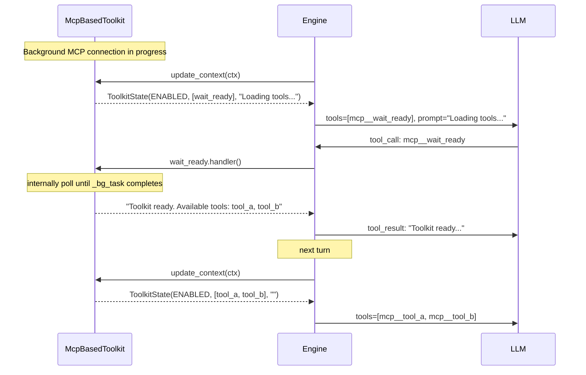
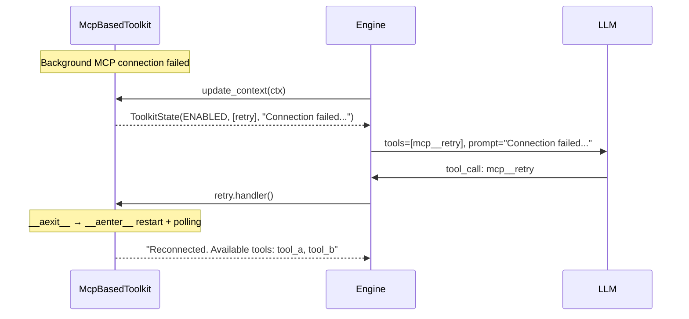

# Declarative Improvement Design for Toolkit Async Loading State

## Overview

### Problem Solved

Currently async loading toolkits (MCP, etc.) communicate loading/error state to LLM only through natural language prompt. LLM can see "Loading tools..." and immediately give up the turn, and declarative behavior (wait/retry) cannot be induced.

### Solution

Reuse existing `request_authorization` pattern as-is: **toolkit directly provides tools matching its state**.

- LOADING state → include `wait_ready` tool in tools
- ERROR state → include `retry` tool in tools
- Engine, ToolkitStatus, ToolkitState — **no change**

### User Scenarios

1. **Waiting for MCP server connection**: when toolkit is loading, provide `wait_ready` tool → when LLM calls it, wait until connection completes and return available tool list
2. **Recovering from MCP server connection failure**: when toolkit is in error state, provide `retry` tool → when LLM calls it, try reconnect

## Discussion Points and Decisions

> Detailed discussion record: `../adr/0012-declarative-toolkit-status.md`

| # | Discussion point | Decision | Rationale |
|---|-----------|------|------|
| 1 | Change ToolkitStatus? | **No change** | enum extension unnecessary if toolkit directly provides tool |
| 2 | Change engine? | **No change** | engine is irrelevant because wait/retry are included in toolkit tools |
| 3 | Tool injection owner | **toolkit directly** | same as `request_authorization` pattern |
| 4 | wait implementation | **polling inside toolkit** | directly checks own `_bg_task` state |
| 5 | retry implementation | **reuse `__aexit__` → `__aenter__`** | use existing lifecycle methods |
| 6 | Frontend exposure | **separate future PR** | scope limitation |

## Architecture

### Flow



### ERROR State Flow



## Implementation

### Change Scope

| File | Change |
|------|----------|
| `engine/tools/mcp_base.py` | add `_make_wait_ready_tool()`, `_make_retry_tool()`. Include corresponding tool in `update_context()` on LOADING/ERROR |
| `engine/tools/mcp_base_test.py` | add tests for wait/retry tool return and handlers |

**Files not changed**: `core/tools.py`, `engine/engine.py`, `worker/engine.py`, all other toolkits

### McpBasedToolkit changes (mcp_base.py)

Add tools to existing natural language prompt return in `update_context()`:

```python
async def update_context(self, context: TurnContext) -> ToolkitState:
    # ... (existing per-user OAuth branch unchanged)

    cached = self._bg_tools or []

    if self._bg_task is not None and not self._bg_task.done():
        # loading — include wait_ready tool
        return ToolkitState(
            status=ToolkitStatus.ENABLED,
            tools=[*cached, self._make_wait_ready_tool()],
            prompt="Loading tools. Call wait_ready to wait for completion."
            if not cached
            else "",
        )

    if self._bg_error is not None:
        # error — include retry tool
        return ToolkitState(
            status=ToolkitStatus.ENABLED,
            tools=[*cached, self._make_retry_tool()],
            prompt=f"Connection failed: {self._bg_error}. "
            "Call retry to retry."
            if not cached
            else "",
        )

    # ... (existing ready/waiting branch unchanged)
```

### wait_ready tool

```python
def _make_wait_ready_tool(self) -> FunctionTool:
    """Provided in LOADING state. Polls until loading completes when called."""

    async def handler(arguments_json: str) -> str:
        elapsed = 0.0
        while elapsed < 60.0:
            await asyncio.sleep(0.5)
            elapsed += 0.5
            if self._bg_task is None or self._bg_task.done():
                if self._bg_tools is not None:
                    names = [t.spec.name for t in self._bg_tools]
                    return f"Toolkit ready. Available tools: {', '.join(names)}"
                if self._bg_error is not None:
                    return f"Toolkit failed to load: {self._bg_error}"
        return "Toolkit is still loading after 60s. Try again later."

    return FunctionTool(
        spec=FunctionToolSpec(
            name="wait_ready",
            description="Wait for the toolkit to finish loading its tools.",
            input_schema={"type": "object", "properties": {}, "required": []},
        ),
        handler=handler,
    )
```

### retry tool

```python
def _make_retry_tool(self) -> FunctionTool:
    """Provided in ERROR state. Attempts reconnect when called."""

    async def handler(arguments_json: str) -> str:
        await self.__aexit__(None, None, None)
        await self.__aenter__()

        elapsed = 0.0
        while elapsed < 60.0:
            await asyncio.sleep(0.5)
            elapsed += 0.5
            if self._bg_task is None or self._bg_task.done():
                if self._bg_tools is not None:
                    names = [t.spec.name for t in self._bg_tools]
                    return f"Reconnected. Available tools: {', '.join(names)}"
                if self._bg_error is not None:
                    return f"Failed to reconnect: {self._bg_error}"
        return "Toolkit is still loading after 60s. Try again later."

    return FunctionTool(
        spec=FunctionToolSpec(
            name="retry",
            description="Retry connecting to the toolkit after a failure.",
            input_schema={"type": "object", "properties": {}, "required": []},
        ),
        handler=handler,
    )
```

## Consistency with Existing Pattern

This approach is exactly same as `request_authorization` pattern:

| State | Existing pattern | New pattern |
|------|----------|---------|
| Auth required | `tools=[request_authorization]` | same |
| Loading | `tools=[], prompt="Loading tools..."` | `tools=[wait_ready]` |
| Error | `tools=[], prompt="Connection failed..."` | `tools=[retry]` |

From LLM perspective: if usable tool exists, use it; if not, judge from prompt. Consistent pattern.

## Feasibility Verification

| Item | Result | Note |
|------|------|------|
| Can directly check _bg_task inside mcp_base? | ✅ | inside same class |
| Is __aexit__→__aenter__ restart safe? | ✅ | only cancels/creates bg task |
| Do tools automatically disappear in next turn? | ✅ | update_context called every turn; wait not included after READY |
| Can existing cached tools coexist with wait tool? | ✅ | included together in tools list |

## Risks

| Risk | Mitigation |
|--------|----------|
| Tool execution blocked 60s while waiting | maximum wait time limit; MCP connection usually takes seconds |
| Infinite retry loop | LLM autonomous judgment, prompt guidance after one failure |

## Implementation Plan

Single PR and single commit is sufficient:

1. `feat(nointern): add wait_ready and retry tools to mcp_base`

## Alternatives Considered

| Alternative | Rejection reason |
|------|----------|
| Extend ToolkitStatus enum (LOADING, ERROR, etc.) | unnecessary if toolkit directly provides tools |
| Discriminated union (Ready, Loading, Error, etc.) | same as above |
| Engine auto-injects tools | toolkit responsibility; engine does not need to participate |
| Keep natural language prompt only | LLM cannot act. Tool must exist to wait/retry |
