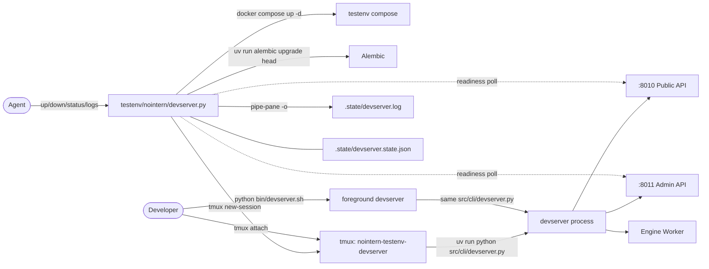

# Full-stack Local Test Environment — Stage 1b (devserver lifecycle)

> Related issue: azents/azents#2327 (parent), azents/azents#2338 (this design)
>
> Prerequisite: [Stage 1a — Preflight](./local-260406-local-fullstack-test-env.md)
>
> Discussion record: azents/azents#2339

## Overview

Stage 1a made it possible to diagnose local environment prerequisites with `testenv/nointern/preflight.py`. Stage 1b is next step: provide CLI entrypoint `testenv/nointern/devserver.py` that lets agents start/stop/check status of devserver in background.

### Problem

Currently `python/apps/nointern/bin/devserver.sh` supports only foreground execution. For an agent to repeat "code change → restart → test", following are needed but absent:

- background execution + cleanup across sessions
- programmatic way to know "server is ready"
- automation of supporting tasks such as `docker compose` / `alembic upgrade`
- consistent location for reading logs

### Target Scenario

```bash
cd testenv/nointern

# 0. diagnosis
python preflight.py

# 1. start infra + devserver in one line and wait until ready
uv run devserver.py up

# 2. check status (usable by agent in shell conditional)
uv run devserver.py status && echo ready

# 3. tail logs (attach directly if observation needed)
uv run devserver.py logs -f
tmux attach -t nointern-testenv-devserver

# 4. graceful cleanup
uv run devserver.py down
```

## Discussion Result Summary

See #2339 for detailed discussion. Six discussion point decisions:

| # | Point | Decision |
|---|---|---|
| 1 | Process management | **tmux session** — `nointern-testenv-devserver` |
| 2 | Infra integration | **`up` = compose + alembic + devserver**, separate `build-runtime` |
| 3 | Readiness detection | **Public + Admin readiness polling + tmux session liveness + log output on failure** |
| 4 | Idempotency | **idempotent `up`**, automatic unhealthy recovery, stale cleanup + warning |
| 5 | File/CLI structure | **`testenv/nointern/.state/` + single `devserver.py` + argparse subparser** |
| 6 | Relationship with `devserver.sh` | **parallel** — both directly call `src/cli/devserver.py` |

Additional scope: **`tmux-installed` preflight check** — first extension case of Stage 1a framework.

## Architecture



**Key point**: tmux session serves as "process supervisor". Instead of PID management, check liveness with `tmux has-session`, send SIGINT with `tmux send-keys C-c` to induce graceful shutdown, and capture stdout/stderr to file with `tmux pipe-pane`.

## Data Model

### `.state/` directory

```
testenv/nointern/.state/
├── devserver.log          # continuously append by pipe-pane (no rotation)
└── devserver.state.json   # startup metadata
```

Add `.state/` to `.gitignore`.

### `devserver.state.json`

```json
{
  "session_name": "nointern-testenv-devserver",
  "started_at": "2026-04-06T14:30:00Z",
  "command": ["uv", "run", "python", "src/cli/devserver.py"],
  "cwd": "python/apps/nointern",
  "reload": false,
  "public_port": 8010,
  "admin_port": 8011
}
```

`status` command reads and prints this file. If tmux session is dead, it is considered stale.

## CLI Specification

### Full command list

```
testenv/nointern/devserver.py up [--force] [--timeout SECONDS] [--reload] [--no-infra] [--no-migrate]
testenv/nointern/devserver.py down [--all] [--force]
testenv/nointern/devserver.py restart  # up --force alias
testenv/nointern/devserver.py status
testenv/nointern/devserver.py logs [-f] [-n LINES]
testenv/nointern/devserver.py build-runtime [--no-cache]
```

### `up` details

Order:
1. **Pre-check**: confirm repo root & `testenv/nointern/.env` exists (if absent, guide to preflight + exit)
2. **Check tmux session existence**:
   - session exists + readiness 200 → if not `--force`, print "already running" + exit 0
   - session exists + readiness failed → stop existing and restart (stderr warning)
   - no session but state.json exists → stale cleanup + restart (stderr warning)
3. **Start infra** (skip with `--no-infra`): `docker compose -f testenv/nointern/docker-compose.yaml up -d --wait`
4. **Migration** (skip with `--no-migrate`): `uv run --project python/apps/nointern alembic -c db-schemas/rdb/alembic.ini upgrade head`
5. **Create tmux session + start devserver** (confirmed in Feasibility verification):
   ```bash
   tmux new-session -d -s nointern-testenv-devserver \
       -c python/apps/nointern \
       -e NI_RDB_HOST=localhost -e NI_RDB_PORT=5433 ... \
       uv run python src/cli/devserver.py
   tmux pipe-pane -t nointern-testenv-devserver -o 'cat >> .../.state/devserver.log'
   ```
   Execute command directly in pane without shell wrapper. Inject result of parsing `testenv/nointern/.env` for all variables through `-e` flags (pydantic-settings prioritizes env vars over `.env` file, so testenv values win).
6. **Write state.json**
7. **Readiness polling**: every 0.5s check `http://localhost:8010/health/v1/readiness` + `:8011/...` + `tmux has-session`. Consider true failure after 5 consecutive failures. Default timeout 60s (`--timeout`).
8. **Success**: print `ready (public=:8010 admin=:8011 pid=<tmux pid>)` + exit 0
9. **Failure**: print last 50 lines of `.state/devserver.log` to stderr, kill session + delete state.json, exit 1

### `down` details

Order:
1. If no session, no-op + exit 0
2. `tmux send-keys -t <session> C-c` → wait 30s, checking `tmux has-session` every 1s
3. If session still alive, `tmux kill-session` (SIGKILL equivalent) + stderr warning
4. `--force`: immediately kill-session without waiting
5. `--all`: after session cleanup, `docker compose -f testenv/nointern/docker-compose.yaml down`
6. delete state.json

### `restart`

Alias of `up --force`. Stop existing session → start new session.

### `status`

Output example (ready):
```
devserver: running
  session:   nointern-testenv-devserver
  started:   2026-04-06T14:30:00Z (42s ago)
  public:    http://localhost:8010  (200 OK)
  admin:     http://localhost:8011  (200 OK)
  reload:    false
exit 0
```

Output example (unhealthy):
```
devserver: unhealthy
  session:   nointern-testenv-devserver (alive)
  public:    http://localhost:8010  (connection refused)
exit 1
```

Output example (not running):
```
devserver: not running
exit 2
```

Exit codes: `0` ready / `1` unhealthy / `2` not running. Usable in shell conditional.

### `logs`

- Default: print last 50 lines of `.state/devserver.log` (adjust with `-n`)
- `-f`: follow like `tail -f`
- even when session not running, show log file if it exists (post-mortem support)

### `build-runtime`

```bash
docker build -t nointern-agent-runtime:local -f docker/nointern/agent-runtime/Dockerfile .
```

- `--no-cache`: ignore cache
- Run once before entering Stage 3. It is separated from `up`, so unnecessary when only API/WebSocket testing.
- Later in Stage 3, add `agent-runtime-image-exists` check to preflight to guide "run this first for Stage 3".

## File Structure

```
testenv/nointern/
├── .gitignore                  # + .state/
├── .state/                     # gitignored
│   ├── devserver.log
│   └── devserver.state.json
├── devserver.py                # new CLI entrypoint (argparse subparser)
├── preflight.py                # existing
├── docker-compose.yaml         # existing
├── pyproject.toml              # existing
├── README.md                   # existing + devserver section
├── .env.example                # existing
└── checks/
    ├── __init__.py             # + TmuxInstalled registration
    ├── base.py                 # existing
    ├── runner.py               # existing
    ├── output.py               # existing
    ├── system.py               # + TmuxInstalled
    ├── ports.py
    ├── config.py
    ├── infra.py
    └── runtime_state.py
```

Start with single file without splitting internal helpers from beginning. If line count grows (~500+), split by following criteria:
- `_devserver/process.py` — tmux wrapping (session create/kill/pipe/send-keys)
- `_devserver/readiness.py` — health polling + retry
- `_devserver/compose.py` — docker compose wrapper
- `_devserver/state.py` — state.json read/write

## TmuxInstalled Check

Add to `testenv/nointern/checks/system.py`:

```python
class TmuxInstalled(Check):
    """Check tmux installation — devserver lifecycle uses tmux session."""

    def __init__(self) -> None:
        super().__init__(
            id="tmux-installed",
            name="tmux installed",
            category="system",
        )

    def run(self, context: RunContext) -> CheckResult:
        del context
        path = shutil.which("tmux")
        if path:
            return CheckResult(status=Status.PASS, message=path)
        return CheckResult(
            status=Status.FAIL,
            message="tmux not in PATH",
            fix_hint="brew install tmux  # macOS\napt install tmux  # Debian/Ubuntu",
        )
```

Add `TmuxInstalled()` to system section of `all_checks()` factory (after existing `UvInstalled()`).

## Implementation Plan

### Phase 1 — TmuxInstalled preflight check

- Add `TmuxInstalled` to `checks/system.py`
- Register in `all_checks()` of `checks/__init__.py`
- Add to check list in `README.md`
- Can merge independently from rest of Stage 1b (to validate Stage 1a extension pattern)

### Phase 2 — devserver CLI skeleton

- `testenv/nointern/devserver.py` — argparse subparser (up/down/restart/status/logs/build-runtime)
- Each subcommand is stub (`raise NotImplementedError` or "not implemented yet")
- Add `.state/` to `.gitignore`
- Smoke test: confirm full command list with `python testenv/nointern/devserver.py --help`

### Phase 3 — tmux process management

- wrap session create/kill/send-keys/pipe-pane
- basic implementation of `up` (no infra/migrate, devserver only) + `down` + `status`
- state.json read/write
- manual test: verify `up`/`down`/`status` lifecycle works

### Phase 4 — readiness polling + infra/migration integration

- implement Public + Admin readiness polling
- timeout + consecutive failure counting
- print log tail on failure
- integrate compose + alembic steps into `up` (`--no-infra`, `--no-migrate` flags)
- actual environment end-to-end test

### Phase 5 — logs + build-runtime + README

- `logs` (tail mode)
- `build-runtime`
- devserver section + usage examples in `README.md`
- add testenv wrapper reference comment to `bin/devserver.sh`

### Phase 6 — cleanup

- If Phase 1 was merged separately, confirm integration.
- Remove unnecessary stubs, refactor.

Stacked PR structure uses `/ship-feature` skill to create PR by phase.

## Feasibility Verification Result

Verification result run immediately after draft creation. Main findings are summarized in "Confirmed implementation pattern" section below.

### Verification Items

| Item | Result | Note |
|---|---|---|
| tmux installation and version | ✓ | confirmed `tmux 3.4` |
| `new-session -d -s NAME CMD` + `pipe-pane -o` log capture | ✓ | initial output captured too |
| SIGINT delivery with `send-keys C-c` | ✓ | Python signal handler received it in direct command mode |
| `tmux kill-session` cleans uvicorn `--reload` process tree | ✓ | both reloader + worker cleaned, no leak |
| Public `/health/v1/readiness` | ✓ | `python/apps/nointern/src/nointern/api/public/health/v1/__init__.py` exists |
| Admin `/health/v1/readiness` | ✓ | `python/apps/nointern/src/nointern/api/admin/health/v1/__init__.py` exists |
| alembic config path | ✓ | `python/apps/nointern/db-schemas/rdb/alembic.ini` exists |
| `docker compose -f testenv/nointern/docker-compose.yaml up -d --wait` | ✓ | works. However, most services lack healthcheck so only waits for "running" state |
| env loading method of `Config.from_env()` | ! | **pydantic-settings reads `.env` in CWD**. testenv wrapper needs separate handling |
| pass env to tmux with `subprocess.run(..., env=...)` | ✗ | if tmux server is already running, inherits server env — new env not reflected |
| inject env with `tmux new-session -e KEY=VAL` flag | ✓ | can repeat multiple times and accurately reflects in session |

### Confirmed Implementation Pattern

#### tmux session creation

Use **direct command mode** instead of shell wrapping (`exec …`):

```python
subprocess.run([
    "tmux", "new-session",
    "-d",                                 # detached
    "-s", "nointern-testenv-devserver",
    "-c", str(repo_root / "python/apps/nointern"),
    # parse .env and pass each as -e flag (see "env injection" below)
    *env_flags,
    "uv", "run", "python", "src/cli/devserver.py",
], check=True)
subprocess.run([
    "tmux", "pipe-pane", "-t", session_name, "-o",
    f"cat >> {log_path}",
], check=True)
```

This pattern is better than shell + exec wrapping:
- no shell prompt noise in logs
- Python process is pane foreground process from command start → `send-keys C-c` is delivered directly
- argument escaping is simple

#### env injection (key finding)

`Settings` in `python/apps/nointern/src/nointern/core/config.py` uses `SettingsConfigDict(env_file=".env")`, so it reads **`.env` in CWD**. If devserver starts with cwd `python/apps/nointern/`, it loads `python/apps/nointern/.env`; `testenv/nointern/.env` is ignored.

Also, even if env is passed to tmux client with `subprocess.run(..., env=...)`, **when tmux server is already running, server env is inherited**, so new env is not reflected.

**Solution**: testenv wrapper directly parses `testenv/nointern/.env` and injects each `NI_*` variable with `tmux new-session -e KEY=VAL`. pydantic-settings prioritizes environment variables over `.env` file, so testenv values win.

```python
env_flags: list[str] = []
for key, value in parsed_env.items():
    env_flags.extend(["-e", f"{key}={value}"])
```

Notes:
- Reuse `_parse_env_file` already in Stage 1a runner (or move to wrapper).
- tmux parses values with spaces/special chars — needs verification (basic case has no issue).

#### readiness polling

- `GET http://localhost:8010/health/v1/readiness`
- `GET http://localhost:8011/health/v1/readiness`
- simultaneously `tmux has-session -t nointern-testenv-devserver`
- 0.5s interval, timeout 60s, consider true failure after 5 consecutive failures

If session dies, fail immediately (do not wait for timeout).

#### shutdown

```python
subprocess.run(["tmux", "send-keys", "-t", session_name, "C-c"], check=True)
# poll has-session every 1s for 30s
# if still alive, kill-session
subprocess.run(["tmux", "kill-session", "-t", session_name], check=False)
```

Confirmed that `kill-session` cleans entire process tree even for uvicorn `--reload`.

#### docker compose `--wait`

Current `testenv/nointern/docker-compose.yaml` has no healthcheck for services except rustfs, so `--wait` only waits until "running" state. This complements preflight `postgres-container-healthy` check and is sufficient for current scope. Adding healthcheck to db/valkey is follow-up.

### Risks and Mitigations

| Risk | Probability | Impact | Mitigation |
|---|---|---|---|
| environment without tmux installed | medium | high | guide early with `tmux-installed` preflight check. Add install command to README |
| tmux send-keys C-c does not reach `exec`ed process | low | high | directly confirmed in Phase 3 feasibility. fallback if fails: `kill -INT $(tmux list-panes -t <s> -F '#{pane_pid}')` |
| multiple processes remain in uvicorn reload mode | medium | medium | reload default off. When reload used, kill-session + separate cleanup script |
| concurrent `up` twice (race) | low | low | tmux `new-session -d` fails on same name twice → handle error |
| `.env` variables not injected into devserver process | medium | high | wrapper parses `.env` → explicit injection into tmux via -e (same style as preflight runner) |
| port conflict between testenv compose and existing compose | medium | medium | confirmed in Stage 1a: project name separated + same ports (5433/6379/…) used, so existing compose must be down first. Explicit check + guide at `up` start |

## Alternatives Considered

### 1. PID file + `subprocess.Popen(start_new_session=True)`

**Rejected reason**: tmux selected in discussion point 1. Debugging UX (attach capability) is more important than pure stdlib.

### 2. Include agent-runtime build in `up`

**Rejected reason**: discussion point 2. Forcing 3-5 minute wait every time is excessive. It is needed only in Stage 3, so separated as command.

### 3. Single readiness check only

**Rejected reason**: discussion point 3. Checking only Public misses Admin API failure. Without PID/session liveness, import error death would wait until timeout.

### 4. Fully replace `devserver.sh`

**Rejected reason**: discussion point 6. Foreground execution is still useful for IDE debugger/live observation. Parallel operation is lower risk, and both converge on `src/cli/devserver.py`, minimizing duplication.

### 5. Automatic file change detection (watchexec/watchdog)

**Rejected reason**: out of scope. uvicorn `--reload` already provides file change detection, so duplicate implementation unnecessary.

## Out of Scope (not handled in Stage 1b)

- Test data seed (Stage 1c)
- Refactoring `src/cli/devserver.py` itself
- multi-instance / multiple port set support
- log rotation (append only one file)
- Stage 3 `agent-runtime-image-exists` preflight check (follow-up)

## References

- Parent design: [`local-260406-local-fullstack-test-env.md`](./local-260406-local-fullstack-test-env.md)
- Discussion: azents/azents#2339
- Implementation issue: azents/azents#2338
- Existing entrypoint: `python/apps/nointern/bin/devserver.sh`, `python/apps/nointern/src/cli/devserver.py`
- testenv compose: `testenv/nointern/docker-compose.yaml` (Stage 1a)
- preflight framework: `testenv/nointern/checks/` (Stage 1a)
