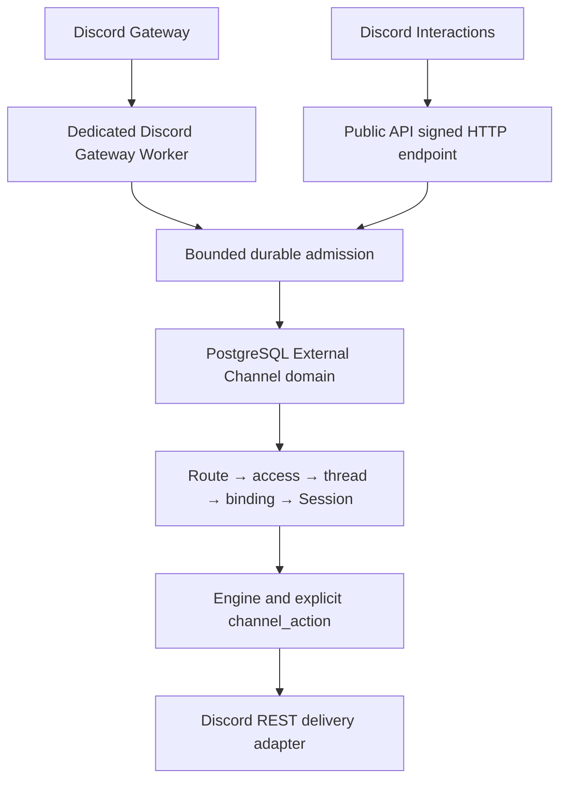

# Discord Agent App Routing Design

- Snapshot: `discord-260726`
- Document reference: `discord-260726/DESIGN`
- Requirements: [discord-260726/REQ](../requirements/discord-260726-agent-app-routing.md)
- ADR: [discord-260726/ADR](../adr/discord-260726-agent-app-routing.md)
- Mode: Collaborative

## Scope

This design adds customer-owned Discord Single and Multi Apps to the existing External
Channel domain. It preserves the confirmed Slack parity baseline while using Discord
Gateway, signed HTTP interactions, threads, messages, components, and attachments as
provider adapters.

The design does not restore the removed nointern Discord domain. Historical code is
used only as operational evidence. PostgreSQL External Channel records remain the
canonical connection, routing, authorization, conversation, work, and delivery state.

## Traceability

| Requirement | ADR decisions | Design mechanism |
| --- | --- | --- |
| `discord-260726/REQ-1` | D1-D9 | Shared canonical orchestration with explicit Discord adapters and essential deterministic E2E |
| `discord-260726/REQ-2` | D1, D7, D8 | Workspace-owned Multi connection with one customer App identity, dedicated Gateway lease, and shared management shell |
| `discord-260726/REQ-3` | D7, D8 | Existing App mode and Agent-route graph; Discord App claim is independent from route cardinality |
| `discord-260726/REQ-4` | D7, D8 | Agent-scoped Single setup using Bot Token and Guild ID; automatic sole route |
| `discord-260726/REQ-5` | D7, D8 | Workspace-scoped Multi setup with zero or more routes and no Agent-owned credential duplication |
| `discord-260726/REQ-6` | D2, D5 | Ephemeral paged selector backed by current route and access projections |
| `discord-260726/REQ-7` | D2, D3, D5 | Message application command retains the selected source before selection and provisions a route-resolved thread |
| `discord-260726/REQ-8` | D2, D5, D8 | Opaque Discord-to-Web management handoff and shared generation-fenced channel-default service |
| `discord-260726/REQ-9` | D1, D3, D5 | Gateway mention creates one durable pending admission and minimal selector launcher without creating a default |
| `discord-260726/REQ-10` | D1, D3, D6 | One Discord thread resource, one active binding, one Session, and ordered continuation/delivery |
| `discord-260726/REQ-11` | D2, D3, D5 | Retained source and files, route-scoped approval, durable control message, and idempotent post-approval continuation |
| `discord-260726/REQ-12` | D3, D6, D8 | Existing binding wins; relationship changes invalidate future routing without retargeting retained state |
| `discord-260726/REQ-13` | D1-D8 | App/Guild-scoped ingress, opaque controls, canonical reloads, principal provenance, and generation fences |
| `discord-260726/REQ-14` | D1, D2, D4, D6 | Durable admission before acknowledgement, one leased Gateway owner, transient interaction tokens, and at-most-once delivery parts |
| `discord-260726/REQ-15` | D4-D6, D8 | Message Content gate, metadata-only attachments, bot-owned ordered bundles, and provider-limit preflight |

## Current System and Gaps

### Reusable canonical domain

The following records and services already provide the required authority and lifecycle
model:

- connection, immutable App mode, route catalog, and channel default;
- route-neutral conversation admission and provider interaction admission;
- provider resource, event, principal, message, immutable revision, and pending context;
- Agent-specific access request, grant, and block;
- one active resource binding to one Agent Session;
- invocation batches and routing-only Session wake-ups;
- binding-scoped Channel Work, atomic Channel Action, and delivery attempts;
- generation-fenced management and terminal lifecycle cleanup; and
- provider-neutral inbound and outbound file policy.

These records are extended for Discord but are not replaced by Discord installation,
Discord Session, or Discord channel-binding tables.

### Provider-specific gaps

The current implementation assumes Slack in several boundaries:

- `ExternalChannelProvider` and encrypted credential unions;
- one connection-selected `HTTP` or `SOCKET` transport;
- connection validation and capability projection;
- callback and Socket admission;
- provider resource keys, normalization, reference enrichment, and hydration;
- selector and control presentation;
- message, progress, and file delivery;
- one retained progress provider-message identity;
- Agent and Workspace management routes, generated clients, and Web setup; and
- deterministic provider fixtures.

Discord requires a persistent Gateway and signed HTTP interactions simultaneously, so
it cannot be represented by selecting one existing transport value.

## Proposed Architecture



### Ownership boundaries

- **Discord Gateway Worker** owns Gateway protocol, heartbeat, Resume/Identify,
  connection lease, bounded dispatch projection, and durable event admission.
- **Public API** owns signed interaction verification, immediate acknowledgement,
  durable interaction/source admission, and in-memory-only callback continuation.
- **Canonical External Channel services** own route selection, access, resource state,
  binding, Session creation, invocation, work, and delivery intents.
- **Discord REST adapters** own thread, message, command, application, guild, history,
  and file calls after canonical state commits.
- **PostgreSQL** is the only source of truth. Gateway sessions, interaction tokens,
  callback processes, and broker wake-ups are routing or operational capabilities.

## Provider Adapter Ports

Add explicit adapter protocols registered by `ExternalChannelProvider`.

### Connection adapter

Responsibilities:

- validate provider credential/configuration payloads;
- resolve provider App, tenant, and bot identity;
- validate required provider capabilities;
- configure or repair provider callbacks and commands;
- return sanitized capability and health projections; and
- rotate credentials without changing immutable activated identity.

Implementations:

- `SlackConnectionAdapter`
- `DiscordConnectionAdapter`

### Ingress adapter

Responsibilities:

- authenticate bounded raw input or verify a fenced persistent owner;
- extract a provider event or interaction identity;
- normalize safe routing envelope metadata; and
- create canonical event, interaction, and principal inputs.

Gateway protocol remains outside this port. The port starts after the current lease
owner has received one Discord dispatch.

### Conversation adapter

Responsibilities:

- create provider resource keys;
- provision, fetch, and validate provider conversations;
- hydrate bounded history;
- resolve optional source URLs;
- refresh attachment metadata for explicit download; and
- classify unavailable, deleted, archived, locked, or inaccessible resources.

### Interaction presentation adapter

Responsibilities:

- render selector pages, launcher controls, approval controls, Session links, and
  management handoffs;
- encode only opaque scoped component identifiers;
- lower provider acknowledgement and update payloads; and
- map provider validation/rejection to sanitized outcomes.

### Delivery adapter

Responsibilities:

- lower provider-neutral reply, progress, control, and cleanup intents to ordered
  provider parts;
- preflight provider text/request/file limits;
- execute one claimed provider part without an open database transaction; and
- return confirmed, failed, or ambiguous outcomes plus provider message identity.

The provider registry is explicit dependency wiring. There is no runtime plugin
loading or third-party adapter ABI.

## Connection and Credential Model

### Discord setup input

One Discord setup request contains:

```text
provider = discord
bot_token = <secret>
target_guild_id = <non-secret snowflake>
```

The encrypted credential union adds `DiscordConnectionCredentials` containing only the
Bot Token. The non-secret configuration union adds the target Guild ID and setup
projection.

Discord derives and persists:

- Application ID as `provider_app_id`;
- Guild ID as `provider_tenant_id`;
- bot user ID as `provider_bot_user_id`;
- Application public key;
- an explicit configuration generation for credential, identity, callback, command,
  intent, and lifecycle fencing;
- Message Content flags;
- configured interaction endpoint state;
- registered command state;
- Gateway session-start metadata; and
- sanitized capability state.

No client secret, OAuth access token, interaction token, webhook credential, attachment
URL, or Gateway authentication token other than the encrypted Bot Token is stored.

### Current App claim

One active/configuring Discord App identity may belong to only one current connection.
A provider-specific current claim must be enforceable independently from disconnected
history.

Use an explicit current App-claim record keyed by provider and Application ID. It
retains the claiming connection, a monotonically increasing claim generation, and
acquisition time. Replace the all-history installation-identity uniqueness assumption
only after existing identities are backfilled and validated. Disconnect releases the
current claim while the disconnected connection row retains its App and Guild
snapshots.

A Discord connection targets one Guild. Gateway events for another Guild are ignored
before route or resource lookup.

### Activated identity immutability

Before first activation, setup may replace an incorrect token or Guild ID. After first
activation:

- Application ID is immutable;
- Guild ID is immutable;
- bot identity must remain compatible; and
- Bot Token replacement must validate to the same App/Guild relationship.

A connection configuration generation increments only for authority-bearing
credential, provider configuration, activated identity, or terminal lifecycle changes.
Lease heartbeats and ordinary health observations do not increment it. Gateway leases,
validation work, and delivery targets snapshot the required configuration generation
instead of treating the connection row's general `updated_at` value as credential
authority.

A different App or Guild requires a new connection. This prevents a new bot from
silently inheriting provider messages, commands, threads, and callback ownership
created by another App.

### Ingress profile

Replace the domain assumption that one connection selects one transport with an
adapter-declared ingress profile.

- Slack HTTP: signed HTTP Events and interactions.
- Slack Socket: Socket Mode events and interactions.
- Discord Gateway/HTTP: Gateway dispatch events plus outgoing HTTP interactions.

Slack API responses may retain their existing transport field. Discord setup exposes no
transport choice.

## Schema Changes

All changes use new Alembic revisions created through `alembic revision`. Executed
migrations are never modified.

### Provider and configuration

- Add `discord` to the provider enum.
- Add tagged Discord encrypted credentials and non-secret configuration models.
- Add provider-declared ingress-profile storage and backfill Slack HTTP/Socket values.
- Add explicit connection configuration generation.
- Add a current App-identity claim record and generation that exclude disconnected
  history from current ownership.
- Preserve existing connection, route, default, resource, principal, and binding IDs.

### Provider-neutral ingress lease

Add a provider-neutral ingress lease record keyed by connection:

- lease owner;
- monotonically increasing lease generation;
- lease expiry and heartbeat;
- required connection configuration and current App-claim generations;
- current gap category and timestamp;
- encrypted resumable provider checkpoint; and
- checkpoint version and last durably handled provider Dispatch sequence.

Slack Socket ownership migrates to the same lease boundary in a later phase of the
same stack. Discord uses it from initial enablement. Legacy Slack socket fields remain
only during rolling compatibility and are removed after all readers switch.

### Resource provisioning

A root Discord source has a deterministic prospective thread ID equal to its source
message ID. Add provider-neutral resource-provisioning state or an equivalent durable
provisioning attempt with:

- resource and conversation-admission identity;
- provider operation and deterministic target key;
- pending/attempting/delivered/failed/unknown state;
- provider error category; and
- confirmed thread identity.

Thread provisioning is committed after route resolution and before access
continuation. It is reconciled by fetching the deterministic thread ID after an
ambiguous create result; it is not blindly retried.

### Delivery bundles

The existing unique one-operation delivery attempt is insufficient for Discord parts.
Extend delivery persistence with a stable part ordinal and include it in uniqueness.
Each logical origin/operation owns an ordered set of part attempts.

Add a provider-neutral work-projection part record keyed by work and part ordinal:

- desired revision;
- provider message key;
- current projection status;
- latest operation identity; and
- terminal deletion state.

The existing singular Slack progress identity remains supported while Slack is moved to
part ordinal zero. Canonical Channel Work stays unchanged.

### Interaction and delivery enums

Add provider-neutral interaction and operation values required for:

- message application command;
- component callback;
- modal submission;
- resource/thread provisioning;
- selector-launch cleanup; and
- ordered reply/progress parts.

Existing Slack values remain readable until the provider-neutral migration is complete.

## Discord Setup and Health Flow

### Initial setup

1. Agent admin starts Single setup or Workspace Owner/Manager starts Multi setup.
2. API creates a `configuring` connection and encrypts the Bot Token.
3. Discord validation resolves Application and bot identity.
4. The current App claim is acquired or setup fails with a conflict.
5. Azents provides an installation URL for `bot applications.commands` and required bot
   permissions, prefilled with the target Guild where supported.
6. Validation waits for target-Guild membership.
7. API configures the opaque per-connection interaction endpoint and completes the
   Discord PING verification.
8. API registers the message application command and required Guild-scoped commands.
9. Validation requires the limited or approved Message Content flag.
10. The Gateway Worker claims the connection and completes a live Identify/Ready
    handshake with the required intents.
11. The connection becomes active and exposes sanitized identity, capability, and repair
    state.

A Single setup creates its sole Agent route atomically with connection ownership. Multi
setup may finish with zero routes.

### Required permissions and capabilities

The install URL requests permissions for the supported text/thread/file path, including
viewing channels, reading history, sending messages, creating public threads, sending
in threads, embedding links, and attaching files where applicable.

Guild-level installation does not prove every channel overwrite. Admission,
provisioning, history, download, and delivery recheck the relevant channel/thread
capability. A channel-specific denial fails that operation and surfaces repair guidance;
it does not retarget another Agent or connection.

### Health transitions

- Missing capability during first setup: remain `configuring`.
- Invalid/revoked token after activation: `reconnect_required`.
- Missing Message Content or Gateway close `4014`: `reconnect_required`, no automatic
  reconnect until configuration generation changes.
- Temporary Discord/network failure with valid identity: `degraded` with bounded retry.
- Endpoint, command, App, or Guild identity drift requiring administrator repair:
  `reconnect_required`.
- Terminal disconnect clears credentials and leases, releases the current App claim,
  and preserves retained history.

Health never changes route catalog identity, existing binding destination, or execution
User authority.

## Dedicated Discord Gateway Worker

### Deployment

Add a separate Gateway Worker process and Kubernetes Deployment. It uses the Azents
backend image and service/repository code but has independent replica count, readiness,
resource requests, disruption policy, and image rollout value.

The process has database and credential-cipher access. It does not expose a callback
relay or own Session/business transactions.

### Claim and capacity loop

Each worker has a bounded connection capacity.

1. Poll claimable active/configuring Discord connections with expired or absent leases.
2. Claim under row lock and increment lease generation.
3. Snapshot the required configuration and App-claim generations, then decrypt the Bot
   Token only after claim.
4. Open Resume or Identify according to the persisted checkpoint and current
   session-start budget.
5. Renew the lease while the session is owned.
6. Close immediately when lease renewal, configuration generation, App-claim
   generation, connection status, or shutdown fencing fails.

Workers use jittered Identify scheduling and each App's reported session-start limits.
They do not open duplicate active sessions intentionally.

### Durable sequence checkpoint

A received Discord Dispatch is not checkpointed until its domain event or explicit
no-op disposition is safely handled.

- The resumable sequence is the most recent non-null sequence from every safely handled
  Dispatch, not only Dispatches that create a canonical External Channel event.
- For a relevant domain event, commit the canonical admission and sequence advancement
  atomically under the current lease and generation fences.
- For a safely ignored Dispatch, advance the sequence only after App/Guild, event-type,
  and eligibility classification completes.
- Derive the canonical `provider_event_id` as a bounded opaque key from the Discord
  Gateway session ID and sequence. Message and revision idempotency additionally uses
  Discord message identity and provider revision data.
- On restart, Resume from the last committed sequence when Discord permits.
- Replayed Dispatches converge through `(connection_id, provider_event_id)` uniqueness.
- If Resume is unavailable, Identify and record an explicit gap.
- Gap state is operational evidence and may trigger bounded history reconciliation; it
  never authorizes execution by itself.

### Readiness and shutdown

- Liveness: event loop and manager loop responsive.
- Readiness: process may claim work and every owned session is either connecting within
  policy or healthy.
- Shutdown: stop claiming, fail readiness, checkpoint admitted sequence, close sessions,
  and release leases.

## Signed HTTP Interaction Ingress

### Endpoint routing and authentication

Each Discord connection receives an opaque callback selector. The configured endpoint
uses that selector to load one configuring, active, degraded, or `reconnect_required`
Discord connection and its stored Application public key.

The endpoint:

1. reads a bounded raw body;
2. verifies Discord timestamp and Ed25519 headers against the selected App public key;
3. parses the interaction only after signature success;
4. checks payload Application ID and Guild ID against the connection; and
5. durably admits non-PING interactions before acknowledgement.

Discord PING performs signature and App-scope verification but has no domain side
effect.

### Acknowledgement and transient tokens

- Return an immediate response or deferred ephemeral response within the provider
  deadline.
- Interaction tokens stay in the request task or an in-memory child task only.
- Tokens are not persisted, logged, brokered, or reconstructed.
- If the process fails after durable admission but before response, a repeated user
  action reuses the durable admission; no Agent execution is duplicated.

### Opaque components

Component custom IDs contain a version, action category, opaque durable control ID, and
bounded integrity value. They do not contain Agent IDs, Guild IDs, message content,
credentials, or interaction tokens as authority.

Every callback reloads connection, principal, admission, route, binding, expiry, and
current authorization state.

## Conversation and Routing Flow

### Canonical Discord resource key

One Discord External Channel conversation is one thread.

The provider resource key is connection-scoped and includes the target Guild and thread
snowflake. Resource labels retain bounded parent-channel and root-message identifiers
for management and reconciliation.

### Message application command

1. Participant chooses `Ask an Azents Agent` on a visible message.
2. Signed HTTP admission stores interaction, principal, source message, metadata-only
   attachments, and route-neutral conversation admission.
3. If the source is already inside a thread, that thread is the resource.
4. If the source is a parent-channel root, its message ID is the prospective thread ID.
5. Single uses its sole route. Multi returns the private paged selector.
6. Route resolution commits provisioning intent for the exact thread.
7. After provisioning succeeds or reconciles, Agent-specific access continuation runs.

### App mention

- In an active bound thread, every eligible human message continues to the same Session
  without another mention.
- In an unbound thread, an App mention starts route resolution for that thread.
- In a parent channel, an App mention creates a pending admission for a prospective
  thread rooted at the mention message.
- Single or valid Multi default resolves immediately.
- Multi without a default posts one minimal public selector launcher. The initiating
  principal clicks it to open the private selector.

The launcher exposes no catalog or access state and is deleted or terminalized after
selection, expiry, binding, or routing failure.

### Thread provisioning

For a parent root without a confirmed thread:

1. Commit resource and deterministic provisioning intent after route resolution.
2. Call Start Thread from Message after commit.
3. Validate returned thread Guild, parent, and ID.
4. On known already-existing result or transport ambiguity, fetch the deterministic
   thread ID.
5. Accept only the exact matching thread.
6. Mark failed or unknown without creating a binding when the thread cannot be
   confirmed.

An existing user-created thread is reused without renaming. An Azents-created thread
uses a bounded generated name containing the selected Agent name.

### Existing binding and concurrent decisions

The common lock order remains:

```text
connection -> route -> resource -> active binding -> open admission -> access state
```

- Existing active binding always wins.
- One resource has at most one active binding.
- One resource has at most one open admission.
- Selection is immutable once recorded.
- A different Agent request returns guidance to start a separate eligible conversation.
- No fallback chooses the first, newest, or arbitrary route.

### Approval continuity

After route and thread confirmation:

- retained source and attachment metadata become route-scoped pending context;
- blocked principals fail without a request;
- granted principals continue to binding creation;
- other principals create one access request and durable thread approval control;
- no Session or run starts before Allow;
- Allow reloads the resource-wide binding winner before creating a Session;
- duplicate decisions reuse the same grant, binding, invocation batch, and Session; and
- final decisions create idempotent approval-control cleanup intents.

Discord principal identity remains provenance and access authority only. It never
becomes the execution User.

## Message and History Normalization

### Gateway event eligibility

Supported initial dispatches include message create, update, and delete events required
to preserve current External Channel message revision behavior.

Exclude:

- DMs and group DMs;
- bot, App, and connected-bot authored messages;
- unsupported forum/media/stage/voice-specific flows;
- events outside the target Guild;
- unmentioned parent-channel traffic with no tracked resource; and
- stale or unowned Gateway sessions.

### Message Content gate

Every active connection has already proved Message Content capability. An unexpected
loss is a connection-health event, not a reduced mention-only mode.

### History hydration

Initial binding activation hydrates bounded thread history through Discord REST and
reconciles Gateway events through the persisted admitted-event boundary.

- Include the root starter message retained by the source admission.
- Page by Discord snowflake/message ordering.
- Normalize all sources through the same message/revision adapter.
- Ignore the connected App's own output.
- Preserve current bounded pending-context limits.
- Mark incomplete on permission loss, deletion, archival/locking that prevents access,
  or unrecoverable provider failure.

Activation waits for terminal hydration and correlated event processing, preserving the
existing no-message-loss boundary.

## File Handling

### Inbound metadata

Store up to the existing provider-neutral maximum of 20 bounded attachment entries.
For Discord retain:

- attachment snowflake or a bounded composite provider file key;
- filename;
- media type;
- declared size; and
- stable supported/unsupported classification.

Do not persist CDN or proxy URLs. A supported locator resolves through the current
binding to the canonical source message and attachment ID.

### Explicit inbound materialization

On `import_file` or equivalent explicit download:

1. validate current Agent, Session, binding, route, and connection;
2. fetch the source message or attachment metadata again through the bot;
3. require the same attachment identity and a supported declared size;
4. obtain the current provider URL in memory;
5. stream with configured byte bounds; and
6. verify declared and actual byte counts.

Expired URLs are never a durable failure mode because stored URLs are not reused.
Deleted messages, permission loss, provider-size violations, and content mismatch are
controlled failures.

### Outbound files

The canonical action accepts the existing maximum of 20 Runtime or authorized Exchange
sources and current per-file/aggregate settings.

Before commit:

- resolve source authority;
- validate names, sizes, media types, and aggregate limits;
- resolve the known Discord per-file capability without assuming more than the
  documented 10 MiB default; use a higher current limit only when an authenticated
  provider capability proves it for the target context; and
- plan ordered Discord message parts under the current 25 MiB request limit.

A known per-file provider-limit violation rejects the action before any provider call.
After commit, each part revalidates and streams its sources once. Partial, failed, and
ambiguous parts remain visible and are not automatically replayed.

## Interaction and Control Presentation

### Private selector

- Message command opens the selector directly.
- Gateway mention launcher opens the same selector after a component click.
- Show at most 25 current routes per provider page.
- Provide Previous, Next, and Search controls.
- Display `Access required` without hiding an otherwise selectable Agent.
- Search and navigation requery canonical current routes.
- Submission revalidates route, Agent lifecycle, block/grant, admission, principal, and
  current binding.

### Channel-default management

Discord returns an ephemeral link to an opaque, expiring management handoff scoped to
connection and current channel. The Web surface requires normal authentication and
Workspace write permission, then reloads the current generation before mutation.

Discord Guild permissions are not sufficient Azents Workspace authority.

### Durable thread controls

The resolved thread may contain:

- access approval control;
- one-time `Open Azents session` link;
- Channel Work tracker bundle;
- explicit Agent replies and files; and
- terminal unavailable/repair notices.

All are ordinary messages owned by the shared App bot. Cleanup uses retained provider
message identities and canonical delivery attempts.

## Delivery Bundles

### Logical delivery and parts

One canonical delivery origin owns ordered part intents. Each part contains only
provider-bound presentation and source manifests required for that call.

All parts commit before the first call. Provider calls run sequentially without an open
database transaction.

Part outcomes:

- `delivered`: confirmed provider success and retained message identity;
- `failed`: confirmed rejection or pre-call source invalidation;
- `unknown`: ambiguous timeout, cancellation, or transport outcome; and
- `not_attempted`: prior required part prevented execution.

The aggregate is delivered only when every required part is delivered. Recovery marks
stale attempting parts unknown rather than repeating provider calls.

Discord Create Message parts use a deterministic at-most-25-character nonce derived
from the durable part identity with `enforce_nonce=true`. Bounded retries inside the
same claimed attempt may reuse that nonce while Discord's duplicate window applies.
After that window, or when an operation lacks an equivalent provider idempotency
mechanism, an ambiguous result becomes `unknown` and is not replayed by another worker.

### Long text

Split under the current 2,000-character content limit while preserving readable
Markdown and reopening code fences when required. Each part starts with the bold Agent
name or a bold continuation label. The canonical reply text is not rewritten or
persisted as provider chunks outside delivery intent state.

### Agent identity

- The shared customer App bot is always the Discord author.
- Every Agent-associated visible part begins with the current Agent name in bold.
- Per-Agent webhooks and username/avatar overrides are not used.
- A provider-safe image may appear only as identity-neutral decoration, such as an
  embed author icon.
- Missing, invalid, private, or rejected image data falls back to the App identity
  without failing text or file delivery.

### Channel Work projection

One canonical work snapshot lowers to stable pages:

- part zero: Agent name, current title, and summary;
- subsequent parts: ordered task pages with status, details, output, and sources.

Part ordinals are stable for the desired revision. Update only changed pages, create new
pages, and delete obsolete pages. Canonical state remains authoritative when any page is
stale, failed, or unknown.

Final reply completion creates tracker-page deletion intents only after every required
reply part is confirmed delivered.

## Management API

### Single App

Add Discord setup and mutation operations under the existing Agent-scoped External
Channel collection. They accept only Single App connections whose sole route matches the
path Agent.

Operations include:

- create configuring Discord connection;
- inspect setup steps and install URL;
- validate/repair;
- replace Bot Token for the same activated identity;
- inspect sanitized health/capabilities;
- preview impact; and
- disconnect terminally.

### Multi App

Add Discord operations under the Workspace-scoped Multi collection parallel to Slack:

- create zero-Agent configuring connection;
- inspect installation and validation steps;
- add/re-enable/remove Agent routes;
- list and mutate channel defaults;
- inspect route and connection impact;
- replace compatible credentials; and
- disconnect terminally.

Workspace Owner and Manager retain write authority. Ordinary Members and Agent-only
administrators do not gain Multi mutation authority.

### Provider-specific contracts

Public setup requests and setup-state responses use tagged provider unions. Shared
connection, route, default, impact, access, binding, work, and lifecycle responses stay
provider-neutral.

Every source API change is dumped to OpenAPI and regenerated into Python and TypeScript
clients. Generated files are never edited manually.

## Web Product Design

### Agent settings: Discord Single Apps

- Separate `Connect Discord` entry point; no mode picker.
- Explain creation of a customer-owned Discord App and Bot Token.
- Collect Bot Token and target Guild ID.
- Show install link, interaction-endpoint verification, command registration,
  Message Content, Gateway, and permission readiness as explicit steps.
- Keep secrets blank and required for replacement.
- Show immutable App/Guild identity after activation.
- Disconnect copy states that the sole App association and affected conversations
  become unavailable.

### Workspace integrations: Discord Multi Apps

- Operational table with App/Guild identity, health, Agent count, configured-default
  count, setup progress, and repair actions.
- Permit zero-Agent completion and later route assignment.
- Keep Agent catalog, defaults, impact previews, and disconnect controls in one detail
  workspace.
- Show relevant Multi associations read-only from Agent settings.

### Required UI states

Both surfaces cover:

- configuring and waiting for Guild installation;
- invalid or rotated token;
- App claim conflict;
- endpoint or command repair;
- Message Content missing;
- Gateway reconnect required;
- channel-specific permission denial;
- zero-Agent Multi App;
- invalidated default;
- stale generation conflict; and
- disconnected retained history.

Secret values and ciphertext never enter client state or telemetry.

## Lifecycle and Relationship Changes

### Single association removal

Removing the sole route runs whole-connection disconnect. It closes Gateway ownership,
clears credentials, releases the current App claim, invalidates future ingress, and
terminalizes owned live resources without retargeting retained bindings.

### Multi route removal

- remove the route from future catalogs;
- invalidate its active channel defaults;
- terminalize route-owned active bindings according to existing lifecycle policy;
- preserve App connection, credentials, and other routes; and
- never select a replacement Agent.

Re-enable affects only future conversations.

### Connection disconnect

Commit terminal connection state, credential clearing, lease fencing, route/binding
cleanup, control/tracker cleanup intents, and App-claim release before attempting
provider cleanup. Repeated disconnect is safe.

The bot may remain installed in Discord; Azents no longer owns credentials or Gateway
state after disconnect. Provider cleanup failure does not undo terminal state.

## Security and Failure Handling

- Untrusted Application/Guild IDs select at most a candidate; Ed25519 or current leased
  Gateway ownership authenticates ingress.
- Bot Tokens decrypt only inside validated connection operations and the current
  Gateway lease owner.
- Interaction tokens are request-local and never durable authority.
- Provider principals never become execution Users.
- Every Agent selection reloads current route, Agent lifecycle, access state, resource,
  admission, and binding.
- Per-channel Discord permissions are provider capabilities, not Workspace or Agent
  authorization.
- File locators remain binding-scoped and contain no durable provider URL.
- Provider message parts commit before calls and are never automatically replayed after
  ambiguous outcomes.
- Current App-claim, lease, connection configuration, and Session owner
  generation independently fence their corresponding mutation boundary.
- Logs and evidence exclude tokens, signatures, raw interaction bodies, participant
  content, file bodies, provider URLs, and unbounded provider responses.

## Observability

Add structured metrics and safe logs for:

- configuring/active/degraded/reconnect-required Discord connections;
- current App-claim conflicts and releases;
- Gateway claims, renewals, active sessions, Resume, Identify, gaps, close codes, and
  session-start budget;
- last received, safely handled, admitted, and checkpointed Dispatch sequence lag;
- interaction signature rejection and acknowledgement latency;
- selector launch, page, search, selection, expiry, and cross-principal rejection;
- thread provision delivered/failed/unknown/reconciled;
- routing result by Single/default/selector/existing binding/fail-closed reason;
- Message Content and channel permission repair categories;
- delivery bundle part count, part latency, aggregate result, and stale attempting
  recovery;
- inbound/outbound file capability and limit rejection; and
- Discord rollout-gate rejection.

Operational payloads contain durable IDs and categorical results only.

## Migration, Rollout, and Rollback

### Migration rules

- Create every revision with `alembic revision`.
- Do not modify an executed migration.
- Keep one migration head and update the revision marker.
- Use additive and backfilled states before dropping legacy Slack-only columns.
- Add Docker-backed migration tests for pre-Discord Slack data and rollback boundaries.

### Rollout sequence

1. **Provider-neutral schema and ports** — provider enum, ingress profile, current App
   claim, delivery parts, work projection parts, and adapter registry; Discord creation
   disabled.
2. **Connection management** — Discord credentials/configuration, provider validation,
   setup API, generated clients, and current App claim; no Gateway execution.
3. **Gateway Worker** — deployment, lease/checkpoint, dispatch admission, health, and
   deterministic Gateway fake; creation still disabled.
4. **Signed interactions and thread provisioning** — callback endpoint, message command,
   selector, launcher, resource provisioning, and approval continuation.
5. **Message/history/files** — Gateway normalization, hydration, metadata-only inbound
   files, and explicit download.
6. **Delivery bundles** — replies, progress pages, controls, outbound files, cleanup,
   and aggregate outcomes.
7. **Web surfaces** — separate Single/Multi setup, repair, management, and generated
   client integration.
8. **Essential E2E and spec promotion** — deterministic journeys from ADR-D9, living
   spec updates, and rollout-gate enablement.
9. **Cleanup** — remove temporary compatibility paths and legacy Slack-only lease or
   singular projection storage after all readers have migrated.

### Rollout gate

Discord connection creation is disabled by default. Enable only after:

- every API and Worker instance understands Discord provider rows;
- the dedicated Gateway Worker is deployed and healthy;
- the public interaction callback base URL is configured;
- deterministic provider fixtures pass;
- the essential E2E journeys pass; and
- living specs describe the enabled behavior.

No live Discord prerequisite or certification is required by this snapshot.

### Rollback

Before Discord creation is enabled, disable the deployment and roll back application
code while retaining additive schema.

After a Discord connection exists, code that cannot understand Discord provider rows,
ingress profiles, leases, or delivery parts must not be deployed. Disable new creation
and mutation, keep provider-aware readers/workers, and forward-fix. Do not downgrade or
stamp the database.

## Test Strategy

Product behavior verification is E2E-first but intentionally limited to the essential
journeys accepted in ADR-D9. Boundary permutations remain focused tests.

### Required deterministic provider fake

Implement one credential-free Discord fake with bounded control and evidence endpoints.
It supports only behavior needed by product and focused adapter tests:

- Gateway HELLO, heartbeat, Identify, Ready, Resume, dispatch, reconnect, invalid
  session, and close-code scenarios;
- Ed25519-signed PING, message command, component, and modal interactions;
- Application/bot lookup and interaction-endpoint mutation;
- Guild membership and Guild command registration;
- thread create/fetch/history;
- message create/edit/delete, nonce enforcement, and duplicate convergence;
- multipart attachment upload and source attachment download;
- rate-limit, rejection, 5xx, timeout, and ambiguous outcomes; and
- sanitized evidence for operations, IDs, ordinals, byte counts, acknowledgements, and
  outcomes.

Exported evidence never retains Bot Tokens, interaction tokens, signatures, message
bodies, file bodies, or transient provider URLs.

### Required E2E journeys

| Journey | Required evidence |
| --- | --- |
| Single App core | Agent-admin setup and activation, sole route, route-resolved thread, approval/access continuation, one binding and Session, unmentioned follow-up, and explicit reply |
| Multi App primary | Workspace setup, two Agents, message command, private selector, access-required selection, retained source with one inbound file, approval, duplicate convergence, immutable binding, continuation, and one explicit outbound file |
| Management/lifecycle safety | Channel default, default-based future routing, route removal and default invalidation without binding reroute, and terminal idempotent disconnect |
| Compact Web setup/repair | Separate Agent Single and Workspace Multi entry points, secret redaction, authority denial, configuring/reconnect guidance, and repair state |

E2E setup uses public/admin APIs and real API, Gateway Worker, Engine Worker, broker, and
runtime-provider processes. Tests do not write product tables directly.

### Focused backend and adapter coverage

- provider enum, credential/configuration unions, App claim, ingress profile, lease,
  provisioning, delivery-part, and work-projection migrations;
- lock order, unique active binding, open admission, current App claim, generation, and
  idempotency;
- more-than-25-Agent pagination and current access-state requery;
- Ed25519 tampering, timestamp, payload App/Guild mismatch, expiry, duplicate callback,
  and cross-principal components;
- Gateway claim/renew/loss, committed sequence checkpoint, Resume, Identify budget,
  safe ignored-Dispatch advancement, session-sequence admission keys, gap, and `4014`;
- thread existing/create/race/timeout/reconciliation, archival, locking, parent mismatch,
  and permission failure;
- message create/update/delete normalization and bounded hydration;
- attachment URL non-persistence, refresh, size mismatch, and permission loss;
- Markdown/code-fence splitting, stable part ordinals, nonce convergence, request
  planning, maximum file batching, partial failure, unknown outcome, and stale-attempt
  recovery; and
- Slack regression proving unchanged HTTP/Socket, progress, file, and management
  behavior through the extracted ports.

### Web verification

Component tests and the compact browser journey cover:

- separate Single and Multi ownership surfaces;
- token/Guild setup and secret redaction;
- App claim conflict and identity immutability;
- installation, endpoint, command, intent, Gateway, and permission step states;
- zero-Agent Multi state, route/default management, impact preview, and stale conflict;
- responsive management layout and accessible control copy; and
- generated-client use without parallel untyped requests.

### CI policy

- Python Ruff, formatting, Pyright, focused tests, full backend tests, and Docker-backed
  migrations;
- OpenAPI dump and generated Python/TypeScript client drift checks;
- TypeScript format, lint, typecheck, tests, and build run sequentially;
- credential-free deterministic E2E and compact Web-surface E2E;
- documentation validation through normal hooks; and
- no `live_external` Discord test or external Discord prerequisite in this snapshot.

A missing deterministic fixture or required local/Docker dependency is a failure or an
explicit environment blocker, never reported as successful product evidence.

## Feasibility

### Requirement feasibility

| Requirement | Result | Repository evidence and condition |
| --- | --- | --- |
| `discord-260726/REQ-1` | feasible | Existing External Channel canonical graph and Slack E2E provide the parity base; explicit provider ports and Discord fake are new |
| `discord-260726/REQ-2` | feasible | Workspace Multi management, zero-route connections, route catalogs, defaults, health, and disconnect already exist |
| `discord-260726/REQ-3` | feasible | App mode and many-to-many route model already enforce Single/Multi cardinality independently from provider |
| `discord-260726/REQ-4` | feasible | Agent-scoped Single API/UI and automatic sole route already exist; Discord adds provider setup steps |
| `discord-260726/REQ-5` | feasible | Workspace Owner/Manager Multi API/UI and zero-Agent creation are current reusable behavior |
| `discord-260726/REQ-6` | feasible | Selector service already pages and projects access state; Discord presentation and 25-option pages are new |
| `discord-260726/REQ-7` | feasible | Durable interaction/source admission exists; Discord message command and thread provision adapter are new |
| `discord-260726/REQ-8` | feasible | Channel defaults and opaque authenticated Web handoffs already provide the authority boundary |
| `discord-260726/REQ-9` | feasible | Existing pending admission and selector-launch delivery pattern generalize to Gateway mentions |
| `discord-260726/REQ-10` | feasible | Resource-wide active-binding uniqueness, immutable selection, Session creation, and pending-context continuation are current invariants |
| `discord-260726/REQ-11` | feasible | Existing access request/grant/block and retained source continuation apply after thread confirmation |
| `discord-260726/REQ-12` | feasible | Current impact previews, route removal, default invalidation, binding terminalization, and disconnect are reusable |
| `discord-260726/REQ-13` | feasible | Provider principal provenance, restrictive FKs, Workspace boundaries, routing-only wake-ups, and fail-closed selection are current behavior |
| `discord-260726/REQ-14` | conditional | Event uniqueness and commit-before-call delivery exist; the current owner/expiry-only Socket lease has no lease generation or resumable checkpoint, so the dedicated Gateway checkpoint and HTTP deadline evidence are new |
| `discord-260726/REQ-15` | conditional | The bounded 20-file authority policy exists; current Work stores one progress message key and delivery uniqueness has no part ordinal, so Discord URL refresh, request planning, and ordered parts are new |

### Decision feasibility

| ADR decision | Result | Evidence and condition |
| --- | --- | --- |
| `discord-260726/ADR-D1` | conditional | Current Slack Socket manager proves DB owner/expiry leasing; a separate deployment, lease generation, configuration fence, session checkpoint, and safely handled Dispatch sequence are new |
| `discord-260726/ADR-D2` | feasible | Current bounded HTTP admission and durable interaction claim are reusable with Ed25519 verification |
| `discord-260726/ADR-D3` | feasible | Resource/admission/binding model supports a deterministic prospective thread and one binding winner |
| `discord-260726/ADR-D4` | feasible | Connection validation and reconnect-required state already project deterministic repair conditions |
| `discord-260726/ADR-D5` | feasible | Existing modal/launcher/control delivery and authenticated management handoff establish the hybrid pattern |
| `discord-260726/ADR-D6` | conditional | Commit-before-call delivery exists; the current operation-level uniqueness and singular progress key require stable part ordinals, nonce-aware attempts, and work projection parts |
| `discord-260726/ADR-D7` | feasible | Existing encrypted credentials and provider identity fields support derived App/Guild identity; the all-history App/Guild uniqueness must migrate to an explicit current App claim plus configuration generation |
| `discord-260726/ADR-D8` | feasible | Provider validation is a usable seed; connection, interaction, service, and public-API transport assumptions must move behind explicit ports without replacing canonical routing tables |
| `discord-260726/ADR-D9` | feasible | Existing Slack fake, deterministic E2E lanes, Web-surface lane, prerequisite rules, and sanitized evidence conventions are directly reusable |

No requirement-level or decision-level blocker remains. Conditional items require
implementation and deterministic evidence, not additional product decisions.

## Remaining Non-Blocking Risks

- A Gateway library may not expose cross-process Resume checkpoints at the required
  boundary. A small protocol wrapper or bounded fork may be needed; Identify plus
  explicit gap reconciliation remains the fallback without weakening durable admission.
- Discord channel permission overwrites can change after setup. Runtime checks and
  repair state must remain channel-specific rather than overstating connection health.
- A complete 64 KiB Channel Work snapshot can produce several Discord messages and
  provider rate pressure. Stable changed-page updates and bounded task presentation are
  required.
- Discord per-file upload capability can be lower than the configured External Channel
  default. Known violations fail before mutation; unknown provider rejection remains a
  controlled failed delivery.
- The provider-neutral lease and delivery-part migrations touch mature Slack behavior.
  The stack must retain focused Slack regression evidence and delay cleanup until every
  reader has migrated.
- No real Discord environment is verified in this snapshot by requester decision.
  Deterministic evidence must therefore model the official contracts precisely and
  retain explicit limitations in the final validation report.

## Implementation Shape

This feature spans schema, backend, a new long-lived process, public APIs, generated
clients, Web surfaces, provider fixtures, and E2E. It should be implemented as a stacked
series rather than one PR. The implementation plan is created only after this Design is
approved and the user asks to proceed.

Current living specs requiring final promotion include:

- `docs/azents/spec/domain/external-channel.md`
- `docs/azents/spec/flow/external-channel-provider-ingress.md`
- `docs/azents/spec/flow/external-channel-authorization.md`
- `docs/azents/spec/flow/external-channel-delivery.md`
- `docs/azents/spec/flow/external-channel-lifecycle.md`

The specs are updated only with implemented and verified behavior in the final
pre-cleanup phase.
