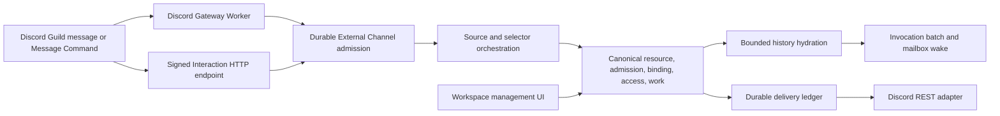

# Discord External Channel Slack Parity Design

- Snapshot: `discord-260728`
- Document reference: `discord-260728/DESIGN`
- Requirements: [Discord External Channel Slack Parity Requirements](../requirements/discord-260728-slack-parity.md) (`discord-260728/REQ`)
- ADR: [Discord External Channel Slack Parity ADR](../adr/discord-260728-slack-parity.md) (`discord-260728/ADR`)
- Prior design: [Discord Agent App Routing](discord-260726-agent-app-routing.md) (`discord-260726/DESIGN`)

## Scope

This design completes all P0, P1, and P2 Discord gaps identified by the Slack-first
parity audit. It preserves Slack as the semantic source of truth and uses provider-native
Discord mechanics only at ingress and presentation boundaries.

The work covers:

1. selected-message invocation, selector interactions, and command registration;
2. deterministic thread targeting, history hydration, approval, authorization release,
   Session link, Channel Work, progress, recovery, files, and lifecycle delivery;
3. Discord Multi App public API, generated clients, tRPC, Workspace management UI, and
   deterministic E2E evidence.

It does not change Slack behavior or replace the canonical External Channel domain.

## Traceability

| Requirement | ADR decisions | Design mechanism |
| --- | --- | --- |
| `discord-260728/REQ-1` | `ADR-D1`, `ADR-D2` | Discord message-command source projection, durable interaction claim, and shared shortcut source materialization |
| `discord-260728/REQ-2` | `ADR-D1`, `ADR-D2` | Discord selector components, signed scope metadata, and existing `ExternalChannelSelectorService` |
| `discord-260728/REQ-3` | `ADR-D1`, `ADR-D3` | Canonical Discord resource labels and route-resolved thread provisioning |
| `discord-260728/REQ-4` | `ADR-D1`, `ADR-D4` | Discord history page client and shared hydration reconciliation |
| `discord-260728/REQ-5` | `ADR-D1`, `ADR-D3`, `ADR-D5` | Provider-neutral activation intents and existing Discord projection-part lifecycle |
| `discord-260728/REQ-6` | `ADR-D1`, `ADR-D6` | Provider-correct management routes, regenerated clients, generic tRPC, and Workspace UI |
| `discord-260728/REQ-7` | `ADR-D1`, `ADR-D2`, `ADR-D3`, `ADR-D5` | Current fencing/redaction boundaries, Discord capability validation, and lifecycle cleanup |
| `discord-260728/REQ-8` | `ADR-D7` | Fake-provider interaction/thread/history evidence and deterministic participant/admin E2E journeys |

## Current behavior and exact gaps

### Reusable canonical state

The following current state and services remain authoritative and are reused without a
Discord-specific duplicate:

- `ExternalChannelConnection`, route catalog, channel defaults, and connection
  generation fences;
- `ExternalChannelResource`, canonical messages/revisions, pending context, and
  hydration state;
- conversation admissions, interactions, principals, grants, blocks, bindings,
  invocation batches, mailbox wake-up, and Session ownership;
- Channel Work, delivery attempts, durable outcomes, provider message identities, and
  `ExternalChannelWorkProjectionPart` page projection state;
- archive, disconnect, decommission, and cleanup delivery lifecycle boundaries.

### Slack-specific boundaries that currently block Discord parity

| Current path | Slack behavior | Required Discord completion |
| --- | --- | --- |
| `http_admission.py` and `interaction.py` | Claims a durable interaction and uses a transient trigger to open or submit a selector | `discord_http.py` must claim a durable interaction and return a request-local Discord selector/component response |
| `shortcut_source.py` | Materializes a selected Slack source message before selector processing | Generalize the durable source-materialization contract and add Discord Message Command source projection |
| `event_processor.py::_provider_thread_target` and Slack-only delivery helpers | Builds Slack thread payloads, Session links, and Activity Tracker intents | Build provider-specific targets through one provider-neutral target contract and enqueue Discord intents |
| `event_processor.py::_release_pending_context` | Creates initial Session link and Activity Tracker before wake | Remove the Discord early-return path and create equivalent Discord control/progress intents |
| `event_processor.py::_hydrate_resource` | Fetches Slack history pages and gates activation | Add Discord history pages and invoke the same reconciliation and activation barrier |
| `work.py` | Contains Discord page planning for later Channel Work actions | Connect initial activation, recovery, cleanup, and management projection paths to the existing page planner |
| `management_route.py`, generated clients, `externalChannel.ts`, `WorkspaceSlackApps*` | Exposes full Slack Multi App management | Expose the same provider-neutral operations through Discord API/client/UI paths |
| Discord tests and fake provider | Verifies callback ACK and Gateway checkpoint | Cover selector, thread, approval, release, progress, files, recovery, management, and browser journeys |

## Architecture



The Gateway Worker remains responsible only for leased Gateway protocol ownership and
durable message admission. The signed HTTP endpoint owns the immediate Discord
interaction response. Both use the same PostgreSQL-canonical External Channel domain.

## P0: Invocation, selector, and thread-scoped approval

### Discord interaction projection and response boundary

`discord_interaction.py` will expand its request-local envelope to retain only the facts
needed for one immediate response and durable routing:

- interaction ID, type, application ID, Guild ID, channel ID, authenticated actor ID;
- command type/name and selected target-message identity for a Message Command;
- component custom ID, selected values, and message/thread identity for selector
  navigation or submission;
- modal fields only when they belong to the selector contract.

It must not retain interaction tokens, signatures, raw bodies, raw resolved objects,
attachment URLs, credentials, or provider profile URLs in durable state.

`discord_http.py` will:

1. verify the selector-scoped request and connection authority;
2. create/reuse the canonical interaction and authenticated principal;
3. materialize a selected-message source when required, using the same route-neutral
   durable source-before-selection contract as Slack;
4. claim the interaction through `ExternalChannelAdmissionService` before emitting a
   provider response;
5. construct the immediate Discord response from request-local data; and
6. terminalize the interaction claim without attempting a replay of any transient
   response capability.

The public route returns the exact provider response object rather than mapping every
interaction to a generic deferred acknowledgement.

### Message Command parity

Discord activation will register and reconcile one Guild-scoped Message Command named
`Ask an Azents Agent`, matching the Slack selected-message capability. Activation stores
only non-secret command capability evidence required to diagnose configuration; incoming
interactions remain authoritative for the actual command identity and source.

A selected-message command projects the target source message into the event inbox or
an equivalent route-neutral materialization transaction. It uses the source message's
canonical Discord resource identity and does not create a route, binding, or Session
until normal Single/default/selector routing resolves it.

### Selector presentation and selection

Discord selector controls use a persistent thread message with a `Select Agent`
component. Clicking it returns an ephemeral selector response containing the current
page of routes, access state, search/navigation controls, and signed scope metadata.

The selector uses the existing durable `ExternalChannelConversationAdmission` and
`ExternalChannelSelectorService` contracts:

- an unsigned provider value never chooses a route;
- signed metadata binds connection, resource, admission, original interaction,
  principal, and page/search state;
- each navigation or selection rechecks connection health, app mode, route catalog,
  admission expiry, actor identity, and Workspace scope;
- route selection is immutable after the first successful selection;
- an approval-required route continues through the existing approval flow;
- an immediately authorized route continues through the existing invocation release
  and Session wake-up flow.

Discord select-menu option limits are handled by the same bounded page/search model as
Slack; the complete catalog is never silently omitted.

### Canonical Discord resource and delivery target

Discord resource labels are normalized to a versioned provider target with separate
identities:

```text
provider: "discord"
guild_id: <Guild ID>
source_channel_id: <channel containing the source message>
parent_channel_id: <parent channel for a thread, when applicable>
root_message_id: <root source message ID>
thread_channel_id: <existing or provisioned thread ID, when known>
delivery_channel_id: <thread channel used for all provider output, when known>
```

The canonical provider resource key is rooted in the Guild and root message identity,
not in a later reply message. Existing Discord thread messages resolve their root and
parent identities before lookup. This ensures one resource cannot split when Gateway
messages, Message Commands, and REST history observe the conversation in different
orders.

After a route resolves, the service:

1. reuses `thread_channel_id` when the source is already inside a thread;
2. otherwise uses `DiscordDeliveryClient.ensure_thread` with the parent channel and
   root message;
3. persists the returned thread identity under the normal resource lock; and
4. creates all control, reply, file, and progress delivery intents with
   `delivery_channel_id`.

An access request is not externally delivered until this target is available. Therefore
approval controls cannot be posted into the parent channel outside the conversation.

## P1: Context, authorization release, Session link, and Channel Work

### Discord history hydration

Add a Discord conversation-history client alongside the current attachment client. It
fetches bounded pages from the canonical delivery/history channel and projects only
message, author, thread, mention, attachment, and supported readable-content facts.

The adapter maps provider outcomes into the same controlled classes used by Slack:
credentials invalid, permission denied, not found, rate-limited, temporary,
provider-rejected, and malformed response. It does not retain current attachment URLs
or raw provider pages.

`ExternalChannelEventProcessorService._hydrate_resource` becomes provider-dispatched:

- Slack keeps `fetch_thread_page` behavior unchanged.
- Discord fetches history pages from newest boundary toward the retained cursor.
- Both adapters normalize pages through canonical message/revision persistence.
- Both update the same cursor/high-watermark/reconciliation boundary under the resource
  and connection lock order.
- Binding activation occurs only after the provider's bounded hydration terminal state
  covers correlated events through the persisted boundary.

### Provider-neutral initial activation intents

Replace Slack-only `_provider_thread_target`, `_activity_provider_target`,
`_render_persisted_activity`, `_attempt_activity_delivery`,
`_attempt_session_link_delivery`, and `_attempt_control_delivery` orchestration with
provider-dispatched builders and consumers.

The canonical flow stays unchanged:

1. retain eligible context;
2. create or reuse the immutable binding;
3. create or reuse the invocation batch and mailbox item;
4. ensure active Channel Work with the checking desired snapshot;
5. create one Session-link control intent on initial binding activation;
6. create one initial progress intent before Session wake-up;
7. commit all domain state;
8. wake the Session after commit; and
9. consume provider delivery attempts through the durable ledger.

For Discord, the Session link is a bounded thread message with the authenticated Azents
Session URL. The checking state and later work snapshots lower through
`render_discord_persisted_progress` and the existing
`ExternalChannelWorkProjectionPart` page planner.

### Progress, completion, and recovery

The design reuses the existing Discord projection-part behavior in `work.py`:

- each page has a stable ordinal and current provider message identity;
- changed pages update in place;
- new pages create in order;
- surplus pages delete in order;
- successful final reply gates tracker cleanup;
- confirmed delete/missing-message outcomes recreate only active desired pages;
- ambiguous outcomes remain `unknown` and are not blindly replayed.

Initial activation and provider deletion events must call the same page planner and
recovery path. The legacy single `progress_provider_message_key` remains Slack-specific
compatibility state; Discord page state is authoritative for Discord work projections.

### Reply and file delivery

Existing Discord reply splitting, deterministic nonces, multipart streaming, file
preflight, update, and delete primitives remain the delivery implementation. The only
change is that every payload receives the canonical thread delivery target established
above. Slack payload construction and limits remain unchanged.

## P2: Multi App management and Workspace UI

### Public API and generated clients

`management_route.py` will expose Discord counterparts for every Slack Multi App
operation:

- list and get connection;
- validate, update, impact preview, and disconnect;
- list/add/remove/re-enable routes and route impact;
- list/replace/clear channel defaults;
- load management handoff when applicable.

Handlers call the existing provider-neutral management service. Provider-specific setup
and update payloads continue to use Discord credentials/configuration; generic route,
default, impact, and disconnect payloads retain their current generation fences.

OpenAPI is regenerated after route changes. Python and TypeScript generated clients are
never hand-edited.

### tRPC and Workspace UI

`typescript/apps/azents-web/src/trpc/routers/externalChannel.ts` will replace
Slack-named generic operations with provider-aware operations or provider-neutral
wrappers that dispatch to the correct generated client endpoint. Setup/update continue
to use provider-specific credential schemas.

`WorkspaceSlackAppsPage`, `WorkspaceSlackApps`, and its container are renamed or
refactored into a provider-aware Workspace External Apps surface while preserving the
existing Slack layout and behavior. It shows Slack and Discord connections together or
through provider selection without hiding any Slack capability.

For Discord, the UI provides the same connection detail, validation, routes, channel
defaults, impact preview, destructive generation-fenced actions, and redacted
operational state as Slack.

## Lifecycle, security, and observability

- Gateway lease, configuration generation, app-claim generation, and session-aware
  checkpoint fences remain unchanged.
- Discord capability validation verifies only bounded safe evidence; operator-facing
  guidance identifies missing permissions/intents without showing tokens or raw API
  responses.
- Connection disconnect, Session archive, Agent decommission, and finalizer cleanup
  enqueue Discord progress/control deletes through existing durable lifecycle paths.
- Interaction token expiry and initial-response failure terminalize only the interaction
  claim; they never roll back durable source/admission state or trigger an unsafe replay.
- Discord provider exclusions and errors use Discord-specific safe labels rather than
  Slack labels.

## Persistence and migration impact

The current persistence graph already provides interaction projections, resource labels,
delivery payloads, work projection parts, delivery ordinals, and per-page Discord
progress state. The planned target and selector additions fit into existing structured
JSON fields and durable delivery rows.

No schema migration is planned unless implementation reveals that an existing persisted
field cannot distinguish root-message, existing-thread, and delivery-channel identities
without violating current data validation. If that occurs, the migration must be
additive, generated through Alembic, and include upgrade/downgrade plus migrated
PostgreSQL test coverage. It is not a product-contract decision.

## Failure handling

| Boundary | Required behavior |
| --- | --- |
| Invalid Discord interaction signature, selector, application, Guild, or component scope | Fail before durable provider mutation; do not expose request data |
| Duplicate interaction or selector submission | Reuse durable interaction/admission outcome; do not create a second binding or route selection |
| Initial interaction response cannot be sent | Terminalize the interaction claim safely; do not replay a transient token |
| Thread create ambiguity | Preserve durable intent and classify provider outcome according to existing nonce/unknown rules; never select another thread |
| History permission/credential loss | Mark connection/resource controlled unavailable or reconnect-required using current fences; do not activate incomplete context as successful |
| Rate limit or temporary history failure | Defer canonical event/hydration with bounded retry, without duplicate projection |
| Approval control or Session link failure | Preserve durable failed/unknown delivery evidence; approval decision remains canonical and reconciliation handles late control delivery |
| Progress page deletion/missing message | Recreate only active desired page state through projection-part recovery |
| Disconnect/archive/decommission | Commit terminal canonical state before one-attempt Discord cleanup delivery |

## Test strategy

### Focused backend tests

Add or extend tests for:

- Discord Message Command, component, select, and modal parsing with strict redaction;
- durable interaction claim, selector navigation, immutable selection, and transient
  response handling;
- selected-message source materialization and existing-binding behavior;
- root-message thread ensure, existing thread reuse, approval/session-link/progress
  target consistency, and ambiguous thread outcomes;
- Discord history page parsing, cursor/high-watermark updates, out-of-order event
  reconciliation, activation gating, and controlled provider failures;
- approval allow/deny/block/revocation release behavior;
- initial checking, multi-page create/update/delete, final reply cleanup, missing-page
  recovery, and lifecycle cleanup;
- Discord Multi route/default/impact/disconnect endpoints and provider-correct API
  operation names;
- generated-client contract tests where applicable;
- safe provider-specific logging and redaction.

### Deterministic E2E

Extend `discord_provider_fake.py` to provide safe evidence for:

- Guild Message Commands and component/select interactions;
- application command registration and interaction responses;
- source-message thread creation/reuse;
- paginated channel/thread history;
- create/update/delete/file message evidence and controlled failures;
- route/default management operations.

Add E2E journeys for:

1. selected-message command or mention -> selector -> approval -> allow -> one Session
   wake -> thread reply -> progress pages -> file -> completion cleanup;
2. already-authorized participant -> history hydration -> immediate activation ->
   continuation in the same thread;
3. deleted progress page -> active-work recovery;
4. Discord Multi management through generated public clients;
5. Workspace browser management for Discord with redacted credentials and
   generation-fenced destructive actions;
6. disconnect/credential failure/reconnect-required behavior without leaking secrets.

Docker-backed Testcontainers verification is available in the current runtime and must
be used for the deterministic E2E lanes.

## Living-spec updates after implementation

The implementation PR updates and re-verifies:

- `docs/azents/spec/domain/external-channel.md`;
- `docs/azents/spec/flow/external-channel-provider-ingress.md`;
- `docs/azents/spec/flow/external-channel-authorization.md`;
- `docs/azents/spec/flow/external-channel-delivery.md`; and
- `docs/azents/spec/flow/external-channel-lifecycle.md` when cleanup behavior changes.

The current specs contain Discord parity statements that are not fully realized by the
current adapter. Their `last_verified_at` and versions must advance only with matching
implementation and deterministic evidence.

## Feasibility validation

| Requirement | Result | Evidence |
| --- | --- | --- |
| `REQ-1` | Feasible | Current signed interaction admission, canonical interaction rows, Slack shortcut materialization, and selector service provide the needed durable boundary. |
| `REQ-2` | Feasible | Existing route catalog, selector service, admission state, and signed Slack selector metadata can be generalized to Discord components. |
| `REQ-3` | Feasible | Current `ensure_thread`, delivery payloads, resource labels, and thread-aware Discord normalization provide the necessary provider primitives. |
| `REQ-4` | Feasible | Existing hydration cursor/high-watermark/reconciliation state is provider-neutral; only Discord page retrieval and dispatcher extraction are missing. |
| `REQ-5` | Feasible | Existing Discord delivery, page renderer, projection-part planner, file transfer, and durable work lifecycle provide the target behavior; event processor wiring is missing. |
| `REQ-6` | Feasible | Management service is mostly provider-neutral; public route, OpenAPI, generated client, tRPC, and UI surfaces require expansion. |
| `REQ-7` | Feasible | Existing connection, Gateway, delivery, archive, and decommission fences apply directly; capability checks and labels need completion. |
| `REQ-8` | Feasible | Existing deterministic Discord fake and Testcontainers-backed E2E infrastructure can be extended to cover the complete journey. |

No requirement-level feasibility blocker remains.

## Implementation sequence

1. **Interaction and source vertical slice**: command registration, request-local
   response payloads, durable source materialization, selector components, route
   selection, and focused tests.
2. **Conversation vertical slice**: canonical thread target, approval control,
   hydration, authorization release, Session link, initial progress, and participant
   E2E.
3. **Work/lifecycle vertical slice**: full progress projection, recovery, final cleanup,
   archive/disconnect/decommission, files, and focused/E2E tests.
4. **Management vertical slice**: API, OpenAPI regeneration, generated clients, tRPC,
   Workspace UI, and browser E2E.
5. **QA/spec phase**: full backend/TypeScript/E2E validation, `/spec-review`, and
   living-spec verification updates.
