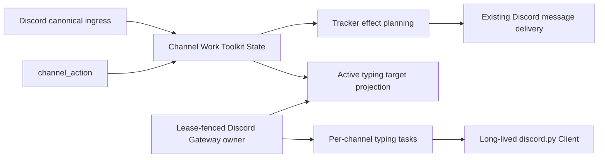

# Discord Quiet Work Presence Design

- Snapshot: `discord-260828`
- Document reference: `discord-260828/DESIGN`
- Requirements:
  [`discord-260828/REQ`](../requirements/discord-260828-quiet-work-presence.md)
- ADR: [`discord-260828/ADR`](../adr/discord-260828-quiet-work-presence.md)
- Mode: Collaborative

## Scope

This design replaces unconditional Discord conversational Activity Tracker visibility
with active-Work typing presence plus mention-gated Tracker visibility. It keeps the
existing External Channel admission, routing, Binding, Session, Work, progress,
provider-delivery, and continuation contracts.

Slack presentation and Scheduled Task-owned Discord Activity Trackers remain unchanged.
No public management API, Web surface, Agent-facing tool schema, response mode, or
provider credential contract changes.

## Current Behavior and Requirement Gaps

A new or reactivated conversational Work is created after canonical provider history
produces at least one new mailbox input. Both the direct mailbox ingestion path and the
batched ingress drain then call `ensure_active_work()` and
`prepare_initial_progress()`. The latter claims projection part zero and plans one
provider Activity Tracker without receiving the trigger's invocation classification.

Discord ingress already retains `invocation: bool` on the normalized trigger and active
queue item. Direct mentions and validated managed-Bot-role mentions set it to true;
unmentioned messages admitted through an existing all-messages Binding set it to
false. The invocation flag currently affects response-mode admission and settings
controls but not Work presentation.

`channel_action(continue)` independently renders the latest desired progress and plans
a create when no current projection part exists. Suppressing only the initial Tracker
would therefore allow a hidden Work to publish a Tracker on its first title or task
update.

The dedicated External Channel Gateway owns one lease-fenced long-lived
`discord.Client` per configured connection. It has no current Work-presentation loop.
The pinned `discord.py==2.7.1` exposes public `Messageable.typing()` support and public
partial messageable construction, but Discord exposes no explicit typing-stop
operation.

These gaps affect all confirmed Requirements:

- no typing presence is currently emitted for conversational Work;
- Tracker visibility is not mention-gated;
- late mention cannot promote a hidden Work;
- no Gateway restart reconciliation exists for typing; and
- current Work Toolkit State has no durable Tracker-visibility value.

## Traceability

| Requirement | ADR decisions | Design mechanisms |
| --- | --- | --- |
| `discord-260828/REQ-1` | D1 | M2, M4, M5 |
| `discord-260828/REQ-2` | D1 | M4, M5, M6 |
| `discord-260828/REQ-3` | D2 | M1, M2, M3, M7 |
| `discord-260828/REQ-4` | D2 | M1, M2, M3 |
| `discord-260828/REQ-5` | D1, D2 | M1, M4, M5, M7 |
| `discord-260828/REQ-6` | D1 | M5, M6 |

## Architecture



Canonical Work owns lifecycle and Tracker visibility. The Gateway runtime only projects
that state into ephemeral Discord typing tasks. Existing provider-effect execution
continues to own Tracker create, update, and delete mutations.

## Channel Work State

### Versioned visibility

Advance the binding-specific Channel Work Toolkit State from schema version 1 to
schema version 2 and add one required provider-neutral field:

```text
tracker_visibility = hidden | visible
```

The field describes whether the current Work cycle may have a provider Activity
Tracker. It is not a provider message status and does not replace `projection_parts`.

- A newly created Slack conversational Work is `visible`.
- A newly created Discord conversational Work is `visible` when the accepted trigger
  is an eligible invocation and `hidden` otherwise.
- A hidden active Work becomes `visible` when a later accepted trigger for the same
  cycle is an eligible invocation.
- Visibility never moves from `visible` to `hidden` within one cycle.
- A new cycle receives a new visibility value from its own activating trigger.
- Scheduled Task progress retains its separate state and presentation lifecycle.

The Work state validator requires the field in schema version 2. Runtime code does not
accept a missing-field fallback after migration.

### Visibility and desired progress

Desired progress remains canonical regardless of visibility. Hidden Work retains the
same checking state, title, tasks, revisions, continuation behavior, and management
projection as visible Work.

`projection_parts` remains empty while a hidden Work has never been visible. When
visibility is promoted, the existing initial-progress claim renders the Work's current
complete desired snapshot, claims the normal projection part, and plans one
`PROGRESS_CREATE`. This preserves existing at-most-once projection semantics.

A failed or ambiguous create retains the existing projection outcome and is not retried
because another mention arrives. Repeated and concurrent mentions therefore converge
on one projection claim rather than creating duplicate Trackers.

## Ingress and Tracker Lifecycle

### Work activation

Replace the separate ensure-and-initial-progress decisions with one repository-level
input acceptance operation that receives the required invocation value and performs a
bounded whole-state CAS:

1. create a new active cycle with visibility derived from the current trigger;
2. reactivate a finished cycle with a new identity and visibility derived from the
   current trigger;
3. retain an active cycle for ordinary input; or
4. promote an active hidden cycle when the current trigger is an invocation.

The operation returns the current Work plus whether the call established visibility.
Both the direct mailbox ingestion path and the batched ingress finalization path use the
same operation.

For a batch, visibility is requested when at least one newly created canonical mailbox
input is correlated to an ingress item whose provider-native invocation flag is true.
Context-only history and duplicate mailbox rows cannot promote visibility.

After the canonical transaction establishes or retains visible state, the existing
initial-progress planner may claim and create the Tracker when no projection part has
been claimed. Hidden state produces no Tracker plan.

### Channel actions

`channel_action(continue)` always commits accepted title, task, message, and desired
progress changes exactly as today. Progress provider effects are planned only when the
current Work is Tracker-visible. Hidden Work therefore accumulates the latest complete
canonical desired progress without provider mutation.

When a later mention promotes the Work, the Tracker create uses that latest desired
revision. Subsequent visible progress changes use the existing create/update/delete and
revision-fencing behavior.

`finish` and `ignore` finish Work regardless of visibility. A hidden Work has no
Tracker cleanup plan. A visible Work retains the existing final-reply and cleanup
rules. Neither mode needs a typing provider mutation because typing is reconciled from
canonical active Work.

## Typing Target Projection

Add a repository projection scoped to one currently leased Discord connection. It
returns the distinct current provider delivery channels that have at least one eligible
active conversational Channel Work.

The projection revalidates:

- current Discord connection and App claim authority;
- current Gateway lease owner and generation;
- active or degraded connection lifecycle;
- connected Binding and active Agent Session;
- available route and active Agent lifecycle;
- active Resource and its explicit Discord delivery target; and
- schema-version-2 Channel Work with `status=active`.

It does not require Tracker visibility. Hidden and visible Work both request typing.
It excludes Scheduled Task state, Slack connections, disconnected Bindings, finished
Work, and Resources without a valid current Discord delivery target.

The query starts from current connection Bindings and resolves their exact Toolkit State
identity. It does not scan transcript history or infer state from provider messages.
Results carry only connection, Guild, channel, Binding, Work-cycle, and lease-fence
identity required for reconciliation.

The Gateway registry groups targets by Discord channel and retains the contributing
Work-cycle identities. If more than one eligible Work maps to the same Bot/channel,
typing continues until the final contributing Work disappears.

## Gateway Typing Runtime

### Ownership

Under `discord-260828/ADR-D1`, the current lease-fenced Discord Gateway connection owner
runs typing reconciliation beside the SDK connection and lease-renewal lifecycle.
There is no second persistent Discord client, process, deployment, or credential owner.

Extend the explicit `DiscordGatewayRunner` boundary so the production runner can obtain
current typing targets while it owns the concrete `discord.Client`. The testenv runner
implements the same typed capability without accessing SDK private state.

The production runner uses `Client.get_partial_messageable()` and the public
`Messageable.typing()` capability. It may implement the refresh as an Azents-owned
bounded loop over the awaitable form rather than relying on the SDK context manager's
internal refresh task, allowing cancellation and provider failures to remain observable.
No direct Discord HTTP typing call is added.

### Reconciliation

The connection owner reconciles after the SDK becomes ready or resumes and then at a
bounded periodic interval shorter than Discord's indicator expiry:

1. load the current fenced active target set from PostgreSQL;
2. start one local typing task for each new channel target;
3. retain tasks whose target is still desired;
4. cancel and await tasks whose final active Work disappeared; and
5. cancel all tasks on lease loss, reconnect-required transition, client close, or
   process shutdown.

A process-local wake may request an earlier reconciliation after Work activation or
finish, but correctness and restart recovery do not depend on delivery of that wake.
Redis is not required.

Each channel task renews the indicator through the public SDK before the prior indicator
expires. Provider rate limits and bounded backoff remain connection-local presentation
concerns. The exact interval and backoff values are implementation details validated
against the pinned SDK and deterministic tests.

### Stop behavior

Discord provides no explicit stop request. Removing a target cancels future renewal.
The provider may retain the current indicator until expiry. A normal final reply may
visually supersede it, but Azents does not treat that as a correctness guarantee.

## Migration, Rollout, and Rollback

Create a new Alembic revision through `alembic revision`. The upgrade updates only
Toolkit State rows whose namespace is `external_channel`, state name begins with
`channel_work:`, and schema version is 1:

- add `tracker_visibility: visible` to `state_json`;
- set the inner `schema_version` to 2; and
- set the row `schema_version` column to 2.

This implements `discord-260828/ADR-D2`: every pre-deployment cycle remains
Tracker-visible, retained projection state is unchanged, and no provider create,
update, or delete occurs during migration. Newly created cycles use the new invocation
rule after the application deploys.

The migration validates the expected bounded Work shape and fails rather than silently
rewriting unrelated Toolkit State. Migration tests cover active, finished, projected,
missing-projection, Slack-bound, and unrelated Toolkit State rows.

Deployment order is migration first, then application and Gateway rollout. A new
Gateway may immediately restore typing for pre-existing active Discord Work.

Downgrade removes the visibility field and returns matching rows to schema version 1.
Old application behavior then treats conversational Work as unconditionally
Tracker-visible. Downgrade does not delete provider messages or attempt to preserve the
new hidden behavior under old code.

## Failure and Recovery

- **Agent Worker restart:** Work status and visibility remain in Toolkit State; the
  Gateway typing owner is independent and continues or restores presentation.
- **Gateway Worker restart:** local tasks disappear; the new lease owner reconnects,
  reloads active targets, and restores typing.
- **Gateway unavailable during finish:** canonical Work finishes; reconnect finds no
  target and does not resume typing.
- **Gateway unavailable during late mention:** visibility promotion and desired progress
  commit; the normal Tracker effect follows existing one-attempt semantics, while
  typing resumes after reconnect if Work is still active.
- **Typing permission or transport failure:** record bounded diagnostics and retry only
  through the typing runtime's presentation policy. Do not mutate connection, Work,
  Tracker, mailbox, or Agent execution state.
- **Lease loss:** cancel typing tasks before releasing the concrete SDK connection. A
  stale owner cannot reconcile or renew a newer owner's targets.
- **Tracker create ambiguity:** preserve the existing projection status and do not use
  typing state or repeated mention as replay authority.
- **State conflict:** bounded CAS retries converge visibility promotion and progress
  changes without losing the latest complete desired snapshot.

## Security and Privacy

Typing target projection contains no participant message content, provider token,
attachment URL, or raw event payload. The Gateway owner already holds the connection's
decrypted Bot credential for its fenced SDK lifecycle; this design does not distribute
it to another process.

Structured logs and metrics identify only bounded connection, Binding, Work-cycle,
channel, operation category, and sanitized failure classification. They do not expose
credentials, message bodies, participant display names, or Discord response bodies.

## Observability

Add bounded Gateway metrics for:

- desired and running typing-channel counts;
- reconciliation runs and target additions/removals;
- typing renewal attempts, confirmed failures, and ambiguous failures;
- time from ready/resumed lifecycle to first successful reconciliation;
- task cancellation on finish, lease loss, reconnect, and shutdown; and
- schema or target-projection validation failures.

Operator logs distinguish target projection failure from provider typing failure.
Neither condition is reported as successful provider delivery or as canonical Work
failure.

## Test Strategy

### E2E primary verification matrix

Required credential-free Discord provider-fake E2E covers:

1. an unmentioned all-messages input creates active Work, records typing evidence, and
   creates no Activity Tracker even after a task-bearing `channel_action continue`;
2. a later explicit mention in the same active cycle creates exactly one Tracker with
   the latest title and ordered tasks while typing remains active;
3. an explicit mention starting a new cycle produces typing plus the normal Tracker;
4. finish and ignore remove the target so no later renewal is observed after the
   provider expiry window;
5. Gateway disconnect/reconnect restores typing for active Work and does not restore it
   for Work finished during the gap; and
6. Slack and Scheduled Task Tracker journeys retain their existing evidence.

The Discord provider fake gains bounded typing-pulse evidence and controllable
confirmed, ambiguous, and temporary failure outcomes. It records channel, Guild,
sequence, and sanitized outcome only. It never receives the real Bot credential.

The required E2E suite uses existing fixture setup, public External Channel APIs,
Gateway dispatch injection, deterministic model/tool output, and provider evidence. It
requires no live Discord credential or new external prerequisite snapshot. Optional
live Discord verification may confirm visual indicator behavior but cannot replace the
deterministic required suite.

### Focused backend verification

- Work-state tests cover schema validation, hidden creation, visible creation, monotonic
  promotion, new-cycle reset, and concurrent promotion/progress CAS behavior.
- Repository and service tests cover direct and batched ingress, duplicate mailbox
  input, hidden `channel_action` progress, late create, and existing at-most-once
  projection outcomes.
- Gateway tests use explicit events rather than fixed sleeps to verify target
  reconciliation, shared-channel reference behavior, renewal, cancellation, lease
  loss, reconnect, and shutdown.
- Migration tests prove every version-1 Channel Work becomes version 2 and visible
  while unrelated Toolkit State and retained projection payloads remain unchanged.
- Static SDK-boundary tests permit only public typing APIs and reject a new direct
  Discord typing transport.

### CI policy and evidence

Backend unit, migration, Ruff, `ty`, and required public E2E checks run in CI. E2E
failure evidence includes sanitized provider typing and delivery sequences, active Work
projection, Gateway lifecycle events, and JUnit output. Missing credential-free fake
support is a test failure rather than a skip. Optional live visual checks may skip only
when their explicit external prerequisite is absent.

## Design Authority

- Design revision: `1`

| ID | Material design mechanism | Authority | Classification |
| --- | --- | --- | --- |
| M1 | Versioned cycle-scoped Tracker visibility in canonical Channel Work | `discord-260828/REQ-3`, `discord-260828/REQ-4`, `discord-260828/REQ-5`, existing Channel Work ownership | `derived` |
| M2 | Invocation-aware Work activation and monotonic late-mention promotion in both ingress paths | `discord-260828/REQ-1`, `discord-260828/REQ-3`, `discord-260828/REQ-4` | `required` |
| M3 | Hidden Work retains canonical progress while all Tracker provider effects remain gated | `discord-260828/REQ-3`, `discord-260828/REQ-4`, existing complete-snapshot progress contract | `derived` |
| M4 | Active typing targets are derived from current fenced Discord Binding, Resource, and active Work without separate durable typing state | `discord-260828/REQ-1`, `discord-260828/REQ-2`, `discord-260828/REQ-5`, PostgreSQL/Redis constraints | `derived` |
| M5 | Existing Discord Gateway connection owner reconciles public-SDK typing tasks | `discord-260828/ADR-D1`, `discord-260828/REQ-5` | `decided` |
| M6 | Typing failure and expiry remain isolated best-effort presentation behavior | `discord-260828/REQ-2`, `discord-260828/REQ-6`, Discord provider constraint | `required` |
| M7 | Forward migration grandfathers every existing Work cycle as visible with no provider cleanup | `discord-260828/ADR-D2`, `discord-260828/REQ-5` | `decided` |
| M8 | Credential-free provider-fake E2E verifies typing, mention gating, finish, and restart recovery | `discord-260828/REQ-1` through `discord-260828/REQ-6`, project E2E-first constraint | `derived` |

## Authority Audit

- Every Requirement maps to at least one material mechanism and deterministic
  verification path.
- Tracker visibility is owned only by Channel Work; projection parts remain provider
  observation and typing tasks remain ephemeral presentation.
- Gateway ownership follows accepted D1 and does not create a second credential,
  process, or lease authority.
- Existing-state migration follows accepted D2 and introduces no historical
  classification authority.
- Slack, Scheduled Task, routing, authorization, Session, Binding, tool schema, and
  public API behavior remain under unchanged current Specs.
- Exact intervals, helper boundaries, query layout, and fixture composition remain
  local reversible implementation choices.

Authority result: **pass** for Design revision 1 and authority IDs M1-M8.

## Feasibility Validation

- **REQ-1 — feasible:** Discord ingress already supplies exact invocation evidence and
  both Work-activation paths are explicit. Current Resources retain the delivery target
  before Binding and Work activation.
- **REQ-2 — feasible:** Work has explicit active/finished lifecycle and the Gateway
  already owns a cancellable per-connection lease/client task.
- **REQ-3 — feasible:** Current progress creation is centralized in initial-progress and
  `channel_action` planning, so both can be gated by one canonical value.
- **REQ-4 — feasible:** Work retains the latest complete desired snapshot and CAS state;
  promotion can claim the existing projection boundary once.
- **REQ-5 — feasible:** Toolkit State and Gateway leases are PostgreSQL-backed. The
  Gateway manager already polls, reconnects, and reconstructs per-connection tasks.
- **REQ-6 — feasible:** Typing tasks can be isolated from event callback failure and
  canonical provider effects, with sanitized diagnostics and bounded retry.
- **D1 — feasible:** pinned `discord.py==2.7.1` provides public partial messageables and
  public awaitable/context-managed typing on the existing Client.
- **D2 — feasible:** prior migrations already transform versioned Channel Work JSON;
  the current Toolkit State table stores both row and inner schema versions.
- **Verification — feasible:** the Discord provider fake already models Gateway and REST
  evidence and can add a typed, credential-free typing operation.

Feasibility result: **feasible**, with no unresolved blocker for M1-M8.

## Removal and Replacement

| Existing unit or behavior | Removal authority | Replacement or remaining authority | Removal boundary | Absence verification |
| --- | --- | --- | --- | --- |
| Unconditional Discord initial Tracker planning for every conversational Work | `discord-260828/REQ-3` | M1-M3 | Direct and batched ingress Work activation | Tests prove non-mention Work has no progress create plan |
| `channel_action` creating Discord progress when a hidden Work has no projection | `discord-260828/REQ-3` | M3 | Work transition effect planning | Hidden task/title update test has no progress effect |
| Channel Work Toolkit State schema version 1 | `discord-260828/ADR-D2` | M1, M7 | Forward migration and strict version-2 decoder | Migration and repository search prove no runtime v1 fallback |
| Absence of a Discord typing lifecycle in the Gateway runtime | `discord-260828/REQ-1`, `discord-260828/REQ-2`, `discord-260828/REQ-5` | M4-M6 | Gateway runner/manager connection lifecycle | Gateway tests prove start, reconcile, cancel, and restart |
| Existing Slack and Scheduled Task Tracker behavior | None; behavior is retained | Confirmed Requirements non-goals and current Specs | No removal | Regression E2E retains existing provider evidence |
| Public APIs, generated clients, Web configuration, and Agent tool schema | None; no change required | Current Specs | No removal | OpenAPI/client/UI diff remains absent |

## Non-Blocking Risks

- A bounded reconciliation interval creates a short delay between canonical Work change
  and typing start or final renewal cancellation.
- Discord may display a final indicator until provider expiry.
- A very large number of simultaneous active channels on one App increases periodic
  typing calls; rate-limit evidence and metrics must validate the selected interval.
- Provider typing permission failures can make the lightweight presence unavailable
  while ordinary message delivery remains independently classified.

## Design Approval

- Mode: `Collaborative`
- Decision owner: Requester
- Approved on: `2026-08-28`
- Approved Design revision: `1`
- Approved authority IDs: `M1`, `M2`, `M3`, `M4`, `M5`, `M6`, `M7`, `M8`
- Approved scope: Mention-gated Discord conversational Activity Trackers, active-Work
  typing owned by the existing Discord Gateway connection runtime, grandfathered
  rollout for existing Work cycles, restart recovery, failure isolation, and
  credential-free E2E verification.
