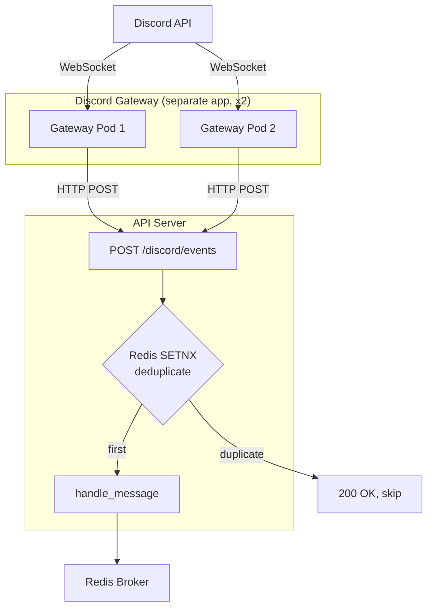
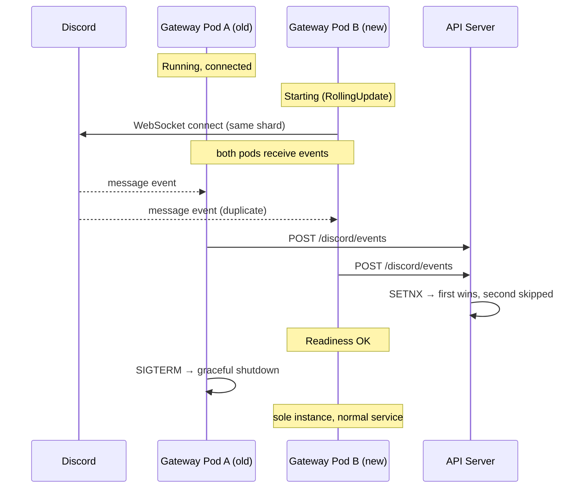

# Discord Gateway HA Design

## Overview

Separate Discord Gateway into ultra-light HTTP callback pattern to achieve zero-downtime deploy and HA.

### Motivation

Current Discord Gateway problems:

1. **Message loss during deploy**: replicas=1 + Recreate → 10-30s loss
2. **Unnecessary redeploy**: same image as nointern-server → Gateway restarts even when only worker code changes
3. **Heavy dependencies**: depends on entire nointern stack such as broker, DB, session service → slow start
4. **Single point of failure**: 1 pod → complete outage on crash

### Core idea

Apply Slack Events API pattern:

```
Current:
Discord WebSocket → Gateway (broker, DB, session dependency) → Redis Broker

Changed:
Discord WebSocket → Gateway (ultra-light: discord.py + httpx) → HTTP POST → API Server → Redis Broker
```

Gateway is responsible only for **event receive + HTTP delivery**. API server handles session resolve, history collection, and broker delivery.

### Change Summary

| | Current | HA |
|---|---|---|
| Gateway role | event receive + session resolve + history collection + broker delivery | event receive + HTTP POST |
| Dependencies | discord.py, broker, DB, session service, ... | discord.py, httpx |
| Image | nointern-server (shared) | separate light image |
| Deploy | with nointern-server (dozens per day) | only when Gateway code changes |
| replicas | 1 | 2 |
| strategy | Recreate | RollingUpdate |
| loss during deploy | 10-30s | 0 |
| duplicate prevention | none | Redis deduplicate in API server |
| Health probe | none | Liveness + Readiness |

## Discussion Points and Decisions

### 1. Deploy separation scope

**Decision: ultra-light HTTP callback pattern, separate Python app + separate image**

**Options:**
- A) separate only ArgoCD App (shared image) — image tag management complex
- B) separate image + separate ArgoCD App — dependency sync needed
- **C) separate Python app + HTTP callback pattern** — adopted

**Rationale:** If Gateway only does HTTP POST, nointern code dependency disappears. Since only discord.py + httpx are needed, a fully independent app is realistic. Architecture consistency is also achieved with same pattern as Slack Events API.

### 2. Duplicate event prevention

**Decision: Redis deduplicate in API server**

**Options:**
- A) Redis deduplicate in Gateway — adds Redis dependency to Gateway (conflicts with ultra-light goal)
- **B) deduplicate in API server** — adopted
- C) Gateway in-memory + API server mix — unnecessary complexity

**Rationale:** Keep Gateway as simple as possible. API server already has Redis, so adding deduplicate logic there is natural. Same pattern as Slack Events API where "server handles duplicates".

```python
# In API server:
async def handle_discord_event(request: DiscordEventRequest) -> None:
    key = f"nointern:discord:event:{request.event_id}"
    if not await redis.set(key, "1", nx=True, ex=60):
        return  # event already delivered by another Gateway pod
    # existing handler logic...
```

### 3. Callback API endpoint

**Decision: single endpoint `POST /discord/events`**

**Options:**
- **A) single endpoint + branch by body type** — adopted (Slack Events API pattern)
- B) per-event endpoints — unnecessary fragmentation
- C) pass raw event — payload size problem

**Rationale:** There are only 3-4 event types (message, interaction, reaction), so single endpoint is enough. Authentication uses K8s NetworkPolicy + shared secret (HMAC).

### 4. Health Probe + Graceful Shutdown

**Decision: aiohttp health server (Worker pattern)**

- Liveness (`/healthz`): event loop responsiveness
- Readiness (`/readyz`): `discord.py client.is_ready()`
- Graceful shutdown: readiness fail → wait 10s → close

### 5. Infra

**Decision: replicas=2, RollingUpdate, PDB minAvailable=1**

Ultra-light, so resources are small (CPU 100m, Memory 128Mi, ~$5/month spot).

## Architecture

### Overall Structure



### Deploy Flow (Zero-Downtime)



## Gateway Implementation

### App Structure

```
python/apps/nointern-discord-gateway/
├── pyproject.toml          # only discord.py, httpx, aiohttp
├── src/
│   └── discord_gateway/
│       ├── __init__.py
│       ├── main.py         # entrypoint
│       ├── client.py       # Discord Client + event handler
│       ├── callback.py     # HTTP POST delivery
│       └── health.py       # Health server
└── Dockerfile              # light image
```

### Event Handler

```python
# client.py — deliver Discord events by HTTP POST

class GatewayClient:
    def __init__(self, callback_url: str, secret: str):
        self._callback_url = callback_url
        self._secret = secret
        self._http = httpx.AsyncClient()

    async def on_message(self, message: discord.Message) -> None:
        """Deliver message event to API server."""
        if message.author.bot:
            return
        await self._post_event(
            event_type="message",
            event_id=f"msg:{message.id}",
            payload={
                "guild_id": str(message.guild.id) if message.guild else None,
                "channel_id": str(message.channel.id),
                "thread_id": str(message.channel.id) if isinstance(message.channel, discord.Thread) else None,
                "author_id": str(message.author.id),
                "author_name": str(message.author.display_name),
                "content": message.content,
                "message_id": str(message.id),
                "attachments": [
                    {"filename": a.filename, "url": a.url, "size": a.size, "content_type": a.content_type}
                    for a in message.attachments
                ],
            },
        )

    async def on_interaction(self, interaction: discord.Interaction) -> None:
        """Deliver interaction event to API server."""
        await self._post_event(
            event_type="interaction",
            event_id=f"int:{interaction.id}",
            payload={
                "guild_id": str(interaction.guild_id) if interaction.guild_id else None,
                "channel_id": str(interaction.channel_id),
                "user_id": str(interaction.user.id),
                "custom_id": interaction.data.get("custom_id") if interaction.data else None,
                "interaction_id": str(interaction.id),
                "interaction_token": interaction.token,
                "type": interaction.type.value,
            },
        )

    async def _post_event(self, event_type: str, event_id: str, payload: dict) -> None:
        """Deliver event to API server by HTTP POST."""
        body = {
            "type": event_type,
            "event_id": event_id,
            "payload": payload,
        }
        signature = hmac.new(self._secret.encode(), json.dumps(body).encode(), hashlib.sha256).hexdigest()
        try:
            resp = await self._http.post(
                self._callback_url,
                json=body,
                headers={"X-Discord-Gateway-Signature": signature},
                timeout=10.0,
            )
            resp.raise_for_status()
        except httpx.HTTPError:
            logger.exception("Failed to post event to API server",
                extra={"event_type": event_type, "event_id": event_id})
```

### Dockerfile

```dockerfile
FROM python:3.14-slim

RUN pip install --no-cache-dir discord.py httpx aiohttp

COPY src/ /app/src/
WORKDIR /app

CMD ["python", "-m", "discord_gateway.main"]
```

## API Server Changes

### Endpoint Structure

Create new `api/internal/` directory following existing nointern API pattern (`api/public/`, `api/admin/`).

```
api/
├── public/           # existing: external clients
│   ├── slack/v1/     # Slack Events API (reference pattern)
│   └── discord/v1/   # new: Discord Gateway callback + Interactions
│       ├── __init__.py   # router + mount()
│       └── data.py       # Pydantic schema
└── admin/            # existing: admin
```

### Authentication: two paths

| Path | Auth method | Header |
|------|-----------|------|
| Gateway → API Server (message) | HMAC-SHA256 shared secret | `X-Discord-Gateway-Signature` |
| Discord → API Server (interaction) | Ed25519 (Discord official) | `X-Signature-Ed25519` + `X-Signature-Timestamp` |

**Path 1: Gateway HMAC signature**

Gateway signs request body with HMAC-SHA256, and API server verifies it.

```python
# Gateway side (callback.py)
import hashlib
import hmac as hmac_mod

body_bytes = json.dumps(body, separators=(",", ":")).encode()
signature = hmac_mod.new(
    self._secret.encode(), body_bytes, hashlib.sha256
).hexdigest()
headers = {"X-Discord-Gateway-Signature": signature}
```

```python
# API server side (core/auth/discord_gateway.py)
from fastapi import Depends, HTTPException, Request

async def verify_gateway_signature(
    request: Request,
    config: Annotated[Config, Depends(get_config)],
) -> None:
    """Verify Gateway HMAC signature."""
    signature = request.headers.get("X-Discord-Gateway-Signature")
    if not signature:
        raise HTTPException(401, "Missing signature")
    body = await request.body()
    expected = hmac_mod.new(
        config.discord_gateway_secret.encode(), body, hashlib.sha256
    ).hexdigest()
    if not hmac_mod.compare_digest(signature, expected):
        raise HTTPException(401, "Invalid signature")
```

**Path 2: Discord Interactions Ed25519 signature**

Verify with official `discord-interactions` package.

```python
# API server side (core/auth/discord_interactions.py)
from discord_interactions import verify_key

async def verify_discord_interaction(
    request: Request,
    config: Annotated[Config, Depends(get_config)],
) -> None:
    """Verify Discord Interaction signature."""
    signature = request.headers.get("X-Signature-Ed25519", "")
    timestamp = request.headers.get("X-Signature-Timestamp", "")
    body = await request.body()
    if not verify_key(body, signature, timestamp, config.discord_public_key):
        raise HTTPException(401, "Invalid interaction signature")
```

### Endpoint Definition

```python
# api/public/discord/v1/__init__.py — added to apiserver deployment

router = APIRouter(prefix="/discord/v1")

@router.post("/events")
async def handle_gateway_event(
    request: Request,
    _auth: Annotated[None, Depends(verify_gateway_signature)],
    body: GatewayEventRequest,
    redis: Annotated[Redis, Depends(get_redis)],
    discord_event_service: Annotated[DiscordEventService, Depends(get_discord_event_service)],
) -> GatewayEventResponse:
    """Handle Discord message event delivered from Gateway."""
    # Deduplicate
    key = f"nointern:discord:event:{body.event_id}"
    if not await redis.set(key, "1", nx=True, ex=60):
        return GatewayEventResponse(status="duplicate")

    await discord_event_service.handle_message(body)
    return GatewayEventResponse(status="ok")


@router.post("/interactions")
async def handle_discord_interaction(
    request: Request,
    _auth: Annotated[None, Depends(verify_discord_interaction)],
    body: dict,  # Discord raw interaction payload
    discord_event_service: Annotated[DiscordEventService, Depends(get_discord_event_service)],
) -> Response:
    """Discord Interactions Endpoint — handle slash command, button, select."""
    # PING handling (Discord endpoint verification)
    if body.get("type") == 1:
        return JSONResponse({"type": 1})

    await discord_event_service.handle_interaction(body)
    return JSONResponse({"type": 5})  # DEFERRED_CHANNEL_MESSAGE_WITH_SOURCE
```

### Pydantic Schema

```python
# api/public/discord/v1/data.py

class GatewayEventPayload(BaseModel):
    """Discord message event payload delivered by Gateway."""
    guild_id: str | None = None
    channel_id: str
    thread_id: str | None = None
    parent_id: str | None = None  # parent channel ID of thread
    author_id: str
    author_name: str
    content: str
    message_id: str
    is_dm: bool = False
    bot_mentioned: bool = False  # mention check completed in Gateway
    attachments: list[AttachmentPayload] = Field(default_factory=list)

class AttachmentPayload(BaseModel):
    """Discord attachment."""
    filename: str
    url: str
    size: int
    content_type: str | None = None

class GatewayEventRequest(BaseModel):
    """Gateway → API Server event request."""
    type: str  # "message"
    event_id: str  # "msg:{message_id}"
    payload: GatewayEventPayload

class GatewayEventResponse(BaseModel):
    """Gateway event handling response."""
    status: str  # "ok" | "duplicate"
```

### Config Addition

```python
# core/config.py
discord_gateway_secret: str = ""  # HMAC shared secret (env var: NI_DISCORD_GATEWAY_SECRET)
discord_public_key: str = ""      # Discord Application Public Key (env var: NI_DISCORD_PUBLIC_KEY)
```

### Reuse Existing Logic

Current `services/discord/handlers.py` `handle_message()` directly receives discord.py object. Create new `DiscordEventService` and map `GatewayEventPayload` → existing handler logic. Discord REST API calls (thread creation, history collection, DM send) use extended existing `DiscordRESTClient`.

## Infrastructure

### Gateway Deployment

```yaml
apiVersion: apps/v1
kind: Deployment
metadata:
  name: discord-gateway
  labels:
    app.kubernetes.io/name: nointern-discord-gateway
spec:
  replicas: 2
  strategy:
    type: RollingUpdate
    rollingUpdate:
      maxSurge: 1
      maxUnavailable: 0
  template:
    spec:
      terminationGracePeriodSeconds: 30
      containers:
        - name: gateway
          image: nointern-discord-gateway:latest
          env:
            - name: DISCORD_BOT_TOKEN
              valueFrom:
                secretKeyRef: ...
            - name: CALLBACK_URL
              value: "http://nointern-server-apiserver:8010/discord/events"
            - name: CALLBACK_SECRET
              valueFrom:
                secretKeyRef: ...
          ports:
            - containerPort: 8013
              name: health
          livenessProbe:
            httpGet:
              path: /healthz
              port: 8013
            initialDelaySeconds: 10
            periodSeconds: 15
          readinessProbe:
            httpGet:
              path: /readyz
              port: 8013
            initialDelaySeconds: 5
            periodSeconds: 10
          resources:
            requests: { cpu: 100m, memory: 128Mi }
            limits: { cpu: 250m, memory: 256Mi }
```

### PDB

```yaml
apiVersion: policy/v1
kind: PodDisruptionBudget
metadata:
  name: discord-gateway
spec:
  minAvailable: 1
  selector:
    matchLabels:
      app.kubernetes.io/name: nointern-discord-gateway
```

## Cost

| Item | Cost |
|------|------|
| 2 Gateway Pods (CPU 100m, Mem 128Mi, spot) | ~$5/month |
| Redis deduplicate keys (TTL 60s) | ~0 |
| **Total** | **~$5/month** |

## Migration Plan

### Phase 1: Add callback endpoint to API server
- `POST /discord/events` endpoint
- Redis deduplicate logic
- adapter from existing handler logic to payload dict based input
- can run in parallel with existing Gateway (only callback endpoint added, not called yet)

### Phase 2: Implement ultra-light Gateway app
- new app `python/apps/nointern-discord-gateway/`
- discord.py + httpx + aiohttp (health)
- Dockerfile + CI build
- local test

### Phase 3: Infra + switch
- separate ArgoCD App
- K8s Deployment + PDB
- remove existing Gateway
- move Slash command registration logic (on_ready → API server startup or separate job)

## Risks

| Risk | Probability | Impact | Mitigation |
|--------|------|------|------|
| Callback failure when API server is down | low | event loss | retry in Gateway (3 times, exponential backoff) |
| discord.py multi-connection problem | low | connection failure | official Discord support confirmed |
| Slash command registration migration | medium | commands not registered | handle as separate job in Phase 3 |
| Missing features during handler migration | medium | event unhandled | verify with E2E tests |

## Alternatives Considered

| Alternative | Rejection reason |
|------|-----------|
| Same image + separate only ArgoCD App | image tag management complex, unnecessary dependencies remain in Gateway |
| Redis deduplicate in Gateway | conflicts with ultra-light goal (adds Redis dependency) |
| Leader election | failover complex, does not remove single point of failure |
| Session resume (Redis stored) | 30s limit unstable, duplicate connection can cover it |
| etcd based (discord-ha) | additional infra dependency |
| Sharding | guild count too low, unnecessary complexity |
| BYOA support | impossible due to Discord Gateway WebSocket constraints (connection required per token) |
