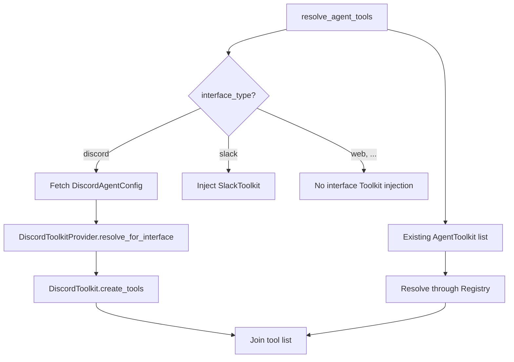
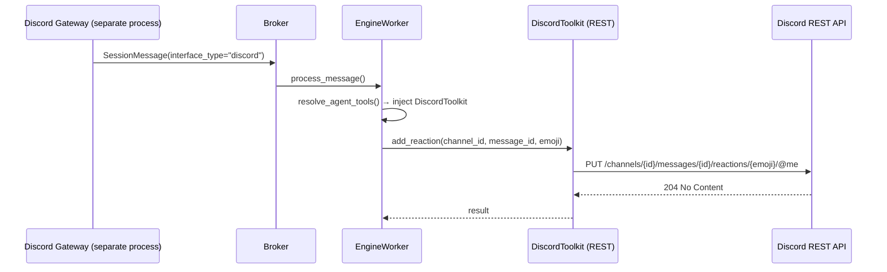
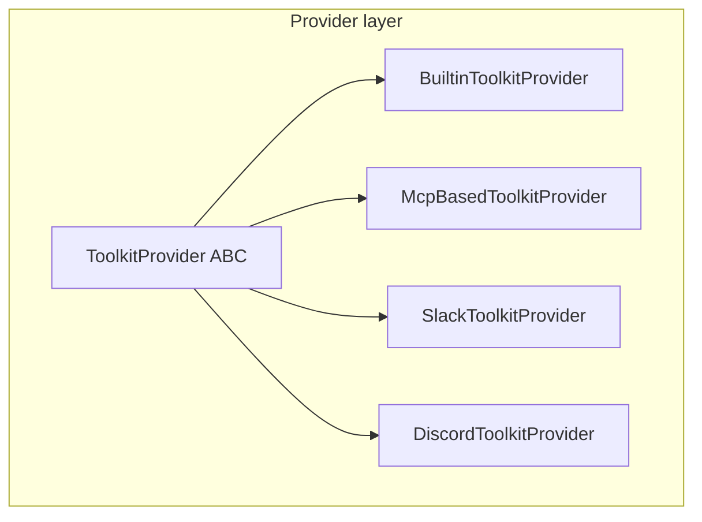
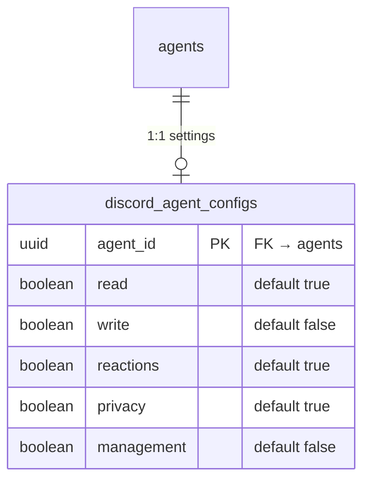
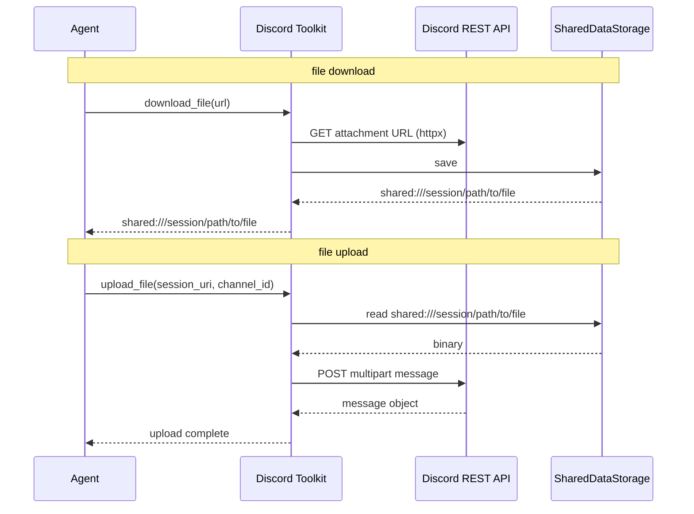
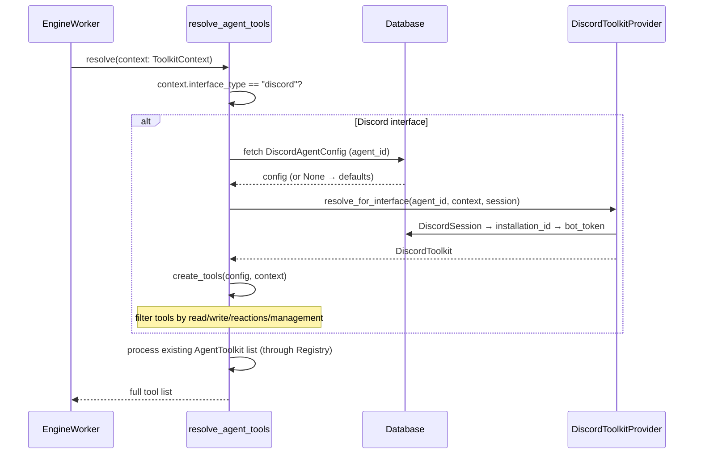

# Discord Toolkit Design

## Overview

Discord API Toolkit automatically bound to agents operating in Discord interface. It provides channel history lookup, message send, reaction, file handling, thread management, etc. as agent tools based on REST API.

### Background

- After Slack Toolkit (Phase 1/2) implementation, extend same pattern to Discord.
- Agents operating in Discord had no Discord tools, so active API usage was impossible.
- Use same automatic binding mechanism as Slack Toolkit.

### Differences from Slack Toolkit

| Item | Slack | Discord |
|------|-------|---------|
| API client | `AsyncWebClient` (REST) | direct httpx REST call |
| Thread model | `(channel_id, thread_ts)` pair | single `thread_id` identifier (thread = independent channel) |
| Emoji format | shortcode (`thumbsup`) | Unicode (`👍`) or custom (`<:name:id>`) |
| File identifier | `file_id` | attachment URL |
| Message length | ~40,000 chars | 2,000 chars (auto split) |
| Dedicated tools | none | `edit_message`, `create_thread`, `list_guild_emojis`, `pin_message` |

## Architecture

### Automatic Binding — Interface-dependent Toolkit

Same automatic binding mechanism as Slack Toolkit. Automatically inject when `interface_type == "discord"`.



### REST-only Client

Discord Gateway (`discord.Client`) runs in separate process (`cli/discord_gateway.py`). Worker process cannot access Gateway, so implement with **direct httpx-based REST API calls**.



- Bot token: `DiscordInstallation.bot_token` (reuse existing table)
- Rate limit: automatic wait based on `X-RateLimit-*` headers in httpx response

### ToolkitProvider Structure



## Data Model

### Bot Token

Reuse bot token from existing `discord_installations` table. Add additional scopes in app settings if needed.

### Settings Table

`discord_agent_configs` — per-agent Discord Toolkit settings. 1:1 relation with agent_id.



- If row is absent, use defaults (read ON, reactions ON, write OFF, privacy ON, management OFF).
- If read/write/reactions/management are all OFF, tool count is 0 → Toolkit itself is not bound.
- `management`: includes `edit_message`, `create_thread`, `pin_message`, `list_guild_emojis`.

### ToolkitType Extension

```python
class ToolkitType(enum.StrEnum):
    SHELL = "shell"
    MCP = "mcp"
    SLACK = "slack"
    DISCORD = "discord"  # add
```

## Feature Categories

| Category | Default | Tools | Required permission (Discord Permission) |
|---------|------|------|-------------------------------|
| **Read** | ON | `list_channels`, `read_channel_history`, `read_thread`, `get_user_info`, `download_file` | `View Channel`, `Read Message History` |
| **Reactions** | ON | `add_reaction`, `remove_reaction` | `Read Message History`, `Add Reactions` |
| **Write** | OFF | `send_message`, `reply_to_thread`, `upload_file` | `Send Messages`, `Attach Files` |
| **Management** | OFF | `edit_message`, `create_thread`, `pin_message`, `list_guild_emojis` | `Manage Messages` (pin), `Create Public Threads` |

## Tool Details

### Read Tools (5)

#### list_channels

Returns list of guild text channels.

| Parameter | Type | Description |
|---------|------|------|
| (none) | | Discord returns all channels at once |

- API: `GET /guilds/{guild_id}/channels`
- Return: filter only `TextChannel` (exclude Voice/Stage/Category)

#### read_channel_history

Reads recent messages from channel.

| Parameter | Type | Description |
|---------|------|------|
| `channel_id` | str | channel ID |
| `limit` | int | default 10, max 100 |
| `before` | str (optional) | before this message ID |
| `after` | str (optional) | after this message ID |

- API: `GET /channels/{channel_id}/messages`

#### read_thread

Reads messages from thread.

| Parameter | Type | Description |
|---------|------|------|
| `thread_id` | str | thread ID (Discord thread = independent channel) |
| `limit` | int | default 10, max 100 |

- API: `GET /channels/{thread_id}/messages` (thread is also channel)

#### get_user_info

Queries guild member information.

| Parameter | Type | Description |
|---------|------|------|
| `user_id` | str | user ID |

- API: `GET /guilds/{guild_id}/members/{user_id}`
- Return: nickname, roles, join date, avatar, etc. (Member info, not User)

#### download_file

Downloads file from attachment URL and stores in session storage.

| Parameter | Type | Description |
|---------|------|------|
| `url` | str | attachment URL (obtained from history metadata) |

- Direct download with httpx → save to SharedDataStorage.
- Discord attachment URLs are signed + expiring, so only URLs from recent history are valid.

### Reaction Tools (2)

#### add_reaction

Adds emoji reaction to message.

| Parameter | Type | Description |
|---------|------|------|
| `channel_id` | str | channel ID |
| `message_id` | str | message ID |
| `emoji` | str | Unicode emoji (`👍`) or custom (`name:id`) |

- API: `PUT /channels/{channel_id}/messages/{message_id}/reactions/{emoji}/@me`
- Custom emoji: needs URL encoding (`name:id` format)
- Maximum 20 unique emojis per message

#### remove_reaction

Removes bot's reaction.

| Parameter | Type | Description |
|---------|------|------|
| `channel_id` | str | channel ID |
| `message_id` | str | message ID |
| `emoji` | str | Unicode emoji or custom (`name:id`) |

- API: `DELETE /channels/{channel_id}/messages/{message_id}/reactions/{emoji}/@me`

### Write Tools (3)

#### send_message

Sends message to channel. Automatically splits over 2000 chars.

| Parameter | Type | Description |
|---------|------|------|
| `channel_id` | str | channel ID |
| `content` | str | message content |

- API: `POST /channels/{channel_id}/messages`
- Over 2000 chars: automatically split and send as multiple messages using `split_message()`.

#### reply_to_thread

Sends message to thread. Automatically splits over 2000 chars.

| Parameter | Type | Description |
|---------|------|------|
| `thread_id` | str | thread ID |
| `content` | str | message content |

- API: `POST /channels/{thread_id}/messages` (thread is also channel)

#### upload_file

Uploads file from session storage to Discord channel.

| Parameter | Type | Description |
|---------|------|------|
| `uri` | str | `shared:///session/` URI |
| `channel_id` | str | upload target channel |
| `thread_id` | str (optional) | when uploading to thread |

- API: `POST /channels/{channel_id}/messages` (multipart/form-data)

### Management Tools (4)

#### edit_message

Edits message sent by bot.

| Parameter | Type | Description |
|---------|------|------|
| `channel_id` | str | channel ID |
| `message_id` | str | message ID |
| `content` | str | new content |

- API: `PATCH /channels/{channel_id}/messages/{message_id}`
- Can edit only bot's own messages.

#### create_thread

Creates new thread in channel.

| Parameter | Type | Description |
|---------|------|------|
| `channel_id` | str | parent channel ID |
| `name` | str | thread name |
| `message_id` | str (optional) | start thread from specific message |

- When message specified: `POST /channels/{channel_id}/messages/{message_id}/threads`
- Without message: `POST /channels/{channel_id}/threads`

#### pin_message

Pins message to channel.

| Parameter | Type | Description |
|---------|------|------|
| `channel_id` | str | channel ID |
| `message_id` | str | message ID |

- API: `PUT /channels/{channel_id}/pins/{message_id}`
- Requires `Manage Messages` permission.

#### list_guild_emojis

Returns list of custom emojis in guild.

| Parameter | Type | Description |
|---------|------|------|
| (none) | | |

- API: `GET /guilds/{guild_id}/emojis`
- Return: name, ID, animated flag

## Privacy Mode

Same concept as Slack. Even if bot has access permission, access scope is limited based on current session channel.

### Channel Type Determination

`type` field in Discord REST API `GET /channels/{channel_id}` response:

| type value | Meaning | Mapping |
|---------|------|------|
| 0 | GUILD_TEXT | public (permission-based but public by default) |
| 2 | GUILD_VOICE | exclude |
| 4 | GUILD_CATEGORY | exclude |
| 5 | GUILD_ANNOUNCEMENT | public |
| 10 | ANNOUNCEMENT_THREAD | follows parent channel type |
| 11 | PUBLIC_THREAD | public |
| 12 | PRIVATE_THREAD | private |
| 13 | GUILD_STAGE_VOICE | exclude |
| 15 | GUILD_FORUM | public |
| 16 | GUILD_MEDIA | public |
| 1 | DM | DM |
| 3 | GROUP_DM | DM |

### Privacy Mode ON (default)

| Session channel type | Read | Write |
|--------------|------|------|
| public channel/thread | all public channels | current channel only |
| private thread | all public + current private thread | current channel only |
| DM | all public + current DM | current channel only |

### Privacy Mode OFF

Can read/write every channel the bot can access.

## File Handling

Use Session Data Storage pattern (same as Slack).



### History File Metadata

Existing `history.py` includes attachment URL in metadata so agent can immediately download with `download_file(url)`.

## Message Format

### Read

Discord message has plain text + embeds + attachments structure.

1. `content` field → markdown text
2. `embeds` → extract title + description text
3. sender/files/reactions are metadata

### Write

Only markdown text is allowed. No Embed creation. Over 2000 chars is automatically split by `split_message()`.

## Message Metadata

Handler includes Discord context in `InputMessage.metadata`.

```python
metadata={
    "discord_channel_id": channel_id,
    "discord_thread_id": thread_id or "",
    "discord_message_id": message_id,
    "discord_guild_id": guild_id,
}
```

Agent can look at channel/thread/message ID in metadata and immediately use tools such as reaction, reply.

## Rate Limit

Based on Discord REST API response headers:

| Header | Description |
|------|------|
| `X-RateLimit-Limit` | maximum requests per window |
| `X-RateLimit-Remaining` | remaining request count |
| `X-RateLimit-Reset` | reset time (Unix epoch) |

On 429 response, wait for `Retry-After` header then retry. In first version, return 429 error and implement auto wait later.

## Discord REST Client

`DiscordRestClient` — httpx-based Discord REST API wrapper.

```python
class DiscordRestClient:
    """Discord REST API client.

    Handles bot token-based auth and rate limit.
    """

    def __init__(self, bot_token: str) -> None: ...

    # channels
    async def get_guild_channels(self, guild_id: str) -> list[dict]: ...
    async def get_channel(self, channel_id: str) -> dict: ...
    async def get_channel_messages(self, channel_id: str, **params) -> list[dict]: ...

    # members
    async def get_guild_member(self, guild_id: str, user_id: str) -> dict: ...

    # messages
    async def create_message(self, channel_id: str, **json) -> dict: ...
    async def edit_message(self, channel_id: str, message_id: str, **json) -> dict: ...

    # reactions
    async def add_reaction(self, channel_id: str, message_id: str, emoji: str) -> None: ...
    async def remove_reaction(self, channel_id: str, message_id: str, emoji: str) -> None: ...

    # threads
    async def create_thread(self, channel_id: str, **json) -> dict: ...
    async def create_thread_from_message(self, channel_id: str, message_id: str, **json) -> dict: ...

    # pins
    async def pin_message(self, channel_id: str, message_id: str) -> None: ...

    # emojis
    async def get_guild_emojis(self, guild_id: str) -> list[dict]: ...

    # files
    async def upload_file(self, channel_id: str, file_data: bytes, filename: str, **kwargs) -> dict: ...
```

## Binding Flow



## References

- [Slack Toolkit design](./slack-toolkit.md) — prior implementation with same pattern
- [Toolkit assignment design](./toolkit-assignment.md) — existing Toolkit 3-layer structure
