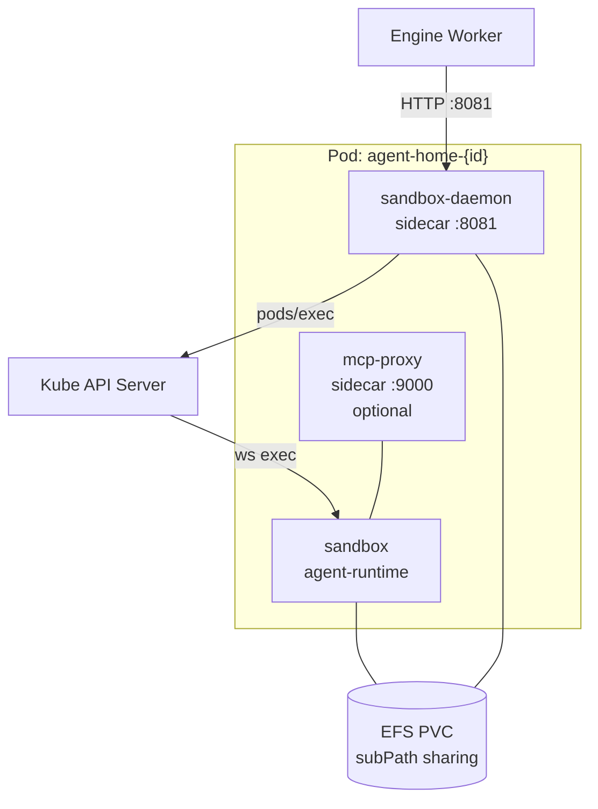
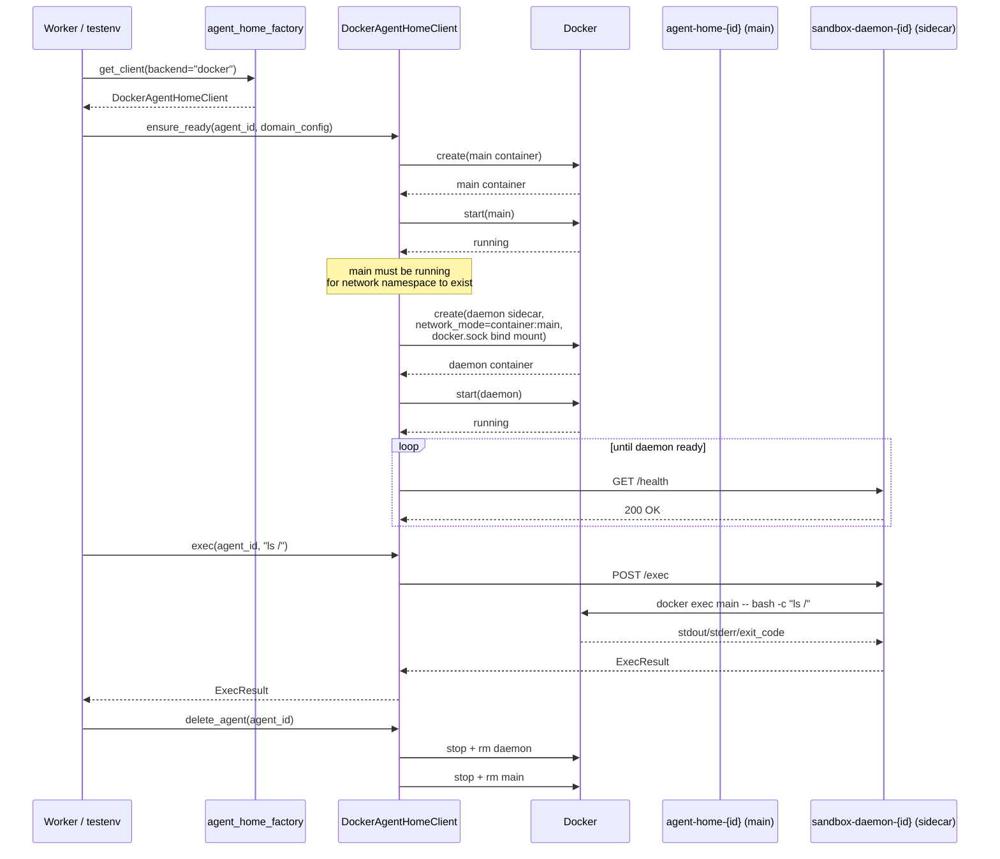

# DockerAgentHomeClient sandbox-daemon Sidecar Design

Design document for blocker discovered during Stage 3 (#2401, `llm-tool-execution`). Solves problem where `DockerAgentHomeClient` creates only a single container and therefore cannot call sandbox-daemon HTTP API (`:8081`).

- Issue: #2401
- Discussion: [Discussion #2410](https://github.com/azents/azents/discussions/2410)
- Prerequisite: #2376 (Stage 2 `llm-pipeline`), Stage 3 design PR #2407

## Overview

### Problem

`DockerAgentHomeClient` in `python/apps/nointern/src/nointern/runtime/sandbox/agent_home_docker.py` creates only **single container** `agent-home-{agent_id}` per agent. However, `.exec` / `.write_file` / `.read_file` call `SandboxDaemonClient` at `http://{container_ip}:8081`, and this port is supposed to be listened by `nointern-sandbox-daemon`.

Actual `supervisord.conf` in `docker/nointern/agent-runtime` image runs only `[program:mcp-proxy]` and there is no sandbox-daemon. Comment in `entrypoint.sh:5` says "sandbox-daemon: always start", but actual program does not exist; this is comment rot.

Result: in local docker backend, `exec` / `write_file` / `read_file` all do not work. Stage 3 testenv `live/sandbox.py` depends on this path, so Stage 3 Phase 2+ is blocked.

Reproduction:
```
Sandbox daemon not ready after timeout
RuntimeError: Sandbox daemon exec failed: All connection attempts failed
```

### Current State Investigation

- `DockerAgentHomeClient` has been unmaintained for 1 year. No unit/integration tests.
- prod deployment in `infra/argocd/nointern-sandbox/` uses K8s backend — docker backend is local dev only.
- `agent_home_factory.py` selects `DockerAgentHomeClient` only when `sandbox_config.backend == "docker"`. The only current user of this path is this Stage 3 testenv.

**Verdict**: Since there are no users depending on current broken behavior, safe to change.

## Decisions (Discussion #2410 Summary)

| # | Point | Decision | Rationale |
|---|---|---|---|
| P1 | Daemon executor backend | **Docker exec via `docker.sock`** | prod reproduction rate > implementation cost. symmetric with k8s "remote exec" model |
| P2 | Daemon placement | **Sidecar container** | separate `sandbox-daemon-{agent_id}` container, isolated from main. mirrors k8s Pod structure |
| P3 | Prod-parity vs Local-dev | **Prod-parity target, gaps explicit as Non-goals** | document docker-specific limits as boundaries for future contributors |
| P4 | Sharing mechanism | **absorbed into sidecar refactor** — parameterize bind mount list, testenv injects additional binds | add `extra_binds` API to `ensure_ready` as keyword-only |
| P5 | Scope + stack | **Full scope (7 PR stack)** | sidecar promoted to primary path → medium-size refactor |

## Target Architecture

### K8s (reference, existing prod)



### Docker (target)

```mermaid
graph TB
  subgraph Network["Docker network (shared namespace)"]
    Sandbox[agent-home-{id}<br/>agent-runtime<br/>127.0.0.1:8081 via daemon]
    Daemon[sandbox-daemon-{id}<br/>sandbox-daemon<br/>network_mode: container:agent-home-{id}]
    McpProxy[mcp-proxy-{id}<br/>mcp-proxy<br/>optional, same pattern]
  end
  HostFS[(Host bind mounts<br/>/tmp/nointern-testenv/<br/>agent-data/agents/{id}/)]
  DockerSock[/var/run/docker.sock]
  Worker[testenv / engine]

  Worker -->|HTTP localhost:8081<br/>via main's network ns| Daemon
  Daemon -->|docker exec| DockerSock
  DockerSock -.->|attach| Sandbox
  Sandbox --- HostFS
  Daemon --- HostFS
```

Key differences:
- Pod → three related containers (main + daemon sidecar + mcp-proxy sidecar). Docker has no Pod, so grouping by naming rule + shared network namespace + common bind mount.
- EFS subPath sharing → pass same host bind mount to every container.
- Kube API `pods/exec` → Docker `docker exec` via socket.
- **Remote exec model** where Daemon execs into main is same.

### Network Topology

```
sandbox-daemon-{id}:
  NetworkMode: container:agent-home-{id}    # share main's network namespace
  Binds: (same as main)
  Mounts:
    /var/run/docker.sock:/var/run/docker.sock:ro
```

Meaning of `network_mode: container:...`:
- daemon directly shares main's network namespace → if daemon binds `0.0.0.0:8081`, main can access it as `localhost:8081`
- Worker (testenv / engine) also sees daemon port when accessing main container IP (exact equivalent of k8s Pod IP)
- main container does not need to expose port 8081 — daemon is actual listener

Lifecycle:
1. create + start main container
2. create daemon sidecar (`network_mode: container:agent-home-{id}`) + start — only possible **after main is running**
3. wait for `health` endpoint ready with `_wait_for_daemon`
4. (optional) mcp-proxy sidecar also same pattern
5. on `delete_agent`, stop daemon → mcp-proxy → main in order

## Non-goals (Prod-parity gap)

K8s features that Docker backend **does not reproduce**. These are docker-specific limits, not implementation defects; design intentionally gives up these items.

| # | K8s feature | Docker reproduction? | Description |
|---|---|---|---|
| 1 | `runtimeClassName: sandbox` (gVisor/kata) | ❌ give up | docker has no runtimeClass concept. If similar isolation is needed, manually specify `--runtime=runsc` (when gVisor installed), not provided by default |
| 2 | custom `seccompProfile` | ⚠️ partial | supports `--security-opt seccomp=profile.json`. Current `agent_home_docker.py` uses `seccomp=unconfined`. Prod profile can be ported to `testenv/nointern/fixtures/` if needed, but excluded from initial implementation |
| 3 | `NetworkPolicy` (CNI layer egress/ingress) | ❌ give up | k8s NetworkPolicy is implemented by CNI. docker approximates with bridge + manual iptables rules or mitmproxy-based domain filtering (`ENABLE_PROXY` env). Current code already uses proxy method, so domain filtering is reproduced |
| 4 | `ServiceAccount` `pods/exec` RBAC | ❌ give up | docker has no SA concept. daemon execs through `docker.sock` → permission boundary is **docker daemon permission (root-equivalent)** and excessive. Security boundary mismatch — accepted for local dev premise |
| 5 | Pod lifecycle (restartPolicy, probes) | ⚠️ approximate | can approximate with docker `HostConfig.RestartPolicy` + `Healthcheck`. Initial implementation does not restart `always` |
| 6 | Downward API env (`SANDBOX_DAEMON_POD_NAME`) | ⚠️ approximate | no corresponding meaning in docker. Manually inject `SANDBOX_DAEMON_CONTAINER_NAME=agent-home-{id}` into daemon (parallel role to k8s `target_pod_name`) |
| 7 | EFS PVC subPath | ✅ reproduced | maintain same path structure with host bind mount |
| 8 | mcp-proxy sidecar composition | ✅ reproduced | can be added with same sidecar pattern (not **included in scope** of this design — keep existing embedded mcp-proxy method, consider sidecar migration as follow-up) |
| 9 | Resource limits (memory/cpu) | ✅ reproduced | same with `Memory` / `CpuQuota` |
| 10 | network isolation (`--ip` fixed, sandbox VLAN) | ❌ give up | initial implementation uses testenv compose default bridge network |

**Core principle**: fact that "this cannot be reproduced in docker" is itself a design output. This table answers future contributors asking "why is docker different from k8s?".

## Implementation Design

### 1. `nointern-sandbox-daemon` — add `DockerExecBackend`

**Files**: `python/apps/nointern-sandbox-daemon/src/nointern_sandbox_daemon/`
- `executor.py` (modify) — add new `DockerExecBackend` class alongside existing `KubeExecBackend`
- `config.py` (modify) — add `executor: Literal["kube", "docker"] = "kube"`, `target_container_name: str | None` env var
- `__main__.py` (modify) — select backend by config

```python
# executor.py (pseudocode)
class DockerExecBackend(ExecBackend):
    """Run command inside target container through Docker daemon API.

    Operates as sandbox-daemon sidecar outside agent-runtime container. Requires docker
    socket mount. Corresponds to K8s `pods/exec`.
    """

    def __init__(self, target_container_name: str, docker_host: str | None = None) -> None:
        self._target = target_container_name
        self._docker_host = docker_host
        self._docker: aiodocker.Docker | None = None

    async def exec(self, command: str, *, timeout: int, user_id: str) -> ExecResult:
        docker = await self._get_docker()
        container = docker.containers.container(self._target)
        exec_inst = await container.exec(
            cmd=["bash", "-c", command],
            stdout=True,
            stderr=True,
            tty=False,
        )
        async with exec_inst.start(detach=False) as stream:
            stdout, stderr = await _collect_with_timeout(stream, timeout)
        inspect = await exec_inst.inspect()
        return ExecResult(
            stdout=stdout[:MAX_OUTPUT_CHARS],
            stderr=stderr[:MAX_OUTPUT_CHARS],
            exit_code=int(inspect.get("ExitCode") or 0),
        )

    async def close(self) -> None:
        if self._docker is not None:
            await self._docker.close()
```

**File storage API** (`write_file`, `read_file`, `glob`, `grep`) can be served by daemon directly reading/writing local path because **daemon shares same host bind mount**. `DockerExecBackend` handles only exec, and file routes reuse common local path handler.

### 2. `agent_home_docker.py` — Sidecar refactor

**File**: `python/apps/nointern/src/nointern/runtime/sandbox/agent_home_docker.py`

**Main changes**:
1. Add `sandbox_daemon_image: str` field to `__init__` (no default, injected by factory)
2. Split `_create_container` into `_create_main_container` + `_create_daemon_container`
3. Extract bind mount list into dataclass:
   ```python
   @dataclass(frozen=True)
   class _AgentHomeBinds:
       home_dir: Path
       agent_dir: Path
       users_dir: Path
       mcp_config_dir: Path | None
       mcp_creds_dir: Path | None
       extra: tuple[str, ...] = ()

       def to_docker_binds(self) -> list[str]: ...
   ```
4. Add `extra_binds: list[str] | None = None` keyword-only parameter to `ensure_ready` (testenv extension point, prod path None)
5. Lifecycle:
   ```python
   async def ensure_ready(self, agent_id, domain_config, stdio_configs=None, *, extra_binds=None):
       # 1) check/create main container
       main = await self._ensure_main_container(agent_id, domain_config, stdio_configs, extra_binds)
       # 2) create daemon sidecar (only possible after main is running)
       daemon = await self._ensure_daemon_sidecar(agent_id, extra_binds)
       # 3) wait for daemon health
       await self._wait_for_daemon(agent_id)
   ```
6. `get_file_storage` no longer queries main container IP — daemon shares main network namespace, so main IP is daemon IP. Since "daemon listens on main's `localhost:8081`", worker accesses main container IP:8081
7. `delete_agent` deletes daemon sidecar → mcp-proxy sidecar → main in reverse lifecycle order
8. Add `_daemon_containers: dict[str, DockerContainer]` — track independently from main

**Daemon container config example**:
```python
{
    "Image": self._sandbox_daemon_image,
    "Env": [
        "SANDBOX_DAEMON_EXECUTOR=docker",
        f"SANDBOX_DAEMON_TARGET_CONTAINER_NAME={main_container_name}",
    ],
    "HostConfig": {
        "NetworkMode": f"container:{main_container_name}",  # share network ns
        "Binds": [
            *main_binds,  # same bind mount (path consistency)
            "/var/run/docker.sock:/var/run/docker.sock:ro",
        ],
        "Memory": 256 * 1024 * 1024,
        "CpuQuota": 25_000,
    },
    "Labels": {
        "managed-by": "nointern",
        "nointern/agent-id": agent_id,
        "nointern/role": "sandbox-daemon",
    },
}
```

### 3. `agent_home_factory.py` — daemon image injection

```python
case "docker":
    return DockerAgentHomeClient(
        image=agent_home_config.docker_image,
        sandbox_daemon_image=agent_home_config.docker_sandbox_daemon_image,
        network=agent_home_config.docker_network,
        data_path=agent_home_config.docker_data_path,
    )
```

Add `docker_sandbox_daemon_image: str` field to `AgentHomeConfig` or equivalent config. Default value is `"nointern-sandbox-daemon:testenv"`.

### 4. `docker/nointern/sandbox-daemon/Dockerfile` — add docker client

Currently installs only `nointern-sandbox-daemon` package. Add `aiodocker` dependency (not new dependency because nointern main already uses it).

### 5. `docker/nointern/agent-runtime/entrypoint.sh` — fix Comment rot

Remove comment in `entrypoint.sh:5` saying "sandbox-daemon: always start" and replace with "sandbox-daemon is separated into sidecar container".

### 6. Unit tests

**File**: `python/apps/nointern-sandbox-daemon/src/nointern_sandbox_daemon/executor_test.py` (new)
- pytest for `DockerExecBackend` — mock `aiodocker`
- verify exit_code / stdout / stderr collection
- timeout path
- container not found error path

**File**: `python/apps/nointern/src/nointern/runtime/sandbox/agent_home_docker_test.py` (new)
- verify sidecar lifecycle of `DockerAgentHomeClient` with fake docker client
- verify order `_ensure_main_container` → `_ensure_daemon_sidecar`
- verify reverse cleanup order in `delete_agent`
- verify `extra_binds` passed to both main and daemon

### 7. Live smoke (through testenv)

Stage 3 Phase 2 `testenv/nointern/live/sandbox.py` serves as practical integration test. In Phase 4 PR of this design, run direct smoke through testenv:

```python
sb = client.sandbox
home = sb.start("testenv-smoke")
try:
    r = sb.exec(home, "echo hello")
    assert r.exit_code == 0
    assert "hello" in r.stdout

    sb.write_file(home, "/data/agent/note.txt", "roundtrip")
    assert sb.read_text(home, "/data/agent/note.txt") == "roundtrip"
finally:
    sb.stop(home)
```

## Lifecycle Diagram



## Implementation Plan (7 PR Stack)

```
main
 ↓ 1/7  docs/docker-agent-home-sidecar                 ← this PR
 ↓ 2/7  implementation-plan PR
 ↓ 3/7  feat/.../phase1 — sandbox-daemon DockerExecBackend + config + unit test
 ↓ 4/7  feat/.../phase2 — sandbox-daemon Dockerfile (add aiodocker)
 ↓ 5/7  feat/.../phase3 — agent_home_docker.py sidecar refactor + unit test
 ↓ 6/7  feat/.../phase4 — entrypoint.sh rot fix + live smoke (through testenv)
 ↓ 7/7  chore/.../cleanup — remove temporary plan
```

## Risks

| # | Risk | Mitigation |
|---|---|---|
| 1 | security impact of mounting `docker.sock` | local dev premise. path disabled in prod because k8s is used. Explicit in design document Non-goals |
| 2 | if main stops under `network_mode: container:...`, daemon also disconnects | `delete_agent` cleans both containers as one bundle. orphan daemon supplemented by label-based periodic cleanup (follow-up) |
| 3 | `aiodocker` `exec_run` API may have subtle semantic differences from K8s `connect_get_namespaced_pod_exec` | verify `stdout` / `stderr` / `exit_code` collection path in unit test. replace with low-level `docker-py` if needed |
| 4 | `agent_home_docker.py` refactor breaks code path depending on existing (broken) behavior | investigation found no users (#2410 research). safe |
| 5 | testenv may lack docker.sock permission | existing preflight `DockerSocketAccessible` check already verifies |
| 6 | misunderstanding of main port exposure in `network_mode: container` | document in design (this file) and code comments: "daemon shares main network namespace so port is exposed at main IP" |

## Alternatives Considered

### Alternative A — Embedded daemon (run inside main container)

Register `sandbox-daemon` as supervisord program in main container. Use Local subprocess executor.

**Pros**: minimal change, automatic file/network sharing, docker.sock unnecessary
**Cons**: differs from k8s structure → lower prod reproduction rate. Security boundary (daemon has same permission as main) also differs

**Rejection reason**: Discussion #2410 decided "prioritize prod reproduction rate even at larger implementation cost". Maintaining symmetry with k8s sidecar + remote exec model is important.

### Alternative B — Hybrid (Embedded + Sidecar factory option)

Support both modes with factory parameter. Choose when needed.

**Rejection reason**: implementation cost doubled. Up-front investment for unused feature → YAGNI.

### Alternative C — Nsenter backend (daemon privileged + PID namespace sharing)

Run Daemon sidecar with `--privileged` + `--pid container:agent-home-{id}` and enter main namespace with `nsenter --target 1 -- bash -c {cmd}`.

**Rejection reason**: privileged + nsenter combination is container escape attack vector. More dangerous than docker.sock.

### Alternative D — gRPC in-main agent

Embed mini agent in main container and daemon calls it with gRPC.

**Rejection reason**: loses embedded advantages while keeping sidecar complexity. Overinvestment.

## References

- Discussion: [#2410](https://github.com/azents/azents/discussions/2410) — 5 discussion points + decisions
- Stage 3: [#2401](https://github.com/azents/azents/issues/2401), design PR #2407
- K8s sidecar structure: `python/apps/nointern/src/nointern/runtime/sandbox/agent_home_k8s.py:258-377`
- Current problem code: `python/apps/nointern/src/nointern/runtime/sandbox/agent_home_docker.py`
- Sandbox daemon: `python/apps/nointern-sandbox-daemon/src/nointern_sandbox_daemon/executor.py`
- Comment rot: `docker/nointern/agent-runtime/entrypoint.sh:5`
