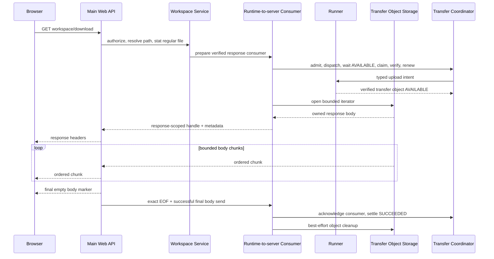
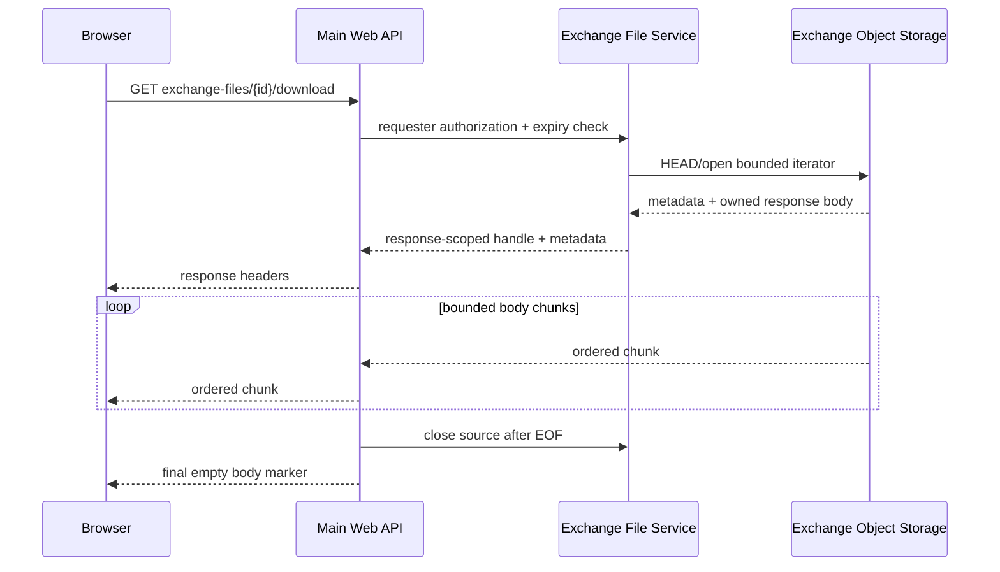

# Runtime HTTP File Download Streaming Design

- Snapshot: `download-260917`
- Requirements: [download-260917/REQ](../requirements/download-260917-runtime-http-file-download-streaming.md)
- Decisions: [download-260917/ADR](../adr/download-260917-runtime-http-file-download-streaming.md)
- Document reference: `download-260917/DESIGN`

## Design Summary

A changes only the complete-file HTTP response boundary. File bytes continue to use the
existing dedicated Runtime File Transfer capability or the existing server-owned Exchange
object source. They do not enter the persistent `RuntimeStreamSession` protocol.

The Workspace route receives a response-scoped consumer handle after Runtime admission,
Runner transfer verification, and a trusted consumer claim. The handle keeps the claim and
its renewal task alive while the HTTP response consumes a bounded object-storage iterator.
Only exact successful EOF permits acknowledgement and settlement. Any other exit uses the
existing bounded abandonment/cancellation path.

The Exchange route receives a response-scoped object iterator after its existing requester
permission and expiration checks. The existing byte-returning Exchange APIs remain available
to internal Agent execution and External Channel consumers; only the public HTTP route uses
the new streaming boundary.

A small response adapter owns the ASGI response lifecycle. It explicitly closes the source,
records exact EOF separately from successful delivery of the final ASGI body marker, and
performs idempotent cleanup on iterator error, client disconnect, cancellation, or deadline
expiry. Plain `StreamingResponse` wrapping around `bytes` is removed from both
complete-download routes.

## Current Behavior and Feasibility Evidence

The current route and service chain has the following verified behavior:

- `download_agent_workspace_file()` calls `AgentWorkspaceFileService.download_file()`.
- `AgentWorkspaceFileService.download_file()` authorizes the requester, resolves the
  Runner-reported workspace root, normalizes the path, stats the path, requires a regular
  file, and calls `RuntimeWorkspaceDownloadService.download()`.
- `RuntimeWorkspaceDownloadService.download()` uses `_BytesCallback`, whose publication
  callback calls `S3Service.download_bytes()` and stores the complete body in `bytes`.
- `RuntimeToServerTransferService` acknowledges and settles the Runtime transfer after the
  callback returns. Therefore the current Workspace transfer is already settled before the
  API constructs its `StreamingResponse`.
- `download_exchange_file()` calls `ExchangeFileService.download()`, which checks access and
  expiration and then calls `S3Service.download_bytes()` before returning.
- `ExchangeFileDownload` is also consumed by Agent input materialization and External
  Channel provider delivery. Replacing that shared byte contract would expand A beyond the
  confirmed HTTP scope.
- `S3Service.iter_chunks()` already opens an owned object body, yields bounded chunks, and
  closes the body on normal EOF, early context exit, read failure, and task cancellation.
- Starlette `StreamingResponse` accepts an asynchronous iterator, but it does not know the
  Runtime transfer claim or when a feature-specific source must be acknowledged, abandoned,
  or cancelled. A response wrapper must supply that lifecycle explicitly.
- The deployed Uvicorn version advertises ASGI HTTP spec `2.3`. Under Starlette's
  corresponding response path, normal response completion and an observed client
  disconnect both end the internal task group without a distinct route-level return value.
  The response body therefore needs independent exact-EOF and successful-final-send state
  rather than treating a normal `StreamingResponse.__call__()` return as sufficient
  completion evidence.
- A focused response simulation also showed that a send-side failure does not guarantee
  prompt async-generator finalization. The response adapter must explicitly close its
  body producer instead of relying on garbage collection or a framework background task.
- Under ASGI `2.4`, Starlette converts a send-side `OSError` to `ClientDisconnect`; under
  earlier ASGI versions a disconnect can instead cancel the streaming task. The adapter
  must handle both forms without changing terminal action after successful final send.
- Existing Runtime-to-server tests cover claim, renewal, acknowledgement, settlement,
  cleanup, and lease loss. Existing Workspace and Exchange tests pass against the current
  bytes implementation and provide the regression baseline.

The evidence makes the design feasible without a protobuf, database, Runtime Stream Session,
or public-route change. The Runtime-to-server publication callback contract cannot be reused
unchanged for Workspace HTTP streaming because its return is the settlement boundary; the
shared preparation, claim, lease-renewal, and cleanup state must be extracted into a
response-capable consumer handle.

## Requirements and Decision Traceability

| Requirement | ADR decisions | Design mechanisms |
| --- | --- | --- |
| `download-260917/REQ-1` | `ADR-D1`, `ADR-D2`, `ADR-D4` | M1 Workspace response handle, M2 response-scoped Runtime consumer, M3 bounded verified iteration, M4 ASGI lifecycle |
| `download-260917/REQ-2` | `ADR-D1`, `ADR-D3`, `ADR-D4` | M1 Exchange response handle, M3 bounded verified iteration, M4 ASGI lifecycle, M5 separate Exchange authority |
| `download-260917/REQ-3` | `ADR-D1`, `ADR-D2` | M1 single-use ownership, M2 terminal claim lifecycle, M3 exact EOF, M4 server-observed response completion and cleanup |
| `download-260917/REQ-4` | `ADR-D2`, `ADR-D3`, `ADR-D4`, `ADR-D5` | M2 Runtime fencing, M5 Exchange authorization, M6 protocol separation |
| `download-260917/REQ-5` | `ADR-D4`, `ADR-D5` | M4 preserved HTTP surface, M6 unchanged Runtime protocols, M7 E2E and deterministic regression evidence |

## Architecture

### M1. Source-specific response handles

The API receives one internal, single-use response handle rather than a complete body:

- `WorkspaceDownloadStream` owns a verified Runtime consumer and an opened bounded S3
  iterator.
- `ExchangeFileDownloadStream` owns an authorized Exchange metadata snapshot and an opened
  bounded S3 iterator.
- Both handles expose response metadata and an asynchronous byte iterator only inside
  trusted backend code. They do not expose storage credentials, object keys, provider URLs,
  transfer revisions, or replay operations to the public API model.
- Each handle is idempotently closable and can be consumed once. A second iterator or replay
  attempt fails as an internal stream error rather than reopening the source.

`AgentWorkspaceFileService` gains a stream-oriented download entry point used by the HTTP
route. Existing Workspace metadata, authorization, stat, path, and error behavior remains
before the handle is returned.

`ExchangeFileService` gains a stream-oriented public-download entry point. Its existing
`download()` and authority-resolved byte-returning methods remain for non-HTTP consumers in
this snapshot. The new entry point reuses the same metadata authorization and expiration
helpers and does not alter retention ownership.

### M2. Runtime prepared consumer and publication preservation

`RuntimeToServerTransferService` is split internally into two phases while retaining its
existing terminal publication method:

1. A common preparation phase creates the exact upload-direction identity, admits and
   dispatches the Runner transfer, waits for `AVAILABLE`, claims one consumer, obtains the
   verified opaque object handle and manifest, and performs the initial lease renewal.
2. A publication consumer path runs the existing callback under the current lease-renewal
   and commit-before-acknowledgement behavior used by `present_file` and Runtime image reads.
3. A response consumer path returns a `RuntimeToServerConsumer` whose claim remains active
   until the response adapter reports exact EOF plus successful final body emission or an
   earlier terminal failure.

The new consumer retains the current revision, claim ID, deadline, identity, verified size,
and verified SHA-256 in process-local state. It provides only these lifecycle operations:

- `complete()` — valid only after exact source EOF and successful return from sending the
  final ASGI body marker; stop and join renewal, capture its latest fenced revision,
  acknowledge the consumer, and settle the transfer with bounded revision recovery.
- `abandon()` — valid before completion; abandon the active claim and cancel the exact
  attempt through the existing bounded cleanup loop.
- `close()` — idempotently stop the renewal task and close any attached source. Closing an
  unfinished consumer performs the same unsuccessful cleanup as `abandon()`.

Completion, abandonment, and close are serialized. They first stop or join the renewal
task so no concurrent lease renewal can race a revision-sensitive acknowledgement or
abandonment. If cancelling an in-flight renewal leaves its result ambiguous, the existing
authoritative status observation refreshes the revision before the terminal transition.

The one-hour logical transfer lifetime remains absolute and is not extended by a slow HTTP
client or lease renewal. The Workspace response deadline remains bounded by the existing
five-minute policy and the earlier Runtime logical expiry.

### M3. Bounded verified source iteration

The Workspace stream resolves the verified opaque object only in trusted backend code and
opens it through `S3Service.iter_chunks()` with a fixed maximum chunk size below the Runtime
transfer message ceiling. The stream wrapper:

- rejects empty chunks from a non-empty source and chunks larger than the configured bound;
- counts bytes before yielding and rejects bytes beyond the verified manifest size;
- updates a SHA-256 digest for every yielded chunk;
- accepts a zero-byte source and validates the empty digest;
- requires the observed size and digest to match the verified manifest at EOF; and
- never falls back to Runner Control Base64 events or a second transfer attempt.

The Exchange stream performs the same bounded count and digest validation against the
Exchange metadata snapshot. It performs an object HEAD/open check before returning the
response handle so a missing source can retain the existing `FileUnavailable` response
before HTTP headers are sent. A source that disappears or changes while being read fails
closed after headers if necessary; it is never reported as a successful complete download.

### M4. Response-scoped ASGI lifecycle

The two routes use one internal response adapter, implemented as a narrow
`StreamingResponse` subclass or equivalent response helper. The adapter owns the following
sequence:

1. Construct the response only after authorization and source opening succeed.
2. Send the existing response headers without adding a new route, token, or storage header.
3. Iterate the single-use body handle and send only bounded byte chunks.
4. The body producer marks exact verified EOF only after its source context closes normally.
5. The adapter wraps the ASGI `send` callable and records final-send completion only after
   the underlying call for `http.response.body` with `more_body=False` returns
   successfully. Exact EOF alone does not set this flag.
6. Successful final-send completion is the terminal commit point. After the base response
   call returns, run `complete()` only when both exact EOF and final-send completion were
   recorded. A return caused by an ASGI `2.3` disconnect before that commit point invokes
   unsuccessful cleanup even if the source had just reached EOF.
7. Before the commit point, `ClientDisconnect`, send-side `OSError`,
   `asyncio.CancelledError`, source read failure, digest or size mismatch, Workspace
   deadline expiry, or any other body error invokes the handle's unsuccessful cleanup.
8. After the commit point, cancellation or a later disconnect cannot switch the terminal
   action back to abandonment. The adapter runs the bounded `complete()` settlement path
   in a shielded scope, preserves any authoritative recovery result, and then re-raises the
   original cancellation when applicable.
9. In every exit path, explicitly close the body producer and source. Pre-commit
   request-task or server cancellation uses one bounded shielded unsuccessful-cleanup
   scope, then re-raises the original cancellation. Framework background tasks are not the
   cleanup authority because they are not guaranteed to run after every disconnect or
   response error.

A failure after response headers have been sent cannot change the HTTP status. The body
connection is terminated without a final successful completion marker, and the Runtime
transfer terminal state plus cleanup evidence remains authoritative. The adapter never
retries a partially delivered response with the same attempt.

HTTP and Runtime settlement cannot form one atomic commit. The selected ordering prefers
REQ-3's fail-closed disconnect behavior: exact EOF and successful final ASGI body send
precede Runtime consumer acknowledgement and settlement. A process failure in that narrow
post-response, pre-settlement window leaves the transfer attempt unacknowledged and lets
the existing non-extendable lease, logical expiry, and cleanup reconciliation recover it;
the same attempt is never replayed.

ASGI exposes server-side response progress, not proof that the client application consumed
or persisted every byte. The implementable completion signal is exact verified source EOF
plus successful return from the final ASGI body send, with no earlier observed disconnect.
The stronger phrase “complete client consumption” in
`download-260917/REQ-3` requires requester clarification before this Design can be approved.
In particular, ASGI `2.3` cannot eliminate a transport disconnect racing the final body
marker.

The existing successful response metadata is preserved:

- Workspace media type remains inferred from the resolved filename.
- Exchange media type remains the stored Exchange media type.
- Both routes retain their current UTF-8 `Content-Disposition` filename format.
- No eager `Content-Length` is invented; framing remains owned by the HTTP server.

### M5. Separate Exchange authority

Exchange stream opening performs the existing requester authorization and expiration check
before object access. It does not create a Runtime transfer attempt, consume a Runtime
claim, copy the object into a temporary product, or route the object through the persistent
Runtime Stream Session. The stream handle closes the server-owned S3 response body on all
exit paths while Exchange retention and metadata cleanup remain unchanged.

Internal consumers continue to use their existing complete-byte methods in A:

- Agent input/model-file materialization keeps its current deliberate complete-body boundary.
- External Channel provider delivery keeps its current authority-resolved source behavior.
- Runtime-to-provider and Runtime Stream Session protocols are not modified.

This split prevents an HTTP optimization from silently changing the source authority or
memory contract of Agent execution and provider delivery.

### M6. Persistent Runtime Stream Session boundary

No file logical-stream mode, file-specific message, capability flag, compatibility alias, or
fallback is added to `RuntimeStreamSession`. The existing typed `RuntimeRunnerTransfer`
protocol and transfer coordinator state remain the only Runtime boundary for Workspace
complete-file bytes in A.

B is a future development snapshot. It must separately decide file-stream authority,
framing, flow-control interaction, source staging, integrity, resume/replay policy, and
mixed-version rollout. A supplies only a corrected HTTP response consumption boundary.

## Ownership and Source-of-Truth Boundaries

- The public API route owns the live HTTP response and transfers source ownership to one
  response adapter immediately after the service returns the handle. If response
  construction fails, the route closes the handle before propagating the error.
- Runtime Transfer Coordinator state remains authoritative for Workspace attempt identity,
  generation fences, claim ownership, lease validity, deadline, acknowledgement,
  settlement, and cleanup. The API process owns no parallel transfer state.
- The immutable Runtime transfer object remains byte evidence for the exact attempt and is
  accessible only through its opaque verified handle while the consumer claim is valid.
- Exchange metadata and requester access remain authoritative in the existing Exchange
  repository and service. The Exchange S3 object remains the product byte source; the HTTP
  route creates no second object or retention record.
- The response handle owns only process-local live iteration state: opened source,
  observed byte count and digest, exact-EOF flag, terminal action state, and close state.
  None of that state is durable authority or replay evidence.
- PostgreSQL, Redis coordination state, Agent history, and logs receive no file body,
  storage identity, provider URL, transfer secret, or new download-history record.

## End-to-End Flows

### Workspace download

### Exchange download

## Failure and Completion Matrix

| Condition | HTTP boundary | Workspace authority | Exchange authority |
| --- | --- | --- | --- |
| Authorization, path, stat, expiry, or admission rejection before source open | Existing safe error response | No claim or no active claim remains | No object body opened |
| Object missing while opening | Existing unavailable error before headers | Abandon/cancel prepared consumer | `FileUnavailable` before headers |
| Exact zero-byte EOF | Final successful response | Validate size/hash, acknowledge, settle | Validate size/hash, close source |
| Chunk read failure or integrity mismatch after headers | Terminate body without success marker | Abandon/cancel; never replay | Close object body; report unsuccessful stream |
| Browser disconnect or task cancellation before final-send commit | Close source and terminate body | Shielded bounded cleanup; no successful settlement | Close source; no retry |
| Task cancellation after final-send commit | HTTP body is already server-complete | Keep the committed bounded completion/settlement path; never switch to abandonment | Source is already closed; no retry |
| Workspace deadline or lease loss during body | Terminate body | Cleanup or terminal failure according to coordinator state | Not applicable |
| Exchange response remains slow without disconnect | Continue bounded backpressured streaming | Not applicable | No new feature-owned deadline in A |
| Acknowledgement/settlement transport ambiguity after normal response completion | HTTP body is already complete; never replay | Existing revision/status recovery, then logical expiry/cleanup if unresolved | Not applicable |
| Disconnect racing the final ASGI marker | Best available server observation; never replay | Residual transport ambiguity documented and tested | Source closes idempotently |

## Implementation Impact

The implementation is limited to the following surfaces:

- `python/apps/azents/src/azents/runtime/transfer/runtime_to_server.py` — extract common
  preparation and add response consumer lifecycle while preserving publication behavior.
- `python/apps/azents/src/azents/runtime/transfer/workspace_download.py` — replace the
  `_BytesCallback` materializer with a bounded response stream and exact EOF settlement.
- `python/apps/azents/src/azents/services/chat/workspace.py` — expose the stream-oriented
  Workspace download entry point while retaining authorization/stat/path behavior.
- `python/apps/azents/src/azents/services/exchange_file/__init__.py` — add a public HTTP
  stream entry point and retain existing byte-returning internal methods.
- `python/apps/azents/src/azents/api/public/chat/v1/__init__.py` and focused API tests — use
  the response-scoped adapter and preserve route headers and error mapping.
- `python/libs/az-common/src/azcommon/infra/s3/service.py` tests only if the existing
  bounded iterator needs a narrowly scoped contract assertion; no new storage authority is
  introduced.
- Workspace, Exchange, Runtime transfer, API, and required public E2E tests.
- Related Living Specs after implementation and verification; no spec is changed during
  design-only work.

There is no protobuf change, generated-client change, database migration, Helm change,
Runtime Stream Session change, new public route, or live infrastructure operation.

## Security, Operations, and Rollout

- Workspace authorization, Runtime readiness and generation fencing, regular-file stat,
  transfer admission, verified manifest, and consumer claim all complete before a body
  chunk is exposed.
- Exchange requester authorization and expiration complete before the S3 body is opened.
  The handle retains only trusted in-process object identity and never serializes it into
  the response, logs, or public schema.
- Existing transfer records, bounded cleanup-failure evidence, and structured Runtime
  transfer logs remain the operator source for Workspace settlement and cleanup. A adds no
  durable HTTP-download audit record and no log containing filename, Runtime path, object
  key, opaque handle, or file content.
- Rollout is an application-only coordinated replacement of the two HTTP adapters and
  their backend services. There is no mixed protocol mode, feature flag, or data backfill.
- Rollback restores eager HTTP materialization but does not require state migration.
  In-flight response handles from the replaced process terminate and follow the existing
  claim expiry and cleanup path; they are not resumed by the rolled-back process.

## Test Strategy

### Primary E2E matrix

The public E2E lane remains the primary product verification:

- Upload an Exchange file, download it through the existing route with a streaming HTTP
  client, and assert exact bytes, SHA-256, media type, and UTF-8 filename.
- Download a multi-megabyte Exchange file in multiple client reads and verify that the
  response is not dependent on one complete application-body read.
- Exercise an authorized Workspace Runtime file download after creating a deterministic
  regular file through the existing public Runtime file operation path; assert exact bytes,
  media type, and filename.
- Exercise a zero-byte Exchange file and, where the Runtime fixture supports it, a zero-byte
  Workspace file; both must complete with an empty body.
- Preserve existing authorization, missing, expired, and unavailable-file journeys.
- Use a client that closes a streaming response before EOF for the focused disconnect lane;
  the required E2E lane records the safe incomplete response, while coordinator cleanup is
  asserted by deterministic backend tests.

The E2E lane reuses the existing public user, Runtime Profile, object-storage, and provider
fixtures. No new credential is required. A new fixture is added only if the current public
Runtime file operation cannot create a deterministic empty or multi-chunk Workspace file.

### Focused unit and integration coverage

- `runtime_to_server` tests cover preparation order, verified manifest checks, lease renewal
  while the body is paused, no acknowledgement before final response completion, serialized
  renewal shutdown, exact successful acknowledgement and settlement,
  cancellation/disconnect cleanup, source failure, lease loss, deadline, and no replay
  after partial delivery.
- Workspace download tests use a fake bounded object iterator to cover zero-byte, multi-chunk,
  over-sized, short, hash-mismatched, unavailable, and cancellation paths. They assert that
  `download_bytes()` and Runner Control file-body reads are not called.
- Exchange service tests cover `open_download` authorization, expiry, missing object,
  bounded iteration, source close on EOF/error/cancellation, and preservation of the existing
  byte-returning consumers.
- API response tests drive the ASGI adapter with explicit `http.response.start`, body, final
  marker, disconnect, send-error, and request-task cancellation events under ASGI `2.3` and
  `2.4` semantics. They assert that exact EOF and successful final-send return are separate,
  settlement occurs only after both, cancellation before the commit point abandons,
  cancellation after it preserves completion, the producer is explicitly closed, and one
  terminal cleanup action runs exactly once.
- Existing Runtime File Transfer, Runtime Stream Session, External Channel, Agent input
  materialization, and provider-delivery suites remain required regression gates.

### CI and evidence

The implementation PR must retain the exact focused test commands and pass counts, run the
required backend and public E2E checks, and include evidence that no new complete-body
allocation occurs at the HTTP boundary. Optional live Kubernetes checks remain unrelated and
are not a prerequisite for this design.

## Feasibility Validation

| Requirement | Result | Repository evidence |
| --- | --- | --- |
| `download-260917/REQ-1` | Feasible | Workspace already performs requester authorization, Runner-reported path validation, regular-file stat, and verified Runtime transfer admission; `S3Service.iter_chunks()` supplies the missing bounded HTTP source. |
| `download-260917/REQ-2` | Feasible | Exchange already owns authorized object metadata and the shared S3 service exposes a close-safe bounded iterator; route-only stream opening avoids changing internal byte consumers. |
| `download-260917/REQ-3` | Conditional | Starlette supplies async iteration and disconnect observation, but ASGI cannot prove application-level client consumption and ASGI `2.3` has a final-marker disconnect race. A send wrapper can independently record exact source EOF and successful return from the final body send, preserve that terminal commit across later cancellation, and run bounded cleanup after an observed earlier disconnect. Requester clarification of the acceptance wording is required. |
| `download-260917/REQ-4` | Feasible | Existing Workspace Runtime target/generation checks, Coordinator claim fencing, Exchange authorization, and opaque object resolution remain before body exposure. |
| `download-260917/REQ-5` | Feasible | Existing focused transfer, Workspace, Exchange, and public E2E fixtures provide the regression base; only streaming assertions and lifecycle cases are new. |

`download-260917/REQ-3` is blocked only if “complete client consumption” is interpreted as
application-level receipt or persistence, because HTTP/ASGI exposes no such acknowledgement.
The proposed clarification is exact verified EOF plus successful return from the final ASGI
body send, without an earlier observed disconnect. All other requirements and mechanisms
are feasible. The remaining non-blocking risk is the disconnect race around the final ASGI
marker, which is addressed by deterministic ASGI tests, one real server/client streaming
journey, and no replay of an ambiguous attempt.

## Design Authority

- Design revision: `3`

| ID | Material design mechanism | Authority | Classification |
| --- | --- | --- | --- |
| M1 | Single-use response-scoped handles instead of complete HTTP bodies | `download-260917/REQ-1`, `REQ-2`, `REQ-3`; `download-260917/ADR-D1` | `decided` |
| M2 | Shared Runtime transfer preparation with a consumer that settles only after exact EOF | `download-260917/REQ-1`, `REQ-3`, `REQ-4`; `download-260917/ADR-D2` | `decided` |
| M3 | Bounded size/hash verification and close-safe object iteration | `download-260917/REQ-1`, `REQ-2`, `REQ-3`; existing Runtime File Transfer contract | `required` |
| M4 | Response adapter with separate exact-EOF and successful-final-send evidence, a sticky terminal commit point, and explicit close on every exit | `download-260917/REQ-3`; `download-260917/ADR-D1`, `ADR-D2` | `derived` |
| M5 | Separate Exchange authority and route-only streaming surface | `download-260917/REQ-2`, `REQ-4`; `download-260917/ADR-D3` | `decided` |
| M6 | No file messages or compatibility path in `RuntimeStreamSession` | `download-260917/REQ-4`, `REQ-5`; `download-260917/ADR-D4`, `ADR-D5` | `decided` |
| M7 | E2E-first and deterministic lifecycle evidence | `download-260917/REQ-5`; documentation test policy | `required` |

## Removal and Replacement

| Existing unit or behavior | Removal authority | Replacement or remaining authority | Removal boundary | Absence verification |
| --- | --- | --- | --- | --- |
| Workspace `_BytesCallback` complete-body materialization in the HTTP download path | `download-260917/REQ-1`, `REQ-3`; `ADR-D1`, `ADR-D2` | `WorkspaceDownloadStream` plus Runtime consumer settlement | `runtime/transfer/workspace_download.py` and Workspace HTTP route | Stream tests spy that `download_bytes()` is unused and assert settlement after EOF only |
| Workspace route `io.BytesIO(data)` wrapper | `download-260917/REQ-1`; `ADR-D1` | Response-scoped bounded response adapter | `download_agent_workspace_file()` | API ASGI tests and source search for the route path |
| Exchange route `io.BytesIO(value.body)` wrapper | `download-260917/REQ-2`; `ADR-D1`, `ADR-D3` | `ExchangeFileDownloadStream` response adapter | `download_exchange_file()` | API/service tests assert bounded iterator and source close |
| Exchange byte-returning `download()` and authority-resolved consumers | None | Existing Agent execution and External Channel authority | No removal in A | Existing model-input and provider-delivery regression suites |
| `RuntimeRunnerTransfer` protobuf and persistent `RuntimeStreamSession` file behavior | None | Existing dedicated Runtime File Transfer and future B snapshot | No removal in A | Protocol symbol/message absence check; existing transfer and stream-session suites |
| Public route paths, filename/media-type headers, authorization, and expiry behavior | None | Existing route contract | No removal in A | Public API/E2E response assertions |

Historical Requirements and ADR documents remain immutable. This unimplemented Design may
change only through a new revision before approval; once implemented and verified, the
snapshot becomes immutable and current behavior moves to Living Specs.

## Design Approval

- Mode: `Collaborative`
- Decision owner: `requester`
- Approved on: `2026-09-17`
- Approved Design revision: `3`
- Approved authority IDs: `M1, M2, M3, M4, M5, M6, M7`
- Approved material scope: response-scoped Runtime consumer boundary, final-send commit
  before Runtime settlement, sticky post-commit completion, route-only Exchange stream
  entry point, explicit producer cleanup, unchanged Runtime File Transfer and public HTTP
  contracts, and keeping file bytes outside persistent `RuntimeStreamSession`.
- Approved REQ-3 interpretation: exact verified EOF plus successful return from the final
  ASGI body send without an earlier observed disconnect; this is not application-level
  persistence acknowledgement.
