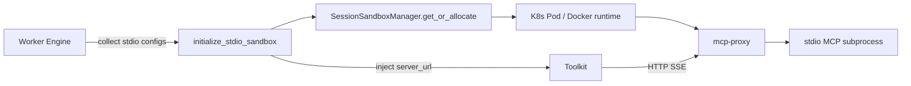
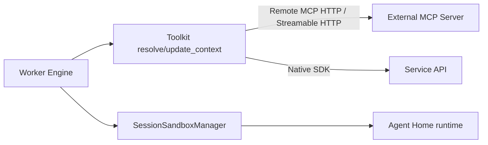

# Dormant stdio MCP Sidecar Removal Design

## Overview

nointern once introduced path with per-agent `mcp-proxy` sidecar next to Agent Home to support stdio-only MCP server. However, in current code, no **toolkit implementation that actually produces** this path is visible.

More precisely, runtime / infra branch itself is still alive. `EngineWorker` still calls `initialize_stdio_sandbox()`, and sandbox layer also receives `stdio_configs` and keeps sidecar wiring. But under current `python/apps/nointern/src/nointern`, there is no `Toolkit.get_stdio_configs()` / `Toolkit.set_server_url()` override, and no actual `McpStdioToolkitConfig(...)` instance is used.

Goal of this design is not **"whether to generalize and maintain stdio MCP support itself"**, but **to remove currently dormant per-agent stdio sidecar transport and simplify runtime contract to remote HTTP MCP + native integration**.

### User Scenario

1. Workspace manager attaches GitHub / Notion / Sentry / Raw MCP toolkit.
2. runtime uses remote MCP HTTP or service-specific native SDK path as before.
3. sandbox is responsible only for shell / file / project load lifecycle, and no longer handles MCP stdio subprocess orchestration.
4. Operator no longer manages `nointern-mcp-proxy` image, sidecar RBAC, or Pod compatibility conditions.

## Discussion Points and Decisions

### 1. Should dormant stdio path be kept?

**Options**

- **A. Keep** — for future stdio-only MCP
- **B. Remove** — clean up unused complexity

**Decision: B. Remove**

Rationale:

- No current `Toolkit.get_stdio_configs()` / `Toolkit.set_server_url()` override.
- No actual `McpStdioToolkitConfig(...)` instance.
- Actual toolkit implementations use remote HTTP/Streamable HTTP MCP or native SDK.

### 2. Is removal unit entire transport or only K8s sidecar?

**Options**

- **A. Remove only K8s sidecar** — keep Docker local subprocess
- **B. Remove entire stdio transport path** — clean up K8s + Docker + engine hooks together

**Decision: B. Remove entire stdio transport path**

Rationale:

- Dormant part is not just K8s container placement but entire `McpStdioToolkitConfig` and engine orchestration.
- Even if Docker-side `ENABLE_MCP_PROXY`, supervisord, bind mount remain, model/test complexity does not substantially decrease.

### 3. Include replacement path in this design?

**Options**

- **A. Design central stdio bridge alternative together**
- **B. Decide only removal, split future stdio requirement into separate issue**

**Decision: B. Decide only removal**

Rationale:

- Current need is cleanup of dormant path.
- Designing replacement infrastructure without requirement expands scope and blurs decision.
- If future requirement appears, choose among remote MCP adoption, native integration, central bridge based on evidence at that time.

### 4. How to split documentation update scope?

**Options**

- **A. Modify history + living spec in design PR at once**
- **B. Add only ADR/design in design PR, update living spec in implementation PR**

**Decision: B. ADR/design first, spec updated in implementation PR**

Rationale:

- `spec/` must describe actual current system behavior.
- If spec changes before code, it becomes factually wrong.
- Historical ADR (`0018`) must remain append-only and is not modified.

## Current Structure



Problem with current structure is that although `mcp-proxy` is more an **unused transport branch** than active feature, engine, sandbox, and infra all keep carrying that branch.

## Target Structure



Goal is to return sandbox to **shell / file / runtime lifecycle-only boundary**, and keep MCP transport only as worker-side HTTP path or native integration.

## Impact Scope

### Runtime

- `python/apps/nointern/src/nointern/core/tools.py`
  - `McpStdioToolkitConfig`
  - `Toolkit.get_stdio_configs()`
  - `Toolkit.set_server_url()`
  - `MCP_PROXY_PORT`
- `python/apps/nointern/src/nointern/worker/engine.py`
  - `EngineWorker.initialize_stdio_sandbox()`
- `python/apps/nointern/src/nointern/runtime/sandbox/session_sandbox.py`
  - `ensure_ready(..., stdio_configs=...)` contract
- `python/apps/nointern/src/nointern/runtime/sandbox/session_sandbox_factory.py`
  - config wiring when creating backend/client
- `python/apps/nointern/src/nointern/runtime/sandbox/session_sandbox_manager.py`
  - `stdio_configs` cache/revalidation path
- `python/apps/nointern/src/nointern/runtime/sandbox/session_sandbox_k8s.py`
  - sidecar Pod spec, ConfigMap/Secret, reuse compatibility
- `python/apps/nointern/src/nointern/runtime/sandbox/session_sandbox_docker.py`
  - `ENABLE_MCP_PROXY`, config/creds bind mount
- `python/apps/nointern/src/nointern/core/config.py`
  - `k8s_mcp_proxy_image` bootstrap/config validation

### Infra / CI

- `docker/nointern/mcp-proxy/Dockerfile`
- `docker/nointern/agent-runtime/supervisord.conf`
- `docker/nointern/agent-runtime/entrypoint.sh`
- `.github/workflows/docker.yaml`
- `infra/terragrunt/_modules/nointern-server-infra/ecr.tf`
- `infra/argocd/nointern-server/overlays/production/base/patches/env.env`
- `infra/argocd/nointern-sandbox/base/worker-rbac.yaml`
- `infra/argocd/nointern-sandbox/base/networkpolicy.yaml`

### Docs / testenv

- **Historical reference only**
  - `docs/nointern/design/mcp-stdio-toolkit.md`
  - `docs/nointern/design/stdio-mcp-resolve-integration.md`
  - `docs/nointern/design/stdio-mcp-ga4-integration.md`
- **Actual update targets**
- `docs/nointern/spec/domain/toolkit.md`
- `docs/nointern/spec/domain/conversation.md`
- `testenv/nointern/setup/sandbox-daemon-image.md`
- `testenv/nointern/setup_handlers/sandbox_daemon_image.py`
- `testenv/nointern/checks/images.py`
- `testenv/nointern/devserver.py`
- `testenv/nointern/README.md`
- `testenv/nointern/scenarios/INDEX.md`

## Data Model

No DB schema change.

Removal target is runtime contract, not DB row. However, following **in-memory / backend compatibility state** disappears.

- runtime `stdio_configs`
- `mcp-proxy sidecar required` condition in sandbox reuse judgment
- sidecar ConfigMap/Secret backend resources

## Provider / Service Implementation Direction

### Principles after Removal

1. toolkit resolve/update_context path must complete **inside worker**.
2. sandbox allocation happens only when shell/file/project/runtime lifecycle needs it.
3. toolkit must not require sandbox as transport layer.

### Pseudocode Cleanup Target

```python
class Toolkit(ABC):
    async def update_context(self, context: TurnContext) -> ToolkitState:
        ...

    async def __aenter__(self) -> Toolkit:
        return self

    async def __aexit__(self, *exc: object) -> None:
        ...
```

```python
class EngineWorker:
    async def _run_session(...) -> None:
        toolkits = await resolve_agent_tools(...)
        # no stdio sidecar pre-initialization step
        async with AsyncExitStack() as stack:
            for binding in toolkits:
                await stack.enter_async_context(binding.toolkit)
```

```python
class SessionSandboxClient(ABC):
    async def ensure_ready(
        self,
        session_id: str,
        agent_id: str,
        workspace_id: str,
        domain_config: SandboxDomainConfig,
        *,
        image_ref: str | None = None,
    ) -> None:
        ...
```

## API

No Public API change.

Internally, these assumptions no longer hold.

- "If stdio toolkit exists, eagerly allocate sandbox"
- "Inject Pod IP-based `server_url` into toolkit"

## Frontend (UI/UX)

This removal has no frontend UI change.

However, if future plan to support stdio-only MCP returns, it must be discussed again as **explicit product decision**, not hidden transport implementation.

## Infrastructure

### Current

- Separate `nointern-mcp-proxy` image build/deploy
- sidecar image setting in production env
- sidecar ConfigMap/Secret create permission in worker RBAC
- sidecar ingress consideration in sandbox networkpolicy

### After Change

- Remove `mcp-proxy` dedicated image/deploy/permission.
- agent-runtime is responsible only for sandbox-control / shell / file lifecycle.
- Remove sidecar-specific env/config.

## Feasibility Verification

| Item | Result | Evidence |
|---|---|---|
| Does live toolkit actually use stdio path? | no | no `get_stdio_configs()` / `set_server_url()` override, no `McpStdioToolkitConfig(...)` instance |
| Does remote MCP path already exist? | yes | `engine/tools/mcp.py`, service MCP toolkits use HTTP transport |
| Does native integration alternative path exist? | yes | `engine/tools/google_analytics.py` uses native SDK |
| Can removal break config bootstrap? | yes | required field `k8s_mcp_proxy_image` in `core/config.py` must be removed/relaxed |
| Is sandbox reuse logic affected? | yes | need to change compatibility condition in `conversation.md` spec and `session_sandbox_k8s.py` |
| Is build / preflight path affected? | yes | `session_sandbox_factory.py`, `devserver.py`, `checks/images.py`, `sandbox_daemon_image.py` must be cleaned together |
| Can docs-only PR immediately change spec? | no | living spec must sync with code, so update in implementation PR |

### Main Risks

| Risk | Impact | Mitigation |
|---|---|---|
| Hidden internal consumer exists despite dormant judgment | runtime regression | final grep + toolkit registry audit before implementation |
| Old sandbox handle / Pod keeps sidecar assumption | reuse mismatch during rollout | include runtime recycle / stale backend recreate strategy in implementation |
| testenv / CI assumes image existence | doc/CI failure | clean testenv setup, workflow, image checks together in sidecar removal PR |
| unit test / spec hardcodes existing contract | large red after implementation | update `engine_test.py`, `session_sandbox*_test.py`, `conversation.md`, `toolkit.md` in same PR |
| spec modified too early | document factuality damage | design PR adds only ADR/design |

## testenv QA Scenario

No actual QA is added at design stage. Implementation PR needs following verification.

1. Create agent with only shell toolkit → start session → sandbox allocation and shell call normal.
2. Attach remote HTTP MCP toolkit → `list_tools` / `call_tool` normal.
3. Attach GA4 native toolkit → connection test / tool execution normal without sidecar.
4. Existing lifecycle tests pass again after removing `mcp-proxy` mismatch condition from sandbox reuse path.
5. local devserver/testenv setup passes preflight without `nointern-mcp-proxy` image.

## testenv Impact

- Remove `nointern-mcp-proxy` image assumption from `sandbox-daemon-image` setup.
- Clean build/preflight wiring in `devserver.py`, `checks/images.py`, `setup_handlers/sandbox_daemon_image.py` together.
- Rewrite README / scenario catalog wording from "through mcp-proxy" to remote MCP or native toolkit basis.
- If sidecar-only fixture/check remains, delete or redefine role.
- No DB seed block addition needed.

## Implementation Plan

### Phase 1 — Remove runtime contract

- Delete `McpStdioToolkitConfig`, `get_stdio_configs()`, `set_server_url()`.
- Delete `EngineWorker.initialize_stdio_sandbox()`.
- Remove `stdio_configs` from sandbox allocation API.

### Phase 2 — Remove sandbox backend / infra

- Clean K8s Pod spec sidecar and ConfigMap/Secret/RBAC/NetworkPolicy.
- Clean Docker `ENABLE_MCP_PROXY`, supervisord, bind mount.
- Remove `k8s_mcp_proxy_image` from config and factory/bootstrap wiring.

### Phase 3 — Clean CI / testenv / docs

- Remove `nointern-mcp-proxy` image build.
- Clean testenv setup / checks / README.
- Update unit tests + living spec to post-implementation state.

## Alternatives Considered

### 1. Keep dormant path

- Pros: room for future stdio-only MCP.
- Cons: runtime / infra / docs burden remains even now.
- Rejection reason: no active consumer evidence.

### 2. Remove only K8s sidecar, keep Docker local subprocess

- Pros: preserves local experimental transport.
- Cons: most contract and test complexity remains.
- Rejection reason: does not clean up at abstraction level.

### 3. Replace with central stdio bridge service

- Pros: future stdio support can be centralized.
- Cons: adds new operational component without requirement.
- Rejection reason: removal itself has priority over alternative implementation now.
