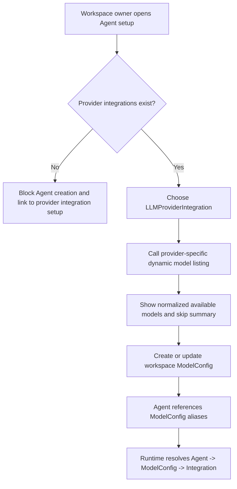
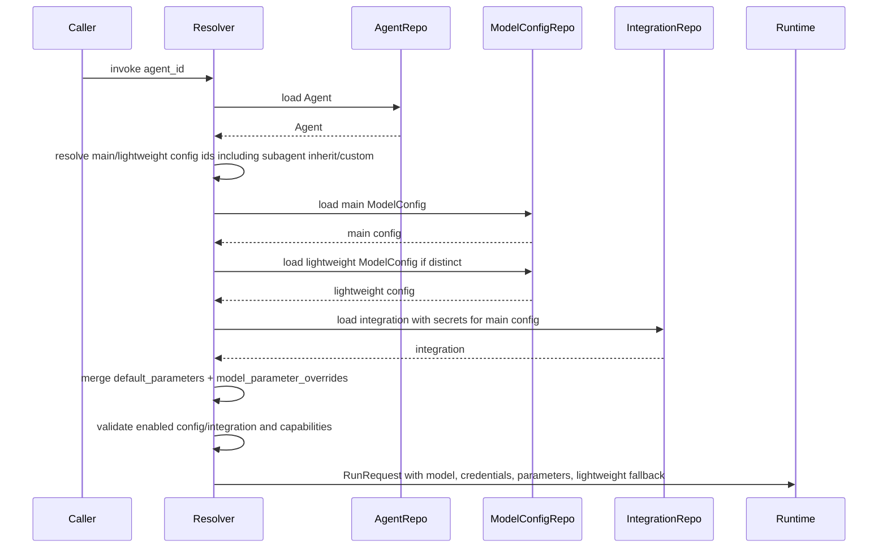

# Dynamic LLM ModelConfig Architecture Design

## 1. Problem / Background

Current nointern Agent directly references workspace `LLMProviderIntegration` and global
`LLMProviderModel`. Global `LLMProviderModel` stores provider-specific `model_identifier` and
capabilities, and `LLMModel` stores provider-neutral model metadata. This structure creates the
following pain points.

- Model list can vary by account/project/region/credential of workspace integration, but current catalog is global/provider-scoped.
- Because Agent directly references provider/model, changes to workspace-level presets such as default model, lightweight/summary model, coding model, and quota failover must be repeated across many Agents.
- `model_parameters.compaction_model_id` is expressed only as a separate model identifier inside the main model provider, so it cannot represent cases where lightweight model needs independent integration/config.
- Static catalog sync/API/router must continuously manage drift between listing freshness, runtime capability, and frontend option generation.
- Referencing listing/cache results by FK turns ephemeral discovery into durable domain identity.

This design removes static `LLMModel` / `LLMProviderModel` catalog and introduces workspace-level
`ModelConfig` alias/preset as the Agent runtime contract.

## 2. Goals

1. Completely stop static global/provider catalog management in Agent model selection.
2. Workspace first creates `LLMProviderIntegration`, then obtains dynamic model listing with that integration's credential/config.
3. Dynamic listing remains ephemeral and is not FK target of Agent/ModelConfig.
4. Introduce workspace-level `ModelConfig` as reusable alias/preset.
5. Agent references `ModelConfig` instead of directly selecting provider/model.
6. `ModelConfig` update is immediately reflected in referencing Agent runtime.
7. Represent main model and lightweight/summary model as separate FKs.
8. Determine runtime parameters by merging `ModelConfig.default_parameters` and `Agent.model_parameter_overrides`.
9. Model subagent inherit/custom behavior with explicit enum.
10. Losslessly migrate existing Agent data into shared ModelConfig and remove static tables/API/router in same feature.

## 3. Non-goals

- Do not provide ModelConfig change audit/history.
- Do not store Dynamic listing result in DB cache. If needed, design separate cache table not referenced by Agent or ModelConfig in a follow-up feature.
- Do not adminize provider-specific selectors in management UI. default/main and default lightweight selectors are provider-specific hardcoded logic in this scope.
- Do not newly build provider credential validation, billing, quota measurement, or automatic failover execution. Quota failover is only enabled as an operational pattern where one ModelConfig update is followed by referencing Agents.
- PR split, implementation phases, and per-file implementation checklist are not covered in this document.

## 4. Current state

### 4.1 Backend data model

- `llm_provider_integrations`
  - Stores workspace FK, provider enum, name, encrypted credentials, config JSONB, enabled.
  - Remains anchor where workspace owns provider credential/config.
- `llm_models`
  - Stores `slug` PK, model developer, name, description, source metadata.
  - Acts as provider-neutral static catalog.
- `llm_provider_models`
  - Stores uuid PK, provider, model_identifier, model_slug FK, capabilities JSONB, available,
    lifecycle status, source metadata.
  - `(provider, model_identifier)` is unique and it is Agent FK target.
- `agents`
  - Directly has FKs `llm_provider_integration_id` and `llm_provider_model_id`.
  - For `role=agent`, both values are NOT NULL; subagent inherit is represented with both values NULL.
  - Separately stores compaction/lightweight model identifier in `model_parameters.compaction_model_id`.

### 4.2 API / frontend / runtime

- Public Agent API accepts `llm_provider_integration_id` and `llm_provider_model` input/ref.
- Public llm-provider-model API and frontend `llm-provider-model` tRPC router query provider-specific available model list/detail from static catalog.
- `AgentForm` loads provider-specific model options after choosing integration and adjusts reasoning/builtin tool UI based on selected model capability.
- Runtime resolver loads in order Agent → `LLMProviderModel` → `LLMModel` → `LLMProviderIntegration` to build LiteLLM model string, max input tokens, model developer, and credentials.

## 5. Target state

### 5.1 Conceptual flow



### 5.2 Target ER diagram

```mermaid
erDiagram
    Workspace ||--o{ LLMProviderIntegration : owns
    Workspace ||--o{ ModelConfig : owns
    Workspace ||--o{ Agent : owns
    LLMProviderIntegration ||--o{ ModelConfig : anchors
    ModelConfig ||--o{ Agent : "main config"
    ModelConfig ||--o{ Agent : "lightweight config"
    Agent ||--o{ AgentSubagent : "parent of"
    AgentSubagent }o--|| Agent : "points to subagent"

    ModelConfig {
        varchar id PK
        varchar workspace_id FK
        varchar label
        varchar llm_provider_integration_id FK
        enum provider
        varchar model_identifier
        varchar model_display_name
        enum model_developer
        varchar model_family nullable
        jsonb normalized_capabilities
        jsonb model_snapshot
        jsonb source_metadata nullable
        jsonb default_parameters nullable
        boolean default_model
        boolean default_lightweight_model
        boolean enabled
        timestamptz last_refreshed_at nullable
        timestamptz created_at
        timestamptz updated_at
    }

    Agent {
        varchar id PK
        varchar workspace_id FK
        varchar model_config_id FK_nullable
        varchar lightweight_model_config_id FK_nullable
        enum model_config_inherit_mode
        jsonb model_parameter_overrides nullable
    }
```

## 6. Target data model

### 6.1 `LLMProviderIntegration`

`LLMProviderIntegration` remains the provider credential/config anchor.

- `workspace_id`, `provider`, `name`, `encrypted_credentials`, `config`, `enabled` stay conceptually intact.
- Model listing implementations receive an integration including secrets/config.
- Deleting an integration is restricted while any ModelConfig references it.
- Disabled integration still exists, but runtime resolution fails before provider call.

### 6.2 `ModelConfig` table

`ModelConfig` is a workspace-level reusable alias/preset, not a provider discovery row.

Required columns:

| Column | Semantics |
|---|---|
| `id` | uuid7 hex primary key |
| `workspace_id` | FK → `workspaces.id`, `ondelete=CASCADE` |
| `label` | Workspace-visible alias, e.g. `Main`, `Lightweight`, `Coding` |
| `llm_provider_integration_id` | FK → `llm_provider_integrations.id`, `ondelete=RESTRICT` |
| `provider` | Denormalized provider enum copied from integration for query/runtime display |
| `model_identifier` | Provider runtime model identifier after normalization |
| `model_display_name` | User-visible model name from normalized listing/snapshot |
| `model_developer` | Normalized developer/vendor needed by runtime built-in tool handling |
| `model_family` | Nullable normalized family/group |
| `normalized_capabilities` | JSONB runtime capability contract only |
| `model_snapshot` | JSONB normalized model info snapshot sufficient for runtime/debug UI |
| `source_metadata` | Nullable JSONB raw/provider/source detail for diagnostics, not runtime source of truth |
| `default_parameters` | Nullable JSONB whole-object preset parameters |
| `default_model` | Workspace default main config flag |
| `default_lightweight_model` | Workspace default lightweight/summary config flag |
| `enabled` | If false, runtime resolution hard-fails |
| `last_refreshed_at` | Nullable timestamp of latest successful source/listing refresh used for this snapshot |
| `created_at`, `updated_at` | timestamps |

Constraints and indexes:

- `unique(workspace_id, label)`.
- Partial unique default main: one row per workspace where `default_model = true`.
- Partial unique default lightweight: one row per workspace where `default_lightweight_model = true`.
- FK `workspace_id` → `workspaces.id` with cascade delete.
- FK `llm_provider_integration_id` → `llm_provider_integrations.id` with restrict delete.
- Index `workspace_id` for list pages.
- Index `llm_provider_integration_id` for integration delete validation and affected-config display.
- Optional check: `label` is non-empty after trimming at service/API validation level; DB may enforce a length constraint via column size.

Deletion rules:

- ModelConfig delete is blocked when referenced by any Agent as `model_config_id` or
  `lightweight_model_config_id`.
- Deleting a workspace cascades ModelConfigs through workspace ownership.
- Deleting a provider integration is blocked while ModelConfigs reference it.

### 6.3 Agent model fields

Agent replaces provider/model direct FK with ModelConfig refs.

- `model_config_id: str | None`
  - `role=agent`: required.
  - `role=subagent, model_config_inherit_mode=inherit`: must be null.
  - `role=subagent, model_config_inherit_mode=custom`: required.
- `lightweight_model_config_id: str | None`
  - `role=agent`: nullable; null means use main config as lightweight.
  - `role=subagent, inherit`: must be null; inherit parent main/lightweight pair.
  - `role=subagent, custom`: nullable; null means use custom main config as lightweight.
- `model_config_inherit_mode: inherit | custom`
  - For `role=agent`, stored mode is always `custom` and `model_config_id` is required.
  - For subagent, this explicit enum replaces the previous implicit “both model FKs null” signal.
- `model_parameter_overrides: JSONB | None`
  - Agent-specific whole-object override. Null means no override object.
- Existing `model_parameters` is split/migrated:
  - Runtime model parameter values move into `model_parameter_overrides` on Agent or
    `default_parameters` on ModelConfig depending on migration source.
  - Existing `compaction_model_id` is not preserved as a parameter key; it becomes
    `lightweight_model_config_id` where resolvable.

## 7. Provider dynamic listing contract

### 7.1 Interface shape

Provider listing implementations receive:

- workspace id / handle for authorization context,
- `LLMProviderIntegration` including decrypted secrets and non-secret config,
- optional query/filter context from API,
- a request purpose such as `user_listing` or `default_config_autocreate` if implementation needs different selector behavior.

They return:

- `models`: list of normalized model candidates,
- `summary`: source, fetched_at, counts,
- `skips`: grouped skip reasons for models that could not satisfy runtime contract,
- optional provider/source diagnostics safe for API exposure.

Normalized model candidate fields must cover the data needed to create/update ModelConfig:

- provider,
- model_identifier,
- model_display_name,
- model_developer,
- nullable model_family,
- normalized_capabilities,
- model_snapshot,
- nullable source_metadata,
- nullable last_refreshed_at.

Clients do not author these normalized fields. They display server-returned candidates and submit the selected candidate
identity, such as `model_identifier` plus any provider-specific source key needed to disambiguate the listing result.
Create/update handlers call the provider listing implementation again and persist the server-normalized candidate that
matches the submitted identity. If the candidate is no longer returned or no longer normalizes successfully, the request
fails instead of saving client-supplied model metadata.

### 7.2 Source policy

- Source is implementation-defined per provider.
- Models.dev may be used where it is sufficient.
- Provider official APIs, AWS Bedrock APIs, Google Vertex APIs, or hardcoded provider selectors may be
  used where they better represent account/project/region-specific availability.
- No DB cache is introduced in this feature.
- A listing failure affects the listing API and default auto-create attempt, but does not invalidate existing
  ModelConfig runtime snapshots.

### 7.3 Normalization failure

- A model that cannot satisfy runtime-required fields is excluded from user-visible listing.
- Skip reasons are summarized, e.g. missing developer, unsupported modality, missing context window,
  unsupported provider mapping, unavailable in integration region.
- Runtime contract uses `normalized_capabilities`; raw `source_metadata` is diagnostic only.

## 8. API surface

### 8.1 Removed API / router surface

Remove the static catalog surface in this feature:

- `llm_models` static table and service/repository/admin API.
- `llm_provider_models` static table and service/repository/public/admin API.
- catalog sync jobs/services and catalog source/override surfaces whose only purpose is maintaining the
  static model catalog.
- frontend `typescript/apps/nointern-web/src/trpc/routers/llm-provider-model.ts` and Agent form usage of
  provider-wide static model options.

### 8.2 Dynamic model listing API

Add integration-scoped listing under the workspace public API surface.

Conceptual endpoint:

- `GET /llm-provider-integration/v1/workspaces/{handle}/llm-provider-integrations/{integration_id}/models`

Behavior:

- Requires workspace member access.
- Verifies integration belongs to workspace.
- Uses the integration provider to dispatch to dynamic listing implementation.
- Returns normalized model candidates and skip/summary information.
- Does not persist listing rows.
- If integration is disabled, API returns a clear error rather than silently listing stale data.

### 8.3 ModelConfig API

Add workspace ModelConfig CRUD:

- `GET /model-config/v1/workspaces/{handle}/model-configs`
- `POST /model-config/v1/workspaces/{handle}/model-configs`
- `GET /model-config/v1/workspaces/{handle}/model-configs/{model_config_id}`
- `PATCH /model-config/v1/workspaces/{handle}/model-configs/{model_config_id}`
- `DELETE /model-config/v1/workspaces/{handle}/model-configs/{model_config_id}`

List/detail responses include:

- all user-facing ModelConfig fields,
- provider integration summary,
- referencing Agent count,
- default flags,
- enabled state,
- default parameters,
- source/refresh metadata safe for display.

Create/update semantics:

- Client sends label/default flags/default parameters, provider integration id, and selected model identity from the
  integration-scoped listing response.
- Server verifies integration belongs to workspace and calls the provider listing implementation server-side.
- Server persists the matching server-normalized candidate. It does not trust client-supplied capabilities,
  `model_snapshot`, `source_metadata`, or model developer fields.
- If the selected model identity is missing from the latest listing or fails normalization, create/update returns a
  validation error and stores nothing.
- `default_parameters` update uses whole-object replace:
  - omitted: unchanged,
  - explicit `null`: set null,
  - object: replace entire object.
- Changing `llm_provider_integration_id`, provider, and model fields is allowed.
- Setting a default flag true clears the same flag on the previous workspace default in the same transaction.
- Delete fails if referenced by Agent.

### 8.4 Agent API changes

Agent create/update uses ModelConfig refs instead of provider/model refs.

Create request concept:

- `model_config_id`
- `lightweight_model_config_id`
- `model_config_inherit_mode`
- `model_parameter_overrides`
- existing non-model Agent fields remain.
- For `role=agent`, `model_config_inherit_mode` is stored as `custom`; `inherit` is rejected.

Update semantics:

- `model_parameter_overrides` update uses whole-object replace:
  - omitted: unchanged,
  - explicit `null`: set null,
  - object: replace entire override object.
- Individual override removal is done by sending the full object without that key.
- For subagent inherit mode, model config FK fields must be null.
- For subagent custom mode, `model_config_id` is required and lightweight null means use custom main.
- For role agent, `model_config_id` is required and lightweight null means use main.

## 9. Default ModelConfig auto-create behavior

When a provider integration is created:

1. Check whether this is the workspace's first provider integration and the workspace has zero ModelConfigs.
2. If either condition is false, do not auto-create any ModelConfig.
3. If both conditions are true, call provider-specific listing/selector directly.
4. If selector finds normalized candidates, create:
   - default/main ModelConfig,
   - default lightweight ModelConfig.
5. If one or both selectors fail, create only configs with valid normalized candidates. If no candidate is found,
   create none and prompt manual config creation.

The second and later provider integrations never auto-create default configs, even if the first integration's selector
created no configs. In that case the UI prompts the user to create ModelConfigs manually. Provider-specific selectors
are hardcoded in this feature and intentionally not adminized.

## 10. Runtime resolution

### 10.1 Main flow



### 10.2 Resolution rules

- Load Agent and fail if disabled.
- Determine effective main/lightweight ModelConfig:
  - `role=agent`: use Agent main; lightweight uses Agent lightweight or main fallback.
  - `role=subagent, inherit`: use parent effective main/lightweight.
  - `role=subagent, custom`: use subagent main; lightweight uses subagent lightweight or custom main fallback.
- Load ModelConfig rows and fail if missing, wrong workspace, or disabled.
- Load `LLMProviderIntegration` from main ModelConfig and fail if missing/disabled.
- If lightweight config points to a different integration, load that integration as needed for compaction/summary
  calls. If runtime currently accepts only one credential set, implementation must extend the runtime request
  shape so lightweight calls receive the lightweight integration credentials; it must not silently force same-provider
  behavior.
- Build runtime model string from ModelConfig provider/model_identifier.
- Read max input tokens, reasoning support, tool support, and model developer from ModelConfig normalized fields.
- Merge parameters shallowly:
  - start from `ModelConfig.default_parameters` if present,
  - overlay `Agent.model_parameter_overrides` if present,
  - Agent override wins per key,
  - null values inside the object mean the effective parameter is intentionally null.

## 11. Migration strategy

Implementation must generate Alembic revision files via `alembic revision`; this design describes intended data
movement only.

1. Create `model_configs` and add new Agent columns.
2. For each workspace, group existing Agents by `(llm_provider_integration_id, llm_provider_model_id)`.
3. For each group, create one shared ModelConfig using existing integration, provider model, LLM model, and
   capability metadata.
4. Point all Agents in the group to the shared ModelConfig.
5. Choose `default_model=true` per workspace by most-used migrated config.
6. Derive lightweight configs:
   - If existing Agent `model_parameters.compaction_model_id` usage maps to known provider model data, create or
     reuse shared lightweight ModelConfig for that model and set `lightweight_model_config_id`.
   - If no compaction usage exists, choose default lightweight by provider-specific selector where possible.
   - If neither can be resolved, leave lightweight null so runtime uses main fallback.
7. Move existing non-compaction model parameter keys to `model_parameter_overrides` so Agent behavior remains
   equivalent after migration.
8. Backfill `model_config_inherit_mode`:
   - existing subagents with null model pair become `inherit` and have both new FK fields null,
   - existing subagents with explicit model pair become `custom`,
   - role agent rows become `custom` with required main config.
9. Add/validate NOT NULL, CHECK, FK, unique, and partial unique constraints after backfill.
10. Drop old Agent provider/model FK columns and static catalog tables/API assumptions in the same feature.

Rollback consideration:

- Because static catalog tables are removed in this feature, database rollback after table drop requires restoring
  from migration downgrade or backup. Rollout should verify migrated row counts before destructive drop in the same
  deployment plan.

## 12. Frontend UX behavior

- If workspace has no enabled provider integrations, Agent creation is blocked and the page directs the user to add
  a provider integration.
- Agent form no longer asks for provider and model directly. It asks for main ModelConfig and optional lightweight
  ModelConfig.
- Workspace settings or Agent setup must provide a ModelConfig management surface:
  - list ModelConfigs,
  - create from integration-scoped dynamic listing,
  - update label/default flags/default parameters/model snapshot,
  - disable/enable,
  - delete when unreferenced.
- When creating a ModelConfig, user chooses provider integration first; model options are loaded dynamically for that
  integration.
- Listing UI shows normalized candidates and a concise skip summary if some provider models were excluded.
- Updating a ModelConfig that is referenced by Agents shows a warning that the change affects all referencing Agents.
- Changing provider integration/model on a ModelConfig is allowed and should show an explicit provider changed warning.
- If the first provider integration auto-creates default configs, Agent create can preselect workspace default main
  and default lightweight configs.
- If auto-create creates no config, Agent creation is blocked until the user manually creates at least one main
  ModelConfig.

## 13. Failure modes / safeguards

| Failure mode | Expected behavior |
|---|---|
| No provider integration | Agent creation blocked; user is directed to integration setup |
| Integration disabled | Listing API errors; runtime hard-fails for configs using it |
| Listing source/provider API failure | Listing and auto-create fail gracefully; existing ModelConfig runtime snapshots keep working |
| Listing normalization skips all models | No user-visible options; skip summary explains why; auto-create creates none |
| ModelConfig disabled | Referencing Agent runtime hard-fails |
| ModelConfig deleted while referenced | Delete blocked |
| Provider integration delete while ModelConfig references it | Delete blocked |
| ModelConfig provider changed | Allowed; UI warns referencing Agents are affected |
| Lightweight config missing/null | Runtime falls back according to role/mode rules |
| Subagent inherit/custom invalid FK combination | API/service validation rejects; DB CHECK protects stored data |
| Partial parameter patch attempt | API treats object as whole replacement; clients must send full object |

## 14. Acceptance criteria

- Static `LLMModel` / `LLMProviderModel` catalog is not used for Agent model selection.
- Agent records reference ModelConfig aliases and not provider/model catalog rows.
- Dynamic model listing is scoped to a provider integration and does not persist listing rows.
- ModelConfig update immediately affects all referencing Agents at runtime.
- Default main/lightweight configs are auto-created only for the first provider integration when the workspace has
  zero ModelConfigs and selectors find normalized candidates.
- Provider listing normalization excludes models that cannot satisfy runtime contract and reports skip summaries.
- Agent runtime resolves main/lightweight configs, integration credentials, normalized capabilities, and merged
  parameters correctly.
- Subagent inherit/custom rules are explicit and enforced.
- Existing Agent data migrates to one shared ModelConfig per workspace per existing integration/provider-model
  combination.
- Static catalog API/router/UI surfaces are removed in the same feature.

## 15. Test Strategy

### 15.1 E2E primary verification matrix

| Behavior | E2E primary requirement |
|---|---|
| Provider integration creates defaults | Create first provider integration in empty workspace; verify default/main and default lightweight ModelConfigs are created when selectors return candidates |
| Agent create uses defaults | With default configs present, create Agent without direct provider/model selection and verify selected ModelConfig refs |
| No provider integration blocks Agent create | In workspace without enabled integrations, Agent create UI/API blocks and directs to integration setup |
| Dynamic listing | Select integration, call listing, verify normalized model options and skip summary shape |
| ModelConfig create/update affects runtime | Create Agent referencing ModelConfig, update ModelConfig model/parameters, invoke runtime resolution and verify new config is used |
| Parameter merge | Set ModelConfig defaults and Agent overrides; verify Agent override wins and null/object semantics are preserved |
| Lightweight fallback | Verify null lightweight uses main for role agent and custom subagent; verify explicit lightweight uses separate config |
| Subagent inherit/custom | Verify inherit uses parent main/lightweight and custom uses subagent configs with nullable lightweight fallback |
| Delete safeguards | Verify referenced ModelConfig delete is rejected and unreferenced delete succeeds |
| Migration integrity | Seed existing provider/model Agents; run migration; verify shared ModelConfig grouping and Agent refs |

### 15.2 Fixture / prerequisite needs

- E2E must have a provider integration fixture whose listing implementation can return deterministic normalized
  candidates without live paid provider dependency.
- At least one fixture should include skipped source models to verify skip summary behavior.
- Migration tests need seed data with:
  - two Agents sharing the same `(integration, provider_model)` pair,
  - one Agent using a different pair,
  - subagent inherit row,
  - subagent custom row,
  - compaction usage where mapping is resolvable,
  - compaction usage absent to exercise selector fallback.
- Credential/prerequisite snapshot should record which providers use fake deterministic listing versus optional live
  listing. Live provider tests should be optional and skipped when credentials are absent, not silently treated as
  product behavior coverage.

### 15.3 Evidence and CI policy

- CI-required E2E should use deterministic fixtures and no live provider network dependency.
- Optional live provider listing diagnostics may run separately and must report skip/fail reason explicitly.
- Evidence should include API response excerpts for ModelConfig defaults, Agent refs, runtime resolution result, and
  migration row count/grouping assertions.

### 15.4 QA Checklist

#### QA-1. Provider integration creates default ModelConfigs

##### What to check

Create the first provider integration in an empty workspace and verify that default main and default lightweight
ModelConfigs are auto-created only when provider selectors return normalized candidates.

##### Why it matters

This is the main UX simplification that lets users move from provider setup to Agent creation without manually learning
the ModelConfig layer first.

##### How to check

Run E2E with a deterministic provider listing fixture that returns normalized main/lightweight candidates and a second
fixture where selectors cannot find candidates.

##### Expected result

The first integration creates default ModelConfigs in the successful fixture, creates no invalid configs in the empty
fixture, and later provider integrations do not auto-create additional defaults.

##### Execution result

2026-05-17 verification evidence collected. `testenv/nointern/e2e` deterministic suite includes first-integration default
ModelConfig creation through the public integration path and ModelConfig readiness coverage for normalized candidates and
skip summaries. Backend `ModelListingService` tests cover success, main-only, and no-candidate deterministic variants.

##### Fixes applied

Phase 5 added deterministic listing fixtures and changed lightweight default selection to return no candidate when no
lightweight keyword matches, so partial selector success no longer creates a misleading lightweight default.

#### QA-2. Agent creation uses default ModelConfigs

##### What to check

Create an Agent in a workspace with default ModelConfigs and verify the form/API selects ModelConfig aliases instead of
direct provider/model values.

##### Why it matters

Agent creation must become alias-driven; otherwise the static provider model selection UX remains in the product.

##### How to check

Run E2E through the Agent creation flow and inspect the create response/read model for `model_config_id` and optional
`lightweight_model_config_id`.

##### Expected result

The Agent stores ModelConfig refs, does not store provider/model catalog refs, and uses main fallback when lightweight is
null.

##### Execution result

2026-05-17 verification evidence collected. Deterministic public Agent E2E creates Agents with `model_config_id` and no static
provider-model payload. Full deterministic E2E result: 129 passed, 11 skipped, 2 deselected.

##### Fixes applied

Phase 4/5 migrated deterministic Agent and Toolkit E2E helpers from `LLMProviderModelInput` to ModelConfig IDs.

#### QA-3. ModelConfig update changes referenced Agent runtime resolution

##### What to check

Update a ModelConfig that is referenced by an Agent and verify the next runtime resolution uses the updated provider,
model identifier, capabilities, and default parameters.

##### Why it matters

The central use case is quota/failover or preset tuning by editing one ModelConfig instead of every Agent.

##### How to check

Run service/E2E coverage that creates an Agent, updates its referenced ModelConfig, then invokes or inspects runtime
resolution output.

##### Expected result

The Agent follows the latest ModelConfig, Agent overrides still win over ModelConfig defaults, and disabled ModelConfigs
hard-fail.

##### Execution result

2026-05-17 verification evidence collected at service/runtime level. Backend full suite result: 1569 passed. Runtime resolver tests
cover ModelConfig resolution, disabled config/integration failures, separate lightweight integration credentials, and
default/override parameter merge.

##### Fixes applied

Phase 3 added runtime ModelConfig resolution and guarded invalid merged parameters. Phase 5 verification found no new
fixes for this checklist item.

#### QA-4. Subagent inherit/custom behavior

##### What to check

Verify `model_config_inherit_mode=inherit` inherits parent main/lightweight configs, while `custom` requires main config
and treats null lightweight as custom main fallback.

##### Why it matters

Subagent model resolution had implicit null-pair semantics; the new explicit mode must preserve inherit behavior without
ambiguous null meanings.

##### How to check

Run E2E/service tests for parent Agent, inheriting subagent, custom subagent with null lightweight, and invalid custom
payloads.

##### Expected result

Valid inherit/custom combinations resolve correctly and invalid FK/mode combinations are rejected by API/service/DB
constraints.

##### Execution result

2026-05-17 verification evidence collected. Backend runtime/tool tests cover inherit/custom subagent resolution and invalid payload
handling. Deterministic E2E also exercises Agent creation paths that now use ModelConfig references.

##### Fixes applied

Phase 3 changed inherit semantics to use explicit `model_config_inherit_mode`; verification found no new fixes for this
checklist item.

#### QA-5. No provider integration blocks Agent creation

##### What to check

Open or call Agent creation in a workspace without enabled provider integrations.

##### Why it matters

The new flow starts from provider integration. Creating an Agent without a provider integration would produce a broken
ModelConfig selection path.

##### How to check

Run frontend/API E2E for an empty workspace and assert the create action is blocked with guidance to add an integration.

##### Expected result

Agent creation cannot proceed until an enabled provider integration and at least one usable ModelConfig exist.

##### Execution result

2026-05-17 verification evidence collected for backend/API and frontend type safety. nointern-web typecheck/lint passed,
and backend/service tests cover missing config/integration rejection paths. Empty-workspace browser E2E evidence remains
part of the broader frontend/manual verification gap rather than a completed assertion in this PR.

##### Fixes applied

Phase 4 blocks Agent creation when no usable enabled ModelConfig option exists in the form state. Verification found no
new fixes for this checklist item.

#### QA-6. Migration data integrity

##### What to check

Migrate seeded existing Agents using multiple provider/model combinations, subagent inherit/custom rows, and compaction
usage.

##### Why it matters

The feature removes static catalog tables in the same work, so migration must preserve existing Agent runtime behavior
before destructive cleanup.

##### How to check

Run migration tests with seeded rows and assert ModelConfig grouping, Agent FK backfill, default flag selection, and old
table/column removal.

##### Expected result

Each workspace gets one shared ModelConfig per existing `(integration, provider_model)` combination, Agents point to the
right configs, inherited subagents keep inherit mode, and static catalog tables are removed.

##### Execution result

2026-05-17 partial verification evidence collected through repository/migration-test coverage in the full backend suite.
Historical pre-drop migration harness remains a verification gap because current deterministic fixtures start from head
schema, so this checklist item is not fully closed by this PR.

##### Fixes applied

Phase 1 added migration/backfill assertions and repository invariants. Phase 5 audit records the missing historical
migration harness as a remaining verification gap rather than hiding it.

#### QA-7. Static catalog API/router removed

##### What to check

Verify backend static model catalog APIs and frontend `llm-provider-model` router usage are removed from Agent model
selection.

##### Why it matters

Leaving static catalog selection paths behind would contradict the core architecture decision.

##### How to check

Run API/client generation, TypeScript typecheck, and targeted frontend E2E or component tests for ModelConfig selection.

##### Expected result

Agent UI/API depends on dynamic integration listing and ModelConfig APIs only; no static `LLMModel`/`LLMProviderModel`
selection path remains.

##### Execution result

2026-05-17 partial verification evidence collected for active API/frontend removal checks. Public/admin OpenAPI
regeneration remained clean, nointern generated client typecheck passed, nointern-web lint/typecheck passed, and the
static catalog audit reports the remaining inventory for cleanup/spec promotion. Targeted browser/component evidence for
the ModelConfig selection UI remains outside this PR's completed evidence.

##### Fixes applied

Phase 4 removed active static catalog route mounts and nointern-web static model router usage. Phase 5 added the audit
helper used to inventory remaining static catalog references, and cleanup promoted it from a phase-specific helper to a
durable static catalog audit script.

## 16. Alternatives considered

### 16.1 Keep static catalog with external sync

This keeps global/provider catalog rows and syncs them from external sources. It improves manual CRUD pain but does
not solve integration-scoped availability or workspace preset management. Rejected because the feature goal is to
stop managing static `LLMModel` / `LLMProviderModel` catalog for Agent selection.

### 16.2 Repurpose `llm_provider_models` as cache

This reuses existing schema for dynamic discovery cache. Rejected because it blurs static catalog, cache, and runtime
identity, and risks making ephemeral listing rows FK targets again.

### 16.3 Copy model snapshot onto each Agent

This removes ModelConfig joins but prevents shared preset updates. Rejected because updating a config once must affect
all referencing Agents.

### 16.4 No ModelConfig layer; Agent stores integration + model identifier

This is simpler than ModelConfig but does not support reusable default/main/lightweight/coding/quota presets. Rejected
because Agent should reference aliases, not provider/model directly.

### 16.5 Nested patch semantics for parameters

Nested patch would let clients update one key at a time, but it makes omission/null/removal semantics ambiguous.
Rejected in favor of whole-object replace with explicit field omission/null semantics.

### 16.6 Add audit/history now

Audit/history would help explain ModelConfig changes but expands schema, UI, and retention policy. Rejected for this
scope; only minimal safeguards are included.

## 17. Implementation notes

- ModelConfig public API uses the `/model-config/v1` prefix in this feature.
- Initial provider-specific hardcoded selectors are implementation detail, but they must only select normalized models
  returned by the provider listing contract.
- If lightweight config uses a different provider integration than main, runtime request structures must support
  separate credentials. Implementation must extend runtime input rather than constraining the product behavior to
  same-integration lightweight configs.
