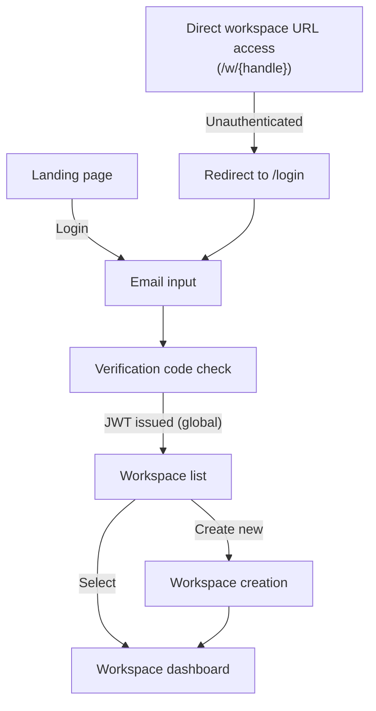
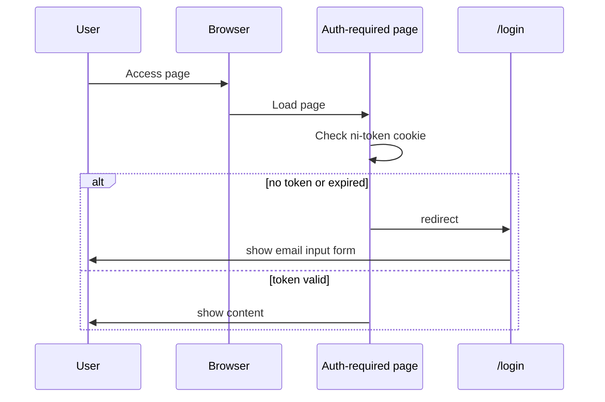
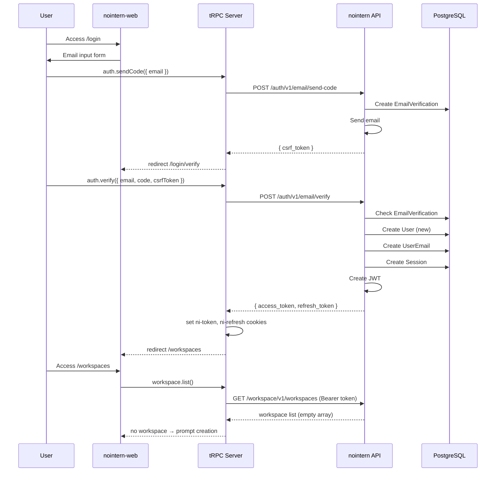
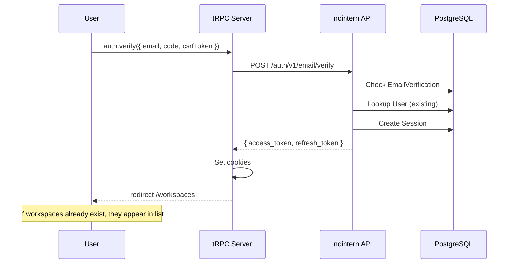

# Unified Email Authentication Design

## Overview

Unify login and signup with a single email authentication flow. Based on global User model, one login grants access to all workspaces.

### Authentication Flow



### Key Changes (compared to previous)

| Item | Previous | Change |
|------|------|------|
| User model | Independent per Workspace (WorkspaceUserIdentity) | global User + workspace membership |
| Token system | email_token + workspace_token (2 steps) | single access_token (global) |
| Login flow | email verification → workspace selection → workspace login | email verification → issue JWT immediately |
| Cookies | `ni-email-token`, `ni-ws-token`, `ni-ws-refresh` (3) | `ni-token`, `ni-refresh` (2) |

## JWT Token System

### Access Token

| Item | Content |
|------|------|
| **Purpose** | All API access (global) |
| **Issued when** | email verification code succeeds, token refresh |
| **Expiration** | 30 minutes |

**JWT Payload:**
```json
{
  "sub": "<user_id>",
  "sid": "<session_id>",
  "exp": "<timestamp>",
  "iat": "<timestamp>"
}
```

### Refresh Token

| Item | Content |
|------|------|
| **Purpose** | Refresh Access Token |
| **Issued when** | authentication succeeds, token refresh |
| **Expiration** | 180 days |

## Backend API Design

### Auth API (`/auth/v1/`)

#### 1. Send email verification code
```
POST /auth/v1/email/send-code
Body: { email: string }
Response: { csrf_token: string }
```

#### 2. Verify email verification code
```
POST /auth/v1/email/verify
Body: { email: string, code: string, csrf_token: string }
Response: { access_token: string, refresh_token: string, expires_in: number }
```
- If new email, automatically create User.
- If existing email, log in as existing User.
- Create Session and issue JWT.

#### 3. Refresh token
```
POST /auth/v1/token/refresh
Body: { refresh_token: string }
Response: { access_token: string, refresh_token: string, expires_in: number }
```

#### 4. Logout
```
POST /auth/v1/logout
Headers: Authorization: Bearer <access_token>
Response: 204
```

### Workspace API (`/workspace/v1/`)

#### List workspaces (auth required)
```
GET /workspace/v1/workspaces
Headers: Authorization: Bearer <access_token>
Response: { items: [...], total: number }
```
- Extract user_id from access_token.
- Query all workspaces where that User participates as WorkspaceUser.

#### Create workspace (auth required)
```
POST /workspace/v1/workspaces
Headers: Authorization: Bearer <access_token>
Body: { workspace_name, workspace_handle, owner_name, locale? }
Response: { workspace_handle: string }
```
- Create workspace + automatically register creator as Owner.

#### Get workspace (public)
```
GET /workspace/v1/workspaces/{handle}
Response: { name: string, handle: string }
```

## Frontend Routing Design

### Route Structure

| Path | Page | Auth |
|------|--------|------|
| `/` | landing page | none |
| `/login` | email input | none |
| `/login/verify` | verification code input | none |
| `/workspaces` | workspace list | access_token required |
| `/workspaces/create` | workspace creation form | access_token required |
| `/w/{handle}` | workspace dashboard | access_token required |

### Auth Guard



### Token Storage

| Token | Storage location | Cookie key | maxAge |
|------|-----------|---------|--------|
| access_token | httpOnly cookie (server-side) | `ni-token` | none (session) |
| refresh_token | httpOnly cookie (server-side) | `ni-refresh` | 30 days |
| expiration time | httpOnly cookie (server-side) | `ni-token-expires-at` | none (session) |

All tokens are managed by server as **httpOnly cookies**. Request interceptor in tRPC context checks token expiration before each API call and refreshes automatically when needed. Cookie setting is handled by Set-Cookie header through tRPC `resHeaders`.

## Authentication Sequence Diagrams

### Login (new user)



### Login (existing user)



## Implementation Files

### Backend

```
python/apps/nointern/src/nointern/
├── rdb/models/
│   ├── global_user.py           # RDBUser model
│   ├── user_email.py            # RDBUserEmail model
│   └── email_verification.py    # RDBEmailVerification model
├── repos/
│   ├── global_user/             # User CRUD
│   ├── user_email/              # UserEmail CRUD
│   └── email_verification/      # EmailVerification management
├── services/auth/               # Unified AuthService (send_code, verify, refresh, logout)
├── core/auth/
│   ├── jwt.py                   # JWT create/verify (sub=user_id, sid=session_id)
│   └── deps.py                  # CurrentUser, WorkspaceMember dependency
└── api/public/auth/v1/          # Public auth endpoints
```

### Frontend

```
typescript/apps/nointern-web/src/
├── shared/lib/
│   ├── cookies.ts               # cookie utilities (read/write, expiration check, Set-Cookie builder)
│   └── getInitialAuthState.ts   # server-side auth state check
├── trpc/
│   ├── context.ts               # Request interceptor, proactive token refresh
│   └── routers/
│       ├── auth.ts              # sendCode, verify, refreshToken, logout
│       └── workspace.ts         # list, create
├── features/
│   ├── auth/                    # login/verification code check
│   └── workspaces/              # workspace list/create
└── app/
    ├── login/page.tsx
    ├── login/verify/page.tsx
    ├── workspaces/page.tsx
    └── workspaces/create/page.tsx
```
