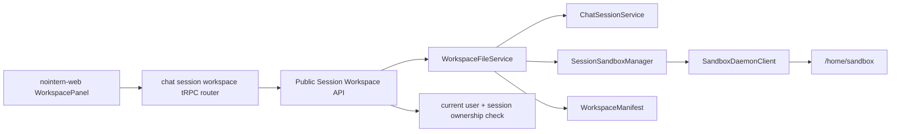
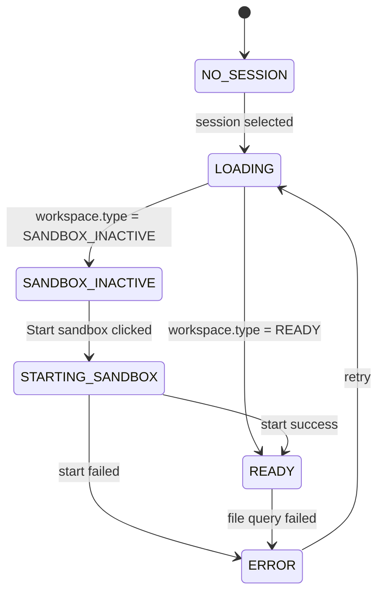
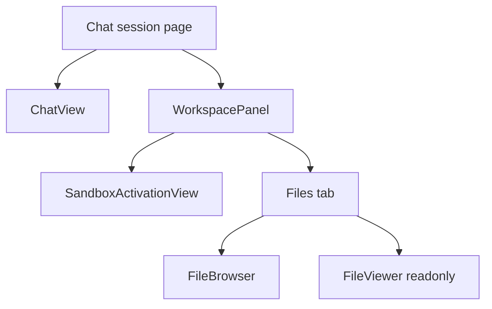

# Enhanced File Browser Design

## Implementation Status

✅ **Implementation complete** — Enhanced File Browser readonly MVP completed design, implementation, audit, spec sync, and testenv QA across stacked PRs [#3229](https://github.com/azents/azents/pull/3229) through [#3243](https://github.com/azents/azents/pull/3243).

| Stage | PR | Deliverable |
|---|---|---|
| Design | [#3229](https://github.com/azents/azents/pull/3229) | this design and ADR-0005 |
| Implementation plan | [#3230](https://github.com/azents/azents/pull/3230) | phase-by-phase stacked PR plan |
| Phase 1 — old browser drop | [#3231](https://github.com/azents/azents/pull/3231) | removed old session-data browser UI/tRPC |
| Phase 2 — backend API | [#3232](https://github.com/azents/azents/pull/3232) | session workspace API, OpenAPI/client update |
| Phase 3 — frontend panel | [#3233](https://github.com/azents/azents/pull/3233) | workspace panel, activation view, browser/viewer MVP |
| Phase 4 — rich preview | [#3234](https://github.com/azents/azents/pull/3234) | image/Markdown/JSON/CSV/text preview, fallback/download |
| Phase 5 — design/code audit | [#3239](https://github.com/azents/azents/pull/3239) | design-implementation audit report |
| Phase 6 — spec sync | [#3240](https://github.com/azents/azents/pull/3240) | Conversation/Agent/Workspace spec sync |
| Phase 7 — testenv QA | [#3243](https://github.com/azents/azents/pull/3243) | workspace browser QA based on TC-WEB-008 |

Git diff, workspace edit/delete, and live sync were excluded from MVP scope and require follow-up design.

## Overview

Enhanced File Browser is a feature for browsing `/home/sandbox`, the session workspace of a NoIntern chat session, from Web UI. Existing session data browser is a modal showing attachment/upload file storage, so this design drops existing browser UX and creates new session-workspace-specific API and panel UI.

User scenario:

1. User enters chat session.
2. If user has not sent message and has not clicked `Start sandbox` CTA, do not start/resume sandbox.
3. If user sends message or clicks `Start sandbox` CTA, attempt sandbox start/resume.
4. Workspace panel shows `/home/sandbox` file tree when sandbox is active.
5. If sandbox is inactive, show `Start sandbox` CTA instead of file list.
6. In MVP, user can browse, read, preview, and download files.

Implementation scope:

- Included: old browser UX drop, readonly session workspace API, sandbox active/inactive state, frontend panel, Storybook state fixture.
- Excluded: Git diff, edit/save/delete, optimistic concurrency, live sync.

## Terminology

| Term | Definition |
|---|---|
| Session workspace | sandbox filesystem view of a specific chat session. Logical root is always `/home/sandbox`, and source of truth of files seen by agent in shell and UI browser is same. |
| Product workspace | existing NoIntern domain concept of workspace membership/handle/agent grouping. Different from session workspace in this document and not directly accepted in API request. |
| Session data | attachment/upload file storage. Existing `session-data` API area and not source of truth for session workspace browser. |
| Workspace panel | session workspace browsing UI attached next to nointern-web chat screen. On mobile, can be drawer/modal. |

Use explicit `session workspace` in public surface, code docs, operation names to avoid confusion with product workspace.

## Discussion Points and Decisions

Detailed discussion: GitHub Discussion #3202.

| Point | Decision | Core rationale |
|---|---|---|
| Existing browser handling | Drop `SessionExplorer` based session data browser | New feature is `/home/sandbox` browser and has different source of truth from session data |
| API boundary | Define new session workspace API without reusing `session-data` | Separate lifecycle of existing upload/attachment API and runtime session workspace API |
| Sandbox lifecycle | Show content only when active, CTA `Start sandbox` when inactive | Prevent user from misunderstanding empty browser as error |
| Manifest | Define new `WorkspaceManifest` contract, no capability flags | Separate SDK manifest/run state and UI browser contract; express permissions/preview availability through response shape |
| Frontend structure | Add new feature slice `src/features/chat/workspace/` | Easier to independently model panel/drawer state than extending existing modal |
| MVP permission | readonly | editing/concurrency design split into separate phase |
| Git diff | defer until after rich preview | Git state not required for readonly MVP |

### Decision 1. Public Session Workspace API boundary

Do not extend existing `session-data` browser/API. Treat `session-data` API as absent in design and define new `/home/sandbox` session workspace API. This decision is not merely endpoint naming but separates product surface source of truth.

- session workspace API fixes `/home/sandbox` as root.
- request does not accept `agent_id`. Route verifies session access with `session_id` and current user, and derives `agent_id` / `workspace_id` from session.
- path is normalized/confined in service layer.
- MVP is readonly, so public surface exposes only list/read/download/preview.
- `PUT` / `DELETE` / save conflict are split into follow-up editing phase.
- Git status/diff API is also excluded from MVP and split into follow-up Git phase.
- OpenAPI operation names use `get_session_workspace`, `start_session_workspace_sandbox`, `read_session_workspace_path`, `download_session_workspace_file` to distinguish from product workspace.

Existing session data upload/download primitive can remain for attachment feature for now. But session workspace panel/browser does not call that API.

### Decision 2. Sandbox lifecycle is part of session UX

Workspace panel shows file content only when sandbox is active. If sandbox is inactive, do not attempt file list/read; show activation view.

- Primary CTA label in inactive screen is `Start sandbox`.
- CTA click calls `POST /workspace/sandbox/start`.
- After start/resume success, refetch `GET /workspace` and transition to `READY`.
- Entering/creating web chat session alone does not attempt sandbox start/resume.
- First message send path and `Start sandbox` CTA path are sandbox start/resume triggers.

This policy avoids creating sandbox resources just by entering empty session, while making workspace lifecycle predictably transition when user actually starts work by first message or explicit CTA. Later resources are controlled by idle timeout / hibernate.

### Decision 3. Workspace manifest is separate from SDK manifest

`WorkspaceManifest` does not reuse SDK run state or SDK manifest. SDK manifest is agent runtime contract, while Workspace manifest is user-facing file browser contract.

- Top-level response is `SANDBOX_INACTIVE | READY` union.
- `READY` includes `WorkspaceManifest`.
- `root` is fixed to `/home/sandbox`.
- `cwd` indicates current base path and starts with `/home/sandbox` in MVP.
- `entries` are immediate children of current directory.
- `git` is `null` or optional in MVP and filled in Git phase.
- MVP has no capability flags. readonly/edit availability is represented by endpoint surface, and preview availability is determined by file response `text`, `media_type`, `truncated`, and frontend fallback renderer. Do not pre-add PDF/image/Office capability.

### Decision 4. Frontend is a new feature slice

Do not extend existing `SessionExplorer` modal; add new feature slice under `typescript/apps/nointern-web/src/features/chat/workspace/`.

- Desktop: side panel next to chat layout.
- Mobile: drawer or modal.
- State: convert query state to ADT instead of passing directly into component.
- Storybook: verify inactive/starting/ready/mobile states as fixtures based on main branch Storybook setup.

### Decision 5. Editing/concurrency is outside MVP

In MVP, user cannot directly edit files. Because agent can also modify same `/home/sandbox` files, conflict UX is mandatory if save/write/delete is added, and that is separate product decision.

Options to revisit in follow-up editing phase:

- full-file save + `expectedHash` / `etag`
- patch-based editor protocol
- suggested patch / apply flow for agent-authored files without editor

### Decision 6. Rollout is Preview before Git

Readonly MVP completes file browser + preview before Git diff. Git diff needs repo detection, status/diff calculation, dirty badge, file diff toggle, so it is deferred until after Rich preview phase.

## Architecture



Core principles:

- route calls service after current user auth and session access verification.
- service combines sandbox state and file operations using `SessionSandboxManager` and `SandboxDaemonClient`.
- frontend renders based on `WorkspaceManifest` and `WorkspacePanelState` ADT.
- sandbox daemon is not directly exposed to Web.

## Backend Design

### Service

New service candidate:

```python
class WorkspaceFileService:
    """Session workspace file query service."""

    async def get_workspace(self, session_id: str, user_id: str) -> WorkspaceState: ...
    async def start_sandbox(self, session_id: str, user_id: str) -> WorkspaceState: ...
    async def list_files(self, session_id: str, user_id: str, path: str) -> WorkspaceDirectory: ...
    async def read_file(self, session_id: str, user_id: str, path: str) -> WorkspaceFileContent: ...
```

Implementation notes:

- Verify session owner through `ChatSessionService` or existing repository path.
- If `SessionSandboxManager.get(session_id)` returns `None`, API returns `SANDBOX_INACTIVE`.
- `POST /workspace/sandbox/start` calls `SessionSandboxManager.get_or_allocate(...)`.
- `agent_id`, `workspace_id`, domain config, stdio MCP config needed by `get_or_allocate` are constructed same as existing runtime resolve path used by shell tool.
- file list/read/download obtains daemon client through `SessionSandboxManager.get_file_storage(session_id)` and permits only paths under `/home/sandbox`.

### Runtime dependency boundary

Route does not directly call sandbox daemon. public API route only owns these responsibilities.

1. Verify current user auth.
2. Validate `session_id` format.
3. Verify session ownership / workspace membership.
4. Convert request DTO to service DTO.

`WorkspaceFileService` receives following dependencies through constructor/DI.

| Dependency | Purpose |
|---|---|
| `ChatSessionService` or `ConversationSessionRepository` | session access check, `agent_id` / `workspace_id` query |
| `SessionSandboxManager` | active state check, start/resume, daemon file storage acquisition |
| `SandboxDomainConfig` resolver | apply same domain policy as shell tool on sandbox start/resume |
| stdio MCP config resolver | keep sidecar configuration aligned with shell tool on sandbox start/resume |

`SessionSandboxManager` is not newly created per request. app-level singleton/proxy lets worker/tool/public API observe same lifecycle cache.

### Path confinement

All session workspace file APIs fix logical root to `/home/sandbox`.

Rules:

- request path can be absolute `/home/sandbox/...` or root-relative, but service-internal canonical path must stay under `/home/sandbox`.
- `..`, symlink escape, absolute path outside root are rejected with 403.
- directory list does not hide hidden files. Files seen by sandbox user in shell and browser must not differ.
- binary/large file expresses preview limit in read API with `text=null` or `truncated=true`, guiding to download API.

Normalization rule:

```python
WORKSPACE_ROOT = PurePosixPath("/home/sandbox")

def normalize_workspace_path(raw_path: str | None) -> PurePosixPath:
    if raw_path is None or raw_path in {"", "."}:
        return WORKSPACE_ROOT
    path = PurePosixPath(raw_path)
    if not path.is_absolute():
        path = WORKSPACE_ROOT / path
    normalized = PurePosixPath(posixpath.normpath(path.as_posix()))
    if normalized != WORKSPACE_ROOT and WORKSPACE_ROOT not in normalized.parents:
        raise WorkspacePathError
    return normalized
```

If daemon/stat step can identify actual symlink target, block symlink escape. In MVP, if daemon does not provide symlink target metadata, public API first applies path normalization and leaves symlink hardening as daemon metadata extension task.

Path error mapping:

| Condition | Response |
|---|---|
| absolute path outside root, `..` escape | `403`, `detail="Session workspace path access denied."` |
| nonexistent path | `404`, `detail="File not found."` |
| download request for directory | `400`, `detail="Path is not a file."` |
| daemon read failure | `400`, pass daemon detail |
| preview byte limit exceeded | `413`, `detail="File is too large to preview..."` |

Preview byte limit is distinct from response truncation. If entire file size exceeds preview limit, return `WorkspaceFileTooLarge` as `413`. If file size is within limit but daemon returns more bytes, express with `truncated=true` and truncated UTF-8 prefix.

## API

MVP public session workspace API:

| Method | Path | Purpose |
|---|---|---|
| `GET` | `/chat/v1/sessions/{session_id}/workspace` | query sandbox state and root manifest |
| `POST` | `/chat/v1/sessions/{session_id}/workspace/sandbox/start` | request sandbox start/resume |
| `GET` | `/chat/v1/sessions/{session_id}/workspace/files?path=/home/sandbox/foo.ts` | query file or directory |
| `GET` | `/chat/v1/sessions/{session_id}/workspace/download?path=/home/sandbox/foo.pdf` | download file |

`GET /workspace` response is defined as discriminated union. Public API JSON uses snake_case by Python/Pydantic convention, and nointern-web tRPC boundary maps to camelCase for frontend ADT.

```json
{
  "type": "SANDBOX_INACTIVE",
  "can_start_sandbox": true,
  "reason": "NOT_STARTED",
  "action": {
    "type": "START_SANDBOX",
    "method": "POST",
    "path": "/chat/v1/sessions/{session_id}/workspace/sandbox/start"
  }
}
```

`SANDBOX_INACTIVE` is normal state, so `GET /workspace` returns `200 OK`. In contrast, file read/list/download endpoints cannot return file content when inactive, so they return `409 Conflict` with error body below.

```json
{
  "code": "SANDBOX_INACTIVE",
  "message": "Sandbox is not running.",
  "action": {
    "type": "START_SANDBOX",
    "method": "POST",
    "path": "/chat/v1/sessions/{session_id}/workspace/sandbox/start"
  }
}
```

```json
{
  "type": "READY",
  "manifest": {
    "root": "/home/sandbox",
    "cwd": "/home/sandbox",
    "entries": [],
    "git": null
  }
}
```

No capability flag is included in `manifest`. In MVP, there is no edit endpoint, so non-editable state is not represented as separate flag. Download is provided by constructing download endpoint after file response, and preview availability is determined by `media_type`, `text`, `truncated`.

### Response model contract

| Model | Field | Type | Meaning |
|---|---|---|---|
| `WorkspaceActionResponse` | `type` | `"START_SANDBOX"` | recommended action for UI |
|  | `method` | `"POST"` | call method |
|  | `path` | string | `POST /chat/v1/sessions/{session_id}/workspace/sandbox/start` |
| `WorkspaceInactiveResponse` | `type` | `"SANDBOX_INACTIVE"` | normal bootstrap inactive state |
|  | `can_start_sandbox` | boolean | whether current user can click start CTA |
|  | `reason` | `"NOT_STARTED"` | inactive reason |
|  | `action` | `WorkspaceActionResponse` | endpoint called by CTA |
| `WorkspaceReadyResponse` | `type` | `"READY"` | session workspace queryable state |
|  | `manifest` | `WorkspaceManifestResponse` | root manifest |
| `WorkspaceManifestResponse` | `root` | string | always `/home/sandbox` |
|  | `cwd` | string | `/home/sandbox` in MVP |
|  | `entries` | `WorkspaceEntryResponse[]` | immediate children of current directory |
|  | `git` | `null` | `null` before Git phase |
| `WorkspaceEntryResponse` | `name` | string | basename |
|  | `path` | string | absolute path under `/home/sandbox` |
|  | `kind` | `"file" \| "directory"` | entry kind |
|  | `size` | number \| null | file size bytes. directory can be `null` |
|  | `media_type` | string \| null | MIME estimate |
|  | `modified_at` | ISO datetime \| null | modification time based on daemon stat |
| `WorkspaceDirectoryResponse` | `type` | `"DIRECTORY"` | directory query result |
|  | `path` | string | queried directory path |
|  | `entries` | `WorkspaceEntryResponse[]` | directory children |
| `WorkspaceFileResponse` | `type` | `"FILE"` | file preview result |
|  | `path` | string | queried file path |
|  | `media_type` | string | MIME estimate |
|  | `size` | number | file size bytes |
|  | `text` | string \| null | preview decodable as UTF-8. `null` for binary |
|  | `truncated` | boolean | whether response text was truncated |

File query response separates directory and file.

```json
{
  "type": "DIRECTORY",
  "path": "/home/sandbox",
  "entries": [
    {
      "name": "result.json",
      "path": "/home/sandbox/result.json",
      "kind": "file",
      "size": 1234,
      "media_type": "application/json",
      "modified_at": "2026-05-01T15:00:00Z"
    }
  ]
}
```

```json
{
  "type": "FILE",
  "path": "/home/sandbox/result.json",
  "media_type": "application/json",
  "size": 1234,
  "text": "{\"ok\": true}",
  "truncated": false
}
```

Follow-up phase APIs:

- Git phase: `GET /workspace/git/status`, `GET /workspace/git/diff`.
- Editing phase: `PUT /workspace/files`, `DELETE /workspace/files`, conflict token or `expected_hash`.

### API detailed contract

#### `GET /chat/v1/sessions/{session_id}/workspace`

Purpose: Workspace panel bootstrap. Returns sandbox state and root manifest.

Status:

| Status | Meaning |
|---|---|
| `200` | returns `SANDBOX_INACTIVE` or `READY` |
| `401` | unauthenticated |
| `403` | current user cannot access session |
| `404` | session not found |

Inactive response is source of truth for UI activation state. Frontend receiving this response does not run file query and renders `SandboxActivationView`.

#### `POST /chat/v1/sessions/{session_id}/workspace/sandbox/start`

Purpose: explicit start/resume from inactive state. Must behave idempotently.

Requirements:

- If already active, do not create new sandbox and return current `READY` state.
- If hibernated snapshot exists, attempt restore.
- If restore fails, discard snapshot and attempt fresh allocation according to existing `SessionSandboxManager` policy.
- Return `WorkspaceResponse` after success.

#### `GET /chat/v1/sessions/{session_id}/workspace/files`

Purpose: directory list or file preview.

Query:

| Field | Required | Description |
|---|---|---|
| `path` | no | `/home/sandbox` if omitted |
| `limit` | no | text preview byte limit. server default usable |
| `offset` | no | for partial query of large text file. optional in MVP |

Response:

- if directory, `WorkspaceDirectoryResponse`.
- if regular file, `WorkspaceFileResponse`.
- binary or preview-limited file guides download with `WorkspaceFileResponse.text = null` or `truncated = true`.
- if sandbox inactive, return `409 Conflict` + `SANDBOX_INACTIVE` error body.

#### `GET /chat/v1/sessions/{session_id}/workspace/download`

Purpose: file download. Directory path rejected with 400 or 415. If sandbox inactive, return `409 Conflict` + `SANDBOX_INACTIVE` error body.

Headers:

- `Content-Type`: daemon stat or filename-based MIME.
- `Content-Disposition`: attachment filename uses path basename.

## Frontend Design

New feature slice:

```text
typescript/apps/nointern-web/src/features/chat/workspace/
  components/WorkspacePanel.tsx
  components/WorkspaceTabs.tsx
  components/SandboxActivationView.tsx
  components/FileBrowser.tsx
  components/FileViewer.tsx
  containers/useWorkspacePanelContainer.ts
  types.ts
```

State ADT:

```ts
type WorkspacePanelState =
  | { type: "NO_SESSION" }
  | { type: "LOADING" }
  | { type: "SANDBOX_INACTIVE"; action: WorkspaceAction | null }
  | { type: "STARTING_SANDBOX" }
  | { type: "READY"; manifest: WorkspaceManifest; selectedPath: string | null }
  | { type: "ERROR"; message: string };
```

Container responsibilities:

| Item | Responsibility |
|---|---|
| bootstrap query | call `GET /workspace`, map API snake_case to UI camelCase |
| start mutation | `POST /workspace/sandbox/start`, optimistic state to `STARTING_SANDBOX` |
| selected path | manage browser selection and viewer target |
| file query | determine directory/file from API response of selected path |
| refresh | invalidate manifest/file query on start success, manual refresh, future live sync event |

Component responsibilities:

| Component | Responsibility |
|---|---|
| `WorkspacePanel` | panel shell, desktop/mobile layout switch, state switch |
| `WorkspaceTabs` | MVP shows only Files tab. Git tab added in follow-up Git phase |
| `SandboxActivationView` | inactive explanation + `Start sandbox` CTA + disabled/loading handling |
| `FileBrowser` | directory entry list/tree, selected path display, directory navigation |
| `FileViewer` | readonly text/image/PDF/fallback download preview shell |
| `DiffViewer` | excluded from MVP. added in Git phase |

UI transitions:



Layout:



Desktop displays side panel next to chat; mobile displays drawer or modal. Existing `ChatInput` folder icon and `SessionExplorer` modal are removed in Phase 1, and new workspace entrypoint moves to workspace panel toggle in top/side of chat layout.

Storybook:

- `SANDBOX_INACTIVE`
- `STARTING_SANDBOX`
- `READY` with small text file
- large/binary preview limit
- mobile drawer/modal layout

Current checkout did not show `nointern-web` Storybook setup, but Discussion mentioned main branch introduction. Implementation PR should check latest main Storybook setup and reuse it; if absent, split Storybook introduction itself into separate prerequisite.

### Preview renderer contract

Frontend preview decides by file response itself, not by capability flag.

| Condition | Renderer | Fallback |
|---|---|---|
| `media_type` is `image/*` | show authenticated download proxy URL in `` | use download button if image load fails |
| `media_type=application/pdf` or `.pdf` | prefer browser built-in PDF preview | guide download if browser cannot display |
| markdown extension or `text/markdown` | `ReactMarkdown` + GFM | unsupported guide if `text=null` |
| JSON MIME or `.json`/`.jsonc` | pretty JSON code block | raw code block if parse fails |
| CSV MIME or `.csv` | table preview, top 60 rows | text code block for empty/irregular CSV |
| `text != null` | plain code block | if `truncated=true`, show preview truncated notice |
| other binary/unknown | unsupported guide + download button | none |

Download is not hidden by separate capability. File preview screen always creates proxy link `/api/chat/workspace/{session_id}/download?path=...`. Proxy route calls public API `GET /workspace/download` and returns English error JSON on failure.

## Existing session data browser drop scope

Remove in Phase 1:

- session files folder button in `ChatInput`.
- `SessionExplorer` modal wiring in `ChatView`.
- `SessionExplorer.tsx` and `useSessionExplorer.ts`.
- browser-only tRPC `listSessionFiles` / `deleteSessionFile`.

Removal candidates confirmed in current code:

| File | Current role | Phase 1 treatment |
|---|---|---|
| `typescript/apps/nointern-web/src/features/chat/components/ChatInput.tsx` | folder icon, `onOpenExplorer` prop | remove folder icon and prop |
| `typescript/apps/nointern-web/src/features/chat/components/ChatView.tsx` | `SessionExplorer` import/render, disclosure state | remove modal wiring, replace with new workspace panel toggle |
| `typescript/apps/nointern-web/src/features/chat/components/SessionExplorer.tsx` | old modal UI | delete |
| `typescript/apps/nointern-web/src/features/chat/hooks/useSessionExplorer.ts` | old tRPC list/delete hook | delete |
| `typescript/apps/nointern-web/src/trpc/routers/chat.ts` | `listSessionFiles`, `deleteSessionFile` | replace with workspace router/procedures |
| `typescript/apps/nointern-web/src/app/(app)/api/chat/session-data/.../route.ts` | attachment download proxy | can remain until separate migration after checking attachment feature impact |

Caution:

- If message attachment upload/download path still uses `session-data`, keep upload/download primitive until separate migration to avoid breaking attachment feature.
- This design means workspace browser does not reuse `session-data` API, not that existing attachment file storage is immediately removed.

## Feasibility Verification

| Item | Confirmed result | Judgment |
|---|---|---|
| old browser drop | `ChatView` imports/renders `SessionExplorer`, and `ChatInput` exposes folder button. `useSessionExplorer` and chat tRPC list/delete path are separated, so removable. | possible |
| new public API | `python/apps/nointern/src/nointern/api/public/chat/v1/__init__.py` already has session-level route pattern and `_get_session_or_raise` access verification. | possible |
| sandbox active/inactive decision | `SessionSandboxManager.get(session_id)` returns `None` on cache miss, and `get_or_allocate` owns start/resume/fresh allocation. | possible |
| file list/read/stat | `SandboxDaemonClient` has `get`, `list`, `list_dirs`, `stat`. primitives needed for directory+file manifest exist. | possible |
| readonly MVP | even if daemon has write/delete/edit primitives, do not expose in public session workspace API. Non-editable state is clear through endpoint absence and UI hiding, not capability flag. | possible |
| frontend integration | `nointern-web` already uses tRPC router + feature component structure. new feature slice can be added at `features/chat/workspace/`. | possible |
| Storybook | Discussion mentioned main branch introduction, but current checkout did not show config file. Implementation needs check latest main or handle as separate prerequisite. | not blocker |
| testenv live verification | no API yet, so live call verification impossible. Existing code path confirms primitive existence. Add E2E scenario in implementation phase. | not blocker |

No blocker requiring additional discussion was found. Identified risks are reflected in document as implementation details and should be reviewed through PR.

## testenv QA Scenarios

E2E scenarios to add during implementation phase:

1. Create user, workspace, agent, session.
2. Confirm `GET /workspace` returns `SANDBOX_INACTIVE` when sandbox inactive.
3. After `POST /workspace/sandbox/start`, confirm `GET /workspace` returns `READY`.
4. Create `/home/sandbox/result.json` inside sandbox through user path and confirm directory entry with `GET /workspace/files`.
5. Confirm readonly text preview with `GET /workspace/files?path=/home/sandbox/result.json`.
6. Confirm 403 is returned for another user's session.
7. Confirm `/home/sandbox/../...` or path outside root is blocked with 403.

Test principles:

- Tests do not create file state through direct DB write.
- Sandbox file creation uses user/API path or sandbox daemon/test helper path.

## testenv Impact

- New seed block is not required, but helper that creates session + active sandbox simplifies E2E.
- docker-compose change is not needed in MVP. Use existing nointern sandbox daemon/runtime.
- public client regeneration is needed after OpenAPI change.
- nointern-web tRPC router must be replaced with workspace functions from generated public client.

## Implementation Plan

### Phase 1. Drop existing session data browser

- Remove `ChatInput` folder button.
- Remove `SessionExplorer` modal from `ChatView`.
- Remove `SessionExplorer.tsx`, `useSessionExplorer.ts`.
- Remove browser-only tRPC list/delete.
- Confirm no conflict with attachment file upload/download.

### Phase 2. Backend session workspace API MVP

- Add `WorkspaceManifest` / response union models.
- Add `WorkspaceFileService`.
- Add `GET /workspace`, `POST /workspace/sandbox/start`, `GET /workspace/files`, `GET /workspace/download`.
- Implement path confinement, session access check, file size/preview limit.
- Regenerate OpenAPI and public client.

### Phase 3. Frontend panel MVP

- Add `features/chat/workspace/` slice.
- Add desktop side panel, mobile drawer/modal layout.
- Connect inactive sandbox CTA and start mutation.
- Add Files tab, read-only `FileBrowser`, `FileViewer`.
- Add Storybook state fixtures.

### Phase 4. Rich preview

- image/PDF preview.
- markdown/json/csv preview polish.
- PPT/PPTX are download-only fallback.

### Follow-up Git diff

- Add daemon/service git status/diff.
- Add Git tab, dirty badge, file diff toggle.

### Follow-up Editing/concurrency

- Add write/delete/save API.
- Handle save conflict with conflict token or `expected_hash`.
- Add editing UX and save conflict UI.

### Follow-up Live sync

- polling or WebSocket invalidation.
- organize agent running indicator and refresh policy.

## Alternatives Considered

### Reuse existing `session-data` API

Rejected. session data is attachment/upload storage, while session workspace browser must read sandbox runtime FS.

### Extend existing `SessionExplorer` modal

Rejected. New feature is agent-centric workspace panel on chat screen, and modal extension is unfavorable for desktop/mobile layout and Git/editing expansion.

### Include Git diff in MVP

Rejected. Git state is not required path for readonly browser; deferring until after Rich preview simplifies Phase 2~3 implementation.

### Include Editing in MVP

Rejected. save conflict, concurrency, permission policy are separate design topics, so split into phase after readonly MVP.
