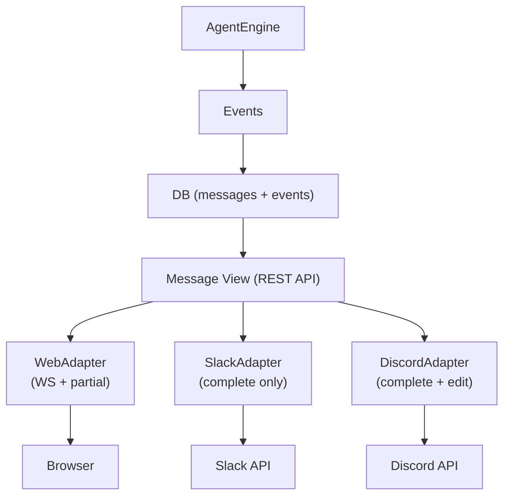

# Nointern Event Architecture Review Discussion

> Discussion record from 2026-03-08. Based on design in `unified-event-architecture.md`, discusses problems in current structure and improvement direction.

---

## Current Structure Summary

### 2-layer events

1. **SessionEvent** (DB stored, `engine/types.py`)
   - Source of LLM conversation history. INSERT into `events` table.
   - UserInputEvent, AssistantTextEvent, AssistantToolCallEvent, ToolResultEvent, ReasoningEvent, UnknownEvent, TurnCompleteEvent, CompactionEvent, CompactionStartedEvent, SubagentStartEvent, SubagentEndEvent

2. **EngineEvent** (streaming only, `engine/engine.py`)
   - yielded by `AgentEngine.run()`. Not stored in DB. Delivered in real time over WebSocket.
   - TextPartial, TextEnd, ToolCallStart, ToolCallEnd, ReasoningPartial, ReasoningEnd, RunStarted, RunComplete, RunStopped, Sandbox*, AuthorizationRequest, CompactionStarted/Complete, SubagentStreamStart/End

### Store

- **EventStore protocol** — `append()`, `list()`, `compact()`, `compact_all()`
- **RDBEventStore** (`repos/message/store.py`) — PostgreSQL implementation. Bidirectional conversion with `_event_to_rdb_kwargs()` / `_to_session_event()`
- **DB table**: `events` — id, session_id, role (PG ENUM), content, tool_calls (JSONB), metadata (JSONB), usage (JSONB), etc.

### Data Flow

```
AgentEngine.run()
  ├─ yield EngineEvent ──→ Worker ──→ Redis PubSub ──→ WS send_loop ──→ Browser
  └─ store.append(SessionEvent) ──→ INSERT INTO events
                                          │
  Browser REST load ←── GET /messages ←── SELECT FROM events
```

### WebSocket

- **Auth**: `POST /chat/v1/ticket` (JWT → 30s HMAC ticket) → WS `/chat/v1/sessions/{id}?ticket=…`
- **Redis Broker**: incoming is Redis List, outgoing is Redis Pub/Sub (`nointern:session:{id}:events`)
- **Serialization** (`broker/serialization.py`): EngineEvent → JSON. Message-like events are unified as `type: "message"`; control events keep unique type.
- **WS handler**: `receive_loop` (client→broker) + `send_loop` (broker→client) two tasks in parallel

### Frontend

- **useChatWebSocket**: WS connection + `handleEvent()` dispatcher. Handles partial→complete streaming with `upsertMessage()`, merges tool result into assistant message with `mergeToolResult()`.
- **useChatPageContainer**: orchestration. Ticket issue, history load (REST), 30s batch reload, pagination.
- **useSubagentSession**: independent WS connection dedicated to subagent modal.

---

## Three Problems

### 1. Discrepancy between WebSocket events and stored events

Types/formats of events received over WebSocket and stored events are not always consistent, so:
- There are cases where event is received over WebSocket but **missing** after refresh.
- When WebSocket event and stored event refresh overlap, **duplicate** events are easy to create.

**Rough idea**: Make stored event the source of truth and have WS always send only diffs from it. Events that go over WS but do not exist in event store should not exist.

### 2. Event composition complexity

Events like tool_call and tool_call_output are different events, but FE must display them as one bubble, making logic complex. It is manageable now because interface is only WebSocket, but once interfaces such as Slack/Discord are added, this composition logic must be repeatedly implemented. FE also cannot manage every event that should be merged.

**Rough idea**: Add child entities to event and track updated contents separately.

### 3. Stored event API returns many events that are not rendered

Want to clearly separate internal events for LLM calls from events that should be rendered.

**Rough idea**: Store rendering metadata separately on event and return only those that have it.

---

## Root Cause

Root cause of all three problems converges to **current `events` table playing two roles at same time**:
1. **LLM context reconstruction** (consumed by engine)
2. **Client rendering** (served by API)

### Core Needs

| # | Problem | Need |
|---|------|------|
| 1 | mismatch between WS and stored → missing/duplicate on refresh | **single source of truth** for what client sees |
| 2 | composition of related events depends on FE logic | **rendering unit determined by server** |
| 3 | internal events exposed through API | separation of **LLM context data and display data** |

---

## Discussion Points

### A. Layer separation: Event Log vs Message View

Currently one `events` table contains everything. Should it be split into two layers:

- **Event Log**: append-only, for LLM context reconstruction. Includes internal events such as turn_complete and compaction. Not directly exposed to client.
- **Message View**: structured data by rendering unit. REST API and WS serve only this.

**Things to discuss:**
- Should Message View be physically stored in DB (materialized), or computed every time from Event Log?
  - **Materialized**: fast query, but needs event → view sync logic
  - **Computed**: keeps single source of truth, but composition logic runs on every query
- Does Event Log structure need to differ greatly from current?

### B. Definition of rendering unit

How should server represent "one bubble"?

Currently one assistant bubble is actually composition of multiple events:
```
AssistantTextEvent (text)
  + AssistantToolCallEvent × N (tool calls)
    + ToolResultEvent × N (tool results)
  + ReasoningEvent (thinking process)
```

**Things to discuss:**
- Should unit be **Turn** (one LLM call = one unit), or **Bubble** (one visible speech bubble)?
  - **Turn**: assistant text + tool calls + tool results grouped together. Simple, but long turn may need splitting in UI
  - **Bubble**: finer-grained, but needs definition of "where to split"
- Represent relationship between tool call and tool result as parent-child, or merge into composite object?
  - **Parent-child**: preserves append-only nature of event log. JOIN at view query time
  - **Composite update**: update existing row when tool result arrives. Simple but conflicts with event-log nature

### C. Compatibility of Streaming and Source of Truth

Core tension in Problem 1: **streaming latency vs consistency**.

TextPartial arrives per token, but cannot write to DB every time. However, if "stored event is source of truth", no event should go only to WS.

**Things to discuss:**
- How to treat Partial?
  - **Option 1**: Allow Partial as explicit transient exception. Store only final complete. On refresh, show only complete state (same as current but explicit contract)
  - **Option 2**: Keep in-progress state in Redis, and REST also returns "currently streaming partial"
- Where to store transient state (run in progress, sandbox state)?
  - Currently only Redis key + WS delivery → can be lost on refresh
  - Make Session-level status queryable by REST too?

### D. Event classification system

Need criteria for what goes into Event Log and what goes into Message View.

Current events classified into 3 types:

| Classification | Examples | Event Log | Message View |
|------|------|-----------|--------------|
| Render target | user input, assistant text, tool call+result, reasoning, subagent | O | O |
| Internal bookkeeping | turn_complete, compaction, compaction_started | O | X |
| Transient signal | TextPartial, RunStarted, SandboxReady, AuthorizationRequest | X | ? |

**Things to discuss:**
- Should some transient signals (AuthorizationRequest, SubagentStart/End) be visible even after refresh?
  - AuthorizationRequest: already moved to stored pattern like SubagentStartEvent — generalize pattern?
  - SandboxReady: session-level status, not message → separate path?
- turn_complete usage information might be desirable in UI → as turn metadata in view?

### E. Multi-interface perspective

What layer should be consumed when adding Slack/Discord?

```
Event Log (LLM context)
    ↓ projection
Message View (rendering unit, composed on server)
    ↓ format
Web WS / Slack API / Discord API
```

**Things to discuss:**
- Is structure correct where Slack/Discord adapter consumes Message View and only formats for each channel?
- Where to absorb difference between interfaces needing real-time streaming (Web) and interfaces needing final result only (Slack)?
  - Web: Message View + partial streaming
  - Slack: only complete Message View (or periodic edit)

---

## Discussion Decisions

### A. Event Log vs Message View — Conclusion: split into 2 tables (messages + events)

**Constraint confirmation**:
- event/message is frequently deleted (compaction, truncate)
- if one side is deleted, the other must be deleted together
- complete table split needs application-level handling; CASCADE FK solves it

**Decision: 2 tables (messages + events)**

messages table is rendering unit, events table is detailed data. When message is deleted, child events are cleaned by CASCADE.

Reasons:
1. Since "server composition" was chosen, composition is simpler when message exists in DB.
2. Pagination is natural by message unit.
3. Compaction = message deletion + events cleanup by CASCADE.
4. Clear storage location for message-level metadata such as `child_session_id`, `type`, `role`.

```
messages
  id PK
  session_id FK
  type (user_text|assistant_text|action|reasoning|turn_summary|compaction_summary)
  role (user|assistant)
  sequence  -- sorting
  child_session_id FK nullable  -- subagent
  created_at

events
  id PK
  message_id FK CASCADE
  session_id FK
  type (text|tool_call|tool_result|thinking|turn_complete|compaction)
  parent_event_id FK nullable  -- tree
  root_event_id FK nullable    -- denormalized, query optimization
  payload JSONB
  created_at
```

### Tree Structure

Parent-child relation between events:
- `parent_event_id` (nullable FK to self) — generic so any event can be parent
- **no depth limit** — recursive tree
- store denormalized `root_event_id` for query optimization (computed on INSERT)
  - query all events of one group flatly with `WHERE root_event_id = ?`
  - pagination also based on root

### B. Rendering Unit Definition — Conclusion: Message (Semantic grouping)

**Rendering unit**: Message (1 message = N events)

**Grouping criterion: Semantic**
- text → independent message (`assistant_text`)
- tool_call + tool_result → one action message (`action`)
- reasoning → independent message (`reasoning`)
- turn_complete → independent message (`turn_summary`)
- compaction → independent message (`compaction_summary`)

**Message type list**:

| Message Type | Included Event | UI expression |
|---|---|---|
| `user_text` | user input | user bubble |
| `assistant_text` | text event | assistant bubble |
| `action` | tool_call + tool_result | collapsible card |
| `reasoning` | thinking event | collapsed thought process |
| `turn_summary` | turn_complete event | usage info bar |
| `compaction_summary` | compaction event | summary notification |

**Subagent handling**: separate session
- subagent call → `action` message in parent session (references `child_session_id`)
- subagent internal conversation → independent query by separate session_id

**API shape**: server composition
- `GET /sessions/{id}/messages` — provide completed message list
- client only renders as-is

### C. Streaming and Source of Truth — Conclusion

**TextPartial (token streaming)**: Transient
- Sent only over WS, DB stores only complete event.
- Create message as `pending` state first, then update to `complete` when done.
- REST query returns only complete messages (or optional pending inclusion).

**Control events (RunStarted, SandboxReady, etc.)**: WS only + shared status model
- Not stored in DB, sent only over WS.
- Design session status model (`SessionStatus`) well so current state can be queried through REST too.
- WS events and REST status **share same state model** — extensible.

```python
# shared status model (both WS and REST are based on this)
class SessionStatus:
    state: "idle" | "running" | "waiting_input"
    step: "llm_calling" | "tool_executing" | "sandbox_running" | None
    active_message_id: str | None   # currently generating message
    metadata: dict                   # extensible structure

# WS: send event on status change
# {"type": "session_status_changed", "status": SessionStatus}

# REST: return same model
# GET /sessions/{id}/status → SessionStatus
```

When adding new state, extend `step` enum or add to `metadata` → both WS/REST reflect automatically.

**Dedup**: by Message ID
- Server-generated `message_id` shared by WS/REST.
- Client deduplicates with `Set<message_id>`.

### D. Event Classification System — Conclusion

**3-layer classification**:

| Layer | DB stored | Message mapping | Examples |
|------|---------|-------------|------|
| **StoredRendered** | O | O | user_input, text, tool_call, tool_result, thinking, turn_complete, compaction, authorization_request |
| **StoredInternal** | O | X | usage_report (session-level aggregate) |
| **Transient** | X | X | TextPartial, SessionStatusChanged |

**Code enforcement: Pydantic type system**

```python
from pydantic import BaseModel, ConfigDict

class BaseEvent(BaseModel):
    """Base model of all events."""
    model_config = ConfigDict(frozen=True)
    type: str  # fixed as Literal in each subclass

class StoredRenderedEvent(BaseEvent):
    """Event stored in DB + mapped to Message."""
    message_id: MessageId  # required

class StoredInternalEvent(BaseEvent):
    """Event stored in DB but not shown in Message."""
    message_id: None = None  # always None

class TransientEvent(BaseEvent):
    """Event delivered only over WS."""
    # no DB save method → type error on repo.save(TransientEvent)
```

Using Pydantic allows automatic discrimination by `type` field during deserialization with discriminated union, and `.model_dump()` can be stored/restored directly in `events.payload JSONB` (see section F).

**Boundary case decisions**:
- `turn_complete` → **StoredRendered** (to show usage info in UI)
- `AuthorizationRequest` → **StoredRendered** (special case of action message)
- `compaction` → **StoredRendered** (dedicated message type `compaction_summary`)
- Usage session aggregate → keep StoredInternal

### E. Multi-interface — Conclusion: Adapter pattern



Adapter responsibility:
- Convert Message → channel-specific format
- Streaming policy (what to send): Web=partial+complete, Slack=complete only
- auth/permission mapping

---

## Message Grouping (current implementation)

Current engine.py uses streaming group ID to group partial → complete events:

```python
text_group_id = str(uuid.uuid4())
reasoning_group_id = str(uuid.uuid4())
```

### Grouping Mechanism

- **TextPartial** + **TextEnd**: share same `text_group_id` → FE accumulates into same bubble
- **ReasoningPartial** + **ReasoningEnd**: share same `reasoning_group_id`
- After **TextItemDone** handling, `text_group_id = str(uuid.uuid4())` creates new ID → next message becomes new bubble
- **ImageItemDone**: create separate `img_group_id`
- **Error message**: uses `error_group_id` (reuse existing `text_group_id` if text did not start)

### Grouping in WS Serialization

```json
// TextPartial (streaming)
{"type": "message", "id": "msg-1", "content": "Hel", "status": "partial"}

// TextEnd (complete)
{"type": "message", "id": "msg-1", "content": "Hello", "status": "complete"}
```

- Partial and complete share same `id` → FE updates same element
- New `id` creates new message element

### Problems

- This group ID is **not stored in DB** — SessionEvent has no `id` field.
- `id` received over WS differs from ID of event loaded by REST (REST uses DB uuid7 PK).
- → cannot dedup across WS↔REST (core of Problem 1).
- DurableEvent design in `unified-event-architecture.md` is intended to solve this problem.

---

## F. Event Type: Pydantic Migration

### Current: frozen dataclass + manual serialization

Current events are defined as `@dataclasses.dataclass(frozen=True)`, and all serialization is manually handled:

- `broker/serialization.py`: ~210 lines match/case — EngineEvent ↔ dict
- `repos/message/store.py`: `_event_to_rdb_kwargs()` / `_to_session_event()` — SessionEvent ↔ DB row

When adding new event, **3 places (definition, serialize, deserialize)** all need modification.

### Decision: Pydantic `BaseModel(frozen=True)` + Discriminated Union

```python
from pydantic import BaseModel, ConfigDict
from typing import Annotated, Literal, Union
from pydantic import Discriminator

class TextEvent(BaseModel):
    """Text event."""
    model_config = ConfigDict(frozen=True)
    type: Literal["text"] = "text"
    content: str
    attachments: list[Attachment] = []

class ToolCallEvent(BaseModel):
    """Tool call event."""
    model_config = ConfigDict(frozen=True)
    type: Literal["tool_call"] = "tool_call"
    tool_call: ToolCall

# automatically discriminate by type field
StoredEvent = Annotated[
    Union[TextEvent, ToolCallEvent, ...],
    Discriminator("type"),
]
```

### Benefits

1. **Remove serialization code**: hundreds of lines in `serialize_event()` / `deserialize_event()` → one line `.model_dump()` / `.model_validate()`
2. **Easy event addition**: only define class + add to Union. No serialization code modification
3. **Natural mapping with DB payload**: store `event.model_dump()` in new `events.payload JSONB` column, restore with `StoredEvent.model_validate(row.payload)`
4. **Automatic validation**: type/value validation during deserialization for free
5. **Automatic JSON Schema generation**: usable for API documentation

### Relationship with WS Serialization

Current WS serialization has custom logic that converts message-like events into unified `type: "message"` format. Even after Pydantic migration, this conversion is handled by separate adapter:

- **Event Log (DB)**: store Pydantic native `.model_dump()` as-is — no manual conversion code needed
- **Message View (WS/REST)**: adapter converts Event → client format — existing unified format can be preserved

This aligns with decision in section A, "Event Log vs Message View separation": Event Log keeps original event as-is, Message View converts for rendering.
