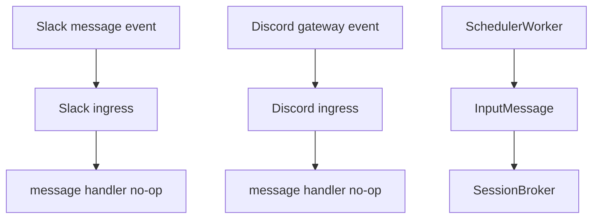
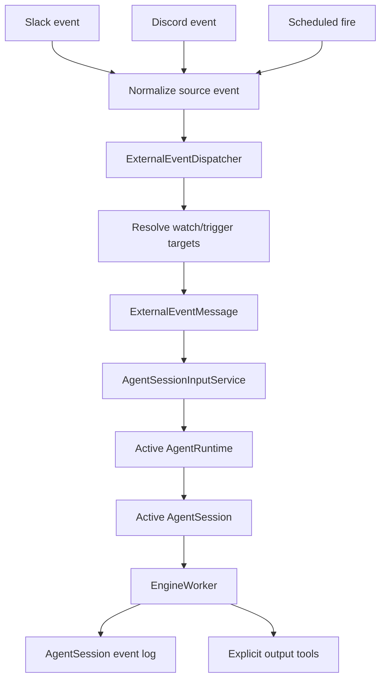

# Slack/Discord/Scheduled Event Subscription Migration Design

## Implementation Completion Status

- Completed date: 2026-05-08
- Related PR stack: #3522, #3523, #3524, #3525
- Changes compared to design: Initial implementation had live run BLOCKED due to missing Slack live QA environment `.env`, and included scope up to preparing scenario/handler and SELECT-only verification path. Discord live E2E and durable inbox/outbox remain follow-up scope.

## Overview

Migrate Slack, Discord, Scheduled task inputs from “path that directly puts message into specific `AgentSession`” to “path that routes events from external event sources subscribed by agent into active runtime input.”

Core principles:

- Do not recreate adapter-specific session concept per Slack/Discord/Scheduled source.
- Keep `AgentSession` as conversation/event log boundary.
- Event subscription is responsible only up to input routing.
- External posting (output) is handled by agent explicitly calling output tool target, not by implicit reply adapter.

## Current State

Foundation is already prepared.

| Area | Status |
|---|---|
| `SlackExternalWatch` / `DiscordExternalWatch` | domain-specific watch tables exist |
| event dedupe | based on `events(session_id, external_id)` unique |
| active runtime/session | `AgentRuntimeRepository.ensure_for_agent()` + `AgentSessionRepository.ensure_active()` |
| broker input | `ExternalEventMessage` exists |
| Slack/Discord ingress | signature/gateway entrypoint exists |
| ScheduledTask | due task polling + active session enqueue exists |

However, Slack/Discord message handler is currently no-op, and watch creation user path plus common dispatcher are not connected.



## Target Structure



## Discussion Points and Decisions

### 1. Output policy

**Decision: keep explicit output tool target**

Do not restore Slack/Discord thread/channel auto-reply adapter. When Agent needs to answer on external platform, it explicitly calls Slack/Discord toolkit target.

With this decision, event subscription owns only input routing, and output routing is separated into tool contract.

### 2. Watch creation UX/API

**Decision: restore `/nointern connect` / Discord select flow as ExternalWatch creation path**

Initial implementation makes watch from Slack/Discord internal user path. Web/backend management API remains long-term option.

- Slack: `/nointern connect` or existing interaction flow → `SlackExternalWatch`
- Discord: select/interaction flow → `DiscordExternalWatch`
- testenv/live QA also uses this user-facing path instead of direct DB write.

### 3. Event source identity / session event dedupe key

**Decision: use normalized composite key**

Native event id is preserved as metadata, but dedupe canonical key is built from stable field combination by source.

| Source | Canonical `source_event_id` |
|---|---|
| Slack | `slack:{team_id}:{channel_id}:{message_ts}:{client_msg_id}` (`-` if no `client_msg_id`) |
| Discord | `discord:{guild_id}:{channel_id}:{message_id}` |
| Scheduled | `scheduled:{scheduled_task_id}:{fire_at_iso}` |

### 4. Dispatcher boundary

**Decision: common `ExternalEventDispatcher` service**

Slack/Discord/Scheduled handlers are responsible only up to source event normalization. Dispatcher owns target resolution, envelope build, active `AgentSession` enqueue.

Initial implementation does not introduce durable inbox/outbox table or separate delivery table. External input is stored as `user_input` row in `events`, and `source_event_id` is put into `external_id` to remove retry duplicates with `events(session_id, external_id)` partial unique index.

If exact retry guarantee becomes needed, extend with delivery status (`pending`/`delivered`/`failed`) or durable inbox/outbox table in follow-up design.

### 5. Inbound event envelope / platform context

**Decision: include platform context in `ExternalEventMessage.context/metadata` and interface context**

Slack passes `SlackInterfaceContext` together so Slack Toolkit can resolve current channel privacy context and bot token. Event source information still goes into `ExternalEventMessage.context/metadata`.

| Field | Slack | Discord | Scheduled |
|---|---|---|---|
| `source` | `slack` | `discord` | `scheduled` |
| `text` | message text | message content | scheduled prompt |
| `headers` | workspace/channel/user readable info | guild/channel/user readable info | schedule summary |
| `context_text` | Slack event summary sentence | Discord event summary sentence | Scheduled fire summary sentence |
| `context` | `team_id`, `channel_id`, `thread_ts`, `message_ts` | `guild_id`, `channel_id`, `thread_id`, `message_id` | `scheduled_task_id`, `fire_at` |
| `metadata` | `watch_id`, `source_event_id`, native `event_id` | `watch_id`, `source_event_id`, native `event_id` | `scheduled_task_id`, `source_event_id`, `schedule_type` |

If source-specific account link exists, fill `user_id` with internal nointern user ID; otherwise keep `None`. Scheduled event uses task owner `owner_user_id`.

### 6. Scheduled task fire model

**Decision: Convert Scheduled fire to `ExternalEventMessage(source="scheduled")` too**

When `SchedulerWorker` puts due task into active session, it creates `ExternalEventMessage` with scheduled origin. Separate `ScheduledTaskFire` table is not created in initial scope.

Scheduled path duplicate prevention uses existing atomic claim semantics of `ScheduledTaskRepository.claim_task()` together with session event `external_id` dedupe.

Known limitation:

- broker enqueue success and agent run completion success are not separated.
- `ScheduledTaskFire`/delivery state tracking is follow-up extension.

### 7. testenv / live QA harness

**Decision: prioritize live Slack-centered QA**

Representative E2E verification uses real Slack setup to verify watch creation, message event `events` storage, actual LLM response, and Slack thread reply. QA result includes clickable Slack conversation link.

## Data Model

Basic schema uses domain-specific watch tables and existing session event table.

- `slack_external_watches`
- `discord_external_watches`
- `events`

External inbound message itself is stored as `events` row. New common table or delivery status is considered in retry guarantee enhancement phase.

## Service Design

### Normalized event

```python
@dataclass(frozen=True)
class ExternalEvent:
    source: Literal["slack", "discord", "scheduled"]
    source_event_id: str
    installation_id: str | None
    workspace_id: str
    channel_id: str | None
    thread_id: str | None
    actor_external_id: str | None
    text: str
    headers: list[tuple[str, str]]
    context: list[tuple[str, str]]
    metadata: dict[str, str]
    attachments: list[str]
```

### Dispatcher

```python
class ExternalEventDispatcher:
    async def dispatch_slack(self, event: ExternalEvent) -> None: ...
    async def dispatch_discord(self, event: ExternalEvent) -> None: ...
    async def dispatch_scheduled(self, event: ExternalEvent) -> None: ...
```

Dispatcher responsibilities:

1. Call target resolver by source.
2. Create `ExternalEventMessage`.
3. Enqueue active session through `AgentSessionInputService`.
4. EngineWorker stores with `events.external_id = source_event_id` and dedupes.

## Implementation Plan

### Phase 1 — Design/plan

- Write this design document.
- Write implementation plan document.

### Phase 2 — Backend dispatcher and Slack/Discord watch creation

- Add `ExternalEventDispatcher`.
- Slack `/nointern connect` selection → create `SlackExternalWatch`.
- Discord select → create `DiscordExternalWatch`.
- Slack/Discord message no-op handler → call dispatcher.
- Slack external event → resolve Slack interface toolkit context.
- Add `scheduled` to `ExternalEventMessage.source`.
- Convert SchedulerWorker scheduled fire envelope.

### Phase 3 — Tests

- Slack handler/dispatcher unit test.
- Update Discord event service test.
- Update SchedulerWorker scheduled `ExternalEventMessage` test.
- Update broker serialization test.

### Phase 4 — testenv QA

- Update `TC-INT-EXTWATCH-001` to current schema/user path.
- Verify watch creation, event storage, LLM response, Slack thread reply through live Slack path.

### Phase 5 — Living Spec promotion

- `message-routing.md`
- `slack.md`
- `discord.md`
- `conversation.md`
- `byoa-installation.md` if needed

## testenv QA Scenario

### TC-INT-EXTWATCH-001 — Slack ExternalWatch event reply

1. Prepare `agent-with-shell`, `slack-account-session`, `slack-platform-installation`, `slack-qa-channel`, `tailscale-funnel-active` setup.
2. Connect QA channel and agent with `/nointern connect` or signed interaction helper to create `SlackExternalWatch`.
3. Post Slack user message in QA channel and request thread reply.
4. Slack event endpoint receives that message.
5. Verify active `AgentSession` `events` has exactly one `user_input` row with `external_id=source_event_id`.
6. Verify actual LLM `text_item` response is created and Slack thread bot reply arrives.
7. Include Slack conversation link in QA report.

## Living Spec Impact

| Spec | Change |
|---|---|
| `docs/nointern/spec/flow/message-routing.md` | Slack/Discord no-op → subscription dispatch flow |
| `docs/nointern/spec/domain/slack.md` | SlackExternalWatch lifecycle, inbound event dedupe |
| `docs/nointern/spec/domain/discord.md` | DiscordExternalWatch lifecycle, relationship between gateway dedupe and event dedupe |
| `docs/nointern/spec/domain/conversation.md` | Scheduled fire external event envelope |
| `docs/nointern/spec/flow/byoa-installation.md` | Re-express BYOA fixed agent routing as event subscription target |

## Alternatives Considered

### Restore platform auto-reply adapter

Slack/Discord chatbot UX is natural, but adapter-specific session semantics return. Excluded because it does not match this migration goal.

### Common durable inbox/outbox table

Best for retry guarantee, but initial implementation cost is large. Exact retry between broker enqueue failure and session event dedupe remains follow-up.

### Reintroduce Slack/Discord auto-reply adapter

Thread/channel auto-reply adapter splits session semantics by platform again, so excluded. Slack response is verified with Slack Toolkit target call.

## Risks and Mitigations

| Risk | Mitigation |
|---|---|
| Duplicate processing on source retry after broker enqueue failure | Apply session event external_id dedupe, follow-up delivery status/inbox design |
| Agent chooses wrong explicit output target | Make event XML context field and toolkit schema clear |
| Live Slack QA flake | Reuse existing Slack setup/credential/runbook, include Slack link evidence |
| Discord E2E insufficient | Initial implementation uses route/unit test + Slack live baseline, Discord live is follow-up enhancement |
