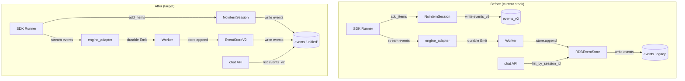

# events Table Unification + SessionEvent Native Compatibility

## Overview

After OpenAI events redesign stack (#3099–#3109) merge, the system is in transient state where two tables coexist:

- **`events`** (legacy) — `RDBEvent` (`models/message.py`). row-per-message schema (role/content/tool_calls/raw_output/usage). `RDBEventStore` reads/writes it. Currently used by chat API + engine_adapter durable Emit pipeline.
- **`events_v2`** (new) — `RDBEventV2` (`models/event_v2.py`). row-per-event schema (type/data/raw_data/external_id). `NointernSession.add_items` writes only on SDK Runner path. Nearly unused.

Additionally, `SessionEvent` runtime type has impedance mismatch with events_v2 schema — `FunctionCallItem.output` is nested, so it does not map 1:1 to row-per-event in events_v2 (conversion layer needed).

Goal (end state): **all code uses only one events table with events_v2 schema**. `SessionEvent` is natively 1:1 compatible with row-per-event and has no conversion layer. All legacy assets such as `RDBEventStore` / `RDBEvent` / `models/message.py` / `repos/message/store.py` / `engine/serde.py` / `_merge_legacy_tool_rows` are deleted. legacy events table dropped, events_v2 → events RENAME.

**Premise (user guidance)**: data compatibility / migration backfill unnecessary — only clean end state matters. Operational data loss acceptable.

## User Scenarios

This work is not a directly user-visible new feature, but cleanup of dual-write / conversion layer / dead code — for operational stability and reduced future change cost. Verification scenarios:

- create chat session → send message → execute tool (e.g. shell `ls`) → query chat history → every event displayed without omission
- previous stack testenv `TC-CHAT-001`, `TC-CHAT-MULTITURN-001` pass
- normal summary when compaction threshold reached (operates on events_v2)
- SUBAGENT_START / SUBAGENT_END events displayed on subagent execution

## Discussion Points and Decisions

### DP1: SessionEvent type refactor — split `FunctionCallItem.output`

**Options**:

A) **Keep status quo** — nested `FunctionCallItem(output: FunctionCallOutput | None)`. EventStoreV2 converts (split 1 → 2 rows on write, merge on read).
B) **Split `FunctionCallOutputItem`** — remove `output` from `FunctionCallItem`, add separate `FunctionCallOutputItem(DurableEvent)`. SessionEvent ↔ events_v2 row 1:1 native compatibility.
C) **Change events_v2 schema** — nest output inside `FUNCTION_CALL_ITEM` row data. Mismatches SDK row-per-event.

**Decision: B (split FunctionCallOutputItem)**

Rationale:
- User explicitly requested "remove conversion layer and make native compatible".
- events_v2 schema matches SDK Runner row-per-event (already verified design).
- `set_function_call_output` API + `emit.update()` mode can also be removed → simpler code.
- Impact: about 21 sites (engine.py, store.py, context.py, emit.py, event_converter.py + 4 test files).

Tradeoff:
- Large diff (core SessionEvent type change).
- Some callers need direct pairing (call_id matching) handling (e.g. context masking).

### DP2: Migration strategy — backfill / dual-write period

**Options**:

A) **Gradual migration** — introduce events_v2 → backfill → cutover → drop. zero downtime, data preserved.
B) **Allow data loss** — discard legacy events as-is, rename events_v2 → events. Simple.

**Decision: B (allow data loss)**

Rationale:
- User explicitly said "data compatibility and migration are all unnecessary".
- nointern is in internal service stage (operational data loss acceptable).
- Simple = fast ship + smaller bug surface.

### DP3: Stack split — phase unit

**Options**:

A) **Single big-bang PR** — everything at once. High review burden + difficult rollback.
B) **5-phase stacked PR** — each phase can ship independently + rollback possible (until Phase 4 DROP TABLE).

**Decision: B (5-phase stack)**

Split units:

| Phase | Content | Risk | Rollback |
|---|---|---|---|
| 1 | split `SessionEvent` type + clean emit pipeline + adapt legacy store | medium (~21 sites changed) | possible |
| 2 | implement new `EventStoreV2` (on events_v2, 1:1 native) — deps unchanged | low (code only) | possible |
| 3 | `deps.py` → EventStoreV2 + chat API list_messages → events_v2 | medium (read/write path switch) | possible |
| 4 | DROP legacy events table + remove RDBEvent / RDBEventStore / serde / models/message.py / repos/message/store.py | **irreversible** | impossible (only until previous phase) |
| 5 | events_v2 → events RENAME + `RDBEventV2` → `RDBEvent` code rename | medium | name-only rollback |

**Phase 4 is last safety point**. Until Phase 1-3, can operate/verify in dual-write state.

### DP4: Migration file handling — Phase 4/5

**Options**:

A) **One migration for Phase 4 and Phase 5** — single `DROP events; ALTER events_v2 RENAME TO events;`.
B) **Separate migrations** — Phase 4: drop legacy / Phase 5: rename events_v2.

**Decision: B (separate)**

Rationale:
- Clear separation by Phase PR unit.
- If drop in Phase 4 and rename in Phase 5, there can be temporary state without events table after Phase 4 merge → operational risk. **But deployment rule states merge Phase 5 immediately after Phase 4**.

Alternative: A integration (simple one migration) is also reasonable. It is enough if code changes of two phases are separated at commit level.

**Final**: Considering operational risk, **adopt A integration** — include `DROP TABLE events; ALTER TABLE events_v2 RENAME TO events; ALTER INDEX ix_events_v2_*…` in Phase 4 migration. Phase 5 is code rename only.

### DP5: Verification — testenv QA scenarios

**Scenarios**:

1. **chat single-turn (TC-CHAT-001)** — `seed.auth.create_user` → `seed.workspace.create` → `live.chat.collect("hello")` → verify `has_text_content`, `run_completed`
2. **chat multi-turn (TC-CHAT-MULTITURN-001)** — 2 turns in same session → both turns stored in events_v2 + chat list displays all
3. **tool execution** — `live.chat.collect("ls /tmp")` (shell tool) → separated rows `function_call_item` + `function_call_output_item` stored → pairing displayed in chat history
4. **compaction** — force long history compaction → add COMPACTION row + delete previous rows
5. **subagent** — subagent invocation → SUBAGENT_START / SUBAGENT_END rows + events_v2 with separate session_id

Verification point by phase:
- Phase 1: 1, 2 (new SessionEvent works on legacy events)
- Phase 2: (code unit test only — no integration)
- Phase 3: all 1-5 (after events_v2 cutover)
- Phase 4: 1-5 (same behavior after legacy removal)
- Phase 5: 1-5 (smoke after rename)

## Architecture



Core changes:
- `RDBEventStore` (legacy events) → delete
- `EventStoreV2` (events_v2 → final events) → single store
- `NointernSession` and `EventStoreV2` write to same table — partial unique index `(session_id, external_id)` naturally dedups
- `SessionEvent` ↔ events row 1:1 (no conversion, FunctionCallItem.output split)

## Data Model

### Final events table (= current events_v2)

```sql
CREATE TABLE events (
    id           VARCHAR(32) PRIMARY KEY,
    session_id   VARCHAR(32) NOT NULL REFERENCES conversation_sessions(id) ON DELETE CASCADE,
    type         event_type NOT NULL,        -- ENUM: text_item / function_call_item / function_call_output_item / ...
    data         JSONB NOT NULL,             -- UI rendering snapshot
    raw_data     JSONB NULL,                 -- raw OAI dict from SDK origin
    external_id  TEXT NULL,                  -- dedup key
    created_at   TIMESTAMPTZ DEFAULT now()
);

CREATE INDEX ix_events_session_id ON events(session_id);
CREATE INDEX ix_events_session_created ON events(session_id, created_at);
CREATE UNIQUE INDEX uq_events_session_external ON events(session_id, external_id) WHERE external_id IS NOT NULL;
```

CHECK constraint: `type ∈ SDK_ORIGIN ⇒ raw_data NOT NULL`, `type ∈ NOINTERN_ORIGIN ⇒ raw_data NULL`.

### SessionEvent ↔ events row mapping (native 1:1)

| SessionEvent | EventType | data shape | raw_data | external_id |
|---|---|---|---|---|
| `UserInputEvent` | `USER_INPUT` | {content, headers, metadata, attachments} | NULL | None |
| `TextItem` | `TEXT_ITEM` | {text, attachments} | event.raw_output | event.id |
| `ReasoningItem` | `REASONING_ITEM` | {reasoning_text, summary} | event.raw_output | event.id |
| `FunctionCallItem` | `FUNCTION_CALL_ITEM` | {name, arguments, call_id} | event.raw_output | tool_call.id |
| `FunctionCallOutputItem` (new) | `FUNCTION_CALL_OUTPUT_ITEM` | {call_id, output, attachments} | event.raw_output | event.id |
| `WebSearchCallItem` | `WEB_SEARCH_CALL_ITEM` | {action, status} | event.raw_output | event.id |
| `GeneratedImage` | `IMAGE_GENERATION_ITEM` | {attachments} | (`{}` placeholder — satisfies CHECK) | event.id |
| `UnknownEvent` | `UNKNOWN_ITEM` | {sdk_type} | event.raw_output | event.id |
| `TurnCompleteEvent` | `TURN_COMPLETE` | {usage} | NULL | event.id |
| `CompactionEvent` | `COMPACTION` | {content} | NULL | None |
| `CompactionStartedEvent` | `COMPACTION_STARTED` | {} | NULL | None |
| `SubagentStart` | `SUBAGENT_START` | {subagent_id, subagent_name, subagent_session_id} | NULL | event.id |
| `SubagentEnd` | `SUBAGENT_END` | {subagent_id, subagent_session_id, result} | NULL | event.id |
| `Error` | `ERROR` | {content} | NULL | event.id |

`external_id = event.id` for `FunctionCallOutputItem` (uuid7) — does not collide with call row of same `tool_call.id`.

## New SessionEvent Type

```python
@dataclasses.dataclass(frozen=True)
class FunctionCallOutput:
    """Function tool execution result data (excluding identifier).

    In-memory tool execution result representation + inner data of FunctionCallOutputItem.
    """
    content: str
    attachments: list[Attachment]
    images: list[ImageSource]  # in-memory only, not stored in DB


@dataclasses.dataclass(frozen=True)
class FunctionCallItem(DurableEvent):
    """Function tool call request. 1:1 with FUNCTION_CALL_ITEM in events."""
    id: str
    tool_call: FunctionToolCall
    source_model: str | None
    raw_output: dict[str, object] | None


@dataclasses.dataclass(frozen=True)
class FunctionCallOutputItem(DurableEvent):
    """Function tool execution result event. 1:1 with FUNCTION_CALL_OUTPUT_ITEM in events.

    Paired with :class:`FunctionCallItem` of same ``call_id``.
    """
    id: str
    call_id: str
    output: FunctionCallOutput
    source_model: str | None
    raw_output: dict[str, object] | None
```

Add `FunctionCallOutputItem` to `SessionEvent` union.

## Deprecated APIs

- `EventStore.set_function_call_output(session_id, event_id, output)` — handle `FunctionCallOutputItem` as normal `append([...])`.
- `emit.update(event)` mode — mode for in-place update of `FunctionCallItem`, now unnecessary due to split. Use `durable(FunctionCallOutputItem(...))`.

## Implementation Plan

### Phase 1 — Split `SessionEvent` type + clean emit pipeline

**Changes**:
- `engine/types.py`: remove `output` from `FunctionCallItem`, add `FunctionCallOutputItem(DurableEvent)`, update `SessionEvent` union.
- `engine/types.py`: remove `EventStore.set_function_call_output` signature.
- `engine/emit.py`: remove `update()` function + `mode == "update"` branch.
- `engine/sdk/event_converter.py`: emit `tool_output` as `durable(FunctionCallOutputItem(...))` (replace existing `update(FunctionCallItem(output=...))`).
- `engine/engine.py`: `_execute_function_calls()` yields separate `FunctionCallOutputItem` (remove existing `dataclasses.replace(fc_item, output=...)` pattern).
- `engine/context.py`: change `mask_observations` / `find_compaction_boundary` to pair `FunctionCallOutputItem` by call_id matching.
- `repos/message/store.py`: remove `output` handling from `FunctionCallItem` case in `_event_to_rdb_kwargs`. Add `FunctionCallOutputItem` case (stored as new row in legacy events — will be dropped in Phase 4 anyway). Simplify ASSISTANT(tool_calls+content) branch in `_to_session_event` — remove output merge logic (convert from legacy data into split `FunctionCallOutputItem`).
- `engine/serde.py`: no change (only places where FunctionCallOutput enters as argument).
- `broker/serialization.py`: add serialization/deserialization of new type.
- Tests: update ~14 `FunctionCallOutput` usage patterns in `engine_test.py`, `serialization_test.py`, `llm_test.py`, `context_test.py`, `worker/engine_test.py` — split `FunctionCallItem(..., output=...)` into two events: `FunctionCallItem(...)` + `FunctionCallOutputItem(call_id=..., output=...)`.

**Verification**: all unit tests pass + testenv TC-CHAT-001, TC-CHAT-MULTITURN-001 pass.

### Phase 2 — Implement `EventStoreV2` (on events_v2, 1:1 native)

**Add**:
- `engine/events/store_v2.py`: `EventStoreV2(EventStore)` class. SessionEvent ↔ events_v2 row 1:1 mapping — type split in Phase 1 makes conversion logic trivial. `event_to_v2_row(SessionEvent) → row dict` (1:1, no split), `v2_row_to_session_event(row) → SessionEvent` (1:1, no merge).
- `engine/events/store_v2_test.py`: 13 type round-trip tests.

**deps unchanged** — merging this phase alone leaves prod behavior same.

### Phase 3 — deps switch + chat API read switch

**Changes**:
- `engine/deps.py:get_event_store` → inject `EventStoreV2`.
- `repos/message/__init__.py`: switch `MessageRepository.list_by_session_id` etc. to events_v2 SELECT (or reuse EventStoreV2.list). chat API response format (`ChatMessage`) is based on SessionEvent, so unchanged.
- `services/chat/__init__.py`: verify `MessageRepository` call path.
- `worker/engine.py` / `services/agent_runtime/__init__.py` calls to `engine.store.append/list` are EventStore Protocol based, so no change (but testenv verification needed).

**Verification**: all testenv scenarios 1-5 pass.

### Phase 4 — legacy removal + unified RENAME

**Migration**: `drop_legacy_events_and_rename_v2.py`

```python
def upgrade():
    # 1. drop legacy events table
    op.drop_index("ix_events_session_id", table_name="events")
    op.drop_table("events")

    # 2. drop message_role enum (used only by events)
    sa.Enum(name="message_role").drop(op.get_bind(), checkfirst=True)

    # 3. events_v2 → events RENAME
    op.rename_table("events_v2", "events")
    op.execute("ALTER INDEX ix_events_v2_session_id RENAME TO ix_events_session_id")
    op.execute("ALTER INDEX ix_events_v2_session_created RENAME TO ix_events_session_created")
    op.execute("ALTER INDEX uq_events_v2_session_external RENAME TO uq_events_session_external")
```

**Delete**:
- entire `rdb/models/message.py`
- entire `repos/message/store.py` (RDBEventStore + helpers)
- RDBEvent dependency parts in `repos/message/__init__.py` (already switched to EventStoreV2 in Phase 3, so remove if possible)
- RDBEvent-specific helpers in `engine/serde.py` (`_event_to_rdb_kwargs`, `_to_session_event`, `_merge_legacy_tool_rows`, `serialize_tool_calls`, `deserialize_tool_calls`)
- `core/enums.py:MessageRole` enum

**Verification**: testenv 1-5 + e2e chat suite + pyright clean.

### Phase 5 — code rename: `RDBEventV2` → `RDBEvent`, `events_v2` → `events`

**Changes (mechanical)**:
- `rdb/models/event_v2.py` → `rdb/models/event.py`
- `RDBEventV2` → `RDBEvent` (update all imports)
- `engine/events/store_v2.py` → `engine/events/store.py`
- `EventStoreV2` → `EventStore` (collides with Protocol, so separate name. **Decision: `RDBEventStore`** — no conflict with previous RDBEventStore (legacy-only) because deleted in Phase 4)
- Clean function names such as `event_to_v2_row` → `event_to_row`.

**Verification**: pyright clean + all tests pass + testenv smoke.

## Feasibility Verification

### Core Assumptions

| Assumption | Verification method | Result |
|---|---|---|
| events_v2 schema can represent every SessionEvent | DP1 mapping table | OK — 14 types 1:1 |
| partial unique index guarantees dual-write dedup | same external_id in NointernSession.add_items + EventStoreV2.append | OK — index definition confirmed |
| page-level pairing of `FunctionCallOutputItem` preserves meaning of context masking | reimplement mask_observations + find_compaction_boundary | Phase 1 verification |
| chat API response (ChatMessage) remains compatible after new type split | review services/chat/data.py | split ChatMessage too if needed (but SessionEvent based, so automatically compatible) |
| compaction delete_count semantics are row-level | verify boundary_idx calculation in engine.py | OK — already calculated by SessionEvent, EventStoreV2 is row-level too |

### Risks

| Risk | Mitigation |
|---|---|
| missed site in ~21 Phase 1 changes | pyright catches — `FunctionCallItem.output` access errors |
| UI display breaks after Phase 3 chat API read switch | testenv scenarios + manual smoke |
| operational data loss after Phase 4 DROP TABLE | explicitly allowed by user, internal service |
| missing import in Phase 5 mechanical rename | bulk verify with pyright |

### Alternatives Considered

| Alternative | Rejection reason |
|---|---|
| Keep `FunctionCallItem.output` + EventStoreV2 converts | User explicitly requested "no conversion layer", `:output` external_id hack |
| Change events_v2 schema (output nested in FUNCTION_CALL_ITEM) | mismatches SDK row-per-event, rework formatters/parsers |
| Single big-bang PR | review burden + difficult rollback |
| Combine Phase 4/5 (one migration) | operational risk (time window between drop+rename) — integrated adopted by user guidance (DP4 decision) |
| data backfill | user explicitly said unnecessary |

## testenv QA Scenarios

### TC-EVENTS-001: chat single-turn (events_v2 single source)

```python
seed.auth.create_user()
seed.workspace.create()
session = live.chat.collect("hello")
assert has_text_content(session.events, "hello world")
assert run_completed(session.events)
# DB verification
assert db.events.count(session_id=session.id) > 0
assert db.legacy_events_does_not_exist  # after Phase 4
```

### TC-EVENTS-002: tool execution (call + output separate rows)

```python
session = live.chat.collect("execute 'echo test' via shell tool")
fci = find(session.events, lambda e: e.type == "FUNCTION_CALL_ITEM")
fco = find(session.events, lambda e: e.type == "FUNCTION_CALL_OUTPUT_ITEM")
assert fci.tool_call.id == fco.call_id
assert "test" in fco.output.content
# DB row separation verification
assert db.events.where(type="function_call_item", session_id=session.id).count() == 1
assert db.events.where(type="function_call_output_item", session_id=session.id).count() == 1
```

### TC-EVENTS-003: multi-turn preservation

```python
session = live.chat.collect("turn 1")
session = live.chat.collect("turn 2")
events = list_messages(session.id)
assert count_user_inputs(events) == 2
```

### TC-EVENTS-004: compaction

```python
# force long history compaction → add COMPACTION row, delete previous N rows
trigger_compaction(session)
events = list_messages(session.id)
assert any(e.type == "COMPACTION" for e in events)
```

### TC-EVENTS-005: subagent

```python
agent_with_subagent = ...  # agent with subagent registered
session = live.chat.collect("call subagent")
assert any(e.type == "SUBAGENT_START" for e in session.events)
assert any(e.type == "SUBAGENT_END" for e in session.events)
```

## testenv Impact

- No new seed block needed — use existing chat/auth/workspace seeds.
- Add 5 new scenarios (TC-EVENTS-001..005) — for Phase 3-5 verification.
- Existing scenarios (TC-CHAT-001, TC-CHAT-MULTITURN-001) do not break — chat API response format same.
- No docker-compose / .env / preflight changes.

## Alternatives Considered

Already recorded in [DP1-DP4 "Options"].

Core rejected alternatives:
1. **Keep status quo (FunctionCallItem.output nested)** — explicitly rejected by user
2. **events_v2 schema accepts FunctionCallItem.output nested** — mismatch with SDK row-per-event
3. **data backfill** — user explicitly said unnecessary
4. **Separate Phase 4/5** — operational risk

## Follow-ups (separate stack)

Out of scope for this stack:
- Skill / Manifest system — issue #2633 follow-up comment registered
- Guardrails policy redesign — issue #2633 follow-up comment registered
- Sandbox `terminate_exec` API + SIGTERM cancel — issue #2633 follow-up comment registered
- `models/message.py` filename cleanup handled together in Phase 4
- Bedrock/Anthropic cross-model integration test — task #62

## Implemented State

Shipped as 5-phase stack (2026-04-29):
- Phase 1: SessionEvent type split (#3121)
- Phase 2: EventStoreV2 (#3127)
- Phase 3: deps switch + chat API read switch (#3128)
- Phase 4: legacy events drop + RENAME migration (#3129)
- Phase 5: RDBEventV2 → RDBEvent rename (#3130)
- testenv QA: TC-EVENTS-001..005 (#3131)

Changes from design: none. Implemented as designed.
