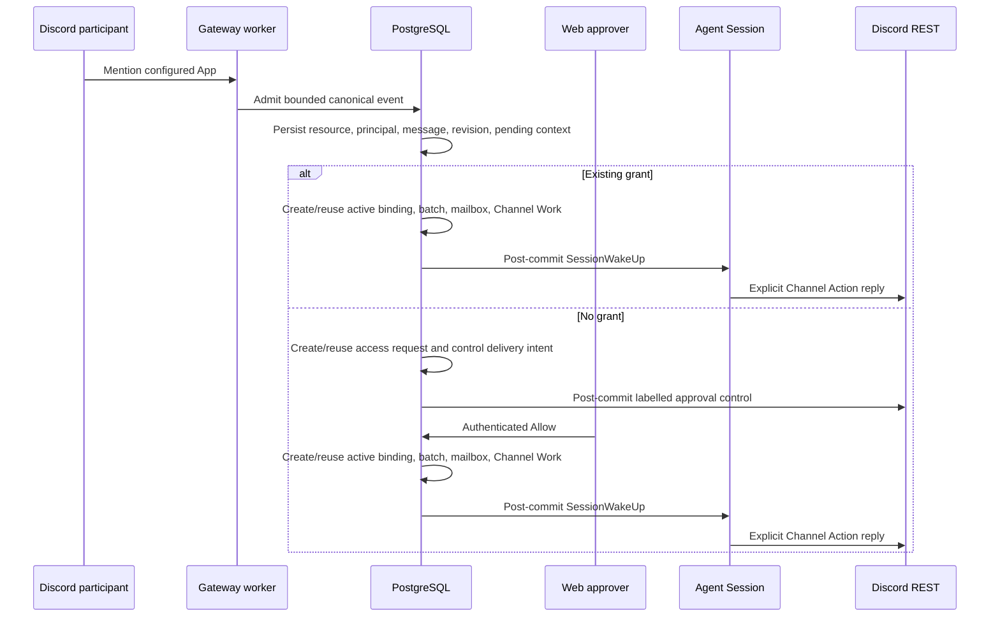

# Discord Message Invocation Design

- Snapshot: `external-260726`
- Document reference: `external-260726/DESIGN`
- Requirements: [external-260726/REQ](../requirements/external-260726-discord-message-invocation.md)
- ADR: [external-260726/ADR](../adr/external-260726-discord-message-invocation.md)
- Mode: Autonomous

## Traceability

| Requirement | ADR decisions | Design mechanism |
| --- | --- | --- |
| `external-260726/REQ-1` | D1-D3 | Discord event routing, durable access-control delivery, and committed invocation release |
| `external-260726/REQ-2` | D1-D2 | Existing grant/block checks and authenticated Web approval without principal-to-User conversion |
| `external-260726/REQ-3` | D1, D3, D4 | Provider-aware active binding, idempotent batch/mailbox release, Channel Work before wake |
| `external-260726/REQ-4` | D2, D4 | Discord `CONTROL_MESSAGE` create/delete plus existing Channel Action reply delivery |
| `external-260726/REQ-5` | D1, D3, D4 | Provider-specific branches at existing adapter boundaries and Slack regression coverage |

## Current Gap

`ExternalChannelEventProcessorService._process_discord_claimed_event` normalizes a
Gateway message, creates or finds a resource, persists the message/principal/revision,
and marks the event processed. The Slack path contains the canonical route, access,
binding, pending-context, invocation, mailbox, and wake-up logic, but Discord does not
enter it.

`ExternalChannelActionService` can already deliver Discord replies and progress, while
its Discord adapter rejects `CONTROL_MESSAGE`. Access Allow always creates a
`WAITING_HYDRATION` binding and its release helper does not ensure Channel Work, which
is incompatible with Discord's lack of a remote-history hydration adapter.

## Proposed Runtime Flow

## Component Changes

### Discord event processor

The Discord processor will use the same canonical route/resource/binding and
pending-context behavior as the Slack processor, while retaining Discord-specific
resource labels and ingress normalization.

- Resolve the existing binding's route first; otherwise resolve the Single App route.
- Lock the resource and active binding after route snapshot acquisition.
- Persist the normalized Discord revision and project an applied revision into pending
  context for the selected route.
- Check the Agent-level block and active grant for the persisted principal.
- For an active authorized binding, release the retained context into an idempotent
  invocation batch and mailbox item, then wake after commit.
- For an authorized initial mention, create an immediately active Discord binding,
  release pending context, and wake after commit.
- For an ungranted invocation, create an idempotent access request and Discord control
  delivery intent. It does not wake a Session.

The processor will not decrypt credentials for routing. The generic delivery service
will decrypt only after the control intent is committed and claimed.

### Discord approval controls

Discord control payloads contain only the target Guild/channel identifiers and bounded
control text. The approval link is rendered as labelled Markdown, never as a bare URL.
The control is delivered by `ExternalChannelActionService` after commit and uses the
existing deterministic nonce-fenced Discord create-message operation.

The access-control delete-intent repository logic becomes provider-aware. For Discord,
it creates a `PROGRESS_DELETE` attempt with the control's Guild/channel target and
provider message key. The generic Discord delivery adapter deletes that provider
message after a final access decision.

### Provider-aware approval activation

`ExternalChannelAccessService.allow` inspects the locked connection provider.

- Slack retains `WAITING_HYDRATION` and its existing delayed activation behavior.
- Discord creates an active binding immediately, then releases the triggering retained
  message into a batch and wake-producing mailbox item in the same transaction.
- The release helper ensures active Channel Work before wake-up so the Agent run can
  expose the binding-scoped Channel Action tool.

The existing unique active-binding and unique batch/trigger constraints remain the
idempotency boundary for repeated decisions and retries.

### Discord Channel Action delivery

The Discord delivery adapter accepts text-only `CONTROL_MESSAGE` create operations and
`PROGRESS_DELETE` operations from access-request origins. Existing reply, file, and
progress behavior remains unchanged.

## Data and API Impact

No new tables, migrations, public request fields, or generated client changes are
required. Existing access requests, delivery attempts, bindings, invocation batches,
and work rows carry the new behavior. Durable payloads retain only safe provider
identifiers, text, and the authenticated approval link; they do not retain credentials,
raw provider envelopes, interaction tokens, or attachment URLs/bytes.

## Failure and Concurrency Handling

- Provider calls occur only after durable commit and a `pending` → `attempting` claim.
- Discord create operations retain their deterministic nonce; ambiguous outcomes stay
  `unknown` and are not blindly retried.
- A missing Web URL produces a durable `not_attempted` control outcome; no invocation
  is released.
- Repeated event processing reuses message, access request, binding, batch, and mailbox
  identities.
- The resource lock serializes binding creation and pending-context release. A later
  event sees the active binding and uses the ordinary authorized continuation path.
- Blocked, revoked, or ungranted principals cannot release an invocation.

## Living Spec Updates

Update these living specs after implementation:

- `docs/azents/spec/flow/external-channel-provider-ingress.md` for Discord route,
  access, immediate active-binding, and invocation behavior.
- `docs/azents/spec/flow/external-channel-delivery.md` for labelled Discord approval
  control create/delete behavior.
- `docs/azents/spec/flow/external-channel-lifecycle.md` for provider-aware Allow
  activation semantics.

## Test Strategy

### E2E primary verification

The product-level primary scenario is: Gateway admission of an ungranted Discord
mention produces one approval control; authenticated Allow releases one retained
invocation; the resulting Agent Channel Action produces one Discord reply in the same
conversation. A deterministic provider fixture must record the create/delete/reply
requests and durable database state.

### CI and deterministic coverage

This single PR adds deterministic service tests for:

- granted Discord initial and subsequent invocations;
- ungranted Discord access-request control creation and blocked behavior;
- Discord Allow immediate activation, work creation, one batch/mailbox, and one wake;
- Discord control create/delete delivery including provider identity validation;
- idempotent repeated event or decision handling; and
- unchanged Slack access and processor behavior.

The existing CI Python suite is the required automated gate. The local Docker fake
container, multiprocess E2E, migration matrix, and live Discord credentials are not
available in this runtime and remain explicitly user-skipped rather than passed.

### Fixtures and evidence

Tests use projected Discord events and fake Discord REST clients only. They contain no
real credentials, interaction tokens, attachment URLs, or provider bodies. Evidence is
the test result, durable attempt state, mailbox/batch identity assertions, and recorded
sanitized REST operation parameters.

## Feasibility

| Requirement / decision | Result | Evidence |
| --- | --- | --- |
| `REQ-1` | feasible | Event processor, access request, and delivery attempt repositories already exist; Discord processor omits their orchestration. |
| `REQ-2` | feasible | Current principal/grant/block model is provider-neutral and live connection inspection confirmed no implicit grant path. |
| `REQ-3` | feasible | Binding, batch, mailbox, wake, and root Session services are reusable; Allow needs only provider-aware activation. |
| `REQ-4` | feasible | Discord reply/create/delete adapters and durable delivery target reconstruction already exist; only control operation support is absent. |
| `REQ-5` | feasible | Slack branches can remain unchanged and are covered by existing service tests. |
| `ADR-D3` | conditional | No Discord remote-history adapter exists; immediate activation is correct for this focused fix and explicitly excludes remote-history parity. |

## Remaining Non-Blockers

- Discord initial checking/progress Tracker creation is deferred to the existing Channel
  Action projection path; this follow-up does not add a remote-history adapter.
- Provider-native Discord link presentation is text-based because Slack Block Kit
  controls do not exist on Discord.
- Deployment remains a separate authorized operation after the PR merges.

## Single-PR Boundary

One focused PR changes the Discord event processor, provider-aware access release,
control delivery/delete handling, deterministic tests, and the three living specs. No
migration, public API, generated client, Helm, or deployment change is required.
