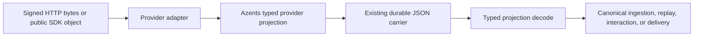

# external-260805/DESIGN: External Channel Typed Provider Projections

## Current Behavior and Requirement Gaps

External Channel ingress correctly owns signed raw HTTP bodies at the request boundary,
uses public `discord.py` objects for Discord Gateway messages, and retains durable
provider facts in JSON carriers. The gap is internal: later code receives generic
mappings rather than application-owned projection contracts, so it repeatedly performs
ad hoc mapping checks.

## Requirement and ADR Traceability

| Requirement | Decision | Design mechanisms |
| --- | --- | --- |
| external-260805/REQ-1 | external-260805/ADR-D1 | M1, M2 |
| external-260805/REQ-2 | external-260805/ADR-D1 | M3 |
| external-260805/REQ-3 | external-260805/ADR-D1 | M2, M4 |
| external-260805/REQ-4 | external-260805/ADR-D1 | M1, M4 |

## Architecture and Ownership

Provider adapters own raw-body verification, public SDK interaction, and conversion to
provider-specific projections. Projection contracts are owned by Azents and are the
only typed decode/encode boundary for durable JSON. Repositories continue to own JSON
persistence; canonical ingestion, history, interactions, and rendering consume
validated projections rather than provider SDK objects.

## Data and Lifecycle

1. Slack HTTP and Discord interaction handlers retain raw bytes only until signature
   verification and bounded decode complete.
2. Discord Gateway callbacks project public SDK objects directly to a typed Discord
   projection.
3. Slack SDK and Discord REST responses decode through the corresponding typed
   projection helpers before normalization.
4. The projection serializes to the existing `ExternalChannelTrigger.envelope` or
   interaction `projection` JSON carrier without changing its persisted meaning.
5. Replay decodes the stored JSON through the same projection contract before
   canonical processing.

Malformed provider data follows existing provider-invalid or malformed-history paths.
No fallback SDK-object reconstruction is introduced.

## Migration, Rollout, and Recovery

No database migration is required. The projection encoders retain the existing durable
JSON meaning and decoders accept the current bounded representation. Rollback restores
the previous consumers of the same JSON carrier. Existing retry, idempotency, and
replay authority remain unchanged.

## Security and Operations

Projection contracts must not add raw bodies, credentials, tokens, private provider
URLs, SDK state, or Gateway frames to durable records or logs. Signature verification
continues before provider payload admission. No new runtime configuration or operational
mode is introduced.

## Test Strategy

The primary behavior evidence remains the existing deterministic External Channel
provider-fake E2E coverage for signed Slack callbacks and Discord Gateway/interaction
admission. Focused unit tests verify projection decode/encode equivalence, malformed
payload rejection, history normalization, interaction replay, and provider response
handling. No new testenv fixture or credential is required because the existing fake
providers exercise the same public ingress boundaries.

CI must run backend Ruff, `ty`, Pyright, focused External Channel tests, and the full
backend test suite. A provider-fake E2E failure is blocking. Optional live-provider
tests remain out of scope and cannot be used as a substitute for deterministic evidence.

## Alternatives and Risks

The rejected SDK-reconstruction option would couple durable replay to private SDK
internals and live cache state. The primary implementation risk is accidental JSON
shape drift; equivalence tests and existing replay fixtures provide the required
evidence.

## Design Authority

- Design revision: `1`

| ID | Material design mechanism | Authority | Classification |
| --- | --- | --- |
| M1 | Provider-specific typed contracts decode and encode bounded durable JSON. | external-260805/REQ-1; external-260805/ADR-D1 | `decided` |
| M2 | Existing JSON carriers retain their persistence and replay authority without a migration. | external-260805/REQ-3; external-260805/ADR-D1; External Channel Spec | `derived` |
| M3 | Signed raw bodies and public Discord SDK callbacks retain their current process-local ownership. | external-260805/REQ-2; External Channel Provider Ingress Spec | `existing` |
| M4 | Provider normalization, history, interaction, and delivery consume validated projections and preserve current domain-error paths. | external-260805/REQ-3, REQ-4; external-260805/ADR-D1; External Channel Spec | `derived` |

## Removal and Replacement

| Existing unit or behavior | Removal authority | Replacement or remaining authority | Removal boundary | Absence verification |
| --- | --- | --- | --- | --- |
| Ad hoc generic mapping interpretation in provider projection paths | external-260805/ADR-D1 | M1 typed projection contracts | Provider adapter and normalizer boundaries | `ty` has no diagnostics in the affected External Channel paths |
| Durable SDK-object reconstruction | None; no current implementation exists | M1/M2 retain JSON-only durable replay | None | Repository inspection confirms no SDK objects are persisted |
| Existing JSON carrier schema | External Channel Spec; external-260805/ADR-D1 | Remains authoritative through M2 | None | Existing replay and repository fixtures decode unchanged JSON |

## Feasibility

**Feasible.** Current code already separates request-local signed bodies, public Discord
Gateway objects, and durable JSON carriers. Existing provider normalizers and focused
tests identify each affected conversion path. No database, public API, or runtime
configuration change is required.

## Design Approval

- Mode: `Collaborative`
- Decision owner: requester
- Approved on: 2026-08-05
- Approved Design revision: `1`
- Approved authority IDs: `M1, M2, M3, M4`
- Approved scope: typed Azents-owned Slack and Discord projections over the existing
  durable JSON carriers, without SDK-object reconstruction or public behavior changes.
