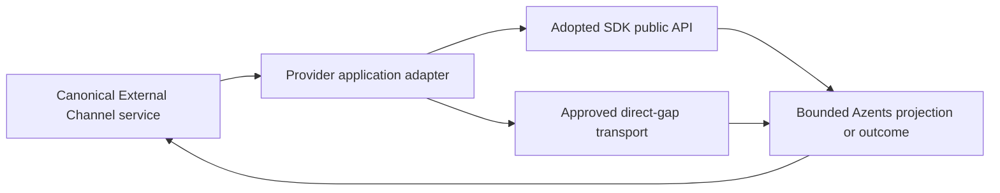

# external-260809/DESIGN: External Channel Provider Integration Reliability

## Current Behavior and Requirement Gaps

Slack already uses public `slack-sdk` APIs for Web API, signature verification, and
Socket Mode. Its remaining direct HTTP is file-byte transport: authenticated private
file download and upload to the provider-issued external upload URL.

Discord Gateway uses public high-level `discord.py` callbacks, but the remaining REST
surface is implemented through Azents-authored `httpx` requests:

- Application metadata, Bot identity, Interaction Endpoint configuration, and Guild
  command reconciliation in `discord_api.py`;
- channel/thread reads and mutations plus text/file message mutations in
  `discord_delivery.py`;
- exact-message and paginated history reads in `discord_history.py`; and
- source-message refresh plus attachment CDN transfer in `discord_files.py`.

Dependency providers in `channel_action.py`, `file_transfer.py`, and
`ingestion_history.py` inject general `httpx.AsyncClient` instances into those Discord
adapters. Route-level unit tests and deterministic provider fakes therefore encode
Azents-owned Discord API paths. Discord Gateway test configuration also imports and
mutates `discord.http.Route` and `discord.gateway.DiscordWebSocket`, which are private
SDK implementation surfaces.

The required end state is operation-based:

- the adopted SDK public API owns every supported provider operation;
- direct REST remains only for the five adopted-SDK gaps accepted by
  `external-260809/ADR-D4`;
- SDK models are converted immediately into bounded Azents projections;
- canonical External Channel state, effect ordering, authorization, and lifecycle do
  not move into an SDK; and
- tests no longer require private SDK state or hand-written routes for SDK-supported
  behavior.

## Requirement and ADR Traceability

| Requirement | ADR decisions | Design mechanisms |
| --- | --- | --- |
| external-260809/REQ-1 | external-260809/ADR-D1, D2, D3, D4 | M1, M2, M3, M5, M7 |
| external-260809/REQ-2 | external-260809/ADR-D1, D2 | M1, M2, M4, M5, M8 |
| external-260809/REQ-3 | external-260809/ADR-D2, D3 | M2, M3, M4, M8 |
| external-260809/REQ-4 | external-260809/ADR-D2, D3 | M3, M4, M8 |
| external-260809/REQ-5 | external-260809/ADR-D3, D4 | M3, M7 |
| external-260809/REQ-6 | external-260809/ADR-D4 | M6, M7 |
| external-260809/REQ-7 | external-260809/ADR-D1, D4 | M5, M6, M7 |

## Architecture and Ownership

### Provider-call boundaries

Azents retains provider-specific application adapters but separates them into two
explicit boundary types:

1. **SDK adapters** own public `slack-sdk` or `discord.py` object lifecycle, method
   invocation, SDK exception translation, and conversion from public SDK models to
   bounded Azents projections.
2. **Direct-gap transports** own exactly one approved raw byte or command-create
   operation. They expose operation-specific methods and cannot issue arbitrary
   provider requests.

Canonical repositories and services continue to own connection state, credentials,
routing, authorization, conversation positions, bindings, Channel Work, delivery
planning, and post-effect settlement. SDK objects remain process-local and never enter
repositories, events, queue payloads, logs, or durable projections.

### Slack boundary

`SlackConversationClient` continues to use `AsyncWebClient` for every Web API method.
The general `httpx.AsyncClient` dependency is removed from its SDK-supported message,
history, view, metadata, upload-target, and completion paths.

File bytes move behind two operation-specific collaborators:

- `SlackPrivateFileTransport` performs authenticated `HEAD` and bounded streaming
  `GET` for a URL already resolved and validated through SDK-owned `files.info`.
- `SlackExternalUploadTransport` performs one bounded streaming `POST` to a URL already
  returned and validated through SDK-owned `files.getUploadURLExternal`.

The Slack adapter coordinates SDK control-plane calls and direct byte transfer without
turning either transport into a general Slack API client. Existing `retry_handlers=[]`,
non-propagating SDK logger, token locality, deadline, and final error mapping remain.

### Discord SDK session lifecycle

A production `DiscordSDKClientFactory` creates an async context manager for one logical
provider operation using public `discord.Client` lifecycle:

1. create a client with no Gateway intents for REST-only use;
2. call public `Client.login(bot_token)`;
3. expose a narrow operation facade backed only by public client, channel, message,
   thread, attachment, Application, and application-command objects;
4. execute the operation under the caller's absolute deadline; and
5. call public `Client.close()` in `finally`.

The factory does not cache tokens or SDK clients across requests. This avoids creating a
second credential store, cross-request lifecycle authority, or connection health mode.
One activation workflow may reuse one context for its Application, Bot, endpoint, and
command reconciliation sequence; one delivery or history operation owns its own
bounded context.

The existing long-lived Discord Gateway client remains separately owned by the Gateway
manager. REST adapters do not borrow or discover Gateway clients because API, Worker,
and Gateway processes have independent lifecycle and lease authority.

### Discord operation mapping

`DiscordAPIClient` becomes an application adapter over the SDK factory plus one command
create gap transport:

- Application identity: `Client.application_info()`;
- Bot identity: the authenticated public `Client.user` value;
- Interaction Endpoint: `AppInfo.edit(interactions_endpoint_url=...)`;
- Guild command list: `CommandTree.fetch_commands(guild=...)`;
- matching command update/delete: public `AppCommand.edit()` and `delete()`; and
- missing required command creation: operation-specific direct REST because
  `discord.py` exposes only bulk tree synchronization for creation and that would make
  the local tree authoritative over unrelated customer commands.

`DiscordDeliveryClient` becomes an SDK adapter plus one file-message gap transport:

- fetch channel/thread: `Client.fetch_channel()` with Guild, parent, and type checks;
- fetch root message: public messageable `fetch_message()`;
- create thread: `Message.create_thread()`;
- edit thread title: `Thread.edit(name=...)`;
- text message creation: public `send(..., nonce=...)`, preserving SDK-emitted
  `enforce_nonce=true`;
- message edit/delete: public partial-message `edit()` and `delete()`; and
- file message creation from bounded async Runtime/Exchange streams: direct multipart
  gap transport.

Embeds and link controls are built through public `discord.Embed`, `discord.ui.View`,
and `discord.ui.Button` APIs. Azents presentation contracts remain provider-neutral;
the SDK adapter performs the final lowering.

`DiscordConversationHistoryClient` uses public exact-message fetch and history iterators.
It performs explicit batches using the current cursor and maximum 100-message page size
so Azents retains page, scanned-message, retained-message, deadline, trigger, and
position accounting. Public `discord.Message` objects are projected through one bounded
SDK-message projector shared with Gateway projections where their public fields match.
The obsolete raw HTTP response byte cap and raw JSON decoders are removed.

`DiscordChannelClient` refreshes the source message and attachment identity through the
same public exact-message SDK operation. Only the attachment URL byte transport remains
direct. The direct CDN transport validates the SDK-returned URL against the current
Discord CDN/test origin allowlist before issuing `HEAD` or `GET`, rejects redirects,
requires one valid `Content-Length`, enforces preflight and streamed byte bounds, and
never receives the Bot token.

## Direct-Gap Transport Allowlist

The implementation contains exactly five direct provider operations:

| Gap ID | Provider operation | Required request authority | SDK-owned surrounding operations | Removal condition |
| --- | --- | --- | --- | --- |
| G1 | Discord create one Guild command | Bot token, Application ID, Guild ID, bounded command payload | login, Application/Bot identity, list, edit, delete | `discord.py` exposes preservation-safe individual command creation |
| G2 | Discord multipart file Create Message | Bot token, channel ID, nonce, bounded multipart stream | target resolution and non-file message operations | `discord.py` accepts the existing bounded async source without full buffering/storage and preserves nonce behavior |
| G3 | Discord attachment CDN `HEAD`/streaming `GET` | validated SDK-returned CDN URL; no Bot token | exact message and attachment metadata refresh | `discord.py` exposes bounded no-redirect attachment streaming |
| G4 | Slack private-file `HEAD`/streaming `GET` | Bot token and SDK-resolved private URL | `files.info` metadata and identity | `slack-sdk` exposes bounded authenticated private-file streaming |
| G5 | Slack external-upload streaming `POST` | SDK-issued upload URL and exact file length | `files.getUploadURLExternal`, `files.completeUploadExternal` | `slack-sdk` exposes bounded streaming upload without full buffering |

Each transport class accepts only the fields needed for its operation and constructs one
fixed route shape internally. No public `request(method, path, ...)` method, generic
provider base client, arbitrary URL for control-plane calls, or fallback dispatch exists.

## Data, State, and Lifecycle

No database, public API, event, queue, or persisted projection schema changes.

The lifecycle for an SDK-supported operation is:

1. canonical service resolves and revalidates current authority;
2. provider effect commits when the existing flow requires commit-before-I/O;
3. adapter opens the SDK context with request-local decrypted credentials;
4. adapter calls one public SDK method under the remaining absolute deadline;
5. adapter converts the public result into a bounded Azents value;
6. adapter closes the SDK context; and
7. existing service settlement records only the provider-neutral outcome or current
   projection identity.

The lifecycle for a direct gap is identical except that step 3 opens the
operation-specific `httpx` transport and step 4 issues its one fixed request.
Credentials, SDK objects, provider URLs, raw bodies, and file bytes remain process-local.

## Failure, Retry, and Recovery

- Slack SDK retry handlers remain disabled.
- Discord adapters invoke one public SDK operation and add no Azents retry or direct
  fallback. SDK-owned internal handling remains inside that call.
- All SDK calls are wrapped by the existing absolute operation deadline. Timeout or
  cancellation closes the context and follows the current ambiguous or temporary
  classification for that operation.
- Discord text Create Message always supplies the existing operation nonce. Azents does
  not call `send` again after an unresolved result.
- Direct gaps remain one-attempt operations and keep their existing confirmed-rejection
  versus ambiguity mapping.
- Command reconciliation preserves unrelated commands by listing through the SDK,
  updating or deleting only Azents-owned matched commands, and using G1 only when one
  required command is absent.
- No durable retry, reconciliation queue, compensation, backfill, or compatibility path
  is added.

## Security and Permissions

- Decrypted Bot tokens exist only in the provider adapter call stack.
- SDK loggers are non-propagating and must not emit request bodies, headers, tokens, raw
  provider responses, private URLs, or file bytes.
- SDK-returned objects are projected before crossing the adapter boundary.
- Direct URL transports retain strict scheme, host, port, path-prefix, user-info, and
  fragment validation.
- Discord CDN redirects remain rejected before following them. Slack private-file
  redirect behavior retains its currently authorized final-origin and length checks.
- Direct gap G3 receives no Bot token. G4 receives only the Slack Bot token needed for
  the authenticated private URL. G5 receives no Slack API token.
- Runtime and Exchange authority, transfer claims, exact-length accounting, and
  canonical no-byte-retention rules remain unchanged.

## Dependency Injection and Configuration

Replace general provider HTTP-client dependencies with:

- one `DiscordSDKClientFactory` dependency used by activation, history, delivery, file
  metadata, and thread-title services;
- `DiscordGuildCommandCreateTransport`, `DiscordFileMessageTransport`, and
  `DiscordAttachmentByteTransport` dependencies for G1-G3;
- `SlackPrivateFileTransport` and `SlackExternalUploadTransport` dependencies for
  G4-G5; and
- the existing public Slack SDK client factory.

Production requires no new environment variable. Existing direct Discord API test base
URL is retained only for G1 and G2. Existing Discord CDN/test origins remain for G3.
The private `discord.py` API/Gateway global override is deleted.

Testenv selects deterministic SDK-facing factory implementations through existing
explicit testenv configuration/composition. The fake factory returns bounded
public-model-equivalent projections and records sanitized operation evidence; it does
not imitate private SDK HTTP state. The existing Discord Gateway deterministic runner
is replaced with an injected test runner rather than private `Route.BASE` or
`DEFAULT_GATEWAY` mutation.

## Migration, Rollout, and Rollback

This is a one-way code replacement with no database migration and no feature flag.

1. Add SDK-facing protocols, public `discord.py` production factory, and deterministic
   fakes.
2. Move Discord Application/identity/command-list-update-delete operations to the SDK;
   isolate G1.
3. Move Discord channel/thread/text-message/edit/delete operations to the SDK; isolate
   G2.
4. Move Discord history and attachment metadata to SDK models; isolate G3.
5. Split Slack SDK control-plane calls from G4/G5 byte transports.
6. Replace dependency wiring and testenv composition.
7. Delete obsolete raw clients, route builders, response decoders, private SDK test
   overrides, and route-level fixtures.
8. Add static absence checks and update Living Specs.

Rollback is a code rollback before deployment completion. There is no dual path, data
migration, or runtime mode to roll back independently. Provider leases, canonical state,
and credentials remain compatible because their schemas do not change.

## Observability and Operations

Existing sanitized provider failure logs and effect outcomes remain. Add operation labels
that distinguish `sdk` from the five stable gap IDs without recording routes, tokens,
URLs, bodies, SDK objects, or provider response data.

Metrics must retain provider, operation, outcome class, and elapsed time. Gap transports
add a bounded counter by gap ID so an SDK upgrade can prove whether an exception remains
in use. No new health state or readiness dependency is introduced.

## Test Strategy

### E2E primary verification matrix

| Journey | Primary deterministic evidence |
| --- | --- |
| Slack Single/Multi setup and validation | Existing provider-fake E2E through SDK-facing Slack fake |
| Discord Single/Multi setup, endpoint configuration, and command preservation | Discord SDK factory fake plus G1 fake; assert unrelated commands remain |
| Slack HTTP and Socket Mode ingress | Existing signed callback and injected Socket Mode lifecycle evidence |
| Discord Gateway and interaction ingress | Injected Gateway runner and existing signed interaction fake |
| Slack and Discord history ingestion | SDK-facing typed history fakes with exact trigger, pagination, bounds, and malformed identities |
| Discord thread creation/title lifecycle | SDK-facing message/thread fake with direct/ambiguous/reused cases |
| Text message/progress/control create-update-delete | Slack SDK fake and Discord SDK fake; nonce evidence retained |
| Slack/Discord inbound download | SDK metadata fake plus G3/G4 bounded byte transports |
| Slack/Discord outbound file reply | G2/G5 exact-length streams and existing Runtime/Exchange authority fixtures |
| Lifecycle cleanup and no replay | Existing commit-before-I/O and one-attempt outcome tests through new collaborators |

### Unit and integration coverage

- SDK model-to-Azents projection tests for Application, command, channel, thread,
  message, embed, component, author, mention, and attachment fields.
- SDK exception mapping tests for login, forbidden, not found, rate limit, server,
  timeout, cancellation, and malformed typed identity.
- Command reconciliation tests proving list/update/delete use SDK collaborators and G1
  is called only for a missing required command.
- Text Create Message tests assert the operation nonce reaches the SDK-facing method and
  no second call occurs after ambiguity.
- Every direct gap tests exact route, origin validation, headers, content length, chunk
  bounds, early/extra byte rejection, timeout, response classification, and closure.
- Static AST/repository tests reject imports from `discord.http` and
  `discord.gateway`, provider API route literals outside G1/G2 and endpoint validation,
  and provider-wide `httpx` request methods outside G1-G5.

### Testenv and CI policy

Testenv remains credential-free. Provider fixtures retain only bounded operation names,
identities, counts, nonce presence, and sanitized payload projections. They never retain
credentials, callback selectors, interaction tokens, private URLs, raw bodies, or file
bytes.

Required CI evidence:

- focused External Channel unit and repository tests;
- deterministic External Channel E2E suite;
- Ruff format and lint;
- `ty` and Pyright;
- complete Python test suite;
- documentation and snapshot validators; and
- static direct-call/private-SDK absence checks.

Any required deterministic E2E skip is a failure. Optional live-provider tests remain
non-authoritative and cannot replace deterministic evidence.

## Removal and Replacement

| Existing unit or behavior | Removal authority | Replacement or remaining authority | Removal boundary | Absence verification |
| --- | --- | --- | --- | --- |
| `DiscordAPIClient` general `httpx` implementation | external-260809/REQ-1, REQ-7; ADR-D1, D2 | M1 SDK adapter plus M3/G1 | Application/command adapter | No direct Discord control-plane routes except G1 |
| `DiscordDeliveryClient` general request method and raw message routes | external-260809/REQ-1, REQ-7; ADR-D2 | M1/M2 SDK methods plus M3/G2 | Delivery adapter | Text/thread/edit/delete route literals absent |
| `DiscordConversationHistoryClient` raw HTTP and JSON response decoding | external-260809/REQ-1, REQ-7; ADR-D2, D4 | M1/M5 typed SDK history | History adapter | No Discord history route requests or raw response parser |
| Discord source-message HTTP in file adapter | external-260809/REQ-1, REQ-7; ADR-D2 | M1/M5 SDK metadata refresh; M3/G3 byte transport | File adapter | Only CDN HEAD/GET remains direct |
| General Slack `httpx` dependency inside `SlackConversationClient` | external-260809/REQ-1, REQ-7; ADR-D3 | M1 Slack SDK plus M3/G4/G5 | Slack adapter composition | Direct Slack HTTP limited to two byte transports |
| Private `discord.http.Route` and `discord.gateway.DiscordWebSocket` test override | external-260809/REQ-1, REQ-6, REQ-7; ADR-D4 | M6 injected deterministic SDK/Gateway collaborators | Gateway test composition | Static private-import check and removed override tests |
| Route-level SDK-supported provider fixtures | external-260809/REQ-6, REQ-7; ADR-D4 | M6 SDK-facing deterministic fakes | Unit/testenv fixtures | No SDK-supported provider route assertions |
| Provider API base configuration for SDK-supported Discord operations | external-260809/REQ-1, REQ-7; ADR-D4 | M6 injected fake; production SDK default | Configuration and endpoint helpers | Base URL used only by G1/G2 deterministic gaps |
| Persistence, public API, event, and queue schemas | None; no change authorized | M8 retains current authority | None | Schema diff and migration scan are empty |

## Feasibility

- **REQ-1 — Feasible.** `discord.py 2.7.1` public APIs cover Application, identity,
  command list/edit/delete, channel/thread, exact message, history, text create with
  nonce, edit/delete, and attachment metadata. `slack-sdk 3.43.0` already covers Slack
  control-plane operations. Five exact unsupported operations have accepted gaps.
- **REQ-2 — Feasible.** Current provider-neutral projections, command ownership checks,
  thread reconciliation, and effect services can consume SDK-adapter DTOs without
  persistence or public API changes.
- **REQ-3 — Feasible.** `discord.py` public send accepts nonce and emits
  `enforce_nonce=true`; Azents makes one SDK invocation and retains post-call no-replay,
  commit-before-I/O, and current settlement semantics.
- **REQ-4 — Feasible.** G2-G5 preserve the existing bounded byte streams, authority,
  length, and storage rules without forcing SDK buffering.
- **REQ-5 — Feasible.** The exact gap list, operation-specific interfaces, origin
  restrictions, removal conditions, and static checks form a closed exception model.
- **REQ-6 — Feasible.** Existing DI already accepts provider clients at service
  boundaries; replacing route fakes with SDK-facing fakes and the private Gateway
  override with an injected runner requires no live credentials.
- **REQ-7 — Feasible.** Direct clients and tests are localized in the identified files,
  and repository scans can prove the absence of SDK-supported route literals and
  private SDK imports.

No feasibility blocker requires a Requirements or ADR change.

## Alternatives and Non-Blocking Risks

A second Discord SDK and a cross-language SDK adapter are excluded by the confirmed
Requirements and ADR, not retained as alternatives. A full-buffer SDK file path is not
equivalent to the required bounded stream and remains rejected.

Non-blocking implementation risks are `discord.py` public model construction in tests,
SDK exception detail differences, and additional login calls for short-lived REST
contexts. These are handled through adapter DTOs, sanitized exception mapping, context
reuse within one activation sequence, deadlines, and focused tests; they create no new
product behavior or authority.

## Design Authority

- Design revision: `1`

| ID | Material design mechanism | Authority | Classification |
| --- | --- | --- | --- |
| M1 | Adopted `slack-sdk` and `discord.py` public APIs own every supported provider operation. | external-260809/REQ-1, REQ-2; external-260809/ADR-D1, D2, D3 | `decided` |
| M2 | Request-scoped public `discord.Client` REST lifecycle and operation facade own Discord SDK calls without new credential or health state. | external-260809/REQ-1, REQ-2, REQ-3; external-260809/ADR-D1, D2; External Channel Spec | `derived` |
| M3 | Five operation-specific direct-gap transports form the complete raw provider allowlist. | external-260809/REQ-4, REQ-5; external-260809/ADR-D2, D3, D4 | `decided` |
| M4 | Existing deadlines, nonce fence, one Azents invocation, final error normalization, commit-before-I/O, and no post-ambiguity replay remain authoritative. | external-260809/REQ-2, REQ-3, REQ-4; external-260809/ADR-D2, D3; External Channel Delivery Spec | `derived` |
| M5 | Public SDK models are immediately converted to bounded Azents projections; raw SDK state is process-local. | external-260809/REQ-1, REQ-2, REQ-7; external-260809/ADR-D2, D4; external-260805/DESIGN | `derived` |
| M6 | Deterministic SDK-facing and Gateway collaborators replace private SDK endpoint mutation and SDK-supported route fakes. | external-260809/REQ-6; external-260809/ADR-D4; External Channel Provider Ingress Spec | `decided` |
| M7 | Static checks and removal obligations prevent direct-call, private-SDK, and fallback reintroduction. | external-260809/REQ-5, REQ-7; external-260809/ADR-D4 | `required` |
| M8 | Existing canonical persistence, lifecycle, authority, transfer, and provider-effect settlement remain unchanged. | external-260809/REQ-2, REQ-3, REQ-4; External Channel Spec; External Channel Delivery Spec | `existing` |

## Design Approval

- Mode: `Collaborative`
- Decision owner: requester
- Approved on: 2026-08-09
- Approved Design revision: `1`
- Approved authority IDs: `M1, M2, M3, M4, M5, M6, M7, M8`
- Approved scope: use the currently adopted Slack and Discord SDK public APIs for every
  supported operation, retain only five exact SDK-gap REST transports, remove all other
  direct provider calls and private SDK test surfaces, preserve current External Channel
  behavior and safety contracts, and verify the replacement through credential-free
  deterministic tests and static absence checks.
