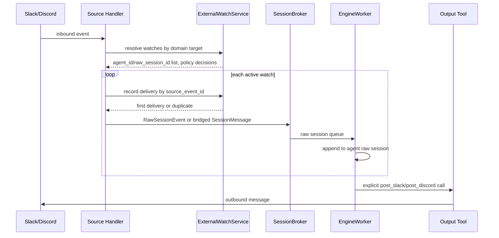

# External Watch / Raw Session Event Subscription

## Overview

This document is the design for [#3332](https://github.com/azents/azents/issues/3332). It abandons structure that mapped external channel events such as Slack/Discord to `ConversationSession` units, and changes to structure where external watch directly injects events into agent raw session.

Assumptions of parent design are below.

- `1 Agent = 1 raw session`
- External platforms such as Slack/Discord/GitHub/Jira already provide their own thread/channel/ticket/issue as work unit.
- NoIntern does not create separate `ConversationSession` per external context; it appends external event to agent raw session event stream.
- External response is not automatic reply routing. Agent explicitly specifies output tool target and executes it.

## Feasibility Verification Results

Current implementation can transition to #3332. However, because `SessionMessage.session_id` is core key for worker sharding, DB `run_state`, and sandbox lifecycle, #3332 alone does not complete full runtime owner transition; it must align with #3331 raw session foundation.

### Current Slack Path

- `SlackSessionService.resolve_agent_id(...)` returns installation's `agent_id` in BYOA mode, and `agent_id` from `slack_channel_bindings` in platform mode.
- `SlackSessionService.resolve_or_create_session(...)` queries `slack_sessions` by `(installation_id, channel_id, thread_ts, user_id)`.
- If mapping is absent, it creates new `conversation_sessions` row and `slack_sessions` row, and handler sends `SessionMessage(agent_id, session_id=conversation_session.id, interface=SlackInterfaceContext(...))`.

### Current Discord Path

- Discord finds agent through channel binding, and creates or reuses Discord thread for each message.
- `DiscordSessionService.resolve_or_create_session(...)` queries `discord_sessions` by `(installation_id, channel_id, thread_id, user_id)`.
- If mapping is absent, it creates new `conversation_sessions` row and `discord_sessions` row, and handler sends `SessionMessage(agent_id, session_id=conversation_session.id, interface=DiscordInterfaceContext(...))`.
- Discord bot message tracking is tied to `discord_bot_messages.discord_session_id`, so separate source-specific tracking table is needed during watch transition.

### Current Scheduler Path

- `ScheduledTaskWorker` claims due task, then creates `ConversationSession` on every execution and injects `SessionMessage`.
- In #3332, scheduled trigger is not merged into `ExternalWatch`. Scheduler keeps separate lifecycle/table but shares raw session event envelope.

### Current Worker Constraints

- `EngineWorker` shards per-session runner by `session_id` of message received from broker.
- When receiving `SessionMessage`, it updates `conversation_sessions.run_state`, `last_activity_at`, `run_heartbeat_at`, and notifies sandbox manager of activity.
- Stuck recovery creates `RESUME` message with `ConversationSession` record.
- Therefore, first implementation of #3332 provides bridge to use `session_id = agent.raw_session_id`, and removal of `ConversationSession` runtime fields is completed in #3331/#3338.

## Goals

1. Represent external channel/thread/issue/ticket subscriptions as common `ExternalWatch` domain.
2. Convert external event into common raw session event envelope.
3. Replace existing Slack/Discord session mapping creation path with watch-based routing.
4. Do not automatically bind external response target to event origin; make it explicit through output tool contract.
5. Provide only hooks for future access policies such as Personal agent, and handle concrete policy in subsequent implementation.

## Non-goals

- Existing `slack_sessions` / `discord_sessions` data backfill.
- Migration preserving existing thread history as NoIntern session history.
- Completion of Personal agent DM-only/private access policy.
- Merging Scheduler itself into `ExternalWatch` table.
- Full removal of `ConversationSession` runtime ownership. This is scope of #3331/#3338.

## Data Model

### ExternalWatch

Create Slack/Discord-specific tables first and explicitly model domain-specific target fields. Other domains add separate table and polymorphic domain model during actual implementation.

| Column | Type | Notes |
| --- | --- | --- |
| `id` | string(32) | uuid7 hex |
| `workspace_id` | string(32) | workspace FK |
| `agent_id` | string(32) | watched agent FK |
| `installation_id` | string | Slack/Discord installation row id |
| `channel_id` | string | Slack/Discord channel id |
| `thread_ts` / `thread_id` | string nullable | Slack thread timestamp / Discord thread id |
| `created_by_user_id` | string nullable | NoIntern user who created watch |
| `status` | enum | `active`, `paused`, `deleted` |
| `metadata` | jsonb | domain-specific routing metadata |
| `created_at` | timestamptz | server default |
| `updated_at` | timestamptz | onupdate |

Recommended indexes:

- active identity unique index per domain where `status != 'deleted'`
- target fan-out query index per domain
- `(agent_id, status)` agent-by-agent watch query index
- `(installation_id)` installation-level query index

Slack/Discord target identity is not ownership key. One Slack channel message must be able to fan out to multiple agents, so same target can be subscribed by multiple `agent_id`s. However, if same agent subscribes same external target multiple times, same message can be received multiple times, so active identity per domain must be unique.

Routing key helper examples:

- Slack channel watch: `slack:{installation_id}:channel:{channel_id}`
- Slack thread watch: `slack:{installation_id}:channel:{channel_id}:thread:{thread_ts}`
- Discord channel watch: `discord:{installation_id}:channel:{channel_id}`
- Discord thread watch: `discord:{installation_id}:channel:{channel_id}:thread:{thread_id}`

### domain-specific tracking

Slack/Discord watch table stores only subscription identity for each domain. Auxiliary state needed by each domain lives in separate tables.

- Slack can initially start without separate tracking table because `channel_id`, `thread_ts`, and `bot token` are enough for thread response.
- Discord needs to exclude bot-sent message id from history collection, so it has `discord_watch_bot_messages(watch_id, discord_message_id)`.

### delivery dedupe

watch fan-out must be idempotent per message. One external message can be delivered to multiple agents, but it must be delivered only once to same agent raw session.

For this, have delivery table per Slack/Discord.

| Column | Type | Notes |
| --- | --- | --- |
| `id` | string(32) | uuid7 hex |
| `watch_id` | string(32) | domain-specific watch table FK |
| `agent_id` | string(32) | fan-out target agent |
| `raw_session_id` | string(32) | delivery target raw session |
| `source_event_id` | string | stable source-specific event/message id |
| `delivered_at` | timestamptz | first delivery time |

Recommended unique index:

- `(watch_id, source_event_id)`

Slack `source_event_id` example is `slack:{team_id}:{channel_id}:{event_ts}`, and Discord is `discord:{guild_id}:{channel_id}:{message_id}`. Retry or duplicate webhook receive becomes no-op at this unique key.

## Raw session event envelope

Initial implementation does not fully replace existing `SessionMessage`; it adds envelope as dataclass and converts to `SessionMessage` in broker/worker adapter. After #3331 completes, promote `RawSessionEvent` as primary message of broker.

```python
@dataclasses.dataclass(frozen=True)
class RawSessionEvent:
    agent_id: str
    raw_session_id: str
    event_id: str
    source: str
    kind: str
    user_id: str | None
    messages: list[InputMessage]
    origin: ExternalEventOrigin | None
    additional_system_prompt: str | None
    workspace_id: str | None
```

`origin` preserves source-specific metadata.

```python
@dataclasses.dataclass(frozen=True)
class ExternalEventOrigin:
    watch_id: str | None
    source: str
    installation_id: str | None
    reply_target: dict[str, str | None]
```

`reply_target` examples:

- Slack: `{ "channel_id": "C...", "thread_ts": "171...", "team_id": "T..." }`
- Discord: `{ "channel_id": "...", "thread_id": "...", "guild_id": "..." }`

Note: `reply_target` is not automatic response destination. It can be provided as default suggestion when model/agent explicitly calls output tool, but system does not automatically post.

## Routing Flow



## Slack Cutover

1. Keep `slack_channel_bindings` as source of truth for channel → agent setting.
2. On Slack event receive, query active watches by `(installation_id, channel_id, thread_ts?)`.
3. If thread watch exists, fan out to those thread watches.
4. If no thread watch and channel binding exists, create or reuse channel watch per agent.
5. Same Slack message can be delivered to multiple agent raw sessions. But apply `source_event_id` dedupe per watch and inject only once.
6. Put Slack metadata into `RawSessionEvent` origin and inject message event into agent raw session.
7. Remove `slack_sessions` creation/query from cutover branch.
8. Existing `slack_sessions` data is dropped or orphan-ignored in migration.

Initially model Slack DM with source scope `dm`; until concrete Personal agent policy is decided, create watch only when it passes same workspace policy hook as existing BYOA/channel binding.

## Discord Cutover

1. Keep `discord_channel_bindings` as source of truth for channel → agent setting.
2. Discord handler creates/reuses thread, then finds or creates thread watches per agent by `(installation_id, channel_id, thread_id)`.
3. Same Discord message can be delivered to multiple agent raw sessions. But apply `source_event_id` dedupe per watch and inject only once.
4. Remove `discord_sessions` creation/query.
5. Remove dependency on `DiscordInterfaceContext.session_id`, and move bot message tracking to `discord_watch_bot_messages.watch_id`.
6. Existing `discord_sessions` / `discord_bot_messages` data is discarded in migration.

## Explicit Output Tool Target

External post tools require target as mandatory input.

- `post_slack_message(channel_id, text, thread_ts=None, installation_id=None)`
- `post_discord_message(channel_id, text, thread_id=None, installation_id=None)`

Post tool call is intentionally not idempotent. Sending same content multiple times to same target can be normal usage, so do not confuse inbound delivery dedupe with outbound send. In particular, reply target with `thread_ts`/`thread_id` is also not a unit that should receive only one response. Agent can send multiple replies to same thread, such as progress, intermediate result, final result. Duplicate-send prevention is not unique constraint of tool; it belongs to agent judgment, user confirmation, or separate outbox policy when needed.

Agent prompt provides inbound origin as “available target suggestion”. However, because automatic reply is not done, following situations are also possible.

- Request received in Slack thread, but result left on GitHub issue.
- Diagnose from Discord alert thread, then write summary to Jira ticket.
- Person selects target in Web raw session and sends to Slack.

## Access Policy Hook

`ExternalWatchService.resolve_or_create_watch(...)` calls following hook before creating watch.

```python
class ExternalWatchPolicy(Protocol):
    async def can_bind_external_watch(
        self,
        *,
        agent_id: str,
        source: str,
        scope: str,
        actor_user_id: str | None,
        installation_id: str | None,
        metadata: dict[str, object],
    ) -> bool: ...
```

Initial implementation validates only workspace membership, installation ownership, and channel binding. Personal agent DM-only/private policy is added as subsequent implementation of this hook.

## Step-by-step Implementation Plan

### Phase 1 — Model and service skeleton

- Add `ExternalWatchStatus` enum.
- Add Slack/Discord-specific watch/delivery models, repositories, services.
- Create Alembic migration with `alembic revision`.
- QA:
  - repository unit test: create/get-by-external-key/status filtering.
  - unique index conflict test.

### Phase 2 — Envelope and broker bridge

- Add `RawSessionEvent`, `ExternalEventOrigin` dataclasses.
- Add bridge helper converting `RawSessionEvent` → existing `SessionMessage`.
- Until raw session foundation, use agent's canonical session id or temporary `ConversationSession` id as `raw_session_id`.
- QA:
  - serialization roundtrip test.
  - ensure existing `SessionMessage` tests do not break.

### Phase 3 — Slack watch routing

- Remove call to `SlackSessionService.resolve_or_create_session(...)` from Slack handler.
- Add channel/thread watch resolve-or-create.
- Change Slack attachment storage path based on `raw_session_id`.
- QA:
  - channel mention → watch created → raw session event injected.
  - thread reply → inject into same watch/agent raw session.
  - keep BYOA mode agent resolution.

### Phase 4 — Discord watch routing

- Remove call to `DiscordSessionService.resolve_or_create_session(...)` from Discord handler/event service.
- Add thread watch resolve-or-create.
- Move bot message tracking to watch-based.
- QA:
  - watch created when new thread is created.
  - same watch used on existing thread reply.
  - bot message id exclusion preserved.

### Phase 5 — ScheduledTrigger separation

- Bridge Scheduler to inject agent raw session event without creating new `ConversationSession`.
- Preserve `scheduled_task_id` in both `InputMessage.metadata` and `origin`.
- QA:
  - cron/one-shot task injects event into raw session.
  - Slack/Discord output target executes only through explicit tool path.

### Phase 6 — legacy cleanup

- Remove `slack_sessions`, `discord_sessions`, `discord_bot_messages` table/model/repository.
- Drop existing data in cutover migration.
- QA:
  - migration upgrade/downgrade dry run.
  - Slack/Discord integration E2E.
  - verify worker stuck recovery keeps working under #3331 bridge condition.

## Open Questions

- #3331 must decide whether canonical field storing agent raw session id is `agents.raw_session_id` or separate `agent_raw_sessions` table.
- GitHub/Jira watch webhook identity, dedupe key, outbound tool contract need separate design when adding source.
- How Web UI displays origin suggestion is handled in frontend design.
