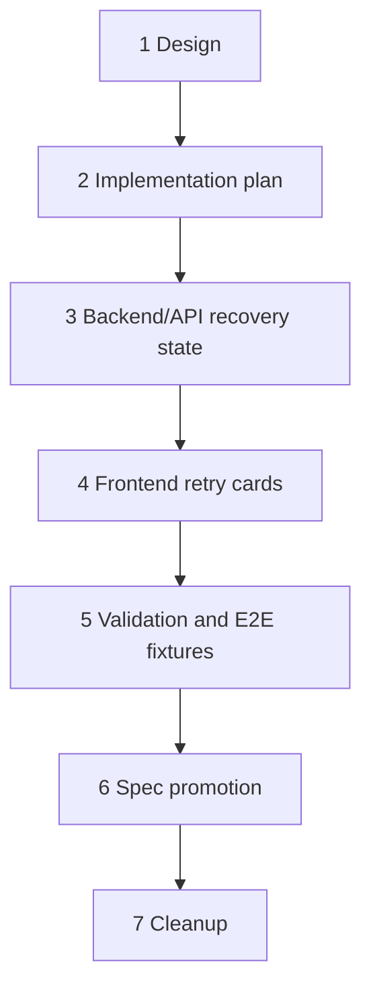

# Failed-run Retry Recovery UX Implementation Plan

## Feature Summary

This plan ships the failed-run retry recovery UX described in [Failed-run Retry Recovery UX](./failed-run-retry-recovery-ux.md).

The feature makes failed-run retry visible and recoverable:

- automatic retry shows a live retry card immediately after the first failed attempt;
- the card shows the latest user-safe error, next retry countdown, LLM dots during retry model calls, and expandable attempt history;
- terminal failed-run errors render as a single recovery card with the error message inside the card;
- exhausted failed runs can be manually retried only when the failed-run error card is the latest visible durable event;
- accepted manual retry soft-reverts the terminal failed output and re-enters the normal run loop without adding a synthetic user message.

## Stack Prefix

`Failed-run retry recovery UX`

## Planned PR Stack

1. `Failed-run retry recovery UX [1/7]: Design`
   - Approved design document.
2. `Failed-run retry recovery UX [2/7]: Implementation plan`
   - This multi-phase implementation plan.
3. `Failed-run retry recovery UX [3/7]: Backend/API recovery state`
   - Retry attempt history in durable retry state and terminal metadata.
   - Live-run WebSocket update/clear actions.
   - Manual retry REST action and idempotent chat-write boundary.
   - Backend unit/integration tests.
4. `Failed-run retry recovery UX [4/7]: Frontend retry cards`
   - Frontend live retry state model.
   - Live retry card, terminal failed-run card, countdown, attempt history, and manual retry action.
   - Component stories and frontend tests.
5. `Failed-run retry recovery UX [5/7]: Validation and E2E fixtures`
   - Deterministic failure fixtures and E2E coverage.
   - Validation evidence and fixes discovered during validation.
6. `Failed-run retry recovery UX [6/7]: Spec promotion`
   - Living spec updates after implementation is complete.
   - Mark the design implemented if validation passes.
   - ADR proposal only if implementation introduces a hard-to-reverse decision beyond the approved design.
7. `Failed-run retry recovery UX [7/7]: Cleanup`
   - Remove this implementation plan after specs and implementation are current.

## Phase Dependencies

Backend/API must land before frontend because frontend needs generated OpenAPI client changes and live-run payloads. Validation must land after backend and frontend behavior exists. Spec promotion must wait until validation proves the shipped behavior.

## Phase 3 — Backend/API Recovery State

### Scope

- Extend failed-run retry domain models:
  - add bounded `FailedRunAttemptSummary`;
  - add `attempts` to `FailedRunRetryState`;
  - add optional `attempts` to `FailedRunFailureMetadata`.
- Preserve user-safe attempt history when `_record_failed_run_attempt()` updates retry state.
- Extend `/live.run.retry` response with attempt summaries.
- Add semantic WebSocket payloads:
  - `live_run_updated`;
  - `live_run_cleared`.
- Publish live-run updates after:
  - run start;
  - run phase changes;
  - retry state changes;
  - retry handover/republication;
  - terminal run clear.
- Add public manual retry endpoint:
  - `POST /chat/v1/sessions/{session_id}/retry-failed-run`.
- Add idempotency support:
  - `ChatWriteRequestType.FAILED_RUN_RETRY`;
  - accepted response type `failed_run_retry`.
- Enforce retry eligibility:
  - session is idle;
  - no pending command/input buffer;
  - target event is a visible `system_error` with `failure.kind = "failed_run"`;
  - target event is the latest visible durable event.
- On accepted manual retry:
  - soft-revert visible events from the failed event model order onward;
  - clear pending buffers defensively;
  - mark session running;
  - send normal `SessionWakeUp`;
  - return a write snapshot with `history_reload_required = true`.
- Regenerate OpenAPI and generated clients.

### Backend Tests

- Retry state appends bounded attempt summaries and preserves latest fields.
- Terminal failed-run metadata includes user-safe attempts.
- `/live` includes `run.retry.attempts`.
- `live_run_updated` publishes on retry-state changes.
- `live_run_cleared` publishes on terminal clear.
- Manual retry accepts only latest visible failed-run error.
- Manual retry rejects stale failed events with `409 Conflict`.
- Manual retry soft-reverts terminal failed output and wakes normal run dispatch.
- Manual retry idempotency returns the same accepted result for repeated `client_request_id`.

### Risks

- Duplicate live-run updates could race with existing legacy run events. Frontend reducers must treat the semantic live-run snapshot as authoritative.
- Soft-revert model-order boundaries must avoid discarding newer user-visible context. The latest-visible-event guard is mandatory.
- Attempt summaries must remain user-safe and bounded.

## Phase 4 — Frontend Retry Cards

### Scope

- Extend frontend types for `run.retry` and attempt summaries.
- Store `liveRun` in `ManagedLiveState` instead of discarding retry details.
- Handle REST `/live` snapshots, `live_run_updated`, and `live_run_cleared` through the same managed live-state reducer.
- Render `RunRetryCard` in latest-following timeline state.
- Render `AgentRunIndicator` below the retry card during `waiting_for_model` or `streaming_model` retry attempts.
- Render `FailedRunErrorCard` for terminal failed-run `system_error` messages.
- Keep non-failed-run errors as simple cards with the error message inside the card.
- Add client-side countdown from `next_retry_at` without server-side tick events.
- Add expandable attempt history for live and terminal cards.
- Add manual retry button only when:
  - the terminal failed-run message is the latest visible durable event;
  - session is idle;
  - mutation is available and not pending.
- Add tRPC mutation wrapper using the generated public client.

### Frontend Tests and Stories

- Story: live retry waiting with countdown.
- Story: live retry model call with dots indicator below the card.
- Story: expanded attempt history.
- Story: terminal retry-exhausted failed-run card with retry action.
- Story: stale terminal failed-run card with retry action unavailable.
- Story: non-failed-run simple error card.
- Reducer tests for REST snapshot and WebSocket patch handling.
- Countdown hook tests for timestamp handling and cleanup.

### Risks

- Existing `isResponsePending` and `isModelResponsePending` logic is currently boolean-heavy. The migration must preserve existing indicators for normal model calls, compaction, pending inputs, and initialization.
- Mobile layout must keep long provider JSON inside the card without dominating the viewport.

## Phase 5 — Validation and E2E Fixtures

### Fixture Requirements

Testenv needs deterministic failed-run controls:

- fail N model calls then succeed;
- always fail until retry exhaustion;
- fail with distinct messages per attempt;
- optionally shorten retry backoff in deterministic tests;
- create a stale failed-card scenario by appending a newer visible durable event after a failed-run error.

These fixtures are required because live provider rate-limit behavior is nondeterministic and should not gate CI.

### E2E Primary Validation Matrix

1. **Retry card appears immediately**
   - Trigger one deterministic model failure.
   - Assert live retry card appears before retry exhaustion.
   - Assert no durable terminal `system_error` appears during retry.

2. **Latest error and countdown update**
   - Trigger multiple distinct failures.
   - Assert newest message, attempt count, and countdown are shown.

3. **LLM dots during retry attempt**
   - Observe the retry card during the next model call.
   - Assert dots render below the retry card.

4. **Expandable history**
   - Expand card after several failed attempts.
   - Assert user-safe attempts are listed in order.

5. **Retry exhausted final card**
   - Exhaust retries.
   - Assert a single failed-run card appears.
   - Assert no standalone raw red error text outside the card.

6. **Manual retry starts normal loop**
   - Click retry on an eligible exhausted card.
   - Assert history reload removes the failed card.
   - Assert session becomes running and a new run starts.

7. **Manual retry stale-event conflict**
   - Attempt retry when a newer visible durable event exists after the failed card.
   - Assert `409 Conflict` and no history rewrite.

8. **Reconnect during retry**
   - Refresh/reconnect while retry is waiting.
   - Assert `/live` restores the retry card and countdown.

### Validation Evidence

The validation PR must include:

- commands run;
- browser/E2E environment details;
- screenshots or structured snapshots for mobile-width card states;
- WebSocket capture or assertion for `live_run_updated`;
- API assertions for `/live.run.retry.attempts`;
- final pass/fail matrix.

## Phase 6 — Spec Promotion

Run `/spec-review` after implementation and validation. Required living spec updates:

- `docs/azents/spec/flow/agent-execution-loop.md`
  - retry attempt history in `run.retry`;
  - live-run WebSocket update/clear actions;
  - terminal failed-run metadata used by UI recovery;
  - manual retry as an idle-only control action;
  - latest-visible-failed-card eligibility rule;
  - soft-revert plus normal run-loop re-entry without synthetic user message.
- Public chat API/OpenAPI current behavior:
  - failed-run retry endpoint;
  - `failed_run_retry` accepted write type;
  - live-run update/clear WebSocket actions if public schema covers them.
- Frontend chat/live-state spec if it exists by then or is split out during implementation.

Mark `docs/azents/design/failed-run-retry-recovery-ux.md` with an `implemented` date only after validation passes and current specs are updated.

## Phase 7 — Cleanup

Remove this implementation plan after:

- implementation PRs are merged;
- validation PR passes;
- specs are promoted;
- design is marked implemented if appropriate.

Do not remove the approved design document; keep it as historical rationale.

## Blockers and External Actions

No known product decision blockers remain.

Potential implementation blockers:

- If existing message repository APIs cannot query the latest visible durable event efficiently, Phase 3 may need a small repository helper.
- If current WebSocket schema generation does not cover live-run actions, Phase 3 must decide whether to document them only in transport helpers or add schema coverage.

## Rollout Notes

- Ship backend/API before frontend.
- Keep automatic retry behavior compatible while frontend support rolls out: old clients can ignore `run.retry.attempts` and `live_run_updated`.
- Manual retry button appears only after frontend consumes the new endpoint.
- No data migration is required beyond enum/idempotency schema changes if the existing `retry_state` JSONB remains nullable and backward-compatible.
