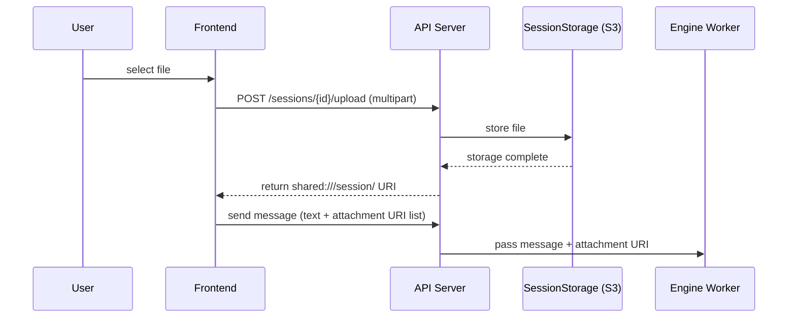
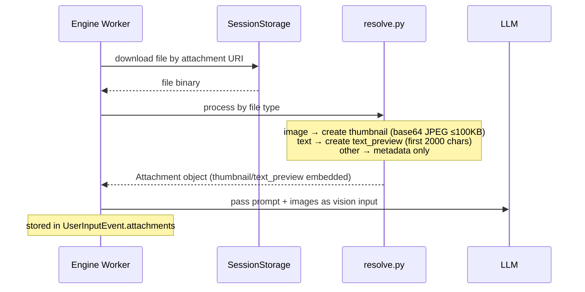
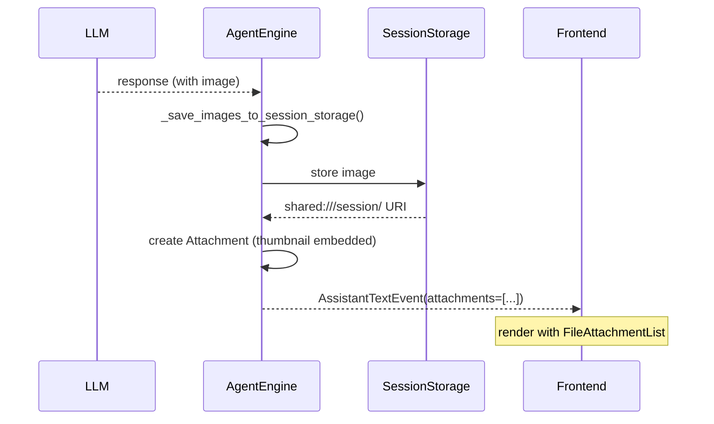
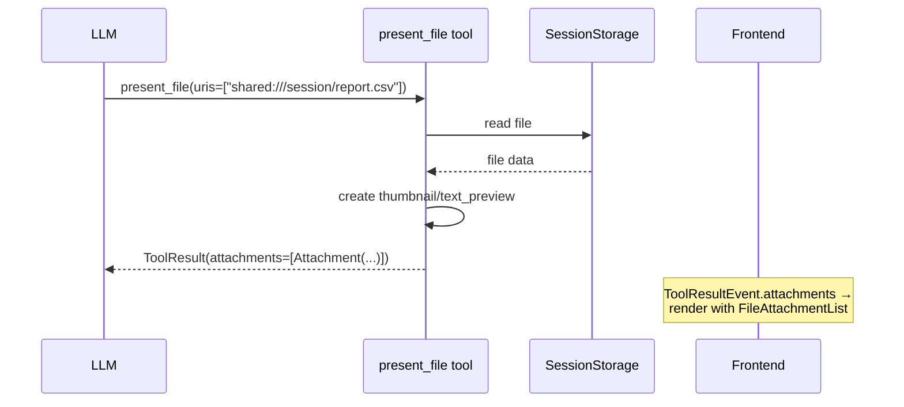
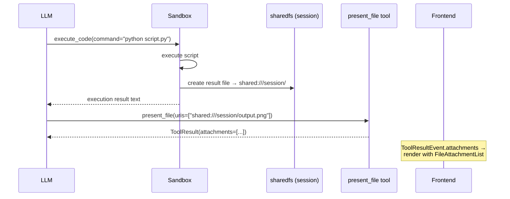
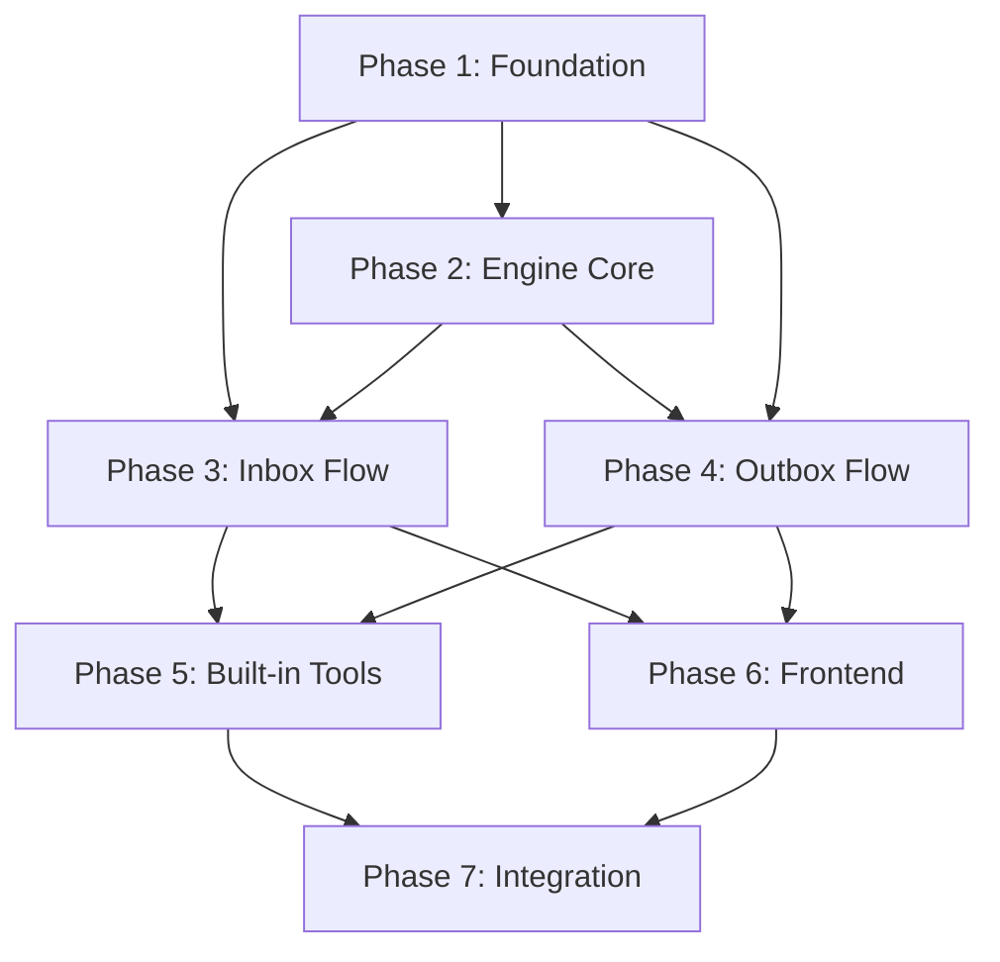

# File Support Design — Unified Session Storage Architecture

## 1. Overview

All files (user uploads, LLM generated files, tool outputs) are stored in one session storage and referenced with `shared:///session/` URI scheme.

### Design principles

- **Simplicity**: one storage, one URI scheme, one DB column
- **Self-contained Attachment**: embed thumbnail and text preview in Attachment, no separate endpoint needed
- **Explicit sharing**: LLM explicitly shares files with user through `present_file` tool

---

## 2. Architecture

### File upload flow

Flow where user attaches file and sends message.



### File processing flow (worker)

Processing flow when worker receives message containing attachments.



### LLM image generation flow

Processing flow when LLM (GPT-4o, etc.) generated image.



### present_file Tool flow

Tool used when LLM shares session storage file with user.



### Shell Tool flow

Flow where LLM executes code in sandbox and shares result file.



---

## 3. Data Model

### Attachment (`engine/types.py`)

Single data model unifying all file references. Embeds thumbnail and text preview so frontend can render immediately without separate endpoint.

```python
@dataclasses.dataclass(frozen=True)
class Attachment:
    """File reference — unified for user uploads, LLM generated files, tool outputs."""
    uri: str                           # "shared:///session/report.csv"
    media_type: str                    # "text/csv", "image/png"
    size: int                          # bytes
    name: str = ""                     # display filename
    thumbnail: str | None = None      # base64 JPEG ≤100KB (for images)
    text_preview: str | None = None   # first 2000 chars (for text)
```

### DB schema (events table)

Existing 3 columns `attachments`, `outbox_files`, `thumbnails` were unified into single `attachments` JSONB column.

| Column | Type | Purpose |
|------|------|------|
| `attachments` | JSONB | array of Attachment objects `[{uri, media_type, size, name, thumbnail, text_preview}]` |

- Thumbnail embedded in Attachment (base64, ≤100KB) — PostgreSQL TOAST handles automatically
- No separate thumbnail endpoint needed

### Event model

File information is passed through `attachments` field of each event type.

| Event | Purpose | Example |
|--------|------|------|
| `UserInputEvent.attachments` | files uploaded by user | image, document, etc. |
| `AssistantTextEvent.attachments` | image generated by LLM | GPT-4o image generation |
| `ToolResultEvent.attachments` | file generated/shared by tool | present_file result |

---

## 4. API Endpoints

| Method | Path | Description |
|--------|------|------|
| `POST` | `/sessions/{id}/upload` | file upload → store in session storage, return `shared:///session/` URI |
| `GET` | `/sessions/{id}/workspace` | list session files |
| `GET` | `/sessions/{id}/workspace/{filename}` | download file |
| `DELETE` | `/sessions/{id}/workspace/{filename}` | delete file |

### File upload

- `POST /sessions/{id}/upload` — multipart/form-data
- auto-resize if image exceeds size limit
- response: `shared:///session/uploads/{filename}` URI
- **Attachment count limit**: max 5 per message
- **Error handling**: on upload failure, show error toast + block message send

### Message send (WebSocket)

Add `attachments` field to existing text message:

```json
{
  "type": "chat",
  "agentId": "...",
  "message": "Analyze this file",
  "attachments": [
    "shared:///session/uploads/report.pdf",
    "shared:///session/uploads/photo.jpg"
  ]
}
```

---

## 5. Frontend

### FileAttachment type

```typescript
interface FileAttachment {
  uri: string;
  mediaType: string;
  size: number;
  name?: string;
  thumbnail?: string | null;     // base64 JPEG
  textPreview?: string | null;   // first 2000 chars
}
```

### Components

| Component | Role | Note |
|----------|------|------|
| `FileAttachmentList` | unified file display | replaces existing InboxFileList + OutboxFileList + ThumbnailImage |

- Thumbnail is embedded in Attachment data, so no separate endpoint call needed
- Image → render embedded thumbnail + load original from session storage download endpoint on click
- Text → show `textPreview` + provide full content as download
- Other → show filename, size, media_type metadata

---

## 6. Tool

| Tool | Purpose | Description |
|------|------|------|
| `read_image` | LLM views session storage image with vision | receives URI and inserts original image into LLM context |
| `present_file` | LLM shares session storage file with user | receives URI list, creates Attachment, returns as ToolResult |
| `execute_code` | execute command in sandbox | creates file in session storage via sharedfs, shares with present_file |

### read_image

- Used when LLM directly views image in session storage
- Size limit: default 5MB, configurable by model
- If exceeded, returns "Image is too large" error, allowing LLM to resize and retry

### present_file

- Only path where LLM explicitly shares file with user
- Automatically creates thumbnail (image) or text_preview (text) depending on file type
- Returns as `ToolResult.attachments` → rendered by frontend `FileAttachmentList`

### execute_code

- Directly creates files in session storage through sharedfs inside sandbox
- To show generated file to user, must call `present_file` tool
- System prompt: "Use present_file tool for files to share with user"

---

## 7. Size Limits

### Image size limit

- **Configurable per model**, default 5MB
- If exceeded, do not send to LLM and provide error text guidance
- LLM can resize through tool and retry

### Thumbnail

- 200~300px on long edge, JPEG format, max 100KB
- Embedded as base64 in Attachment `thumbnail` field
- Stored as JSONB in DB — thumbnail remains even if original is deleted

### Text preview

- First 2000 chars of file
- Embedded as string in Attachment `text_preview` field

### History image strategy

- Include **only thumbnail in context** for every turn (do not insert original directly)
- LLM accesses original with `read_image` tool when detail needed
- **Strip point**: when saving to store, remove original image from tool result and preserve only thumbnail in history

---

## 8. Storage

### Single session storage

| Item | Value |
|------|-----|
| URI scheme | `shared:///session/` |
| S3 key pattern | `{prefix}/{workspace_id}/{session_id}/{filename}` |
| Access method | API endpoint + `sharedfs` CLI (sandbox) |
| Lifecycle | session scope |

### URI routing

Convert `shared:///session/` URI to S3 key:

```
shared:///session/uploads/report.pdf
→ {prefix}/{workspace_id}/{session_id}/uploads/report.pdf

shared:///session/output/chart.png
→ {prefix}/{workspace_id}/{session_id}/output/chart.png
```

### Lifecycle

- Session scope — session files cleaned up when session deleted
- Graceful degradation on file expiration: embedded thumbnail/text_preview remains in DB, only original inaccessible
- **Frontend UX**: when original expired, keep showing thumbnail but add "Original expired" badge, disable download
- TTL handled by S3 lifecycle rule or separate GC batch

### Capacity management

| Item | Value |
|------|-----|
| Session storage capacity limit | TBD |
| Attachments per message | max 5 |
| Single file size limit | TBD |

---

## Implementation Plan

### Phase 1: Foundation — Types, DB, File Gateway

#### Goal

Build foundational infrastructure required for file support. Extend only types/schema/path without runtime behavior change.

#### 1-1. Engine type definitions

**File:** `python/apps/nointern/src/nointern/engine/types.py`

Types to add:
- `ImageURL`, `ImageBlob`, `ImageSource` — for LLM multipart image
- `Attachment` — file reference (uri, media_type, size)
- `ToolResult` — structured tool handler return value (content + attachments)
- Add `images`, `attachments` fields to `Message`
- Add `images` field to `CompletionResponse`, `StreamEnd`
- Add `attachments` field to `ToolCallEnd`
- Extend `ToolHandler` return type to `str | ToolResult`

**Caution:** all new fields are optional with default values, so existing code does not break.

#### 1-2. DB migration

**Files:**
- `python/apps/nointern/src/nointern/rdb/models/message.py` — add columns
- `python/apps/nointern/db-schemas/rdb/migrations/versions/` — Alembic migration

Columns to add (messages table):
- `attachments` JSONB nullable — `shared:///session/` URI list and file metadata `[{uri, media_type, size, name, thumbnail, text_preview}]`
- `thumbnails` JSONB nullable — thumbnails `[{uri, data_base64, media_type}]`

Reference: follow migration pattern of `abd59068d224_add_metadata_to_messages.py`.

#### 1-3. Store serialization

**File:** `python/apps/nointern/src/nointern/repos/message/store.py`

- `_to_runtime_message()`: deserialize new JSONB columns → Message fields
- `append()`: serialize Message fields → RDB model
- **pagination query** (`repos/message/__init__.py`): exclude `thumbnails` column from SELECT

#### 1-4. Event serialization

**File:** `python/apps/nointern/src/nointern/broker/serialization.py`

- `serialize_event()`: serialize `attachments` of ToolCallEnd
- `deserialize_event()`: deserialize

#### 1-5. Broker message

**File:** `python/apps/nointern/src/nointern/broker/types.py`

- Add `attachments: list[str]` field to `SessionMessage`

**File:** `python/apps/nointern/src/nointern/broker/redis.py`

- likely automatically reflected by encode/decode (json.dumps/loads). Verify whether separate change is needed.

#### 1-6. File Gateway URI scheme

**Files:**
- `python/apps/nointern-file-gateway/src/nointern_file_gateway/path.py`
  - parse single scheme `shared:///session/`
  - convert `shared:///session/` path to storage key in `resolve_storage_key()`
  - extract + pass scheme in `_resolve_key()`

- `python/apps/nointern-file-gateway/src/nointern_file_gateway/routes.py`
  - handle `shared:///session/` URI path

- `docker/nointern/agent-runtime/sharedfs`
  - `_is_shared()`: recognize `shared:///session/` scheme

#### Verification

```bash
# after type/schema change
cd python/apps/nointern && uv run ruff check --fix . && uv run ruff format . && uv run pyright

# DB migration
cd python/apps/nointern && uv run alembic upgrade head

# File Gateway tests
cd python/apps/nointern-file-gateway && uv run pytest

# nointern tests
cd python/apps/nointern && uv run pytest
```

---

### Phase 2: Engine Core — Tool Result + LLM Multipart

#### Goal

Enable engine to process tool result containing files and pass/receive images to/from LLM.

#### 2-1. Engine tool result handling

**File:** `python/apps/nointern/src/nointern/engine/engine.py`

- Branch on tool handler return value `str | ToolResult`
- If `ToolResult`, append attachment list to content in `[Attachments]` format
- Include `attachments` in `ToolCallEnd` event
- When storing, save only content(text), excluding binary

#### 2-2. LLM multipart input

**File:** `python/apps/nointern/src/nointern/runtime/llm.py`

- `_convert_messages()`: if `msg.images` exists, convert to OpenAI multipart content format
  - `ImageURL` → `{"type": "image_url", "image_url": {"url": ...}}`
  - `ImageBlob` → `{"type": "image_url", "image_url": {"url": "data:{mt};base64,..."}}`
- Keep existing text-only path

#### 2-3. LLM multipart output parsing

**File:** `python/apps/nointern/src/nointern/runtime/llm.py`

- Extract image content from litellm response
- Store in `CompletionResponse.images`, `StreamEnd.images`
- Need pre-check how litellm returns multipart response format

#### 2-4. Preserve MCP tool files

**File:** `python/apps/nointern/src/nointern/engine/tools/mcp.py`

- `_extract_text()` `ImageContent` handling: instead of placeholder, store in session storage → return `ToolResult`
- Change MCP tool handler wrapper to return `str | ToolResult`

#### Verification

```bash
cd python/apps/nointern && uv run ruff check --fix . && uv run ruff format . && uv run pyright
cd python/apps/nointern && uv run pytest
```

#### Verification points (manual)

- tool handler returning `str` behaves same as before
- tool handler returning `ToolResult` appends `[Attachments]` block to content
- litellm multipart content format works with GPT-4o / Claude, etc.

---

### Phase 3: User File Upload → Engine Processing

#### Goal

When user attaches file, store it in session storage, and engine creates summary/thumbnail and passes to LLM.

#### 3-1. File upload API

**File:** `python/apps/nointern/src/nointern/api/public/chat/v1/__init__.py`

- Add `POST /chat/v1/upload` endpoint
- Receive FastAPI `UploadFile` → write directly to session storage
- If image exceeds size limit (5MB), resize
- Return `shared:///session/uploads/{filename}` URI
- Validate max 5 files per message when receiving WebSocket message

**File:** `python/apps/nointern/src/nointern/api/public/chat/v1/data.py`

- Add `attachments: list[str] | None` to `ChatMessageRequest`

#### 3-2. WebSocket → broker delivery

**File:** `python/apps/nointern/src/nointern/api/public/chat/v1/__init__.py`

- Pass `request.attachments` → `SessionMessage.attachments` in `receive_loop()`

#### 3-3. Engine upload file processing

**File:** `python/apps/nointern/src/nointern/worker/engine.py` (or engine.py)

- If message has `attachments`:
  1. download file from session storage
  2. create summary by file type:
     - image → create thumbnail (Pillow, JPEG ≤100KB, 200-300px)
     - text/code → filename + size + leading preview
     - binary → filename + size + media_type
  3. insert summary into user Message (images into `images` field, text appended to content)
  4. store thumbnail in DB (`thumbnails` column of message)

#### 3-4. Add dependency

- `Pillow` — for thumbnail generation. Add to nointern app.

#### Verification

```bash
cd python/apps/nointern && uv run ruff check --fix . && uv run ruff format . && uv run pyright
cd python/apps/nointern && uv run pytest

# Regenerate OpenAPI
cd python/apps/nointern && uv run python src/cli/dump_openapi.py --target public
cd typescript/packages/nointern-public-client && pnpm run generate
```

#### Verification points (manual/E2E)

- file upload → returns `shared:///session/` URI
- attachments in WebSocket message → engine downloads file + creates summary
- image thumbnail included in LLM context
- LLM can access original through `read_image` / `sharedfs cat`

---

### Phase 4: LLM File Generation → User Exposure

#### Goal

Store files generated by LLM in session storage and deliver them to frontend through `present_file` tool.

#### 4-1. LLM response image → session storage

**File:** `python/apps/nointern/src/nointern/engine/engine.py`

- If `StreamEnd.images` exists, store directly in session storage
- Insert `[Generated Images]` block + `shared:///session/` URI into content (for LLM history)
- Include Attachment list in assistant Message `attachments` field

#### 4-2. Session data file list/download API

**File:** `python/apps/nointern/src/nointern/api/public/chat/v1/__init__.py`

- `GET /chat/v1/sessions/{sessionId}/workspace` — file list
- `GET /chat/v1/sessions/{sessionId}/workspace/{filename}` — file download
- Thumbnail query: `GET /chat/v1/messages/{messageId}/thumbnails/{index}` — lazy loading

#### Verification

```bash
# Backend
cd python/apps/nointern && uv run ruff check --fix . && uv run ruff format . && uv run pyright
cd python/apps/nointern && uv run pytest
cd python/apps/nointern-file-gateway && uv run pytest

# Regenerate OpenAPI
cd python/apps/nointern && uv run python src/cli/dump_openapi.py --target public
cd typescript/packages/nointern-public-client && pnpm run generate
```

---

### Phase 5: Built-in Tools + System Prompt

#### Goal

Provide built-in tools that allow LLM to use files directly.

#### 5-1. `read_image` built-in tool

**File:** `python/apps/nointern/src/nointern/engine/tools/` (new file)

- `read_image(uri: str)` — insert `shared:///session/` image into LLM context
- Validate size limit (per-model setting, default 5MB)
- If exceeded, return error message ("Image is too large. Resize and retry")
- Return `ToolResult` — content empty string, original inserted into images (or separate mechanism)

**Design decision needed:** mechanism to insert image into LLM input as `read_image` result.
- Option A: add `images` field to `ToolResult`, engine inserts into next LLM call
- Option B: put into tool role Message `images` field for storage + LLM delivery
- See Section 2 of design doc: "tool message: original image returned by read_image tool — used only in that turn, stripped on store save"

#### 5-2. System prompt update

**File:** system prompt template (location to confirm)

Content to add:
- Explanation of `shared:///session/` storage
- "Use `present_file` tool for files to share with user"
- Usage of `read_image` tool
- Explanation of `sharedfs` CLI `shared:///session/` URI scheme

#### Verification

```bash
cd python/apps/nointern && uv run ruff check --fix . && uv run ruff format . && uv run pyright
cd python/apps/nointern && uv run pytest
```

---

### Phase 6: Frontend

#### Goal

Implement file upload, attachment display, thumbnail rendering.

#### 6-1. File upload UI

**File:** `typescript/apps/nointern-web/src/features/chat/`

- file attachment button + drag-and-drop
- call `POST /chat/v1/upload` → receive `shared:///session/` URI
- show upload progress
- validate 5-file limit (frontend)
- after upload completes, send WebSocket message with `attachments`

#### 6-2. Attachment rendering

**File:** `typescript/apps/nointern-web/src/features/chat/components/`

- Read message `attachments` field and show inline
- Image: thumbnail + original download on click
- Other files: filename + size + download link
- Whole session file list view (side panel or modal)

#### 6-3. Thumbnail rendering

- Show `attachments` URI list in message list
- Lazy-load thumbnail binary via `GET /chat/v1/messages/{id}/thumbnails/{index}`
- On image expiration, overlay "Original expired" badge

#### 6-4. i18n

**File:** `typescript/apps/nointern-web/src/messages/*.json` (×4)

- file upload related keys (upload button, progress, error, limit notice, etc.)
- attachment related keys (download, file list, expiration display)

#### 6-5. Regenerate OpenAPI client

API changes in Phase 3, 4 should already regenerate, but perform final confirmation.

#### Verification

```bash
cd typescript && pnpm run format && pnpm run lint:fix && pnpm run typecheck
```

---

### Phase 7: Integration Verification + Wrap-up

#### 7-1. E2E tests

**File:** `python/apps/nointern-e2e/`

- file upload → message send → engine processing → response check
- attachment generated by `present_file` → API query/download
- thumbnail query

#### 7-2. Capacity limit setting

- Decide and set session storage capacity limit
- Reflect in File Gateway config

#### 7-3. Edge cases

- upload success → message send failure (orphan file, naturally cleaned by 30-day TTL)
- UX where only thumbnail remains after session file expiration (30 days)
- error message when LLM accesses expired file
- outbox file display after WebSocket reconnect (restored from message history)

---

### Dependency graph



- Phase 2, 3 can proceed in parallel after Phase 1 (but Phase 3 needs ToolResult type from Phase 2)
- Phase 4 after Phase 1, 2 complete
- Phase 5 after Phase 3, 4 complete
- Phase 6 after Phase 3, 4 complete (API must be finalized)
- Phase 7 after all complete

---

### Core file index

| File | Phase | Change |
|------|-------|----------|
| `engine/types.py` | 1 | ImageSource, Attachment, ToolResult, Message fields |
| `rdb/models/message.py` | 1 | attachments, thumbnails columns |
| `db-schemas/.../migrations/` | 1 | Alembic migration |
| `repos/message/store.py` | 1 | serialization/deserialization |
| `repos/message/__init__.py` | 1 | exclude thumbnails from pagination |
| `broker/types.py` | 1 | SessionMessage.attachments |
| `broker/serialization.py` | 1 | new ToolCallEnd field |
| `nointern-file-gateway/path.py` | 1 | parse `shared:///session/` scheme |
| `nointern-file-gateway/routes.py` | 1, 4 | handle `shared:///session/` path |
| `docker/.../sharedfs` | 1 | recognize `shared:///session/` scheme |
| `engine/engine.py` | 2, 4 | ToolResult branch, session storage save |
| `runtime/llm.py` | 2 | multipart content conversion, image parsing |
| `engine/tools/mcp.py` | 2 | preserve ImageContent |
| `api/public/chat/v1/__init__.py` | 3, 4 | upload, session data API, WebSocket attachments |
| `api/public/chat/v1/data.py` | 3 | ChatMessageRequest.attachments |
| `worker/engine.py` | 3 | upload file processing + summary generation |
| `engine/tools/` (new) | 5 | read_image built-in tool |
| `nointern-web/features/chat/` | 6 | upload UI, attachment rendering, thumbnail |
