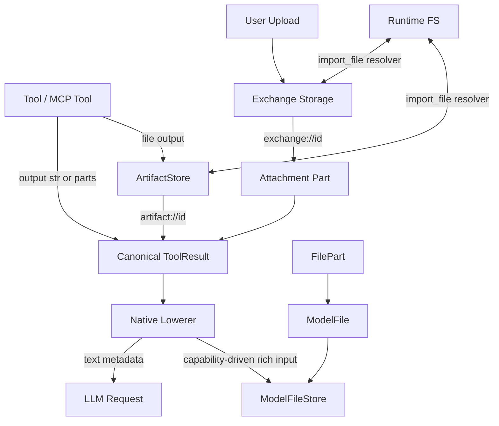

# File Resource Lifecycle and Tool Output Design

## Overview

This design expands [file-260601/ADR](../adr/file-260601-file-media-resource-lifecycle.md) decisions into implementable units. Goal is to separate user-facing file delivery, agent/tool file outputs, and LLM rich input files, while organizing tool result schema into Responses `function_call_output` family.

Current Azents mixes following concepts.

- `Attachment`: Exchange URI based user-facing file envelope role and model-visible file metadata role are mixed.
- `FunctionToolResult.content/attachments/images`: text, delivery file, LLM-visible image are scattered as separate fields.
- `OutputImagePart`/`OutputFilePart`: output parts, but meanings of Attachment/FilePart/Artifact are not clearly separated.
- `import_file`: supports only `exchange://` and default path is upload-centered `/tmp/agent/uploads/`.
- tool output lowering: lowers `function_call_output.output` only as string.

New structure separates four resource/lifecycles.

- Attachment: `exchange://` based user-agent delivery envelope.
- Artifact: `artifact://` based agent/tool file output. Valid only for creation run and following 2 completed runs; expired means delete/access denied.
- FilePart: file content part directly lowerable as LLM input.
- ModelFile: provider-neutral normalized blob referenced by FilePart.

## Discussion Points and Decisions

### 1. ToolResult schema

ToolResult follows Responses `function_call_output` family shape.

- `call_id`: required
- `output`: required, `str | content part list`
- `status`: canonical required, tool function boundary optional, default `completed`
- `name`: canonical required, not included in native lowering
- `id`: optional

Canonical output part union remains provider-neutral.

- `text`
- `attachment`
- `artifact`
- `file`

`output` remains `str | content part list` even in canonical form. This avoids requiring tool authors writing simple text results to create part lists every time. Consumers handle it through helper APIs.

Required helpers:

- `iter_output_parts(output)`: if `str`, iterate as synthetic `text` part
- `append_output_part(output, part)`: if adding part to `str` output, promote to `[text, part]`
- `output_text_preview(output, max_chars)`: bounded preview for UI/lower/debug

### 2. Legacy FunctionToolResult migration

Existing `FunctionToolResult(content, attachments, images)` migrates to new schema.

- If `content` is text-only, keep as `output` string.
- If `content` exists with other parts, keep as `text` part.
- If `attachments` has preservable metadata/URI, convert to `attachment` part.
- Deprecate `images`.
- New tools directly return `output: str | content part list`.
- MCP tool file output, including text files, returns as `artifact` part.

Existing event/native payload is rewritten to current schema. File-related legacy fields difficult to preserve are removed and only bounded placeholder metadata remains. Inline base64, provider-specific `file_data`, and provider-specific serialized payload are removed in migration.

### 3. Attachment

Attachment is Exchange URI based user-agent delivery envelope.

Required fields:

- `attachment_id`
- `uri`
- `name`
- `media_type`
- `size`
- `created_at`

Preview MVP fields:

- `preview_title`
- `preview_summary`
- `preview_thumbnail_uri`
- `preview_thumbnail_media_type`
- `preview_thumbnail_width`
- `preview_thumbnail_height`
- `preview_generated_at`

Attachment does not lower as rich file input; it lowers as bounded text metadata. Thumbnail URI is UI asset, so it is not included in LLM lower metadata by default.

Failure code:

- original load: `not_found`, `expired`, `permission_denied`, `storage_unavailable`
- preview load: `preview_unavailable`, optional cause

### 4. Artifact

Artifact is agent/tool file output.

- Store: ArtifactStore
- URI: `artifact://{artifact_id}`
- Object key: `artifacts/{workspace_id}/{session_id}/{created_run_index}/{artifact_id}`
- Status: `available | expired`
- Lifetime: `expires_after_run_index = created_run_index + 2`
- Valid: `current_run_index <= expires_after_run_index`
- Expired: delete/access denied

Required metadata:

- `artifact_id`
- `uri`
- `workspace_id`
- `session_id`
- `created_run_id`
- `created_run_index`
- `expires_after_run_index`
- `name`
- `media_type`
- `size`
- `storage_key`
- `status`
- `created_at`

Expired artifact metadata remains in canonical history. Event payload is not rewritten. Lowerer and resolver query current artifact status to show expired state and deny access.

Delete failure does not become lifecycle state. At run boundary, mark expired, attempt blob delete, and handle failure through operational log/metric/retry queue. Resolver denies access when expired regardless of blob existence.

### 5. import_file

`import_file` uses resolver registry by scheme.

MVP supported schemes:

- `exchange://...`
- `artifact://...`

Common failure codes:

- `invalid_uri`
- `unsupported_scheme`
- `not_found`
- `expired`
- `permission_denied`
- `storage_unavailable`

Default import directory is `/tmp/agent/imports/`. In default directory, filename conflict adds numeric suffix. If explicit destination path already exists, fail by default and overwrite only when `overwrite: true`.

MVP does not create sidecar `.meta.json`. `import_file` output text includes imported path, source URI, source kind, media type, size, temporary path warning.

### 6. FilePart and ModelFile

FilePart is content part that can directly enter LLM input. Attachment/Artifact do not automatically become FilePart.

FilePart required:

- `type: "file"`
- `model_file_id`
- `media_type`

Recommended:

- `name`
- `size`
- `kind`: `image | document | text | binary`

Optional:

- `detail`
- `caption`
- `alt_text`
- `metadata`

FilePart does not store raw bytes, base64, provider-specific `file_data`, provider-specific `file_id`, provider-specific serialized payload.

ModelFile required:

- `model_file_id`
- `workspace_id`
- `session_id`
- `media_type`
- `kind`
- `size`
- `storage_key`
- `created_at`
- `status`
- `normalized_format`

ModelFile status:

- `available`
- `degraded`
- `unreachable`
- `deleted`

Object key:

- `model-files/{workspace_id}/{session_id}/{model_file_id}`

ModelFileStore responsibility:

- put
- get/open
- replace
- delete
- exists

### 7. FilePart lowering

FilePart lowering branches by resolved model capabilities, not provider name.

Capability examples:

- `supports_image_input`
- `supports_file_input`
- `supports_pdf_input`
- `supports_text_file_input`
- `supported_media_types`
- `supports_file_id`
- `supports_file_data`
- `supports_file_url`
- `max_request_bytes`
- `max_file_bytes`
- `max_image_pixels`

Rules:

- Image FilePart lowers to native image input if model supports image input.
- Text/document FilePart lowers to native file input if model supports file input and MIME type is allowed.
- Binary/unknown FilePart does not lower to native input unless capability explicitly supports it.
- If capability is absent or budget exceeded, do not silently omit; lower to bounded text placeholder.
- Provider-specific serialized payload is created only request-locally.

Budget applies in two stages.

- First budget applied at ModelFile creation as normalized blob budget
- Second budget applied at native request lowering according to resolved model capability

Non-image FilePart applies max size cap at creation time. MVP default cap is 1MB. Files exceeding cap are not made into FilePart. Lowerer or reduction does not arbitrarily replace them with Artifact.

### 8. Reduction

Image ModelFile degradation moves existing inline image lifecycle policy into ModelFileStore normalized blob lifecycle.

- age 1: max edge 1024 JPEG
- age 3: max edge 300 JPEG
- age 10: FilePart placeholder/remove, ModelFile ref detach
- JPEG quality 85

Non-image FilePart does not reprocess blob. At age 10, replace/remove FilePart with placeholder and detach ModelFile ref. Placeholder leaves only filename-centered bounded metadata.

- name
- media type
- size

Summary does not include FilePart blob. Summary may include only bounded metadata. Summary does not newly resolve or import Attachment/Artifact URI.

## Architecture

## Data Model

### Canonical output part

`output` is `str | list[CanonicalOutputPart]`.

Part variants:

- `TextOutputPart(type="text", text)`
- `AttachmentOutputPart(type="attachment", attachment_id, uri, name, media_type, size, preview, availability)`
- `ArtifactOutputPart(type="artifact", artifact_id, uri, name, media_type, size, expires_after_run_index, status)`
- `FileOutputPart(type="file", model_file_id, media_type, name, size, kind, detail, caption, alt_text, metadata)`

### Artifact entity

Artifact consists of DB metadata row and object storage blob. `artifact://{artifact_id}` URI does not expose storage key.

### ModelFile entity

ModelFile is normalized blob identity referenced by FilePart. It is not responsible for original restoration or user download.

## Provider/Service Implementation

### ToolResult conversion

Keep `FunctionToolResult` backward-compatible but project deprecated fields to new output.

- `str` result: `ClientToolResultPayload(output=str, status="completed")`
- After adding `FunctionToolResult.output`, new tools use it
- `FunctionToolResult.content/attachments/images` are used only in migration bridge

### ArtifactService

Responsibilities:

- create artifact metadata + put blob
- resolve artifact URI
- expire artifacts at run boundary
- deny expired access
- lower metadata projection

### ImportFileResolverRegistry

Responsibilities:

- scheme parse
- resolver lookup
- common error mapping
- destination conflict policy

Resolvers:

- `ExchangeImportResolver`
- `ArtifactImportResolver`

### ModelCapabilityResolver

Responsibilities:

- resolve capability set from selected provider/model
- provide budget and supported MIME information to lowerer

## API / Frontend

External API changes are minimized.

- Attachment download/preview UX keeps existing Exchange path.
- Artifact is not exposed as default UI download card.
- Context inspector may display artifact metadata and expired status.
- `import_file` tool schema description reflects `/tmp/agent/imports/`, `exchange://`, `artifact://`.

## Infra

New persistent storage abstraction is needed.

- ArtifactStore: separates logical namespace/lifecycle from Exchange
- ModelFileStore: stores provider-neutral normalized blob

Physical backend can reuse existing object storage abstraction. However URI scheme, object key, lifecycle, access policy are separated.

## Feasibility Verification

### Code check results

| Item | Current state | Judgment |
|---|---|---|
| Canonical tool result | `ClientToolResultPayload.output: list[ToolOutputPart]`, separate `attachments` | schema needs change to `str | parts` |
| Tool output parts | `OutputTextPart`, `OutputImagePart`, `OutputFilePart`, `OutputAudioPart`, `OutputVideoPart` | need replace with new semantic union |
| FunctionToolResult | `content`, `attachments`, `images` structure | bridge/migration possible |
| import_file | supports only `exchange://`, default `/tmp/agent/uploads/`, fails on conflict | can change to resolver registry and `/tmp/agent/imports/` |
| LiteLLM Responses lowerer | creates `function_call_output.output` only as string | Responses full schema supports parts too, so extensible |
| Legacy image lifecycle | `CanonicalImageLifecycleFilter` resizes/removes inline data URL part | must move to ModelFileStore lifecycle |
| Observation masking | old `OutputTextPart` head/tail rewrite | separate from new large output Artifact policy. split to follow-up issue #4296 |

### Feasibility

Possible. Required change is large, but existing boundaries are clear.

- canonical types/lowerer/tools/import_file are main change points.
- ExchangeService and FileStorage patterns can be reused for ArtifactStore resolver implementation.
- current code already has canonical filters and lowerer extension points.
- Responses schema `function_call_output.output` supports content part list as well as string, so direction does not conflict with API.

### Major risks

| Risk | Impact | Mitigation |
|---|---|---|
| canonical schema migration | existing event decode can fail | keep migration rewrite as separate phase, placeholder/drop file-related legacy fields |
| ModelFileStore introduction scope | FilePart implementation delay | Phase 1 implements Artifact/import_file/tool output first, then FilePart around image path |
| Provider capability map inaccurate | wrong lower/placeholder | conservative default capability resolver; enable rich input only for confirmed models |
| Artifact expiration timing | run boundary race | fix run index source to canonical run marker and recheck status in resolver |
| Existing Exchange design terminology conflict | confusion between `exchange://artifacts` and new `artifact://` | document new Artifact as agent/tool internal artifact, separate from `present_file` attachment export |

## Test Strategy

Product behavior verification is E2E primary. Unit/static/docs checks are supporting quality checks. However, internal runtime boundaries with no product/testenv entrypoint yet in this stack are recorded separately as deterministic model-boundary verification, not called E2E primary.

### E2E primary verification matrix

| Behavior | Verification layer | Primary path | Expected result |
|---|---|---|---|
| present_file attachment metadata | Product/testenv E2E | write → present_file → mock OpenAI request journal | present_file result exchange artifact URI reflected in REST history and model request metadata |
| Tool attachment result | Deterministic boundary + existing product attachment E2E | `AttachmentOutputPart` lowerer verification + upload attachment E2E | attachment lowers only to bounded metadata text and UI/API attachment path remains |
| MCP file output artifact | Deterministic boundary | ArtifactService create → canonical artifact metadata lowering | Artifact row/blob created, lower is `artifact://` metadata, no prompt inline |
| Artifact import | Deterministic boundary | `import_file(artifact://id)` before expiration | file created in `/tmp/agent/imports/` |
| Artifact expiration | Deterministic boundary | run index advances to N+3 | resolver import fails with `expired`, lower shows expired |
| FilePart image lower | Deterministic boundary | FilePart + image-capable capability fixture | rich image lower for model with capability |
| Capability missing | Deterministic boundary | same FilePart with text-only capability fixture | bounded placeholder, no silent omit |
| Legacy migration | Deterministic boundary | seeded legacy event with inline image/file | unsafe fields removed, current schema decode succeeds |

### Fixture / seed requirements

- product/testenv E2E: workspace/user/agent/session seed, runtime workspace text file, present_file exchange artifact, mock OpenAI request journal
- deterministic boundary verification: mock Artifact row/blob with run index, legacy canonical event payload sample, model capability fixture(image-capable, text-only), request-local model file resolver

### Evidence format

- product/testenv E2E command and target test path
- session id or event/history assertion summary
- mock OpenAI request journal assertion summary (raw bytes redacted)
- deterministic verification command and target test path
- artifact/import path/stat, lowerer native request assertion summary (raw bytes redacted)

### CI policy

- Product/testenv E2E is non-live pytest target in `testenv/azents/e2e`.
- Deterministic boundary verification is pytest target in `python/apps/azents`.
- Real provider rich file input is split into optional/live.
- Optional/live SKIPs when credentials missing, but FAILs if credentials present and API contract fails.

## QA Checklist

### QA evidence summary

Phase 4 records evidence in two layers according to `/ship-feature` QA rule.

- Product/testenv E2E prerequisite snapshot: ran `cd testenv/azents/e2e && uv run pytest -vv -m "not live_external" ./src/tests/azents/public/test_file_resource_lifecycle.py::TestFileResourceLifecycle::test_present_file_attachment_reaches_model_as_metadata`, but current agent runtime lacks Docker socket, so it was BLOCKED before fixture bootstrap with `docker.errors.DockerException: Error while fetching server API version`. This item is not marked PASS.
- Deterministic model-boundary evidence: `cd python/apps/azents && uv run pytest src/azents/runtime/file_resource_lifecycle_verification_test.py -q` verifies artifact lifecycle, artifact import/expiration, attachment metadata lowering, capability-driven FilePart lowering, legacy unsafe payload rewrite. These items are internal runtime boundaries with no public product/testenv entrypoint yet in current stack, so they are not marked as product E2E primary evidence.
- Support quality gates: targeted runtime/service/canonical tests, `uv run pyright`, ruff format/check, docs index generation are recorded only as supporting evidence.

### QA-1. Store MCP file output as Artifact

#### What to check
Confirm MCP-style file output (including text file content) is stored in ArtifactStore and represented as `artifact` part in canonical output.

#### Why it matters
Prevents large tool output from being inlined into prompt/canonical text, and avoids exposing internal tool output like user-facing attachment.

#### How to check
In deterministic model-boundary verification, create Artifact via `ArtifactService`, lower tool result metadata, then import with `import_file(artifact://...)`. Also confirm full artifact body is not included in lowered prompt.

#### Expected result
Canonical output includes artifact metadata and `artifact://{artifact_id}`. Lowered prompt does not include full file content.

#### Execution result
PASS — deterministic model-boundary evidence: `cd python/apps/azents && uv run pytest src/azents/runtime/file_resource_lifecycle_verification_test.py -q` (`test_artifact_output_import_and_expiration_e2e_path`). Public product/testenv stack does not yet have entrypoint where mock MCP file-output creates Artifact row, so this item is not marked as product E2E primary evidence.

#### Fixes applied
Added ArtifactService create/resolve and deterministic verification coverage in Phase 2/4. This stack did not add runtime MCP product entrypoint.

### QA-2. Artifact expires deterministically after 2 completed runs

#### What to check
Artifact created in Run N is importable until N+2 and inaccessible from N+3.

#### Why it matters
Artifact lifecycle must be deterministic, not dependent on background GC timing.

#### How to check
In deterministic model-boundary verification, advance run marker and call `import_file(artifact://...)` before/after expiration.

#### Expected result
Import succeeds before expiration. After expiration, import fails with `expired`, and lowering metadata also indicates no longer accessible.

#### Execution result
PASS — deterministic model-boundary evidence: `cd python/apps/azents && uv run pytest src/azents/runtime/file_resource_lifecycle_verification_test.py -q` (`test_artifact_output_import_and_expiration_e2e_path`). Run index 1 artifact succeeds before expiration and `import_file` returns expired failure after expiration at run index 4 boundary.

#### Fixes applied
Verified in Phase 2/4 that run-boundary expiration marks metadata expired, deletes blob, and resolver denies access regardless of blob state.

### QA-3. Attachment lowers as metadata, not rich input

#### What to check
Confirm Attachment output is visible to model only as bounded metadata while UI download/preview path remains.

#### Why it matters
Attachment is delivery envelope, not LLM rich input blob.

#### How to check
User upload/chat attachment persistence is verified by product/testenv E2E. Tool-result `AttachmentOutputPart` lowering is verified by deterministic model-boundary verification.

#### Expected result
Native request includes text metadata, not file bytes. UI/API attachment path keeps working.

#### Execution result
BLOCKED — product/testenv E2E command attempted: `cd testenv/azents/e2e && uv run pytest -vv -m "not live_external" ./src/tests/azents/public/test_file_resource_lifecycle.py::TestFileResourceLifecycle::test_present_file_attachment_reaches_model_as_metadata`. Current agent runtime lacks Docker socket, so testcontainers fixture bootstrap failed with `docker.errors.DockerException: Error while fetching server API version`. This product E2E is not marked PASS.

Supplemental deterministic evidence is PASS: `cd python/apps/azents && uv run pytest src/azents/runtime/file_resource_lifecycle_verification_test.py -q` (`test_attachment_output_lowers_as_metadata_only`). Confirmed tool-result attachment lowering creates bounded metadata text and does not include `file_data`.

#### Fixes applied
Verified in Phase 1/4 that Attachment output part lowers only to text metadata. `present_file` remains user-facing delivery path. Existing product upload E2E remains product-facing attachment regression, but local execution is blocked in this runtime due to Docker prerequisite absence.

### QA-4. FilePart lowering is capability-based

#### What to check
Same FilePart lowers to native rich input on capable model and bounded placeholder on incapable model.

#### Why it matters
Provider name branching is insufficient. Safe lowering basis is resolved model capabilities.

#### How to check
In deterministic model-boundary verification, pass same `FileOutputPart` through image-capable capability fixture and text-only capability fixture respectively.

#### Expected result
Capable model receives native rich part. Incapable model receives placeholder. There is no silent omit.

#### Execution result
PASS — deterministic model-boundary evidence: `cd python/apps/azents && uv run pytest src/azents/runtime/file_resource_lifecycle_verification_test.py -q` (`test_file_part_capability_branch_e2e_path`). Image-capable model receives `input_image`, and text-only model receives bounded `input_text` placeholder. Existing `test_file_upload.py` owns user-uploaded image/file input, and new `test_file_resource_lifecycle.py` owns present_file attachment metadata product path. Direct capability matrix selection is internal lowerer boundary for this stack.

#### Fixes applied
Verified in Phase 3/4 that FilePart lowering uses resolved capabilities and request-local resolver content. Unsupported path is represented as placeholder, not omitted.

### QA-5. Legacy migration rewrites unsafe payload

#### What to check
Legacy payload with inline base64/provider file field converts to current schema without unsafe bytes.

#### Why it matters
Current schema compatibility takes precedence over preserving legacy unsafe file payload.

#### How to check
In deterministic model-boundary verification, verify legacy/current schema decode and unsafe inline/provider field rewrite/drop behavior.

#### Expected result
Event decodes as current schema. Inline base64/provider-specific fields are removed. Where needed, only placeholder metadata remains.

#### Execution result
PASS — deterministic model-boundary evidence: `cd python/apps/azents && uv run pytest src/azents/runtime/file_resource_lifecycle_verification_test.py -q` (`test_legacy_unsafe_payload_is_rewritten_to_safe_schema`). Inline data URL rewrites to `inline:<digest>` and provider-specific file payload field is removed.

#### Fixes applied
Verified in Phase 3/4 that validator rewrites legacy inline image payload and drops provider-specific file payload field from persistent FilePart schema.

## Alternatives Considered

### Always normalize canonical output to part list

Rejected. Consumers become simpler, but tool authors must wrap even text-only result in part list every time. Keep `str | parts` and manage consumer complexity with helper API.

### Handle Artifact expiration with background GC

Rejected. Artifact expiration is run-age based deterministic lifecycle. Expired means delete/access denied, so no separate GC lifecycle.

### Lower Attachment as rich file input

Rejected. Attachment is user-agent delivery envelope. LLM input blob is represented only by FilePart.

### Branch capability by provider name

Rejected. File/image capabilities differ even within same provider by model. Lower by resolved model capabilities.

### Long-term compatibility with legacy payload through read-time adapter

Rejected. Prioritize current schema compatibility. Existing payload is migration-rewritten, and file-related legacy fields that are hard to support are placeholder/dropped.
