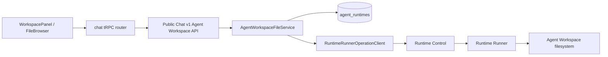

# Agent Workspace File Management MVP

## Overview

This design extends the existing Agent Workspace panel from read-only browsing to basic file management for files inside the Runtime Provider-reported Agent Workspace root. It does not introduce a new file store and does not manage ExchangeFile attachments, Artifacts, ModelFile/FilePart, or `/tmp` import scratch files.

User scenarios:

1. User opens an Agent session and the Agent Workspace panel is ready.
2. User selects a file or directory and opens an inspector showing path, kind, size, media type, modified time, and symlink metadata.
3. User creates a new folder in the current directory.
4. User renames a file or directory.
5. User moves a file or directory to another Agent Workspace path.
6. User deletes a file or directory after confirmation.

MVP scope:

- Included: delete, rename, mkdir, move, stat-based inspector, frontend actions/modals, public API, tRPC integration, Runner operations.
- Excluded: file upload, file content edit/save, optimistic conflict tokens, live file sync, Git status/diff, ExchangeFile or Artifact management.

## Requirements

### REQ-1. Native Runner file management operations

Agent Workspace file management mutations are sent through native Runner operations.

Related decisions: [file-260628/ADR-D1](../adr/file-260628-file-management.md)

Acceptance criteria:

- Runtime Runner accepts `file.delete`, `file.mkdir`, and `file.move` operation types.
- Server-side `RuntimeRunnerOperationClient` exposes typed methods for these operations.
- Public Agent Workspace mutation service methods do not shell out to `rm`, `mkdir`, or `mv`.

### REQ-2. Agent Workspace root confinement

All user-facing source and destination paths are confined under the Provider-reported Agent Workspace root.

Related decisions: [file-260628/ADR-D2](../adr/file-260628-file-management.md)

Acceptance criteria:

- Relative paths are resolved under `agent_runtimes.workspace_path`.
- Absolute paths outside the workspace root return path denied errors.
- Delete and move source cannot target the workspace root itself.

### REQ-3. Rename is implemented as move

Rename has no separate backend operation.

Related decisions: [file-260628/ADR-D3](../adr/file-260628-file-management.md)

Acceptance criteria:

- Frontend rename modal computes a destination path in the same parent directory.
- tRPC rename handler, if present, calls the same move public API as move.
- Backend and Runner expose only move semantics.

### REQ-4. Inspector uses stat metadata

The inspector displays basic metadata without reading file contents.

Related decisions: [file-260628/ADR-D4](../adr/file-260628-file-management.md)

Acceptance criteria:

- Public API exposes a stat endpoint or stat response for one Agent Workspace path.
- Frontend inspector can render file and directory metadata without invoking preview read.
- File preview remains available for supported files through the existing read path flow.

### REQ-5. Conservative destructive defaults

Destructive operations require explicit user intent and do not overwrite by default.

Related decisions: [file-260628/ADR-D5](../adr/file-260628-file-management.md)

Acceptance criteria:

- Directory delete requires `recursive=true`.
- Move defaults to `overwrite=false`.
- UI shows confirmation before delete.
- Mutation success invalidates workspace list/stat queries and clears invalid selected state.

## Decision Table

| ADR decision | Requirements |
|---|---|
| [file-260628/ADR-D1](../adr/file-260628-file-management.md) | REQ-1 |
| [file-260628/ADR-D2](../adr/file-260628-file-management.md) | REQ-2 |
| [file-260628/ADR-D3](../adr/file-260628-file-management.md) | REQ-3 |
| [file-260628/ADR-D4](../adr/file-260628-file-management.md) | REQ-4 |
| [file-260628/ADR-D5](../adr/file-260628-file-management.md) | REQ-5 |

## Discussion Points and Decisions

### 1. Runner operation model

Options considered:

- Shell commands from server-side storage helpers.
- Native Runner operations.

Decision: native Runner operations. Native operations give structured payloads, structured final results, and explicit error semantics for destructive actions.

### 2. API shape

Options considered:

- One generic action endpoint.
- Resource-shaped endpoints under the existing Agent Workspace API.

Decision: add focused endpoints under `/chat/v1/agents/{agent_id}/workspace`: stat, directories, files delete, and move. This keeps the public surface close to existing workspace read/download endpoints.

### 3. Inspector source

Options considered:

- Extend file preview response only.
- Add stat-based metadata response.

Decision: stat-based metadata response. Preview and inspector have different failure modes and should not be coupled.

### 4. Delete policy

Options considered:

- Allow recursive delete for every path.
- Require `recursive=true` only for directories.
- Allow only empty directory delete.

Decision: directory delete requires `recursive=true`; root delete is forbidden. This matches common file manager behavior while avoiding accidental folder deletion by a simple file delete action.

### 5. Move and overwrite policy

Options considered:

- Always overwrite.
- Never overwrite.
- Allow overwrite flag but default false.

Decision: support an overwrite flag in the API, default false. MVP UI uses false by default.

## Architecture



## Backend Design

### Runtime protocol

Add payload/result variants:

- `FileDeleteOperationPayload { path, recursive }`
- `FileMkdirOperationPayload { path, parents }`
- `FileMoveOperationPayload { source_path, destination_path, overwrite }`
- `FileDeleteFinalSuccess { path }`
- `FileMkdirFinalSuccess { path }`
- `FileMoveFinalSuccess { source_path, destination_path }`

Extend stat/list metadata with `modified_at` when feasible. The value is serialized as an ISO-8601 UTC string in Runtime reply payloads and converted to API datetimes by the server.

### Service

`AgentWorkspaceFileService` gains methods:

- `stat_path(agent_id, user_id, raw_path)`
- `delete_path(agent_id, user_id, raw_path, recursive)`
- `mkdir_path(agent_id, user_id, raw_path, parents)`
- `move_path(agent_id, user_id, raw_source_path, raw_destination_path, overwrite)`

Each method:

1. Verifies Agent and Workspace membership.
2. Verifies Runtime is running and Runner is ready.
3. Reads Provider-reported workspace path.
4. Normalizes every path under the workspace root.
5. Applies mutation-specific root guardrails.
6. Calls the typed Runner operation.
7. Maps known Runner failures to 4xx public API errors.

### Public API

Add endpoints:

| Method | Path | Purpose |
|---|---|---|
| `GET` | `/chat/v1/agents/{agent_id}/workspace/stat?path=...` | Fetch inspector metadata |
| `POST` | `/chat/v1/agents/{agent_id}/workspace/directories` | Create directory |
| `DELETE` | `/chat/v1/agents/{agent_id}/workspace/files` | Delete file or directory |
| `POST` | `/chat/v1/agents/{agent_id}/workspace/move` | Move or rename file/directory |

Representative request/response bodies:

```json
{ "path": "/workspace/agent/reports", "parents": false }
```

```json
{ "source_path": "/workspace/agent/a.txt", "destination_path": "/workspace/agent/archive/a.txt", "overwrite": false }
```

```json
{
  "path": "/workspace/agent/a.txt",
  "name": "a.txt",
  "kind": "file",
  "size": 10,
  "media_type": "text/plain",
  "modified_at": "2026-06-28T00:00:00Z",
  "symlink": false,
  "real_path": null,
  "resolved_kind": null
}
```

## Frontend Design

### Container

`useWorkspacePanelContainer` owns mutation state and exposes callbacks:

- `onInspectPath(path)`
- `onCreateDirectory(path, parents)`
- `onDeletePath(path, recursive)`
- `onMovePath(sourcePath, destinationPath, overwrite)`
- `onRenamePath(path, newName)` implemented through move

On success, it invalidates:

- `getAgentWorkspace`
- `readAgentWorkspacePath`
- `statAgentWorkspacePath`

It also clears selected file state when a selected path is deleted or moved.

### Components

- `FileBrowser` adds row actions and a New Folder toolbar button.
- `FileViewer` keeps preview/download behavior and can link to inspector actions.
- New `FileInspector` renders basic metadata and action buttons.
- Modals gather input for mkdir, rename, move, and delete confirmation.

MVP move UI uses a destination path text input instead of a tree picker. A future enhancement can add a destination picker.

## Feasibility Verification

| Item | Verification |
|---|---|
| Runner extensibility | Existing protocol already routes operation type + typed oneof payloads. Adding file operation variants follows existing file stat/list/read/write patterns. |
| Public API integration | Existing Agent Workspace service already performs Agent membership and Runtime readiness checks. Mutation methods can reuse these helpers. |
| Frontend integration | Workspace panel already has container/component separation and query invalidation pattern. Mutation callbacks fit existing tRPC structure. |
| Safety | Service layer already normalizes paths under Provider-reported root; mutations add root-specific destructive guards. |

## Test Strategy

Product behavior verification is E2E-first. Unit and integration tests support implementation confidence but do not replace E2E evidence in QA.

### E2E primary matrix

| Behavior | E2E path |
|---|---|
| Inspector shows metadata | Start Runtime fixture, create a file, call public stat API or UI inspector, assert metadata |
| mkdir creates folder | UI/API create directory, refresh browser, assert new directory appears |
| rename moves within parent | UI/API rename, assert old path missing and new path present |
| move relocates path | UI/API move to another directory, assert destination appears |
| delete removes path | UI/API delete, refresh browser, assert path missing |
| root guardrails | Attempt delete/move root through public API, assert 400/403 |

### E2E plan

Use `testenv/azents/e2e` with a fixture that provisions a workspace, user, Agent, running Runtime, and Runner-backed Agent Workspace. The test should use public API or the browser UI path, not direct service calls.

### Seed and prerequisites

- Workspace with one authenticated user.
- One Agent with running Runtime.
- Runner workspace containing at least one file and one directory.

### Evidence format

- Command used.
- Environment and fixture snapshot.
- API responses or Playwright traces/screenshots.
- Result table for each matrix row.

### CI policy

Deterministic unit/integration/static checks run in CI. Full runtime E2E should be added to existing E2E/testenv CI lane when the fixture is available. Optional live-provider tests must skip when Runtime provider prerequisites are unavailable and fail only when prerequisites are explicitly present.

## QA Checklist

### QA-1. Inspector metadata

#### What to check

A user can inspect a file and directory inside Agent Workspace and see accurate metadata.

#### Why it matters

Inspector is the non-destructive foundation for all file actions and helps users confirm they are acting on the correct path.

#### How to check

Run the E2E fixture, open/call stat for file and directory paths under Agent Workspace.

#### Expected result

Metadata includes path, name, kind, size where applicable, media type, modified time when available, symlink flag, and resolved path metadata when available.

#### Execution result

TBD — E2E/testenv verification phase.

#### Fixes applied

TBD — E2E/testenv verification phase.

### QA-2. Directory creation

#### What to check

A user can create a directory under the current Agent Workspace directory.

#### Why it matters

Mkdir is the simplest write operation and validates mutation routing and query invalidation.

#### How to check

Use the public API or UI New Folder action, then refresh/list the parent directory.

#### Expected result

The new directory appears in the file browser and stat returns kind `directory`.

#### Execution result

TBD — E2E/testenv verification phase.

#### Fixes applied

TBD — E2E/testenv verification phase.

### QA-3. Rename and move

#### What to check

A user can rename a path within the same parent and move a path to a different destination under Agent Workspace.

#### Why it matters

Rename and move share the same backend contract and must preserve root confinement.

#### How to check

Use public API or UI actions to rename one file and move another file into a subdirectory, then list/stat old and new paths.

#### Expected result

Old paths are missing and destination paths exist with expected metadata.

#### Execution result

TBD — E2E/testenv verification phase.

#### Fixes applied

TBD — E2E/testenv verification phase.

### QA-4. Delete guardrails

#### What to check

A user can delete a file after confirmation, can delete a directory only with recursive intent, and cannot delete Agent Workspace root.

#### Why it matters

Delete is destructive and needs strict guardrails.

#### How to check

Use API/UI delete for file, directory without recursive, directory with recursive, and root.

#### Expected result

File deletion succeeds; directory deletion without recursive fails; recursive directory deletion succeeds; root deletion fails.

#### Execution result

TBD — E2E/testenv verification phase.

#### Fixes applied

TBD — E2E/testenv verification phase.

## Implementation Plan

1. Documentation and ADR.
2. Runtime protocol and Runner operations.
3. Server Runner operation client and Agent Workspace service/API.
4. OpenAPI/client regeneration.
5. tRPC router and FE workspace UI.
6. Local deterministic checks.
7. PR and CI monitoring.

## Alternatives Considered

### Shell-based implementation

Rejected because destructive operations need typed contracts and reliable error mapping.

### Separate rename endpoint all the way down

Rejected because rename is move with same parent.

### Inspector as preview metadata only

Rejected because inspector should not depend on file content read or preview limits.
