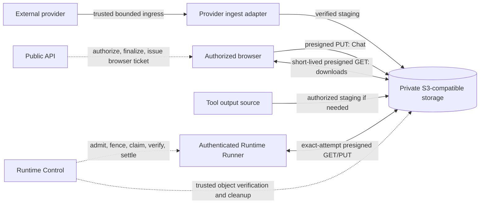

# Direct File Transfer and Consistent File Limits Design

- Snapshot: `files-260929`
- Requirements: [files-260929/REQ](../requirements/files-260929-direct-file-transfer.md)
- Decisions: [files-260929/ADR](../adr/files-260929-direct-file-transfer.md)
- Design reference: `files-260929/DESIGN`
- Design revision: `1` (approved on 2026-09-29; implementation verified on 2026-09-30)

## Primary Outcome and Current Gaps

A user can attach a general-purpose file of up to 128 MiB, have an Agent use that file in Runtime, receive an authorized result, and download it without an unrelated lower complete-file transport limit or an API/Runtime Control application byte relay. The same policy applies to the individually approved adjacent paths, with separate image-input and external-service policy.

| Current boundary | Current behavior | Required replacement |
| --- | --- | --- |
| Browser Chat upload | 20 MiB multipart request read into API `bytes` | Browser direct storage PUT and verified Exchange finalize, 128 MiB |
| `import_file` and `run_tool_to_file` | 8 MiB Worker bound, S3 staging followed by Control-to-Runner gRPC byte stream | Exact-attempt Runner presigned GET, 128 MiB for each eligible source/part |
| `download_external_file` | Provider to S3, then Control-to-Runner stream, configured 500 MiB inbound | Keep verified provider ingestion; use direct GET, lower generic eligibility to 128 MiB |
| `present_file`, Runtime-file `channel_action`, `read_image` | Runner-to-Control gRPC bytes into S3; shared 8 MiB Worker cap | Exact-attempt Runner presigned PUT; retain Exchange, provider, and model consumers |
| Agent Workspace browser download | Runner-to-Control-to-S3, then S3-to-API-to-browser stream; 64 MiB | Runner direct PUT and authorized browser direct GET, 128 MiB |
| Exchange browser download | Authorized S3-to-API-to-browser stream without a separate download size cap | Authorized browser direct GET, 128 MiB |
| Workspace browser upload | Already direct browser PUT, direct Runner GET, 128 MiB | Reuse its security and storage patterns; retain existing behavior |

The Runtime Transfer in-memory and Redis stores currently admit independently from their nominal `per_runtime_bytes` and `deployment_bytes` configuration values (`_has_capacity` does not reject by file size); these are not an additional 8/32 MiB file-size obstacle. Other real 8 MiB gates come from the Worker shared constant and feature transfer requests.

## Architecture and Ownership

The S3 bucket and credentials remain private to trusted server components. Runner and browser receive only exact-method, exact-object, short-lived capabilities. The public API and Runtime Control keep their authorization and lifecycle responsibilities, but do not relay the file body for the specified hops. External-provider ingestion, Tool-owned output generation, model-image normalization, and storage-native copying retain their separate trusted processing responsibilities.

### Common policy and source authority

Define one canonical general-purpose per-file limit of 134,217,728 bytes in a shared server policy surface consumed by API/Worker/Runtime Control and projected to the browser. Eliminate independent 8/20/64 MiB transfer caps from the approved general-purpose paths rather than changing the old shared Worker constant in place. For every entry point, validate source metadata or declared size before staging, exact actual bytes during upload/download, and verified stored size before destination publication. Keep target Tool, 20 MiB `read_image`, model-input, provider, and existing external-channel outbound administrator policies as additional independent constraints.

`ExternalChannelFilesConfig.inbound_max_file_bytes` is a now-conflicting independent policy, previously defaulted to 500 MiB. Retire or migrate this inbound setting and its API/Admin representation as part of the new common policy; audit customized values before rollout. Do not change outbound settings, provider-specific limits, or outbound aggregate limits. A Runtime-path provider batch must no longer inherit an unrelated 8 MiB aggregate Worker cap; it remains bounded by the effective outbound action/provider policy.

### Runner direct GET

Build on Workspace Upload's current exact-attempt direct-object download. A trusted feature adapter resolves source authority, stages an immutable verified S3 object only where its source is not already safely immutable, and records an opaque source handle with exact byte size and SHA-256 under one Runtime Transfer attempt. The adapter revalidates existing feature access before READY/dispatch, preserving ADR-D2's source-expiry and Session/Run authority boundary. Control admits and dispatches a metadata-only intent. The authenticated current-generation Runner claims the exact active attempt; Control rechecks that attempt's ownership, current Runner generation, source expiry, cancellation, and verified object manifest and issues one short-lived presigned GET. The GET source is the retained immutable object authorized for that attempt; claim does not add a separate original-file revocation contract or repeat the original provider lookup. No URL appears in queued intents, Redis, durable Tool events, logs, or model-visible output. Runner streams bounded chunks into an operation-owned local temporary file, checks size and SHA-256, fsyncs, enforces the existing symlink-safe destination/overwrite precondition, and atomically commits. Cancel, generation replacement, deadline, or checksum mismatch leaves no new destination.

Use this path for `import_file` Exchange/Artifact/current-run managed sources, every successful `run_tool_to_file` part plus its manifest, and `download_external_file` after provider ingestion. Existing managed Exchange/Artifact sources use an S3-native immutable snapshot when their current retention or mutation window cannot cover the ticket and transfer deadline. Current-run managed bytes, text output, generated files, and ModelFile parts are staged under the existing authority without adding a durable user-facing file identity. `run_tool_to_file` executes its target only once; failure after target success is part-level, with committed parts retained and failed parts exposed through the existing bounded result contract.

External provider ingestion retains provider authentication, locator checking, authenticated `Content-Length`, bounded stream-size validation, and any required S3 multipart staging. The 128 MiB common cap applies before opening or dispatching a too-large source and must be reflected in the admin-facing inbound policy. The provider itself does not receive S3 credentials or a speculative presigned upload request.

### Runner direct PUT and verified finalize

Add one typed, exact-attempt direct-object UPLOAD transport to Runtime Transfer. Control admits the current Runtime/Runner generation, path, source identity, size, common or semantic policy, deadline, and cleanup owner before any write capability is issued. Runner opens the selected file without following links, pins source identity, computes its SHA-256 in bounded reads, and requests a PUT capability bound to that expected checksum and one opaque ingress object. Runner streams bounded file reads directly to S3 with the signed method and headers. S3-validated checksum evidence, actual object size, source identity, and a conditional immutable snapshot are verified by trusted Control before an AVAILABLE result is exposed to a feature consumer. A still-live PUT capability can mutate only the ingress object, never the immutable source consumed or published by the feature. A generation-fenced terminal result and feature-owned consumer acknowledgement remain required for success.

A 128 MiB upload is planned as one checksum-bound PUT rather than a new multipart client protocol. The existing `S3Service.get_upload_request`, checksum-aware HEAD, `copy_immutable`, and small-object RustFS readiness/E2E probes provide the primary primitives, but they do not prove a 128 MiB upload through every supported endpoint, proxy, request deadline, and checksum implementation. Validate a 128 MiB signed PUT, HEAD, immutable copy, and GET on the target-compatible environment before activation; failure is a rollout blocker, not permission to route bytes through Control. Runner upload support, exact-attempt ticket RPC, and state transitions do not yet exist and must be implemented for both Redis and in-memory coordinators and the Runner. For `read_image`, the semantic 20 MiB check runs before ticket issuance; after verified S3 upload, trusted server code may still read and normalize at most that permitted image body into a ModelFile. Generic 128 MiB transfer capacity does not enlarge model input.

`present_file` publishes a verified immutable source as an Exchange attachment only under current Session authority and Agent Workspace path containment. A Runtime-path `channel_action` file produces a verified temporary source for the provider-native upload without creating Exchange identity; its actual provider delivery remains subject to administrator and provider file/action limits and the existing at-most-once mutation boundary. Agent Workspace download produces a verified temporary object for browser delivery and no durable Exchange attachment. Consumer leases and cleanup must keep each temporary object alive for the authorized feature transition, then settle or expire it.

### Browser Chat upload and browser downloads

Chat upload becomes an explicit authorized create-ticket, browser PUT, and finalize lifecycle. Create binds user/Agent, expected size, media type, expected SHA-256, and an opaque private ingress object. The browser computes the digest in bounded worker slices, then PUTs directly with exactly signed headers. Finalize reauthorizes the requester, verifies authoritative S3 size and checksum, snapshots to a stable Exchange-owned source, and commits the Exchange metadata and existing upload response only after verification. A failed or abandoned upload publishes no ExchangeFile; owned ingress residues are reclaimed. Pre-send Chat UI never treats a PUT response alone as an attachment. Existing pending/error/retry affordances and the five-file selection bound remain unless later product work changes them.

The authenticated Workspace or Exchange GET endpoint retains the familiar browser download entry point and supplies an HTTP redirect to a narrowly scoped presigned GET after checking current requester authorization, source availability, size, expiry, and verified object identity. Preserve safe `Content-Disposition` filename encoding and content type by signing supported GET response metadata overrides or verifying equivalent immutable private-object metadata; current `S3Service.get_download_request` signs only bucket and key, so this behavior requires implementation and RustFS/browser proof before activation. A Workspace temporary source is retained at least through ticket expiry and a bounded in-flight-read grace, then removed by the transfer cleanup owner. An Exchange original follows its established product retention and deletion authority, not Workspace temporary cleanup. Issuing a URL is not a completed download; the API cannot infer client EOF or disconnect after the redirect. An issued URL can remain usable until its bounded expiry even if new requester authorization is later denied.

The Exchange download route currently has no separate max size. After rollout it rejects an existing object over 128 MiB under the new confirmed generic policy. Inspect retained object-size distribution before activation and report the impact; do not silently add an unapproved >128 MiB compatibility mode.

### Model input and attachment distinction

A successful 128 MiB Chat attachment remains an ExchangeFile regardless of whether a separate model input can be created. Before attempting FilePart materialization, compare trusted Exchange metadata with the applicable model-input budget. For a non-image larger than its current one-million-byte ModelFile cap, preserve the attachment and expose the existing bounded size-message behavior without downloading its full object. For image input beyond the retained 20 MiB image-processing budget, likewise retain the attachment but do not decode a 128 MiB body merely to discover that it cannot be made safe model input. Small eligible files retain their existing model-input normalization. Agent tools can import an authorized larger attachment for file-based processing. If any existing user-visible materialization message changes, follow the normal localized frontend copy and public response contract review.

## Failure, Recovery, Security, and Operations

- Validate token request authority at issuance and feature finalization/dispatch. A presigned URL is an exact temporary bearer capability, not durable product authority or a reusable storage credential. Mask signed URLs, query signatures, and physical keys from model-visible data, logs, status responses, error text, and tracing.
- Keep Redis optional: direct-transfer state, claims, cleanup, and fail-closed empty-store recovery must behave consistently for Redis and in-memory implementations. A lost in-flight claim never reconstructs authority from an S3 object's existence.
- A failed PUT, expired URL, lost Runtime generation, changed file identity, checksum mismatch, incomplete body, stale browser finalize, cancellation, or downstream publication failure creates no final Runtime/Exchange/provider success. Exact claimed retries use a new attempt or an explicitly bounded same-attempt ticket renewal only where the original authority is still valid.
- Cleanup has a logical authorization deadline, exact owned-object deletion and multipart abort evidence, and an independent age-bounded orphan scan under the private transfer/ingress prefixes. Browser GET source retention respects already-issued tickets and bounded in-flight grace; deleting immediately on 302 is unsafe.
- No byte-relay fallback is allowed when an endpoint, checksum contract, direct PUT/GET capability, CORS, TLS/DNS, or Platform egress is unavailable. Fail readiness or the exact operation with an actionable bounded error.
- Direct browser PUT requires a browser-reachable S3 signing endpoint and the Main Web origin in bucket CORS; browser GET must preserve safe response-header behavior, with GET CORS required only for cross-origin script-driven retrieval. The current E2E RustFS fixture allows only PUT in CORS; exercise browser navigation/redirect GET independently, and add GET CORS only if the web client uses cross-origin `fetch` (including any exposed response headers). The existing `workspace_s3.public_endpoint_url` supplies a separate browser-reachable presigning client when configured; where absent, the primary endpoint is eligible only if it passes the same browser reachability and TLS validation. Runner GET and PUT require an endpoint the Runner can actually reach and Runtime Platform-owned transfer egress under `direct`, `proxy_required`, and `no_network` policies without granting arbitrary customer egress. Current Kubernetes policy allows DNS and Runtime Control plus customer-policy/hard-cap and optional Platform `network_hard_cap_extra_egress`; its default extra egress is empty, so S3 reachability under restrictive modes is not assumed. Separate browser and Runner signing endpoints are acceptable only when both address the same privately owned object and retain exact-method, exact-object, short-lived authority.
- Preserve operation and feature identifiers, trusted manifest byte counts, failure categories, and safe structured tracing. Measure per-surface oversize rejections, source-byte vs committed-byte mismatches, ticket issue/claim latency, S3 bytes, orphan counts, and browser redirect issue counts; never label a redirect issue as observed download completion.

## Rollout, Compatibility, and Reversibility

1. Inventory current browser and Runner S3 endpoint reachability, TLS/DNS, PUT CORS, conditional GET CORS for script-driven clients, and safe GET filename/type responses, RustFS 128 MiB signed PUT/checksum/copy support, Runtime network-policy egress in every supported mode, existing Exchange objects over 128 MiB, and customized external inbound limits. The verified S3 readiness probe already exists for Workspace Upload on a small object; extend coverage to the new Runner PUT and browser GET response behavior. Configure Platform-owned transfer egress explicitly where restrictive policies otherwise deny S3; never infer its availability from permissive customer `direct` mode.
2. Land the Runtime Control/Runner protocol upgrade and direct upload coordination before switching consumer tools. No mixed-version direct transfer dispatch and no legacy inline or Control-byte relay fallback on an enabled direct-only path.
3. Switch feature adapters, Chat/Workspace/Exchange APIs, and browser clients under a coordinated compatible release. The 128 MiB policy, feature exceptions, and removed Admin inbound setting must activate together; regenerate public/admin API clients from changed OpenAPI contracts.
4. Update current Living Specs only when the replacement implementation actually ships. Historical implemented Requirements, ADRs, and Designs remain unchanged. If a partial rollout cannot satisfy direct-only semantics, fail closed until compatible components are ready rather than claim success with an old byte relay.
5. Rollback requires the last compatible coordinated application/Runner version and policy snapshot; it must not reclassify already-published Exchange identities or treat orphan S3 objects as authorization. Any rollback to 500 MiB inbound requires an explicit subsequent product decision, not accidental reuse of stale admin settings.

The design is technically reversible at the application/protocol boundary, but browser-issued bearer URLs cannot be revoked retroactively outside their bounded validity window. Deployment and operational checks must treat that window as an accepted cost of the directly requested data path.

## Test Strategy

### E2E primary verification matrix

| Journey | Required observable outcome |
| --- | --- |
| Browser Chat attachment → message → Agent `import_file` | S3 PUT/finalize creates one authorized Exchange; Runner GET commits exact bytes; unauthorized, oversized (128 MiB + 1), expired, and checksum-mismatch attempts fail without destination commit |
| `run_tool_to_file` mixed parts | Existing S3 part, generated bytes, and text part save independently with one target execution, correct manifest and partial-failure behavior; large eligible part avoids 8 MiB Worker limit |
| Runtime `present_file` → Exchange → browser download | Runner PUT/finalize yields one Exchange identity; browser authorized GET reads exact bytes without API body relay; denied/expired requests reveal no ticket |
| Runtime `channel_action` files | Runner PUT staging is verified before one provider attempt; actual provider and admin file/action limits remain enforced; no extra ExchangeFile |
| `read_image` | An image between 8 and 20 MiB reaches the existing ModelFile normalization, while >20 MiB fails under the image semantic limit before direct upload |
| External file download | Provider ingress, S3 staging, and Runner GET accept eligible 128 MiB and reject 128 MiB + 1; provider size/stream mismatch commits nothing |
| Workspace upload → download | Existing 128 MiB direct upload works; Runner PUT and browser GET give a verified same-size download, with short ticket expiry and cleanup |
| Failure and authority | Cancellation, Runner restart/generation change, URL expiry, leaked/stale ticket attempt, replaced ingress content, Redis-empty recovery, inaccessible S3 endpoint, and interrupted browser GET never publish unauthorized success |

Use the existing required public E2E substrate in `testenv/azents/e2e/src/tests/required/public/`, existing Workspace Upload API journey, and RustFS direct PUT/finalize/GET test in `testenv/azents/e2e/src/tests/required/test_runtime_transfer_storage.py` as fixtures and independent transport evidence. Add browser E2E for Chat PUT, download redirect, and safe filename behavior. Keep full 128 MiB boundary payload tests focused and resource-accounted; lightweight required journeys may use smaller bytes while asserting the exact configured boundary through focused coordinator/service tests and at least one bounded end-to-end large-file verification. Verify no HTTP/gRPC application-body relay using server counters or captured transport evidence, not mere absence of a visible error.

### Prerequisites, evidence, and CI policy

The E2E fixture must supply a private RustFS bucket, browser-/Runner-reachable HTTPS signing endpoint, correct Main Web CORS, current Runner protocol, an authorized Agent/Workspace/Session, deterministic provider-file fixture(s), and a manifest/checksum snapshot. Stub or sandbox external provider mutation in required CI rather than depend on live Slack/Discord. Keep any live-provider or real-network probe optional, explicitly skipped when credentials or reachability are absent, and never report it as required proof. Record per-journey source size/hash, committed size/hash, transfer attempt, S3 request direction, observed Runtime destination, and cleanup result without signing secrets. Required CI fails on skipped required prerequisites, body relay, integrity mismatch, or leaked temporary object; optional/live-only probes may skip with a concrete reason.

### Focused tests and quality gates

Run RustFS-compatible signed PUT/GET and checksum/conditional-copy tests, in-memory and Redis coordinator parity, Runner local file identity and atomic commit tests, Chat/Exchange/Workspace API authorization and lifecycle tests, TypeScript UI state/locale tests, generated OpenAPI client checks, and relevant backend Ruff/type/Pytest and frontend format/lint/typecheck/build gates. Existing tests that assert the old 8/20/64/500 MiB transport numbers must be replaced with checks against the new feature policy; model-input and provider limits must retain their own tests.

## Design Authority

- Design revision: `1`

| ID | Material design mechanism | Authority | Classification |
| --- | --- | --- | --- |
| M1 | Central 128 MiB generic file policy and deliberate external inbound reduction | `files-260929/REQ-1`, `files-260929/ADR-D1` | `decided` |
| M2 | Exact-attempt Runner presigned GET for all approved inbound file consumers | `files-260929/REQ-2`, `REQ-3`, `REQ-4`, `files-260929/ADR-D2`; existing `fileupload-260917/ADR-D6`, `ADR-D8` | `decided` |
| M3 | Exact-attempt Runner presigned PUT with trusted S3 checksum verification and immutable source snapshot | `files-260929/REQ-2`, `REQ-5`, `files-260929/ADR-D3`; existing Workspace Upload integrity precedent | `decided` |
| M4 | Browser presigned PUT + Exchange-only finalize for Chat attachments | `files-260929/REQ-1`, `REQ-2`, `REQ-6`, `files-260929/ADR-D4` | `decided` |
| M5 | Authorized browser presigned GET for Workspace/Exchange, with expiry-owned temporary source and no observed EOF | `files-260929/REQ-1`, `REQ-2`, `REQ-5`, `files-260929/ADR-D5` | `decided` |
| M6 | Preserve per-tool product identity, partial success, model input, provider and admin outbound policies | `files-260929/REQ-3`, `REQ-4`, `REQ-6`, `files-260929/ADR-D6` | `existing` |
| M7 | Fail-closed private S3 reachability, Platform Runtime egress, exact short-lived object authority | `files-260929/REQ-5`, `files-260929/ADR-D2`–`D5`; existing `fileupload-260917/ADR-D7`–`D9` | `derived` |
| M8 | Coordinated protocol and policy cutover without hidden byte-relay fallback | `files-260929/REQ-1`, `REQ-2`, `REQ-5`, `files-260929/ADR-D1`–`D5` | `derived` |

## Removal and Replacement

| Existing unit or behavior | Removal authority | Replacement or remaining authority | Removal boundary | Absence verification |
| --- | --- | --- | --- | --- |
| Worker shared `_TRANSFER_MAXIMUM_FILE_BYTES = 8 MiB` as feature-wide file gate | `REQ-1`, `ADR-D1`, `ADR-D6` | Common generic bound plus independent image/provider policy | Worker transfer service composition | No approved generic Tool blocked at 8 MiB; 20 MiB image/provider checks retained |
| `import_file`, `run_tool_to_file`, external file Control-to-Runner byte-stream dispatch | `REQ-2`, `ADR-D2` | Exact-attempt direct GET and feature staging | Source adapters and Runner dispatch path | E2E transfer bytes bypass Control gRPC download while metadata/claims remain |
| `present_file`, `read_image`, Runtime `channel_action`, Workspace download Runner-to-Control upload body | `REQ-2`, `ADR-D3` | Exact-attempt direct PUT and verified immutable source | Runner upload and consumer adapters | No complete body crosses Control upload gRPC for approved feature paths |
| Chat 20 MiB multipart route, UI validation, full API body read | `REQ-1`, `REQ-2`, `ADR-D4` | Authorized presigned PUT/finalize and 128 MiB UI guidance | Public API, Web, generated clients | Request capture shows no Chat file body through API; >20 up to 128 eligible |
| Workspace 64 MiB/API response stream and Exchange API response stream | `REQ-1`, `REQ-2`, `ADR-D5` | Authorized redirect to direct private S3 GET | Public download routes and browser download behavior | No download body relay; correct filename/type, expiry, and unauthorized response |
| External-channel inbound 500 MiB setting/default and its admin surface | `REQ-1`, `REQ-4`, `ADR-D1` | Common 128 MiB eligibility; outbound settings untouched | Config model, Admin API/UI, generated client, persisted setting migration | Inbound >128 denied; stale 500 settings have no effect; outbound settings unchanged |
| Browser response-scoped Workspace transfer claim/EOF settlement | `REQ-5`, `ADR-D5` | Ticket-expiry retention and cleanup without false browser-complete signal | Workspace temporary object consumer and API response | No premature object deletion; no success metric on URL issuance |
| Existing image/model processing and external-provider-specific limits | None (explicitly retained) | `REQ-3`, `REQ-4`, `REQ-6`, `ADR-D6` | Keep semantic validators while replacing transfer hops | Existing 20 MiB/model/provider bound tests remain effective |
| Current Living Spec passages, old-limit tests, readiness and E2E fixtures | `REQ-1`–`REQ-6`, `ADR-D1`–`D6` | Implemented current behavior and new E2E matrix | Same feature PRs that change code | Spec code_paths and assertions match reachable new behavior; historical snapshots unchanged |

## Feasibility and Remaining Risks

| Requirement/mechanism | Assessment | Current-system evidence and condition |
| --- | --- | --- |
| `REQ-1` / M1 | Feasible with coordinated policy migration | Worker has one 8 MiB constant; API/Web have independent 20 MiB; Workspace download has 64 MiB; Workspace Upload already supports 128 MiB. An external inbound setting currently defaults to 500 MiB. Existing-object and customized-setting inventory is mandatory before rollout. |
| `REQ-2` / M2, M3 | Conditional, implementable | Workspace Upload Runner presigned GET, exact attempt claim, S3 checksum-aware HEAD, and immutable copy are implemented. Runner presigned PUT and corresponding coordinator lifecycle are absent and require both store backends, protocol, Runner, and RustFS E2E changes. Current tests prove only small-object signed PUT; verify the full 128 MiB single-PUT/checksum path and Runtime endpoint egress in all supported network modes before rollout. |
| `REQ-3` / M2, M3, M6 | Feasible with per-consumer tests | `import_file`, `run_tool_to_file`, `present_file`, and `read_image` expose distinct callbacks and existing cancellation/partial-result semantics. Reuse their feature contracts instead of creating duplicate Exchange or ModelFile identities. |
| `REQ-4` / M1, M2, M3, M6 | Feasible with explicit policy split | External ingress is already bounded and staged through S3; provider delivery currently shares the 8 MiB Worker service cap, while outbound admin/provider limits are distinct. Keep provider mutation at-most-once. |
| `REQ-5` / M3–M5, M7 | Conditional, testable | Existing Workspace Upload validates signed PUT checksum and immutable copy on RustFS for small objects; direct Runner GET and credential-free short-lived tickets exist. Current GET tickets do not sign response metadata and E2E bucket CORS permits only PUT. Browser filename/type preservation, GET behavior, Platform-owned Runner S3 egress, and ticket-grace cleanup require implementation and compatible-endpoint proof; no API-observed EOF after redirect is an approved behavior change. |
| `REQ-6` / M4, M6 | Conditional, bounded | Current Chat upload reads the entire 20 MiB body; admitted input materialization downloads the entire Exchange original even when non-image ModelFile exceeds one million bytes. Preflight size and image budget before reading larger originals, then preserve attachment identity. |

No repository evidence makes the confirmed outcome impossible. Conditional items are implementation and deployment-readiness obligations, not authorization for a second data plane or a product exception. Risks requiring measured validation are presigned URL exposure until expiry, source replay before immutable snapshot, strict Runtime egress and browser CORS reachability, historical >128 MiB Exchange downloads, administrator setting migration, upload/download deadlines at 128 MiB, and temporary-object cleanup after partial browser GET. If the RustFS/public endpoint, checksum contract, or network policy cannot meet these obligations, return to this Design and the requester rather than silently introduce a relay fallback.

## Design Approval

- Mode: `Collaborative`
- Decision owner: requester
- Approved on: `2026-09-29` (requester confirmed the revision-bound approval request and requested implementation).
- Approved Design revision: `1`
- Approved authority IDs: `M1`, `M2`, `M3`, `M4`, `M5`, `M6`, `M7`, `M8`
- Approved scope: 128 MiB generic transfer policy; exact-attempt Runner direct GET and verified PUT; Chat browser PUT/Exchange finalize; authorized browser GET; preserved feature, model, and provider policies; fail-closed endpoint and Platform egress requirements; coordinated cutover and specified legacy-relay removal.
- Approval does not waive the conditional rollout and E2E readiness obligations documented above.
