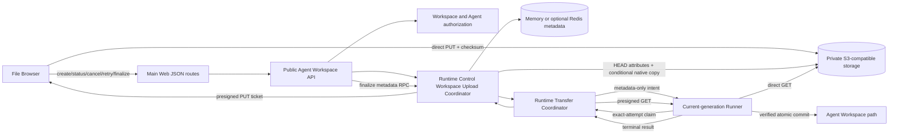
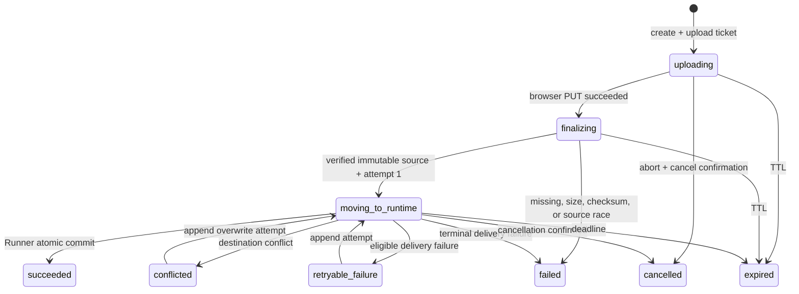

# Runtime File Browser Direct Object Transfer Design

- Snapshot: `fileupload-260917`
- Requirements: [fileupload-260917/REQ](../requirements/fileupload-260917-runtime-file-browser-upload.md)
- Decisions: [fileupload-260917/ADR](../adr/fileupload-260917-runtime-file-browser-upload.md)
- Document reference: `fileupload-260917/DESIGN`
- Supersedes before implementation: `upload-260917/DESIGN` and
  `workspaceupload-260917/DESIGN` if created

## Overview

Add direct local-file upload to the Agent Workspace file browser while using the
existing public S3-compatible endpoint as the complete byte data plane. Browser uploads
an admitted file directly through a short-lived presigned request. Runtime Control then
verifies and snapshots the ingress object through S3 metadata and native-copy operations.
Runner claims the exact Runtime delivery attempt, receives a short-lived presigned GET,
downloads the immutable source directly, verifies SHA-256 and exact size, and atomically
commits the selected Agent Workspace destination.

Runtime Control carries no Workspace Upload file body. It owns authorization, operation
metadata, presigning, finalization, transfer admission, generation and revision fencing,
status, cancellation, retry, reconciliation, and cleanup. Agent Workspace filesystem
state remains the only product-visible destination source of truth.

## Current Behavior and Requirement Gaps

The current repository provides the required primitives but not their Workspace Upload
composition:

- Agent profile images already use a ticket-based browser flow: public API issues a
  presigned PUT URL, Web uploads the `File` directly, and Web calls finalize.
- `S3Service` supports presigned PUT and GET, object HEAD metadata, conditional native
  copy, multipart copy, verified transfer metadata, deletion, and bounded listing.
- Agent Workspace services already authorize an Agent, resolve the current
  Runner-reported Workspace root, validate directories and basenames, and expose
  listing, stat, preview, download, move, rename, mkdir, and delete.
- Runtime Transfer already owns admission, transfer identity, desired and accepted
  generation fencing, cancellation, deadlines, terminal result projection, Runner
  temporary-file verification, and atomic commit.
- Runner currently receives Server-to-Runtime bytes only through `DownloadTransfer`
  gRPC. It has no HTTP object downloader or exact-attempt URL claim RPC.
- Kubernetes Runtime network enforcement protects only Runtime Control and Runtime
  Transfer as mandatory Platform endpoints. It does not project object-storage endpoint
  authority into all network modes.

The Agent avatar path is a transport precedent, not a reusable Workspace finalizer. It
downloads the complete object into the API process to decode and resize a maximum 5 MiB
image. Workspace Upload supports a larger opaque regular file and must finalize without
complete-body application download.

## Requirement and Decision Traceability

| Requirement | Design mechanisms | ADR authority |
| --- | --- | --- |
| `fileupload-260917/REQ-1` | Agent-scoped create, selected directory snapshot, direct browser PUT, verified finalize, listing invalidation | D1, D2, D3 |
| `fileupload-260917/REQ-2` | Per-file operation ADT, upload progress, explicit finalize/status/cancel/retry, immutable delivery attempts | D2, D3, D4, D6, D8 |
| `fileupload-260917/REQ-3` | Runner no-overwrite commit, opaque conflict evidence, exact overwrite precondition, atomic replace | D5, D7 |
| `fileupload-260917/REQ-4` | Requester binding, exact write/read capabilities, current Runtime and generation fencing, claim RPC | D1, D2, D5, D7, D8, D9 |
| `fileupload-260917/REQ-5` | S3 direct ingress and egress, metadata-only coordination, native snapshot, bounded cleanup and admission | D1 through D4, D6 through D9 |
| `fileupload-260917/REQ-6` | Existing upload precedent, additive generated contracts, no byte fallback, E2E-first verification | D2, D3, D6, D7, D8, D9 |

## Architecture



### Ownership and source-of-truth boundaries

- **Browser** owns the local `File`, local checksum computation, direct PUT progress, and
  request abort. It cannot choose an object key or finalize without requester authority.
- **Main Web** owns same-origin credential forwarding for JSON control requests. It does
  not proxy the file body.
- **Public API** owns requester and Agent reauthorization, destination normalization,
  public error mapping, and generated control contracts. It owns no object body.
- **Runtime Control Workspace Upload Coordinator** owns the operation record, opaque
  ingress/source handles, revision fencing, ticket issuance, finalize, delivery attempt
  creation, result projection, and cleanup.
- **S3-compatible storage** owns ingress and finalized source bytes. The bucket remains
  private; presigned requests are exact temporary capabilities.
- **Runtime Transfer Coordinator** owns Runtime delivery admission, transfer identity,
  generation, deadline, cancellation, claim, and terminal result.
- **Runner** owns direct HTTP download, local temporary-file integrity, symlink-safe
  destination inspection, conflict evidence, and atomic commit.
- **Agent Workspace filesystem** is the sole product-visible successful destination.

## Domain Model

`WorkspaceUpload` remains one stable public operation per selected local file. Its
bounded metadata includes:

- upload ID and compare-and-set revision;
- requester, Workspace, Agent, Runtime, desired generation, and optional Session
  correlation;
- destination directory, filename, and resolved Runtime path snapshot;
- expected size, media type, browser-supplied SHA-256, and expiry;
- ingress handle, ingress ticket expiry, finalized source handle, authoritative size,
  checksum, ETag or version evidence;
- phase, progress projection, terminal outcome, failure, and cleanup state;
- ordered immutable `WorkspaceUploadDeliveryAttempt` children.

Object keys and URLs never appear in public status, Redis-visible public payloads,
Runner Control intents, logs, metrics, or terminal results. Stores retain opaque handles
resolved only by Runtime Control.

### Public phases



`Queued` is local per-file UI state before that file receives an operation and ticket.
The server operation begins in `Uploading` when create issues the ticket. Exact byte
progress is browser-local because object storage receives the body directly; status
retains the bounded stage rather than accepting untrusted progress writes.
`Finalizing` may be represented as a short verification substate or user copy within
the upload phase, but `Moving to Agent Runtime` starts only after Runtime Control
records an immutable verified source and admits delivery attempt 1. Browser PUT
completion is never product success.

## Public API and Web Flow

### Create and issue upload ticket

```text
POST /chat/v1/agents/{agent_id}/workspace/uploads
```

The request contains selected directory, basename, exact file size, media type, browser
SHA-256, and optional Session correlation. The API:

1. authorizes requester, Workspace, and Agent;
2. requires a ready current Runner without starting a stopped Runtime;
3. snapshots Runtime ID and desired generation;
4. resolves and validates the existing destination directory and basename;
5. enforces product maximum size and per-requester/deployment admission;
6. allocates one operation and opaque ingress handle;
7. asks Runtime Control to presign an exact PUT using the configured public endpoint;
8. returns operation status, URL, expiry, and exact required headers.

The upload URL is returned only from create. It is not stored in operation metadata or
returned by status. An expired or failed browser-ingress ticket requires a new upload
operation; browser reload and ingress resume remain outside scope.

### Browser checksum and direct PUT

Web computes SHA-256 in a worker using bounded `File.slice()` chunks. Hash preparation
must not materialize the complete file in one `ArrayBuffer` or block the UI thread. The
browser then uploads directly with a cancellable progress-capable transport and exact
signed headers, including content type and checksum.

The browser cannot set arbitrary metadata or choose another key. CORS allows the Main
Web origin, PUT, preflight, and only the required request and response headers. Upload
failure or browser cancellation does not call finalize. It requests operation
cancellation and releases the local row independently from other selected files.

### Finalize upload source

```text
POST /chat/v1/agents/{agent_id}/workspace/uploads/{upload_id}/finalize
```

Finalize carries the exact expected upload revision. Runtime Control:

1. reauthorizes requester, Workspace, Agent, Runtime, generation, operation, and expiry;
2. claims the queued/uploading operation for finalization;
3. reads authoritative ingress object attributes with checksum mode enabled;
4. verifies exact size, SHA-256, content type policy, and stable ETag or version;
5. registers cleanup ownership before snapshot creation;
6. native-copies the exact ingress identity into a new immutable source key using
   source-match and destination-absent preconditions;
7. verifies the finalized source size and SHA-256;
8. persists source evidence and promotes cleanup ownership;
9. appends immutable Runtime delivery attempt 1; and
10. dispatches the metadata-only Runner transfer intent.

Finalize is idempotent for the exact same revision and source evidence. A missing,
oversized, checksum-mismatched, changed, or already-finalized ingress object cannot
start Runtime delivery. Runtime Control never calls `download_bytes()` for this flow.

### Status, cancel, and retry

Status opportunistically reconciles the current delivery attempt and exposes only
public-safe phase, progress, outcome, retryability, and conflict display data.

Cancel is idempotent:

- before finalize, it prevents finalize and schedules ingress cleanup after ticket
  replay authority has expired;
- during finalization, it fences the native snapshot/result transition and cleans any
  owned source residue;
- during Runtime delivery, it invokes exact Runtime Transfer cancellation and settles
  only after cancellation or a competing atomic success is observed;
- after a retryable failure or conflict, it releases the retained source instead of
  appending another attempt.

Runtime delivery retry requires the exact upload revision and current delivery number.
It appends a new immutable attempt over the retained source. Explicit overwrite also
requires the exact Runner-issued conflict precondition.

## Runtime Delivery

### Metadata-only intent

The existing `RunnerTransferIntent` retains transfer identity, operation, Runtime path,
expected size, SHA-256, overwrite mode, conflict precondition, deadline, protocol, and
dispatch identity. It gains a source transport discriminator indicating direct object
claim, but contains no URL, bucket, key, credential, or provider headers.

### Exact-attempt claim

Runner calls a new authenticated transfer RPC with exact identity, dispatch ID, Runtime,
and accepted generation. Runtime Control atomically verifies current connection and
transfer state, assigns or renews the one active claim, and returns:

- presigned GET URL;
- URL expiry no later than the transfer deadline;
- required HTTP method and safe non-secret headers;
- expected size and SHA-256 repeated for defensive comparison.

The response is non-cacheable and secret-redacted. URL query, object identity, and
headers are never logged. Retry after URL expiry reacquires only for the same active
claim and restarts the local HTTP download from byte zero. Public delivery retry still
creates a new attempt.

### Runner download and commit

Runner opens the URL with bounded redirects disabled by default. It streams response
bytes into a temporary file beneath the destination parent while updating SHA-256 and
checking the declared maximum. It rejects unexpected status, body length, extra bytes,
short body, checksum mismatch, deadline, cancellation, and control ownership loss.

After fsync, Runner enters the existing commit lock. No-overwrite uses atomic link or
rename semantics and returns conflict evidence if the destination exists. Explicit
overwrite validates the exact opaque precondition before atomic replacement. Runner
then reports the terminal result through the existing fenced control contract.

## Security and Permissions

- Create, finalize, status, cancel, and retry reauthorize the exact requester and Agent.
- Presigned upload grants one write method to one opaque ingress target and expiry.
- Presigned download grants one read method to one immutable source and expiry.
- The bucket remains private and denies anonymous listing and object access.
- Browser and Runner receive no long-lived credentials.
- URLs, query signatures, physical keys, checksum headers containing secrets, and
  provider responses are redacted from logs, tracing, errors, metrics, and stored state.
- Finalize trusts only object-store attributes and operation metadata, not Browser
  success, ETag, size, or checksum claims alone.
- Runner commit remains generation-, attempt-, path-, and destination-precondition
  fenced.
- No customer-controlled URL enters Runner; SSRF scope is limited to Runtime
  Control-generated signed URLs for the configured endpoint.

## Configuration, Network, and Readiness

The existing object-storage public endpoint becomes required. Runtime Control receives
the same public signing endpoint configuration as the server application while keeping
its trusted SDK endpoint and credentials private.

Deployment readiness validates:

- non-empty public endpoint with supported HTTPS policy outside local development;
- bucket credentials can issue PUT and GET signatures;
- object storage supports the required checksum attributes and conditional native copy;
- configured Main Web origins are present in bucket CORS;
- Runtime Platform egress authority can reach the endpoint in all supported modes;
- DNS or host mapping and network-policy inputs are stable and representable.

Kubernetes provider configuration extends Platform endpoint authority beyond the two
current Runtime Control roles to include object storage. `direct`, `proxy_required`,
and `no_network` policies allow only the exact configured endpoint authority. A public
endpoint whose addresses cannot be represented by stable deployment-owned CIDRs,
private endpoint addresses, or an equivalent enforced route is a readiness failure.

No fallback re-enables Main Web/API/Runtime Control body relay or Runner gRPC download.

## Cleanup, Reconciliation, and Recovery

Runtime Control durably records exact cleanup ownership before every S3 mutation.
Cleanup distinguishes ingress object, incomplete or failed snapshot state, immutable
source, and operation metadata. Claims are revision-fenced and lease-reclaimable in
both Memory and Redis implementations.

- Unfinalized ingress objects remain cleanup-eligible after ticket expiry.
- A finalized source is retained only while an active or retryable delivery may use it.
- Successful, cancelled, expired, and terminal-failed operations delete ingress and
  source objects before metadata purge.
- Prefix reapers list bounded pages for objects and multipart-copy residue and delete
  only identities that cannot be matched to live cleanup authority after the orphan
  grace period.
- Bucket lifecycle independently removes aged ingress and source prefixes as backup.
- Optional Redis loss never reconstructs authority from object residue. Old operations
  become unavailable, and reapers remove their objects after grace.
- Terminal metadata purge requires cleanup `COMPLETE` or `NOT_REQUIRED` and an exact
  terminal revision fence.

## Rollout and Compatibility

This is a hard cut for the unimplemented Workspace Upload feature. There is no existing
public Workspace upload contract to migrate. Existing Agent avatar upload, chat
attachment upload, Exchange behavior, Workspace download, and other Runtime Transfer
consumers remain unchanged.

Runtime Control and Runner advertise a new direct-object-download capability and
protocol version. Workspace Upload creation fails closed until the current Runner,
Runtime Control, public endpoint readiness, and network enforcement all support it.
Mixed-version fallback to `DownloadTransfer` is excluded.

## Observability

Metrics and structured logs cover bounded categories without URL or object identity:

- ticket issue, direct upload finalize, source snapshot, claim, download, commit,
  cancellation, cleanup, and orphan-reaper outcomes;
- bytes by stage from declared/finalized/Runner-observed counters;
- active operations, retained bytes, finalize and claim latency, direct-download
  duration, checksum failures, URL expiry, network failures, conflict, and cleanup age;
- public endpoint readiness and CORS/network prerequisite failures by stable category.

Request-scoped logs may contain upload ID, transfer ID, Runtime ID, Agent ID, phase, and
safe failure category. They never contain signed URLs, query strings, keys, or raw
provider exceptions returned to users.

## Test Strategy

### E2E primary matrix

Product E2E uses the real browser, public endpoint, object storage, Runtime Control,
Runner, and Workspace download boundary. It verifies:

1. one exact non-empty file through presigned PUT, finalize, presigned GET, atomic commit,
   listing refresh, and exact-byte Workspace download;
2. zero-byte file behavior;
3. multiple files with independent progress and mixed outcomes;
4. browser cancellation during direct PUT and no visible destination;
5. missing, oversized, checksum-mismatched, replaced, and expired ingress objects;
6. destination conflict, exact overwrite, and changed-destination re-conflict;
7. Runtime generation replacement before claim, during direct GET, and before commit;
8. Runtime delivery failure followed by a new immutable attempt without browser reupload;
9. expired GET followed by same-claim byte-zero reacquisition within deadline;
10. no-network and proxy-required Runtime success through Platform endpoint authority;
11. absent public endpoint, invalid CORS, unsupported checksum, and unreachable Runtime
    endpoint fail closed without byte-relay fallback;
12. empty optional Redis state never produces false success and orphan cleanup converges.

### Deterministic lower-level evidence

- S3 fake and compatible-store integration tests prove required signed headers,
  checksum attributes, source-match copy, destination-absent copy, replay, and cleanup.
- Store contract tests run identically for Memory and Redis.
- Runner tests use explicit synchronization for cancel/generation/commit ordering and a
  bounded local HTTP server without fixed sleeps.
- Composition tests prove Runtime Control constructs the public presigner, claim RPC,
  reaper, and existing transfer services with shared lifecycle ownership.
- Repository spies assert no Workspace Upload call to Main Web body proxy, API body
  stream, Runtime Control body stream, `download_bytes()`, or `DownloadTransfer`.

### Fixtures and CI

Testenv requires a browser-reachable S3-compatible endpoint with CORS, a
Runner-reachable route, deterministic credentials, and checksum/conditional-copy
support. CI fails rather than skips when the required local fixture is selected but its
prerequisites are missing. Optional live-provider coverage may skip only with explicit
credential/prerequisite evidence and cannot replace the required compatible-store E2E.

Evidence records exact command, commit SHA, endpoint mode, Runtime network mode, object
store implementation/version, and pass/fail artifacts without credentials or URLs.

## Removal and Replacement

| Existing or unmerged unit | Removal authority | Replacement or remaining authority | Removal boundary | Absence verification |
| --- | --- | --- | --- | --- |
| Main Web Workspace upload binary proxy planned by `upload-260917` | `fileupload-260917/ADR-D2` | Generated JSON create/finalize/status/cancel/retry routes plus browser direct PUT | Web route, tests, docs | Search finds no Workspace body proxy or backend URL; E2E observes direct S3 request |
| Public API and Runtime Control client-streaming `UploadWorkspaceSource` RPC | `fileupload-260917/ADR-D2`, D3 | Metadata-only create/finalize RPCs | Proto, generated client, servicer, auth, tests | Generated descriptor and repository search contain no source-body RPC |
| `WorkspaceUploadSourceStager` multipart body writer and progress ingestion | `fileupload-260917/ADR-D2`, D3 | Presign, HEAD/checksum verification, native immutable snapshot | Runtime transfer source modules and tests | No Workspace source chunk iterator or multipart ingress writer remains |
| Workspace upload source-to-transfer-object copy | `fileupload-260917/ADR-D6`, D7 | Finalized immutable source read directly by Runner | Reconciliation and S3 test doubles | Spy proves one finalize snapshot and zero Runtime Transfer download-object copies |
| Workspace use of Runner `DownloadTransfer` gRPC | `fileupload-260917/ADR-D6`, D8 | Exact-attempt claim RPC plus Runner HTTP GET | Coordinator, Runner client/manager, protobuf, tests | Workspace E2E and spies prove no DownloadTransfer call |
| Optional object-storage public endpoint for Workspace Upload | `fileupload-260917/ADR-D9` | Required public endpoint, CORS, and Platform Runtime egress readiness | Config, Helm schema/templates/tests, provider network contract | Missing prerequisite fails readiness/create; chart tests cover required projection |
| Existing Agent avatar presigned upload | No removal authority | Existing behavior remains; only pattern and shared low-level S3 helpers may be reused | None | Avatar API/Web/service regression tests remain unchanged |
| Existing non-Workspace Runtime Transfer consumers | No removal authority | Existing gRPC byte transport remains authoritative | None | Existing transfer consumer and protocol regression suites pass |
| Unmerged `upload-260917` Workspace upload implementation and plans | `fileupload-260917/REQ`; D2, D3, D6, D8 | This Design and later approved implementation plan | Workspace upload source/reconciliation code, old docs/plans, generated surfaces | Diff and search show only approved direct-object mechanisms remain |

## Design Authority

- Design revision: `1`

| ID | Material design mechanism | Authority | Classification |
| --- | --- | --- | --- |
| M1 | One transient non-Exchange operation with ingress and immutable source lifecycle | `fileupload-260917/ADR-D1` | `decided` |
| M2 | Browser direct presigned upload with bounded checksum preparation and progress/cancel | `fileupload-260917/ADR-D2` | `decided` |
| M3 | Authenticated object-attribute verification and S3-native immutable snapshot | `fileupload-260917/ADR-D3` | `decided` |
| M4 | Explicit create/finalize/status/cancel/retry operation lifecycle | `fileupload-260917/ADR-D4` | `decided` |
| M5 | Runner-issued opaque conflict precondition and atomic replacement | `fileupload-260917/ADR-D5` | `decided` |
| M6 | Runner direct presigned GET with exact size/SHA-256 verification | `fileupload-260917/ADR-D6` | `decided` |
| M7 | Existing Runtime Transfer admission, generation, cancellation, and result authority | `fileupload-260917/ADR-D7`; current Runtime Transfer Spec | `existing` |
| M8 | Metadata-only intent plus authenticated exact-attempt download claim RPC | `fileupload-260917/ADR-D8` | `decided` |
| M9 | Mandatory public endpoint, browser CORS, and Platform Runtime egress in every network mode | `fileupload-260917/ADR-D9` | `decided` |
| M10 | Memory and optional-Redis parity with revision-fenced cleanup and empty-store failure | `fileupload-260917/REQ-5`; Redis optional project constraint | `derived` |
| M11 | Independent per-file UI phases and current-directory refresh | `fileupload-260917/REQ-1`, `REQ-2`, `REQ-6` | `required` |
| M12 | No byte-relay or mixed-version fallback | `fileupload-260917/REQ-5`, `REQ-6`; D2, D6, D9 | `required` |
| M13 | E2E-first direct PUT/finalize/direct GET/exact-byte verification | `fileupload-260917/REQ-6`; documentation Test Strategy rules | `required` |
| M14 | Removal of the unmerged body-stream, transfer-copy, and Workspace DownloadTransfer mechanisms | `fileupload-260917/REQ`; D2, D3, D6, D8 | `derived` |

## Feasibility Assessment

| Requirement | Status | Repository evidence and condition |
| --- | --- | --- |
| `REQ-1` | feasible | Existing Agent avatar Web/API proves browser ticket and direct PUT; Workspace authorization and path resolution already exist. |
| `REQ-2` | feasible | Browser progress/cancel requires replacing avatar `fetch` with a progress-capable transport; upload operation and retry state patterns already exist in the unmerged work. |
| `REQ-3` | feasible | Runner atomic no-overwrite/replacement and the unmerged opaque conflict precondition implementation provide the required commit boundary. |
| `REQ-4` | conditional | Existing auth and transfer generation fencing are reusable; public URL secrecy, exact claim, and Platform endpoint network authority require new typed contracts and redaction tests. |
| `REQ-5` | conditional | `S3Service` already exposes presign, HEAD metadata, checksum fields, and conditional copy primitives. Runtime Control HEAD must request checksum mode, the upload presigner must sign checksum headers, and the configured S3-compatible backend must pass compatibility tests. |
| `REQ-6` | conditional | OpenAPI/protobuf generators and E2E infrastructure exist. All Runtime network modes require a stable enforceable public-endpoint route; deployments without one fail readiness rather than use fallback. |

No product contradiction remains. Implementation is feasible provided the deployment can
supply a public endpoint whose checksum, conditional-copy, CORS, TLS, DNS, and Runtime
network authority pass readiness and E2E validation. That is an explicit mandatory
prerequisite rather than a hidden fallback.

## Design Approval

- Mode: `Collaborative`
- Decision owner: `Requester`
- Approved on: `2026-09-17`
- Approved Design revision: `1`
- Approved authority IDs: `M1, M2, M3, M4, M5, M6, M7, M8, M9, M10, M11, M12, M13, M14`
- Approved scope: `Direct browser presigned upload, authenticated checksum and immutable-source finalization, direct Runner presigned download after exact-attempt claim, retained Runtime Transfer coordination and atomic commit authority, mandatory public endpoint/CORS/Platform egress, bounded operation state and cleanup, removal of unmerged byte-relay mechanisms, and E2E-first verification`
