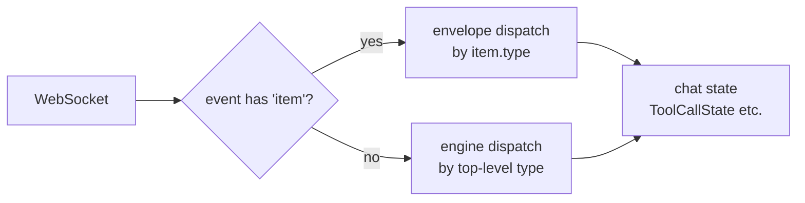

# Frontend Chat Wire Format Update (events-unification follow-up)

## Overview

After the events-unification stack (#3140-#3151) merged, broker wire format changed to envelope shape. nointern-web `ChatEvent` type definition and dispatch logic still target old wire, so chat UI breaks. This work is a **frontend hot-fix** to match the new wire.

Related issue: #3153

## User Scenarios

- User sends message in chat → assistant runs shell tool → UI correctly shows tool call + output.
- On subagent call, SubagentStart/End events appear in UI.
- When compaction triggers, UI indicator works.

## Discussion Points and Decisions

### DP1: wire adaptation strategy

- A) **Fully update client types + dispatch** — backend already emits only new wire.
- B) Normalize to old shape with adapter function.
- C) Server dual-emit (compatibility for both).

**Decision: A**. Backend is unified to single wire, so client should use same shape to reduce future change cost. Adapter would permanently maintain two shapes and become debt.

### DP2: dispatch structure

- A) Bulk-edit 22 cases for new envelope (`e.content → e.item.content`).
- B) Add first branch — `if (event has "item") dispatchEnvelope(event); else dispatchEngine(event)` — same pattern as backend.

**Decision: B**. Symmetric with backend `serialize_event` / `deserialize_event` dispatch. When adding new envelope type, only one location changes.

### DP3: FCI ↔ FCO pairing

- A) **Reassemble at wire layer** — when FCO arrives, find FCI message with same `call_id` and inject output. Keep UI ToolCallState shape.
- B) Split UI model itself (separate toolOutputs Map).

**Decision: A**. Reuse existing `toolCallMerge.ts` and ToolCallState type as-is. Wire normalization belongs in hook layer.

### DP4: subagent type rename

`subagent_stream_start/end` → `subagent_start/end`. Simple string rename across types + dispatch + applyXxx functions.

### DP5: new type addition / rename confirmation

Research found backend wire emits:
- `image_generation_item` (old frontend: `generated_image`) — rename needed
- `web_search_call_item` (old frontend: `web_search_call`) — rename needed
- `function_call_output_item` — new addition
- `compaction` (Event item — separate decision whether UI shows it; ignore by default)
- `user_input` / `system_reminder` — UI already tracks user input itself, ignore

### DP6: ErrorEvent shape

Old `{type:"error", id, message}` → new envelope `{type:"error", id, item:{type:"error", content}, ...}`. UI displays `item.content`.

## Architecture



## Data Model (TypeScript types)

```ts
// Event envelope (durable items)
interface ChatEnvelope<T extends ItemPayload> {
  type: T["type"];          // computed_field, same as item.type
  id: string;
  item: T;
  raw_item: object | null;
  external_id: string | null;
  source_model: string | null;
}

// Item payloads (branch by item.type)
type ItemPayload =
  | { type: "text_item"; content: string; attachments: WireAttachment[] }
  | { type: "reasoning_item"; reasoning: object; reasoning_text: string }
  | { type: "function_call_item"; tool_call: { id; name; arguments } }
  | { type: "function_call_output_item"; call_id: string; output: { content; attachments; images } }
  | { type: "image_generation_item"; attachments: WireAttachment[] }
  | { type: "error"; content: string }
  | { type: "web_search_call_item" }
  | { type: "turn_complete"; usage: TokenUsage | null }
  | { type: "unknown_item" }
  | { type: "subagent_start"; subagent_id; subagent_name; subagent_session_id }
  | { type: "subagent_end"; subagent_id; subagent_session_id; result };

// EngineEvent (top-level type unchanged)
type EngineEvent =
  | { type: "content_delta"; ... }
  | { type: "run_started"; run_id }
  | ...;
```

## Impacted Files

- `typescript/apps/nointern-web/src/features/chat/types.ts` — update ChatEvent union, introduce ChatEnvelope
- `typescript/apps/nointern-web/src/features/chat/hooks/useChatWebSocket.ts` — dispatch branch (envelope vs engine), update 22 cases
- `typescript/apps/nointern-web/src/features/chat/hooks/toolCallMerge.ts` — inject output into FCI tool call with same call_id when FCO arrives
- `typescript/apps/nointern-web/src/features/chat/hooks/useSubagentSession.ts` — subagent_stream_* → subagent_*

## Feasibility Verification

- [x] Confirmed backend wire shape (broker/serialization.py + serialization_test.py actual measurement)
- [x] Confirmed frontend dispatch location (useChatWebSocket handleEvent, useSubagentSession)
- [x] FCI/FCO pairing — call_id exists in wire (item.tool_call.id, item.call_id)
- [x] computed_field guarantees top-level type (Event.type)
- [ ] typecheck pass — verify after implementation
- [ ] manual chat behavior — verify with devserver after implementation if possible

## Alternatives Considered

- Server dual-emit: permanent backend code debt. Rejected.
- Adapter normalize: permanently keeps old shape. Rejected.
- Split UI model: breaks existing ToolCallState pattern. Rejected.

## Implementation Plan

Single PR (work size ~150 LOC):

1. `types.ts` — introduce ChatEnvelope + ItemPayload union, update/reduce existing 22 interfaces
2. `useChatWebSocket.ts` — dispatch branch (item existence) + update field paths in each case
3. `toolCallMerge.ts` — add pairing logic when FCO arrives
4. `useSubagentSession.ts` — subagent type rename + envelope application
5. pass typecheck / lint / format

## testenv QA

No nointern testenv scenario added because this is frontend-only change. nointern-web manual smoke (chat message + tool call) is sufficient.
