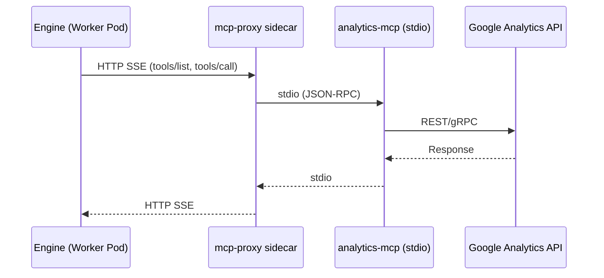
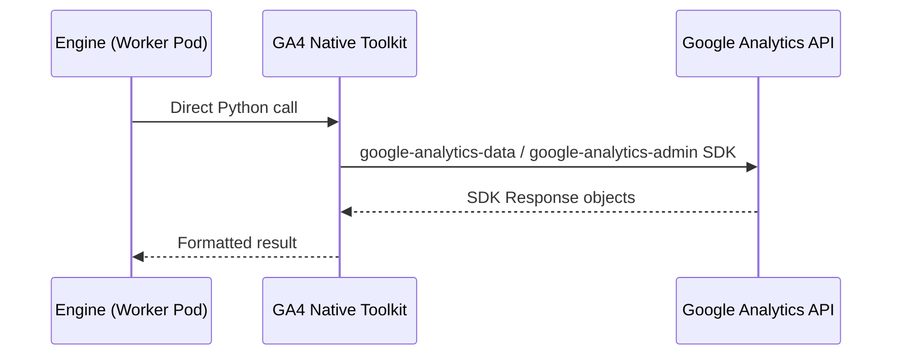

# GA4 Native Toolkit Design

> Related issue: #2197
> Existing design: [stdio MCP GA4 integration](stdio-260326-stdio-mcp-ga4-integration.md)

## Overview

Current Google Analytics 4 toolkit is based on stdio MCP (`analytics-mcp`) + mcp-proxy sidecar. Convert it to native Python toolkit to remove sandbox dependency and cold start.

**Current structure (stdio MCP):**



**After migration (native):**



## Motivation

| Problem | Description |
|------|------|
| Cold start ~30 seconds | stdio toolkit requires Agent Home Pod (sandbox) startup |
| Infrastructure complexity | mcp-proxy sidecar, ConfigMap, Secret, separate Docker image |
| Sandbox dependency | sandbox is required to run stdio MCP server |
| Difficult debugging | Engine → HTTP SSE → mcp-proxy → stdio → API, 4-step communication |
| Resource waste | separate CPU/Memory allocation for sidecar container |

## Design Decisions

### 1. Use SDK

**Decision: use `google-analytics-data`, `google-analytics-admin` SDKs.**

Rationale:
- Both SDKs have `py.typed` marker and provide inline type annotations on Request/Response objects.
- Concrete types such as `RunReportRequest`, `RunReportResponse`, `Row`, `DimensionValue` are usable.
- pyright strict compatible — attribute access can be type checked.
- Lower maintenance burden than direct REST call (only SDK update needed on API change).

Dependencies to add:
- `google-analytics-data` — Data API v1beta client
- `google-analytics-admin` — Admin API v1beta client
- `grpcio` (~17MB native binary) — installed together as required SDK dependency

Note: SDK constructor kwargs use `proto.Message.__init__(**kwargs)` pattern, so pyright cannot catch wrong keywords.

### 2. SA Key → SDK Credentials

**Decision: create `google.oauth2.service_account.Credentials` from SA Key JSON and pass to SDK clients.**

- Use `Credentials.from_service_account_info(sa_key_json, scopes=[...])`.
- Pass as `credentials` parameter when creating SDK clients.
- Token refresh is handled automatically by SDK/google-auth.

Required OAuth2 scopes:
- `https://www.googleapis.com/auth/analytics.readonly` (Data API + Admin API)

### 3. Define tools with make_tool pattern

**Decision: use same `make_tool()` + Pydantic input model pattern as K8s toolkit.**

```python
class RunReportInput(BaseModel):
    property_id: str = Field(description="GA4 property ID")
    date_ranges: list[DateRange] = Field(description="Date ranges for the report")
    metrics: list[str] = Field(description="Metric names")
    dimensions: list[str] = Field(default=[], description="Dimension names")
    ...

async def run_report(args: RunReportInput) -> str:
    """Run a GA4 standard report with dimensions, metrics, and date ranges."""
    request = RunReportRequest(
        property=f"properties/{args.property_id}",
        date_ranges=[...],
        metrics=[Metric(name=m) for m in args.metrics],
        dimensions=[Dimension(name=d) for d in args.dimensions],
    )
    response = await client.run_report(request)
    # typed attribute access from SDK Response object
    for row in response.rows:
        row.dimension_values, row.metric_values
    ...

tool = make_tool(run_report, input_model=RunReportInput)
```

### 4. Preserve stdio infrastructure

**Decision: do not remove stdio MCP infrastructure code.**

- Can be used by future stdio MCP toolkits (e.g. Sentry access_token mode).
- Keep `McpStdioToolkitConfig`, `get_stdio_configs()`, `set_server_url()`, etc.
- Replace only GA4 toolkit with native.

### 5. Keep external interface

**Decision: do not change existing config, type, registry interfaces.**

- `ToolkitType.GOOGLE_ANALYTICS` — keep
- `GoogleAnalyticsToolkitConfig` — keep (`default_property_id`, `timeout`)
- `GoogleAnalyticsToolkitProvider` slug `"google_analytics"` — keep
- No frontend change

## API Mapping

### GA4 Data API v1beta (`google-analytics-data`)

| Tool | SDK method | Description |
|------|-----------|------|
| `run_report` | `BetaAnalyticsDataAsyncClient.run_report()` | standard report |
| `run_realtime_report` | `BetaAnalyticsDataAsyncClient.run_realtime_report()` | realtime report |
| `get_custom_dimensions_and_metrics` | `BetaAnalyticsDataAsyncClient.get_metadata()` | custom dimensions/metrics |

### GA4 Admin API v1beta (`google-analytics-admin`)

| Tool | SDK method | Description |
|------|-----------|------|
| `get_account_summaries` | `AnalyticsAdminServiceAsyncClient.list_account_summaries()` | account/property list |
| `get_property_details` | `AnalyticsAdminServiceAsyncClient.get_property()` | property details |
| `list_google_ads_links` | `AnalyticsAdminServiceAsyncClient.list_google_ads_links()` | Ads link list |
| `list_property_annotations` | `AnalyticsAdminServiceAsyncClient.list_key_events()` | property annotations (Key Events) |

### Authentication

Pass SA credentials as `credentials` parameter when creating SDK clients:
```python
from google.oauth2.service_account import Credentials
from google.analytics.data_v1beta import BetaAnalyticsDataAsyncClient

credentials = Credentials.from_service_account_info(sa_key_json, scopes=[...])
data_client = BetaAnalyticsDataAsyncClient(credentials=credentials)
admin_client = AnalyticsAdminServiceAsyncClient(credentials=credentials)
```

## File Structure

### New File

| File | Role |
|------|------|
| `engine/tools/google_analytics_api.py` | GA4 SDK client wrapper (credentials management + client creation) |

### Changed Files

| File | Change |
|------|----------|
| `engine/tools/google_analytics.py` | replace stdio with native (reimplement Toolkit + Provider) |
| `engine/tools/google_analytics_test.py` | rewrite tests for native implementation |

### Unchanged

| File | Reason |
|------|------|
| `core/tools.py` | keep `ToolkitType`, `GoogleAnalyticsToolkitConfig` |
| `engine/tools/deps.py` | same registry registration (keep slug) |
| `runtime/sandbox/` | preserve stdio infrastructure |
| Frontend | same config interface |

## Error Handling

### SDK Exceptions

- **`google.api_core.exceptions.Unauthenticated`** (401): refresh credentials and retry once
- **`google.api_core.exceptions.PermissionDenied`** (403): return insufficient permission message (SA needs analytics.readonly)
- **`google.api_core.exceptions.NotFound`** (404): return invalid property ID message
- **`google.api_core.exceptions.ResourceExhausted`** (429): use SDK default retry policy
- **`google.api_core.exceptions.GoogleAPICallError`** (5xx): use SDK default retry policy

SDK includes `google-api-core` retry mechanism, so use SDK defaults without separate retry logic.

### Timeout

- Default 30 seconds (`GoogleAnalyticsToolkitConfig.timeout`)
- Pass as `timeout` parameter to SDK client

## test_connection Improvement

With existing stdio-based implementation, actual connection test was impossible without sidecar. Native migration enables actual API call in `test_connection()`:

```python
async def test_connection(self, config, credentials_json, *, proxy_url=None):
    # SA Key → create Credentials
    # call list_account_summaries with AnalyticsAdminServiceAsyncClient
    # success: return success with account list
    # failure: extract concrete error message from SDK exception and return
```

## Egress Proxy

GA4 API endpoints (`analyticsdata.googleapis.com`, `analyticsadmin.googleapis.com`) are Google public APIs, so egress proxy is not needed. Do not configure separate proxy on SDK clients.

## Transport

SDK uses gRPC transport by default. REST transport can be used if needed, but gRPC is better for performance/streaming, so use default (gRPC).
