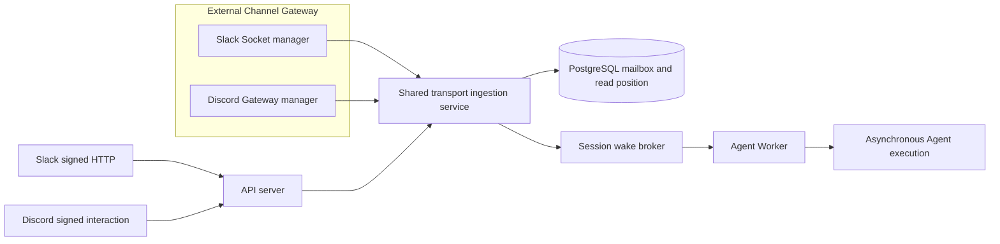

# gateway-260731/DESIGN: Consistent Persistent Provider Ingress

## Requirements and Decisions

This design implements the confirmed
[gateway-260731/REQ](../requirements/gateway-260731-consistent-provider-ingress.md)
and accepted
[gateway-260731/ADR](../adr/gateway-260731-consistent-provider-ingress.md).

| Requirement | Decision | Design mechanism |
|---|---|---|
| `gateway-260731/REQ-1` | `ADR-D1` | One provider-neutral CLI, launcher, and Deployment resolve and run both persistent transport managers. |
| `gateway-260731/REQ-2` | `ADR-D1` | Existing managers continue to call `ExternalChannelTransportIngestionService` directly through DI. |
| `gateway-260731/REQ-3` | `ADR-D1` | Remove Slack Socket manager composition and task supervision from `AgentWorker`. |
| `gateway-260731/REQ-4` | `ADR-D2` | Preserve manager lease behavior and use one shared shutdown event for fenced release. |
| `gateway-260731/REQ-5` | `ADR-D2` | Combined top-level supervision fails fast; per-connection failures remain manager-owned durable health transitions. |
| `gateway-260731/REQ-6` | `ADR-D3` | Replace Discord-specific CLI, shell, Helm key, template, labels, and tests; add absence assertions. |
| `gateway-260731/REQ-7` | `ADR-D2`, `ADR-D3` | Focused runtime tests, manager regressions, Helm render tests, deterministic E2E, and repository quality checks. |

## Current Behavior and Gap

`SlackSocketManagerService` is injected into `AgentWorker`. The Worker starts the manager
beside broker consumption, includes its task in every receive wait, terminates when the
manager exits, and cancels the manager during Worker shutdown. Consequently, any Agent
Worker rollout changes Slack Socket Mode ownership even though socket ingestion does not
use Worker-local Session execution.

`DiscordGatewayManagerService` runs from `src/cli/discordgatewayworker.py` through
`bin/discordgatewayworker.sh` in a dedicated `discord-gateway` Helm Deployment. That
entrypoint starts the common Worker health server and directly awaits the Discord
manager.

Both managers already have the desired application boundary:

- provider-specific connection discovery and SDK lifecycle;
- database-backed lease claim, renewal, release, and stale-owner rejection;
- typed provider event projection;
- direct dependency-injected invocation of
  `ExternalChannelTransportIngestionService`; and
- per-connection health transitions without provider content in diagnostics.

The implementation gap is therefore runtime composition rather than ingestion logic,
provider protocol logic, or persistence.

## Proposed Architecture

The External Channel gateway is a server runtime role, not a new Python application or
shared library. It uses the same container image and `run_with_container()` dependency
composition as the current Discord entrypoint.

## Runtime Composition

Add `src/cli/externalchannelgateway.py` with these responsibilities:

1. load `Config` and configure runtime logging;
2. enter `run_with_container(config)`;
3. resolve `SlackSocketManagerService`, `DiscordGatewayManagerService`, and the existing
   `HealthServer`;
4. install SIGINT and SIGTERM handlers;
5. start the health server;
6. run both manager coroutines under one supervisor;
7. on shutdown, mark readiness false before setting the shared shutdown event; and
8. wait for manager cleanup before stopping the health server.

The supervisor creates one task per required manager and one task waiting on the shared
shutdown event. Normal shutdown takes priority. Before shutdown, either manager task
returning or raising is unexpected and propagates as a runtime failure. Pending tasks are
cancelled and awaited in `finally` without suppressing a previously unobserved manager
failure.

Place the supervisor in an importable service module rather than embedding all task
logic in the CLI so deterministic unit tests can inject small manager doubles. The
proposed module is
`azents.services.external_channel.gateway_runtime.ExternalChannelGatewayRuntime`.
It receives both managers through constructor injection and exposes
`run(shutdown_event)`.

The runtime does not combine manager internals. Slack and Discord retain independent
poll intervals, manager IDs, lease schemas, SDK clients, connection tasks, lifecycle
classification, and provider acknowledgement behavior.

## Agent Worker Contraction

Remove from `AgentWorker`:

- the `SlackSocketManagerService` import and dataclass field;
- `_SocketManagerStopped`;
- creation and cancellation of `socket_manager_task`;
- manager failure observation state;
- the manager task parameter and branch in `_receive_or_shutdown()`; and
- Worker tests that assert socket-manager supervision.

`_receive_or_shutdown()` returns to waiting only for broker messages or Worker shutdown.
The Worker composition test asserts that neither the legacy event processor nor a socket
manager is a dependency.

`ExternalChannelProviderControlService` remains in the Worker because it settles
provider-control work associated with Agent execution and is not a persistent ingress
transport owner.

## Helm and Command Replacement

Replace the Discord-specific chart surface:

| Current | Replacement |
|---|---|
| `server.discordGateway.resources` | `server.externalChannelGateway.resources` |
| `discord-gateway-deployment.yaml.tpl` | `external-channel-gateway-deployment.yaml.tpl` |
| Deployment/component/container `discord-gateway` | `external-channel-gateway` |
| `./bin/discordgatewayworker.sh` | `./bin/externalchannelgateway.sh` |
| `src/cli/discordgatewayworker.py` | `src/cli/externalchannelgateway.py` |
| `discord_gateway_render_test.py` | `external_channel_gateway_render_test.py` |

The health port remains `8013`; it is an internal container probe contract and does not
encode a provider. The Deployment remains one replica by default, uses the existing
server image, service account, configuration, secret references, probes, and 60-second
termination grace period.

No compatibility Helm key or old launcher alias is retained. Render tests assert the new
identity and assert that the old Deployment name and command are absent.

## Connection Ownership and Rollout

No database migration is required. Existing connection rows and leases are unchanged.
During rollout:

1. existing Worker pods may temporarily retain Slack Socket leases;
2. the existing Discord pod may temporarily retain Discord Gateway leases;
3. the new External Channel gateway starts and polls for claimable connections;
4. old pods enter shutdown, stop new admission, and release current leases;
5. the new gateway claims released connections, or claims them after lease expiry if an
   old process terminated before release; and
6. generation and owner checks reject stale admission or lifecycle writes.

The Helm Deployment rename creates a replacement Kubernetes object rather than mutating
the old Deployment selector. Argo removes the old `discord-gateway` Deployment after the
new chart no longer renders it. Correctness does not require both objects to become ready
in a specific order because database leases fence authority.

## Failure Handling

### Individual connection failure

Manager behavior remains unchanged:

- invalid credentials or required Discord intents become sanitized
  reconnect-required state;
- recoverable transport loss records degraded state and reconnects through the SDK or
  manager lifecycle;
- lease loss cancels or rejects the stale owner; and
- one connection task ending does not terminate the manager loop.

### Top-level manager failure

A manager `run()` method returning or raising before shutdown means the gateway has lost
one required transport class. `ExternalChannelGatewayRuntime` raises, the CLI exits, and
Kubernetes restarts the pod. The health server cannot remain ready after a required
manager has stopped.

### Graceful shutdown

The signal handler calls `health.mark_shutting_down()` and sets the shared shutdown
event. Both managers cancel connection tasks and release authority through their current
cleanup paths. The runtime waits for both managers and then the CLI stops the health
server.

## Security and Observability

- No provider credential, token, endpoint, payload, provider ID, message body, or
  transient URL is added to logs.
- Runtime logs identify only the provider-neutral process lifecycle and manager class
  failure category.
- Existing manager logs and durable reason codes remain the connection-level evidence.
- Health endpoints expose only process readiness and Redis availability through the
  existing `HealthServer` contract.
- The command line contains no secret or provider-specific runtime parameter.

## Removal and Replacement

| Obsolete surface | Replacement or remaining authority | Removal boundary | Absence verification |
|---|---|---|---|
| `AgentWorker.socket_manager` composition and receive-loop supervision | `ExternalChannelGatewayRuntime` owns Slack Socket supervision | Remove in this PR when the provider-neutral runtime is added | Dataclass composition test and repository grep contain no Worker socket-manager field or failure branch. |
| Discord-only Python CLI and shell launcher | Provider-neutral `externalchannelgateway` CLI and launcher | Delete in this PR | Files are absent and Helm/E2E commands reference only the replacement launcher. |
| `discord-gateway` Helm Deployment, component label, container name, and render test | `external-channel-gateway` Deployment and render contract | Replace in this PR | Helm render tests assert the new identity and reject the old name and command. |
| `server.discordGateway` values/schema key | `server.externalChannelGateway` | Replace in this PR | Schema validation accepts the new key and tracked active configuration contains no old key. |
| Discord-specific E2E gateway fixture name and command | Combined External Channel gateway factory used by Slack Socket and Discord Gateway journeys | Replace in this PR | Both deterministic socket journeys start the same provider-neutral command. |
| Living-spec statements assigning Slack sockets to Agent Worker or Discord to a dedicated provider process | Provider-neutral persistent-ingress runtime contract | Update in this PR | Spec review and targeted grep find no current-behavior statement for the obsolete split topology. |

No database table, persisted lease field, public API, generated client, credential
format, provider manager, or ingestion service becomes obsolete in this replacement.
Historical implemented Requirements, ADRs, and Designs remain unchanged.

## Living Spec Updates

Update:

- `docs/azents/spec/domain/external-channel.md` to identify the provider-neutral gateway
  as the owner of persistent transports;
- `docs/azents/spec/flow/external-channel-provider-ingress.md` to describe both socket
  adapters in one runtime and the direct shared-ingestion call;
- `docs/azents/spec/flow/external-channel-lifecycle.md` to describe shared process
  supervision, independent connection leases, and Agent Worker decoupling; and
- `docs/azents/spec/flow/test-strategy-e2e-primary.md` if its deployment fixture inventory
  names the Discord-specific worker.

Implemented historical Discord ADRs and Designs remain unchanged.

## Test Strategy

### E2E primary verification matrix

| Scenario | Deterministic fixture | Expected evidence |
|---|---|---|
| Slack Socket Mode message | Slack provider fake and combined gateway container | Canonical mailbox/Session execution and provider acknowledgement remain successful. |
| Discord Gateway message | Discord provider fake and combined gateway container | Canonical mailbox/Session execution and Discord delivery remain successful. |
| Direct Slack HTTP message | API server and Slack provider fake | Behavior remains independent from gateway composition. |
| Gateway lifecycle | Combined gateway container readiness | One process reaches readiness while both manager loops remain supervised. |

The existing deterministic External Channel E2E suite is the primary behavior evidence.
Its fixture starts one `external-channel-gateway` container instead of a Discord-only
container. No direct database writes or new live credentials are required.

### Unit and integration verification

- Add gateway runtime tests for normal dual-manager operation, early manager return,
  manager exception propagation, shutdown ordering, and task cancellation.
- Update Worker composition and receive-loop tests to prove socket ownership is absent.
- Keep focused `socket_manager_test.py` and `discord_gateway_manager_test.py` coverage
  unchanged except for any import or fixture composition adjustments.
- Replace Helm render tests and assert old names, values, and commands are absent.
- Run chart schema and render validation.

### CI policy

Run focused tests while editing, then backend Ruff, format check, Pyright, relevant
pytest, Helm lint/render tests, and deterministic E2E. Required CI must pass on the PR
head. Live provider tests are not required because the topology change uses existing SDK
and deterministic provider boundaries rather than new provider capabilities.

## Feasibility

| Item | Result | Evidence |
|---|---|---|
| `REQ-1` | feasible | Both managers are async services resolved from the same server DI container and accept a shared shutdown event. |
| `REQ-2` | feasible | Both managers already inject and call `ExternalChannelTransportIngestionService` directly. |
| `REQ-3` | feasible | Slack manager ownership is localized to `AgentWorker` composition and receive-loop supervision. |
| `REQ-4` | feasible | Slack and Discord leases are persisted and manager-ID fenced; manager host identity is not stored as a runtime role. |
| `REQ-5` | feasible | Current manager loops already isolate per-connection tasks; a small combined supervisor can fail fast only on top-level completion. |
| `REQ-6` | feasible | Discord-specific runtime surfaces are limited to one CLI, one shell launcher, one Helm template/key/test family, E2E fixture names, and living specs. |
| `REQ-7` | feasible | Existing focused manager tests, Helm harness, and deterministic provider fakes cover the affected boundaries. |
| Database migration | not required | No schema, credential, lease, binding, mailbox, or Session state changes. |
| API/client regeneration | not required | No HTTP route or OpenAPI schema changes. |

No design blocker remains. This is one focused replacement PR rather than a multi-phase
feature because the data plane and provider managers are unchanged and database fencing
already supplies safe rollout handoff.
