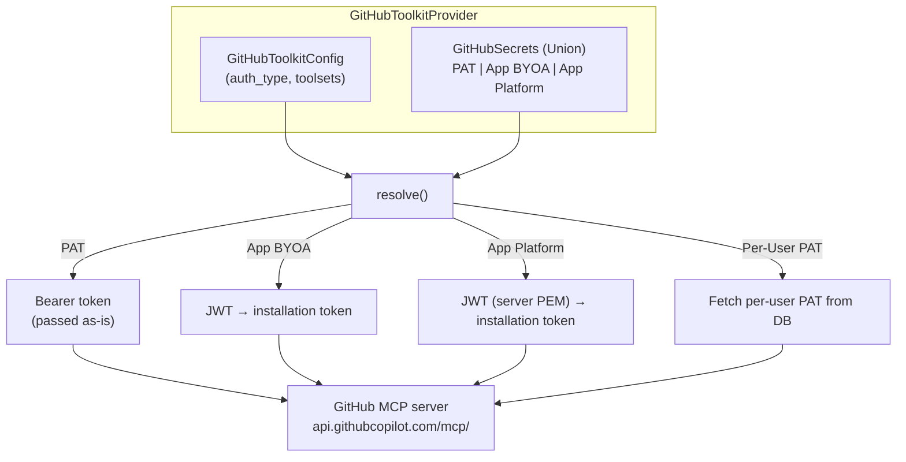
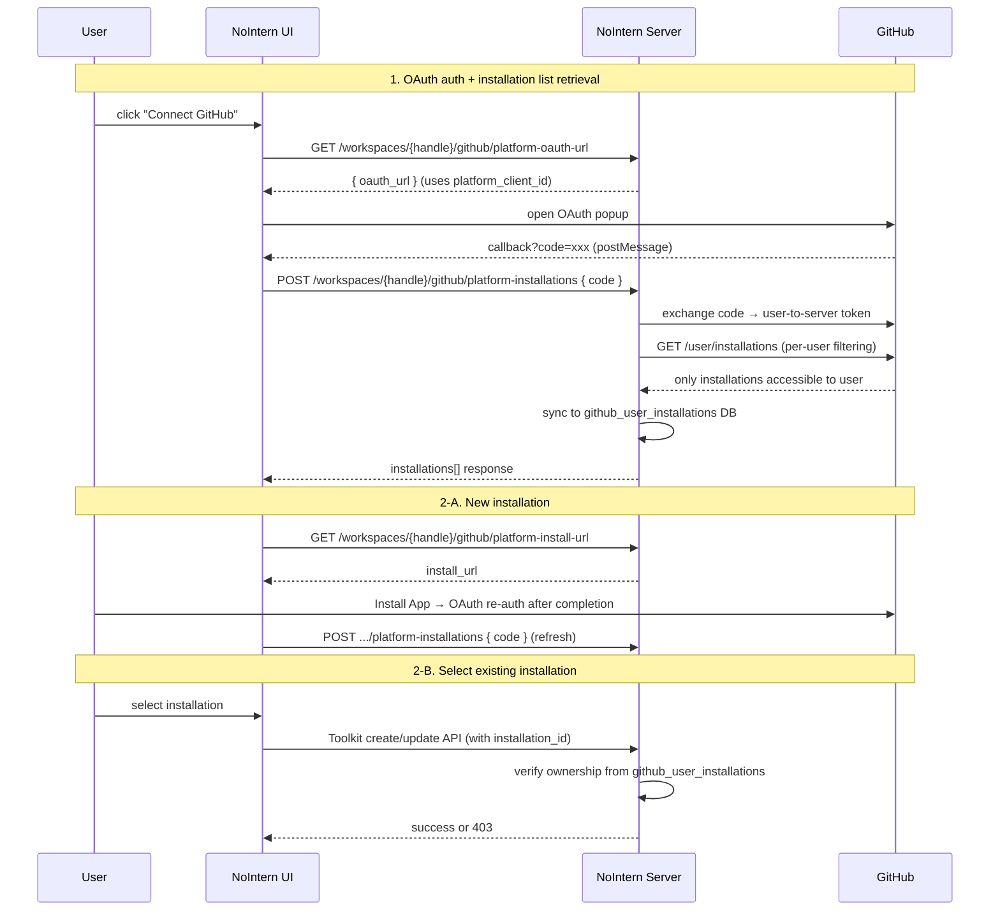
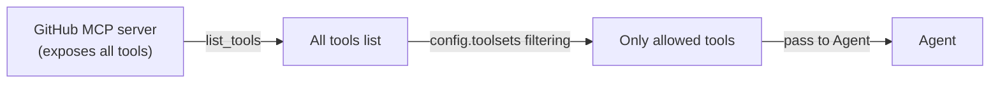
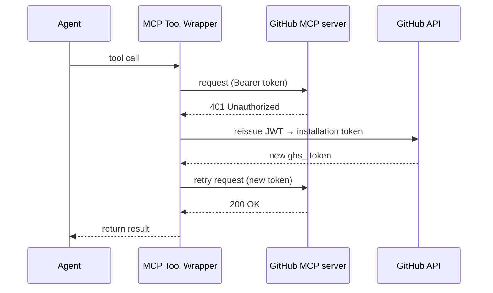

# GitHub Toolkit Design

## Overview

Service Toolkit based on GitHub MCP server. Implement as a single `github` ToolkitType supporting multiple authentication methods by extending `McpBasedToolkitProvider`.



## Details by Authentication Method

### 1. PAT (Personal Access Token)

Simplest method. When Workspace manager enters PAT, every Agent calls with that token.

- **Credential**: `GitHubSecretsPAT(type="pat", token="ghp_...")`
- **Token exchange**: none (pass directly as bearer)
- **Token lifetime**: Fine-grained PAT max 366 days, Classic PAT no expiration
- **System context**: possible
- **MCP mapping**: same as existing `bearer` auth

### 2. GitHub App — BYOA (Bring Your Own App)

User creates own GitHub App and directly enters credential. It is organization-owned, does not depend on personal account, and can control fine-grained permissions.

- **Credential**: `GitHubSecretsApp(type="github_app", app_id, private_key, installation_id)`
- **Token exchange**: create JWT (RS256, app_id + PEM, 10 min expiry) → `POST /app/installations/{id}/access_tokens` → `ghs_` token (1 hour expiry)
- **System context**: possible
- **Rate limit**: 5,000 req/hr (default), up to 12,500 req/hr (depending on repo/user count)

### 3. GitHub App — Platform (provided by NoIntern)

Install GitHub App provided by NoIntern with one click. User only provides `installation_id`, and server owns `app_id` and `private_key`.

- **Credential**: `GitHubSecretsAppPlatform(type="github_app_platform", installation_id)`
- **Server config (JWT)**: `NI_GITHUB_PLATFORM_APP_ID`, `NI_GITHUB_PLATFORM_PRIVATE_KEY`
- **Server config (OAuth)**: `NI_GITHUB_PLATFORM_CLIENT_ID`, `NI_GITHUB_PLATFORM_CLIENT_SECRET`
- **Token exchange**: same as BYOA (uses server PEM)
- **Installation collection**: GitHub App OAuth + `GET /user/installations`
- **Ownership verification**: check per-user accessible list in `github_user_installations` table
- **System context**: possible

#### Server Credential Distinction

| Purpose | Config field | Environment variable |
|------|-------------|---------|
| JWT (issue installation token) | `platform_app_id` / `platform_private_key` | `NI_GITHUB_PLATFORM_APP_ID` / `..._PRIVATE_KEY` |
| OAuth (list installations) | `platform_client_id` / `platform_client_secret` | `NI_GITHUB_PLATFORM_CLIENT_ID` / `..._CLIENT_SECRET` |

> GitHub App has App ID + Private Key (for JWT) and Client ID + Client Secret (for OAuth) separately.

#### Installation Collection Flow

Use built-in OAuth flow of GitHub App to retrieve only installations accessible to the user.



#### Installation Ownership Verification

When registering/updating Toolkit, if `credentials.type == "github_app_platform"`:

1. Query `(user_id, installation_id)` from `github_user_installations` table.
2. If no record exists, return 403 Forbidden.
3. This table is automatically synced whenever installation list is queried with OAuth.

```
github_user_installations
├── id                  String(32) PK
├── user_id             String(32) FK → users.id CASCADE
├── installation_id     BigInteger
├── account_login       String(255)
├── account_type        String(50) (User/Organization)
├── account_avatar_url  Text
├── created_at          TimeZoneDateTime
├── updated_at          TimeZoneDateTime
└── UQ(user_id, installation_id), IX(user_id)
```

### 4. Per-User PAT (Per-user Auth)

Use when per-user permission isolation is needed. Each user registers their own GitHub PAT and uses GitHub tools within their own permission scope.

> See [pat-260321-pat.md](pat-260321-pat.md) for detailed design.

- **Credential**: none (workspace-level credential unnecessary)
- **Per-user token**: `github_pats` table (workspace_id + user_id)
- **System context**: **not possible** (per-user token requires user_id)
- **Setup flow**: `setup_github` tool → register PAT on web settings page

## Data Model

### GitHubToolkitConfig

Non-secret settings stored in `ToolkitConfig.config` (JSONB):

```python
class GitHubToolkitConfig(BaseModel):
    auth_type: Literal["pat", "github_app", "github_app_platform", "per_user_pat"]
    toolsets: list[str] = Field(
        default=["repos", "issues", "pull_requests"],
        description="Enabled GitHub MCP tool groups",
    )
```

### GitHubSecrets (Discriminated Union)

Secret stored in `ToolkitConfig.encrypted_credentials`:

```python
class GitHubSecretsPAT(BaseModel):
    type: Literal["pat"] = "pat"
    token: str

class GitHubSecretsApp(BaseModel):
    type: Literal["github_app"] = "github_app"
    app_id: str
    private_key: str  # PEM format
    installation_id: str

class GitHubSecretsAppPlatform(BaseModel):
    type: Literal["github_app_platform"] = "github_app_platform"
    installation_id: str
    # app_id, private_key are loaded from server environment variables

GitHubSecrets = Annotated[
    GitHubSecretsPAT | GitHubSecretsApp | GitHubSecretsAppPlatform,
    Field(discriminator="type"),
]
```

### Comparison by Authentication Method

| | PAT | App BYOA | App Platform | Per-User PAT |
|---|:---:|:---:|:---:|:---:|
| Setup difficulty | low | high | lowest (one-click) | low |
| Personal dependency | yes | no | no | per-user |
| System context | O | O | O | X |
| Per-user isolation | X | X | X | O |
| Fine-grained permissions | O (fine-grained PAT) | O | limited (fixed) | O |
| Token exchange | none | JWT → installation token | same | none |
| Token lifetime | manual/366 days | 1 hour (auto reissue) | 1 hour (auto reissue) | manual/366 days |

## MCP Server Connection

### Hosting Method

Use official GitHub remote MCP server:

- **URL**: `https://api.githubcopilot.com/mcp/`
- **Auth**: `Authorization: Bearer <token>` header
- **Protocol**: Streamable HTTP

Remote server does not support toolset filtering parameter and exposes all tools. Filter out tools not included in `config.toolsets` at Toolkit level.

### Toolsets Filtering



Available toolsets:

| Toolset | Description | Enabled by default |
|---------|------|:---:|
| `repos` | repository files, branches, commits | O |
| `issues` | issue CRUD, comments, labels | O |
| `pull_requests` | PR CRUD, reviews, merge | O |
| `users` | user info | O |
| `actions` | GitHub Actions workflows | |
| `code_security` | code scanning | |
| `notifications` | notifications | |
| `orgs` | organization management | |
| `projects` | GitHub Projects | |
| `discussions` | Discussions | |

## Token Exchange and 401 Retry

Installation token for GitHub App auth expires in 1 hour, and `resolve_agent_tools()` is called once at run start, so token can expire during long conversation.

### Handling Strategy: 401 retry in MCP tool wrapping



- Implement common retry logic in tool wrapping layer of `McpBasedToolkitProvider`.
- On 401 response, call `resolve_credentials()` again → issue new token → retry once.
- Can also be reused commonly for token expiration scenarios other than GitHub App.
- Errors other than 401 are converted to `ToolError` as-is.

## Implementation Scope

Because `McpBasedToolkitProvider` base handles MCP connection/tool wrapping/auth header build, GitHub-specific implementation is responsible only for the following:

### GitHubToolkitProvider

```python
class GitHubToolkitProvider(McpBasedToolkitProvider[GitHubToolkitConfig]):
    slug = "github"
    name = "GitHub"
    config_model = GitHubToolkitConfig

    def resolve_mcp_params(self, config, secrets) -> ResolvedMcpParams:
        """config + secrets → MCP server URL + bearer token."""
        # token exchange by auth_type
        # PAT: as-is
        # GitHub App: JWT → installation token
        # Platform: server PEM JWT → installation token
        # Per-User PAT: fetch per-user PAT from DB
        ...

    def filter_tools(self, tools, config) -> list[Tool]:
        """Filter out tools not in config.toolsets."""
        ...
```

### Required New Implementation

| Component | Description | Reference pattern |
|-----------|------|-----------|
| `GitHubToolkitConfig` | Pydantic config model | `McpToolkitConfig` |
| `GitHubSecrets` (union) | Credential model | `McpSecrets` |
| `GitHubToolkitProvider` | MCP-based Provider | `McpToolkitProvider` |
| JWT generation utility | app_id + PEM → JWT (RS256) | new |
| Installation token exchange | JWT → `POST /app/installations/{id}/access_tokens` | new |
| Setup URL callback API | handle Platform App installation completion | Slack OAuth callback |
| 401 retry wrapper | token reissue logic in MCP tool wrapping | new (`McpBasedToolkitProvider` common) |
| Add ToolkitType enum | `GITHUB = "github"` | existing pattern |
| Registry registration | add to `get_toolkit_registry()` | existing pattern |

### Reused Existing Infrastructure

| Component | Purpose |
|-----------|------|
| `McpBasedToolkitProvider` | MCP connection, tool list, wrapping, auth header |
| `github_pats` | Per-User PAT storage (workspace_id + user_id) |
| `ToolkitConfig` (RDB) | stores config + encrypted_credentials |

## Prerequisites

This design can be implemented after `McpBasedToolkitProvider` extraction (service-toolkit-base.md Phase 2) is complete.

| Dependency | Document | Status |
|--------|------|------|
| ToolkitProvider ABC + resolve() | service-toolkit-base.md Phase 1 | not implemented |
| McpBasedToolkitProvider extraction | service-toolkit-base.md Phase 2 | not implemented |
| Move credential logic to Provider | service-toolkit-base.md Phase 3 | not implemented |
| 401 retry wrapper | this document | new |
