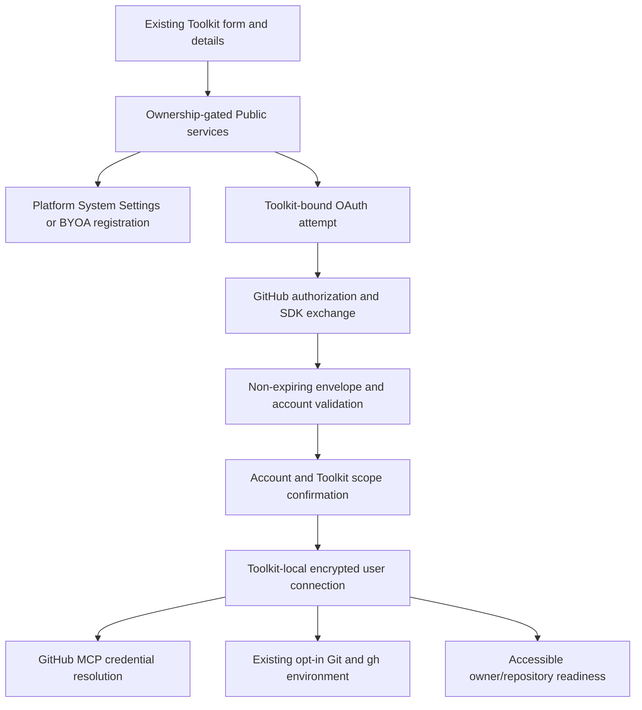

# GitHub User Account Toolkit Implementation Design

- Reference: `github-261008/DESIGN`
- Baseline: main `279db5f1fb52c634570d3d5eff6a669d2becdfd3`.
- Authority: [Requirements](../requirements/github-261008-user-account-toolkit.md) and [ADR](../adr/github-261008-user-account-toolkit.md).
- Mode: Collaborative. Revision 4 incorporates the requester's fail-open cleanup correction into the ongoing authorized implementation; deployment and live provider actions require separate authorization.

## Outcome and Scope

Add non-expiring GitHub App user-account authorization to the existing GitHub Toolkit for both Platform and BYOA sources. The connected account delegates its authority to the Toolkit; allowed participants use that credential through the existing Agent. A single connection accesses personal and multiple organization repositories permitted to both the account and the selected App.

Keep PAT, BYOA installation, and Platform installation behavior intact. Each Toolkit owns its own user credential; share one Workspace Toolkit among Agents for reuse. There is no provider-account credential hub, refresh-token store, refresh lease, automatic renewal, offboarding cutoff, or user-token fallback to an installation token.

## Current Behavior and Gaps

- `core/tools.py` has three GitHub authentication literals and `core/github_credentials.py` stores PAT or installation credentials. `engine/tools/github.py` resolves these to GitHub MCP and optional Runtime credentials.
- Platform setup in `services/toolkit_oauth/service.py` exchanges a temporary token, discovers accessible installations, syncs the access list, and revokes that temporary token. Preserve this path for existing installation mode.
- The generic MCP OAuth persistence aggregate contains issuer/discovery/client/refresh semantics that are not the authority for GitHub user connections. Reuse encryption and completed-operation conventions, not that aggregate's provider contract.
- Current user-installation discovery reads at most its initial page and has no repository readiness or durable GitHub execution-account summary. New user-mode discovery must traverse all pages without changing old installation-mode compatibility in this snapshot.
- Latest UI is compact connection cards plus catalog/detail/create/edit modal state in `ManagedAgentToolkitSection.tsx`; mutation success is immediate and independent of parent Agent save. GitHub currently uses the provider form for authorization rather than generic MCP direct-authorize handling.

## Design Authority

- Design revision: `4`

| ID | Material mechanism | Authority | Classification |
| --- | --- | --- | --- |
| M1 | Distinct Platform-user and BYOA-user authentication branches retaining existing modes | REQ-1, REQ-13; current toolkit Spec | required |
| M2 | Toolkit-local encrypted non-expiring access credential, verified account and App identity, no refresh aggregate | ADR-D1, ADR-D2; REQ-2, REQ-8, REQ-10 | decided |
| M3 | Target-bound OAuth attempt and staged token activation with one-use completion and current authority revalidation | REQ-7, REQ-9; current ownership and completed-transaction conventions | derived |
| M4 | Validate non-expiring token responses and selected App registration; no forced-expiry scope | ADR-D2; REQ-5, REQ-8, REQ-13 | decided |
| M5 | User-token installation/repository discovery across owners with target-local partial readiness | REQ-3, REQ-4, REQ-6 | required |
| M6 | Current user-connection lookup for MCP and opt-in Runtime credential exposure, preserving accurate in-flight limits | REQ-8, REQ-9, REQ-10; existing Runtime injection contract; ADR-D2 | derived |
| M7 | Redacted Public Platform availability under current Toolkit authority, hiding only Platform method choices | REQ-12; System Settings Spec and Public/Admin boundary | required |
| M8 | Existing catalog/details/immediate-save UI integration, identity and readiness summaries, replacement/disconnect confirmation | REQ-2, REQ-5, REQ-6, REQ-9, REQ-11; Requirements UI baseline | derived |
| M9 | Additive persistence/client migration with unchanged existing credentials and temporary-token flow | REQ-1, REQ-7, REQ-13; ADR-D1 | derived |
| M10 | Provider-error classification and conditional failure publication | REQ-4, REQ-7, REQ-8, REQ-9, REQ-10; Requirements provider-failure constraint | derived |
| M12 | Bounded single-token revocation attempt with fail-open local completion and sanitized failure logging | ADR-D4; revised REQ-9; retained REQ-7/REQ-10 and completed-transaction boundaries | decided |

Connection IDs, field names, equivalent storage shapes, route suffixes and UI composition are implementation details below, not additional authority. No token version/epoch scheme or new operational mode is introduced. Any mechanism outside this exact authority set returns to technical design.

Revision 4 retires M11 and its persistent cleanup/retry lifecycle. M12 replaces it under ADR-D4. M1-M10 retain their approved authority; fail-open applies only to cleanup failure, not setup or execution authorization.

## Architecture and Sources of Truth

GitHub remains the permission authority. PostgreSQL holds local connection publication and OAuth-attempt state. System Settings owns Platform registration; BYOA registration is the Toolkit's encrypted credential configuration. Current Toolkit ownership and Agent attachments own sharing. The verified GitHub account ID is identity; account login is a display label and can change without creating another user. Repository lists are observations, not a second security allowlist.

Routes call services. Repositories own short completed database transactions and current authority checks. GitHub exchange, identity/discovery, validation and token-specific cleanup execute outside those transactions. Redis is unnecessary.

## Configuration and Persistence

### Explicit Authentication Branches

Extend the GitHub auth discriminator with `github_app_platform_user` and `github_app_user`. Preserve `pat`, `github_app` and `github_app_platform` unchanged. Persist the user credential in a new connection aggregate, not in response-visible configuration or a serialized provider token in Toolkit config.

Platform-user credential configuration binds to the server-selected numeric App ID; it does not accept a client-selected Platform identity. BYOA-user registration includes the provided App's ID/private key for the existing App identity/slug validation plus its OAuth Client ID and write-only Client Secret. Retaining BYOA installation mode does not require those new OAuth fields. The source is fixed during an OAuth attempt; never combine one App's OAuth client with another App's validated identity.

Platform OAuth Client ID/Secret are resolved from System Settings at operation boundaries, not copied into each saved Toolkit. Existing same-App rotation versus App-ID replacement rules remain. BYOA edits that change the App identity or OAuth registration are connection replacement/setup changes, not silent token reassignment.

### Toolkit-Local User Connection

Add `github_user_oauth_connections`, UNIQUE by `toolkit_id`, with:

- distinct connection ID, Toolkit FK and selected App ID;
- immutable verified GitHub account ID and current login/avatar metadata;
- encrypted access token;
- enum status (`connected` or `reconnect_required`) and sanitized failure reason;
- creation/update timestamps.

Do not add access-token expiry/refresh columns or refresh-operation tables for this scope. Access-token plaintext is transient inside service/engine consumers; encryption uses the existing `CredentialCipher`.

Replace a connection by publishing a new connection ID atomically for the same Toolkit. Current operations may compare that identity and captured encrypted-credential/configuration facts; no monotonically versioned credential mechanism is needed. The prior connection ID is not accepted as a current credential after replacement. Contributor identity, if recorded for audit, is not a new use-permission or offboarding authority.

### Bound Setup Attempt and Pending Activation

Add Toolkit-owned attempts with a distinct ID and stored enum state (`pending`, `exchanging`, `review`). Confirmed, cancelled or failed setup removes its local attempt rather than retaining terminal cleanup records. An attempt binds the exact initiating user/auth Session, Workspace, optional owning Agent, Toolkit, selected App/configuration snapshot, fixed callback/return target, nonce, encrypted PKCE verifier and expiration. Capture the current active connection ID (or its absence) at initiation.

After exchange, store a validated non-expiring token encrypted in the attempt with verified account metadata until confirmation. Do not expose that candidate token to runtime. Limit to one current candidate per Toolkit; a newer attempt invalidates the prior candidate without replacing a working active connection. No provider authorization code is persisted.

Expiration follows the existing bounded OAuth setup policy. Expired attempts are not confirmable or credential sources. New setup, cancel, disconnect and deletion remove stale local candidate state in completed writes and attempt cleanup of known issued tokens under M12 outside transactions. No retired-token table, cleanup status, receipt tombstone for cleanup guarantees, retry service or completion actor is introduced. A late received result cannot activate a removed or superseded attempt; attempt its exact-token cleanup using the captured App binding rather than requiring the old parent row to survive.

The token itself is non-expiring; the local unconfirmed setup attempt is short-lived. These are different lifetimes.

## Public Interface Contracts

Preserve existing installation-mode routes and their payloads. Add ownership-symmetric user-mode operations for saved Toolkits under both Workspace and Agent-nested contexts:

- `POST .../toolkit-configs/{id}/github-user/connect`: create one bound attempt and return the authorization URL and redacted setup identifier.
- `POST .../toolkit-configs/{id}/github-user/exchange`: claim the exact attempt and exchange the callback code; return verified account/candidate summary only.
- `POST .../toolkit-configs/{id}/github-user/confirm`: confirm account and Toolkit use scope and activate the current candidate atomically.
- `DELETE .../toolkit-configs/{id}/github-user/attempt`: cancel the initiating candidate without clearing a working active credential.
- `DELETE .../toolkit-configs/{id}/github-user/connection`: disconnect the saved user credential.
- `GET .../toolkit-configs/{id}/github-user/access`: fetch bounded paginated account/owner/repository readiness observations with actionable sanitized reasons.

These suffixes may be renamed equivalently during implementation; methods' ownership, publication and lifecycle contracts may not change without authority. Accept no client-supplied token, GitHub-account identity proof, foreign credential reference or arbitrary redirect URI.

Add an ownership-gated redacted GitHub setup-availability projection for the form, usable in Workspace and Agent contexts. It resolves the effective Platform App configuration locally and returns configured/incomplete/absent information needed for method choices. It must not call the Admin API, expose credentials or infer provider health from a remote check on each render. Hide Platform choices only when absent; incomplete setup remains diagnosable rather than misrepresented as healthy. Ordinary transient network errors are not absence.

Extend Toolkit list/detail/Agent management with an optional redacted `github_user_connection` summary (account ID/login/avatar, selected source/App identity, status/reason). Preserve generic MCP `oauth_connection`; do not invent a granted OAuth scope from GitHub toolsets. Existing API fields retain meaning.

Regenerate Python/TypeScript Public clients from OpenAPI after implementation changes; do not edit generated files manually.

## OAuth and Publication Lifecycle

1. Save a new Toolkit's selected user-auth registration in the existing immediate-save flow. The item can be persisted before external authorization and is shown as requiring authorization, not ready. Existing modes' new/save flow is unchanged.
2. An authorized manager starts setup from the form or a saved connection's action. Server derives the Toolkit context and fixed callback target and reserves an expiring attempt. The browser reserves the popup before waiting for the URL and offers recovery if blocked.
3. Build GitHub authorization URL from the selected App's Client ID with state and S256 PKCE. Do not request `offline_access`. Installation is a separate GitHub account/organization setup action; return to the same saved Toolkit and do not confuse the installer with the OAuth account.
4. Callback dispatch retains the original authorized context. Server verifies current user/auth Session, attempt, source/App/configuration and management authority, then atomically changes `pending` to `exchanging`. Replay cannot claim the attempt twice.
5. Exchange code using public GitHubKit transport. Validate a typed OAuth envelope: nonempty access token, bearer type, and absence of `expires_in`, `refresh_token`, and `refresh_token_expires_in`. A declared field is incompatible even if zero or null; do not silently discard lifetime metadata and accept the access token. Provider `error` envelopes are failures even under HTTP 200. Do not stringify secret-bearing validation inputs.
6. Reject expiring responses with an App-configuration hint: opt out of user-to-server token expiration and reconnect. Preserve the working active connection. Attempt cleanup of the issued unaccepted access token under M12; grant-wide revocation and App uninstall are prohibited as local cleanup.
7. Verify the account through authenticated GitHub identity. Verify selected App identity using the validated registration and installation/App metadata as available. Store a review candidate only after the authority and captured registration are revalidated in a completed DB operation.
8. Show the verified account and Toolkit sharing scope in the originating UI. A different account is an explicit replacement; failed/new setup does not modify the current active credential.
9. Confirm atomically only if the attempt is current, in `review`, unexpired, the active connection is still the captured one, registration still matches and current management authority is valid. Publish a new encrypted connection ID and transfer the candidate out of setup state. Return the captured superseded token for M12 cleanup; do not revoke the newly activated token when clearing the successful attempt. Otherwise report stale setup, remove its local candidate state and attempt exact-token cleanup when known.
10. Callback success notification to its opener contains only a fixed event and success/candidate identifier, never tokens/codes/state. Validate same origin and exact popup source. Invalidate the current ownership-specific queries. Parent Agent settings need no extra save.

A GitHub response timeout during initial code exchange is not automatically repeated with the same one-use code. Starting a fresh authorization attempt is safe; the active connection remains unchanged. Expected provider cleanup failures are logged without masking the primary setup failure or blocking local completion. Cancellation propagates immediately; no dedicated cleanup-completion task owner is added. A token never received from the provider cannot be claimed revoked by Azents.

## SDK Feasibility

Retain GitHubKit 0.16.1. The high-level Web strategy does not accept PKCE verifier in the inspected version, so new user mode uses its public `GitHub.arequest` API for the fixed GitHub OAuth endpoint with a typed response decoder. This is supported SDK transport, not direct hand-written httpx transport or a private SDK method. Generated public SDK REST operations are used for identity, installation/repository lists and token-specific revocation.

Use the current five-second timeout, disabled automatic retry and response cache, no-follow-redirects, explicit JSON Accept, and fixed GitHub.com endpoint authority. A fixture-injected client factory may route deterministic tests; do not expose arbitrary provider URLs as product configuration. GitHub Enterprise host support is not added by this snapshot.

A runtime-only MockTransport probe using installed `githubkit==0.16.1` verified public `arequest` forwards `code_verifier` and exact redirect URI to `/login/oauth/access_token`, preserves the non-expiring JSON envelope and sends one request with retry/cache disabled. It did not contact GitHub or validate real registration/token issuance. The implementation must add this boundary as a normal automated test.

## Personal and Multi-Organization Discovery

New user mode calls authenticated user-installation listing and repository listing per installation with pagination. Preserve stable installation/account identifiers and owner-qualified repo names. Traverse each installation independently; page one is not the full access list. Surface pagination cursors rather than silently returning a truncated complete inventory.

The selected App/user intersection determines access. Check installation App identity; never show an installation from another App as proof of readiness. Group results by personal/organization owner. A repo absent or denied is not fabricated or classified as App-missing solely from a 404. Provide GitHub installation/configuration/request link and recheck path for unknown targets. Do not claim that opening the link submits a request or that an unavailable provider proves approval-wait state.

Read/write labels derive from returned permission facts and selected App permissions, not enabled toolsets. Label unknown facts as unknown. Branch protection and repository action constraints still apply. One org's SSO/permission/discovery failure does not clear the account connection or suppress known available owners; definitive account-wide authentication failure is a separate status.

Do not persist a repository permission ledger as a new authority. Readiness responses are observations; executable permissions remain GitHub's current decision. No new Toolkit-specific repo security allowlist is promised. App installation changes can affect other Toolkits using that App installation; local Toolkit disconnect is not App uninstall.

## Runtime Execution and Errors

### GitHub MCP

Add a separate user-mode resolver in `engine/tools/github.py` loading the current connected row under the saved Toolkit/Agent context. Verify selected App binding and enabled/current Toolkit association before exposing a credential. Reuse MCP snapshot/toolset/provider preparation contracts, but do not issue an installation token or reuse the installation-token TTL provider in this branch.

One user token covers its accessible personal/multi-org targets. Use the ordinary user-authenticated GitHub MCP binding; repository owner/name in tool arguments selects the target. Existing App mode keeps owner-prefixed installation bindings and `switch_installation` semantics. User mode does not invent separate tokens per org or require selecting one default organization to access the others.

User-mode handlers resolve a current connection before new provider execution rather than keep a 55-minute user credential cache. The existing `wrap_mcp_tool` in `mcp_base.py` accepts a per-call `headers_provider`, evaluated immediately before `mcp_call_tool`; wire the user binding and snapshot-backed handler through that dynamic header path. Reconnection/disconnection supersedes prior connection ID; a stale in-memory MCP secret must not authorize a subsequent operation after current lookup reports another/no connection. Retain static generic/installation behavior and do not add a central proxy or invoke the installation reissue-on-401 path for user mode.

Classify confirmed authentication failures and conditionally mark reconnect-required only for the same still-current connection ID. A late error for an old token cannot invalidate a newer connection. Provider transport errors leave the credential intact. Repo-specific 403/404, branch-policy failure and SSO restrictions remain action/target errors unless explicit evidence proves account invalidity. Never retry a mutation merely because the response was lost; do not use another authority as fallback.

### Optional Runtime Git/gh

Retain `inject_runtime_environment=false` by default and current raw-credential leakage disclosure. When enabled, expose current user access token as `GH_TOKEN` and `GITHUB_TOKEN` through the existing environment-resolution boundary. No refresh token is present or injected. User mode need not expose an installation-token map: the same user token can access all permitted owners. Preserve existing App-mode map and credential helper behavior unchanged.

Resolve the saved connection when preparing each supported new Runtime command environment; the credential should not be frozen through the installation-token cache. In the inspected baseline, Builtin `exec_command` calls `_collect_secret_env(peer_toolkits, agent_id)` immediately before `runner_operations.start_process(..., env=secret_env)`, and that collector invokes each Toolkit's `expose_env()`. The existing git helper falls back to GH_TOKEN/GITHUB_TOKEN when there is no installation map, so a user token needs no new routing service. Preserve current later-Toolkit-wins environment merging (with its warning); this feature does not create a new multi-credential priority policy. Current context invalidity returns an authorization error rather than cached credentials. A command already running with a token, a terminal environment created earlier, or a copied token cannot be recalled instantaneously by local disconnect. Document the boundary as prevention of subsequent server-authorized Toolkit resolutions; do not claim cancellation of an already-started Git push or removal of copied secrets.

No broad Runtime protocol, credential relay, daemon, webhook listener or permission engine is added. If implementation evidence shows that an existing command path cannot refresh its environment at its current dispatch boundary, do not silently add a new mode: report the exact gap for Design adjustment. The opt-in feature remains a disclosure-based credential handoff, not hard isolation.

## Latest UI Integration

Use `ManagedAgentToolkitSection` catalog/new/workspace flow and `ToolkitFormPage` registration controls. Compact cards retain name/type, existing ownership badge/readiness, Details and applicable authorization action. Put account/source and multi-owner preparation information in `ToolkitConnectionDetails`/allowlisted detail projection instead of a large org list on every card.

Within GitHub settings present App source and execution authority distinctly. Five logical authentication choices remain possible: PAT, BYOA installation, Platform installation, BYOA user, Platform user. Exact label grouping is local composition; absent Platform removes its two choices, not GitHub provider or BYOA choices. Do not change the existing PAT default solely to advertise the feature.

Platform user instructions link to the fixed callback registration and expiration opt-out requirement for platform operators without exposing Admin data. BYOA user form collects/redacts required OAuth registration values and links to App-owner callback/expiration setup. Existing BYOA installation fields remain unchanged. A missing/incompatible setting is not a permission escalation or hidden fallback.

Extend the ownership-gated authorize/reconnect dispatch for user GitHub modes and the GitHub callback page with attempt discrimination; do not route them through generic MCP OAuth issuer discovery. Return to the same catalog/detail/edit state and refresh committed readiness through query invalidation. Existing Toolkit addition may precede OAuth, but the item is not externally connected until confirmation.

Cancellation, unknown access, partial multi-org availability, expiring-response rejection, wrong-account confirmation, stale replacement and shared disconnect all have meaningful component stories/play assertions. Keep keyboard/focus/escape and mobile scope information accessible. Add localized messages in all current locales and test key alignment. Existing Concept mock is explanatory and not the final main-UI component structure.

## Migration, Rollout and Operations

Add user-auth schema and new discriminator support; do not rewrite existing Toolkit credentials or installation rows. Generate migration with the project's Alembic workflow and advance the linear schema revision. No token-format versioning or compatibility adapter is added. Existing App-ID binding and same-App rotation rules remain.

Deploy compatible backend/schema before enabling the new form branches. Old modes remain independently usable. Feature rollback must disconnect or explicitly remove newly created user-mode resources before downgrading a server that cannot parse them; do not drop active token state as an automatic schema rollback. Forward correction is preferred once user connections exist.

Platform operators and BYOA owners must turn off user-to-server token expiration in their GitHub App registration. Azents does not toggle GitHub settings remotely. Validate actual OAuth response on every candidate activation because a configured App does not prove the current token lifetime. Changing the GitHub expiration setting is not assumed to retroactively change old tokens.

Disconnect removes the current credential from local execution authority, then attempts exact-token revocation at GitHub. Other independently connected Toolkits remain local sources of truth; grant-wide provider revocation is never a cleanup shortcut. Toolkit and Agent deletion do not wait for confirmed provider cleanup and have no cleanup-based blocker.

### Fail-Open Single-Token Cleanup — M12

1. Complete the local state change atomically and return only transient captured token/App facts needed for cleanup. Active and pending credentials remain encrypted while locally authorized; there is no persistent retired-token aggregate.
2. Attempt `DELETE /applications/{client_id}/token` through the public GitHubKit operation outside the transaction, using a short bounded timeout. Use the captured affected token, not the current replacement token. Successful candidate transfer is not cleanup of that activated token.
3. Log expected provider/registration-unavailable cleanup failure safely and continue the local operation. No token-validity probe, cleanup-success proof protocol, automatic retry, manager retry action or background fire-and-forget dispatch is added.
4. Local deletion may cascade away local connection/attempt state. Parent deletion captures known affected credentials before local removal where available, but never waits on a retained cleanup row or unresolved setup receipt. A subsequently received stale result cannot activate and uses its already-captured App facts for best-effort cleanup without depending on a deleted FK.
5. Preserve normal programming-error visibility and immediate cancellation propagation. Fail-open handling is specific to expected cleanup failures; it does not catch arbitrary local defects or permit invalid setup/execution authority.

Cancellation before token issuance needs no token deletion. Rejection, candidate supersession, confirmed replacement, disconnect and deletion attempt cleanup of known affected tokens. Failed cleanup can leave a non-expiring token usable at GitHub, including copies outside Azents; it does not restore local authority. The UI reports local disconnection/replacement/deletion, not guaranteed provider revocation.

Log operation identifiers, Toolkit/App source, safe reason and outcome through normal logger integration. Do not log code, state, PKCE verifier, tokens, client secrets, provider response bodies, or private repo content. No new Sentry SDK delivery path, secret diagnostics endpoint or operational settings are introduced.

## Removal and Replacement

| Existing surface | Authority | Replacement/remaining authority | Boundary | Absence verification |
| --- | --- | --- | --- | --- |
| GitHub config/secret discriminator and Public response serializers limited to three modes | M1/M2/M9 | Extend to five modes and redacted user summary; retain old variants | User-mode integration only | Type/exhaustive-branch and old-mode regression tests |
| GitHub form's unconditional Platform choices | M7/M8 | Availability-aware options; saved missing-Platform detail retained | Method selection, not provider catalog removal | Absent Platform + PAT/BYOA stories and E2E |
| Detail projection without GitHub execution-account/source information | M8 | Allowlisted summary fields in current details modal | GitHub details only | Projection secret-exclusion tests |
| Runtime installation-token cache as an implicit resolver for all App variants | M6 | Separate current-row user resolver; old installation cache retained | New user variants only | Tests that no user refresh/install issuance/cache path is called |
| Validation fixture limited to registration checks | M4/M5/M10 | Extend successful non-expiring OAuth, rejection, multi-page access and action/error scenarios | Deterministic test fixture | Scenario completeness and production-route E2E |
| Proposed unaccepted renewal claims and token-rotation machinery | ADR-D2 | None in this implementation | No renewal code/schema/config is introduced | No user-mode refresh grants, refresh secrets, jobs or operation tables |
| Existing temporary discovery cleanup | Existing App-mode Spec, M9 | Retained unchanged | Installation-mode OAuth only | Existing OAuth cleanup tests |
| Unmerged M11 cleanup table/status/receipt tombstone, retry routes/UI, provider-invalidity probe, parent deletion blockers and exchange completion owner | ADR-D4, M12 | Transient captured-token cleanup with bounded SDK attempt and fail-open logging | Remove obsolete new-user cleanup machinery, preserve setup authorization and old modes | Absence of cleanup persistence/retry/owner/deletion barriers; provider failure completion tests |

Update Living Specs only with implemented reachable behavior, not merely because this Design exists. Target `domain/toolkit.md`, `flow/mcp-oauth.md` where generic versus GitHub paths need clarification, `domain/system-settings.md` only for new reachable availability implications, and Runtime flow docs if supported environment-resolution behavior changes.

## Test Strategy

### E2E Primary Matrix

Use current browser/API/Worker boundaries for behavior needing independently deployed surfaces. Extend existing Toolkit E2E rather than create a separate mock-only product test.

- Platform user + personal/two orgs + another authorized Agent participant, using the connected account's authority.
- BYOA user in a deployment with Platform absent; BYOA installation/PAT selectable and Platform choices absent.
- Existing App-mode personal/multi-org tool/CLI behavior, including default-installation switch and temporary discovery cleanup.
- Expiring token response rejected with guidance and working connection preserved; non-expiring token accepted without a refresh grant.
- Wrong account, cancelled popup, callback replay, lost management authority/App change, candidate replacement and stale confirm.
- User read-only vs App write permission, target-local denial/SSO, partial readiness, and complete paginated installations/repos.
- Reconnect/disconnect during provider action; late old-token authentication failure cannot clear new connection.
- Cancellation/rejection after token issuance, replacement, disconnect and deletion attempt only the affected token's cleanup. Provider cleanup failure does not block local completion, restore execution or damage a newer connection.
- Optional Runtime injection default off; new Git/gh command receives current token, no user-token refresh or installation map required.

### Component and Repository Evidence

Storybook/play owns static state matrices, modal/cancel/focus/mobile behavior, catalog availability, redaction and localized copy. Pure projection tests ensure toolsets/config values are not claimed as grants.

Repository/service tests own candidate claim/activation, encrypted storage, exact-context authorization, no HTTP inside transactions, conditional error publication, disconnect/replace races and old-mode preservation. M12 tests cover the exact captured cleanup token, successful-candidate transfer, provider timeout/rejection fail-open completion, sanitized logs, late stale result and deletion without cleanup blocking. Use explicit barriers/events and committed facts, not arbitrary sleeps, for race tests.

SDK MockTransport tests cover PKCE/callback forwarding, OAuth HTTP-200 errors, non-expiring/expiring envelope validation, verified identity, paginated App-bound discovery and narrow revocation. No outbound provider payload is dumped into test logs.

### Fixture and Prerequisite Plan

Extend `github_validation_proxy` or the test application’s injected GitHub client factory for deterministic successful OAuth/identity/access/action responses. It currently supports registration diagnostics only. The fixture must route through real product ownership/setup/activation and Worker execution paths; do not seed a connected row and claim the browser journey passed. Synthetic App and personal/two-org fixtures provide distinct token identities, owner/repo permission cases, denied org and multi-page data. No arbitrary provider base-URL configuration is added to production UI.

Required CI uses synthetic SDK/provider traffic and must run without real GitHub credentials. Optional live validation requires an explicitly approved Platform or BYOA App with expiration disabled, correct fixed callback and a user with personal plus at least two organization targets. Snapshot prerequisite identities/settings, not tokens. Missing optional prerequisites are an explicit skip, not product success; a prepared live scenario returning an expiring token fails the scenario rather than being silently skipped. No live operation, App setting change, push or PR is authorized by this Design alone.

Evidence records SHA, source/authority, environment/fixture, assertions, sanitized logs and rendered UI where relevant. Separate E2E product evidence, component renders, SDK fixture evidence and live-provider evidence. Never use the earlier Concept mock as live authorization evidence.

## Authority and Feasibility Check

- Requirements coverage: REQ-1/13 map to M1/M2/M4/M9; REQ-2 to M2/M8; REQ-3/4/6 to M5/M10; REQ-5/7/9 to M3/M8/M10/M12; REQ-8 to M2/M4/M6/M10; REQ-10 to M2/M6/M12; REQ-11 to M8 and Test Strategy; REQ-12 to M7/M8. M1-M10 retain their authority; ADR-D4 and revised REQ-9 authorize M12. M11 is retired.
- Feasible by inspected contract: ownership, encryption, provider branching, additive response/client extension, current UI host, non-expiring GitHub OAuth semantics and public SDK transport.
- Verified Runtime integration affordances: Builtin `exec_command` collects each Toolkit's environment immediately before `start_process`, and the git credential helper supports the same-token GH_TOKEN/GITHUB_TOKEN fallback. MCP wrapper accepts dynamic per-call headers. These inspected paths support M6 without a new proxy; existing processes/terminals still retain handed-off credentials.
- Cleanup feasibility: the existing supported public single-token deletion operation and log-only cleanup precedent support a bounded fail-open attempt. No provider completion proof or persistent retry aggregate is needed. Current-row replacement safety and transient exact-token capture remain verification obligations.
- Conditional implementation verification: wire and test the dynamic current-row providers for live and snapshot-backed MCP handlers and new command dispatch; extend the fixture through complete setup/Worker boundaries; verify actual App registration, real multi-org actions and token-specific revocation separately when live access is authorized. Prove a late cleanup cannot target a newer token. A concrete noninterference failure requires correction and evidence, not a silent no-revocation fallback. These are explicit evidence obligations, not claims of completed tests.
- The SDK fixture spike removes the previous PKCE argument limitation as a transport blocker using a public API already in the configured SDK; no upgrade/private API/HTTP exception is required.
- Non-expiring mode removes one-use refresh races. Candidate code exchange and publication still need one-use/context/current-connection guards under M3; they are setup correctness, not refresh/versioning mechanisms.
- No unapproved product policy, new global identity authority, token schema version/epoch, Runtime proxy, refresh actor or fallback is present.

Implementation must stop and report if a conditional item requires a new material mode or cannot satisfy a confirmed requirement. Do not call those conditions verified simply because the architecture is documented.

Document checks passed for this revision: documentation frontmatter validation, snapshot discovery, tracked diff and separate untracked-document whitespace checks. The prior public SDK probe remains mocked transport evidence, not product or live-provider validation. Accepted decisions resolve the material decision map; the requester's implementation request records revision-bound approval below.

## Delivery Shape

Keep this Design as one approved snapshot. Suggested delivery boundaries are backend user-connection/setup contracts and migration; current UI/availability/client integration; runtime/multi-org behavior plus deterministic E2E and Living Spec verification. Do not create shipping plan authority or start implementation before a separate request. Local naming and equivalent helper placement remain agent-owned.

## Design Approval

- Mode: Collaborative.
- Decision owner: requester.
- Approved on: 2026-10-08.
- Approved Design revision: `4`.
- Approved authority IDs: `M1, M2, M3, M4, M5, M6, M7, M8, M9, M10, M12`.
- Approved scope: retained Toolkit-local non-expiring Platform/BYOA user authorization, UI/availability, staged activation/replacement/disconnect, personal/multi-org discovery, MCP and opt-in Runtime, old-mode compatibility and verification; cleanup now follows the requester's bounded fail-open correction, without retained cleanup/retry or deletion blockers.

The requester previously authorized revision 3 implementation, then explicitly requested the fail-open cleanup correction during that implementation and withdrew fire-and-forget. Revision 4 records only that requested delta, preserving the other approved mechanisms. It does not authorize PR merge, deployment, live provider actions or GitHub App registration changes.
