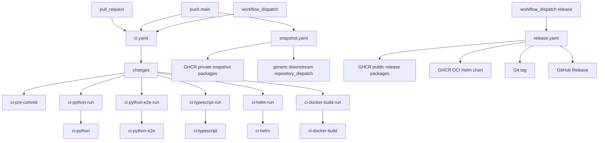

# GitHub Actions CI/CD Migration Design

## Overview

Azents needs a public-repository GitHub Actions setup that supports deterministic pull request CI, trusted snapshot publishing for internal dogfooding, and manual external releases for OSS users.

This design implements the policies from:

- [and-260623/ADR: Release and Snapshot Artifact Policy](../adr/and-260623-and-snapshot-artifact-policy.md)
- [open-260623/ADR: Open Source CI Policy](../adr/open-260623-open-source-ci-policy.md)

The migration intentionally removes private-infrastructure assumptions from the Azents repository. All workflows use GitHub-hosted runners, all third-party actions are pinned to commit SHAs, pull request CI is read-only and secret-free, and write-permission work is isolated to trusted snapshot/release workflows.

## Requirements

### REQ-1. Public PR CI is deterministic and secret-free

- Related decisions: `[open-260623/ADR-D1](../adr/open-260623-open-source-ci-policy.md)`, `[open-260623/ADR-D2](../adr/open-260623-open-source-ci-policy.md)`, `[open-260623/ADR-D3](../adr/open-260623-open-source-ci-policy.md)`, `[open-260623/ADR-D4](../adr/open-260623-open-source-ci-policy.md)`
- Acceptance criteria:
  - Pull request CI uses `ubuntu-latest` only.
  - Pull request CI has `permissions: contents: read` and `pull-requests: read` only.
  - Pull request CI does not inherit secrets.
  - Pull request CI does not use `pull_request_target`.
  - Pull request CI excludes `live_external` and `runtime_provider` tests.

### REQ-2. Required checks remain stable under path filtering

- Related decisions: `[open-260623/ADR-D6](../adr/open-260623-open-source-ci-policy.md)`, `[open-260623/ADR-D7](../adr/open-260623-open-source-ci-policy.md)`, `[open-260623/ADR-D8](../adr/open-260623-open-source-ci-policy.md)`
- Acceptance criteria:
  - The CI workflow is not trigger-filtered with workflow-level `paths`.
  - A `changes` job computes affected scopes.
  - Expensive run jobs are path-filtered by `if` conditions.
  - Required gate jobs always run with stable names.
  - Required gate jobs fail when the `changes` job fails, is cancelled, or is skipped.
  - `changes` checks out full git history for reliable PR diff calculation.
  - `ci-pre-commit` always runs.

### REQ-3. Deterministic E2E blocks merges

- Related decisions: `[open-260623/ADR-D5](../adr/open-260623-open-source-ci-policy.md)`
- Acceptance criteria:
  - `ci-python-e2e` is a required gate.
  - The E2E run command excludes `live_external` and `runtime_provider` tests.
  - When E2E-relevant paths change, E2E run failure fails the gate.

### REQ-4. Snapshot publishing is trusted and private

- Related decisions: `[and-260623/ADR-D2](../adr/and-260623-and-snapshot-artifact-policy.md)`, `[and-260623/ADR-D4](../adr/and-260623-and-snapshot-artifact-policy.md)`, `[and-260623/ADR-D5](../adr/and-260623-and-snapshot-artifact-policy.md)`, `[and-260623/ADR-D8](../adr/and-260623-and-snapshot-artifact-policy.md)`, `[open-260623/ADR-D9](../adr/open-260623-open-source-ci-policy.md)`
- Acceptance criteria:
  - Snapshot publishing has no pull request trigger.
  - Snapshot images publish to private `*-snapshot` GHCR packages.
  - Snapshot image tags include a unique tag, a SHA tag, a run tag, and `dev-main`.
  - Snapshot dispatch payload includes image metadata and digests.
  - Snapshot images include OCI labels, digest metadata, provenance, and SBOM by default.

### REQ-5. External release publishing is manual and protected

- Related decisions: `[and-260623/ADR-D3](../adr/and-260623-and-snapshot-artifact-policy.md)`, `[and-260623/ADR-D5](../adr/and-260623-and-snapshot-artifact-policy.md)`, `[and-260623/ADR-D6](../adr/and-260623-and-snapshot-artifact-policy.md)`, `[and-260623/ADR-D8](../adr/and-260623-and-snapshot-artifact-policy.md)`, `[and-260623/ADR-D9](../adr/and-260623-and-snapshot-artifact-policy.md)`, `[open-260623/ADR-D9](../adr/open-260623-open-source-ci-policy.md)`
- Acceptance criteria:
  - External release publishing uses `workflow_dispatch` only.
  - The release workflow uses a protected `release` environment.
  - Stable and prerelease version inputs are validated.
  - The workflow builds and publishes images, publishes the Helm chart, creates the Git tag, and creates the GitHub Release.
  - Stable releases update `latest`, `vX`, and `vX.Y`; prereleases do not.

### REQ-6. Chart values support digest-pinned deployment

- Related decisions: `[and-260623/ADR-D5](../adr/and-260623-and-snapshot-artifact-policy.md)`, `[and-260623/ADR-D6](../adr/and-260623-and-snapshot-artifact-policy.md)`
- Acceptance criteria:
  - Component image values can include digest fields.
  - Rendered image references use `repository:tag@digest` when a digest is provided.
  - Helm render tests cover digest-pinned image references.

### REQ-7. Workflow supply-chain hygiene is explicit

- Related decisions: `[and-260623/ADR-D8](../adr/and-260623-and-snapshot-artifact-policy.md)`, `[open-260623/ADR-D2](../adr/open-260623-open-source-ci-policy.md)`, `[open-260623/ADR-D9](../adr/open-260623-open-source-ci-policy.md)`
- Acceptance criteria:
  - All third-party actions are pinned to full commit SHAs.
  - Each workflow declares minimal permissions.
  - Publish workflows use provenance and SBOM generation where required.

## Decision Table

| ADR decision | Requirements |
| --- | --- |
| `[and-260623/ADR-D2](../adr/and-260623-and-snapshot-artifact-policy.md)` | REQ-4 |
| `[and-260623/ADR-D3](../adr/and-260623-and-snapshot-artifact-policy.md)` | REQ-5 |
| `[and-260623/ADR-D4](../adr/and-260623-and-snapshot-artifact-policy.md)` | REQ-4 |
| `[and-260623/ADR-D5](../adr/and-260623-and-snapshot-artifact-policy.md)` | REQ-4, REQ-5, REQ-6 |
| `[and-260623/ADR-D6](../adr/and-260623-and-snapshot-artifact-policy.md)` | REQ-5, REQ-6 |
| `[and-260623/ADR-D8](../adr/and-260623-and-snapshot-artifact-policy.md)` | REQ-4, REQ-5, REQ-7 |
| `[and-260623/ADR-D9](../adr/and-260623-and-snapshot-artifact-policy.md)` | REQ-5 |
| `[open-260623/ADR-D1](../adr/open-260623-open-source-ci-policy.md)` | REQ-1 |
| `[open-260623/ADR-D2](../adr/open-260623-open-source-ci-policy.md)` | REQ-1, REQ-7 |
| `[open-260623/ADR-D3](../adr/open-260623-open-source-ci-policy.md)` | REQ-1 |
| `[open-260623/ADR-D4](../adr/open-260623-open-source-ci-policy.md)` | REQ-1 |
| `[open-260623/ADR-D5](../adr/open-260623-open-source-ci-policy.md)` | REQ-3 |
| `[open-260623/ADR-D6](../adr/open-260623-open-source-ci-policy.md)` | REQ-2 |
| `[open-260623/ADR-D7](../adr/open-260623-open-source-ci-policy.md)` | REQ-2 |
| `[open-260623/ADR-D8](../adr/open-260623-open-source-ci-policy.md)` | REQ-2 |
| `[open-260623/ADR-D9](../adr/open-260623-open-source-ci-policy.md)` | REQ-4, REQ-5, REQ-7 |

## Architecture



## Workflow Design

### `ci.yaml`

Triggers:

```yaml
on:
  pull_request:
  push:
    branches: [main]
  workflow_dispatch:
```

Permissions:

```yaml
permissions:
  contents: read
  pull-requests: read
```

`pull-requests: read` is used only by the `changes` job to read pull request changed-file metadata.

Required gate jobs:

- `ci-pre-commit`
- `ci-python`
- `ci-python-e2e`
- `ci-typescript`
- `ci-helm`
- `ci-docker-build`

Path filtering uses a `changes` job and gate jobs. Workflow-level `paths` filters are not used. Pull requests use path-filtered run jobs; `push` to `main` and `workflow_dispatch` force all scopes to run so branch and manual verification exercise the full deterministic suite. Gate jobs explicitly fail when `changes` fails, is cancelled, or is skipped so an invalid diff calculation cannot be reported as successful skipped scopes. TypeScript CI generates API clients before lint/typecheck so fresh checkouts do not depend on ignored generated files.

### `snapshot.yaml`

Triggers:

```yaml
on:
  push:
    branches: [main]
  workflow_dispatch:
```

Permissions:

```yaml
permissions:
  contents: read
  packages: write
  attestations: write
  id-token: write
```

Responsibilities:

- Build snapshot images.
- Publish to private `*-snapshot` GHCR packages.
- Generate unique tag, SHA tag, run tag, and `dev-main` tag.
- Generate provenance and SBOM by default.
- Dispatch downstream metadata when downstream configuration is present.

### `release.yaml`

Triggers:

```yaml
on:
  workflow_dispatch:
```

Permissions:

```yaml
permissions:
  contents: write
  packages: write
  attestations: write
  id-token: write
```

Environment:

```yaml
environment: release
```

Responsibilities:

- Validate `version` and `channel` inputs.
- Validate `Chart.yaml` `version` and `appVersion` against the release version.
- Build and publish public images.
- Generate provenance and SBOM.
- Package and publish the Helm chart to GHCR OCI.
- Create the Git tag.
- Create the GitHub Release.

## Image Matrix

| Component | Release package | Snapshot package | Dockerfile |
| --- | --- | --- | --- |
| server | `ghcr.io/azents/azents-server` | `ghcr.io/azents/azents-server-snapshot` | `azents.Dockerfile` |
| web | `ghcr.io/azents/azents-web` | `ghcr.io/azents/azents-web-snapshot` | `azents-web.Dockerfile` |
| admin web | `ghcr.io/azents/azents-admin-web` | `ghcr.io/azents/azents-admin-web-snapshot` | `azents-admin-web.Dockerfile` |
| runtime runner | `ghcr.io/azents/azents-runtime-runner` | `ghcr.io/azents/azents-runtime-runner-snapshot` | `python/apps/azents-runtime-runner/Dockerfile` |
| runtime provider Kubernetes | `ghcr.io/azents/azents-runtime-provider-kubernetes` | `ghcr.io/azents/azents-runtime-provider-kubernetes-snapshot` | `python/apps/azents-runtime-provider-kubernetes/Dockerfile` |
| runtime provider Docker | `ghcr.io/azents/azents-runtime-provider-docker` | `ghcr.io/azents/azents-runtime-provider-docker-snapshot` | `python/apps/azents-runtime-provider-docker/Dockerfile` |

## Helm Digest Pinning

The Helm chart adds optional `digest` fields to image value objects.

When no digest is present, rendered image references remain:

```text
repository:tag
```

When a digest is present, rendered image references become:

```text
repository:tag@sha256:...
```

This supports downstream snapshot deployments that receive both tags and digests from `snapshot.yaml`.

## Test Strategy

### E2E Primary Verification Matrix

| Behavior | Primary verification |
| --- | --- |
| PR CI starts without secrets or self-hosted runners | Workflow structure review and YAML validation |
| Deterministic E2E blocks merges | `ci-python-e2e` required gate and `pytest -m "not live_external and not runtime_provider"` |
| Path filtering preserves required checks | `changes` + gate job logic review, including changes-job failure propagation |
| Snapshot metadata includes digests | Snapshot workflow payload structure review |
| Release channel tag rules are enforced | Release workflow validation and tag generation logic review |
| Helm digest pinning renders correctly | Helm render contract tests |

### CI Execution Policy

- Pull request CI runs deterministic checks only.
- `live_external` and `runtime_provider` tests are excluded because they require external credentials or runtime provider infrastructure beyond deterministic PR CI.
- Snapshot and release workflows are trusted workflows and are not part of PR CI.
- Workflow dry-run validation is performed locally with YAML parsing and targeted command checks. Full publish workflows require repository secrets and are validated after merge or manual dry-run.

### Fixture and Credential Requirements

- Required CI uses no credentials.
- Snapshot dispatch uses `DOWNSTREAM_DEPLOY_TOKEN` only in trusted workflows.
- Release publishing uses the `release` environment.
- Live/external credential snapshots are not part of this migration.

## QA Checklist

### QA-1. Pull request CI remains read-only and deterministic

#### What to check

`ci.yaml` runs on pull requests with GitHub-hosted runners, read-only permissions, no secrets, no `pull_request_target`, and no live/external tests.

#### Why it matters

This prevents untrusted pull request code from accessing secrets, write tokens, self-hosted infrastructure, or private deployment systems.

#### How to check

Inspect `.github/workflows/ci.yaml` and run YAML validation. Confirm `pull_request` trigger, read-only permissions (`contents: read`, `pull-requests: read`), `runs-on: ubuntu-latest`, and no `secrets: inherit`.

#### Expected result

The workflow is PR-safe and deterministic.

#### Execution result

TBD

#### Fixes applied

TBD

### QA-2. Required checks stay stable with path filtering

#### What to check

Each required gate job exists and has a stable name. The workflow does not use workflow-level path filters.

#### Why it matters

Branch protection must not be left waiting for checks skipped by trigger-level path filters.

#### How to check

Inspect `.github/workflows/ci.yaml` and verify the `changes` + `*-run` + gate job pattern.

#### Expected result

`ci-pre-commit`, `ci-python`, `ci-python-e2e`, `ci-typescript`, `ci-helm`, and `ci-docker-build` always exist as gate checks.

#### Execution result

TBD

#### Fixes applied

TBD

### QA-3. Snapshot workflow publishes private digest-addressable artifacts

#### What to check

`snapshot.yaml` publishes snapshot images to `*-snapshot` packages and emits digest metadata for downstream deployment.

#### Why it matters

Internal dogfooding deployments must use private short-lived images while remaining reproducible by digest.

#### How to check

Inspect `.github/workflows/snapshot.yaml`. After trusted workflow configuration exists, run a manual dry-run or main-branch snapshot and verify GHCR package names and dispatch payload.

#### Expected result

Snapshot images are private-package targets with unique tags and digests in metadata.

#### Execution result

TBD

#### Fixes applied

TBD

### QA-4. Release workflow enforces channel and version rules

#### What to check

`release.yaml` validates stable/prerelease inputs, chart version lockstep, and tag rules.

#### Why it matters

External release artifacts are the public contract for OSS users and must not be created accidentally or inconsistently.

#### How to check

Inspect `.github/workflows/release.yaml`. After release environment setup, run a prerelease dry run before the first public release.

#### Expected result

Invalid version/channel combinations fail before publishing. Valid releases publish images, chart, tag, and GitHub Release consistently.

#### Execution result

TBD

#### Fixes applied

TBD

### QA-5. Helm chart renders digest-pinned image references

#### What to check

Image helper logic renders `repository:tag@digest` when digest values are supplied.

#### Why it matters

Downstream snapshot deployment needs digest pinning for reproducibility.

#### How to check

Run Helm render contract tests under `infra/charts/azents/tests`.

#### Expected result

Digest-pinned image references appear in rendered manifests.

#### Execution result

TBD

#### Fixes applied

TBD

## Implementation Plan

1. Add the CI/CD design document and CI ADR.
2. Add Helm digest values and render helpers.
3. Add Helm render tests for digest-pinned images.
4. Add `ci.yaml` with changes + gate jobs and required check names.
5. Add `snapshot.yaml` with private snapshot image publishing and downstream dispatch.
6. Add `release.yaml` with manual protected release publishing.
7. Validate docs, YAML, pre-commit, Helm render tests, and workflow syntax.

## Considered Alternatives

### Self-hosted runners for heavy jobs

Rejected by [open-260623/ADR](../adr/open-260623-open-source-ci-policy.md). GitHub-hosted runners are sufficient for the initial deterministic target and keep the public repository safer.

### Workflow-level path filters

Rejected by [open-260623/ADR](../adr/open-260623-open-source-ci-policy.md). Required CI must avoid pending checks caused by trigger-level path filtering.

### Live E2E in public CI

Rejected by [open-260623/ADR](../adr/open-260623-open-source-ci-policy.md). Live/external tests are out of scope for the initial migration.

### Separate chart versions from app versions

Rejected by [and-260623/ADR](../adr/and-260623-and-snapshot-artifact-policy.md). Initial release policy uses chart/app lockstep versioning.
