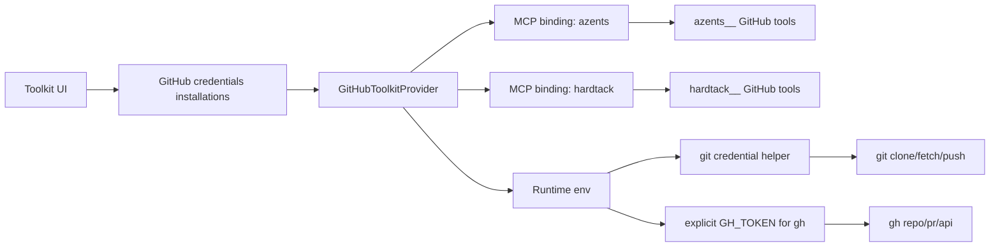

# GitHub Toolkit Multi-Installation Design

## Overview

Azents GitHub Toolkit must let one agent session work across repositories owned by multiple GitHub accounts or organizations. A single GitHub App installation token can only access one installation scope, so the toolkit needs explicit installation-aware routing for both MCP tools and runtime shell credentials.

This design implements the decisions in [ADR-0069](../adr/0069-github-toolkit-multi-installation.md).

## Requirements

### REQ-1. Store multiple GitHub App installations in one ToolkitConfig

- Related decisions: ADR-0069-D1
- Acceptance criteria:
  - `github_app` credentials store one or more installation targets.
  - `github_app_platform` credentials store one or more selected Platform App installation targets.
  - Each target includes installation ID and account login metadata.

### REQ-2. Route GitHub MCP tools by installation account

- Related decisions: ADR-0069-D2
- Acceptance criteria:
  - A multi-installation GitHub Toolkit prepares one MCP binding per installation.
  - Model-visible tool names include an installation account segment before the GitHub MCP tool name.
  - Toolkit prompt explains account to installation mapping.

### REQ-3. Route shell GitHub credentials by repository owner

- Related decisions: ADR-0069-D3
- Acceptance criteria:
  - Runtime env injection exposes installation-specific token variables.
  - Git credential helper chooses token by GitHub repository owner.
  - GitHub CLI commands use explicit command-level token selection, for example `GH_TOKEN=$GITHUB_TOKEN_INSTALLATION_<installation_id> gh ...`.
  - Single-installation credentials still expose `GH_TOKEN` and `GITHUB_TOKEN`.

### REQ-4. Provide multi-installation selection UI

- Related decisions: ADR-0069-D1
- Acceptance criteria:
  - Platform App setup allows selecting multiple accessible installations.
  - BYOA setup allows manually entering multiple installation targets.
  - Runtime environment warning reflects multi-token injection behavior.

## Decision Table

| Decision | Requirements |
| --- | --- |
| ADR-0069-D1 | REQ-1, REQ-4 |
| ADR-0069-D2 | REQ-2 |
| ADR-0069-D3 | REQ-3 |

## Current State

GitHub App credentials select exactly one installation. Provider resolution exchanges one installation token and binds one MCP Toolkit. Runtime environment injection exposes one token as `GH_TOKEN` and `GITHUB_TOKEN`, so shell commands can only authenticate against that one installation.

## Target State

The Toolkit keeps one configuration surface but resolves multiple installation runtime bindings. MCP tool names route to an installation by prefix. Runtime shell commands route to an installation by repository owner.

## Data Model

`GitHubInstallationTarget`:

- `installation_id: str`
- `account_login: str`
- `account_type: str`
- `account_avatar_url: str | None`

`GitHubSecretsApp`:

- `type = "github_app"`
- `app_id`
- `private_key`
- `installations: list[GitHubInstallationTarget]`

`GitHubSecretsAppPlatform`:

- `type = "github_app_platform"`
- `installations: list[GitHubInstallationTarget]`

No database migration is required because credentials are stored as encrypted JSON.

## Provider and Runtime Behavior

### Provider resolve

For every installation target, the provider creates a binding with:

- target metadata
- lazy MCP config
- installation token provider
- runtime env token provider

The Toolkit starts each lazy MCP binding during session toolkit lifecycle. Each binding calls GitHub App token exchange independently.

### Tool routing

During `update_context`, the Toolkit collects state from each installation binding and prefixes tools with a safe segment derived from account login. The normal outer ToolkitConfig slug prefix is still applied by the engine catalog.

Example final tool names:

- `github__azents__get_file_contents`
- `github__hardtack__create_pull_request`

### Runtime env routing

Multi-installation env injection returns:

- `GITHUB_INSTALLATION_MAP`
- `GITHUB_TOKEN_INSTALLATION_101`
- `GITHUB_TOKEN_INSTALLATION_202`

The Git credential helper reads Git's `host` and `path` fields. For `github.com` URLs, it extracts the first path segment as owner and selects the corresponding token from `GITHUB_INSTALLATION_MAP`.

GitHub CLI commands are not wrapped. The agent must explicitly select the desired installation token at command time, for example `GH_TOKEN=$GITHUB_TOKEN_INSTALLATION_101 gh pr create ...`. This keeps runtime images free of tool-specific CLI shims and works across runtime providers that do not control the image layout.

## Frontend UX

Platform App mode:

1. User opens GitHub Toolkit form.
2. User clicks Connect with GitHub.
3. OAuth returns accessible GitHub App installations.
4. User selects one or more accounts/organizations in a multi-select.
5. Credentials store the selected target metadata.

BYOA mode:

1. User enters App ID and private key.
2. User adds one or more installation rows.
3. Each row captures installation ID, account login, and account type.

## Security and Failure Modes

- Raw tokens remain encrypted at rest.
- Runtime env injection remains opt-in and warns that child processes can read tokens.
- GitHub remains the source of truth for selected-repository authorization; a routed token can still receive 403 for a repo outside that installation's selected repository list.
- If owner cannot be inferred, shell helpers fall back to single-token env names when present or return no credential.

## Test Strategy

E2E primary verification should cover a workspace manager creating a Platform App GitHub Toolkit with multiple selected installations and an agent using owner-prefixed GitHub tools. A live GitHub credential is required, so CI should run this path only when live GitHub test prerequisites are present.

Supporting tests:

- Python unit tests for runtime env generation.
- Python unit tests for multi-installation prompt/tool prefix state.
- Shell smoke tests for git credential helper owner routing.
- TypeScript typecheck/lint for the multi-select UI.

## QA Checklist

### QA-1. Platform multi-select stores multiple installations

#### What to check

Create a GitHub Platform Toolkit and select at least two installations.

#### Why it matters

This verifies the user-visible setup path for multi-organization access.

#### How to check

Run azents E2E or live testenv with Platform GitHub App OAuth prerequisites and inspect the created ToolkitConfig credentials through backend test helpers.

#### Expected result

Credentials contain two or more installation targets with correct account login metadata.

#### Execution result

TBD

#### Fixes applied

TBD

### QA-2. MCP tools are installation-prefixed

#### What to check

Attach the multi-installation GitHub Toolkit to an agent and start a session.

#### Why it matters

The model must be able to choose the correct organization without passing raw installation IDs.

#### How to check

Run an agent session with live GitHub MCP credentials and inspect tool catalog names or ask the agent to list available GitHub tools.

#### Expected result

Tool names include account segments such as `azents__` and `hardtack__`, and prompt maps each account to installation ID.

#### Execution result

TBD

#### Fixes applied

TBD

### QA-3. Shell git auth routes by owner

#### What to check

Run `git ls-remote` or `git clone` for repositories owned by two selected organizations.

#### Why it matters

Coding agents need shell-based Git workflows across organizations.

#### How to check

Run an agent Runtime live test with runtime env injection enabled and two accessible repositories.

#### Expected result

Both owner repositories authenticate successfully without manually exporting a token.

#### Execution result

TBD

#### Fixes applied

TBD
