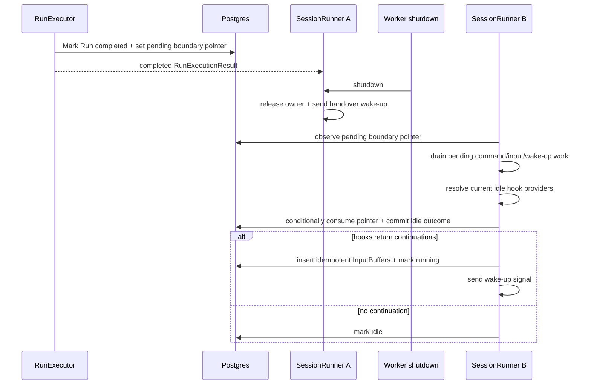

# Durable Goal Idle Continuation Design

- Snapshot: [goal-260721/REQ](../requirements/goal-260721-durable-idle-continuation.md)
- Decisions: [goal-260721/ADR](../adr/goal-260721-durable-idle-continuation.md)

## Current Gap

`SessionRunner` retains a completed terminal boundary and its resolved Toolkit bindings only in memory. A shutdown after Run terminalization but before idle processing releases the session without evaluating `on_session_idle`. Recovery can wake a stale `running` session, but it has neither the completed boundary nor the bindings needed to evaluate the hook.

## Proposed Architecture

`agent_sessions.pending_idle_continuation_run_id` is the durable, nullable pointer to the one completed Run that remains eligible to close the next true-idle boundary.

## Data Model And Ownership

- `RDBAgentSession` gains nullable `pending_idle_continuation_run_id`, referencing `agent_runs.id`.
- `AgentRunRepository` writes the pointer in the same transaction that transitions a Run to `completed`.
- Activating an actionable pending Run clears an earlier pointer, preserving the current single-boundary supersession behavior.
- `SessionLifecycleService` exposes reads needed by release/handover decisions.
- `IdleContinuationService` owns hook dispatch and the atomic final outcome because it already owns continuation InputBuffer production.

## Runtime Behavior

1. A completed Run atomically records the pending pointer.
2. The current Runner continues its existing local follow-up check. If it reaches idle before shutdown, it consumes the durable pointer immediately.
3. If shutdown occurs first, the Runner records a handover wake-up whenever the pointer remains. The session stays recoverable through `running` state.
4. A new owner processing a no-actionable wake-up reads the pointer, re-resolves current session toolkits, and invokes the idle hook with the stored `run_id`.
5. The consume transaction locks the session, verifies that the same pointer remains and that no command, wake-producing InputBuffer, or active Run exists, then commits exactly one outcome:
   - continuation InputBuffers with deterministic `idle_continuation:<run>:<provider>:<ordinal>` idempotency keys, pointer removal, and `running`; or
   - pointer removal and `idle` when no continuation is returned.
6. The broker wake-up and live-event publication happen after commit. If either fails, durable InputBuffers and `running` recovery remain authoritative.

## Failure Handling

- Hook-provider resolution, hook dispatch, or outcome-transaction failures leave the pointer unchanged and the session recoverable.
- A crash before outcome commit leaves the pointer available for the next owner.
- A crash after commit cannot duplicate the payload because the pointer is consumed and InputBuffers are idempotent.
- A non-completed terminal Run never writes a pointer. Existing Goal eligibility remains unchanged.

## Migration, Rollout, And Rollback

The migration adds a nullable foreign key with no backfill. Existing sessions have `NULL` and preserve current behavior. Rollback drops the pointer after application rollback; no durable payload is transformed or deleted.

## Traceability

| Requirement | Decision | Mechanism |
| --- | --- | --- |
| goal-260721/REQ-1 | goal-260721/ADR-D1, ADR-D3 | Atomic pointer write; handover and recovery wake-up |
| goal-260721/REQ-2 | goal-260721/ADR-D2 | Pending-work checks and conditional outcome transaction |
| goal-260721/REQ-3 | goal-260721/ADR-D2 | Conditional pointer consume and deterministic InputBuffer keys |
| goal-260721/REQ-4 | goal-260721/ADR-D1, ADR-D2 | Completed-only pointer creation and unchanged Goal hook eligibility |

## Test Strategy

### E2E primary verification matrix

| Scenario | Expected evidence |
| --- | --- |
| Active Goal run completes during Worker handover | One `goal_continuation` history event after ownership resumes |
| Pending user input follows the completed run | User input history appears before the continuation event |
| Inactive Goal after recovery | No continuation event and session becomes idle |

The current E2E substrate does not expose deterministic Worker-process shutdown at the completed-run/idle boundary. This feature therefore uses focused async Worker integration tests as the CI gating evidence, while a future testenv process-control fixture can promote the first scenario to E2E.

### Focused regression matrix

- completed terminalization writes the pointer atomically; every other terminal status does not;
- shutdown immediately after the completed result preserves the pointer and sends handover;
- recovered no-actionable wake-up consumes the pointer and enqueues one continuation;
- commands, pending InputBuffers, and queued wake-ups defer consumption;
- provider resolution/hook failure leaves the pointer;
- duplicate delivery and retry do not duplicate InputBuffers;
- no continuation consumes the pointer and reaches idle;
- broker failure after commit remains recoverable.

### Fixtures And Evidence

No external credentials or testenv seed data are required. Unit/integration doubles provide deterministic shutdown, hook, broker, and repository behavior. CI evidence is the targeted Worker/session/repository pytest suite plus type and lint checks. Any failed optional live/E2E scenario is non-gating only when the deterministic focused matrix passes; a failure in the focused matrix blocks the PR.

## Feasibility

| Requirement | Status | Evidence |
| --- | --- | --- |
| REQ-1 | feasible | Existing Run terminalization and Session recovery already use durable repository transactions and wake-ups. |
| REQ-2 | feasible | Runner already distinguishes local follow-up work and lifecycle idle transition. |
| REQ-3 | feasible | InputBuffer supports scoped idempotency keys; Session row locking provides a conditional consume fence. |
| REQ-4 | feasible | AgentRun status and Goal idle hook eligibility already encode the required terminal and Goal states. |

## Remaining Non-Blockers

- Re-resolved hooks can reflect changed toolkit configuration after handover. This is intentional because the hook is evaluated at actual idle time.
- The deterministic process-shutdown E2E fixture is deferred; focused Worker tests are sufficient for this bounded backend recovery behavior.
