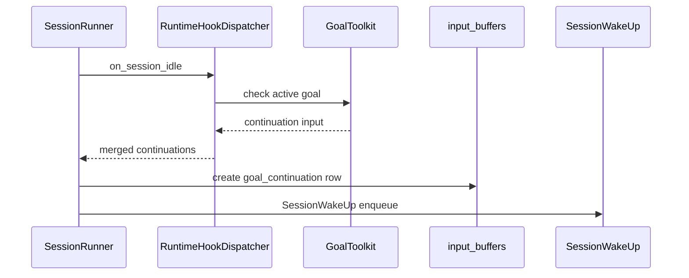

# Goal Continuation and UI Design

## Overview

Goal pursuing exposes a session-scoped Goal to model and, when a session with active Goal becomes idle, generates automatic continuation input to wake the next run. This phase implements Codex-style Goal toolset, idle continuation, and preview UI above chat input.

Related decisions follow ADR-0060 and ADR-0062. Budget/accounting is excluded to a later phase.

## Requirements

### REQ-1. Goal is session-scoped Toolkit State

Goal is AgentSession-scoped state. Model uses `get_goal`, `create_goal`, and `update_goal` tools.

Acceptance criteria:
- Goal state is stored in session toolkit state.
- `create_goal` creates active Goal only when no unfinished Goal exists.
- `update_goal` allows only transition to `complete` or `blocked`.

### REQ-2. Continue active Goal through idle continuation hook

Call `on_session_idle` hook when session reviews idle continuation after run completion.

Acceptance criteria:
- If active Goal exists, GoalToolkit returns continuation input.
- worker/runtime stores continuation input as `goal_continuation` input buffer.
- Wakes next run with `SessionWakeUp`.
- paused/blocked/complete Goal does not create continuation.

### REQ-3. Goal continuation has separate input/event taxonomy

Acceptance criteria:
- `InputBufferKind.GOAL_CONTINUATION` exists.
- `EventKind.GOAL_CONTINUATION` exists.
- LLM lower role uses existing user role.
- UI can treat `goal_continuation` event differently from user bubble.

### REQ-4. Chat live snapshot provides Goal and Todo together

Acceptance criteria:
- Goal snapshot is included in Chat session response/live snapshot.
- Todo snapshot remains as before.

### REQ-5. Input preview slot renders Goal first

Acceptance criteria:
- If Goal exists, preview text shows only Goal.
- If Todo exists at the same time, icon can show both Goal/Todo.
- If no Goal and only Todo exists, show existing Todo preview.
- Preview tap opens combined Goal + Todo sheet.

## UI Decisions

- Preview slot reuses existing Todo preview area.
- Sheet title is `Progress`.
- Goal section title is `Goal`.
- Todo section title is `Todo`.
- Section title is displayed as small card label so it remains natural even when only one section exists.
- Goal preview shows Goal status badge.
- Complete Goal is hidden from preview.
- Goal section actions provide edit, delete, pause/resume.

## Data Model

### Goal Toolkit State

| Field | Type | Notes |
| --- | --- | --- |
| `schema_version` | int | currently 1 |
| `objective` | string nullable | Goal objective |
| `status` | enum nullable | `active`, `paused`, `blocked`, `complete` |
| `created_at` | string nullable | ISO timestamp |
| `updated_at` | string nullable | ISO timestamp |

### InputBuffer kind

Add `goal_continuation`.

### Event kind

Add `goal_continuation`.

## Runtime flow

## Test Strategy

### E2E Primary Verification Matrix

| Behavior | Primary E2E path | Evidence |
| --- | --- | --- |
| Goal tool create/update | call goal tool in chat run | Goal snapshot, tool output |
| Goal continuation | idle continuation after active Goal run completion | `goal_continuation` event, subsequent run |
| Preview priority | Goal + Todo exist together | Goal preview text, icon state |
| Sheet rendering | open combined Goal/Todo sheet | Goal full text, Todo list |

### E2E Primary Verification Plan

Verify Goal tool calls and continuation event creation with deterministic runtime fixture. For UI, add Storybook state and component tests first, then align E2E with later fixture readiness.

### Seed/fixture Requirements

- user/workspace/agent/session fixture
- deterministic model/tool fixture
- Todo state fixture
- Goal state fixture

### Credential/prerequisite Snapshot Requirements

Live path requiring external LLM credential is separated as optional/live.

### Evidence Format

- executed command and working directory
- API response snapshot
- durable event kind assertion
- UI story/component snapshot

### CI Execution Policy

Unit/static checks run in required CI. Optional/live E2E skips when credentials are absent.

### Optional/live Skip/Fail Criteria

Skip if credential or external provider quota is absent. If credential exists and provider response is normal but assertion fails, mark FAIL.
