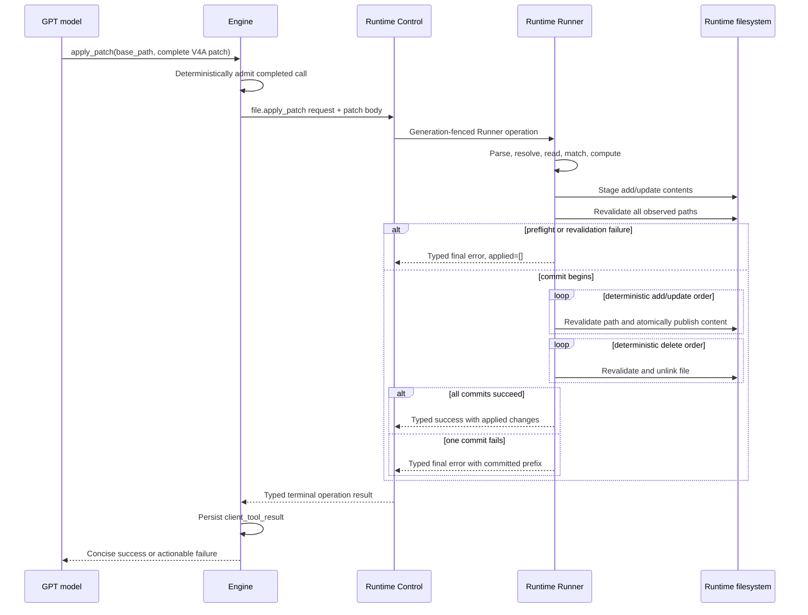

# GPT Apply-Patch Function Tool Design

## Summary

Add an Azents-executed `apply_patch` function tool for GPT-family models. The model sends
a completed V4A patch string plus an absolute Runtime base path. A dedicated Runtime
Runner operation parses, preflights, stages, revalidates, and commits the patch. Model compatibility is resolved during prepared-call catalog projection rather than carried in the shared turn context.

The existing `edit` tool remains unchanged and available to every model. Claude and
Gemini do not receive `apply_patch` in the initial release. There is no custom/freeform
tool input or streamed patch preview.

Multi-file patches are not atomic. All operations are preflighted before the first
mutation, but a commit-phase failure preserves the already committed changes and reports
the exact committed prefix when it can be observed. Azents does not attempt a non-atomic
rollback.

The architectural decisions are recorded in
[gpt-260720/ADR](../adr/gpt-260720-gpt-patch-alongside-existing-edit.md).

## Problem

The current `edit` tool replaces one exact string in one file per call. GPT models must
issue many visible tool calls for a change that spans multiple hunks or files. This adds
latency, repeated source context, and retry opportunities.

GPT and Codex harnesses have direct V4A prompting and production evidence. The same
format is not selected for Claude or Gemini because their production editing tools and
cross-model evaluations favor exact replacement or other anchored representations.

## Goals

- Expose V4A `apply_patch` only to identified GPT-family models.
- Support multiple add, update, and delete operations in one function call.
- Preserve the existing `edit` schema and behavior for all models.
- Perform complete parse, applicability, path, and resource preflight before mutation.
- Detect stale or concurrent source changes with optimistic revalidation.
- Use per-path atomic visibility primitives where the Runtime filesystem supports them.
- Preserve and report committed changes after a later commit failure.
- Keep partial input, preview state, and parser progress out of the durable transcript.
- Keep the terminal tool call/result lifecycle compatible with deterministic call
  ownership.

## Non-goals

- Exposing V4A to Claude, Gemini, or every OpenAI-developed model.
- Provider-hosted OpenAI `apply_patch`.
- OpenAI custom or freeform tools.
- Executing partial streamed patch input.
- Real-time patch preview.
- Binary patching or language-specific AST rewriting.
- Move or rename operations in the first version.
- A transactional multi-file filesystem guarantee.
- Automatic formatting, linting, testing, or Git commit creation.

## Current Behavior

- `FunctionToolSpec.name` is both the model-visible name and executor catalog key.
- `ToolCatalog.native_tools_for()` emits ordinary non-strict JSON-schema functions.
- Completed client tool calls are durably admitted before execution and matched to
  handlers by name.
- Runtime-backed file tools use `RuntimeRunnerFileStorage`, which composes one typed
  Runner operation per file read or write.
- Runtime `file.write` writes one complete path and does not provide conditional or batch
  semantics.
- Foreground client tool calls execute in parallel and normally receive deterministic
  cancelled results on User Stop.

The patch tool must preserve these lifecycle invariants while adding a commit-sensitive
Runner operation.

## Model Eligibility and Tool Preparation

### Eligibility

Prepare `apply_patch` only when the selected model snapshot is classified as a GPT-family
model developed by OpenAI. Hosting provider is not sufficient: an OpenRouter-hosted GPT
model is eligible, while a non-GPT model hosted by OpenAI-compatible infrastructure is
not.

Use the existing normalized model developer/family compatibility boundary rather than
raw provider hosting or raw model-name checks inside the tool implementation. Resolve a
code-owned `gpt_v4a_apply_patch` client-tool profile from the immutable selected-model
snapshot. Exact-model rules take precedence over family rules when a GPT release needs an
explicit compatibility override.

The profile is derived preparation policy. Do not persist profile names in the database
or transcript. The selected model snapshot and the actual tool call/result remain the
durable source of truth.

### Profile-aware catalog projection

Toolkits contribute executable candidate tools and prompt fragments with an optional
required client-tool profile. The Runtime toolkit contributes `apply_patch` and its GPT
prompt fragment with `required_profile=gpt_v4a_apply_patch`; existing tools and prompts
remain unconditional.

During each immutable prepared-call build:

1. build the candidate executable tool catalog;
2. resolve the selected model's client-tool profile set from normalized developer,
   family, and exact-model compatibility rules;
3. project tools, catalog entries, and prompt fragments through the same profile set;
4. run Tool Search indexing and declaration-budget accounting against the projected
   catalog;
5. freeze the projected model-visible schema and executor together; and
6. lower only the projected declarations to the provider request.

Do not add profiles to the general `TurnContext`. Model compatibility belongs to prepared
catalog projection rather than the shared runtime context used by every toolkit. A model
switch automatically removes or adds `apply_patch` on the next prepared call. Existing
durable `apply_patch` calls/results remain valid transcript history and are not
re-executed.

### GPT-only prompt fragment

Add a static prompt fragment together with the tool:

- use `edit` for one small exact replacement;
- use `apply_patch` for multiple hunks, multiple files, or combined operations;
- read existing files before patching them;
- send the patch only through the function argument, without Markdown fences;
- include each file only once;
- include exact context and do not invent line numbers;
- after an applicability failure, read the current source before retrying; and
- treat a commit-phase failure as potentially partially applied.

Do not change non-GPT prompts.

## Function Contract

### JSON schema

```json
{
  "type": "object",
  "properties": {
    "base_path": {
      "type": "string",
      "description": "Absolute Runtime directory used to resolve every relative patch path."
    },
    "patch": {
      "type": "string",
      "description": "One complete V4A patch from *** Begin Patch through *** End Patch."
    }
  },
  "required": ["base_path", "patch"],
  "additionalProperties": false
}
```

The model-visible tool name is `apply_patch`. It remains an ordinary function tool whose
arguments are complete JSON before deterministic admission.

### Example

```text
*** Begin Patch
*** Update File: src/service.py
@@ class UserService:
     async def get_user(self, user_id: str) -> User:
-        return await self.repository.find(user_id)
+        user = await self.repository.find(user_id)
+        if user is None:
+            raise UserNotFoundError(user_id)
+        return user
*** Add File: src/errors.py
+class UserNotFoundError(Exception):
+    pass
*** Delete File: src/legacy.py
*** End Patch
```

## Patch Grammar

The first version implements a strict V4A subset.

```text
patch           = begin operation+ end
begin           = "*** Begin Patch" LF
end             = "*** End Patch" LF?
operation       = add | update | delete
add             = "*** Add File: " relative_path LF add_line+
delete          = "*** Delete File: " relative_path LF
update          = "*** Update File: " relative_path LF hunk+
hunk            = ("@@" | "@@ " anchor) LF patch_line+ eof_assertion?
patch_line      = (" " | "+" | "-") text LF
eof_assertion   = "*** End of File" LF
```

Parser rules:

- patch markers must be exact; surrounding marker whitespace is rejected;
- patch paths must be relative, non-empty, and contain no lexical `..` component;
- one path may appear in only one operation block;
- update blocks may contain multiple hunks;
- move markers and unknown markers are rejected;
- trailing non-whitespace content after `*** End Patch` is rejected;
- a non-empty-file hunk must include at least one context or removed source line;
- a pure addition update is valid only when the current source file is empty; and
- `*** End of File` constrains placement but does not change final-newline state.

## Text and Matching Semantics

### Supported text

- UTF-8 regular files only.
- Uniform LF or CRLF source line endings.
- Update preserves the source newline convention and existing final-newline state.
- Add uses LF and a final newline.
- Invalid UTF-8, mixed newlines, binary content, directories, special files, and final
  symlinks fail preflight.

### Exact context

Matching is exact after representing LF and CRLF as logical line boundaries. It does not
trim whitespace, ignore indentation, normalize punctuation, or rewrite Unicode.

For each update file:

1. take one immutable original source snapshot;
2. resolve optional anchors exactly and uniquely in the remaining source range;
3. locate each hunk's context-plus-deletion sequence exactly and uniquely;
4. require ordered, non-overlapping matches; and
5. compute replacements against the original snapshot, then apply them in reverse offset
   order.

Approximate search may identify a likely candidate for a bounded error hint. It never
allows the patch to mutate a file.

## Path and File Safety

Canonicalize `base_path` before resolving operations. Reject the call unless it is an
existing Runtime directory.

For every patch path:

- reject absolute and lexical parent paths;
- resolve against canonical `base_path`;
- confirm the canonical result remains below `base_path`;
- inspect the lexical final path with `lstat` so a final symlink is rejected;
- validate any resolved symlinked parent still remains below the base boundary; and
- repeat path and file-kind validation during pre-commit revalidation.

Operation preconditions:

- Add destination must not exist.
- Update and delete source must be an existing regular file.
- Delete is never recursive.
- Update preserves existing mode bits where supported.
- Add may create missing parent directories below the base and uses Runtime umask.

## Runtime Protocol

Add a typed Runner operation, `file.apply_patch`.

### Request

The request payload carries:

- `base_path`
- total patch byte count
- protocol/schema version

The UTF-8 patch body uses existing Runner body chunks rather than placing a potentially
large patch string in the protobuf metadata payload.

### Success result

Return ordered applied changes:

- relative path
- action: add, update, or delete
- added line count
- removed line count
- resulting content hash for add/update

The success result is exact by construction.

### Failure detail

Extend the typed final-error payload with `FileApplyPatchFailure` rather than encoding
partial state in an error string or reporting failure as final success.

The typed detail contains:

- phase: parse, preflight, revalidate, stage, or commit
- stable reason code
- ordered applied changes
- failed operation, when known
- ordered not-attempted operations
- `exact` committed-delta flag

Runtime control clients preserve this detail on the raised patch-operation failure. The
Engine converts it to `FunctionToolError` text plus generic JSON metadata, which is
already persisted on `client_tool_result`.

## Execution Lifecycle



## Preflight, Staging, and Commit

### Preflight

Before mutation:

1. parse the full body and enforce resource limits;
2. canonicalize base and operation paths;
3. classify all lexical and resolved paths;
4. read every update/delete source snapshot;
5. capture source hashes and relevant destination metadata;
6. calculate every hunk and final update content;
7. validate all add/update/delete preconditions;
8. stage every add/update output in the destination filesystem; and
9. revalidate every observed path.

Any failure before commit guarantees no patch mutation.

### Commit ordering

Commit in two deterministic phases:

1. add and update operations in original patch order;
2. delete operations in original patch order.

This delays destructive operations until every content-producing operation has succeeded.
Immediately before each operation, revalidate the relevant snapshot or destination
absence. Stop at the first failure.

### Per-path publication

- Update publishes a fully staged same-filesystem file with atomic replacement.
- Add uses an atomic no-overwrite publication primitive. If the target filesystem cannot
  support the required primitive, fail before commit rather than silently weaken the
  no-overwrite contract.
- Delete uses a non-recursive atomic unlink after source revalidation.

Clean up uncommitted staging files after success or failure. Do not roll back committed
paths.

## Cancellation and Recovery

A patch is cancellation-safe only before commit. Once commit begins, returning a generic
cancelled result while the Runner continues mutating files would violate transcript
truth.

Add a commit-sensitive client-tool execution policy:

- before commit, Runner cancellation returns a typed cancellation with no changes;
- after commit starts, the Engine must settle the bounded Runner operation to its typed
  terminal result before finalizing the tool call;
- User Stop may delay Run terminalization until this bounded settlement completes;
- do not append a generic cancelled result for a patch operation whose commit status is
  unresolved; and
- operation identity must support reconnect/final-result reconciliation after a Control
  stream interruption.

This policy is specific to tools that can produce externally visible partial state. It
must not weaken the existing deterministic call/result identity or allow a second
execution of the same call.

## Model-Visible Results

### Success

```text
Applied patch under /workspace/agent/project: 3 files changed (+8 -4):
A src/errors.py
M src/service.py
D src/legacy.py
```

### Preflight failure

```text
Patch was not applied. update src/service.py hunk 2 is ambiguous: the expected context occurs 2 times. Read the file and retry with more exact context.
```

Metadata includes `phase=preflight`, `reason=ambiguous_context`, and empty `applied`.

### Partial commit failure

```text
Patch failed after applying 2 changes. Applied: M src/service.py, A src/errors.py. Failed: D src/legacy.py because the source changed before deletion. Remaining operations were not attempted. Re-read the affected files before continuing.
```

Metadata includes the typed applied, failed, not-attempted, and exact fields. The tool
result status is failed.

## Resource Limits

Initial code-owned limits:

- patch body: 1 MiB
- operations: 100 files
- hunks: 500 total
- relative path length: 4,096 UTF-8 bytes
- source or result per file: 8 MiB
- aggregate source plus staged result: 32 MiB
- Runtime operation deadline: 30 seconds plus existing result-fold grace

Limit checks happen during parse or preflight and therefore do not mutate files. Limits
are implementation constants with tests and telemetry; they are not persisted Agent
configuration.

## Observability and Privacy

Structured logs and metrics include:

- eligible model profile and whether the tool was exposed
- patch bytes, operation count, hunk count, and aggregate source/result bytes
- parse, preflight, stage, revalidation, and commit durations
- terminal phase and reason code
- applied and not-attempted counts
- exact committed-delta flag

Do not log patch content, source contents, replacement contents, or tool-result snippets.
Paths may follow the existing Runtime file-tool logging policy but must not be added to
high-cardinality metrics.

Metrics distinguish preflight failure, zero-change cancellation, complete success, exact
partial commit, and inexact/unknown commit state.

## Security

- Use Runtime path resolution; never execute the patch through a shell.
- Keep every path below canonical `base_path`.
- Reject final symlinks and revalidate path identity before commit.
- Reject overwrite on Add.
- Treat patch text and filenames as untrusted data.
- Bound parser work, file reads, staged bytes, and diagnostics.
- Do not include credentials, environment variables, or file contents in logs or
  metadata.

## Implementation Areas

### Engine

- Add `engine/tools/apply_patch.py` with `ApplyPatchInput` and GPT-only prompt text.
- Add model-profile-based conditional tool preparation.
- Add Runtime patch request/result types and adapter conversion.
- Convert typed Runner failures into `FunctionToolError` output and metadata.
- Add commit-sensitive settlement behavior to foreground tool cancellation.

### Runtime Control

- Extend the protobuf request oneof with `FileApplyPatchOperationPayload`.
- Extend final success with `FileApplyPatchFinalSuccess`.
- Extend final error with typed `FileApplyPatchFailure` detail.
- Preserve typed failure detail through Control clients and Engine adapters.

### Runtime Runner

- Add parser and immutable patch-plan types.
- Implement preflight, exact matching, staging, revalidation, deterministic commit, and
  staging cleanup.
- Add per-Runtime serialization for patch operations while retaining optimistic checks
  against external processes.
- Publish exact typed terminal results.

### Frontend

No patch preview UI is included. Existing generic client-tool rendering remains valid.
The model-visible text result carries the concise file summary. Future patch preview work
must use ephemeral projections and must not change the execution contract in this design.

## Rollout

1. Land protocol and Runner support while the tool remains undiscoverable.
2. Land Engine client/result support and deterministic fixture coverage.
3. Enable the tool profile for test GPT model snapshots in E2E fixtures.
4. Run live GPT evaluations for API-key and ChatGPT OAuth routes.
5. Enable the profile for reviewed GPT families.
6. Monitor parse failures, preflight failures, partial commits, retries, call count, and
   latency.

Rollback removes the model profile's `apply_patch` exposure. Existing durable calls and
results remain readable transcript history; no data migration is required.

## Spec Impact

Implementation must update:

- `docs/azents/spec/flow/agent-execution-loop.md`
  - GPT-only prepared tool exposure
  - commit-sensitive cancellation settlement
  - patch failure metadata and partial commit semantics
- `docs/azents/spec/flow/agent-runtime-control.md`
  - `file.apply_patch` request, typed terminal results, limits, and filesystem semantics

No current behavior spec is changed before implementation.

## Test Strategy

### E2E primary verification matrix

| Scenario | Model profile | Expected result |
|---|---|---|
| Tool exposure | GPT | `apply_patch` and existing `edit` are declared |
| Tool exclusion | Claude/Gemini/non-GPT | Existing tools only; no `apply_patch` |
| Multi-file success | GPT | Add, update, and delete commit; one successful tool result |
| Ambiguous context | GPT | Failed result, no filesystem mutation |
| Missing context | GPT | Failed result, no filesystem mutation |
| Path escape | GPT | Failed result, no filesystem mutation |
| Existing Add destination | GPT | Failed result, no overwrite |
| Concurrent pre-commit change | GPT | Failed result, no mutation |
| Commit-phase source change | GPT | Failed result with exact committed prefix and no rollback |
| User Stop before commit | GPT | Cancelled/failed result with no mutation |
| User Stop after commit starts | GPT | Run waits for actual typed terminal patch result |
| Model switch after patch history | GPT to non-GPT | History remains lowerable; new catalog omits `apply_patch` |

### E2E plan

Use the Azents E2E environment with a real Runtime Runner and a deterministic fake model
adapter that emits completed `apply_patch` function calls. Verify the durable
`client_tool_call`/`client_tool_result`, active tool-call cleanup, final filesystem
snapshot, and live/history result consistency.

A test-only Runner fault-injection fixture is required for deterministic commit-phase
failure after a selected operation. The fixture must be unavailable in production builds
or require an explicit test-only capability. It reports the same typed failure path as a
real filesystem error.

### Fixture and seed requirements

- Runtime workspace trees with repeated context, CRLF, empty files, missing files,
  symlinks, path-escape candidates, and multiple operations.
- Portable input/patch/expected directory scenarios for parser/executor behavior.
- A GPT-family model snapshot and non-GPT snapshots for prepared-catalog tests.
- Fault-injection scenarios for staging failure, first commit failure, later commit
  failure, and exact committed-prefix reporting.

No credential snapshot is required for deterministic E2E coverage.

### Live model verification

Run optional live evaluations against at least one OpenAI API-key GPT route and one
ChatGPT OAuth GPT route. The corpus must include small exact edits, multi-hunk edits,
multi-file refactors, repeated source blocks, and failure/retry cases.

Capture:

- raw provider tool call artifacts with secrets removed
- normalized durable transcript
- patch parse/apply status
- visible tool-call count
- output tokens and latency
- final filesystem diff

Live tests require explicitly configured credentials. Missing credentials skip the live
suite with a recorded reason. Once credentials are present, provider or assertion
failures fail that invocation; CI-required deterministic suites never skip.

### Lower-level coverage

- Parser unit tests for every grammar production and malformed boundary.
- Matching tests for exact, missing, ambiguous, ordered, overlapping, anchor, EOF, LF,
  CRLF, and final-newline cases.
- Runtime contract tests for protobuf encode/decode and typed success/failure folding.
- Runner tests for staging cleanup, path confinement, file-kind rejection, revalidation,
  deterministic commit order, and partial failure.
- Engine tests for model eligibility, declaration budgeting, error metadata, User Stop
  settlement, and model-switch lowering.

### CI policy and evidence

Required CI:

- Python and Runner unit/contract tests
- protobuf/generated-code validation
- deterministic E2E matrix
- Ruff, Pyright, and relevant TypeScript checks if shared client types change

Evidence consists of test output, durable event snapshots, typed Runtime operation
snapshots, and before/after filesystem manifests. Optional live results are attached as a
separate report and do not replace deterministic CI.

## Open Questions

No product decision remains open. Initial numeric limits and exact protobuf field numbers
may be adjusted during implementation without changing this design's semantic contract.
