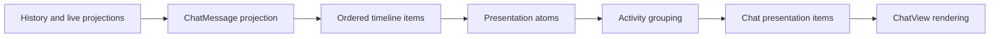
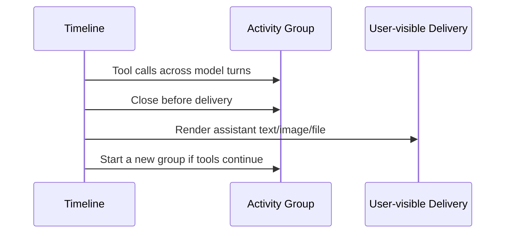

# Chat Tool Activity Grouping

## 1. Problem

Azents currently renders each client or provider tool call as an individual card in the chat timeline. The cards preserve arguments, outputs, attachments, and lifecycle status, but long-running Agent work may produce many tool calls across multiple model turns before the assistant communicates another result to the user.

The resulting timeline has three product problems:

1. tool execution visually dominates assistant communication;
2. repeated cards, badges, and diagnostic surfaces create excessive visual stimulation; and
3. model-turn boundaries split what users perceive as one continuous work period.

A tool-only continuation across model turns should read as one compact activity. Raw diagnostics must remain available, but they should appear only after explicit expansion. User-facing results such as generated images and deliverable files must remain visible and must separate the work that produced them from any work that follows.

This design implements the frontend presentation policy accepted by [group-260720/ADR](../adr/group-260720-group-chat-activity-in-the-frontend.md).

## 2. Goals

- Collapse a continuous tool-only work period into one low-stimulation `Activity` row by default.
- Group tool calls across model turns when no user-visible assistant delivery intervenes.
- Preserve chronological order, tool identity, live-to-durable replacement, status, raw arguments, raw output, and attachments.
- Provide ordered phase summaries as the first expanded level.
- Provide individual tool details as the second expanded level.
- Use specialized presentation only for explicitly registered and validated frontend-known argument and output shapes.
- Render every unknown or invalid payload through a Generic Tool Call fallback.
- Keep explicit user-facing images, files, artifacts, and assistant text outside collapsed diagnostic activity.
- Keep failure and approval state visible while the group is collapsed.
- Preserve the current backend event, API, storage, and live-state contracts.
- Provide equivalent low-stimulation behavior in light and dark themes.

## 3. Non-goals

- Changing client-tool or provider-tool backend payloads.
- Adding a persisted activity-group, phase, renderer, or presentation-summary field.
- Changing tool execution, cancellation, retry, authorization, or recovery semantics.
- Inferring tool activity that is not present in the existing timeline projection.
- Generating group titles with a model or heuristic natural-language summarizer.
- Making every tool eligible for specialized presentation.
- Removing access to raw arguments, output, or attachments.
- Redesigning the attachment preview viewer or Exchange file lifecycle.
- Treating model turns as user-visible activity boundaries.

## 4. Current Behavior

The frontend projects durable history and live state into `ChatMessage` view models. Tool calls are represented by two existing UI types:

- `ActiveToolCall` for Azents-executed client tools;
- `ProviderToolCall` for provider-hosted tools.

Both types expose a UI identity, optional semantic call ID, name, arguments, lifecycle status, output or result, and optional UI attachments. The source event contracts remain richer and continue to own canonical output parts and provider semantic content.

`ChatView` currently iterates `messages` and renders one `MessageBubble` for each visible message. `MessageBubble` switches to `AssistantToolCallMessage` when a message owns tool calls, and that component maps each call directly to `ToolCallCard` or `ProviderToolCallCard`. `ChatView` separately interleaves durable and live action-execution cards and applies turn-boundary controls after individual messages.

This message-local composition cannot group tool calls across message or model-turn boundaries. It also allows internal markers or separately placed actions to visually split otherwise continuous work.

Current conversation behavior also renders an available `image_generation` attachment directly in its owning individual tool card. The new design retains immediate result visibility but promotes validated user-facing deliverables outside the grouped diagnostic activity.

## 5. Design Principles

### Communication outranks execution diagnostics

Assistant text and explicit deliverables are the primary conversation. Tool execution is supporting detail and remains collapsed until requested.

### Group by visible communication boundaries, not model internals

A model turn, reasoning event, retry marker, or compaction operation is not itself a new user-visible work period.

### Specialized presentation is opt-in

A renderer must prove that it understands the tool and every available payload part before it may produce semantic summaries or promoted deliverables.

### Generic rendering is permanent

Generic fallback is not a temporary migration state. It is the compatibility surface for new tools, new payload versions, malformed data, and tools whose detail does not justify a specialized UI.

### Presentation does not rewrite transcript meaning

Grouping changes only visual composition. It does not merge, delete, reorder, or persist transcript events.

## 6. Terminology

| Term | Meaning |
| --- | --- |
| Presentation atom | The smallest ordered frontend display unit derived from a message, control event, action execution, or tool call. |
| Activity group | One or more adjacent tool-call atoms presented as a single collapsed row. |
| Phase | One or more adjacent calls with a compatible validated frontend presentation category and summary. |
| Explicit delivery | Assistant text, assistant-level attachment/artifact, or a validated specialized tool result promoted for direct user viewing. |
| Specialized adapter | A frontend registry entry that validates known tool arguments/output and creates deterministic presentation data. |
| Generic Tool Call | The fallback presentation that exposes raw tool data without semantic interpretation. |

## 7. Presentation Projection Architecture

Tool activity grouping must occur after timeline ordering is known and before React components render individual messages or tool cards.

The projection consumes both message-derived content and the already determined placement of durable/live action executions. This preserves chronological order and prevents authorization or action state from being reordered around the tool calls it belongs to.

### 7.1 Presentation atom kinds

The projection produces ordered atoms for at least:

- user message;
- visible assistant text;
- assistant attachment or artifact delivery;
- client tool call;
- provider tool call;
- promoted specialized tool deliverable;
- reasoning metadata;
- turn marker and usage metadata;
- Run terminal marker;
- compaction metadata;
- retry state;
- authorization or approval state;
- task/subagent transition;
- other visible control messages.

A single `ChatMessage` may produce several atoms. This is required because a message can contain both visible assistant content and tool calls. Message identity must not be treated as the grouping boundary.

### 7.2 Rendering ownership

`ChatView` renders projected chat presentation items rather than mapping raw `messages` directly. Ordinary text, user, error, and control items may continue to compose existing `MessageBubble` primitives. Tool atoms are consumed by `ToolActivityGroup` and are no longer rendered as independent top-level cards by `MessageBubble`.

## 8. Activity Grouping Rules

The grouping operation is an ordered, deterministic frontend fold over presentation atoms.

### 8.1 Start

When no group is open, a client or provider tool-call atom starts a new activity group.

The group receives a stable frontend identity derived from the first call's semantic `callId` when available and its existing UI `id` otherwise. No backend group identifier is introduced.

### 8.2 Continue

The following atoms do not close an open activity group:

- another tool call;
- model-turn or `turn_complete` markers;
- reasoning or reasoning summaries;
- compaction markers or summaries;
- retry markers;
- tool-only messages;
- permission or authorization pause/resume;
- live-to-durable replacement of the same semantic call;
- Run phase changes inside the same active Run.

Non-visible markers are retained as group metadata where needed. They are not inserted as full-width rows between calls.

### 8.3 End

The current activity group ends before:

- a user message;
- visible assistant text;
- an assistant-level attachment or artifact;
- a specialized tool deliverable explicitly promoted for user viewing;
- the first atom belonging to a new Run after the previous Run has terminated; or
- an explicit task or subagent transition.

The delivery or boundary atom is rendered after the closed group. A later tool call starts a new group.

Several adjacent delivery atoms constitute one boundary region; they do not create empty activity groups between one another.

### 8.4 Explicit delivery sequence

Approval is an interaction inside ongoing work rather than a delivered result. A pending `Review` action therefore remains attached to the current group and does not close it.

### 8.5 Live and durable identity

Existing `call_id` semantics remain authoritative. A durable call replaces its matching live projection without creating a second detail row. Retry markers do not split a group, but genuinely new call IDs remain separate calls within that group. A new Run after a terminal Run boundary always starts a new group.

## 9. Information Hierarchy

Every activity group has three levels.

### 9.1 Level 0: collapsed group summary

The default row uses the fixed localized title `Activity`. The title never derives from tool names or output and never changes while streaming.

The secondary summary is dynamic and may include:

- model-turn count;
- total tool-call count;
- running, failed, or completed counts;
- approval-required state;
- attachment or deliverable counts;
- deterministic facts produced by validated specialized adapters.

Generic calls contribute only safe structural facts such as count and status. They do not contribute inferred semantic claims.

Examples:

- `3 model turns · 12 tool calls · 1 failed`
- `8 tool calls · changed 2 files · Approval needed`
- `4 tool calls · 2 other activities`

Status priority in the collapsed row is:

1. approval required;
2. failure;
3. running;
4. completed.

The row may show more than one state when needed. `Review` remains an independent compact action and must not be hidden by collapse.

### 9.2 Level 1: ordered phase summaries

Expanding `Activity` reveals ordered phase rows. Phases preserve call order and combine only adjacent calls whose validated adapter outputs declare compatible phase identity. Non-adjacent calls are never reordered to create a larger phase.

Representative phase labels include:

- `Inspected the codebase`;
- `Ran the web test suite`;
- `Changed 2 files`;
- `Generated an image`;
- `Other tool activity`.

Phase labels are detail-level summaries, not the group title. Adjacent Generic calls may share an `Other tool activity` phase with only counts and status.

### 9.3 Level 2: individual tool details

Expanding a phase reveals its individual calls. Each call selects either a specialized detail renderer or Generic Tool Call fallback.

Long arguments and outputs use bounded scroll areas or an additional explicit expansion. Raw console output, JSON, and diff content are never exposed by default at Level 0 or Level 1.

### 9.4 Expansion state

- New groups start collapsed.
- Streaming updates never force a group or phase open.
- User expansion state remains stable while calls update or append.
- A closed historical group does not inherit expansion state from another group.
- Stable semantic group and phase keys prevent remounting during live-to-durable replacement.

## 10. Frontend Tool Presentation Registry

### 10.1 Normalized adapter input

The frontend wraps existing `ActiveToolCall` and `ProviderToolCall` values in an internal presentation input containing:

- source ownership: client or provider;
- UI ID and optional semantic call ID;
- tool name;
- lifecycle status;
- raw argument string;
- raw output/result string when present;
- projected attachments;
- whether the call is live or durable when needed for stable presentation.

This is an internal frontend view model, not a new API or persisted contract.

### 10.2 Registry selection

A registry entry is selected by explicit tool identity and source constraints. The adapter must validate:

1. the argument payload;
2. every output payload that is currently present;
3. attachment assumptions used for presentation; and
4. any status-dependent omission, such as an allowed missing output while running.

The adapter returns a specialized presentation only after full validation succeeds. Parsing a few familiar keys is insufficient.

### 10.3 Adapter result

A successful adapter may provide:

- a deterministic one-line call summary;
- phase identity and phase summary contribution;
- structured detail-view data;
- safe aggregate counters;
- validated user-facing deliverables;
- compact status or approval affordances.

Adapters do not return arbitrary backend mutations or rewrite raw call data.

### 10.4 Generic fallback conditions

Generic Tool Call is selected for:

- an unregistered tool;
- an unsupported tool version or payload variant;
- malformed arguments or output;
- argument validation failure;
- output validation failure;
- an unexpected required attachment shape;
- adapter conversion failure; or
- any state the adapter does not explicitly support.

Adapter exceptions are caught at the call boundary. One failed adapter must not fail the activity group or chat timeline.

### 10.5 Generic detail behavior

Generic detail preserves:

- readable tool name;
- current lifecycle status;
- formatted raw arguments when JSON parsing succeeds;
- original argument text otherwise;
- formatted raw output when JSON parsing succeeds;
- original output text otherwise;
- all projected attachments;
- copy, preview, and download behavior already supported by the relevant shared primitives.

Unknown attachments remain inside Generic detail. The collapsed group may display their count but does not promote them as user-visible output.

## 11. User-visible Deliverables and Attachments

This design composes with the existing Chat Attachment Presentation design.

### 11.1 Always explicit deliveries

The following are explicit user-visible deliveries and create an activity boundary:

- assistant-message attachments;
- assistant-message artifacts;
- assistant visible text;
- files or images that a validated specialized adapter marks as deliverables.

These items render in the conversation flow outside the activity group using the established Agent attachment gallery, tile strip, group, and preview viewer primitives.

### 11.2 Specialized promotion

A specialized adapter may promote a tool attachment only when its validated tool/output shape establishes that the attachment is intended for user delivery. Examples include a completed known image-generation result or a known file-export result.

Promotion has two effects:

1. the deliverable renders outside the activity group; and
2. it closes the current group before the delivery.

A promoted attachment is not rendered again as a second full attachment inside the tool detail. The detail may retain lightweight provenance or a link to the already rendered deliverable.

### 11.3 Operational and unknown attachments

Logs, diagnostic files, intermediate outputs, diffs, and attachments from Generic tools remain inside tool details. They do not close the group and do not appear as standalone conversation output.

### 11.4 Failure behavior

If a specialized adapter cannot validate whether an attachment is a deliverable, it must not promote it. Generic detail retains the attachment so data remains accessible without making an unsafe presentation claim.

## 12. Visual Design

The visual policy is deliberately low-stimulation.

- `Activity` is collapsed by default.
- Use neutral icons, body-colored surfaces, thin borders or dividers, and dimmed metadata.
- Avoid repeated colored status cards and large status badges.
- Do not expose console, JSON, or diff surfaces until Level 2.
- Completed state does not require a prominent success color.
- Running uses a small spinner or restrained text treatment.
- Failure uses a small icon and textual count.
- Approval uses one compact `Review` button.
- Color is never the only status signal.
- Light and dark themes use the same hierarchy and interaction model.

The visual-review direction validated two component states at a `1100x650` viewport with Geist, DPR 1, and no horizontal overflow:

- a single collapsed activity summary; and
- expanded ordered phase summaries.

The recommended product composition uses the single summary as Level 0 and phase summaries as Level 1.

## 13. Runtime and Lifecycle Behavior

### 13.1 Streaming

New calls append to the current open group when no boundary has occurred. The group summary updates in place without opening the group. Running calls may use specialized presentation only when their adapter explicitly supports a missing or partial output state.

### 13.2 Completion and failure

Call status updates in place. A failed call keeps the group collapsed but makes the failure count visible. The group remains inspectable after Run completion.

### 13.3 Retry

Retry markers and attempt-local cleanup do not by themselves create visual groups. Removed live calls disappear according to existing projection behavior. Calls emitted by the retry remain in the same user-visible activity when the Run has not crossed a terminal boundary or explicit delivery.

### 13.4 Compaction and turn usage

Internal turn dividers do not appear between calls in one group. Turn count and usage metadata may be retained for expanded diagnostics or rendered after the closed group, but must not fragment Level 0.

Compaction does not close the group. If compaction metadata remains user-visible, it is associated with the group or placed after the group rather than inserted between its phase rows.

### 13.5 Authorization

A permission request is attached to the relevant group. The collapsed row exposes `Approval needed` and `Review`. Approving or resuming does not create a second group unless another explicit boundary has occurred.

## 14. Proposed Frontend Boundaries

Exact names may be adjusted during implementation, but responsibility should remain separated as follows:

- `chatTimelinePresentation`: converts ordered messages, markers, and action placements to atoms and presentation items;
- `toolActivityGrouping`: performs the pure ordered grouping fold;
- `toolPresentationRegistry`: selects and isolates specialized adapters;
- `ToolActivityGroup`: owns Level 0 and Level 1 composition;
- `ToolActivityPhase`: owns one expandable ordered phase;
- specialized detail components: render validated structured detail;
- `GenericToolCallDetail`: permanent raw fallback;
- existing attachment presentation primitives: render promoted deliverables and generic detail attachments.

Expected existing integration points include:

- `ChatView.tsx` for presentation-item rendering;
- `MessageBubble.tsx` for removing message-local top-level tool-card composition;
- `ToolCallCard.tsx` and `ProviderToolCallCard.tsx` for migration or reuse inside Generic details;
- `types.ts` only for frontend-internal presentation types, without changing public payload types;
- `toolCallMerge.ts` and provider projection code for preserving existing semantic identities.

## 15. Error Handling

- Invalid payloads fall back to Generic Tool Call rather than displaying an error card.
- Adapter errors are contained per call.
- Group summary generation tolerates a mixture of specialized and generic calls.
- Missing optional output while running is accepted only by adapters that declare it.
- Missing required terminal output causes fallback.
- A deliverable rendering failure keeps the existing attachment fallback and download behavior.
- A malformed call must not prevent later calls, assistant output, or the group shell from rendering.

## 16. Security and Privacy

- Group summaries use only allowlisted adapter fields and structural counts.
- Raw output is not copied into collapsed summaries.
- Specialized adapters must not surface secrets, credentials, headers, cookies, or opaque native provider artifacts.
- Generic details preserve the same user-authorized data already available in the current tool card; grouping does not widen access.
- Promoting a deliverable does not change Exchange authorization, availability, retention, or download semantics.
- The frontend does not inspect provider-native artifacts to recover unsupported semantics.

## 17. Accessibility

- The group and phase headers are semantic buttons with `aria-expanded`.
- Enter and Space toggle the focused disclosure.
- `Review` is an independent button and does not also toggle the group.
- Focus remains stable when streaming updates modify counts or statuses.
- Status uses text in addition to icon and color.
- Screen-reader labels include group state, call count, failure count, and approval requirement when present.
- Expanded raw details are keyboard scrollable.
- Attachment preview focus behavior remains owned by the shared preview viewer.
- Reduced-motion preference disables nonessential disclosure animation.

## 18. Responsive Behavior

- The group summary remains one bounded row when space permits and wraps metadata without horizontal page overflow when necessary.
- The fixed `Activity` title remains visible on narrow screens.
- Lower-priority metadata may truncate before status or `Review` is hidden.
- Phase rows use the same disclosure hierarchy on mobile and desktop.
- The design does not introduce a mobile-only interaction model.
- Promoted attachments continue to use the existing responsive attachment gallery and viewer behavior.

## 19. Performance

Grouping is a linear pass over the already ordered presentation atoms. Adapter validation should occur once per call snapshot and be memoized by semantic call identity plus relevant payload/status revision.

A streaming update should recompute only the affected group when practical. Stable group, phase, and call keys prevent unnecessary remounts and preserve disclosure state. Raw output formatting may be deferred until Level 2 is opened.

## 20. Migration and Rollout

1. Introduce pure presentation-atom and activity-grouping functions with fixtures covering current message and action ordering.
2. Add the fixed collapsed `Activity` shell and Generic Tool Call detail, initially preserving raw access for every existing call.
3. Move top-level tool rendering from message-local cards to grouped presentation items.
4. Add ordered phase composition and persistent disclosure state.
5. Add the specialized adapter registry and migrate known tools incrementally.
6. Promote validated user-facing deliverables through existing attachment presentation primitives.
7. Integrate approval state into the owning group.
8. Remove obsolete top-level individual tool-card presentation after parity is verified.
9. Update living specs in the implementation PR.

No legacy visual mode or backend compatibility fallback is retained. Generic Tool Call is the forward-compatible presentation path.

## 21. Alternatives Considered

### Keep individual cards but collapse each one

Rejected because the number of visible rows still grows with the number of calls.

### Group only within one model turn

Rejected because tool-only continuation across turns is one user-perceived activity and model turns are implementation detail.

### Expand directly to individual calls

Rejected because one click would restore the original visual noise. Phase summaries provide a useful intermediate layer.

### Generate a semantic group title

Rejected because the group may contain mixed activity, the title would change during streaming, and Generic calls cannot produce a trustworthy equivalent. The fixed title `Activity` is stable and localizable.

### Ask the backend to normalize presentation phases

Rejected because phases and summaries are frontend composition. Existing call identity and payloads are sufficient, and a backend phase contract would couple storage and APIs to one UI.

### Use heuristic partial specialization

Rejected because partial parsing can display plausible but false summaries. Any unsupported or invalid shape uses Generic Tool Call.

### Hide all attachments in the group

Rejected because explicit Agent deliverables must remain immediately visible.

### Promote all tool attachments

Rejected because operational and unknown files would recreate visual noise and incorrectly imply that every tool output was delivered to the user.

## 22. Test Strategy

### 22.1 E2E primary verification matrix

| Scenario | Expected behavior |
| --- | --- |
| Twelve tool calls across three turns with no assistant text | One collapsed `Activity` group is visible. |
| Assistant text between two tool sequences | Two groups render with the text between them. |
| Known generated image result | The preceding group closes, the image renders as an explicit delivery, and later tools start a new group. |
| Assistant-level file attachment | The attachment renders outside the group and creates a boundary. |
| Reasoning, turn marker, retry, or compaction between calls | The calls remain in one group. |
| Permission request and resume | One group remains; collapsed state exposes `Review`. |
| Terminal Run followed by a new Run | The new Run starts a new group. |
| Explicit subagent/task transition | Activity is split at the transition. |
| Known tool with valid arguments/output | Specialized phase and detail render. |
| Known tool with invalid arguments or output | Generic detail renders without timeline failure. |
| Unknown tool with attachments | Collapsed summary shows safe counts; attachments remain in Generic detail. |
| Failed call in a collapsed group | Failure count remains visible without automatic expansion. |
| Live call replaced by durable call | No duplicate row, disappearance, or lost expansion state. |
| Light and dark theme | Same hierarchy, readable contrast, and no status-only color dependence. |
| Narrow mobile viewport | No horizontal page overflow; title and critical status remain reachable. |

### 22.2 E2E plan

Use deterministic chat history/live fixtures rather than a live model provider. Seed ordered event sequences that project into multiple model turns, client and provider calls, action/authorization state, assistant text, user-visible attachments, compaction, retries, Run boundaries, and subagent/task transitions.

For streaming cases, pause after the initial live tool calls, assert one collapsed group, then emit additional turns and durable replacements while verifying stable identity and disclosure state. Release an explicit delivery and assert that the group closes before it. Emit another tool call and assert a new group.

Exercise Level 0, Level 1, and Level 2 with keyboard and pointer input. Assert visible content and ordering through roles, accessible names, and semantic test IDs rather than relying only on screenshots.

### 22.3 Fixture and prerequisite support

Extend existing frontend story fixtures and deterministic E2E event fixtures with:

- multi-turn client-tool-only sequences;
- mixed client and provider calls;
- known valid adapter payloads;
- malformed and unknown payloads;
- live-to-durable pairs sharing `call_id`;
- known deliverable and unknown operational attachments;
- authorization pause/resume;
- assistant-text and attachment boundaries;
- terminal/new-Run boundaries;
- task/subagent transitions.

No live provider, sandbox command, or external integration is required. Testenv support is needed only where the existing E2E fixture surface cannot seed ordered history/live/action projections directly; it remains deterministic prerequisite support rather than the primary assertion layer.

### 22.4 Credential and snapshot requirements

Required CI scenarios use local deterministic fixtures and the standard authenticated workspace/session prerequisite only. They require no provider, integration, GitHub, object-store production, or model credentials.

Each failure artifact records the fixture scenario, viewport, theme, activity/group IDs, semantic call IDs, and the ordered atom snapshot used by the browser test. Sensitive raw output is not copied into general CI summaries.

### 22.5 Supporting tests

- grouping unit tests for every continuation and boundary atom;
- adapter registry tests for valid, invalid, partial-running, and exception cases;
- phase aggregation tests that preserve adjacency and order;
- summary tests for structural counts, failure, running, approval, and Generic calls;
- live-to-durable identity tests;
- component interaction tests for nested disclosures and independent `Review` action;
- Storybook states for collapsed, phase-expanded, detail-expanded, failed, running, approval, deliverable boundary, unknown payload, light, dark, desktop, and mobile;
- accessibility checks for roles, names, focus, keyboard operation, and contrast.

### 22.6 Evidence

Required evidence includes:

- command, working directory, and commit SHA;
- unit and TypeScript quality-check results;
- E2E scenario names and pass/fail status;
- Playwright trace on failure;
- native-scale light/dark desktop and mobile screenshots for the principal hierarchy states;
- DOM measurements confirming no horizontal overflow;
- accessibility scan results for each principal state.

### 22.7 CI policy and skip/fail criteria

Deterministic unit, component, Storybook build, accessibility, and E2E scenarios are required and fail CI on missing fixtures, rendering errors, incorrect grouping, duplicate calls, hidden critical status, incorrect delivery boundaries, or overflow.

No required test may skip because a live model or provider credential is absent. Optional live-provider exploratory checks may exist outside the required suite; they may skip only when their explicitly declared credential is unavailable and must fail when the credential is present but the asserted behavior regresses.

## 23. Spec Impact

Implementation requires updating `docs/azents/spec/domain/conversation.md` to describe:

- the frontend presentation-atom and multi-turn activity-group projection;
- grouping continuation and explicit-delivery boundaries;
- fixed `Activity` title and three-level disclosure hierarchy;
- specialized adapter eligibility and Generic fallback;
- approval/failure visibility in collapsed groups;
- user-facing deliverable promotion outside diagnostic activity.

Implementation also requires reconciling `docs/azents/design/chat-260711-chat-attachment-presentation.md` with the living conversation spec. The current spec statement that available generated images render directly in their owning individual tool card must be replaced with the grouped-activity and promoted-deliverable behavior. Storage, authorization, preview, download, and retention behavior remain unchanged.

The implementation PR must update `last_verified_at` and increment `spec_version` for each affected living spec. This unimplemented design does not change current spec behavior by itself.

## 24. Open Questions

None. Product decisions are complete:

- the group title is fixed as `Activity`;
- groups are collapsed by default;
- first expansion reveals ordered phases;
- second expansion reveals individual specialized or generic details;
- grouping crosses model turns without explicit delivery;
- explicit user-facing delivery closes the group;
- only validated known results are promoted as deliverables;
- unknown payloads and attachments remain available through Generic Tool Call;
- backend tool and event shapes remain unchanged.
