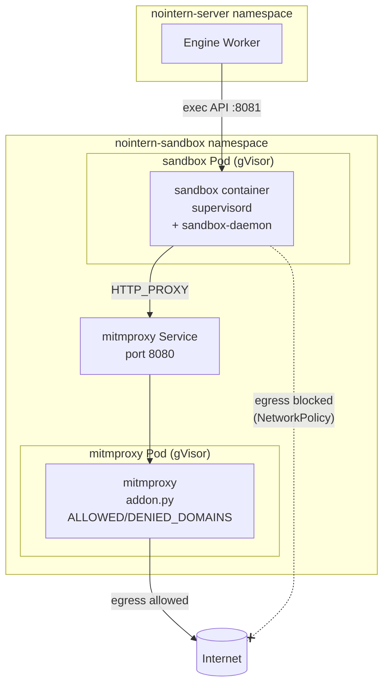
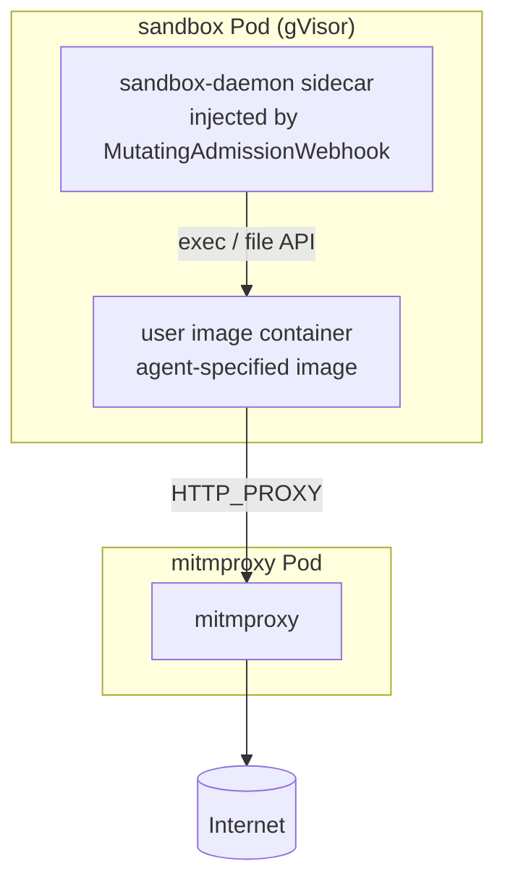

# gVisor Sandbox Design

## Current Implementation Status (2026-04-20)

| Phase | Status | Reference |
|---|---|---|
| Phase 1 — gVisor NodePool + RuntimeClass | Complete | PR #2262 · `infra/argocd/nointern-sandbox/base/runtimeclass.yaml` (`handler: runsc`) |
| Phase 2 — separate mitmproxy Pod + NetworkPolicy | Complete | PR #2263 · `agent_home_k8s.py::_ensure_mitmproxy_pod` (L841) / `networkpolicy.yaml` (sandbox-egress-base + mitmproxy-egress) |
| Phase 3 — remove bwrap | Complete | PR #2264, #2754 · all `bubblewrap`/`mitmproxy`/`socat` programs removed from Dockerfile/supervisord.conf · agent exec directly runs bash through sandbox-daemon |
| BYOC sandbox (user image + sidecar inject) | Not started | "BYOC sandbox" section of this document remains as future capability |

**No remaining structural drift.** `SeccompProfile` import in `agent_home_k8s.py` is for `runc`/`Kata` runtime profiles (`runtime_profile.py::RuncProfile.seccomp_profile`), and `_build_sandbox_security_context()` skips seccomp in gVisor runtime (L189-191).

Original implementation plan (file change list) moved to [gvisor-sandbox-impl-plan.md](gvisor-sandbox-impl-plan.md).

---

## Overview

Migrate current bwrap(bubblewrap)-based filesystem + network isolation to **gVisor**. At the same time, secure BYOC (Bring Your Own Cloud) sandbox capability.

### Problems Solved

| Problem | bwrap current | After gVisor |
|---|---|---|
| Container isolation | bwrap mount/net namespace | gVisor Sentry (syscall intercept) |
| BYOC support | impossible (bwrap conflicts in privileged environment) | possible (user image exec structure) |
| gVisor compatibility | bwrap + gVisor cannot be used together (rollback history exists) | use only gVisor |
| MITM proxy | bwrap --unshare-net + socat + UNIX socket | NetworkPolicy isolation + separate mitmproxy Pod |

---

## Architecture

### Basic sandbox (non-BYOC)



**sandbox Pod:**
- RuntimeClass: `gvisor`
- container: sandbox-daemon (exec API + file API)
- supervisord: runs only sandbox-daemon (mitmproxy, socat removed)
- EFS volume: `/mnt/agent-data`

**mitmproxy Pod:**
- RuntimeClass: `gvisor`
- container: mitmdump (`--mode regular@8080`)
- 1 Pod per agent (ALLOWED/DENIED_DOMAINS differ by agent)
- addon.py: domain filtering (keep existing logic)

### BYOC sandbox



- User image specified by agent setting (`container_image`)
- MutatingAdmissionWebhook automatically injects sandbox-daemon sidecar
- No warm pool (image pull on demand)
- No sudoer restriction — user responsibility

---

## Network Isolation

### NetworkPolicy Structure

```yaml
# sandbox Pod egress: allow only mitmproxy Pod + DNS
apiVersion: networking.k8s.io/v1
kind: NetworkPolicy
metadata:
  name: sandbox-egress-allow-proxy-only
spec:
  podSelector:
    matchLabels:
      app: agent-home
  policyTypes:
    - Egress
  egress:
    # mitmproxy Pod (same namespace)
    - to:
        - podSelector:
            matchLabels:
              app: agent-home-mitmproxy
      ports:
        - port: 8080
          protocol: TCP
    # mcp-egress-proxy (nointern-server namespace, keep existing)
    - to:
        - podSelector:
            matchLabels:
              app: mcp-egress-proxy
      ports:
        - port: 3128
          protocol: TCP
    # DNS
    - ports:
        - protocol: UDP
          port: 53
        - protocol: TCP
          port: 53

# mitmproxy Pod egress: allow internet (block private IP)
---
apiVersion: networking.k8s.io/v1
kind: NetworkPolicy
metadata:
  name: mitmproxy-egress
spec:
  podSelector:
    matchLabels:
      app: agent-home-mitmproxy
  policyTypes:
    - Egress
  egress:
    - to:
        - ipBlock:
            cidr: 0.0.0.0/0
            except:
              - 10.0.0.0/8
              - 172.16.0.0/12
              - 192.168.0.0/16
              - 127.0.0.0/8
              - 169.254.0.0/16
    - ports:
        - protocol: UDP
          port: 53
        - protocol: TCP
          port: 53
```

Direct external connection attempts from sandbox container bypassing mitmproxy → blocked by NetworkPolicy.

---

## Per-user File Isolation

**No isolation guarantee.** Privacy boundary is unified as bot access control (#2242).

User memory concept remains (`agents/{agent_id}/users/{user_id}/`):
- purpose is storing personalization (preferences, memory) by agent
- assumes "can be public to users who can access bot"

Agent recognition of user folder:
- System prompt: specify actual path (`/mnt/agent-data/agents/{agent_id}/users/{user_id}/`)
- Shell env: `$USER_DIR` shorthand
- **Implementation complete**: user-folder PR #2251~#2256

---

## Changes by Component

### supervisord.conf

```ini
# before
[program:mitmproxy]   # removed
[program:socat]        # removed
[program:sandbox-daemon]
[program:mcp-proxy]

# after
[program:sandbox-daemon]
[program:mcp-proxy]
```

### bwrap-exec

**Completely deleted.** Since gVisor provides container-level isolation, bwrap PID namespace / filesystem allow-list role is unnecessary.

### sandbox-daemon / executor.py

```python
# before
def _build_exec_cmd(command, user_id, settings):
    cmd = ["bwrap-exec", "--home-dir", ..., "--proxy-socket", ...]
    return cmd

# after
def _build_exec_cmd(command, user_id, settings):
    # directly run bash inside gVisor container
    # set only HOME, USER_DIR environment variables
    cmd = ["bash", "-c", command]
    return cmd
```

### agent_home_k8s.py

On sandbox Pod creation:
- add `runtime_class_name="gvisor"`
- remove `seccomp_profile` (gVisor handles kernel isolation)
- inject `HTTP_PROXY` env var: `http://agent-home-mitmproxy-{agent_id}.nointern-sandbox.svc:8080`
- add mitmproxy Pod + Service lifecycle (`_ensure_mitmproxy_pod`, `_delete_mitmproxy_pod`)

```python
# create mitmproxy Pod (created before sandbox Pod, wait readiness)
async def _ensure_mitmproxy_pod(
    self,
    agent_id: str,
    domain_config: SandboxDomainConfig,
    v1: CoreV1Api,
) -> None:
    # create mitmproxy Pod + Service
    # readiness probe: TCP 8080 port check
    # inject per-agent ALLOWED_DOMAINS, DENIED_DOMAINS env vars

# extend delete_agent()
async def delete_agent(self, agent_id: str) -> None:
    await self._delete_sandbox_pod(agent_id)
    await self._delete_mitmproxy_pod(agent_id)  # added
    # delete ConfigMap/Secret (existing)
```

### Dockerfile (agent-runtime)

```dockerfile
# removed
RUN apt-get install -y bubblewrap iproute2
COPY bwrap-exec /usr/local/bin/bwrap-exec
```

---

## Infrastructure

### gVisor NodePool (new)

AL2023 EC2NodeClass + Karpenter NodePool:
- AMI: AL2023 (Bottlerocket does not support gVisor)
- userData: install `runsc` + `containerd-shim-runsc`
- Register RuntimeClass `gvisor` in cluster
- Instance: c5/c6i Spot (see prior implementation af7a5ed)
- Isolate from general workloads with sandbox taint

### Keep Existing

- EFS PV (agent-home-efs): no change
- sandbox namespace/serviceaccount/RBAC: no change
- mcp-egress-proxy (proxy for MCP tools): no change

---

## Local Development

Allow local development without gVisor in Docker Compose.
- Direct bash execution inside Docker container (no isolation)
- gVisor isolation verification only in cluster E2E
- agent_home_docker.py: remove bwrap-exec, direct exec

---

## Implementation Plan

### Phase 1: Infrastructure — gVisor NodePool + RuntimeClass

- Add AL2023 EC2NodeClass / Karpenter NodePool
- Deploy RuntimeClass `gvisor`

### Phase 2: Separate mitmproxy Pod

- `agent_home_k8s.py`: mitmproxy Pod + Service lifecycle
- Update NetworkPolicy (allow sandbox → mitmproxy, allow mitmproxy → internet)

### Phase 3: Remove bwrap

- Dockerfile: remove bubblewrap, delete bwrap-exec
- supervisord.conf: remove mitmproxy, socat
- executor.py: remove bwrap cmd, direct bash execution
- agent_home.py: remove build_bwrap_cmd()
- sandbox Pod spec: add runtimeClassName, HTTP_PROXY env var

### Phase 4: Verification

- Single agent end-to-end test
- Multiple agents running simultaneously
- Network isolation verification (attempt mitmproxy bypass)
- Performance measurement (gVisor overhead)

---

## Alternatives Considered

### A. iptables REDIRECT (inside gVisor)

**Rejected.** gVisor iptables has only partial support — NAT REDIRECT checksum bug, `SO_ORIGINAL_DST` UDP unsupported, eBPF inaccessible due to gVisor netstack isolation.

### B. socat + UNIX socket (keep current method)

**Rejected.** Without bwrap, `--unshare-net` (forced network isolation) also disappears. App can bypass mitmproxy. Mounting Host UDS into gVisor container is also unstable.

### C. mitmproxy DaemonSet (one per node)

**Rejected.** ALLOWED/DENIED_DOMAINS differ by agent, so shared DaemonSet cannot filter domains per agent.

### D. Bot access control + keep file isolation

**Rejected (file isolation part).** Technically difficult to maintain after BYOC + gVisor migration. Isolation meaning is also weakened in public channels (see #2241 discussion).
